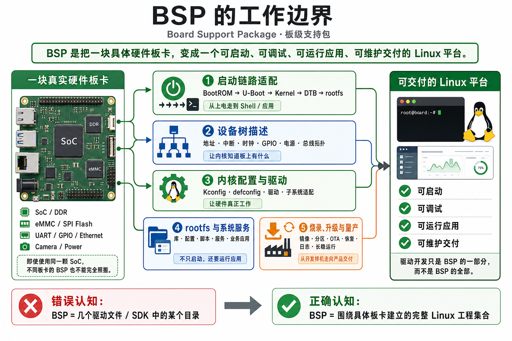
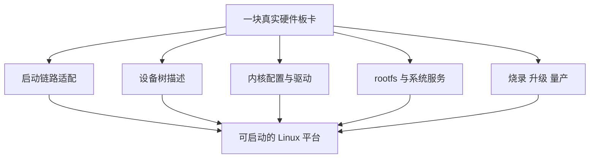
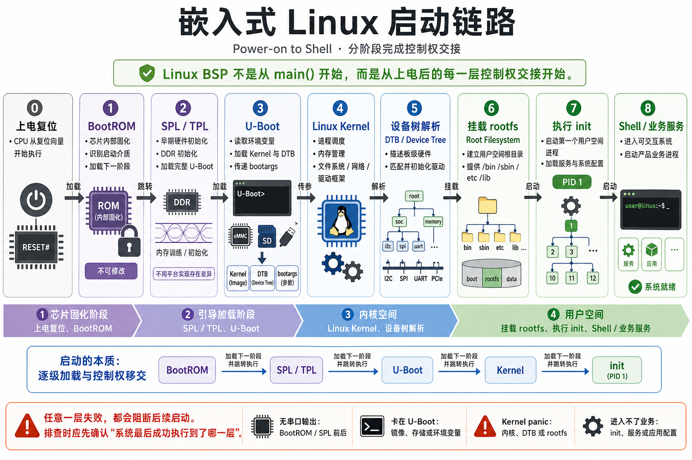
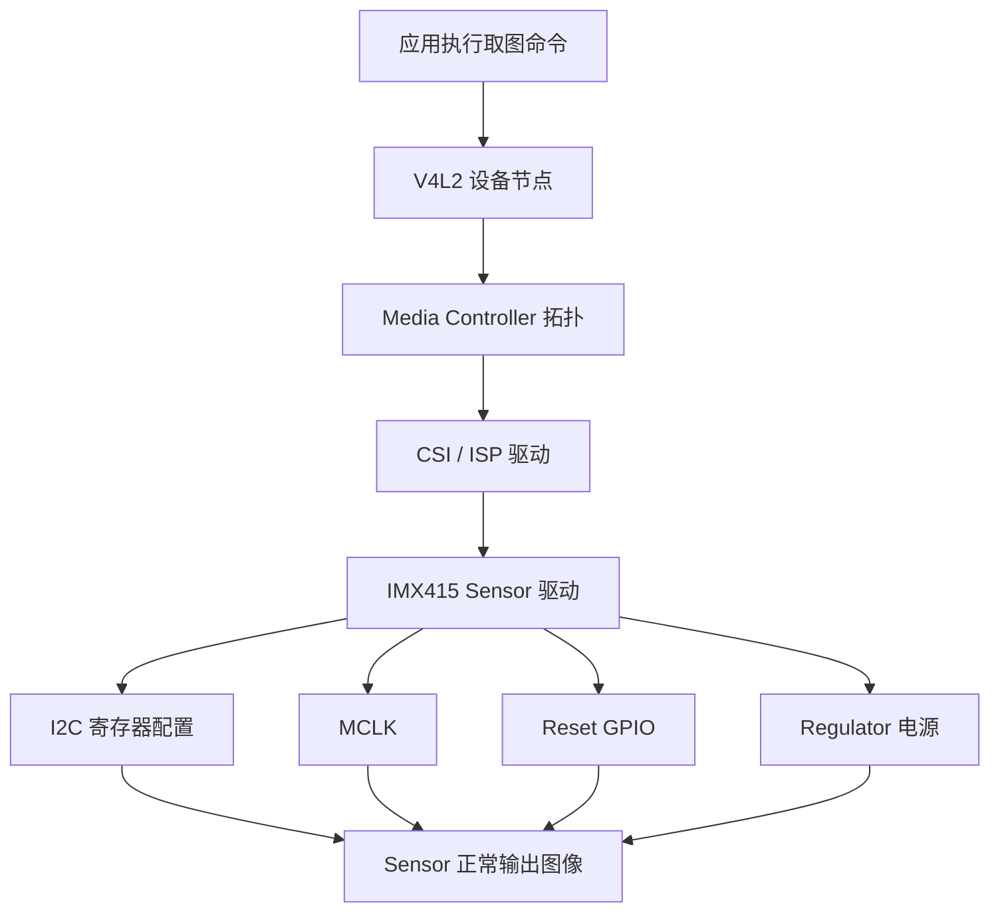
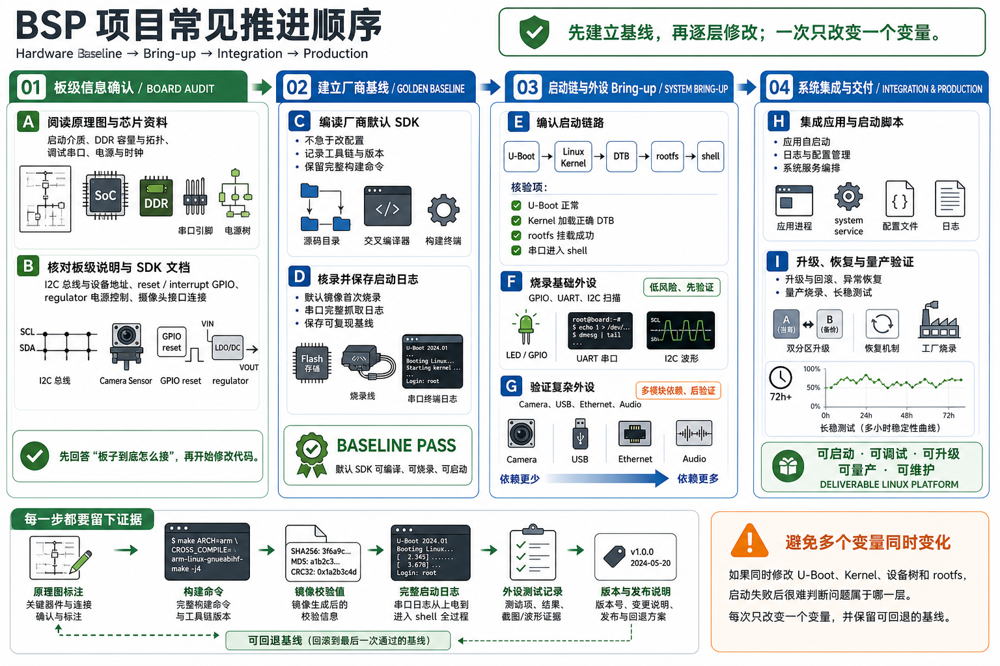

做 MCU 的时候，我们经常说“把板子跑起来”。这句话在单片机项目里通常意味着：时钟配置正确，启动文件能跳到 `main()`，串口能打印，GPIO 能翻转，外设能按照寄存器配置工作，最后业务代码开始执行。

到了嵌入式 Linux，这句话的含义会明显变大。因为 Linux 系统不是一个简单的裸机程序，也不是一个 RTOS 工程直接从 `main()` 开始跑。它是一条很长的链路：芯片上电后先经过 BootROM，再经过 U-Boot，再加载 Linux 内核，再挂载根文件系统，最后启动用户态服务。任何一层出问题，板子都可能卡住。

BSP（Board Support Package，板级支持包）工程师要解决的，就是这条链路能不能在一块真实硬件上稳定跑通。

这篇是 Linux BSP 系列的第一篇，先不急着写驱动代码，而是把一个更基础的问题讲清楚：**BSP 到底是什么，BSP 工程师每天在做什么，为什么 MCU 工程师进入 Linux 后需要换一套思维方式。**

## 1. BSP 不是一个驱动文件，而是一套板级工程

BSP 的全称是 **Board Support Package**，中文一般叫**板级支持包**。

初学者容易把 BSP 理解成“几个驱动文件”或者“厂商 SDK 里的某个目录”，这不准确。BSP 更像是一套围绕具体硬件板卡建立起来的工程集合。它的目标是让 Linux 能够正确启动、识别硬件、驱动外设，并最终支撑上层应用运行。


如果用一句话定义：

**BSP 是把一块具体硬件板卡，变成一个可启动、可调试、可运行应用、可维护交付的 Linux 平台。**

这里有几个关键词要拆开看。

**具体硬件板卡**：BSP 一定依赖板子。不同板子的 DDR、存储、串口、摄像头、网口、GPIO、电源设计都可能不同，即使使用同一颗 SoC，BSP 也不能完全照搬。

**可启动**：系统必须能从上电走到 shell 或应用启动。中间包括 BootROM、U-Boot、kernel、dtb、rootfs 等多个环节。

**可调试**：出了问题要能定位。串口日志、dmesg、设备树、sysfs、debugfs、示波器、逻辑分析仪都可能会用到。

**可运行应用**：Linux 起来只是第一步，最终还要让业务进程、脚本、服务、库文件、配置文件都能正常工作。

**可维护交付**：产品不能只在工程师电脑上跑一次。它要能升级、恢复、记录日志、量产烧录、长期稳定运行。

所以，BSP 不是“写一个 led 驱动”这么窄。写驱动只是 BSP 的一部分。



【图1：BSP 的工作边界。图中展示硬件板卡如何经过启动链路、设备树、驱动、rootfs、烧录升级，最终形成可交付 Linux 平台。】

## 2. 从 MCU 到 Linux，最先变化的是启动模型

做 MCU 时，启动过程通常比较直接。

以 Cortex-M 为例，上电后 CPU 从固定地址读取向量表，取出初始栈指针和 Reset_Handler 地址，然后执行启动文件。启动文件完成数据段搬移、BSS 清零、SystemInit，最后跳到 `main()`。

这个过程可以简化成：


【图2：MCU 常见启动模型。重点是路径短，控制权很快进入用户工程。】

Linux 平台的启动链路长得多。以 RV1126 这类应用处理器平台为例，上电后并不会直接进入你的应用，也不会直接进入 Linux 内核，而是要分阶段启动。

一个典型嵌入式 Linux 启动链路可以概括成：



这里第一次出现几个重要概念。

**BootROM**：芯片内部固化的一小段启动代码。它由芯片厂商写好，用户不能修改。它负责在最早期识别启动介质，并加载下一阶段引导程序。

**SPL / TPL**：U-Boot 的早期小型引导阶段。它们负责完成 DDR 初始化、加载完整 U-Boot 等工作。不同平台命名和实现会有差异，具体以厂商 SDK 为准。

**U-Boot**：嵌入式 Linux 常见的引导加载程序。它负责初始化必要硬件、读取环境变量、加载内核镜像和设备树，并把启动参数传给 Linux 内核。

**Linux Kernel**：Linux 内核本体。它负责进程调度、内存管理、文件系统、网络协议栈、驱动框架等核心能力。

**rootfs**：root filesystem，根文件系统。它包含 `/bin`、`/sbin`、`/etc`、`/lib` 等目录，是 Linux 用户空间运行的基础。

这条链路说明了一个关键事实：Linux BSP 不是从 `main()` 开始的，而是从**上电后的每一层控制权交接**开始的。

## 3. 为什么 Linux 需要设备树

在 MCU 项目里，我们经常直接在代码里写外设初始化。

例如一个 GPIO LED，可能直接写：某个端口开启时钟，某个引脚配置成输出，然后设置高低电平。外设信息通常散落在头文件、初始化代码和用户逻辑里。

Linux 不推荐这样做。Linux 内核希望驱动代码尽量通用，而板级差异通过**设备树**描述。

设备树的英文是 **Device Tree**，常见文件后缀是 `.dts` 和 `.dtsi`。它的作用是告诉内核：这块板子上有什么硬件，这些硬件挂在哪条总线上，寄存器地址是多少，使用哪个中断，哪个 GPIO 是复位脚，哪个 clock 要打开，哪个 regulator 提供电源。

可以这样理解：

- MCU 里常常是“代码直接描述硬件”；
- Linux 里更倾向于“设备树描述硬件，驱动读取描述后工作”。

举一个简化例子。假设板子上有一个 I2C 设备，Linux 不是让驱动随便猜它在哪，而是在设备树里写清楚：

```dts
i2c2 {
    status = "okay";

    sensor@1a {
        compatible = "sony,imx415";
        reg = <0x1a>;
        reset-gpios = <&gpio1 12 GPIO_ACTIVE_LOW>;
        clocks = <&cru CLK_MIPI_CAMARAOUT_M0>;
    };
};
```

这段内容不一定就是 RV1126 SDK 中的真实写法，具体属性要以厂商 SDK 和 binding 文档为准。这里重点看思想：

- `i2c2` 表示设备挂在 I2C2 控制器下面；
- `status = "okay"` 表示这个控制器启用；
- `compatible = "sony,imx415"` 用来匹配对应驱动；
- `reg = <0x1a>` 表示 I2C 地址；
- `reset-gpios` 描述复位脚；
- `clocks` 描述摄像头需要的时钟。

驱动 probe 时，会根据 `compatible` 找到这个设备，再读取这些属性完成初始化。

这就是 Linux BSP 的核心之一：**设备树必须和原理图一致，驱动才有可能正确工作。**

## 4. 驱动不是孤立运行的

初学 Linux 驱动时，很多人会从字符设备开始：注册设备号，实现 `open/read/write/ioctl`，然后用户态操作 `/dev/xxx`。这个路径适合理解内核模块和用户态交互，但它不能代表真实 BSP 的全部。

真实板级驱动通常会同时牵涉多套内核框架。例如摄像头 IMX415 bring-up，至少会碰到：

- I2C：读取和写入 sensor 寄存器；
- pinctrl：配置引脚复用；
- clock：给 sensor 提供 MCLK；
- regulator：打开模拟电源、数字电源、IO 电源；
- reset GPIO：控制 sensor 复位脚；
- V4L2 subdev：把 sensor 接入 Linux 视频框架；
- media controller：描述 sensor、CSI、ISP 之间的拓扑关系；
- DMA buffer：把图像帧在内核和用户态之间传递。

所以，当你看到“摄像头不出图”时，不能只盯着 sensor 驱动源码。它可能是 I2C 地址错了，也可能是 MCLK 没出来，也可能是 reset 电平反了，也可能是 MIPI endpoint 配错了。

BSP 调试的思路必须是链路化的。



【图4：摄像头 bring-up 的典型链路。应用层看到的是视频节点，底层实际依赖 I2C、时钟、复位、电源和 media 拓扑。】

## 5. rootfs 不是“文件复制进去就行”

很多初学者会把 rootfs 理解成“一堆文件”。这只说对了一半。

rootfs 是 Linux 用户空间的根。它决定了系统启动后有什么命令、有什么库、执行哪个 init、启动哪些脚本、加载哪些配置。

在嵌入式 Linux 里，rootfs 常见来源包括 Buildroot、Yocto、Debian 裁剪系统等。RV1126 这类厂商 SDK 常见的是基于 Buildroot 或厂商定制 rootfs 的流程。

rootfs 至少要回答这些问题：

- `/sbin/init` 是否存在；
- `/etc/inittab` 或 systemd service 是否正确；
- 驱动依赖的固件是否放在 `/lib/firmware`；
- 应用依赖的动态库是否齐全；
- 启动脚本是否会拉起业务进程；
- 日志写到哪里；
- 配置文件如何保存；
- 系统异常后如何恢复。

所以 BSP 工程师不能只管内核不管 rootfs。很多“驱动没问题但应用跑不起来”的问题，最后都落在 rootfs：库缺失、权限不对、节点没创建、脚本没执行、配置路径错了。

## 6. BSP 的典型工作流

一个实际 BSP 项目通常不是从写代码开始，而是从确认板级信息开始。

第一步是看硬件资料。至少要拿到原理图、芯片资料、板级说明、SDK 文档。你要知道：启动介质是什么，串口接在哪，DDR 多大，摄像头挂在哪条 I2C，reset 脚是哪一个，电源由哪个 regulator 控制。

第二步是跑通厂商 SDK。先不要急着改。先用默认配置编译一次，烧录一次，保存完整启动日志。这一步的目标是建立基线。

第三步是确认启动链路。看 U-Boot 是否正常，kernel 是否加载正确 dtb，rootfs 是否挂载成功，串口是否进入 shell。

第四步是逐个验证外设。先验证低风险外设，比如 GPIO、UART、I2C 扫描，再验证复杂外设，比如摄像头、USB、网络、音频。

第五步是做系统集成。包括应用自启动、日志、配置、升级、异常恢复、量产烧录。

这个流程可以画成：



## 7. 初学者最应该先掌握的五个能力

### 7.1 会看启动日志

串口日志是 BSP 的第一现场。板子从上电到进入 shell，中间每一层都会留下线索。

常见分界点包括：

- DDR 初始化日志；
- U-Boot 版本信息；
- `Hit any key to stop autoboot`；
- `Starting kernel`；
- Linux 内核版本；
- `Freeing unused kernel memory`；
- init 脚本输出；
- 登录提示或 shell 提示符。

初学时不要只看最后有没有 shell，而要学会把日志切成几段。卡在哪一段，就先查哪一层。

### 7.2 会读设备树

设备树是 Linux BSP 的硬件说明书。你至少要能看懂：

- `compatible` 用来匹配驱动；
- `reg` 描述地址或总线地址；
- `interrupts` 描述中断；
- `pinctrl-0` 描述默认引脚状态；
- `clocks` 描述时钟来源；
- `resets` 描述复位控制；
- `*-supply` 描述电源；
- `status` 决定节点启用还是禁用。

看设备树时一定要对照原理图。只看代码不看硬件，很容易把问题带偏。

### 7.3 会确认驱动是否 probe

probe 是 Linux 驱动模型里的一个核心动作。简单说，probe 就是“内核发现某个设备和某个驱动匹配后，调用驱动的初始化函数”。

如果设备树写了节点，但驱动没有 probe，外设通常不会工作。

常见检查方法包括：

```bash
dmesg | grep -i imx415
dmesg | grep -i i2c
ls /sys/bus/i2c/devices
ls /sys/bus/platform/devices
```

这些命令不是固定答案，而是思路示例。真正调试时，要根据设备类型选择对应路径。

### 7.4 会区分内核态和用户态

Linux 把系统分成内核态和用户态。

**内核态**负责硬件资源和核心机制，比如驱动、中断、调度、内存、文件系统。

**用户态**负责应用和服务，比如 shell、业务程序、配置脚本、测试工具。

一个问题可能发生在内核态，也可能发生在用户态。例如 `/dev/video0` 不存在，多半要先看内核驱动和设备树；但 `/dev/video0` 存在，应用打开失败，就要继续看权限、格式、参数、用户态库。

### 7.5 会建立最小复现

BSP 问题最怕一次改很多东西。比如同时改设备树、驱动、rootfs、应用，最后出问题就很难判断原因。

更稳妥的方式是每次只改一个变量，并保留日志：

- 改设备树后，只验证节点是否生效；
- 改驱动后，只验证 probe 是否进入；
- 改 rootfs 后，只验证脚本是否执行；
- 改应用后，只验证依赖和参数。

这套方法看起来慢，但对初学者非常重要。

## 8. 以 RV1126 + IMX415 为例，BSP 会贯穿哪些内容

后面围绕 RV1126 + IMX415，BSP 工作会逐步展开。

启动相关内容会关注：系统如何从上电走到 shell，U-Boot 如何加载内核，内核如何拿到设备树，rootfs 如何挂载。

设备树相关内容会关注：DTS / DTSI 的包含关系，pinctrl、clock、reset、regulator 如何描述板级资源。

基础驱动相关内容会关注：内核模块、字符设备、misc、sysfs、GPIO、input、中断、定时器、同步机制。

总线外设相关内容会关注：I2C、SPI、UART、PWM、ADC、watchdog、DMA 和缓存一致性。

高级子系统会关注：设备模型、I/O 映射、IOMMU、块设备、MTD/UBI、网络、USB、V4L2、ASoC、电源管理、性能分析。

系统集成会关注：Buildroot、启动脚本、日志、看门狗、升级、量产烧录、异常恢复。

这些内容看起来很多，但主线只有一条：**让真实硬件在 Linux 下可靠工作。**

## 9. 学这一系列时，应该怎么验证

这类文章不能只看概念。每学一块，都要尽量落到可观察结果上。

建议你建立一个调试记录文件，每次实验至少记录：

- SDK 版本；
- kernel 版本；
- U-Boot 版本；
- 板卡型号；
- 修改了哪些文件；
- 编译命令；
- 烧录方式；
- 启动日志；
- 验证命令；
- 异常现象；
- 最终结论。

例如最基础的记录可以这样写：

```text
实验目标：确认系统能从 U-Boot 启动到 shell
板卡：RV1126 + IMX415 开发板，具体型号待填写
SDK：待填写
Kernel：待填写
U-Boot：待填写
操作：编译默认 SDK，烧录完整镜像，串口保存日志
验证：看到 U-Boot 日志、Starting kernel、rootfs 启动、shell 提示符
结论：启动链路基线建立完成
```

初学阶段不要怕记录麻烦。BSP 的很多问题，最后靠的就是这些细节。

## 10. 本篇小结

这一篇先建立 BSP 的整体视角。

BSP 不是某一个驱动文件，也不是单纯编译内核。它是一套板级工程，目标是把真实硬件变成可启动、可调试、可运行应用、可维护交付的 Linux 平台。

从 MCU 转到 Linux，最重要的变化是：问题不再只发生在一个 `main()` 工程里，而是分布在启动链路、设备树、内核驱动、rootfs 和用户态服务之间。

初学者最先要建立的能力，不是马上写复杂驱动，而是会看启动日志、会读设备树、会判断驱动是否 probe、会区分内核态和用户态、会建立最小复现。

把这几个能力打牢，后面再看 U-Boot、设备树、I2C、SPI、V4L2、USB、网络、rootfs 和升级，就不会变成一堆散乱知识点，而是一条完整的工程链路。

**里程碑检查：**

- [ ] 能用自己的话解释 BSP 不是单个驱动，而是一套板级工程；
- [ ] 能画出嵌入式 Linux 从上电到用户态服务启动的基本链路；
- [ ] 能说明设备树为什么存在，以及它和驱动是什么关系；
- [ ] 能说清 probe 的基本含义；
- [ ] 能列出一个 BSP 问题的最小调试闭环。

**练习：**

1. 对比 MCU 启动流程和 Linux 启动流程，写出两者最大的三个差别。
2. 找一份你手上的 Linux 启动日志，把它按 U-Boot、kernel、rootfs 三段切开。
3. 找一个设备树节点，标出 `compatible`、`reg`、`status` 分别表示什么。
4. 分析一个问题：如果一个 I2C 设备没有 probe 成功，你会按什么顺序排查？

> 🏷️ Linux BSP｜RV1126｜IMX415｜U-Boot｜设备树｜驱动开发｜rootfs｜板级 bring-up
