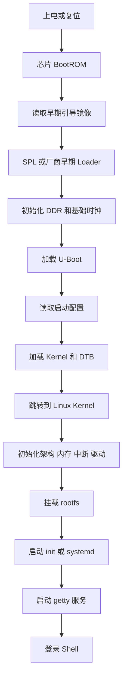
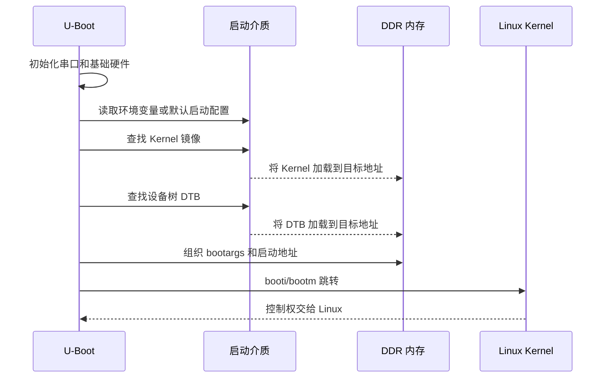

Linux 设备从按下电源键到出现 Shell，通常只需要几秒钟。但对 BSP 工程师来说，这几秒并不是一个程序完成的，而是由芯片内部 BootROM、早期引导程序、U-Boot、Linux Kernel、设备树、根文件系统和用户空间初始化程序共同完成的。

启动链路的价值，不只是帮助我们理解“系统怎么开机”。它更直接地决定了遇到黑屏、串口无输出、内核卡死、根文件系统挂载失败、服务没有启动时，应该从哪一层开始排查。

本文以 RV1126 + Linux SDK 设备为主线。不同厂商 SDK 的镜像名称、分区布局、启动介质和打包方式可能不同，具体版本应以实际 SDK、板卡原理图和厂商文档为准。本文把稳定不变的启动逻辑讲清楚，并把需要依赖具体平台的内容明确标出。

## 1. 先建立完整启动模型

Linux 启动可以看成一次连续的控制权交接：每个阶段完成自己能够完成的初始化工作，然后把下一阶段所需的镜像、参数和硬件状态准备好。



这里有一个非常重要的判断原则：**“内核启动了”与“系统可用了”不是一回事。** 内核日志出现，只能证明控制权已经进入 Linux；只有根文件系统挂载成功、用户空间第一个进程启动、控制台服务正常运行，才算真正进入可交互系统。

### 1.1 各阶段的职责

| 阶段 | 代码所在位置 | 主要职责 | 典型失败表现 |
|---|---|---|---|
| BootROM | 芯片内部 ROM | 选择启动源，读取早期镜像 | 完全无串口输出或只有极少字符 |
| SPL/早期 Loader | 启动介质中的镜像 | 初始化 DDR、时钟和最小运行环境 | 输出停在 DDR 初始化附近、反复重启 |
| U-Boot | 启动介质中的引导镜像 | 读取环境、加载 Kernel/DTB、组织 bootargs | 进入 U-Boot 命令行或加载镜像报错 |
| Linux Kernel | boot 分区或专用分区 | 初始化 CPU、内存、驱动和文件系统 | 出现内核日志后卡死或 Panic |
| DTB | 与 Kernel 配套的设备树二进制 | 描述板级硬件资源和连接关系 | 设备 probe 失败、时钟/GPIO/总线错误 |
| rootfs | 存储分区或 UBI 卷 | 提供 `/sbin/init`、库、脚本和工具 | `VFS: Unable to mount root fs` |
| init/getty | rootfs 用户空间 | 启动服务、创建登录终端 | 内核结束但没有登录提示符 |

### 1.2 与 MCU 启动的区别

在 Cortex-M MCU 中，复位后通常从固定地址取向量表，启动文件完成栈指针和 `.data`、`.bss` 初始化，然后进入 `main()`。Linux 应用处理器的启动环境复杂得多：DDR 可能尚未可用，启动介质需要识别，内核和设备树需要加载，用户空间还需要独立的根文件系统。

因此，Linux BSP 的第一种基本思维方式是：**不要把“开机”当成一个函数调用，而要把它当成一条有证据、有边界的状态链。**

## 2. 从上电到早期 Loader：BootROM 做了什么

BootROM 是芯片厂商固化在芯片内部的一段代码。它在复位释放后最先运行，通常不能由普通用户修改。它的实现细节属于芯片内部设计，但从工程视角可以把它的行为抽象为四步：

1. 读取启动模式相关的硬件配置；
2. 选择 eMMC、SD、SPI Flash、SPI NAND 等启动来源；
3. 按芯片规定的介质布局寻找早期引导镜像；
4. 将镜像装载到片上 SRAM 或其他可用地址，并跳转执行。

BootROM 阶段一般还不能依赖 DDR。原因是 DDR 控制器尚未完成初始化，而更复杂的引导程序和 Linux 镜像通常都需要外部内存。因此，启动介质上的早期镜像必须足够小，并且具备在有限内存环境下初始化 DDR 的能力。

### 2.1 BootROM 阶段的排查边界

如果完全没有串口输出，不能直接断定是 BootROM 出错。还要先排除以下问题：

- 板卡是否真的上电，主电源和复位信号是否满足要求；
- USB-UART 转换器的 TX/RX/GND 是否接对；
- 串口电平是否匹配，终端波特率是否按板卡要求设置；
- 启动拨码、启动按键或启动电阻是否选择了预期介质；
- 介质中是否确实烧录了与芯片匹配的启动镜像。

BootROM 的具体输出格式可能因芯片版本和厂商实现而不同。没有输出时，优先使用示波器或逻辑分析仪确认复位释放、串口 TX 活动和启动介质访问，而不是立即修改 Linux 代码。

## 3. SPL 和 DDR 初始化：最容易被低估的一跳

很多 RV1126 SDK 会把早期启动代码称为 SPL、Loader 或厂商自定义名称。名称可以不同，但它们承担的核心任务相似：在有限运行环境下完成 DDR、时钟、引脚和少量存储控制器初始化，然后加载功能更完整的 U-Boot。

DDR 初始化通常包含多个环节：

- 配置 DDR 控制器和 PHY；
- 设置时钟、训练参数和时序参数；
- 执行读写校准或训练流程；
- 验证基本内存访问是否可靠；
- 将更大的引导程序装载到 DDR 中。

这也是为什么“板子型号相近”并不代表 DDR 参数可以直接复用。DDR 器件型号、颗粒组织、走线、频率和板级布局都会影响初始化参数。具体参数必须来自当前板卡的参考设计、SDK 配置或厂商验证结果。

### 3.1 DDR 阶段的典型现象

| 现象 | 更可能的方向 | 第一组动作 |
|---|---|---|
| 完全没有任何输出 | 供电、复位、串口、启动模式或镜像 | 测电源和复位，确认串口，重新核对启动介质 |
| 只输出 BootROM 信息 | 早期镜像未找到或校验失败 | 检查镜像位置、介质类型和烧录偏移 |
| 输出停在 DDR training | DDR 参数、供电、时钟或硬件信号完整性 | 核对板卡 DDR 配置，降低频率仅用于定位 |
| 反复打印并重启 | 看门狗、异常复位或 DDR 访问异常 | 记录完整日志，测复位原因和供电稳定性 |
| DDR 成功后加载 U-Boot 失败 | 存储读写、镜像地址或镜像损坏 | 校验介质内容和加载地址 |

“降低 DDR 频率后能启动”只能说明时序或信号裕量值得怀疑，不能作为最终修复。量产配置必须回到正确的板级参数和稳定性验证。

## 4. U-Boot：启动链路的控制台

U-Boot 运行在 Linux 之前，但它已经是一个功能相对完整的引导环境。它可以访问存储介质、读取环境变量、设置内存地址、加载镜像，并将 Kernel 所需的参数传递给内核。

最常见的 U-Boot 工作顺序如下：



### 4.1 需要重点观察的三个对象

**第一是镜像路径和加载结果。** U-Boot 必须从正确的分区或文件系统读取 Kernel 与 DTB。镜像能否读出，要看介质类型、分区布局、文件系统支持和地址配置。

**第二是 `bootargs`。** 它是 U-Boot 传给内核的命令行，常见内容包括串口控制台、根文件系统位置、根文件系统类型、日志级别和早期调试开关。不同 SDK 的变量名和默认值可能不同，不能照抄其他板卡配置。

**第三是 Kernel 与 DTB 的匹配。** Kernel 描述的是通用内核代码，DTB 描述的是当前板卡硬件。加载了错误的 DTB，内核可能可以启动，但时钟、GPIO、存储、摄像头或网络设备会在后续阶段失败。

### 4.2 常用定位命令

下面的命令是通用定位思路，具体命令是否可用取决于当前 U-Boot 的配置：

```text
printenv
printenv bootcmd
printenv bootargs
mmc list
mmc info
mmc part
fatls mmc 0:1
ext4ls mmc 0:2 /
md ${kernel_addr_r} 0x20
```

如果 SDK 使用 NAND、UBI、SPI Flash 或厂商封装命令，命令集会有所不同。定位时先通过 `help` 确认命令，再查看当前变量，不要假设所有设备都使用 `mmc` 和 `ext4load`。

### 4.3 U-Boot 阶段的判断标准

可以进入 U-Boot 命令行，说明早期 Loader 至少已经完成了基本执行环境和 U-Boot 装载。但这并不表示 Linux 一定能启动。

在 U-Boot 阶段应形成一份最小记录：

| 记录项 | 需要确认的内容 |
|---|---|
| 启动介质 | 当前实际从哪里启动 |
| Kernel | 文件或分区是否存在，读取长度是否合理 |
| DTB | 是否加载了当前板卡对应版本 |
| 地址 | Kernel、DTB、initrd 是否互相覆盖 |
| bootargs | console、root、rootfstype 是否匹配 |
| 启动命令 | 使用 `booti`、`bootm` 还是厂商封装命令 |

## 5. Kernel 接管：从架构初始化到设备驱动

U-Boot 跳转到 Kernel 后，控制权进入 Linux。内核先完成架构相关的早期初始化，再逐步建立内存管理、中断控制、定时器、调度器、设备模型和各类驱动。

启动阶段常见的逻辑顺序可以概括为：

1. 读取并解析启动参数；
2. 建立页表和内存管理基础；
3. 初始化异常、中断和系统定时器；
4. 初始化设备模型和总线框架；
5. 解析设备树中的硬件节点；
6. 注册并匹配驱动；
7. 准备文件系统和根设备；
8. 挂载 rootfs 并启动用户空间。

设备树在这里承担的是“硬件描述入口”的角色。设备树节点中的 `reg`、`interrupts`、`clocks`、`resets`、`pinctrl`、`gpios`、`regulators` 和 endpoint 等属性，会影响驱动能否取得正确资源。一个摄像头驱动 probe 失败，根因可能是 I2C 地址错误，也可能是电源、时钟、复位、引脚复用或 MIPI endpoint 描述不完整。

### 5.1 Kernel 日志的阅读方法

阅读串口日志时，先做阶段切分，再看具体错误。可以使用以下方法：

- 找到第一个明确的 Linux 版本、CPU 或内存初始化信息，确认 Kernel 已接管；
- 找到设备树、时钟、存储控制器和根文件系统相关日志；
- 区分 `warning`、`probe defer`、普通设备缺失和导致启动中止的 `panic`；
- 记录错误出现前的最后一个成功阶段；
- 对照启动参数确认根设备和控制台是否正确。

常见日志与含义如下：

| 日志特征 | 说明 | 处理方向 |
|---|---|---|
| `Starting kernel` 后无输出 | Kernel 未运行、串口切换错误或早期异常 | 核对加载地址、console 和 earlycon |
| `Kernel panic` | 内核遇到无法继续的致命错误 | 保存完整日志，定位 panic 栈和根因 |
| `VFS: Unable to mount root fs` | 根文件系统未找到或类型不匹配 | 检查 `root=`、驱动、分区和文件系统 |
| `Waiting for root device` | 内核等待根设备出现 | 检查存储控制器、时钟、复位和驱动配置 |
| `deferred probe pending` | 依赖资源尚未就绪 | 继续查找对应 clock、regulator、GPIO 等依赖 |
| 某设备 `probe failed` | 驱动匹配但初始化失败 | 对照设备树、硬件连接和驱动日志 |

## 6. rootfs、init 与 Shell 的关系

Kernel 能运行并不等于用户空间已经启动。内核必须先找到并挂载根文件系统，然后启动用户空间第一个进程。这个进程通常是 BusyBox `init`、`systemd` 或 SDK 定制的初始化程序。

启动用户空间至少需要满足以下条件：

- 根设备存在并可访问；
- 文件系统格式与内核支持一致；
- rootfs 中存在可执行的 init；
- init 所需的动态库、配置和脚本完整；
- 控制台设备名称与 `console=` 参数匹配；
- getty 或其他登录服务已经启动。

如果内核已经打印大量日志，随后出现 `VFS: Unable to mount root fs`，优先查根设备、分区布局、文件系统驱动和启动参数。如果出现 `No init found`，则检查 `/sbin/init`、`/etc/init`、BusyBox 链接和 ELF 动态加载器。如果系统已经运行但看不到登录提示，检查 getty 配置、串口设备名和终端服务。

### 6.1 从 Kernel 到 Shell 的证据链


“没有 Shell”不是一个足够具体的故障描述。至少要进一步区分：没有挂载 rootfs、没有找到 init、init 启动失败、getty 没启动、串口控制台参数错误，还是 Shell 已经运行但输出到了另一个终端。

## 7. 一套可执行的串口排查流程

拿到一份启动失败日志时，建议按下面的顺序建立事实，而不是先修改配置。

### 第一步：保存完整日志

使用终端软件打开串口并关闭自动清屏，记录从上电到停止位置的完整输出。最好同时记录板卡型号、启动介质、镜像版本、串口参数和复现次数。

日志中不要只截取最后十行。很多错误的真正原因会出现在更早的位置，例如 regulator 没有注册、时钟初始化失败或存储控制器没有 probe 成功。

### 第二步：标记最后一个成功阶段

用下面的边界进行标记：

```text
[ ] 有 BootROM 或早期 Loader 迹象
[ ] DDR 初始化成功
[ ] U-Boot Banner 出现
[ ] U-Boot 成功加载 Kernel
[ ] Kernel Banner 出现
[ ] 根设备被识别
[ ] rootfs 挂载成功
[ ] init 启动
[ ] login 或 Shell 出现
```

最后一个已确认成功的阶段，就是下一轮排查的起点。例如已经看到 Kernel Banner，就不应再优先修改 BootROM；已经看到 rootfs 挂载成功，就应重点看 init、getty 和用户空间配置。

### 第三步：确认是否为硬件问题

如果现象是完全无输出或随机重启，要同时检查软件和硬件：

- 测量主电源、DDR 电源和复位信号；
- 确认串口电平、地线和交叉连接；
- 检查启动拨码和介质供电；
- 重新烧录已知可用的官方镜像；
- 通过另一块已验证板卡对比串口和启动介质。

### 第四步：在 U-Boot 中验证镜像和参数

优先确认四件事：

1. 当前启动介质和分区是否正确；
2. Kernel 和 DTB 是否确实存在；
3. 加载后两个镜像没有互相覆盖；
4. `bootargs` 中的控制台和根文件系统参数与当前布局一致。

### 第五步：进入 Kernel 后只改一个变量

如果 Kernel 能启动，建议一次只改变一个变量，例如只替换 DTB、只修改 `root=` 或只打开早期串口日志。每次修改都记录镜像版本和现象，避免多项改动后无法判断哪一个改变产生了效果。

## 8. 故障定位矩阵

| 现象 | 可能所在层 | 优先检查 | 不要先做的事 |
|---|---|---|---|
| 完全无串口输出 | 供电、复位、串口、BootROM | 电源、复位、TX/RX、启动模式 | 直接修改应用驱动 |
| 早期输出后停在 DDR | SPL/Loader、DDR | DDR 参数、板级配置、供电和时钟 | 先改 rootfs |
| 进入 U-Boot 但不启动 | U-Boot 配置或镜像 | `bootcmd`、`bootargs`、Kernel、DTB | 先重编整个 Kernel |
| Kernel Banner 都没有 | 加载地址、启动命令、串口参数 | 加载地址、镜像类型、console/earlycon | 先排查用户空间服务 |
| Kernel 启动后找不到根设备 | 存储驱动、分区或 bootargs | `root=`、分区、文件系统驱动 | 先改摄像头设备树 |
| rootfs 挂载后无 login | init/getty/console | `/sbin/init`、getty、console 设备 | 先怀疑 DDR |
| Shell 可用但摄像头不工作 | DTB、sensor、MIPI、ISP | 电源、时钟、I2C、endpoint、驱动日志 | 反复烧录整包镜像 |
| 能启动但随机重启 | 供电、看门狗、DDR、内核异常 | 复位原因、内核日志、硬件波形 | 只增加日志而不记录复位原因 |

## 9. 镜像、分区和版本管理必须一起看

启动失败经常不是某一份文件单独错误，而是多个产物不匹配。例如 U-Boot 来自一个 SDK，Kernel 来自另一个分支，DTB 又来自第三个版本，最终可能表现为设备树资源错误、根分区参数错误或驱动 ABI 不兼容。

每次测试至少要记录以下信息：

| 类别 | 记录内容 |
|---|---|
| 硬件 | 板卡版本、DDR 型号、启动介质、摄像头是否连接 |
| U-Boot | Git 提交、配置目标、编译时间 |
| Kernel | Git 提交、配置文件、编译时间 |
| DTB | 来源文件、是否重新编译、对应板卡 |
| rootfs | 构建时间、格式、分区或 UBI 卷名称 |
| 烧录 | 工具版本、镜像文件、分区偏移或布局 |
| 现象 | 完整串口日志、停止位置、是否可复现 |

一个可复现的启动问题，必须能够回答“使用了哪套硬件、哪套镜像、哪条启动命令”。只保存一个最终镜像文件而不保存构建信息，后续很难定位差异。

## 10. 容易混淆的概念

### U-Boot 不是 Linux

U-Boot 提供的是启动环境和硬件访问能力。它能执行命令，不代表 Linux 已经运行；U-Boot 中的 `printenv`、`md` 和 `mmc` 也不能与 Linux Shell 命令混为一谈。

### DTB 不是驱动

DTB 是硬件描述数据，驱动是内核代码。设备树可以让驱动获得资源，但不能替代驱动实现协议和控制逻辑。

### rootfs 不是某一种文件系统格式

rootfs 表示系统运行时看到的根目录树。它可以建立在 ext4、SquashFS、UBIFS 等不同存储方案上，具体选择取决于启动介质和产品需求。

### 烧录成功不等于启动成功

烧录工具报告写入成功，只能说明数据被写入了指定位置。镜像是否匹配硬件、分区是否正确、启动模式是否正确，还要通过串口日志验证。

### Kernel 启动不等于系统可用

Kernel 运行后仍然要完成根设备识别、rootfs 挂载、init 启动和控制台服务启动。只有看到稳定的登录提示或 Shell，用户空间链路才算基本闭环。

## 11. 本文的工程检查清单

在判断一块 RV1126 板卡“启动正常”之前，建议至少完成以下检查：

- [ ] 上电、复位和串口连接已经确认；
- [ ] 启动介质和启动模式与镜像布局一致；
- [ ] 早期 Loader 能完成 DDR 初始化；
- [ ] U-Boot 可以读取当前版本的 Kernel 和 DTB；
- [ ] `bootargs` 中的控制台和根设备参数正确；
- [ ] Kernel 能识别内存、存储和设备树；
- [ ] 根文件系统可以挂载；
- [ ] init 可以执行且依赖库完整；
- [ ] getty 或目标控制台服务已启动；
- [ ] 能够登录 Shell 并保存版本信息；
- [ ] 更换一份已知可用镜像后，问题现象能够进行对比。

## 12. 小结

RV1126 从上电到 Shell 的启动过程，本质上是多阶段代码和多类镜像之间的控制权交接：BootROM 选择并装载早期引导程序，SPL 或 Loader 准备 DDR 和基础运行环境，U-Boot 加载 Kernel 与 DTB，Linux 初始化内存、设备模型和驱动，rootfs 与 init 最后把用户空间拉起来。

排查启动问题时，最有效的方法不是盯着最后一行日志猜原因，而是先确定最后一个成功阶段，再沿着启动边界逐层验证。把“没有启动”拆成“没有进入 U-Boot”“没有跳入 Kernel”“没有识别根设备”“没有执行 init”“没有启动 getty”，问题才会变成可以验证的工程问题。

> 🏷️ Linux BSP · RV1126 · BootROM · SPL · U-Boot · Linux Kernel · 设备树 · rootfs · 启动调试
