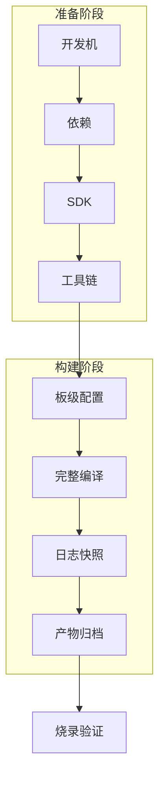
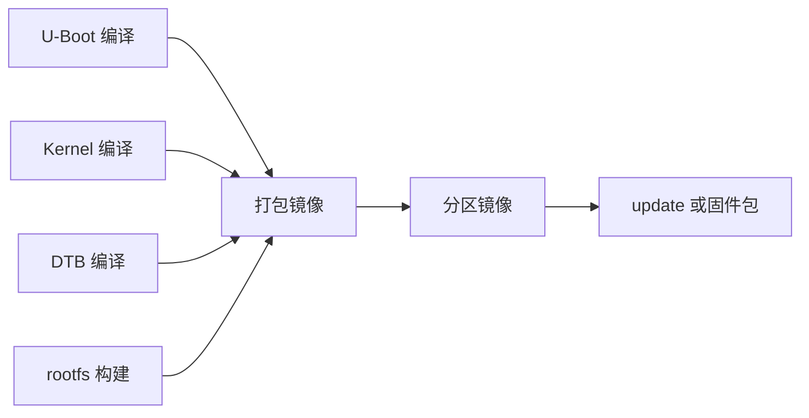

做 Linux BSP，第一道门槛往往不是驱动代码，而是能不能把厂商 SDK 在自己的开发机上稳定编译出来。对 MCU 工程师来说，Keil、IAR、STM32CubeIDE 或 Makefile 工程通常只围绕一个固件镜像展开；而嵌入式 Linux SDK 同时包含 U-Boot、Linux Kernel、设备树、rootfs、分区表、打包脚本和烧录工具。环境没有搭好，后面的所有调试都会失去基准。

本文以 RV1126 + IMX415 平台为主线，目标不是记住某一条固定命令，而是建立一套可复现的 SDK 首次编译流程：开发机如何准备、工具链如何识别、SDK 目录如何阅读、第一次 build 如何保存证据、产物如何归档、Git 如何管理。具体 SDK 版本、依赖包名称、板级配置文件名和镜像路径，必须以手头 SDK 文档与实际源码为准；本文给出工程方法和检查清单。

## 1. 为什么环境搭建是 BSP 的第一项工程工作

BSP 开发最怕“环境能跑但说不清怎么跑”。同一份源码，在不同 Ubuntu 版本、不同交叉工具链、不同环境变量、不同板级配置下，可能生成不同镜像。启动失败时，如果连编译环境都不可复现，就很难判断问题来自源码、配置、工具链还是烧录包。

开发环境至少要回答四个问题：

| 问题 | 需要记录的内容 | 出问题时的典型表现 |
|---|---|---|
| 用什么系统编译 | Ubuntu 版本、CPU 架构、磁盘路径、shell | 脚本依赖缺失、路径过长、权限异常 |
| 用什么工具链编译 | gcc 版本、前缀、sysroot、PATH 顺序 | 编译报错、链接 ABI 不匹配、运行库不一致 |
| 编译哪个板级配置 | defconfig、设备树、rootfs 配置、分区配置 | 镜像能启动但外设异常、DTB 不匹配 |
| 产物如何追溯 | Git 提交、构建时间、配置快照、日志 | 不知道板上烧录的是哪一版 |

在 MCU 项目里，“我这边能编过”有时还能靠 IDE 工程文件兜底；在 Linux BSP 项目里，这句话不够。合格的交付标准应该是：换一台干净开发机，按文档执行同样步骤，可以得到同一组可解释的镜像产物。



## 2. 开发机选择：稳定优先，不追新

厂商 Linux SDK 通常对宿主机环境有隐含假设。很多老 SDK 偏向 Ubuntu 18.04 或 20.04；较新的 SDK 可能支持 22.04。选择开发机时，优先看 SDK 文档推荐版本。如果文档没有明确说明，建议使用一台专门的 Ubuntu x86_64 机器或虚拟机作为基准环境。

需要注意三点。

第一，宿主机架构优先选 x86_64。虽然 ARM64 主机也能编译很多 Linux 工程，但厂商预置工具链、闭源打包工具或二进制脚本不一定提供 ARM64 版本。除非确认 SDK 支持 ARM64 宿主机，否则基准环境不要建立在不确定架构上。

第二，磁盘空间要留足。完整 SDK 加源码、构建中间文件、rootfs、镜像包和日志，很容易占用几十 GB。建议至少准备 100GB 可用空间，持续开发时准备 200GB 更稳妥。

第三，路径保持简单。不要把 SDK 放在带中文、空格、特殊符号或过深层级的路径下。推荐类似：

```bash
mkdir -p ~/work/rv1126
cd ~/work/rv1126
```

路径简单不是洁癖，而是减少脚本、Makefile、打包工具和第三方二进制程序对路径处理的风险。

## 3. 基础依赖安装

Linux SDK 的构建通常会调用 bash、make、gcc、bc、bison、flex、openssl、device tree compiler、文件系统工具、压缩工具和 Python 脚本。不同 SDK 的依赖略有差异，下面是一组常见基线，执行前应对照 SDK 文档调整。

```bash
sudo apt update
sudo apt install -y \
  git git-lfs repo curl wget ca-certificates \
  build-essential gcc g++ make cmake ninja-build \
  bc bison flex texinfo gawk chrpath diffstat \
  libssl-dev libncurses5-dev libncursesw5-dev \
  device-tree-compiler u-boot-tools \
  python3 python3-pip python3-setuptools python3-venv \
  rsync unzip zip xz-utils zstd lzop cpio file \
  dosfstools mtools parted e2fsprogs squashfs-tools \
  liblz4-tool expect
```

其中几个工具对 BSP 特别关键：

| 工具 | 作用 | 缺失后的常见表现 |
|---|---|---|
| `device-tree-compiler` | 编译 dts/dtsi 为 dtb | 设备树编译失败 |
| `u-boot-tools` | 生成或解析 U-Boot 镜像 | 打包 boot 镜像失败 |
| `bc` | 内核构建计算表达式 | Kernel 编译早期报错 |
| `bison/flex` | 生成解析器 | U-Boot 或 Kernel 配置阶段失败 |
| `libssl-dev` | 加密和签名相关构建 | host 工具编译失败 |
| `squashfs-tools/e2fsprogs` | rootfs 镜像生成 | 文件系统打包失败 |
| `git-lfs` | 拉取大文件 | 预编译工具链或二进制资源缺失 |

如果 SDK 提供 `envsetup.sh`、`install.sh` 或 `build.sh lunch` 之类入口，不要跳过文档中的依赖安装脚本。厂商脚本可能还会检查 Java、Python 包、repo 工具或私有打包工具。

## 4. SDK 获取与目录原则

RV1126 SDK 可能来自厂商压缩包、Git 仓库、repo 多仓库清单或板厂二次封装包。无论来源如何，第一次拿到 SDK 后，先做三件事。

### 4.1 保留原始包

原始压缩包或 repo manifest 是追溯来源的凭据。建议建立如下目录：

```text
rv1126-workspace/
├── 00-original/        # 原始 SDK 包、manifest、校验和
├── 01-sdk/             # 解压或同步后的工作目录
├── 02-build-log/       # 每次构建日志
├── 03-output-archive/  # 每次归档的镜像产物
└── 04-notes/           # 板卡、烧录、问题记录
```

如果原始包来自板厂网盘，还要记录下载日期、文件名、版本说明和校验值：

```bash
sha256sum RV1126_SDK_xxx.tar.gz | tee 00-original/sha256sum.txt
```

### 4.2 不在原始包上直接改

原始包只读保存，真正修改在工作副本中进行。这样一旦构建脚本被改坏、配置被污染、源码被错误替换，可以重新生成干净工作目录做对比。

### 4.3 第一时间初始化 Git

很多厂商 SDK 本身可能已经是 Git 仓库，也可能是多个仓库的集合。如果拿到的是普通压缩包，建议在解压后的顶层目录初始化 Git，至少把自己后续修改纳入版本记录。

```bash
cd ~/work/rv1126/01-sdk

git init
git add .
git commit -m "import rv1126 sdk baseline"
```

如果源码太大，不适合一次性提交全部内容，也要至少维护一个外部记录文件，保存 SDK 来源、压缩包校验、构建配置和修改清单。BSP 工作不是只看最终差异，更要知道差异建立在哪个基线之上。

## 5. 认识 SDK 顶层目录

不同厂商对目录命名不完全一致，但嵌入式 Linux SDK 通常包含以下部分：

| 目录或组件 | 典型内容 | BSP 工程关注点 |
|---|---|---|
| `u-boot/` 或 `sysdrv/source/uboot/` | U-Boot 源码、defconfig、板级启动配置 | 启动介质、bootargs、DTB 加载 |
| `kernel/` 或 `sysdrv/source/kernel/` | Linux 内核源码、设备树、驱动 | DTS、驱动、内核配置、模块 |
| `buildroot/` 或 `rootfs/` | 根文件系统构建 | BusyBox、库、脚本、应用自启动 |
| `device/` 或 `board/` | 板级配置、分区、打包规则 | 当前开发板差异、镜像布局 |
| `prebuilts/` 或 `tools/` | 交叉工具链、打包工具、烧录工具 | 工具链版本、host 工具兼容性 |
| `output/` 或 `rockdev/` | 编译输出 | kernel、dtb、rootfs、update 镜像 |
| `build.sh` | 顶层构建入口 | 选择板级、全量编译、打包 |

拿到 SDK 后，不要先盲目执行全量编译。建议先用只读命令观察结构：

```bash
find . -maxdepth 2 -type d | sort | head -80
find . -maxdepth 3 -name '*defconfig' | head -40
find . -maxdepth 4 -name '*.dts' -o -name '*.dtsi' | head -40
find . -maxdepth 3 -iname '*readme*' -o -iname '*release*' | sort
```

这些命令能帮助我们确认三个核心事实：SDK 的构建入口在哪里、有哪些板级配置、设备树文件如何命名。

## 6. 交叉工具链：先识别，再使用

交叉工具链是把宿主机上的源码编译成板端 ARM 程序的工具集合。RV1126 的 CPU 是 ARM Cortex-A7，通常使用 ARM 32 位 Linux 交叉工具链。工具链前缀可能类似 `arm-linux-gnueabihf-`、`arm-rockchip830-linux-uclibcgnueabihf-` 或厂商自定义名称，具体以 SDK 为准。

不要凭经验强行指定工具链。先在 SDK 中查找：

```bash
find . -type f -name '*gcc' | grep -E 'arm|gnueabi|uclibc|glibc' | head -30
find . -type d -iname '*toolchain*' -o -iname '*gcc*' | head -30
```

确认工具链后，查看版本：

```bash
/path/to/toolchain/bin/arm-linux-gnueabihf-gcc -v
/path/to/toolchain/bin/arm-linux-gnueabihf-gcc -dumpmachine
/path/to/toolchain/bin/arm-linux-gnueabihf-gcc -print-sysroot
```

### 6.1 glibc 与 uClibc 不要混用

rootfs 使用 glibc、uClibc 还是 musl，会影响用户态程序链接和运行。内核与 U-Boot 本身不依赖 rootfs libc，但板端应用、测试工具和示例程序会依赖。交叉工具链的 libc 类型必须与 rootfs 匹配，否则可能出现“编译成功，板端运行时报 `not found` 或动态加载器缺失”的问题。

可用下面命令检查一个用户态程序依赖：

```bash
readelf -l ./demo_app | grep 'interpreter'
file ./demo_app
```

如果输出解释器类似 `/lib/ld-linux-armhf.so.3`，而 rootfs 中没有对应文件，程序就无法运行。

### 6.2 PATH 顺序要固定

不要在多个终端里临时 export 不同工具链。建议为当前 SDK 写一个环境脚本：

```bash
cat > env-rv1126.sh <<'EOF'
#!/usr/bin/env bash
export SDK_ROOT="$HOME/work/rv1126/01-sdk"
export TOOLCHAIN_DIR="$SDK_ROOT/prebuilts/gcc/linux-x86/arm"
export CROSS_COMPILE="$TOOLCHAIN_DIR/bin/arm-linux-gnueabihf-"
export ARCH=arm
export PATH="$TOOLCHAIN_DIR/bin:$PATH"
EOF

source env-rv1126.sh
which ${CROSS_COMPILE}gcc
${CROSS_COMPILE}gcc -dumpmachine
```

上面的路径只是模板，必须按实际 SDK 修改。关键是把环境变量文件纳入版本管理，让每次编译使用同一套路径和前缀。

## 7. 板级配置：选择比编译更重要

Linux SDK 通常支持多个板卡或多个产品配置。选择错误配置时，编译可能完全成功，但烧录后串口、存储、摄像头、网络或电源时序都可能错误。

首次编译前至少要确认这些对象：

| 对象 | 要确认什么 | 常见文件类型 |
|---|---|---|
| U-Boot defconfig | 当前板卡启动配置 | `*_defconfig` |
| Kernel defconfig | 内核功能裁剪和驱动选择 | `*_defconfig` |
| 设备树 | RV1126 板级 dts、IMX415 节点 | `.dts/.dtsi` |
| rootfs 配置 | Buildroot/BusyBox/包选择 | `defconfig/.config` |
| 分区配置 | boot、rootfs、recovery、userdata | `parameter.txt` 或厂商配置 |
| 打包配置 | 哪些镜像进入 update 包 | shell 脚本或配置文件 |

如果 SDK 提供交互式配置入口，先列出可选项：

```bash
./build.sh lunch
# 或查看文档中的 board config 列表
```

如果没有 `lunch`，就从 README 和 board/device 目录查当前板卡名称。对于 RV1126 + IMX415，设备树里应能看到与当前板卡、MIPI CSI、I2C sensor、电源 GPIO、reset GPIO、MCLK 相关的描述。IMX415 是否已经启用，要以后续摄像头 bring-up 时再逐项验证；首次编译阶段只需要确认没有选错大方向。

## 8. 第一次完整编译

首次编译的目标是得到一套基准镜像，而不是立刻优化速度。建议使用全量构建，并把日志完整保存。

常见流程如下，具体命令以 SDK 文档为准：

```bash
cd ~/work/rv1126/01-sdk
source env-rv1126.sh

# 选择板级配置，命令以实际 SDK 为准
./build.sh lunch

# 首次全量编译并保存日志
mkdir -p ../02-build-log
./build.sh 2>&1 | tee ../02-build-log/$(date +%Y%m%d-%H%M%S)-full-build.log
```

有些 Rockchip SDK 会拆分为多个目标：

```bash
./build.sh uboot
./build.sh kernel
./build.sh rootfs
./build.sh firmware
```

也有些 SDK 使用 `build.sh all`、`build.sh updateimg` 或板厂封装命令。不要把命令名当成知识点，真正需要理解的是依赖关系：U-Boot、Kernel、DTB、rootfs 和打包镜像分别由哪一步生成。



### 8.1 首次编译不建议并行拉满

很多 SDK 构建脚本会自动使用多线程。首次编译时，如果开发机内存不大，不建议手动设置过高 `-j`。编译失败时先看具体错误，不要只看最后一行。真正的错误往往出现在日志中更早位置。

可以用下面命令快速定位错误：

```bash
grep -nEi 'error:|fatal:|No such file|not found|undefined reference|Permission denied' \
  ../02-build-log/20260814-120000-full-build.log | head -80
```

如果日志里只有某个子命令返回失败，要继续向上找第一个 `error` 或 `fatal`，而不是只处理 `make: ***` 那一行。

## 9. 常见首编错误与处理方向

### 9.1 缺少 host 工具或库

表现可能是：

```text
fatal error: openssl/ssl.h: No such file or directory
/bin/sh: 1: bison: not found
dtc: command not found
```

处理方式是安装对应宿主机依赖，再重新执行失败阶段。不要直接修改源码绕过检查。

### 9.2 Python 版本或模块不匹配

老 SDK 可能假设 Python 2，新 SDK 多数使用 Python 3。遇到 Python 报错时，先看脚本 shebang 和文档要求。必要时为 SDK 创建独立 venv：

```bash
python3 -m venv ~/work/rv1126/venv
source ~/work/rv1126/venv/bin/activate
pip install -r requirements.txt
```

如果 SDK 没有 `requirements.txt`，不要随意升级系统 Python 包；优先使用虚拟环境隔离。

### 9.3 工具链路径错误

表现可能是：

```text
arm-linux-gnueabihf-gcc: command not found
C compiler cannot create executables
```

检查顺序：

```bash
echo $ARCH
echo $CROSS_COMPILE
which ${CROSS_COMPILE}gcc
${CROSS_COMPILE}gcc -v
```

如果 `which` 指向系统里另一套工具链，要修正 PATH 顺序。工具链混用会造成很隐蔽的问题，尤其是用户态库和 ABI 不一致。

### 9.4 权限和可执行位问题

压缩包从 Windows 或网盘中转后，脚本可执行位可能丢失。表现是：

```text
Permission denied
```

处理方式：

```bash
chmod +x build.sh
find tools -type f -name '*.sh' -exec chmod +x {} \;
```

不要用 root 身份全量编译 SDK。root 编译会污染输出文件权限，后续普通用户清理和增量编译都会变麻烦。

### 9.5 设备树或配置不匹配

如果编译在 dtb 阶段失败，通常与 dts 语法、include 路径或 binding 检查有关。先定位具体 dts 文件和行号，再改最小范围。设备树不是普通配置文件，随意删除属性可能让编译通过但运行失败。

## 10. 编译完成后要找哪些产物

一次完整 SDK 构建通常会生成多类文件。不要只保存最大的 update 包，也要保存组成它的关键镜像。

| 产物 | 作用 | 为什么要保存 |
|---|---|---|
| U-Boot / loader 镜像 | 早期启动和加载内核 | 启动失败时需要单独替换验证 |
| Kernel 镜像 | Linux 内核主体 | 内核配置和驱动变更的核心产物 |
| DTB | 当前板级硬件描述 | 外设 bring-up 问题必须追踪 DTB 来源 |
| rootfs 镜像 | 用户空间文件系统 | 应用、脚本、库和服务变更都在这里体现 |
| parameter / 分区表 | 存储布局 | root 参数、升级和烧录强相关 |
| update 或固件包 | 一键烧录入口 | 给测试和生产使用的交付物 |
| build log | 构建证据 | 复现问题和追溯环境 |

查找产物可以从输出目录开始：

```bash
find output rockdev -maxdepth 3 -type f 2>/dev/null | sort | head -100
find . -maxdepth 4 -type f \( -name '*.img' -o -name '*.dtb' -o -name 'parameter*' \) | sort
```

具体目录名以 SDK 为准。有些 SDK 使用 `rockdev/`，有些使用 `output/firmware/` 或 `Image/`。第一次构建后，建议把实际产物路径整理进项目笔记。

## 11. 建立一次标准归档

BSP 工作不能只靠“我记得烧的是刚编译那版”。每次准备烧录给板卡验证，都应该建立独立归档目录。

```bash
ARCHIVE_ROOT=../03-output-archive/$(date +%Y%m%d-%H%M%S)-rv1126-first-build
mkdir -p "$ARCHIVE_ROOT"

# 以下路径按实际 SDK 输出修改
cp -av rockdev/*.img "$ARCHIVE_ROOT"/ 2>/dev/null || true
cp -av output/*/*.dtb "$ARCHIVE_ROOT"/ 2>/dev/null || true
cp -av parameter.txt "$ARCHIVE_ROOT"/ 2>/dev/null || true
cp -av ../02-build-log/*full-build.log "$ARCHIVE_ROOT"/ 2>/dev/null || true

git rev-parse HEAD > "$ARCHIVE_ROOT/git-head.txt"
git status --short > "$ARCHIVE_ROOT/git-status.txt"
date -Iseconds > "$ARCHIVE_ROOT/build-time.txt"
```

更完整的版本记录可以写成 `manifest.txt`：

```bash
{
  echo "board=rv1126-imx415"
  echo "sdk_path=$(pwd)"
  echo "git_head=$(git rev-parse HEAD 2>/dev/null || echo unknown)"
  echo "build_time=$(date -Iseconds)"
  echo "host=$(lsb_release -ds 2>/dev/null || cat /etc/os-release | head -1)"
  echo "kernel=$(find . -name Image -o -name zImage | head -1)"
  echo "dtb=$(find . -name '*.dtb' | head -5 | tr '\n' ' ')"
  echo "toolchain=$(${CROSS_COMPILE}gcc -dumpmachine 2>/dev/null || echo unknown)"
  echo "gcc_version=$(${CROSS_COMPILE}gcc -dumpversion 2>/dev/null || echo unknown)"
} | tee "$ARCHIVE_ROOT/manifest.txt"
```

归档目录要能回答一个问题：两周后看到某块板子的日志，能不能判断它烧录的是哪一套 U-Boot、Kernel、DTB 和 rootfs。

## 12. Git 管理：只提交可解释的变化

BSP SDK 通常很大，里面还有生成文件、二进制工具和中间产物。Git 管理的重点不是把所有文件都提交进去，而是让每次修改可解释、可回退、可审查。

建议遵循几条规则。

### 12.1 基线提交与开发提交分开

基线提交只代表“原始 SDK 导入”。板级修改、驱动修改、配置修改要单独提交。这样后面查看差异时，能清楚看到自己改了哪些文件。

```bash
git status --short
git diff --stat
git diff -- arch/arm/boot/dts/
git diff -- drivers/
```

### 12.2 不提交构建输出

`.img`、`.o`、`.ko`、rootfs 临时目录、下载缓存通常不应进入源码 Git。可以通过 `.gitignore` 排除：

```gitignore
output/
rockdev/
build/
*.o
*.ko
*.img
*.dtb
*.log
```

DTB 是否提交要看项目策略。通常源码仓库提交 dts/dtsi，不提交编译出的 dtb；交付归档目录保存 dtb。

### 12.3 修改配置要保存来源

内核 `.config`、Buildroot `.config` 和 defconfig 的关系容易混淆。正确做法是修改配置后导出 defconfig 或保存配置差异，避免只保留临时 `.config`。

例如内核：

```bash
make ARCH=arm savedefconfig
cp defconfig arch/arm/configs/rv1126_custom_defconfig
```

具体命令取决于 SDK 构建方式。核心原则是：临时配置文件可以用于编译，但长期维护应落到可追踪的 defconfig 或配置片段。

## 13. 首次烧录前的自检

编译成功后不要急着烧录。先做一次静态自检：

```bash
file path/to/Image path/to/zImage 2>/dev/null
file path/to/*.dtb 2>/dev/null
strings path/to/*.dtb | grep -Ei 'rv1126|imx415|camera|i2c' | head -40
ls -lh path/to/*.img
```

这些命令不能证明镜像一定正确，但能快速发现明显问题，例如拿错架构、DTB 不包含目标板信息、镜像大小异常、rootfs 没生成。

对 RV1126 + IMX415 平台，首次静态检查建议覆盖：

- DTB 中能看到 RV1126 相关 compatible；
- 板级 dts 与当前开发板名称匹配；
- 若 SDK 已启用摄像头节点，能看到 IMX415 或对应 sensor 节点；
- rootfs 镜像大小合理；
- parameter 或分区配置与烧录工具选择一致；
- update 包生成时间与本次构建时间一致。

IMX415 不必在首次环境搭建阶段完全调通，但不能选成另一块板卡或另一颗 sensor 的配置。选错板级配置会让后面的设备树、I2C、MIPI 和 ISP 排查全部偏离。

## 14. 把“编译成功”变成可复现结论

一次合格的首次编译，至少应留下以下证据：

| 证据 | 最低要求 |
|---|---|
| 开发机信息 | Ubuntu 版本、宿主机架构、磁盘路径 |
| SDK 来源 | 原始包名称、下载日期、校验值 |
| 工具链信息 | `gcc -v`、`-dumpmachine`、sysroot |
| 板级配置 | U-Boot、Kernel、rootfs、设备树配置名称 |
| 构建日志 | 完整 full build log，无未解释 error |
| 产物列表 | U-Boot、Kernel、DTB、rootfs、update 包路径 |
| Git 状态 | baseline commit、当前 HEAD、dirty 状态 |
| 静态检查 | `file`、`strings dtb`、镜像大小记录 |

把这些证据整理成 `first-build-report.md`，比只发一个 update 包更有价值。因为 BSP 的后续工作会不断修改 U-Boot、设备树、驱动和 rootfs，没有第一次基准，所有变化都缺少参照。

## 15. 本文的工程检查清单

首次搭建 RV1126 SDK 环境时，建议逐项打勾：

- [ ] 宿主机 Ubuntu 版本与 SDK 推荐环境一致或已记录差异；
- [ ] SDK 原始包或 manifest 已保存，并记录 sha256；
- [ ] 基础依赖已安装，构建脚本可执行；
- [ ] 交叉工具链路径、前缀、版本和 sysroot 已确认；
- [ ] `ARCH`、`CROSS_COMPILE`、`PATH` 写入独立环境脚本；
- [ ] 已确认当前 RV1126 板级配置，而不是其他 SoC 或其他板卡；
- [ ] 能定位 U-Boot、Kernel、设备树、rootfs、分区和打包配置；
- [ ] 首次完整编译日志已保存；
- [ ] 构建失败时能定位第一条真正错误；
- [ ] 编译产物已归档，包含 Git、工具链、构建时间和 manifest；
- [ ] 烧录前已做镜像类型、DTB 字符串和文件大小静态检查。

## 16. 小结

RV1126 Linux SDK 首次编译的核心，不是把某条 build 命令跑通，而是建立一套可复现的工程基线。开发机版本、依赖包、交叉工具链、板级配置、设备树、rootfs、分区表和打包产物必须能相互对应。只有先把环境和产物链路固定下来，后面排查 U-Boot、Kernel、驱动、摄像头和 rootfs 问题时，才有可靠的参照物。

对 BSP 工程师来说，第一次 build 的真正成果不是一个固件包，而是一份可以追溯的构建证据链：源码从哪里来，配置选了什么，工具链是哪一套，生成了哪些镜像，板子烧录的是哪一版。把这条链路建立好，后面的 bring-up 才不会变成靠记忆和猜测推进。

> 🏷️ Linux BSP · RV1126 · IMX415 · SDK 编译 · 交叉工具链 · Git 管理 · Buildroot · U-Boot · Kernel · DTB · rootfs · 产物归档
