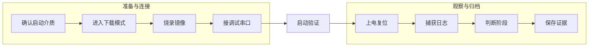
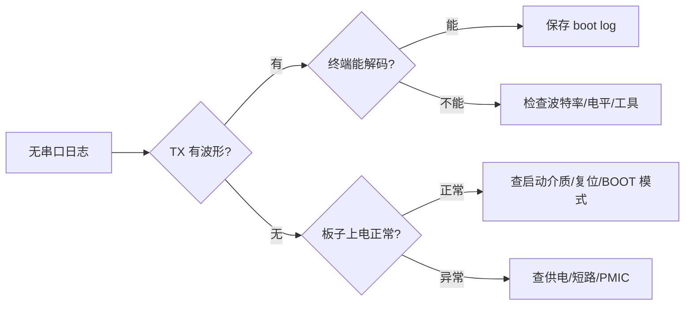

SDK 能编译出来，只说明软件产物已经生成；能不能把镜像烧进板子、能不能看到串口日志、能不能判断系统停在 BootROM、U-Boot、kernel 还是 rootfs，才是 BSP bring-up 真正开始的地方。

对 MCU 工程师来说，“下载程序 + 打开串口”通常是很自然的动作；但在嵌入式 Linux 板卡上，启动链路更长，镜像更多，启动介质更多，串口也不一定接在默认引脚上。一次失败的启动，可能来自烧录工具、USB 下载模式、eMMC 分区、U-Boot 环境变量、设备树 console、串口电平、供电时序，甚至只是一根线接反。

本文围绕 RV1126 + IMX415 平台，目标是建立第一套可复现的启动验证流程：确认启动介质，选择烧录方式，接好调试串口，保存第一条 boot log，结合原理图和基础仪器判断启动失败位置。具体工具名称、镜像文件名、按键组合和测试点位置，以实际板卡资料和 SDK 文档为准；本文讲工程方法和排查顺序。

## 1. 第一条启动日志为什么重要

Linux BSP 里的第一条启动日志，不只是“板子有输出了”这么简单。它至少能证明四件事。

| 证明项 | 说明 | 对 bring-up 的意义 |
|---|---|---|
| 供电基本成立 | SoC 至少完成了早期上电和复位释放 | 可以继续看启动介质和串口路径 |
| BootROM 或 SPL 已运行 | 芯片已经开始执行内部 ROM 或外部加载代码 | 问题不再是完全无启动 |
| 调试串口路径正确 | UART TX/RX、电平、波特率、USB 转串口工作 | 后续所有启动调试有观察入口 |
| 镜像链路部分有效 | 至少某一级镜像被加载或尝试加载 | 可以定位卡在启动链路的哪一段 |

没有启动日志时，工程师只能靠猜；有启动日志后，问题会变成一段可读的证据链。BSP bring-up 的第一目标不是马上进 Shell，而是先让系统“说话”。



实际操作时也建议按两段记录：第一段记录“怎么烧进去”，第二段记录“板子启动时输出了什么”。两类信息混在一起，后面复盘很容易乱。

## 2. 先分清启动介质和烧录对象

RV1126 板卡常见启动介质包括 eMMC、SPI NOR、SPI NAND、SD 卡等，具体取决于板级设计。不同启动介质决定了烧录工具、镜像布局和恢复方式。

启动介质至少要确认三件事。

第一，看原理图或板卡手册确认实际焊接的存储器。不要只凭 SDK 目录名判断。一个 SDK 可能支持多个板型，有的板子用 eMMC，有的板子用 SPI NAND，有的板子还支持 SD 卡启动。

第二，确认芯片的启动选择方式。部分板卡通过 BOOT_SEL、电阻配置、按键组合或 USB 下载模式进入不同启动路径。第一次 bring-up 时，要把“正常启动模式”和“下载烧录模式”分开记录。

第三，确认镜像是单文件升级包，还是多个分区镜像。Rockchip 平台常见产物可能包含 loader、uboot、boot、kernel、resource、rootfs、recovery、update.img、parameter 等。不同 SDK 和板厂打包方式不完全一致，必须以实际文档为准。

建议建立一个镜像清单表，而不是只把文件丢进 output 目录：

| 产物 | 典型作用 | 核对重点 |
|---|---|---|
| loader / MiniLoader | 早期加载、DDR 初始化相关 | 是否匹配芯片和 DDR 型号 |
| uboot.img | U-Boot 主体 | 是否匹配板级 defconfig |
| boot.img / kernel.img | Linux 内核或启动镜像 | kernel 与 dtb 是否匹配 |
| resource.img / dtb | 设备树、logo 等资源 | console、memory、外设节点是否正确 |
| rootfs.img | 根文件系统 | init、库文件、登录方式是否完整 |
| parameter | 分区布局 | 起始地址、大小、分区名是否匹配烧录工具 |
| update.img | 打包升级镜像 | 是否包含本次所有变更 |

BSP 初期不要依赖“文件名看起来像”。每一次烧录前，都要记录镜像生成时间、来源目录、Git 提交、板级配置和目标存储介质。

## 3. 烧录前的最低检查清单

烧录失败常常不是工具本身的问题，而是前置条件没确认。建议每次烧录前做一张最小检查清单。

| 检查项 | 需要确认什么 | 常见异常 |
|---|---|---|
| USB 连接 | 下载口接到正确 USB 接口 | PC 没有枚举设备 |
| 供电 | 板卡电源电压、电流能力足够 | 烧录中断、反复重启 |
| 下载模式 | 按键、跳帽、测试点进入正确模式 | 工具找不到 Loader 设备 |
| 权限 | Linux 主机 udev 或 sudo 权限 | 工具能打开但不能写入 |
| 镜像匹配 | 芯片、DDR、存储介质、板级配置一致 | 烧录成功但启动异常 |
| 分区布局 | parameter 与镜像集合一致 | rootfs 挂载失败或分区越界 |

在 Linux 主机上，可以先观察 USB 设备是否枚举：

```bash
lsusb

dmesg -w
```

如果 SDK 提供 Rockchip 烧录工具，工具名称和参数以实际 SDK 为准。常见动作包括查询设备、下载 loader、写入分区镜像、写入完整 update 包。下面只是命令形态示例，不代表所有 RV1126 SDK 都完全一致：

```bash
# 示例：查询当前是否识别到 Rockchip 设备
sudo ./upgrade_tool LD

# 示例：烧录完整升级包
sudo ./upgrade_tool UF update.img

# 示例：按分区烧录，实际分区名以 parameter 为准
sudo ./upgrade_tool DI -uboot uboot.img
sudo ./upgrade_tool DI -boot boot.img
sudo ./upgrade_tool DI -rootfs rootfs.img
```

烧录动作要保存日志。不要只看终端最后一行成功提示：

```bash
mkdir -p logs/flash
sudo ./upgrade_tool UF update.img 2>&1 | tee logs/flash/flash-$(date +%Y%m%d-%H%M%S).log
```

如果团队里有多块板子，还要记录板卡编号和连接方式：

```text
board_id: rv1126-imx415-evb-001
storage: eMMC
flash_tool: upgrade_tool, version 待核实
image: output/update.img
sdk_commit: 3f2a9c1
operator: longway
note: first full flash after clean build
```

这类记录看起来琐碎，但能避免后面出现“这块板烧的是哪一版镜像”这种基础混乱。

## 4. 串口接线：先确认电平，再确认 TX/RX

调试串口是 Linux BSP 的生命线。第一次接线时，先看原理图，不要直接把 USB 转串口插上去。

需要确认四个点。

第一，串口电平。常见 USB 转串口模块可能支持 3.3V TTL、1.8V TTL、5V TTL 或 RS232。SoC 引脚通常不是 5V 容忍，错误电平可能损坏芯片。RV1126 板卡实际调试 UART 电平必须看原理图或板卡手册。

第二，串口编号。Linux 里叫 `ttyS0`、`ttyFIQ0`、`ttyS2` 或其他名字，并不等于板子丝印上的 UART0。启动早期使用哪个 UART，取决于 U-Boot 配置、kernel bootargs、设备树 `chosen/stdout-path` 和板级引脚复用。

第三，TX/RX 方向。板子 TX 接 USB 转串口 RX，板子 RX 接 USB 转串口 TX，GND 必须共地。只想看日志时，理论上只接板子 TX、转接器 RX、GND 也能看到输出；需要输入 U-Boot 命令或登录 Shell 时才需要接 RX。

第四，波特率。常见默认值是 115200 8N1，但部分平台或阶段可能使用其他波特率。第一次验证建议从 SDK 文档给出的默认值开始。

Linux 主机上可以这样打开串口：

```bash
sudo apt install -y minicom picocom screen

# 假设 USB 转串口枚举为 /dev/ttyUSB0
picocom -b 115200 /dev/ttyUSB0

# 或使用 screen
screen /dev/ttyUSB0 115200
```

退出 `picocom` 的常见按键是 `Ctrl-A` 后按 `Ctrl-X`。退出 `screen` 的常见按键是 `Ctrl-A` 后按 `K`。这些操作也应写进团队文档，避免新同事连串口工具都卡住。

## 5. 原理图阅读：只抓和启动相关的最小闭环

第一次 bring-up 不需要把整张原理图全部看完，但必须抓住启动闭环。建议从五类信号入手。

| 类别 | 重点信号 | 为什么重要 |
|---|---|---|
| 电源 | DC 输入、PMIC、核心电压、IO 电压 | 供电错误会导致完全无日志或随机重启 |
| 复位 | SoC reset、PMIC reset、外设 reset | 复位未释放时不会正常启动 |
| 时钟 | 晶振、RTC 时钟、外设 MCLK | 时钟异常会影响启动和外设枚举 |
| 启动介质 | eMMC/SPI/SD 的供电、时钟、数据线 | BootROM 读取失败会停在早期阶段 |
| 调试串口 | UART TX/RX、引脚复用、电平转换 | 没有日志就无法继续定位 |

原理图阅读时，建议建立“启动页索引”：

```text
power_page:      page 3, PMIC and regulators
reset_page:      page 4, reset key and reset supervisor
boot_page:       page 5, boot strap and storage selection
storage_page:    page 8, eMMC / SPI flash
uart_page:       page 12, debug UART header
camera_page:     page 16, IMX415 MIPI CSI and I2C
```

这样以后排查某个问题时，不需要重新翻整份 PDF。

## 6. 用万用表、示波器、逻辑分析仪看什么

BSP 工程师不需要一开始就成为硬件工程师，但要能用基础仪器回答几个关键问题。

万用表主要回答“有没有”和“是多少”：

```text
1. 板卡输入电压是否正常
2. 主要电源轨是否有电压
3. 调试串口 TX 空闲电平是否合理
4. 下载模式按键或 BOOT_SEL 电平是否符合预期
5. GND 是否可靠共地
```

示波器主要回答“有没有波形”和“时序是否合理”：

```text
1. 上电时核心电源和 IO 电源是否稳定
2. reset 是否在电源稳定后释放
3. 晶振是否起振
4. UART TX 是否有启动波形
5. eMMC/SPI clock 是否在启动阶段出现
```

逻辑分析仪主要回答“数字通信是否发生”和“协议是否像样”：

```text
1. UART 是否有数据，波特率是否匹配
2. SPI flash 是否有片选和时钟
3. I2C 总线上是否有访问外设的动作
4. MIPI 之外的低速控制信号是否符合驱动预期
```

三类工具不要混用。比如 UART 没日志时，先用示波器看 TX 引脚有没有波形；如果有波形但终端乱码，再用逻辑分析仪或串口工具确认波特率；如果完全没有波形，再回到启动链路、引脚复用和供电复位排查。



这张图保持横向分支，适合公众号里横屏查看，也不会因为单列排布导致图片过高。

## 7. 启动日志要从上电前开始抓

很多人打开串口工具时，板子已经启动到一半，早期日志被漏掉。正确做法是先打开串口捕获，再给板子上电或按复位。

用 `script` 保存完整终端会话：

```bash
mkdir -p logs/uart
script -f logs/uart/boot-$(date +%Y%m%d-%H%M%S).log
picocom -b 115200 /dev/ttyUSB0
```

也可以直接让 `picocom` 输出到日志文件，具体参数以工具版本为准：

```bash
picocom -b 115200 /dev/ttyUSB0 | tee logs/uart/boot.log
```

保存日志时，文件名建议包含日期、板号、镜像版本和启动介质：

```text
20260814-rv1126-evb001-emmc-sdk3f2a9c1-first-boot.log
```

日志文件里最好手动补充一段头信息：

```text
board_id: rv1126-evb001
storage: eMMC
power: 12V adapter
uart: /dev/ttyUSB0, 115200 8N1, 3.3V TTL
image: update.img, build 20260814-1830
sdk_commit: 3f2a9c1
operation: power cycle after full flash
```

这些信息比“启动失败”四个字有价值得多。

## 8. 第一条日志该怎么看

启动日志要分阶段看。不要一上来就搜索 `error`，很多 early log 的 warning 并不一定阻止启动。先判断系统停在哪一层。

| 日志现象 | 可能阶段 | 优先检查 |
|---|---|---|
| 完全无输出 | 供电、复位、UART、BootROM 前后 | 电源、reset、串口 TX、启动模式 |
| 只有乱码 | UART 或波特率问题 | 波特率、电平、GND、终端参数 |
| 有 DDR 初始化信息后停止 | SPL / loader 阶段 | DDR 配置、loader 匹配、存储读取 |
| 进入 U-Boot 后停止 | U-Boot 阶段 | bootcmd、bootargs、存储分区、kernel 路径 |
| kernel 解压后停止 | 内核早期 | dtb、console、memory、驱动 early init |
| kernel 启动后 panic | 内核或 rootfs | root= 参数、rootfs、init、驱动崩溃 |
| 进入 login 或 shell | 启动链路基本闭环 | 记录版本，开始外设验证 |

典型 U-Boot 阶段可以关注这些信息：

```text
U-Boot version
DRAM size
MMC / SPI / NAND init
Hit any key to stop autoboot
bootcmd
bootargs
Loading kernel
Loading fdt
Starting kernel
```

典型 kernel 阶段可以关注这些信息：

```text
Linux version
Machine model
Kernel command line
Memory policy
OF: reserved mem
console enabled
VFS: Mounted root
Freeing unused kernel memory
Run /sbin/init as init process
```

看到 `Starting kernel` 之后没有任何输出，不一定是 kernel 没跑。也可能是 kernel console 配置错误，U-Boot 的串口和 kernel 的 console 没对上。此时要检查 bootargs 里的 `console=`、设备树 `chosen/stdout-path`、UART 节点 `status` 和 pinctrl。

## 9. 串口常见问题排查

串口问题非常基础，但最容易浪费时间。下面这张表可以直接贴到 bring-up 记录里。

| 现象 | 可能原因 | 处理方式 |
|---|---|---|
| 终端无任何输出 | TX/RX 接错、没共地、波特率错误、板子未启动 | 只接板 TX 到转接器 RX 试一次，用示波器看 TX |
| 输出乱码 | 波特率不匹配、电平不匹配、GND 不稳 | 从 115200 8N1 开始，确认电平和共地 |
| 只能看不能输入 | 板 RX 未接、RX 引脚复用异常、U-Boot 禁止输入 | 接 RX，确认方向和 U-Boot autoboot 设置 |
| 上电瞬间有几字节后消失 | 复位、电源或启动介质异常 | 查电源轨、reset、启动介质访问波形 |
| U-Boot 有输出，kernel 没输出 | kernel console 配置问题 | 查 bootargs、chosen、UART dts 节点 |
| kernel 有输出，登录不了 | rootfs 或 getty 配置问题 | 查 `/etc/inittab`、systemd service、串口登录配置 |

确认 TX/RX 时，最简单的方法是只看板子 TX。把 USB 转串口的 RX 接到板子调试口 TX，GND 共地，不接板子 RX。若能看到日志，说明输出链路成立，再接反向输入线。

## 10. 烧录成功不等于镜像正确

烧录工具提示 success，只表示数据写入流程完成，不代表镜像内容一定能启动。BSP 初期尤其要警惕以下情况。

第一，loader 与 DDR 不匹配。板子可能在很早阶段就停止，串口只输出少量字符或完全无输出。

第二，parameter 与分区镜像不匹配。某个镜像被写到了错误位置，U-Boot 找不到 kernel，kernel 找不到 rootfs。

第三，dtb 与板级硬件不匹配。系统能启动，但串口、网口、摄像头、电源控制或存储表现异常。

第四，烧录了旧产物。output 目录里有多个历史镜像，手动选择时选错文件。

第五，U-Boot 环境变量残留。旧环境变量可能覆盖新 bootargs。必要时要清空或重置环境变量，具体命令以平台 U-Boot 配置为准：

```bash
# U-Boot 命令示例，实际可用性以板上 U-Boot 为准
env default -a
saveenv
reset
```

如果怀疑烧录内容和启动内容不一致，可以在 U-Boot 或 Linux 里读取分区信息进行对照。具体命令取决于存储介质和系统工具：

```bash
# U-Boot 示例
mmc list
mmc dev 0
part list mmc 0

# Linux 示例
cat /proc/cmdline
cat /proc/mtd
lsblk
mount
```

## 11. 建立 bring-up 日志目录

建议把烧录、串口、原理图记录和仪器截图放在同一个 bring-up 目录下。目录结构可以这样设计：

```text
bringup-logs/
├── 20260814-first-flash/
│   ├── flash.log
│   ├── boot-uart.log
│   ├── image-manifest.txt
│   ├── board-info.txt
│   ├── schematic-notes.md
│   ├── scope-reset-power.png
│   └── logic-uart-decode.png
└── README.md
```

`image-manifest.txt` 记录镜像来源：

```text
sdk_commit: 3f2a9c1
build_host: ubuntu-20.04-x86_64
build_time: 2026-08-14 18:30
board_config: rv1126_xxx_defconfig 待核实
storage: eMMC
images:
  loader: output/loader.bin
  uboot: output/uboot.img
  boot: output/boot.img
  rootfs: output/rootfs.img
  update: output/update.img
```

`schematic-notes.md` 记录硬件确认点：

```text
Debug UART:
  connector: J12
  voltage: 3.3V TTL 待核实
  SoC pins: UARTx_TX / UARTx_RX 待核实
  USB adapter: CP2102, 3.3V mode

Boot mode:
  normal: eMMC boot
  download: recovery key + reset 待核实

Power:
  input: 12V adapter
  measured: 12.1V input, 3.3V IO, 1.8V IO 待核实
```

这类目录是工程资产，不是临时笔记。后面替换 U-Boot、改设备树、调摄像头驱动、做量产烧录时，都会反复用到。

## 12. 从启动日志到问题定位

拿到日志后，推荐按“阶段定位 → 证据补齐 → 最小修改 → 再次验证”的顺序推进。

| 步骤 | 做什么 | 输出物 |
|---|---|---|
| 阶段定位 | 判断停在 loader、U-Boot、kernel 还是 rootfs | 日志标注 |
| 证据补齐 | 查原理图、测电压、抓波形、看分区 | 截图和记录 |
| 最小修改 | 只改一个变量，如 bootargs 或 dtb 节点 | patch 或配置差异 |
| 再次验证 | 重新构建、烧录、抓日志 | 新旧日志对比 |

不要同时改 bootargs、设备树、U-Boot 环境变量和 rootfs 配置。一次改太多，问题即使消失，也不知道是哪一项起作用。

可以用 `diff` 对比两次启动日志：

```bash
diff -u logs/uart/boot-before.log logs/uart/boot-after.log | less
```

也可以把关键阶段抽出来：

```bash
grep -Ei "U-Boot|DRAM|MMC|Starting kernel|Linux version|Kernel command line|VFS|panic|error|fail" \
  logs/uart/boot.log
```

这里的 `error` 和 `fail` 只是筛选入口，不代表每一行都是真正根因。Linux 启动日志里有大量可恢复的失败信息，必须结合启动阶段和最终现象判断。

## 13. 本文小结

这一篇的核心不是某个烧录工具命令，而是把“板子第一次说话”变成一套可复现流程：

1. 先确认启动介质、下载模式和镜像集合；
2. 烧录前记录工具、镜像、分区和板卡编号；
3. 串口先看电平，再看 TX/RX，再看波特率；
4. 原理图先抓电源、复位、时钟、启动介质和调试串口；
5. 仪器调试先回答有没有电、有没有波形、有没有协议；
6. boot log 从上电前开始抓，并按启动阶段分析；
7. 每次修改只动一个变量，用日志和记录闭环验证。

当你能稳定烧录镜像、稳定捕获启动日志，并能说清系统停在哪一层，Linux BSP 的调试入口才真正打开。后面的 U-Boot、kernel、设备树和驱动适配，都会建立在这条启动证据链上。

> 🏷️ Linux BSP / RV1126 / IMX415 / 烧录工具 / 调试串口 / Boot Log / 原理图 / 示波器 / 逻辑分析仪 / Bring-up
