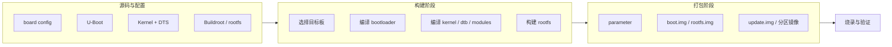
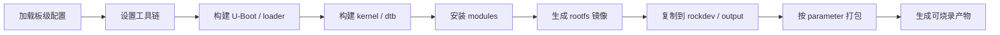
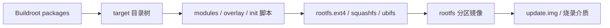

第一次接触 Rockchip Linux SDK 时，很多人会把它当成一个“比较大的 Makefile 工程”：执行一次 `./build.sh`，等一段时间，最后得到若干镜像文件。这个理解只能支撑首次编译，支撑不了真正的 BSP 工作。

BSP 工程师面对的不是“能不能编出来”这么简单，而是要回答更具体的问题：这次构建用了哪个板级配置？U-Boot、kernel、dtb、rootfs 分别从哪里来？修改设备树后，最终烧录进去的是不是新 dtb？`parameter` 分区有没有跟 rootfs 大小匹配？量产包里的每个镜像能不能追溯到源码提交？

在 MCU 工程里，一个 `.hex` 或 `.bin` 往往就代表最终固件。嵌入式 Linux 不同，最终系统由多段启动程序、内核、设备树、根文件系统、模块、分区表和升级包共同构成。只会执行总构建命令，很容易在“构建成功但板子不启动”“改了驱动但现象没变化”“同事烧录的包和自己编的不一致”这类问题上浪费大量时间。

本文以 RV1126 + IMX415 平台为主线，系统拆解 Rockchip SDK 的构建体系。重点不是背某个 SDK 的脚本参数，而是建立一套可复现、可追踪、可排错的工程方法。

## 1. Rockchip SDK 不是一个单体工程

Rockchip Linux SDK 通常由多个子工程组成：U-Boot 负责启动链路，Linux kernel 负责内核与驱动，Buildroot 或 Yocto 负责根文件系统，device/board 配置负责产品级参数，打包工具负责把分散产物组织成可烧录镜像。

这和 MCU 裸机工程的差异很大。MCU 工程通常是“源码 + 链接脚本 + 启动文件 + 外设库”构成一个最终固件；Linux SDK 则更像一条生产线，每个环节都有自己的输入、配置、缓存和输出。



这张图里最重要的是边界：源码目录里的文件不是最终烧录文件，编译产物也不一定等于发布产物。真正烧到板子里的通常是打包目录中的镜像，甚至是二次封装后的升级包。

因此，排查构建问题时不要只问“我改了哪个源文件”，还要继续问：

- 这个源文件是否属于当前目标板使用的配置？
- 它是否被当前构建目标重新编译？
- 编译产物是否复制到了统一输出目录？
- 打包工具是否使用了新的输出目录？
- 烧录工具实际烧进去的是不是这一次生成的文件？

只要其中任意一步断开，源码修改就不会体现在板子行为上。

## 2. 拿到 SDK 后先做环境快照

很多构建问题不是代码问题，而是环境不可追踪。不同主机、不同依赖版本、不同 SDK 分支、不同工具链路径，都可能导致构建结果差异。正式动手前，先给 SDK 做一次环境快照。

```bash
cd /path/to/rockchip-sdk
pwd

# 记录 SDK 版本状态
git rev-parse --show-toplevel
git status --short
git log -1 --oneline

# 记录主机环境
uname -a
lsb_release -a 2>/dev/null || cat /etc/os-release

# 记录磁盘空间，Rockchip SDK 构建会大量占用空间
df -h .

# 记录顶层目录
find . -maxdepth 1 -type d | sort
```

如果 SDK 是多个仓库组成，顶层 `git log` 不够，还要检查关键子目录的提交：

```bash
for d in u-boot kernel buildroot device; do
    if [ -d "$d/.git" ]; then
        echo "[$d]"
        git -C "$d" status --short
        git -C "$d" log -1 --oneline
    fi
done
```

这一步看起来繁琐，但它解决的是“这包到底从哪里来”的问题。BSP 工作经常需要在几周后复现某个问题，如果当时没有保存提交号、配置文件和镜像哈希，就只能靠猜。

建议每次正式构建都创建一个记录目录：

```bash
mkdir -p logs/build-$(date +%Y%m%d-%H%M%S)
LOGDIR=$(ls -td logs/build-* | head -1)

git status --short > "$LOGDIR/git-status.txt"
git log -1 --oneline > "$LOGDIR/git-head.txt"
uname -a > "$LOGDIR/uname.txt"
df -h . > "$LOGDIR/disk.txt"
```

如果 SDK 没有 Git 历史，至少要保存压缩包名称、解压时间、供应商版本说明和本地修改清单。没有版本追踪的 SDK，必须人为补上最基本的工程记录。

## 3. 顶层目录按职责拆开看

不同厂商交付的 Rockchip SDK 目录结构会有差异，但常见职责大体相似。不要机械记路径，应该按功能理解。

| 目录或文件 | 常见职责 | 排查时重点 |
|---|---|---|
| `build.sh` | 顶层构建入口 | 支持哪些目标、如何选择板级配置、日志输出到哪里 |
| `build/` | 构建脚本、公共函数、打包脚本 | 是否调用 u-boot/kernel/rootfs，是否覆盖输出目录 |
| `device/rockchip/` | 芯片与产品配置 | 板级配置、分区、打包参数、rootfs 类型 |
| `u-boot/` | U-Boot 源码 | defconfig、设备树、默认环境、loader 产物 |
| `kernel/` | Linux 内核源码 | defconfig、DTS/DTSI、驱动、模块安装路径 |
| `buildroot/` | 根文件系统构建 | package、overlay、busybox、init 脚本、目标 rootfs |
| `prebuilts/` | 预编译工具链和工具 | 交叉编译器、打包工具、host 工具版本 |
| `external/` | 用户态库和中间件 | ISP、媒体、RKNN、第三方组件 |
| `output/` 或 `rockdev/` | 构建输出和发布产物 | 镜像时间戳、哈希、最终烧录文件 |

先用命令确认真实目录：

```bash
find . -maxdepth 2 -type f \( -name 'build.sh' -o -name '*.mk' -o -name '*.conf' \) | sort | head -120
find device -maxdepth 4 -type f 2>/dev/null | sort | head -120
find . -maxdepth 3 -type f -name '*parameter*' 2>/dev/null | sort
```

看到 `device/rockchip/rv1126_rv1109/`、`BoardConfig.mk`、`parameter.txt`、`package-file` 这类文件时，不要马上改。先找出当前目标板到底引用哪一份配置。

常用追踪方法是搜索板卡名、芯片名和配置变量：

```bash
grep -RIn "rv1126\|RV1126\|imx415\|IMX415" device kernel/arch/arm/boot/dts u-boot/arch/arm/dts 2>/dev/null | head -120

grep -RIn "BoardConfig\|RK_KERNEL_DTS\|RK_UBOOT_DEFCONFIG\|RK_PARAMETER" build.sh build device 2>/dev/null | head -160
```

这里的目标不是一次读懂全部脚本，而是建立一条线：目标板配置文件 -> U-Boot 配置 -> kernel dts -> rootfs 配置 -> 打包参数。

## 4. 板级配置是构建体系的入口

Rockchip SDK 通常会通过板级配置文件选择构建对象。配置文件名称随 SDK 而变，可能叫 `BoardConfig.mk`、`BoardConfig-xxx.mk`、`defconfig` 或产品配置脚本。它一般会指定这些内容：

| 配置项类型 | 典型含义 |
|---|---|
| U-Boot defconfig | 选择 U-Boot 的默认配置 |
| U-Boot DTS | 选择 U-Boot 阶段使用的板级设备树 |
| Kernel defconfig | 选择 Linux 内核默认配置 |
| Kernel DTS | 选择最终编译成 dtb 的板级设备树 |
| Rootfs 类型 | Buildroot、Debian、Recovery 或其他根文件系统 |
| Parameter | 分区布局文件 |
| Package file | 指定哪些镜像参与 update 包打包 |
| 存储介质 | eMMC、SPI NAND、SPI NOR、SD 等 |

可以用下面的命令把配置文件中的关键变量提出来：

```bash
# 示例路径以实际 SDK 为准
BOARD_CONFIG=device/rockchip/rv1126_rv1109/BoardConfig.mk

sed -n '1,220p' "$BOARD_CONFIG"

grep -nE 'RK_|UBOOT|KERNEL|DTS|DEFCONFIG|ROOTFS|PARAMETER|PACKAGE' "$BOARD_CONFIG"
```

如果 SDK 支持 `lunch`、`choose_board` 或 `build.sh lunch` 之类的机制，要把选择结果保存下来：

```bash
./build.sh lunch 2>&1 | tee logs/lunch.log

# 选择后检查环境或配置链接
find . -maxdepth 3 -type l -ls 2>/dev/null | sort
find output -maxdepth 3 -type f -name '*config*' 2>/dev/null | sort | head -80
```

工程上要避免一种做法：看到一个类似的 DTS 或 defconfig 就直接修改。Rockchip SDK 里经常存在多个相似板型，文件名只差一个后缀。改错文件时，编译可能完全正常，但板子现象不会变化。

确认某个 DTS 是否参与构建，可以从配置变量和构建产物双向验证：

```bash
# 查配置里使用的 dts 名称
grep -RIn "RK_KERNEL_DTS\|KERNEL_DTS\|DTS" device build 2>/dev/null | head -120

# 查最终生成的 dtb
find kernel -type f -name '*.dtb' -printf '%TY-%Tm-%Td %TH:%TM %s %p\n' 2>/dev/null | sort | tail -30
find output rockdev -type f -name '*.dtb' -printf '%TY-%Tm-%Td %TH:%TM %s %p\n' 2>/dev/null | sort | tail -30
```

源码路径、构建路径、打包路径三者都对上，才能说明这次修改进入了发布链路。

## 5. build.sh 通常不是只执行 make

顶层 `build.sh` 往往会封装很多动作。它可能先加载板级配置，再设置工具链路径，然后分别编译 U-Boot、kernel、rootfs，最后复制镜像并调用打包工具。

建议把脚本按函数读，而不是从第一行读到最后一行。先找入口和 case 分支：

```bash
sed -n '1,260p' build.sh

grep -nE '^function |^[a-zA-Z0-9_]+\(\)|case .* in|uboot|kernel|rootfs|firmware|updateimg|pack' build.sh
```

如果脚本拆在 `build/` 目录里，继续追踪：

```bash
find build -type f -name '*.sh' | sort

grep -RIn "build_uboot\|build_kernel\|build_rootfs\|mkimage\|afptool\|rkImageMaker\|parameter" build device 2>/dev/null | head -200
```

一次完整构建至少包含这些阶段：



构建失败时，要先定位失败阶段。不要看到一屏报错就立刻改源码。比如 host 工具缺失、Python 版本不匹配、磁盘空间不足、rootfs 下载包失败，都不是内核代码问题。

推荐保留完整日志：

```bash
mkdir -p logs
./build.sh 2>&1 | tee logs/full-build-$(date +%Y%m%d-%H%M%S).log

# 快速抓错误，但不能只看最后一行
grep -nEi 'error:|failed|fatal|No such file|undefined reference|Permission denied|No space left' logs/full-build-*.log | tail -80
```

如果 SDK 支持分目标构建，修改范围越小，越应该使用越小的构建目标：

```bash
# 具体参数以实际 SDK 为准，下面是常见形态示例
./build.sh uboot
./build.sh kernel
./build.sh modules
./build.sh rootfs
./build.sh firmware
./build.sh updateimg
```

这样可以避免“只改了一个 DTS，却每次完整编译 rootfs”的低效流程，也能更清楚地判断哪一层引入了问题。

## 6. U-Boot 产物要分清 loader、SPL 和 proper

Rockchip 平台的启动产物命名容易让初学者混乱。常见文件可能包括 `idbloader.img`、`uboot.img`、`trust.img`、`MiniLoaderAll.bin`、`rkxx_loader.bin` 等。不同芯片、不同 SDK、是否启用安全启动，产物组合会不同。

不要死记文件名，先按职责理解：

| 产物类型 | 典型职责 | 常见风险 |
|---|---|---|
| 早期 loader / SPL | 被 BootROM 加载，完成 DDR 等早期初始化 | DDR 参数不匹配、启动介质不匹配 |
| U-Boot proper | 提供命令行，加载 kernel/dtb | 环境变量错误、启动命令错误、存储读取失败 |
| trust / ATF / TEE 相关镜像 | 提供安全世界或固件服务 | 镜像版本不匹配、打包顺序错误 |
| 打包后的 uboot 分区镜像 | 供烧录工具写入指定分区 | 旧文件被复用、分区偏移错误 |

构建后先查产物时间：

```bash
find u-boot output rockdev -type f \
  \( -name '*loader*' -o -name '*uboot*' -o -name '*trust*' -o -name 'idbloader.img' \) \
  -printf '%TY-%Tm-%Td %TH:%TM %s %p\n' 2>/dev/null | sort | tail -80
```

再查打包目录引用了哪些文件：

```bash
find rockdev output -maxdepth 3 -type f -printf '%s %p\n' 2>/dev/null | sort -n | tail -80

# 如果存在 package-file，查看镜像到分区的映射
find device rockdev output -type f -name '*package*' -o -name 'package-file' 2>/dev/null
```

U-Boot 改动没有生效时，常见原因不是编译失败，而是打包阶段仍使用旧镜像，或烧录工具只更新了部分分区。处理方式是把“源码产物”和“烧录产物”的哈希绑定起来：

```bash
sha256sum u-boot/*uboot* 2>/dev/null
sha256sum output/images/*uboot* rockdev/*uboot* 2>/dev/null
```

如果哈希不一致，要继续追踪复制和打包脚本，而不是继续改 U-Boot 源码。

## 7. kernel、dtb、modules 是一组，不是三个孤立文件

Linux 内核构建至少要关注三类产物：内核镜像、设备树 dtb、内核模块。它们之间存在版本关系。

| 产物 | 作用 | 常见文件 |
|---|---|---|
| kernel image | Linux 内核主体 | `Image`、`zImage`、`boot.img` |
| dtb | 板级硬件描述 | `*.dtb` |
| modules | 可加载内核模块 | `*.ko`、`/lib/modules/<kernel-release>/` |

只替换 `Image` 不替换 modules，可能导致模块版本不匹配。只替换 dtb 不重新打包，可能导致设备树不生效。只更新 rootfs 不安装新 modules，可能导致驱动缺失。

先确认内核版本字符串：

```bash
make -C kernel kernelrelease 2>/dev/null || true

# 如果已有板端系统
uname -a
cat /proc/version
ls /lib/modules
```

构建 kernel 后，检查关键产物：

```bash
find kernel -type f \
  \( -name 'Image' -o -name 'zImage' -o -name '*.dtb' -o -name '*.ko' \) \
  -printf '%TY-%Tm-%Td %TH:%TM %s %p\n' 2>/dev/null | sort | tail -120

find output rockdev -type f \
  \( -name 'boot.img' -o -name '*.dtb' -o -name '*kernel*' \) \
  -printf '%TY-%Tm-%Td %TH:%TM %s %p\n' 2>/dev/null | sort | tail -80
```

设备树修改要做三段验证：源码 DTS、编译 DTB、打包镜像。

```bash
# 1. 找源码修改
find kernel/arch/arm/boot/dts -type f -name '*rv1126*' | sort | head -80

# 2. 反编译 dtb，确认属性进入产物
dtc -I dtb -O dts -o /tmp/current.dts path/to/board.dtb
grep -n "imx415\|mipi\|i2c\|reset" /tmp/current.dts | head -80

# 3. 对比哈希，确认打包目录使用的是新文件
sha256sum path/to/build/board.dtb path/to/package/board.dtb
```

如果没有 `dtc`，先安装设备树编译工具：

```bash
sudo apt-get update
sudo apt-get install -y device-tree-compiler
```

对 IMX415 这类摄像头，dtb 是否生效尤其关键。I2C 地址、MCLK、reset GPIO、powerdown GPIO、regulator、MIPI endpoint 任意一项不正确，驱动都可能 probe 失败。构建体系层面要先确保“板端运行的是你认为的 dtb”，再进入驱动排查。

## 8. rootfs 构建要区分目录树、镜像和分区

Buildroot 生成 rootfs 时，至少会涉及三个层次：目标目录树、文件系统镜像、最终分区镜像。



目标目录树是普通文件目录，便于检查 `/etc`、`/sbin/init`、`/lib/modules` 等内容。文件系统镜像是把目录树打包成 ext4、squashfs、ubifs 等格式。最终分区镜像则可能还会经过 padding、压缩、签名或 vendor 工具处理。

构建后先找 rootfs 相关产物：

```bash
find buildroot output rockdev -type f \
  \( -name '*rootfs*' -o -name '*.ext4' -o -name '*.squashfs' -o -name '*.ubifs' -o -name '*.ubi' \) \
  -printf '%TY-%Tm-%Td %TH:%TM %s %p\n' 2>/dev/null | sort | tail -100
```

检查 rootfs 内容时，不要直接在板端猜。可以先在主机上挂载 ext4 镜像，或用工具检查 squashfs/ubifs。以 ext4 为例：

```bash
mkdir -p /tmp/rv1126-rootfs
sudo mount -o loop path/to/rootfs.ext4 /tmp/rv1126-rootfs
ls -l /tmp/rv1126-rootfs/sbin/init /tmp/rv1126-rootfs/bin/sh
ls /tmp/rv1126-rootfs/lib/modules 2>/dev/null
sudo umount /tmp/rv1126-rootfs
```

如果 rootfs 是只读 squashfs：

```bash
unsquashfs -l path/to/rootfs.squashfs | head -80
unsquashfs -l path/to/rootfs.squashfs | grep -E '/sbin/init|/bin/sh|/lib/modules' | head -80
```

板端验证要看实际挂载关系：

```bash
cat /proc/cmdline
mount
cat /proc/filesystems
cat /proc/partitions
ls -l /sbin/init /bin/sh
ls /lib/modules 2>/dev/null
```

内核启动成功但 rootfs 挂载失败，通常和 `root=`、文件系统类型、分区布局、驱动是否内置有关。比如根文件系统在 eMMC 上，但对应 MMC 控制器驱动被编成模块，内核挂载 rootfs 前就无法加载模块，这种配置天然会失败。

## 9. parameter 是分区地图，不能随手改

Rockchip SDK 里的 `parameter` 或类似文件定义了分区布局。它相当于启动介质的地图，告诉烧录工具和系统每个镜像应该写到哪里。

典型分区可能包括 loader、uboot、boot、recovery、rootfs、oem、userdata 等。实际名称和格式以 SDK 为准。

分析分区时，至少要把四类信息对齐：

| 信息来源 | 需要确认什么 |
|---|---|
| `parameter` | 分区名称、大小、偏移、rootfs 分区位置 |
| package file | 哪个镜像写入哪个分区 |
| U-Boot bootargs | `root=` 指向哪个设备或分区 |
| Linux 板端信息 | `/proc/cmdline`、`/proc/partitions`、`mount` 是否一致 |

查找 parameter：

```bash
find device output rockdev -type f -iname '*parameter*' -printf '%p\n' 2>/dev/null

# 示例：查看内容
sed -n '1,200p' path/to/parameter.txt
```

分区排错时，常见错误包括：

| 现象 | 可能原因 |
|---|---|
| 烧录工具报分区大小不足 | rootfs 镜像超过 parameter 中分区大小 |
| U-Boot 能加载 kernel，Linux 挂 rootfs 失败 | `root=` 与实际分区不一致 |
| 更新包烧录成功但仍是旧系统 | package file 没包含目标分区，或烧录工具未勾选 |
| eMMC 正常，SPI NAND 异常 | 存储介质坏块、UBI 参数、分区策略不同 |
| 改 parameter 后系统启动异常 | loader/U-Boot/kernel 对分区名称理解不一致 |

不要把 parameter 当成普通配置临时试错。分区布局一旦进入发布流程，就影响升级兼容性、数据保留、恢复出厂和量产工具。任何变更都应该记录变更原因、旧布局、新布局、是否破坏 OTA 兼容、是否需要全量擦除。

## 10. 打包流程决定最终烧录内容

构建产物只有进入打包流程，才会成为可烧录发布包。Rockchip SDK 常见打包工具可能包括 `afptool`、`rkImageMaker`、`upgrade_tool` 相关工具，具体以 SDK 为准。

要重点看三件事：

- 打包输入目录在哪里；
- package file 如何把镜像映射到分区；
- 最终生成的 `update.img` 或分区镜像是否更新。

常用检查命令：

```bash
find . -type f \( -name 'package-file' -o -name '*package*' -o -name '*parameter*' \) 2>/dev/null | sort
find output rockdev -maxdepth 3 -type f -printf '%TY-%Tm-%Td %TH:%TM %s %p\n' 2>/dev/null | sort | tail -120
sha256sum output/* rockdev/* 2>/dev/null | sort
```

如果 SDK 支持单独打包，应该把“编译”和“打包”分开验证：

```bash
# 示例目标以实际 SDK 为准
./build.sh kernel
./build.sh firmware
./build.sh updateimg
```

很多“修改没生效”的根因都在这里：kernel 已经重新编译，但 `boot.img` 没重新生成；dtb 已经更新，但打包目录仍是旧文件；rootfs 目录改了，但 rootfs 镜像没重新制作；`update.img` 时间戳没变，却被拿去烧录。

建议构建结束后强制生成镜像清单：

```bash
RELDIR=logs/release-$(date +%Y%m%d-%H%M%S)
mkdir -p "$RELDIR"

find output rockdev -type f -printf '%s %TY-%Tm-%Td %TH:%TM %p\n' 2>/dev/null | sort > "$RELDIR/files.txt"
sha256sum $(find output rockdev -type f 2>/dev/null) > "$RELDIR/sha256.txt" 2>/dev/null

cp -a device "$RELDIR/device-config-snapshot" 2>/dev/null || true
```

如果输出文件太多，可以只归档可烧录镜像和关键配置，但哈希必须有。镜像文件的哈希是沟通问题时最直接的证据。

## 11. 增量编译要有边界感

为了提高效率，BSP 工程中必然会用增量编译。但增量编译也容易引入假象：源码改了，旧中间产物没刷新；配置改了，缓存没有清；rootfs 包配置改了，但目标目录没有重新安装。

常见修改与建议构建范围如下：

| 修改内容 | 建议动作 |
|---|---|
| U-Boot 命令或默认环境 | 重新构建 U-Boot，重新打包对应分区 |
| U-Boot DTS | 重新构建 U-Boot，确认 loader/uboot 镜像更新时间 |
| Kernel 驱动源码 | 重新构建 kernel/modules，安装 modules，重新打包 boot/rootfs |
| Kernel DTS/DTSI | 重新构建 dtb，确认打包目录 dtb 更新 |
| Kernel config | 重新构建 kernel，必要时清理旧配置缓存 |
| Buildroot package | 重新构建 package/rootfs，确认目标文件进入 rootfs 镜像 |
| init 脚本或 overlay | 重新生成 rootfs 镜像，重新打包 |
| parameter/package file | 重新打包，必要时全量烧录验证 |

当现象和预期不一致时，先做时间戳和哈希验证：

```bash
# 修改前后记录目标文件
stat path/to/output.img
sha256sum path/to/output.img

# 查看最近更新的产物
find output rockdev kernel u-boot buildroot -type f -mmin -30 \
  -printf '%TY-%Tm-%Td %TH:%TM %s %p\n' 2>/dev/null | sort | tail -120
```

如果怀疑缓存污染，再做有边界的清理。不要一上来删除整个 SDK 输出目录，尤其是在多人协作或磁盘紧张的环境里。优先使用 SDK 提供的 clean 目标，并保留清理前日志。

```bash
# 示例目标以实际 SDK 为准
./build.sh cleanall
./build.sh clean_kernel
./build.sh clean_rootfs
```

如果没有明确 clean 目标，先阅读脚本再清理，不要盲删目录。

## 12. 构建失败的分层排查方法

构建失败要按阶段拆，不要只看最后几行。

| 阶段 | 典型错误 | 排查方向 |
|---|---|---|
| 环境准备 | host 工具缺失、Python/Perl 版本问题 | 安装依赖、检查 PATH、检查 SDK 文档 |
| 工具链 | `arm-linux-gnueabihf-gcc not found` | 工具链路径、环境变量、执行权限 |
| U-Boot | defconfig 不存在、DTS 编译失败 | 板级配置、DTS include、Kconfig |
| Kernel | 驱动编译错误、符号未定义 | Kconfig、Makefile、API 版本、模块依赖 |
| Rootfs | 包下载失败、host 工具编译失败 | 网络、镜像源、Buildroot 配置、依赖库 |
| 打包 | 找不到镜像、分区大小不足 | package file、parameter、输出目录 |

常用定位命令：

```bash
# 找第一处 error，很多时候第一处才是根因
grep -nEi 'error:|fatal:|failed|No such file|undefined reference' logs/full-build-*.log | head -80

# 找最后阶段的上下文
tail -200 logs/full-build-*.log

# 检查工具链
which arm-linux-gnueabihf-gcc 2>/dev/null || true
which aarch64-linux-gnu-gcc 2>/dev/null || true

# 检查磁盘和 inode
df -h .
df -i .
```

几个高频问题需要特别注意：

- `No space left on device` 不一定只看磁盘容量，也可能是 inode 用尽；
- `Permission denied` 可能是脚本没有执行权限，也可能是 SDK 放在不支持 Linux 权限的文件系统；
- `undefined reference` 要区分内核链接错误和用户态库链接错误；
- `DTC` 报错通常要看 DTS include 层级，不要只改报错行；
- Buildroot 下载失败不代表包配置错，可能只是网络源不可达。

## 13. 板端验证构建产物是否生效

构建成功只是第一步，板端验证才是闭环。烧录后至少要确认内核版本、启动参数、分区、设备树、rootfs 内容。

板端基础命令：

```bash
uname -a
cat /proc/version
cat /proc/cmdline
cat /proc/partitions
mount
ls /lib/modules 2>/dev/null
```

确认设备树：

```bash
# 板端查看当前设备树节点，路径以实际节点为准
ls /proc/device-tree
tr -d '\0' < /proc/device-tree/compatible; echo
tr -d '\0' < /proc/device-tree/model; echo

# 查看摄像头相关节点示例
grep -R . /proc/device-tree 2>/dev/null | grep -i "imx415" | head -40
```

确认模块版本：

```bash
uname -r
find /lib/modules -maxdepth 2 -type f -name '*.ko' | head -40
modinfo path/to/module.ko 2>/dev/null | head -40
```

确认 rootfs 是否更新，可以在 rootfs 中放一个构建标记文件。这个方法很朴素，但很有效。

```bash
# 在 rootfs overlay 或构建脚本中生成
cat > board-release.txt <<EOF
board=rv1126-imx415
build_time=$(date -Iseconds)
git_head=$(git rev-parse HEAD 2>/dev/null || echo unknown)
EOF
```

板端启动后检查：

```bash
cat /etc/board-release 2>/dev/null || cat /board-release.txt 2>/dev/null
```

没有构建标记时，只靠“感觉像新包”判断，非常容易出错。

## 14. 推荐的发布产物归档结构

BSP 交付不是只给一个 `update.img`。至少应该同时保存配置、日志、哈希和验证记录。推荐结构如下：

```text
release-rv1126-imx415-YYYYMMDD-HHMM/
├── images/
│   ├── update.img
│   ├── boot.img
│   ├── rootfs.img
│   └── uboot.img
├── configs/
│   ├── BoardConfig.mk
│   ├── parameter.txt
│   ├── kernel_defconfig
│   └── buildroot_defconfig
├── logs/
│   ├── build.log
│   ├── flash.log
│   └── boot.log
├── sha256.txt
├── git-status.txt
├── git-head.txt
└── release-note.md
```

生成归档目录的示例脚本：

```bash
#!/usr/bin/env bash
set -e

BOARD=rv1126-imx415
STAMP=$(date +%Y%m%d-%H%M)
RELEASE=release-${BOARD}-${STAMP}

mkdir -p "$RELEASE/images" "$RELEASE/configs" "$RELEASE/logs"

cp -av rockdev/*.img "$RELEASE/images/" 2>/dev/null || true
cp -av output/images/*.img "$RELEASE/images/" 2>/dev/null || true

cp -av device/rockchip/*/*BoardConfig*.mk "$RELEASE/configs/" 2>/dev/null || true
cp -av device/rockchip/*/*parameter* "$RELEASE/configs/" 2>/dev/null || true

find "$RELEASE/images" -type f -exec sha256sum {} \; > "$RELEASE/sha256.txt"
git status --short > "$RELEASE/git-status.txt" 2>/dev/null || true
git log -1 --oneline > "$RELEASE/git-head.txt" 2>/dev/null || true

cat > "$RELEASE/release-note.md" <<EOF
# ${BOARD} release ${STAMP}

## Build
- board: ${BOARD}
- time: ${STAMP}

## Verify
- flash:
- serial boot:
- kernel:
- rootfs:
- imx415:
EOF
```

这个归档并不复杂，但能显著降低协作成本。别人拿到的不再是一个孤立镜像，而是一份能复现、能审计、能定位问题的交付物。

## 15. RV1126 + IMX415 场景下的构建关注点

围绕 RV1126 + IMX415，构建体系里要特别关注这些点：

| 关注点 | 为什么重要 |
|---|---|
| Kernel DTS 是否正确 | IMX415 的 I2C、MCLK、reset、电源、MIPI endpoint 都依赖设备树 |
| U-Boot 与 kernel console 是否一致 | 串口日志中断会影响早期 bring-up 判断 |
| rootfs 是否包含媒体工具 | `v4l2-ctl`、media 工具、调试脚本会影响摄像头验证效率 |
| modules 是否匹配 kernel | 摄像头、ISP、V4L2 相关模块版本不一致会导致加载失败 |
| 分区是否容纳 rootfs | 加入调试工具和媒体库后 rootfs 可能超过原分区 |
| 发布包是否保存 boot log | 启动链路问题必须靠串口日志回溯 |

摄像头 bring-up 前，先确认系统构建闭环可靠。否则驱动调试时会出现最糟糕的情况：你以为自己在调 IMX415，实际板子运行的是旧 dtb、旧模块或旧 rootfs。

## 16. 最小验证清单

每次正式构建后，至少完成下面这张清单。

| 检查项 | 命令或方法 | 通过标准 |
|---|---|---|
| SDK 版本 | `git log -1 --oneline` | 能追溯提交 |
| 本地修改 | `git status --short` | 修改项明确 |
| 构建日志 | `tee logs/full-build-*.log` | 日志完整保存 |
| 镜像时间 | `find output rockdev -type f` | 目标镜像时间更新 |
| 镜像哈希 | `sha256sum` | 已归档 |
| dtb 生效 | `dtc -I dtb -O dts` | 关键节点存在 |
| rootfs 内容 | mount 或 unsquashfs | init、modules、工具存在 |
| 分区一致 | parameter + `/proc/cmdline` | root 指向正确 |
| 板端版本 | `uname -a`、构建标记 | 与构建记录一致 |
| 启动日志 | 串口保存 | 能分段定位 |

## 17. 本文里程碑

完成本文的实践后，应该达到三个结果。

第一，能从板级配置文件追踪到 U-Boot、kernel、dtb、rootfs 和 parameter，不再把 SDK 当成黑盒脚本。

第二，能判断一次修改是否真正进入了最终烧录包，尤其是设备树、kernel modules 和 rootfs 这三类最容易“编了但没生效”的内容。

第三，能生成一份可交付的构建归档，包括镜像、配置、日志、哈希和板端验证记录。这个习惯会直接决定后续驱动调试和量产维护的效率。

> 🏷️ Linux BSP｜Rockchip SDK｜RV1126｜IMX415｜Buildroot｜U-Boot｜设备树｜parameter｜rootfs｜固件打包