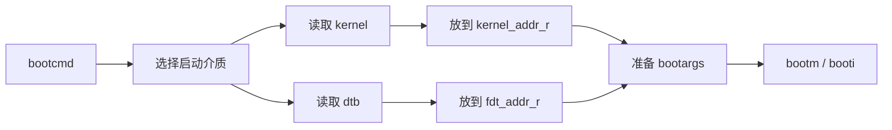
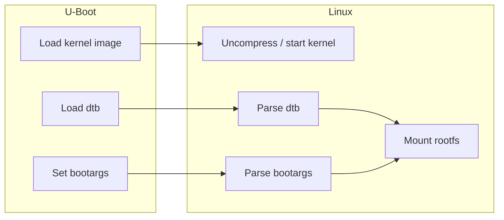
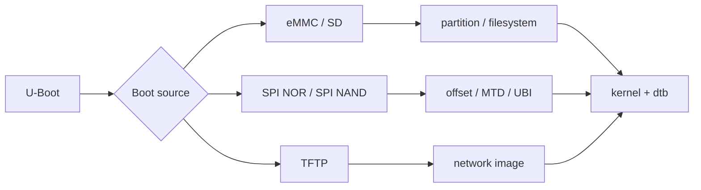

在嵌入式 Linux 系统中，U-Boot 很容易被误解成“一个启动菜单”或者“进入 Linux 前打印几行日志的东西”。这种理解太浅。真正做 BSP bring-up 时，U-Boot 是连接芯片内部 BootROM、外部启动介质、DDR、Linux kernel、设备树和 rootfs 的关键中间层。

对 MCU 工程师来说，上电后的路径通常比较直接：芯片从内部 ROM 或 Flash 起步，执行启动文件，初始化栈、数据段、BSS，然后进入 `main()`。到了 RV1126 这类 Cortex-A Linux SoC，启动链路被拆成多个阶段：BootROM 先找早期引导镜像，早期 loader 或 SPL 初始化 DDR，U-Boot proper 加载 Linux 内核和设备树，Linux 再挂载 rootfs 并启动用户空间。

这条链路中任何一段出错，现象都可能是“板子起不来”。但不同阶段的定位方法完全不同。没有任何串口输出时，优先看供电、复位、启动脚、BootROM、loader 和串口硬件；能进入 U-Boot 命令行但进不了 Linux，重点看启动介质、环境变量、kernel/dtb 加载地址和 bootargs；Linux 已经 panic 在 rootfs 挂载阶段，就不能继续把问题全部归咎于 U-Boot。

本文先不急着逐行读 U-Boot 源码，而是建立工程视角：U-Boot 在嵌入式 Linux 中负责什么、不负责什么、它和 SPL/kernel/dtb/rootfs 的边界在哪里，以及如何用串口日志和命令行把启动问题分层定位。

## 1. 先把整条启动链路摆清楚

RV1126 这类 Rockchip SoC 的启动链路可以抽象成下面几层。具体文件名会随 SDK、芯片配置、安全启动方案和启动介质变化，但职责边界基本一致。

```mermaid
flowchart LR
    A[Power On / Reset] --> B[BootROM]
    B --> C[Loader / SPL]
    C --> D[U-Boot proper]
    D --> E[Load Kernel Image]
    D --> F[Load DTB]
    D --> G[Prepare bootargs]
    E --> H[Linux Kernel]
    F --> H
    G --> H
    H --> I[Mount rootfs]
    I --> J[/sbin/init / user space]
```

可以把这条链路类比成 MCU 里的启动过程，但它被拆得更细：

| Linux SoC 阶段 | MCU 类比 | 主要职责 |
|---|---|---|
| BootROM | 芯片内部启动 ROM | 根据启动模式找到第一段外部代码 |
| Loader / SPL | 极简启动文件 + 早期板级初始化 | 初始化 DDR、基础时钟、串口等早期资源 |
| U-Boot proper | 带命令行的启动环境 | 读取存储、加载 kernel/dtb、准备启动参数 |
| Linux kernel | 大型运行时内核 | 初始化驱动、挂载 rootfs、启动用户空间 |
| rootfs/init | 应用运行环境 | 启动系统服务、加载配置、运行应用 |

这里最重要的是：U-Boot 不是第一段代码，也不是最后一段代码。它前面有 BootROM 和早期 loader，后面有 Linux kernel 和 rootfs。排查时必须先判断当前卡在哪一层。

## 2. BootROM：芯片内部不可修改的第一棒

BootROM 是固化在 SoC 内部的代码，用户通常不能修改。它在芯片复位后运行，根据启动脚、efuse、下载模式或厂商定义的启动优先级，从外部存储介质加载早期引导镜像。

BootROM 的能力通常有限：

- 识别有限的启动介质，例如 eMMC、SD、SPI NAND、SPI NOR 或 USB 下载模式；
- 按固定格式读取早期镜像；
- 把一小段代码搬到片内 SRAM 或指定位置执行；
- 在下载模式下和烧录工具通信。

BootROM 不会做这些事情：

- 不会加载完整 Linux kernel；
- 不会理解复杂 rootfs；
- 不会初始化完整外设驱动；
- 不会帮你解析 Linux 设备树。

所以完全无串口日志时，不能马上说“U-Boot 坏了”。更合理的检查顺序是：

| 检查项 | 说明 |
|---|---|
| 供电 | 核心电压、IO 电压、电源时序是否满足板卡要求 |
| 复位 | reset 管脚是否释放，电平是否稳定 |
| 启动模式 | boot strap、按键、下载模式是否正确 |
| 启动介质 | eMMC/SPI NAND/SD 是否焊接、供电、可读 |
| 串口硬件 | TX/RX 是否接反，电平是否匹配，波特率是否正确 |
| 烧录状态 | loader 是否真正写入，烧录工具是否报错 |

BootROM 阶段的错误通常表现为“无日志”“只能进 USB 下载模式”“烧录工具识别异常”。这时应该先查硬件启动条件和早期镜像，而不是修改 Linux 驱动。

## 3. Loader / SPL：DDR 初始化是第一道硬门槛

SPL 是 Secondary Program Loader，通常表示 U-Boot 的早期加载阶段。Rockchip SDK 中也可能使用厂商 loader、MiniLoader、idbloader 等命名。不同 SDK 的命名不完全一致，但这一阶段的核心任务很明确：在资源极少的环境下完成早期硬件准备，尤其是 DDR 初始化。

为什么 DDR 这么关键？因为 BootROM 阶段通常只能使用很小的片内 SRAM，放不下完整 U-Boot，更放不下 Linux kernel。只有 DDR 初始化成功，后续大体积镜像才能加载和运行。


DDR 初始化失败的现象通常比较早：

| 现象 | 可能原因 |
|---|---|
| 完全无日志 | loader 没运行、串口未初始化、启动介质错误 |
| 日志停在 DDR init 附近 | DDR 参数、频率、训练失败 |
| 冷启动失败、热启动偶发成功 | 电源时序、DDR 稳定性、复位时序问题 |
| U-Boot 能进但 kernel 随机崩 | DDR 边界稳定性不足 |
| 大内存访问异常 | DDR 容量配置或地址映射错误 |

Rockchip 平台的 DDR 参数往往来自厂商工具、板级配置或预编译 loader。BSP 工程中不要随意混用不同板卡的 loader。即使 SoC 一样，DDR 型号、颗粒数量、走线拓扑、电源时序不同，也可能导致早期启动失败。

在 U-Boot proper 已经能运行时，可以做一些基础观察，但这不能替代完整 DDR 压测：

```bash
bdinfo
printenv

# 地址仅为示例，必须以实际 DDR 起始地址和内存布局为准
md.b 0x60000000 0x40
mw.b 0x60000000 0x5a 0x100
md.b 0x60000000 0x40
```

真正评估 DDR 稳定性，还需要结合厂商 DDR 测试工具、长时间压力测试、温度边界、电压边界和系统运行负载。U-Boot 下简单读写只能证明某个地址当前能访问，不能证明整片 DDR 可靠。

## 4. U-Boot proper：完整启动环境开始工作

DDR 可用后，系统进入 U-Boot proper。这个阶段的能力比 SPL 强得多：它有命令行、有驱动模型、有环境变量、有存储和网络命令，可以从 eMMC、SD、SPI Flash、网络等来源加载后续镜像。

U-Boot proper 的核心职责可以拆成六类：

| 职责 | 具体内容 | 常用观察手段 |
|---|---|---|
| 板级初始化 | 串口、时钟、基础外设、存储控制器 | 启动日志、`bdinfo` |
| 启动介质访问 | 访问 eMMC、SD、SPI NAND/NOR、网络 | `mmc`、`part`、`sf`、`mtd`、`tftp` |
| 镜像加载 | 把 kernel、dtb、ramdisk 等加载到 DDR | `fatload`、`ext4load`、`load`、`tftpboot` |
| 参数准备 | 组织 bootargs、fdt 地址、initrd 地址 | `printenv`、`fdt` |
| 跳转内核 | 执行 `bootm`、`booti` 或 distro boot | 启动日志 |
| 交互调试 | 临时读写内存、寄存器、GPIO、环境变量 | `md`、`mw`、`setenv`、`saveenv` |

它不负责 Linux 驱动 probe，不负责应用自启动，不负责 rootfs 里的服务管理。比如 IMX415 驱动 probe 失败，多数情况下应该看 Linux 设备树、I2C、pinctrl、clock、regulator、V4L2 子系统，而不是先改 U-Boot。但如果 U-Boot 传给 Linux 的 dtb 本身就是旧的或错的，那么问题源头仍在启动阶段。

## 5. U-Boot 的源码和构建入口在哪里

在 Rockchip SDK 中，U-Boot 通常位于 `u-boot/` 目录。进入目录后，先不要急着改源码，应该先确认版本、配置和目标板。

```bash
cd /path/to/rockchip-sdk/u-boot

git log -1 --oneline
git status --short

find configs -maxdepth 1 -type f | grep -i 'rv1126\|rv1109' | sort
find arch/arm/dts -maxdepth 1 -type f | grep -i 'rv1126\|rv1109' | sort | head -80
```

顶层 SDK 的板级配置通常会指定 U-Boot defconfig。回到 SDK 根目录查：

```bash
cd /path/to/rockchip-sdk

grep -RIn "RK_UBOOT_DEFCONFIG\|UBOOT_DEFCONFIG\|u-boot.*defconfig" device build 2>/dev/null | head -120
```

如果找到类似变量，要继续确认它和 `u-boot/configs/` 下的文件对应：

```bash
ls u-boot/configs/*rv1126* 2>/dev/null
sed -n '1,180p' u-boot/configs/<your_defconfig>
```

U-Boot 配置不是孤立的，它通常还会关联 U-Boot 阶段的 dts。这个 dts 和 Linux kernel 的 dts 可能同名相似，但它们不是同一个文件。U-Boot 用自己的设备树描述启动阶段需要的硬件，Linux 用 kernel 目录下的设备树描述系统运行阶段的硬件。

| 文件类型 | 常见路径 | 作用 |
|---|---|---|
| U-Boot defconfig | `u-boot/configs/*defconfig` | 控制 U-Boot 功能开关 |
| U-Boot DTS | `u-boot/arch/arm/dts/*.dts` | 描述 U-Boot 阶段需要的硬件 |
| Linux DTS | `kernel/arch/arm/boot/dts/*.dts` | 描述 Linux 阶段完整硬件 |
| BoardConfig | `device/.../BoardConfig*.mk` | 把板级选择串起来 |

这也是常见误区：修改 kernel DTS 不会自动修改 U-Boot DTS，修改 U-Boot DTS 也不等于 Linux 摄像头节点已经生效。

## 6. U-Boot 环境变量是启动行为的配置面

U-Boot 环境变量保存启动命令、启动参数、加载地址、网络参数、启动顺序等信息。它既是强大的调试入口，也是很容易引入隐性差异的地方。

常见变量包括：

| 变量 | 常见作用 |
|---|---|
| `bootcmd` | 自动启动时执行的命令 |
| `bootargs` | 传给 Linux kernel 的启动参数 |
| `bootdelay` | 自动启动前等待秒数 |
| `kernel_addr_r` | kernel 加载到 DDR 的地址 |
| `fdt_addr_r` | dtb 加载到 DDR 的地址 |
| `ramdisk_addr_r` | initrd 加载地址 |
| `ipaddr` / `serverip` | 网络调试地址 |
| `ethaddr` | MAC 地址 |

进入 U-Boot 命令行后，第一件事通常是保存环境变量：

```bash
printenv
printenv bootcmd
printenv bootargs
printenv kernel_addr_r
printenv fdt_addr_r
bdinfo
```

临时修改变量时要非常谨慎：

```bash
setenv bootdelay 3
setenv bootargs 'console=ttyFIQ0,115200 root=/dev/mmcblk0p8 rw rootwait loglevel=7'

# 只本次生效，不写入持久化环境
boot
```

`saveenv` 会把环境变量写入持久化存储。调试阶段建议先不要随便执行 `saveenv`。一旦保存，板子行为就可能和源码默认环境不一致，导致“同一个镜像在这块板能起，在另一块板不能起”。

如果必须保存，至少记录修改前后：

```text
修改前：保存完整 printenv 串口日志
修改动作：记录 setenv 命令
修改后：再次保存完整 printenv 串口日志
恢复方式：记录 env default 或重新烧录环境区的方法
```

环境变量也应当被当成版本化对象。长期有效的启动参数，不应该只存在某块板子的环境区里，而应该回到 U-Boot 默认环境、板级配置或打包流程中维护。

## 7. bootcmd 是 U-Boot 自动启动的主线

`bootcmd` 决定倒计时结束后 U-Boot 做什么。不同 SDK 中它可能是一长串命令，也可能调用多个子变量，例如 `run distro_bootcmd`、`run boot_from_mmc`、`run boot_fit` 等。

查看方式：

```bash
printenv bootcmd
printenv
```

如果 `bootcmd` 调用了其他变量，要逐层展开：

```bash
printenv bootcmd
printenv distro_bootcmd
printenv boot_targets
printenv bootargs
```

典型启动动作可以拆成：



排查时要抓住四个问题：

- 从哪个介质读：eMMC、SD、SPI NAND、网络？
- 读哪个位置：分区、文件路径、偏移地址？
- 放到哪里：kernel、dtb、ramdisk 的 DDR 地址是否冲突？
- 用什么启动：`bootm`、`booti`、FIT image 还是 Android boot image？

例如在 eMMC/FAT 分区加载文件的命令可能类似：

```bash
mmc dev 0
fatls mmc 0:1
fatload mmc 0:1 ${kernel_addr_r} Image
fatload mmc 0:1 ${fdt_addr_r} rv1126-board.dtb
booti ${kernel_addr_r} - ${fdt_addr_r}
```

在 ext4 分区加载可能类似：

```bash
ext4ls mmc 0:2 /boot
ext4load mmc 0:2 ${kernel_addr_r} /boot/Image
ext4load mmc 0:2 ${fdt_addr_r} /boot/rv1126-board.dtb
booti ${kernel_addr_r} - ${fdt_addr_r}
```

这些命令只是形态示例，实际板卡要以 SDK 的启动方案为准。关键是学会把自动启动命令拆成可验证的小步骤。

## 8. kernel、dtb、rootfs 的加载关系

U-Boot 真正交给 Linux 的核心内容有三类：kernel image、dtb、bootargs。rootfs 本身通常不是由 U-Boot 完整加载进内存，而是由 Linux kernel 根据 `bootargs` 中的 `root=` 参数去挂载。当然，如果使用 initramfs 或 ramdisk，U-Boot 也可能加载 ramdisk。



三者关系如下：

| 对象 | 谁加载或使用 | 关键检查点 |
|---|---|---|
| kernel image | U-Boot 加载，CPU 跳转执行 | 镜像格式、加载地址、启动命令 |
| dtb | U-Boot 加载，Linux 解析 | 是否为目标板 dtb、地址是否正确、节点是否更新 |
| bootargs | U-Boot 组织，Linux 解析 | console、root、rootfstype、earlycon、init |
| rootfs | Linux kernel 挂载 | 分区、文件系统驱动、init、模块路径 |

这解释了很多现象：

- U-Boot 能读到 rootfs 分区，不代表 Linux 一定能挂载 rootfs；
- Linux 找不到 rootfs，不一定是 U-Boot 没加载 rootfs，可能是 `root=` 错、驱动没内置、分区名变了；
- 改了 kernel DTS 但 U-Boot 仍加载旧 dtb，Linux 驱动现象不会变；
- bootargs 里的 console 和 dtb 里的 UART 状态不一致，可能导致 Linux 后续无日志。

## 9. bootargs：Linux 启动参数的主入口

`bootargs` 是传给 Linux kernel 的命令行参数。板端进入 Linux 后可以查看：

```bash
cat /proc/cmdline
```

常见参数含义：

| 参数 | 含义 |
|---|---|
| `console=` | 指定内核控制台输出串口和波特率 |
| `earlycon=` | 启用更早期的串口输出，便于看内核早期日志 |
| `root=` | 指定根文件系统设备或分区 |
| `rootfstype=` | 指定根文件系统类型，如 ext4、squashfs、ubifs |
| `rootwait` | 等待 root 设备出现，常用于 MMC/USB 等较晚初始化设备 |
| `rw` / `ro` | 根文件系统读写或只读挂载 |
| `init=` | 指定第一个用户空间进程 |
| `loglevel=` | 控制内核日志级别 |
| `ignore_loglevel` | 打印更多内核日志，调试阶段常用 |

一个示例：

```text
console=ttyFIQ0,115200 earlycon root=/dev/mmcblk0p8 rootwait rw init=/sbin/init loglevel=7
```

这只是示例，实际串口名、分区号和参数必须以板卡为准。Rockchip 平台可能使用 `ttyFIQ0`、`ttyS0` 或其他串口名，不能照抄。

调试 bootargs 时，推荐先临时修改，不保存环境：

```bash
setenv bootargs 'console=ttyFIQ0,115200 earlycon root=/dev/mmcblk0p8 rootwait rw loglevel=7 ignore_loglevel'
boot
```

Linux 启动后确认实际接收到的参数：

```bash
cat /proc/cmdline
```

如果 `/proc/cmdline` 和 U-Boot 中 `printenv bootargs` 不一致，说明启动命令中可能动态拼接了参数，或者使用了设备树 `/chosen/bootargs`、boot image header、distro boot 脚本等其他来源。此时要继续追踪 bootcmd 的完整展开。

## 10. dtb：U-Boot 传递给 Linux 的硬件说明书

设备树 dtb 是 Linux 理解板级硬件的关键输入。U-Boot 的任务通常是把正确的 dtb 加载到内存，并在启动 kernel 时把 dtb 地址传进去。

常见启动命令形态：

```bash
booti ${kernel_addr_r} - ${fdt_addr_r}
```

其中第三个参数就是 dtb 地址。如果这个地址异常，或者 dtb 内容不是目标板对应版本，Linux 可能出现各种异常：没有串口、内存大小异常、I2C 设备不出现、IMX415 不 probe、MIPI CSI 链路不完整。

在 U-Boot 下可以检查 fdt：

```bash
printenv fdt_addr_r
fdt addr ${fdt_addr_r}
fdt header
fdt print /chosen
fdt print /memory
```

如果 U-Boot 支持，可以直接查看摄像头相关节点。路径以实际 dtb 为准：

```bash
fdt print /i2c@xxxx
fdt print /mipi-csi@xxxx
```

在 Linux 板端可以从 `/proc/device-tree` 验证当前设备树：

```bash
tr -d '\0' < /proc/device-tree/model; echo
tr -d '\0' < /proc/device-tree/compatible; echo
ls /proc/device-tree

# 搜索 imx415 相关信息，具体结果取决于节点命名
find /proc/device-tree -iname '*imx415*' 2>/dev/null
```

如果怀疑 dtb 不是新版本，可以在 DTS 中临时加入一个无害标记属性，例如产品版本标记，然后在板端读取验证。正式代码中应使用规范属性，不要保留随意调试字段。

```dts
/ {
    model = "RV1126 IMX415 Board";
};
```

板端验证：

```bash
tr -d '\0' < /proc/device-tree/model; echo
```

IMX415 bring-up 中，设备树至少会牵涉 I2C 控制器、sensor 节点、MCLK、reset/pwdn GPIO、regulator、pinctrl、MIPI endpoint、ISP pipeline 等内容。U-Boot 阶段不负责驱动 probe，但它必须确保 Linux 拿到正确的 dtb。

## 11. 镜像格式决定启动命令

U-Boot 支持多种镜像格式，不同格式使用的启动命令不同。常见有 legacy uImage、ARM64 Image、zImage、FIT image、Android boot image 等。RV1126 是 ARM Cortex-A7，实际内核镜像格式要以 SDK 为准。

| 镜像/启动方式 | 常见命令 | 说明 |
|---|---|---|
| legacy uImage | `bootm` | 带 U-Boot header 的传统格式 |
| ARM64 Image | `booti` | 64 位 ARM 常见方式 |
| zImage | `bootz` | 32 位 ARM 压缩内核常见方式 |
| FIT image | `bootm` | 可包含 kernel、dtb、ramdisk、签名 |
| Android boot image | SDK 脚本封装 | 需要按厂商启动脚本理解 |

不要机械套命令。判断方式包括：

```bash
file path/to/Image path/to/zImage path/to/boot.img 2>/dev/null
mkimage -l path/to/uImage 2>/dev/null || true
```

U-Boot 下也可以观察启动日志。如果命令和镜像格式不匹配，通常会出现 bad magic、Wrong Image Format、FDT 错误等提示。

加载地址也要谨慎。kernel、dtb、ramdisk 地址不能互相覆盖，也不能落到 U-Boot 自己占用区域。常见变量：

```bash
printenv kernel_addr_r
printenv fdt_addr_r
printenv ramdisk_addr_r
bdinfo
```

`bdinfo` 可以看到内存布局信息。真实项目中地址应来自 SDK 默认配置、芯片内存映射和 U-Boot 文档，不要从其他板子随意复制。

## 12. 启动介质选择：eMMC、SD、SPI Flash、网络

U-Boot 可以从不同介质加载镜像。BSP 调试时，经常需要在量产启动介质和临时调试介质之间切换。



### eMMC / SD

常用命令：

```bash
mmc list
mmc dev 0
mmc info
part list mmc 0
fatls mmc 0:1
ext4ls mmc 0:2 /
```

如果 `mmc list` 看不到设备，先查 U-Boot 是否启用对应控制器、设备树是否启用、供电和引脚是否正确。如果能看到设备但读分区失败，继续查分区表和文件系统支持。

### SPI NOR / SPI NAND

常用命令随 SDK 配置不同而变化，可能包括：

```bash
sf probe
sf read ${kernel_addr_r} 0x800000 0x1000000
mtd list
```

SPI NAND 还会涉及坏块管理、MTD、UBI 等问题，不能把 eMMC 的分区思路完全照搬。

### TFTP 网络调试

网络启动适合快速验证 kernel/dtb，不必每次烧录完整镜像。常见命令：

```bash
setenv ipaddr 192.168.1.50
setenv serverip 192.168.1.10
ping ${serverip}
tftpboot ${kernel_addr_r} Image
tftpboot ${fdt_addr_r} rv1126-board.dtb
booti ${kernel_addr_r} - ${fdt_addr_r}
```

使用 TFTP 时，最容易犯的错误是服务器目录里放着旧文件。每次下载前后都应该核对文件大小、时间戳或版本标记。

## 13. U-Boot 和 rootfs 的真实边界

很多人会说“U-Boot 加载 rootfs”，这句话在很多普通启动场景下并不准确。通常情况下，U-Boot 加载 kernel 和 dtb，然后通过 bootargs 告诉 Linux rootfs 在哪里。真正挂载 rootfs 的是 Linux kernel。

例外是 initramfs 或 ramdisk 场景：U-Boot 可能把 ramdisk 加载到内存，并在启动 kernel 时传入 ramdisk 地址。

普通分区 rootfs 场景：

```text
U-Boot: 加载 kernel + dtb，传入 root=/dev/mmcblk0pX
Linux : 初始化 MMC 驱动，识别分区，挂载 /dev/mmcblk0pX 为 /
```

ramdisk/initramfs 场景：

```text
U-Boot: 加载 kernel + dtb + ramdisk
Linux : 使用内存中的 ramdisk 作为早期 rootfs 或临时 rootfs
```

这一区分直接影响排错方向。

| 现象 | 更可能在哪层查 |
|---|---|
| U-Boot 读不到 kernel 文件 | U-Boot 存储驱动、分区、文件系统 |
| kernel 启动后找不到 `/dev/mmcblk0pX` | Linux MMC 驱动、设备树、内核配置 |
| kernel 找到分区但不支持文件系统 | Linux 文件系统配置是否内置 |
| 找到 rootfs 但找不到 init | rootfs 内容、`init=` 参数 |
| rootfs 挂只读或权限异常 | rootfs 制作、挂载参数、文件系统状态 |

如果 rootfs 在 eMMC 上，MMC 驱动和对应文件系统驱动必须在挂载 rootfs 前可用。通常要编进内核，而不是只作为模块放在 rootfs 里。否则内核还没挂上 rootfs，就无法读取模块。

## 14. 串口日志要按阶段切开

串口日志是启动链路最重要的证据。不要只截最后一屏，要保存从上电开始的完整日志。

一份完整日志通常可以按阶段标注：

```text
[电源复位]
[BootROM 或 loader 输出]
[DDR init 输出]
[U-Boot banner]
[U-Boot 自动倒计时]
[加载 kernel / dtb]
[Starting kernel ...]
[Linux early log]
[kernel init]
[rootfs mount]
[init / shell]
```

根据日志停止位置，可以快速分层：

| 停止位置 | 初步判断 |
|---|---|
| 无任何输出 | 供电、复位、启动模式、串口、BootROM、loader |
| 停在 DDR 初始化 | DDR 参数、loader、板级硬件 |
| 进入 U-Boot 命令行 | 早期启动基本通过，查 bootcmd/镜像加载 |
| `Starting kernel ...` 后无输出 | console、earlycon、dtb、kernel 解压或早期异常 |
| kernel panic rootfs | root 参数、分区、文件系统、init |
| 进入 shell 后外设异常 | Linux 驱动、设备树、rootfs 工具和服务 |

保存日志可以使用串口工具，也可以在 Linux 主机用 `minicom`、`picocom` 或 `tio`。示例：

```bash
# 端口和波特率以实际硬件为准
picocom -b 115200 /dev/ttyUSB0 | tee boot-$(date +%Y%m%d-%H%M%S).log
```

如果串口工具不支持直接 tee，可以使用工具自带日志功能。关键是保留从复位开始的全量输出。

## 15. U-Boot 常用命令按目标记

U-Boot 命令很多，不需要一次背完。BSP 阶段先按排查目标记一组常用命令。

| 目标 | 常用命令 |
|---|---|
| 查看环境 | `printenv`、`env print` |
| 修改环境 | `setenv`、`saveenv`、`env default -a` |
| 查看板级信息 | `bdinfo`、`version` |
| 查看内存 | `md`、`mw`、`cmp`、`crc32` |
| 查看 MMC | `mmc list`、`mmc dev`、`mmc info` |
| 查看分区 | `part list` |
| 访问文件系统 | `fatls`、`fatload`、`ext4ls`、`ext4load` |
| 网络调试 | `ping`、`tftpboot` |
| 设备树调试 | `fdt addr`、`fdt print`、`fdt header` |
| 启动 kernel | `bootm`、`booti`、`bootz` |

几个典型操作：

```bash
# 查看版本和基础信息
version
bdinfo

# 查看启动相关环境
printenv bootcmd
printenv bootargs
printenv kernel_addr_r
printenv fdt_addr_r

# 查看 eMMC 分区
mmc list
mmc dev 0
part list mmc 0

# 查看 FAT 分区文件
fatls mmc 0:1

# 查看 dtb 头部
fdt addr ${fdt_addr_r}
fdt header
```

命令是否可用取决于 U-Boot 配置。某些命令缺失，不一定是硬件不支持，可能只是 defconfig 没打开对应功能。

## 16. 从 U-Boot 跳到 Linux 的最小手动启动实验

自动启动失败时，可以把 `bootcmd` 拆成手动步骤。这样能判断失败发生在读取 kernel、读取 dtb、设置参数还是跳转内核。

以文件系统启动为例，形态如下：

```bash
mmc dev 0
part list mmc 0
fatls mmc 0:1

setenv kernel_addr_r 0x62000000
setenv fdt_addr_r 0x68000000

fatload mmc 0:1 ${kernel_addr_r} Image
fatload mmc 0:1 ${fdt_addr_r} rv1126-board.dtb

setenv bootargs 'console=ttyFIQ0,115200 earlycon root=/dev/mmcblk0p8 rootwait rw loglevel=7'
booti ${kernel_addr_r} - ${fdt_addr_r}
```

地址、分区号、文件名、串口名都必须以实际平台为准。这个实验的价值在于分段观察：

| 步骤 | 失败说明 |
|---|---|
| `mmc dev` 失败 | U-Boot 访问存储失败 |
| `part list` 失败 | 分区表或介质识别问题 |
| `fatload/ext4load` 失败 | 文件路径、文件系统或分区内容问题 |
| `booti/bootm` 报格式错误 | 启动命令和镜像格式不匹配 |
| `Starting kernel ...` 后无输出 | kernel early log、console、dtb 或内核早期问题 |
| kernel panic rootfs | Linux rootfs 挂载链路问题 |

这个实验不一定作为最终启动方案，但它能把自动脚本拆成可观察的步骤。

## 17. U-Boot 与设备树修改的常见误区

### 误区一：改了 Linux DTS，以为 U-Boot 行为会变

Linux DTS 位于 kernel 目录，主要给 Linux kernel 使用。U-Boot DTS 位于 U-Boot 目录，给 U-Boot 自己使用。两者可能共享部分 include，也可能完全分开。

如果问题是 U-Boot 阶段访问不到 eMMC、串口编号异常、启动阶段 pinctrl 异常，应该检查 U-Boot DTS 和 U-Boot 配置。如果问题是 Linux 下 IMX415 probe 失败，通常检查 kernel DTS。

### 误区二：U-Boot 命令行里的 dtb 地址存在，就说明 dtb 正确

地址存在只能说明内存里有一段数据。还要确认它是不是 FDT、是不是目标板 dtb、是不是新版本。

```bash
fdt addr ${fdt_addr_r}
fdt header
fdt print /model
fdt print /chosen
```

Linux 启动后继续确认：

```bash
tr -d '\0' < /proc/device-tree/model; echo
cat /proc/cmdline
```

### 误区三：`saveenv` 可以随便用

`saveenv` 会改变持久化环境。调试阶段保存过的环境变量可能长期影响启动行为。正式排查时，应把环境变量变化写入记录，并在验证后恢复默认环境或固化到源码配置。

### 误区四：看到 Linux rootfs 挂载失败就重刷 U-Boot

rootfs 挂载失败通常已经进入 Linux 阶段。此时要看 `/proc/cmdline` 对应的启动参数、kernel 配置、分区和文件系统，不要盲目替换 U-Boot。

## 18. RV1126 + IMX415 平台的 U-Boot 关注点

围绕 RV1126 + IMX415，U-Boot 阶段重点关注以下内容：

| 关注点 | 工程意义 |
|---|---|
| 串口 console | 没有稳定串口日志，就无法判断启动阶段 |
| DDR 初始化 | 影响后续 U-Boot、kernel、媒体和 NPU 稳定性 |
| 启动介质 | eMMC/SPI NAND/SD 不同介质的分区和加载方式不同 |
| kernel/dtb 加载 | 决定 Linux 是否使用正确镜像和设备树 |
| bootargs root | 决定 rootfs 挂载路径和启动模式 |
| dtb chosen/memory | 影响 console、内存大小、reserved-memory |
| 环境变量持久化 | 影响多板一致性和量产可控性 |

IMX415 摄像头本身主要在 Linux V4L2、I2C、MIPI CSI、ISP 阶段调试，但它依赖正确的 dtb。U-Boot 不需要驱动 IMX415 出图，却必须把包含 IMX415 节点的正确 dtb 交给 Linux。

## 19. 典型故障排查路径

### 场景一：完全无串口输出

先不要改 U-Boot 源码，按顺序检查：

```text
电源 -> 复位 -> 启动模式 -> 串口接线/电平 -> 烧录 loader -> 启动介质
```

需要确认：串口 TX/RX 是否接反，波特率是否正确，USB 转串口是否为 3.3V 电平，板子是否进入下载模式，loader 是否写入正确介质。

### 场景二：能看到 U-Boot，但自动启动失败

先中断倒计时，查看环境和介质：

```bash
printenv bootcmd
printenv bootargs
mmc list
mmc dev 0
part list mmc 0
```

再把 `bootcmd` 拆开手动执行，确认失败发生在哪一步。

### 场景三：`Starting kernel ...` 后没有 Linux 日志

重点检查：

```bash
printenv bootargs
fdt addr ${fdt_addr_r}
fdt print /chosen
fdt print /serial@xxxx
```

可能原因包括 console 参数错误、earlycon 缺失、dtb 中 UART disabled、kernel 解压地址冲突、dtb 地址错误、内核早期崩溃。

### 场景四：kernel panic，提示无法挂载 rootfs

这通常已经进入 Linux 阶段。重点检查：

```text
bootargs 里的 root=
分区表是否存在目标分区
内核是否内置对应存储控制器驱动
内核是否内置对应文件系统
rootfs 镜像内容是否完整
```

如果能进入应急 shell，可以看：

```bash
cat /proc/cmdline
cat /proc/partitions
cat /proc/filesystems
```

### 场景五：改了设备树但 Linux 现象不变

按链路追踪 dtb：

```text
kernel DTS -> 编译生成 dtb -> 打包目录 dtb -> U-Boot 加载 dtb -> Linux /proc/device-tree
```

每一步都用时间戳、哈希或可读属性验证，不要只相信源码已经修改。

## 20. 最小记录模板

每次启动链路调试，建议记录下面这些信息：

```text
板卡：RV1126 + IMX415
启动介质：eMMC / SD / SPI NAND / 其他
SDK 提交：
U-Boot 提交：
U-Boot defconfig：
U-Boot DTS：
Kernel DTS：
镜像哈希：
串口波特率：
U-Boot printenv：
/proc/cmdline：
失败阶段：BootROM / loader / U-Boot / kernel / rootfs / user space
现象描述：
已验证项：
结论：
```

这个模板能把问题从“板子起不来”变成“启动链路卡在某一层的某个动作”。BSP 排错最重要的能力，就是把模糊现象拆成可验证事实。

## 21. 本文里程碑

完成本文的实践后，应该能够做到四件事。

第一，能用自己的话说明 BootROM、loader/SPL、U-Boot proper、Linux kernel、rootfs/init 的职责边界。

第二，能进入 U-Boot 命令行，保存 `printenv`、`bdinfo`、启动介质信息、分区信息，并判断自动启动命令大致做了什么。

第三，能区分 kernel、dtb、bootargs 和 rootfs 的关系，知道 rootfs 挂载失败时应当进入 Linux 启动参数、分区和内核配置链路排查。

第四，能根据串口日志停止位置判断问题层级，避免在 U-Boot、kernel、rootfs 之间来回盲改。

> 🏷️ Linux BSP｜U-Boot｜BootROM｜SPL｜DDR 初始化｜bootcmd｜bootargs｜设备树｜rootfs｜RV1126