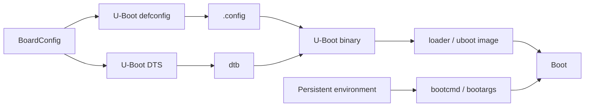
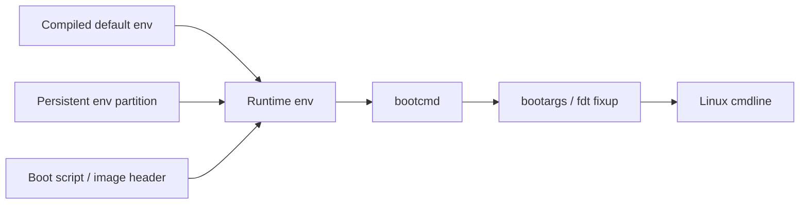
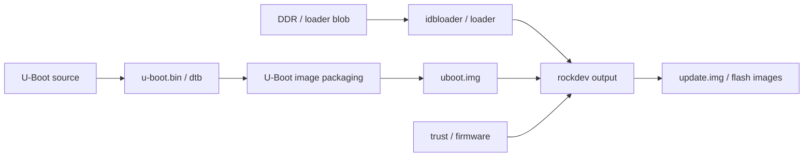

U-Boot 的配置与编译，表面上只是执行几条命令，实际却连接了板级配置、启动介质、设备树、环境变量和最终烧录镜像。对 RV1126 这类 Linux SoC 来说，U-Boot 不是一个独立的“引导程序源码目录”，而是 SDK 构建链中的一个可配置组件。

如果只记住 `make <defconfig>` 和 `make -j$(nproc)`，很快就会遇到几个典型问题：配置改了却没有进入最终镜像、编译出来的 U-Boot 与 loader 不匹配、启动参数只在某一块板上生效、修改环境变量后重新编译却没有变化。解决这些问题的关键，是把配置来源、构建产物和运行时环境分开验证。

本文以 RV1126 + IMX415 平台为主线，说明如何定位 U-Boot 配置入口、建立独立构建目录、修改默认环境、编译并确认产物确实进入烧录链路。具体 defconfig 名称、交叉工具链前缀和镜像打包命令必须以实际 Rockchip SDK 为准。

## 1. U-Boot 配置的三层来源

U-Boot 的最终行为通常由三类配置共同决定：编译期 Kconfig 配置、板级设备树、运行时环境变量。

| 层次 | 典型内容 | 生效时机 |
|---|---|---|
| Kconfig / `.config` | 是否启用 MMC、网络、命令、Driver Model 等功能 | 编译 U-Boot 时 |
| U-Boot DTS | 串口、存储控制器、时钟、引脚和启动阶段硬件描述 | 编译并运行 U-Boot 时 |
| 环境变量 | `bootcmd`、`bootargs`、加载地址、启动顺序 | U-Boot 运行时 |

MCU 工程里的类比是：Kconfig 像编译选项，DTS 像板级初始化表，环境变量像保存在 Flash 中的启动配置。三者任何一层不一致，都可能导致“代码编译成功但板子行为不对”。



首先确认 SDK 的真实配置入口：

```bash
cd /path/to/rockchip-sdk

find device -type f \( -name 'BoardConfig*.mk' -o -name '*.conf' \) | sort
find u-boot/configs -maxdepth 1 -type f | grep -i 'rv1126\|rv1109' | sort

grep -RIn 'RK_UBOOT_DEFCONFIG\|UBOOT_DEFCONFIG\|UBOOT_DTS' \
    device build build.sh 2>/dev/null | head -120
```

不要因为找到一个名字相近的配置就直接使用。应当从目标板的 `BoardConfig` 反向确认：它选中了哪个 defconfig、哪个 DTS、哪个工具链，以及顶层脚本如何调用 U-Boot。

## 2. 直接构建前先保存基线

修改前保存基线，后面才能判断变化来自哪里：

```bash
cd /path/to/rockchip-sdk/u-boot

mkdir -p ../logs/uboot-baseline
printf 'commit: '; git rev-parse HEAD
printf 'status:\n'; git status --short
printf 'config candidates:\n'
find configs -maxdepth 1 -type f | grep -i 'rv1126\|rv1109' | sort
printf 'dts candidates:\n'
find arch/arm/dts -maxdepth 1 -type f | grep -i 'rv1126\|rv1109' | sort
```

如果 SDK 已经通过顶层脚本编译过，优先查看当前输出目录中的 `.config`，不要假设它等于某个 defconfig：

```bash
find . -maxdepth 3 -type f -name .config -printf '%TY-%Tm-%Td %TH:%TM %p\n'
find . -type f \( -name 'u-boot.bin' -o -name 'u-boot.itb' -o -name 'idbloader.img' \) \
    -printf '%TY-%Tm-%Td %TH:%TM %s %p\n' 2>/dev/null | sort
```

正式构建前还要检查主机环境和磁盘空间：

```bash
uname -a
${CROSS_COMPILE:-true} --version 2>/dev/null || true
df -h .
```

这里的 `CROSS_COMPILE` 只是示例。Rockchip SDK 通常会由顶层脚本设置交叉编译器；如果手工构建，必须使用与 SDK 匹配的工具链，不能只因为架构相同就随意替换。

## 3. 使用 defconfig 生成基础配置

进入 U-Boot 源码目录后，先确认目标配置文件：

```bash
cd /path/to/rockchip-sdk/u-boot
ls configs/*rv1126* 2>/dev/null
```

假设实际文件名为 `<target>_defconfig`，基础配置流程如下：

```bash
make ARCH=arm <target>_defconfig

# 查看生成结果
test -f .config && echo '.config generated'
grep -E '^CONFIG_(DM|MMC|ENV|CMD|NET|OF_|SPL)' .config | head -80
```

`defconfig` 不是完整配置，而是可维护的最小配置集合。执行后，Kconfig 会补齐依赖并生成 `.config`。因此修改 `.config` 后，如果重新执行 defconfig，手工修改可能被覆盖。

需要调整功能时使用：

```bash
make ARCH=arm menuconfig
```

如果当前设备没有图形环境，使用文本终端即可。保存后检查差异：

```bash
git diff -- .config
```

正式提交时，不建议把生成的 `.config` 当作唯一修改记录。应把需要长期维护的选项同步回对应 defconfig，或者由 SDK 的配置管理方式保存。常见做法是：

```bash
make ARCH=arm savedefconfig
cat defconfig
```

生成的 `defconfig` 是精简配置，不能盲目覆盖供应商文件；先比较差异，再决定放入哪个产品配置目录。

## 4. 配置常见功能时看懂依赖关系

U-Boot 的功能选项通常不是单个开关。例如启用 MMC 命令，往往还需要 MMC 框架、具体控制器驱动、分区解析和对应的设备树节点。启用网络下载，也需要网络框架、PHY 驱动、MAC 设备树和有效的时钟复位配置。

可以按“用户操作 -> 框架 -> 控制器 -> 板级描述”检查：

| 目标 | 需要同时确认 |
|---|---|
| 从 eMMC/SD 读取镜像 | `CONFIG_MMC`、命令支持、控制器驱动、DTS 节点和 pinctrl |
| 读取 FAT 分区 | FAT 文件系统支持、块设备访问、分区可识别 |
| TFTP 下载 | 网络命令、MAC 驱动、PHY/MDIO、网线和 IP 参数 |
| 查看/修改设备树 | `CONFIG_CMD_FDT`、正确的 dtb 加载地址 |
| 临时读写内存 | `CONFIG_CMD_MEMORY`，并确认地址属于可访问区域 |
| 保存环境变量 | 环境存储介质配置、分区偏移和写保护状态 |

编译前可以快速检查：

```bash
grep -E '^CONFIG_(CMD_FDT|CMD_MMC|CMD_NET|CMD_MEMORY|MMC|ENV_IS_IN)' .config
```

选项不存在不一定表示功能完全不可用，可能是被依赖关系隐藏、由厂商补丁重命名，或者由顶层 SDK 在别处覆盖。以 `menuconfig` 的依赖说明和实际启动日志为准。

## 5. 默认环境与运行时环境

U-Boot 环境有两个容易混淆的概念：编译进镜像的默认环境，以及存储介质中已经保存的持久化环境。

编译时的默认环境通常由配置项、板级代码或环境文本文件提供。板子启动时，如果发现有效的持久化环境，往往优先使用它；只有环境无效或被恢复默认值时，编译期默认值才会明显体现。

运行时先观察，不要直接保存：

```text
printenv bootcmd
printenv bootargs
printenv boot_targets
printenv kernel_addr_r
printenv fdt_addr_r
```

临时测试启动参数：

```text
setenv bootargs 'console=<实际串口>,115200 root=<实际rootfs设备> rw rootwait loglevel=7'
boot
```

串口名称、rootfs 分区和波特率不能照抄示例，必须从当前 kernel DTS、分区表和既有启动日志确认。参数写错的常见表现包括：串口没有内核日志、内核启动后找不到根文件系统、系统进入 emergency shell。

确认临时修改有效后，再考虑固化：

```text
saveenv
reset
printenv bootargs
```

若怀疑持久化环境污染了测试，先保存原始 `printenv`，再使用当前 SDK 支持的恢复命令。`env default -a` 是否可用、环境区是否位于独立分区，都必须以实际 U-Boot 配置为准。

## 6. 手工编译 U-Boot

当 SDK 允许独立编译时，典型流程如下：

```bash
cd /path/to/rockchip-sdk/u-boot

export ARCH=arm
export CROSS_COMPILE=/path/to/toolchain/bin/arm-linux-gnueabihf-

make <target>_defconfig
make -j"$(nproc)" 2>&1 | tee ../logs/uboot-build.log
```

RV1126 的具体工具链前缀可能由 SDK 提供，例如硬浮点 ARM 交叉工具链，也可能使用厂商封装脚本。不要根据芯片名称猜前缀，应检查 SDK 的环境脚本和顶层构建日志：

```bash
grep -RIn 'CROSS_COMPILE\|TOOLCHAIN' build device build.sh 2>/dev/null | head -100
```

常见输出包括：

```bash
find . -maxdepth 3 -type f \( -name 'u-boot.bin' -o -name 'u-boot-nodtb.bin' -o -name 'u-boot.itb' -o -name '*.dtb' \) -print
```

手工编译成功不等于可以直接烧录。Rockchip 平台通常还需要把 U-Boot 与早期 loader、DDR 参数、trust/TEE 相关组件按 SDK 规则重新打包。最可靠的方式是让顶层 SDK 完成最终 firmware/update 镜像构建，并检查输出文件时间和哈希：

```bash
sha256sum rockdev/* 2>/dev/null | tee ../logs/uboot-output.sha256
find rockdev -type f -printf '%TY-%Tm-%Td %TH:%TM %s %p\n' 2>/dev/null | sort
```

如果只是替换 U-Boot 进行实验，也要确认没有把不匹配的 loader 或其他板型组件混入发布目录。

## 7. 编译结果如何验证进入了板子

验证需要覆盖四个层次：源码、编译产物、打包产物、运行时日志。


建议每次实验都记录：

```bash
date
printf 'source: '; git -C u-boot rev-parse HEAD
sha256sum u-boot/u-boot.bin 2>/dev/null || true
sha256sum rockdev/*uboot* rockdev/*loader* 2>/dev/null || true
```

启动后检查版本和配置相关行为：

```text
version
printenv
bdinfo
```

如果版本字符串没有变化，不代表构建失败，也可能是版本信息未更新或启动的仍是旧镜像。此时以镜像时间、哈希、烧录工具选择的文件和串口启动日志共同判断。

## 8. 常见故障定位

### 8.1 `make` 找不到目标配置

检查配置文件是否属于当前源码分支：

```bash
find configs -maxdepth 1 -type f | sort | grep -i rv1126
```

若 SDK 顶层脚本使用了厂商补丁，源码目录可能不是可独立构建的完整状态，应回到 SDK 的构建入口。

### 8.2 编译成功但板子没有变化

优先检查：

1. 修改的 defconfig 是否是当前板级配置引用的文件；
2. 是否重新生成了 `.config`；
3. 是否重新打包了最终镜像；
4. 烧录工具选择的路径是否正确；
5. 持久化环境是否覆盖了默认环境。

### 8.3 进入 U-Boot 后无法读取存储

检查控制器配置、DTS 的 `status`、pinctrl、时钟复位和供电。用 `mmc list`、`mmc dev`、`mmc rescan` 或实际 SDK 支持的命令逐层确认，不要一开始就改启动命令。

### 8.4 `saveenv` 后启动行为改变

这是预期现象：持久化环境优先级高于默认环境。恢复前保存完整环境，确认环境存储分区和恢复命令，避免直接擦除未知分区。

### 8.5 loader 和 U-Boot 版本不匹配

表现可能包括 DDR 初始化失败、U-Boot 早期崩溃或启动不稳定。重新由同一套 SDK 生成完整 loader、U-Boot 和打包镜像，避免从不同构建目录拼接文件。

## 9. 验证清单与里程碑

完成本实验后，至少应能回答：

- 当前板级配置引用了哪个 U-Boot defconfig 和 DTS？
- `.config` 是如何生成的，长期修改应该保存在哪里？
- `bootcmd`、`bootargs` 和加载地址分别影响什么？
- 默认环境与持久化环境有什么优先级差异？
- 手工编译出的 U-Boot 如何进入最终烧录镜像？
- 如何证明板子启动的确实是本次构建产物？
- loader、U-Boot proper、kernel 和 rootfs 的版本是否来自同一次构建？

实践里程碑：完成一次可追踪构建，保存源码提交、`.config`、构建日志、镜像哈希和完整 `printenv`；临时修改 `bootargs` 进入 Linux，再恢复到可重复的默认配置。

## 10. 从 BoardConfig 反推 U-Boot 配置

真正的工程修改不能从 `u-boot/configs/` 目录随便挑一个 defconfig 开始，而要从产品板级配置反推。Rockchip SDK 往往通过 `device/rockchip/.../BoardConfig*.mk` 或类似文件串起整条链路。这个文件不仅决定 U-Boot defconfig，也可能决定 kernel DTS、parameter、rootfs 类型和打包规则。

建议建立一张配置追踪表：

| 追踪项 | 查找命令 | 记录内容 |
|---|---|---|
| 板级配置文件 | `find device -name 'BoardConfig*'` | 当前目标板使用哪份配置 |
| U-Boot defconfig | `grep -RIn 'UBOOT.*DEFCONFIG' device build` | 对应 `u-boot/configs/` 文件 |
| U-Boot DTS | `grep -RIn 'DEVICE_TREE\|UBOOT_DTS' device u-boot/configs` | 对应 `arch/arm/dts/` 文件 |
| kernel DTS | `grep -RIn 'KERNEL.*DTS' device build` | Linux 最终 dtb 来源 |
| parameter | `grep -RIn 'PARAMETER' device build` | 分区布局来源 |
| package file | `find device -name 'package-file'` | 镜像到分区的映射 |

执行示例：

```bash
cd /path/to/rockchip-sdk

find device -type f \( -name 'BoardConfig*.mk' -o -name '*Board*.conf' \) | sort

grep -RInE 'RK_UBOOT_DEFCONFIG|UBOOT_DEFCONFIG|DEFAULT_DEVICE_TREE|DEVICE_TREE|RK_UBOOT_DTS' \
    device build build.sh u-boot/configs 2>/dev/null | tee logs/uboot-config-trace.txt
```

读到变量后，不要只把变量值抄下来，还要验证文件真实存在：

```bash
UBOOT_DEFCONFIG=<从板级配置中得到的名称>

test -f "u-boot/configs/${UBOOT_DEFCONFIG}_defconfig" && echo ok
ls u-boot/configs | grep -i "${UBOOT_DEFCONFIG}" || true
```

不同 SDK 中变量可能已经包含 `_defconfig` 后缀，也可能只写了主体名。这里的命令需要按实际变量值调整。关键是把“板级配置引用的名字”和“源码目录真实文件”对应起来。

如果存在多个 RV1126 相似板型，必须继续确认当前构建命令选择的是哪一个：

```bash
./build.sh lunch 2>&1 | tee logs/lunch-uboot-trace.log

find output rockdev -maxdepth 3 -type f -name '*config*' -o -name '*BoardConfig*' 2>/dev/null | sort
```

这一步可以避免最常见的错误：改了相邻板型的 defconfig，编译完全成功，板子行为却没有任何变化。

## 11. Kconfig 修改要能回到版本管理

`make menuconfig` 适合探索配置，但不适合作为长期交付记录。工程上要区分临时验证和正式维护。

临时验证流程：

```bash
cd /path/to/rockchip-sdk/u-boot
make ARCH=arm <target>_defconfig
make ARCH=arm menuconfig
make ARCH=arm -j"$(nproc)"
```

正式维护流程：

```bash
make ARCH=arm savedefconfig
cp defconfig configs/<target>_defconfig

git diff -- configs/<target>_defconfig
```

如果 SDK 是厂商交付包，没有 Git 历史，也应至少保存差异：

```bash
mkdir -p ../logs/uboot-config-change
cp .config ../logs/uboot-config-change/dot-config-after
cp defconfig ../logs/uboot-config-change/savedefconfig-after 2>/dev/null || true

diff -u configs/<target>_defconfig defconfig > ../logs/uboot-config-change/defconfig.diff 2>/dev/null || true
```

一些配置项不能只看名字，需要结合依赖解释：

| 配置类别 | 常见问题 | 检查重点 |
|---|---|---|
| 命令类 | 命令不存在 | `CONFIG_CMD_*` 是否打开 |
| 驱动类 | 命令有但无设备 | 控制器驱动、DM class、设备树节点 |
| 环境类 | `saveenv` 失败 | `CONFIG_ENV_IS_IN_*`、偏移、分区和写保护 |
| FDT 类 | `fdt` 命令不可用 | `CONFIG_OF_CONTROL`、`CONFIG_CMD_FDT` |
| 网络类 | TFTP 不通 | MAC、PHY、MDIO、时钟、pinctrl、IP 参数 |

一个高质量的 U-Boot 配置修改，至少应在提交说明或记录中写清楚：修改了什么选项、为什么需要、影响启动链路哪一段、如何验证、是否改变量产行为。

## 12. 默认环境的源码位置

默认环境可能来自多个地方，具体取决于 U-Boot 版本和厂商补丁。常见来源包括：

- `include/configs/*.h` 中的 `CONFIG_EXTRA_ENV_SETTINGS`；
- Kconfig 中的默认环境相关选项；
- 文本环境文件，例如 `board/.../*.env`；
- 厂商启动脚本或 boot image 中的参数；
- 持久化环境区中的旧值。

查找方法：

```bash
cd /path/to/rockchip-sdk/u-boot

grep -RInE 'CONFIG_EXTRA_ENV_SETTINGS|bootcmd=|bootargs=|boot_targets=|kernel_addr_r|fdt_addr_r' \
    include board configs env common 2>/dev/null | head -220
```

如果运行时 `printenv` 与源码默认值不同，优先判断是否读到了持久化环境：

```text
printenv
```

启动日志中通常会出现类似环境读取的信息，例如从 MMC、SPI flash、NAND 或 nowhere 加载环境。不同分支输出不同，应保存完整串口日志。

环境变量的优先级可以抽象为：



这解释了为什么“重新编译 U-Boot 默认 bootargs”有时没有效果：板子的环境区里已经保存了旧 bootargs，运行时优先读取持久化环境。

调试阶段推荐策略：

| 操作 | 建议 |
|---|---|
| 临时测试 `bootargs` | 用 `setenv`，不立刻 `saveenv` |
| 需要多次重启测试 | 记录原始环境，再考虑 `saveenv` |
| 验证默认环境 | 恢复环境默认值或擦除环境区，具体按 SDK 文档操作 |
| 产品固化 | 回到源码默认环境或板级启动脚本维护 |

## 13. bootargs 要按字段逐项验证

`bootargs` 不是一串可以随便复制的文本。每个字段都对应一个启动行为。

| 字段 | 工程含义 | 验证方法 |
|---|---|---|
| `console=` | Linux 主控制台 | `cat /proc/cmdline`，观察串口日志 |
| `earlycon=` | 更早期内核日志 | `dmesg | head`，早期异常定位 |
| `root=` | 根文件系统位置 | `cat /proc/partitions`、`mount` |
| `rootfstype=` | 文件系统类型 | `cat /proc/filesystems` |
| `rootwait` | 等待块设备出现 | MMC/USB rootfs 常用 |
| `rw` / `ro` | 根文件系统挂载方式 | `mount | grep ' / '` |
| `init=` | 第一个用户态进程 | `ps -p 1 -o comm,args` |
| `loglevel=` | 内核日志等级 | `dmesg -n`、启动日志 |

RV1126 平台的串口名可能是 `ttyFIQ0`、`ttyS0` 或供应商分支定义的其他名称。不能从别的板子照抄。确认方式包括：

```bash
# Linux 已启动时
cat /proc/cmdline
ls -l /dev/ttyS* /dev/ttyFIQ* 2>/dev/null
dmesg | grep -iE 'console|tty|serial|fiq'
```

如果 `Starting kernel ...` 后无输出，先不要急着判断 kernel 死机。应检查：

- U-Boot 的 `bootargs` 是否包含正确 console；
- `/chosen/stdout-path` 是否指向正确串口；
- kernel DTS 中对应 UART 节点是否启用；
- kernel 是否启用早期串口和 console 驱动；
- kernel 是否其实已经启动，只是日志输出到了另一个串口。

## 14. U-Boot 产物与 Rockchip 打包链路

Rockchip 平台上，U-Boot 编译产物并不总是最终烧录文件。可能存在这些层级：



检查产物不要只看一个目录：

```bash
cd /path/to/rockchip-sdk

find u-boot output rockdev -type f \
  \( -name '*uboot*' -o -name '*loader*' -o -name 'idbloader.img' -o -name 'trust.img' \) \
  -printf '%TY-%Tm-%Td %TH:%TM %s %p\n' 2>/dev/null | sort | tail -120
```

生成哈希清单：

```bash
mkdir -p logs/uboot-release-check
find u-boot output rockdev -type f \
  \( -name '*uboot*' -o -name '*loader*' -o -name 'idbloader.img' -o -name 'trust.img' \) \
  -exec sha256sum {} \; 2>/dev/null | tee logs/uboot-release-check/sha256.txt
```

如果修改 U-Boot 后板子无变化，按这条链路排查：

1. 源码是否确实改在当前目标配置使用的文件；
2. `.config` 是否包含目标选项；
3. 编译输出时间是否更新；
4. 打包目录中的 `uboot.img` 或相关镜像是否更新；
5. 烧录工具是否选择了新生成的镜像；
6. 板子环境区是否覆盖了默认行为；
7. 串口日志是否能看到对应版本或行为变化。

## 15. 替换验证要避免“半套镜像”

调试时只替换 U-Boot 看起来很方便，但可能引入版本组合问题。loader、DDR 参数、U-Boot、trust 固件、kernel 和 dtb 之间存在隐式约束。

风险包括：

| 半套替换方式 | 风险 |
|---|---|
| 只换 `uboot.img` | loader 或 trust 不匹配，启动早期异常 |
| 只换 dtb | U-Boot 仍从旧路径加载，Linux 无变化 |
| 只换 kernel | modules 不匹配，驱动加载失败 |
| 只换 rootfs | bootargs 或分区布局不一致 |
| 只刷某分区 | 分区表和 package file 认知不一致 |

工程上推荐两种方式：

第一种，完整生成发布包并全量烧录，用于基线确认和交付验证。

第二种，在明确知道分区和依赖关系时做局部替换，用于快速实验。局部替换必须记录替换文件哈希、分区名、烧录命令和恢复方式。

## 16. 编译失败的真实排查路径

U-Boot 编译失败不要只看最后一行。先保存完整日志：

```bash
make ARCH=arm -j"$(nproc)" 2>&1 | tee ../logs/uboot-build-$(date +%Y%m%d-%H%M%S).log
```

按错误类别处理：

| 错误 | 可能原因 | 排查方向 |
|---|---|---|
| `No rule to make target <defconfig>` | defconfig 名称错误或分支不匹配 | 查 BoardConfig 与 configs 目录 |
| `dtc` 报语法错误 | DTS include、phandle、属性格式错误 | 看第一处 DTC error |
| `undefined reference` | Kconfig 依赖缺失或源码补丁不完整 | 查 Makefile/Kconfig |
| `command not found` | 工具链或 host 工具缺失 | 查 PATH 和 SDK 环境脚本 |
| `Permission denied` | 脚本权限或文件系统权限问题 | 检查执行权限和挂载方式 |
| `bad value for -march` | 工具链不匹配 | 使用 SDK 指定工具链 |

找第一处错误：

```bash
grep -nEi 'error:|fatal:|No rule|undefined reference|Permission denied|not found|DTC' \
    ../logs/uboot-build-*.log | head -80
```

DTS 报错尤其要看 include 展开。报错行所在文件可能是公共 DTSI，真正错误来自目标板 DTS 覆盖了错误属性。

## 17. 板端运行时验证清单

烧录后在 U-Boot 命令行至少保存这些信息：

```text
version
bdinfo
printenv
mmc list
part list mmc 0
fdt addr ${fdt_addr_r}
fdt header
fdt print /chosen
```

进入 Linux 后保存：

```bash
cat /proc/cmdline
uname -a
tr -d '\0' < /proc/device-tree/model; echo
tr -d '\0' < /proc/device-tree/compatible; echo
mount | grep ' / '
```

如果需要证明这次 U-Boot 修改生效，可以加入一个可控但不影响产品行为的验证点。例如修改 `bootdelay`、临时增加一个环境变量，或者在 U-Boot banner 附近加入受控日志。验证后应恢复不必要的调试输出。

## 18. RV1126 + IMX415 的特殊关注点

在摄像头平台上，U-Boot 不负责 IMX415 出图，但它影响后续调试的基础条件：

| 条件 | 对后续影响 |
|---|---|
| 稳定串口 | 能否观察 kernel、V4L2 和 ISP 日志 |
| 正确 dtb 地址 | Linux 是否拿到包含 IMX415 节点的设备树 |
| 正确 memory/reserved-memory | 媒体缓冲、ISP、VENC、NPU 可能依赖保留内存策略 |
| 正确 rootfs | 是否包含 `media-ctl`、`v4l2-ctl`、调试脚本 |
| 环境一致性 | 多块板调试现象是否可复现 |

如果摄像头驱动不 probe，先确认 U-Boot 传递的 dtb 是正确版本：

```text
fdt addr ${fdt_addr_r}
fdt print /chosen
fdt print /memory
```

Linux 侧继续确认：

```bash
cat /proc/cmdline
find /proc/device-tree -iname '*imx415*' 2>/dev/null
```

只有确认 dtb 传递链路正确，才进入 I2C、MCLK、reset、电源和 V4L2 驱动调试。

## 19. 练习：做一次可审计的 U-Boot 修改

建议完成一个小而完整的实验：调整 `bootdelay`，并证明它来自源码而不是手工环境。

步骤：

1. 保存原始 `printenv bootdelay` 和完整 `printenv`；
2. 从 BoardConfig 找到当前 U-Boot defconfig；
3. 修改默认环境或配置中的 `bootdelay`；
4. 重新构建 U-Boot；
5. 重新打包并记录镜像哈希；
6. 恢复或清理持久化环境；
7. 烧录后观察倒计时变化；
8. 保存启动日志和验证记录。

记录模板：

```text
board: RV1126 + IMX415
uboot_defconfig:
uboot_dts:
change:
build_command:
output_image:
sha256:
flash_method:
printenv_before:
printenv_after:
result:
rollback:
```

这个练习看似简单，但它覆盖了配置、编译、打包、烧录、环境优先级和运行时验证。能把这条链路跑通，后面改启动介质、网络下载、dtb 加载路径和 kernel 参数才有工程基础。

## 20. 扩展故障矩阵

| 现象 | 优先检查 | 说明 |
|---|---|---|
| 编译成功但命令不存在 | `.config`、defconfig 是否保存 | `menuconfig` 修改可能未回写 |
| `printenv` 仍是旧值 | 持久化环境 | 默认环境被环境区覆盖 |
| `saveenv` 报错 | 环境存储配置 | 可能未配置环境分区或介质写保护 |
| TFTP 不通 | PHY、MAC、IP、网线 | 不一定是网络命令问题 |
| MMC 命令无设备 | U-Boot DTS、pinctrl、clock | Linux DTS 正确不代表 U-Boot 可用 |
| `fdt header` 报错 | DTB 加载地址 | 地址可能不是有效 FDT |
| `Starting kernel` 后无日志 | console、earlycon、dtb | kernel 可能已运行但无输出 |
| rootfs panic | bootargs、内核驱动、分区 | 通常进入 Linux 层排查 |

## 21. 本文里程碑补充

完成本文后，不能只停留在“能编译 U-Boot”。合格标准是：

- 能从 SDK 板级配置追踪到 U-Boot defconfig 和 DTS；
- 能解释 `.config`、defconfig、默认环境和持久化环境的关系；
- 能修改一个启动参数，并证明它进入最终镜像或被环境区覆盖；
- 能生成 U-Boot 相关镜像的哈希清单；
- 能在板端用 `version`、`bdinfo`、`printenv`、`fdt` 命令验证运行状态；
- 能把“编译成功但不生效”的问题拆成源码、构建、打包、烧录、环境五段排查。

> 🏷️ Linux BSP、RV1126、U-Boot、defconfig、Kconfig、bootcmd、bootargs、交叉编译
