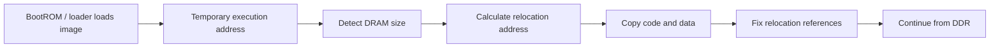
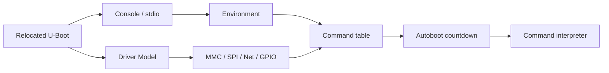
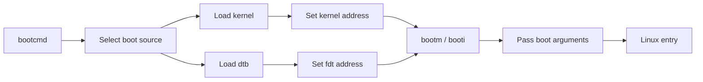
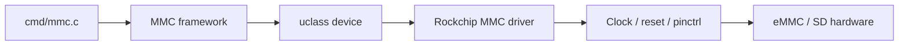

理解 U-Boot，不能只停留在命令行层面。遇到启动顺序异常、设备模型没有绑定、环境变量没有生效、某个外设初始化过早或过晚时，最终都需要回到源码，回答三个问题：代码从哪里进入、初始化阶段如何推进、内核跳转前准备了哪些数据。

本文以常见的 ARM U-Boot 代码组织方式为主线，结合 RV1126 的 Rockchip SDK 说明源码阅读方法。不同厂商分支可能加入 Rockchip 专用 loader、定制 board 文件或启动包装逻辑，函数名和调用深度会有差异，因此应把本文当成导航图，最终以当前 SDK 的实际调用关系为准。

## 1. 源码阅读先建立阶段边界

U-Boot 启动不是一个从 `main()` 直线执行到底的普通应用。早期阶段可能运行在片内 SRAM，随后迁移到 DDR；SPL 与 U-Boot proper 的配置和代码路径也可能不同。


对 MCU 工程师的类比：`board_init_f` 类似早期时钟、内存和串口初始化，`board_init_r` 类似完成运行环境切换后的板级初始化，主循环则负责命令解释和自动启动。但 U-Boot 还要处理重定位、设备树、环境存储和多种启动介质。

阅读源码时先区分：

| 代码区域 | 关注点 |
|---|---|
| `arch/arm/cpu/` | ARM 架构入口、异常向量、低级初始化 |
| `arch/arm/lib/` | ARM 相关库和启动辅助代码 |
| `common/` | 环境、命令、启动主线和通用框架 |
| `drivers/` | MMC、串口、网络、GPIO、存储等驱动 |
| `board/` | 板级初始化和厂商定制逻辑 |
| `include/configs/` | 传统配置头，旧分支仍可能使用 |
| `dts/` 或 `arch/arm/dts/` | U-Boot 设备树 |
| `cmd/` | U-Boot 命令实现 |

先确认当前分支实际目录：

```bash
cd /path/to/rockchip-sdk/u-boot
find . -maxdepth 2 -type d \( -name common -o -name board -o -name drivers -o -name cmd \) -print
find . -type f -name 'main.c' | grep -E 'common|board' | sort
```

## 2. 从入口符号开始，而不是从日志猜

ARM U-Boot 的真正入口通常由架构启动汇编和链接脚本共同确定。先查入口定义：

```bash
rg -n 'ENTRY\(|_start:|reset:' arch board common include 2>/dev/null | head -100
rg -n 'board_init_f|board_init_r|hang\(' arch board common 2>/dev/null | head -160
```

如果系统没有 `rg`，可以使用：

```bash
grep -RInE 'ENTRY\(|_start:|reset:|board_init_f|board_init_r' \
    arch board common include 2>/dev/null | head -160
```

入口汇编通常完成以下工作：

1. 设置必要的处理器状态；
2. 建立临时栈；
3. 关闭或配置部分缓存、MMU 和异常状态；
4. 执行架构相关的低级初始化；
5. 进入 C 代码；
6. 让后续代码完成内存迁移和板级初始化。

不要把入口汇编与 Linux 的 `head.S` 混为一谈。U-Boot 入口负责把控制权交给 U-Boot，Linux 入口负责把控制权交给内核启动流程；二者都使用汇编，但运行环境、传入参数和职责不同。

## 3. `board_init_f`：运行环境建立阶段

常见的源码阅读入口是 `common/board_f.c` 中的初始化序列。实际函数名和宏可能因分支不同而变化，但思路基本一致：用一组初始化函数逐步准备串口、计时器、内存布局、环境信息和设备模型所需的数据。

可以先查看初始化数组或相关函数：

```bash
grep -nE 'init_sequence_f|board_init_f|initf_|dram_init|serial' \
    common/board_f.c arch/arm 2>/dev/null | head -180
```

这一阶段的关键不是“初始化了所有设备”，而是为完整 U-Boot 准备可运行条件：

| 任务 | 目的 | 失败时的典型现象 |
|---|---|---|
| 串口早期初始化 | 输出后续日志 | 无日志或日志中断 |
| timer 初始化 | 延时、超时和计时 | 存储操作超时异常 |
| DRAM 检测 | 确认可用内存 | 重定位失败、随机崩溃 |
| 全局数据准备 | 保存 U-Boot 状态 | 初始化过程异常 |
| 设备树准备 | 为驱动模型提供描述 | 设备无法绑定 |
| 重定位参数计算 | 将代码搬到 DDR | 运行地址错误 |

U-Boot 通常通过全局数据指针保存当前运行状态。源码中常会看到 `gd` 一类全局数据访问。阅读时重点看它保存了哪些地址：代码重定位地址、栈地址、设备树地址、内存大小和标志位。不要只看函数名字，要跟踪这些地址在阶段之间如何变化。

## 4. 重定位：为什么地址会变化

早期 U-Boot 可能从固定加载地址运行，但完整 U-Boot 通常会被复制到 DDR 中的另一段区域执行。这样做是为了避开加载缓冲区、预留内存，或者为后续加载 kernel、dtb 和 initrd 留出空间。



排查重定位问题时，关注这些信息：

```text
bdinfo
version
```

如果启动日志能打印但在重定位后消失，重点检查 DDR、重定位地址、保留内存和缓存配置。不要把“串口突然不打印”直接判断为串口驱动问题，因为代码可能已经跳到了错误地址。

源码定位可以使用：

```bash
rg -n 'relocaddr|relocate_code|relocation|gd->relocaddr|SYS_TEXT_BASE' \
    arch common board include 2>/dev/null | head -180
```

不同版本可能使用不同实现。实际阅读时，围绕“旧地址 -> 新地址 -> 修正函数指针/全局数据 -> 继续初始化”这条数据流展开。

## 5. `board_init_r`：进入完整运行阶段

重定位完成后，U-Boot 进入更完整的初始化阶段，常见入口位于 `common/board_r.c`。这一阶段可能初始化存储、环境、网络、设备模型、控制台和命令系统。

```bash
rg -n 'init_sequence_r|board_init_r|env_init|env_relocate|stdio_init|dm_init|run_main_loop' \
    common drivers 2>/dev/null | head -220
```

典型顺序可以按功能理解：



这里有一个常见边界：设备树节点存在，不代表设备已经可用。驱动还需要 Kconfig 打开、compatible 匹配、父设备先初始化、时钟复位和 pinctrl 正确。U-Boot 命令失败时，要沿着命令 -> 框架 -> 驱动 -> 设备树逐层追踪。

例如 `mmc list` 无输出，至少要检查：

```text
CONFIG_MMC 是否启用
控制器驱动是否启用
U-Boot DTS 节点是否 status = "okay"
pinctrl、clock、reset 是否可用
存储介质供电和卡检测是否正常
```

## 6. Driver Model 与设备绑定

较新的 U-Boot 大量使用 Driver Model（DM）。DM 可以理解成 U-Boot 版本的设备模型：设备由设备树描述，驱动通过 `compatible` 和 U-Boot 驱动表匹配，父子设备按层级建立，命令通过统一接口访问设备。

典型匹配链路如下：


源码搜索：

```bash
rg -n 'U_BOOT_DRIVER|of_match|compatible|probe\s*=|bind\s*=' \
    drivers/mmc drivers/serial drivers/gpio drivers/net 2>/dev/null | head -220
```

阅读一个具体驱动时，按这个顺序看：

1. `U_BOOT_DRIVER` 定义了驱动名、所属 class 和匹配表；
2. `of_match` 指定支持的 `compatible`；
3. `probe` 读取资源并完成硬件初始化；
4. `ops` 提供读写、发送、收发或控制操作；
5. 命令层通过 class API 调用驱动操作。

`bind` 和 `probe` 也要区分。bind 通常表示根据设备树建立设备对象，probe 才是实际申请资源、打开时钟、访问硬件。设备能在调试命令中看到，不代表 probe 已经成功。

## 7. 主循环与命令执行

初始化结束后，U-Boot 进入命令主循环。自动启动通常由 `bootdelay` 和 `bootcmd` 控制；如果在倒计时期间收到串口输入，就会停在命令行。

可以从以下位置入手：

```bash
rg -n 'main_loop|autoboot|bootdelay|bootcmd|run_command' \
    common cmd 2>/dev/null | head -200
```

命令执行通常经历：解析字符串、查找命令、构造参数、调用命令处理函数。以 `mmc`、`fatload`、`fdt` 为例，命令层本身往往不直接操作寄存器，而是调用 block、filesystem、libfdt 或 DM 接口。

在命令行中逐步执行启动动作，比直接执行完整 `bootcmd` 更容易定位：

```text
mmc list
mmc dev 0
part list mmc 0
fatls mmc 0:1
printenv kernel_addr_r
printenv fdt_addr_r
```

具体设备号和分区号必须以当前板卡实际枚举结果为准。命令输出为空时，先判断是设备未识别、分区不存在，还是文件系统类型不匹配。

## 8. 从 `bootcmd` 到内核入口

自动启动的核心动作一般可以拆成四步：选择介质、加载镜像、准备设备树和执行启动命令。



常见命令含义：

| 命令 | 适用对象 | 重点 |
|---|---|---|
| `fatload` | FAT 文件系统 | 从分区读文件到内存 |
| `ext4load` | ext4 文件系统 | 读取 kernel 或 dtb |
| `load` | 通用文件加载接口 | 依赖当前设备和文件系统 |
| `fdt addr` | 指定 dtb 地址 | 设置后续 FDT 操作对象 |
| `fdt print` | 查看设备树 | 检查 chosen、memory、节点属性 |
| `bootm` | legacy/FIT 等镜像 | 由镜像格式决定 |
| `booti` | Linux `Image` | ARM64 常见，实际平台以 SDK 为准 |

不要根据文件名擅自选择 `bootm` 或 `booti`。先执行：

```text
iminfo ${kernel_addr_r}
fdt addr ${fdt_addr_r}
fdt header
```

随后检查内核启动日志中的命令行和设备树相关信息。若 kernel 已经开始打印 `Linux version`，说明控制权已经交给 Linux，后续问题应转到 kernel 和 rootfs 层分析。

## 9. 源码日志如何与串口日志对应

阅读启动源码时，建议建立“日志锚点”：

| 日志阶段 | 应关注的源码方向 |
|---|---|
| 早期串口输出 | arch 启动代码、serial 初始化 |
| DRAM size / relocation | board init、DRAM 驱动、重定位逻辑 |
| MMC/网络设备信息 | DM、控制器驱动、设备树匹配 |
| 环境加载 | env 介质驱动、CRC 校验、默认环境 |
| autoboot 倒计时 | main loop、autoboot 逻辑 |
| Loading kernel | load 命令、文件系统或分区访问 |
| Starting kernel | bootm/booti、FDT 搬运和参数准备 |

构建带有调试信息的 U-Boot 时，具体选项以分支支持情况为准。可以先查看：

```bash
grep -E '^CONFIG_(LOG|DEBUG|TRACE|CMD)' .config | head -100
```

调试日志不能无限开启。日志过多会改变时序，甚至覆盖串口输出缓冲。正式定位应逐步打开相关子系统，完成后恢复合理的日志等级。

## 10. 常见源码级问题

### 10.1 修改了代码但没有编译

确认源文件属于当前目标、目标文件时间已更新，并检查增量构建是否因为配置变化被跳过：

```bash
make V=1 -j1 2>&1 | tee build-verbose.log
find . -name '*.o' -newermt '10 minutes ago' | head
```

### 10.2 驱动没有 probe

沿着 `compatible -> U_BOOT_DRIVER -> bind -> probe` 检查。设备树节点存在、驱动代码存在，都不能证明 Kconfig 和父设备满足条件。

### 10.3 环境变量覆盖源码默认值

启动时如果读取到了有效环境区，源码中的默认 `bootargs` 可能不会使用。保存环境、恢复默认和重新烧录时要明确环境区的来源。

### 10.4 启动命令执行成功但内核不打印

检查 kernel 加载地址、镜像格式、设备树地址、内存重叠和串口参数。尤其要避免 kernel、dtb、initrd 加载到相互覆盖的地址区域。

## 11. 可复现源码导读实验

在 PC 端完成源码定位：

```bash
cd /path/to/rockchip-sdk/u-boot

git grep -n 'board_init_f'
git grep -n 'board_init_r'
git grep -n 'main_loop'
git grep -n 'U_BOOT_DRIVER'
git grep -n 'bootm' common cmd lib
```

在板端记录完整输出：

```text
version
bdinfo
printenv bootcmd
printenv bootargs
mmc list
fdt addr ${fdt_addr_r}
fdt print /chosen
```

把日志按“入口、重定位、设备初始化、环境、自动启动、跳转内核”分段，并在每段旁边写出对应源码文件。这个过程比单独背函数名更能形成调试能力。

## 12. 验证清单与里程碑

完成后应能说明：

- U-Boot 早期入口和 C 初始化的大致边界；
- `board_init_f`、重定位、`board_init_r` 和主循环分别解决什么问题；
- Driver Model 如何通过 `compatible` 找到驱动并触发 probe；
- `bootcmd` 如何加载 kernel、dtb 并跳转；
- 哪些问题仍属于 U-Boot，哪些已经属于 Linux kernel 或 rootfs；
- 如何用源码搜索和串口日志建立对应关系。

实践里程碑：选一个实际启动命令，拆成“设备选择、镜像加载、FDT 检查、启动跳转”四段，在 U-Boot 命令行逐段执行；同时从源码中定位命令处理函数、设备驱动和最终跳转路径。

## 13. 用 `System.map` 和反汇编确认入口

源码导读不能只靠搜索函数名。真正定位入口时，应结合链接脚本、符号表和反汇编。尤其是在厂商分支里，入口路径可能被 SPL、loader 或板级汇编包了一层。

构建完成后查符号：

```bash
cd /path/to/rockchip-sdk/u-boot

find . -maxdepth 3 -type f \( -name 'System.map' -o -name 'u-boot' -o -name 'u-boot.bin' \) -print

grep -nE ' _start$| reset$| board_init_f$| board_init_r$| main_loop$' System.map 2>/dev/null || true
```

如果有 ELF 格式的 `u-boot` 文件，可以反汇编查看入口附近：

```bash
${CROSS_COMPILE}objdump -d u-boot | grep -n '<_start>' -A40
${CROSS_COMPILE}objdump -d u-boot | grep -n '<board_init_f>' -A60
```

这里的 `CROSS_COMPILE` 必须使用 SDK 指定工具链。没有 ELF 文件时，只看裸 `u-boot.bin` 很难得到完整符号信息，应优先保留带符号的构建产物。

入口确认的价值在于：当日志停在极早期时，可以判断当前是否已经进入 U-Boot proper，还是仍卡在 loader/SPL 或更早阶段。如果连 `_start` 附近的早期串口都没有执行，继续看 `bootcmd` 没有意义。

## 14. 初始化序列不是固定死背，要看数组

U-Boot 的初始化主线常通过函数数组组织。阅读时最有效的方法是把 `init_sequence_f` 和 `init_sequence_r` 打印出来，然后按顺序标注每个函数做什么。

```bash
cd /path/to/rockchip-sdk/u-boot

grep -n 'init_sequence_f' -A180 common/board_f.c 2>/dev/null | less
grep -n 'init_sequence_r' -A220 common/board_r.c 2>/dev/null | less
```

建议整理成如下表格：

| 顺序 | 函数 | 关注资源 | 失败表现 |
|---|---|---|---|
| 早期 console | serial / console init | UART、clock、pinctrl | 无日志或乱码 |
| timer | timer init | 时钟源 | 延时异常、超时异常 |
| DRAM | dram init | DDR 容量与地址 | 重定位失败、随机崩溃 |
| relocation | reloc addr calc | 内存布局 | 日志中断、跳转异常 |
| env | env init / relocate | 环境介质 | bootcmd/bootargs 不符合预期 |
| DM | dm init / scan | DTS、驱动表 | mmc/net/gpio 不可见 |
| stdio | console devices | stdin/stdout/stderr | 命令行交互异常 |
| main loop | autoboot | bootdelay/bootcmd | 不自动启动或命令错误 |

这张表不需要一次性覆盖所有函数，但必须覆盖当前问题相关阶段。例如 MMC 读不到分区，就重点看 DM 初始化、MMC 驱动绑定、设备树节点和命令层调用；不是每次都从 `_start` 重新读。

## 15. `gd` 全局数据是启动阶段的黑板

U-Boot 启动过程中经常看到 `gd`。它可以理解为启动阶段共享状态的黑板，保存内存大小、重定位地址、环境状态、FDT 地址、设备状态等信息。很多问题从日志上看是“命令失败”，实质上是 `gd` 中某个关键地址或标志不正确。

查找定义和使用：

```bash
grep -RIn 'typedef struct global_data\|DECLARE_GLOBAL_DATA_PTR\|gd->' \
    include arch common board drivers 2>/dev/null | head -220
```

常见字段方向：

| 字段类别 | 作用 |
|---|---|
| RAM 信息 | DDR 起始、大小、可用范围 |
| relocation | U-Boot 重定位地址、偏移 |
| FDT | 当前控制 FDT 地址 |
| env | 环境是否有效、环境地址 |
| flags | 当前初始化状态 |
| bd info | 板级信息，`bdinfo` 可观察部分内容 |

`bdinfo` 是运行时观察 `gd` 和板级信息的入口：

```text
bdinfo
```

当 kernel、dtb、ramdisk 地址冲突时，`bdinfo` 能帮助判断加载地址是否落入合理 DDR 范围。写启动脚本时，不要把加载地址硬编码成从其他板子复制来的值，应结合 `bdinfo`、SDK 默认环境和芯片内存布局确认。

## 16. board 文件和 SoC 文件分别看什么

厂商 U-Boot 分支通常会有 SoC 级代码和 board 级代码。阅读时要分清两类逻辑：

| 层次 | 关注内容 | 常见目录 |
|---|---|---|
| SoC 级 | 控制器、时钟、复位、通用初始化 | `arch/arm/mach-rockchip/`、`drivers/` |
| Board 级 | 板卡差异、启动介质、GPIO、电源策略 | `board/rockchip/...` 或厂商目录 |
| 配置级 | 功能开关、地址、默认环境 | `configs/`、`include/configs/` |
| DTS 级 | 设备实例、pinctrl、status | `arch/arm/dts/` |

查找 RV1126/RV1109 相关代码：

```bash
find arch board drivers -type f | grep -iE 'rv1126|rv1109|rockchip' | sort | head -200

grep -RInE 'rv1126|rv1109|rockchip' arch/arm board drivers 2>/dev/null | head -220
```

SoC 级代码不应该因为某块板的小差异随意修改。比如 eMMC 供电 GPIO、启动介质选择、默认环境，一般应放在 board/DTS/config 层处理；控制器驱动 bug 或芯片通用初始化问题才考虑改 SoC 或 driver 层。

## 17. 命令层到驱动层的调用链

U-Boot 命令不是硬件驱动本身。以 `mmc` 为例，命令层解析参数，调用 MMC 框架，MMC 框架再操作具体控制器驱动。



阅读方法：

```bash
grep -RIn 'U_BOOT_CMD(.*mmc\|do_mmc' cmd common drivers 2>/dev/null | head -120
grep -RIn 'U_BOOT_DRIVER.*mmc\|rockchip.*mmc\|dw_mmc' drivers 2>/dev/null | head -160
```

命令返回失败时，按层级定位：

| 层级 | 观察方式 |
|---|---|
| 命令是否存在 | U-Boot 命令行输入 `help mmc` |
| 框架是否启用 | `.config` 中查 `CONFIG_MMC` |
| 设备是否绑定 | DM 调试命令，或启动日志 |
| 驱动是否 probe | 增加日志、打开 debug、看错误码 |
| 硬件是否响应 | 示波器/逻辑分析仪/电源检查 |

网络、GPIO、I2C、SPI 也类似。不要把命令层和控制器驱动混在一起改。

## 18. FDT fixup 是启动前的最后修改点

U-Boot 在启动 kernel 前可能对 FDT 做修正。常见 fixup 包括：写入 bootargs、修正 memory、写入 MAC 地址、设置 initrd 范围、删除或修改某些节点。

查找 fixup：

```bash
grep -RInE 'ft_board_setup|fdt_fixup|fixup_fdt|do_fixup|chosen|bootargs' \
    board common arch drivers 2>/dev/null | head -220
```

这部分很容易影响 Linux 侧现象。例如源码 DTS 中 `/chosen/bootargs` 是一套参数，但 U-Boot 启动前根据环境变量又覆盖了一遍。最终 Linux 收到的是覆盖后的结果。

验证链路：

```text
printenv bootargs
fdt addr ${fdt_addr_r}
fdt print /chosen
boot
```

进入 Linux 后：

```bash
cat /proc/cmdline
tr -d '\0' < /proc/device-tree/chosen/bootargs 2>/dev/null; echo
```

如果三者不同，必须追踪启动脚本和 fixup 函数。不能只看 DTS 源码。

## 19. `bootm`、`bootz`、`booti` 的源码边界

启动命令不同，源码路径也不同。一般可以从命令定义开始查：

```bash
grep -RInE 'U_BOOT_CMD\(bootm|U_BOOT_CMD\(bootz|U_BOOT_CMD\(booti' cmd common arch 2>/dev/null

grep -RInE 'do_bootm|do_bootz|do_booti|boot_jump_linux|cleanup_before_linux' \
    cmd common arch/arm lib 2>/dev/null | head -180
```

它们共同要完成几件事：

1. 校验镜像格式；
2. 确认 kernel、dtb、ramdisk 地址；
3. 准备 tags 或 FDT；
4. 关闭或整理 U-Boot 使用的中断、cache、MMU 状态；
5. 按架构约定跳转到 Linux 入口。

如果命令报 `Bad Linux ARM zImage magic`、`Wrong Image Format`、`Bad Magic Number`、`FDT_ERR_BADMAGIC`，通常不是 kernel 源码问题，而是镜像格式、加载地址或启动命令不匹配。

## 20. cache / MMU / 中断清理为什么重要

U-Boot 跳转 Linux 前必须把运行环境整理到 Linux 期待的状态。缓存、MMU、中断和设备状态处理不当，可能导致 Linux 早期异常或随机问题。

查找相关函数：

```bash
grep -RInE 'cleanup_before_linux|dcache_disable|icache_disable|disable_interrupts|flush' \
    arch/arm common lib 2>/dev/null | head -200
```

普通 BSP 调试很少直接修改这部分，但要知道它的存在。比如某些自定义启动代码在跳转前绕过了标准路径，就可能遗漏 cache flush 或 FDT 准备，导致 Linux 解析到旧数据或启动异常。

如果只是修改 `bootcmd`，应尽量使用标准 `bootm/bootz/booti` 命令，不要自己拼一个裸跳转地址去执行 kernel。

## 21. 启动日志如何反推源码阶段

建议每次保存完整 U-Boot 启动日志，并标注源码阶段：

```text
U-Boot banner                 -> version / build info
DRAM: xxx MiB                 -> dram_init / board_f
Core: xxx devices             -> Driver Model scan
MMC: xxx                      -> mmc driver probe
Loading Environment from ...  -> env driver
Hit any key to stop autoboot  -> main_loop / autoboot
Loading kernel...             -> load command / filesystem
Starting kernel ...           -> bootm/bootz/booti final jump
```

如果某一行不存在，不要马上说“代码没走”。不同 SDK 日志文本会不同，且日志等级可能关闭。应结合源码中的 `printf`、`debug`、`log_*` 调用确认。

查找日志字符串：

```bash
grep -RIn 'Hit any key\|Starting kernel\|Loading Environment\|DRAM:' \
    common arch board drivers 2>/dev/null | head -160
```

这条技巧非常实用：从串口日志中的关键字符串回搜源码，可以快速定位当前阶段。

## 22. 如何安全增加临时调试日志

U-Boot 调试日志要克制。早期阶段输出太多可能改变时序，甚至让串口成为性能瓶颈。建议只在目标函数前后增加短日志，并带唯一标记。

示例：

```c
printf("BSPDBG: before mmc init\n");
ret = mmc_initialize(gd->bd);
printf("BSPDBG: after mmc init ret=%d\n", ret);
```

调试完成后必须删除或改成受控日志。正式产品启动日志应保持清晰，不能长期保留大量实验输出。

如果分支支持日志框架，优先使用 `log_debug()` 或对应子系统日志，并通过配置控制输出等级。具体 API 以当前 U-Boot 版本为准。

## 23. 自动启动失败的源码级分解

`bootcmd` 是字符串，但执行时会走命令解释器。排查自动启动失败时，可以把它拆成三层：

| 层次 | 关注点 | 方法 |
|---|---|---|
| 环境层 | `bootcmd` 内容是否正确 | `printenv bootcmd` |
| 命令层 | 每个命令是否能手工执行 | 命令行逐条运行 |
| 驱动层 | 命令失败背后的设备原因 | 读源码、看驱动 probe、查 DTS |

例如自动启动里有：

```text
run boot_from_mmc
```

继续展开：

```text
printenv boot_from_mmc
```

如果里面调用多个子变量，继续 `printenv`。直到每条命令都能单独验证。不要只修改最终 `bootcmd`，却不理解它间接调用了哪些脚本变量。

## 24. RV1126 场景下的源码关注点

围绕 RV1126 + IMX415，U-Boot 源码导读应重点看这些方向：

| 方向 | 为什么重要 |
|---|---|
| Rockchip mach 代码 | SoC 级初始化、复位、启动介质 |
| DDR/loader 交界 | 早期稳定性和启动成败 |
| MMC/SPI/NAND 驱动 | 影响 kernel/dtb/rootfs 加载 |
| FDT fixup | 影响 Linux bootargs、memory、reserved-memory |
| 环境存储 | 影响多板一致性和调试复现 |
| 网络命令 | TFTP 快速替换 kernel/dtb |

IMX415 本身不在 U-Boot 中完成出图，但后续摄像头调试依赖正确 dtb 和 rootfs。如果 U-Boot 加载了旧 dtb，Linux 侧所有 V4L2 排查都会偏离方向。

## 25. 可复现实验：从日志字符串定位源码

选择串口日志中的三行关键文本，例如：

```text
Hit any key to stop autoboot
Loading Environment from MMC
Starting kernel ...
```

在源码中定位：

```bash
grep -RIn 'Hit any key to stop autoboot' common arch board drivers 2>/dev/null
grep -RIn 'Loading Environment' common env drivers 2>/dev/null
grep -RIn 'Starting kernel' common arch cmd 2>/dev/null
```

为每一行写出：

```text
日志文本：
源码文件：
函数：
所处阶段：
前一个关键动作：
后一个关键动作：
相关配置项：
失败时排查方向：
```

这个实验能训练从现象到源码的映射能力。真正遇到启动卡住时，不再是凭经验猜，而是沿日志锚点定位。

## 26. 可复现实验：拆解一次 bootcmd

保存完整环境：

```text
printenv
```

找出自动启动主线：

```text
printenv bootcmd
printenv boot_targets
```

如果 `bootcmd` 调用了其他变量，逐层展开。然后在命令行手工执行：

```text
mmc list
mmc dev 0
part list mmc 0
fatls mmc 0:1
fdt addr ${fdt_addr_r}
fdt header
```

每一步记录成功或失败。最后再执行启动命令。这个实验应输出一份小报告：

```text
boot source:
kernel path:
dtb path:
kernel address:
dtb address:
boot command:
failed step:
source file related:
```

## 27. 常见源码阅读误区

### 27.1 从 `main_loop` 开始读，忽略重定位

`main_loop` 很重要，但它已经是相对靠后的阶段。早期无日志、DDR 异常、重定位失败，都不在 `main_loop` 解决。

### 27.2 只看命令实现，不看驱动模型

命令只是入口。比如 `mmc` 命令失败，可能是 MMC 控制器没有 probe，根因在 DTS、clock、reset 或驱动 Kconfig。

### 27.3 看到 DTS 节点就认为设备可用

节点存在只是 bind 的输入。probe 还需要驱动匹配、父设备就绪、资源申请成功。

### 27.4 修改源码默认环境，却忽略持久化环境

源码里改了默认 `bootargs`，板子仍然用旧参数，多半是持久化环境覆盖。应从启动日志和 `printenv` 判断环境来源。

### 27.5 把 Linux 早期问题继续归因于 U-Boot

一旦出现 `Linux version`，问题已经进入 kernel。U-Boot 仍可能传错参数或 dtb，但不能继续把所有驱动 probe 失败都归到 U-Boot 源码。

## 28. 最小源码导读记录模板

建议每次导读保存为 Markdown：

```text
目标板：RV1126 + IMX415
U-Boot commit：
defconfig：
DTS：
入口符号：
board_init_f 文件：
board_init_r 文件：
main_loop 文件：
环境加载位置：
FDT fixup 函数：
bootcmd 展开：
启动命令：
关键日志锚点：
验证命令：
结论：
```

这个模板可以长期复用。后续做启动介质切换、网络启动、设备树调试、自定义命令时，都能在同一套源码地图上继续扩展。

## 29. 本文里程碑补充

完成本文后，合格标准不是“知道 U-Boot 有哪些阶段”，而是能做到：

- 用符号表或源码搜索定位入口、`board_init_f`、`board_init_r` 和 `main_loop`；
- 能解释重定位前后地址变化；
- 能从串口日志字符串反查源码位置；
- 能沿命令层、框架层、驱动层、设备树层排查一个 U-Boot 命令失败；
- 能说明 FDT fixup 如何影响 Linux `/proc/cmdline` 和设备树；
- 能把自动启动脚本拆成手工可验证步骤。

> 🏷️ Linux BSP、RV1126、U-Boot、board_init、重定位、Driver Model、bootcmd、设备启动
