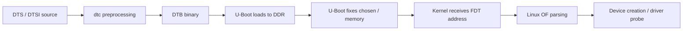
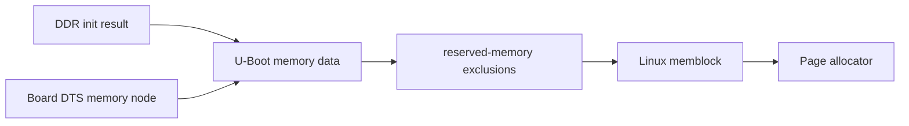
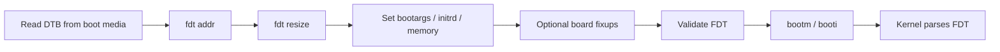
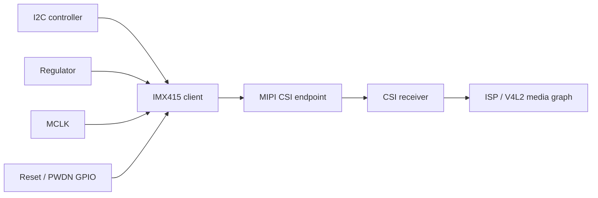
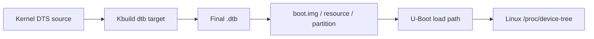
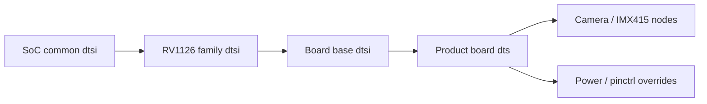
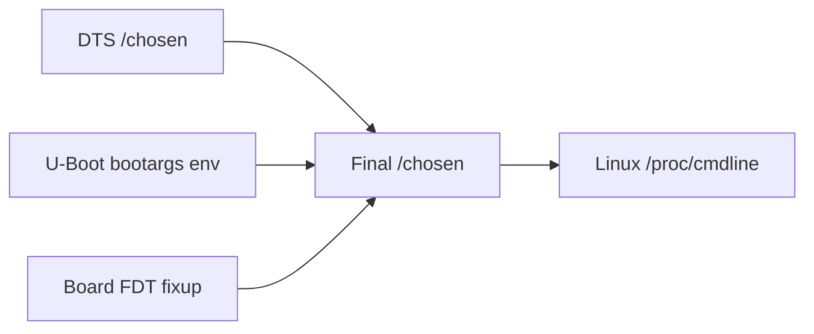
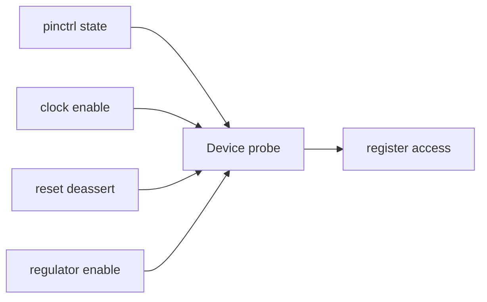
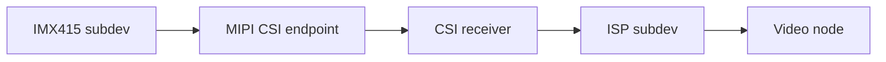

U-Boot 设备树经常被误认为只是 Linux DTS 的“复制品”。实际上，U-Boot 和 Linux 可能各自拥有一份设备树，也可能通过配置共享或修改同一个 FDT（Flattened Device Tree）对象。二者都使用设备树语法，但服务的运行阶段不同。

在 RV1126 + IMX415 平台上，U-Boot 阶段通常关心串口、启动介质、DDR、网络和设备树传递；Linux 阶段还要完整描述 I2C sensor、MIPI CSI、ISP、V4L2、音频和其他外设。配置错误时，可能出现 U-Boot 能启动但 Linux 摄像头没有 probe，也可能出现 U-Boot 根本无法访问存储。

本文重点建立三条工程判断线：当前使用的是哪份 DTS，U-Boot 如何生成和修改 DTB，最终传给 Linux 的 DTB 是否就是预期版本。

## 1. FDT 到底是什么

设备树源文件 DTS 经过设备树编译器处理，生成二进制 DTB。U-Boot 在启动 Linux 前把 DTB 放入 DDR，并通过架构约定把地址传给内核。Linux 再解析其中的节点和属性，创建设备并匹配驱动。



对 MCU 工程师而言，DTS 可以类比为一份外设资源描述表，但它不是简单的寄存器初始化脚本。设备树描述“硬件有什么、资源在哪里、如何连接”，真正的初始化由驱动完成。

例如一个摄像头节点的 `compatible`、I2C 地址、MCLK、reset GPIO 和 MIPI endpoint 只是描述资源；IMX415 驱动如何上电、写寄存器、注册 `v4l2_subdev`，仍由 Linux 驱动代码负责。

## 2. U-Boot DTS 与 Linux DTS 的边界

常见目录如下：

```bash
cd /path/to/rockchip-sdk

find u-boot -type f \( -name '*.dts' -o -name '*.dtsi' \) | grep -i 'rv1126\|rv1109' | sort
find kernel/arch/arm/boot/dts -type f \( -name '*.dts' -o -name '*.dtsi' \) \
    | grep -i 'rv1126\|rv1109' | sort
```

两套设备树的关系通常是：

| 对象 | U-Boot DTS | Linux DTS |
|---|---|---|
| 主要用途 | 启动阶段访问硬件、准备 FDT | 创建 Linux 设备和驱动资源 |
| 典型内容 | UART、MMC、网络、DRAM、chosen | GPIO、I2C、sensor、CSI、ISP、V4L2、音频 |
| 编译位置 | `u-boot/arch/arm/dts` | `kernel/arch/arm/boot/dts` |
| 最终产物 | U-Boot 使用的 dtb 或内置 FDT | 传给 Linux 的 dtb |
| 典型错误 | U-Boot 找不到存储或串口 | Linux probe 失败、设备不存在 |

不要假设同名文件一定内容相同。先查看 include 关系和目标配置：

```bash
grep -RIn 'DEFAULT_DEVICE_TREE\|DEVICE_TREE\|DTS' \
    u-boot/configs u-boot/Makefile device build 2>/dev/null | head -160

grep -RIn 'RK_KERNEL_DTS\|KERNEL_DTS' device build build.sh 2>/dev/null | head -100
```

对于 IMX415，真正决定 Linux 摄像头是否建立的，通常是 kernel DTS 中的 sensor、I2C、时钟、电源、GPIO 和 endpoint 节点；仅修改 U-Boot DTS 通常不会让 Linux 摄像头驱动出现。

## 3. 设备树节点的最小语义

一个节点能否被驱动使用，通常需要同时满足这些条件：

1. 节点位于正确的父总线下；
2. `compatible` 与驱动匹配表一致；
3. `status` 没有被设置为 `disabled`；
4. `reg`、中断、GPIO、时钟、复位和电源属性符合 binding；
5. 引脚复用和供电状态可用；
6. 连接关系通过 phandle 或 endpoint 正确表达。

简化示例：

```dts
&i2cX {
    status = "okay";

    camera@1a {
        compatible = "vendor,imx415";
        reg = <0x1a>;
        status = "okay";
        clocks = <&cru CLK_CAM0_OUT>;
        reset-gpios = <&gpioN GPIO_M RESET_FLAG>;
        pinctrl-names = "default";
        pinctrl-0 = <&camera_mclk>;
    };
};
```

上面的 `vendor,imx415`、时钟 ID 和 GPIO 编号只是结构示例，不能直接作为具体板卡配置。真实 binding、SDK 驱动匹配表和原理图必须一致。

检查驱动支持的 `compatible`：

```bash
grep -RIn 'imx415\|of_device_id\|of_match_table' \
    kernel/drivers/media kernel 2>/dev/null | head -160
```

检查节点是否被最终 DTS 展开：

```bash
# 先找到实际目标 dts，再按 SDK 工具链执行预处理
find kernel/arch/arm/boot/dts -name '*rv1126*.dts' -o -name '*rv1126*.dtsi'
```

## 4. `chosen`、`memory` 与启动参数

设备树中的 `/chosen` 节点不是普通外设节点，它为启动阶段传递控制台、bootargs、initrd 等信息提供位置。U-Boot 可能根据环境变量或启动脚本修改它。

常见观察命令：

```text
fdt addr ${fdt_addr_r}
fdt print /chosen
fdt print /memory
fdt header
```

`/chosen` 中的 `bootargs` 与 U-Boot 环境变量中的 `bootargs` 可能存在覆盖关系。排查串口和 rootfs 问题时，需要同时保存：

```text
printenv bootargs
fdt print /chosen
```

如果二者内容不一致，不能只看其中一个就下结论。具体优先级取决于启动脚本、U-Boot 的 FDT 操作和 kernel 分支实现。

`/memory` 描述 Linux 可用内存范围。它必须和实际 DDR 初始化结果、保留内存以及安全固件占用相容。内存节点写错可能导致 Linux 只识别部分内存、启动后随机崩溃，或者与 reserved-memory 区域重叠。



不要把 `memory` 节点当成“想写多大就写多大”的配置。实际地址、容量和保留区域必须来自板卡内存规格、loader 配置、SDK 约定和启动日志。

## 5. reserved-memory 与地址冲突

`reserved-memory` 用于从 Linux 普通内存中划出不交给页面分配器的区域，常用于固件、DMA 缓冲区、媒体组件或安全相关内存。RV1126 的媒体链路可能还涉及厂商内存管理方案，具体节点必须以 SDK 版本和媒体文档为准。

典型结构如下：

```dts
reserved-memory {
    #address-cells = <2>;
    #size-cells = <2>;
    ranges;

    buffer@0 {
        compatible = "shared-dma-pool";
        reg = <0x0 0x90000000 0x0 0x01000000>;
        no-map;
    };
};
```

这是结构示例，不是 RV1126 的可直接烧录参数。检查时重点看：

- 地址是否落在实际 DDR 范围内；
- 大小是否满足对齐要求；
- 是否与 kernel、dtb、initrd 加载地址冲突；
- `no-map` 是否符合使用者需求；
- 引用该区域的设备是否通过 `memory-region` 正确连接。

U-Boot 命令行可检查最终 FDT：

```text
fdt addr ${fdt_addr_r}
fdt print /reserved-memory
fdt addr ${fdt_addr_r}
fdt header
```

如果内核启动后出现内存异常，结合 `dmesg | grep -iE 'memory|reserved|cma|dma'` 查看 Linux 实际解析结果，不要只检查源码。

## 6. FDT 的加载、修正与传递

启动过程中，U-Boot 通常会把 DTB 从存储读入 DDR，然后设置 FDT 工作地址，再根据当前硬件和环境变量修正节点。修正动作可能包括写入 `/chosen/bootargs`、更新内存信息、加入 initrd 起止地址，或者修改 MAC 地址等板级信息。

简化流程：



命令行验证：

```text
load <interface> <dev>:<part> ${fdt_addr_r} <dtb-file>
fdt addr ${fdt_addr_r}
fdt header
fdt print /chosen
fdt print /memory
```

`load` 的 interface、设备号、分区号和文件名必须按实际板卡修改。执行 `fdt` 操作前，地址必须确实指向有效 DTB，否则可能得到 magic 错误或直接破坏内存。

查看 FDT 头信息时，重点关注 total size、结构偏移和字符串偏移是否合理。若要在 U-Boot 中追加属性，可能需要先预留空间：

```text
fdt resize 0x1000
```

具体命令和参数以当前 U-Boot 版本为准。设备树空间不足时，追加 `/chosen` 属性可能失败，即使原始 DTB 内容正确。

## 7. 设备树如何影响 IMX415 bring-up

IMX415 是 I2C 控制、MIPI CSI-2 输出的图像传感器。Linux 驱动要完成 probe，通常至少需要：



排查时按硬件时序而不是按节点数量检查：

1. I2C 控制器是否启用，线路上是否有上拉；
2. sensor 地址是否与原理图和实测一致；
3. 模拟电源、数字电源和 I/O 电源是否存在；
4. MCLK 是否输出且频率符合 sensor 驱动要求；
5. reset、powerdown 的有效电平是否正确；
6. MIPI endpoint 的端口、lane 数、时钟模式和对端连接是否一致；
7. Linux 驱动是否真的匹配了 `compatible`。

设备树写得很完整，不代表上电时序一定正确。最终要结合 `dmesg`、I2C 波形、示波器电源波形、MCLK 和 reset 波形判断。

常用 Linux 侧检查：

```bash
dmesg | grep -iE 'imx415|i2c|v4l2|media|csi|isp|clk|regulator'
ls -l /dev/video* /dev/v4l-subdev* 2>/dev/null
media-ctl -p 2>/dev/null
v4l2-ctl --list-devices 2>/dev/null
```

这些命令需要目标系统包含相应工具；输出为空不能直接证明硬件损坏。

## 8. 设备树编译与反编译验证

DTS 的正确性最好经过编译和反编译双向检查。先确认 SDK 使用的 `dtc`：

```bash
which dtc
 dtc --version
find kernel -type f -name 'dtc' -o -name '*.dtb' | head -80
```

编译命令会因内核版本和架构而变化，常见形式如下：

```bash
dtc -I dts -O dtb -o test.dtb test.dts
```

但包含复杂 `#include`、宏和内核 binding 的 DTS，通常应通过 kernel 的 Kbuild 编译，而不是直接调用 `dtc`。直接调用容易缺少 include 路径和预处理宏。

反编译最终 DTB：

```bash
dtc -I dtb -O dts -o unpacked.dts path/to/final.dtb
sed -n '1,220p' unpacked.dts
```

重点核对：

- 目标节点是否存在；
- `status` 是否为 `okay`；
- GPIO、clock、reset 和 regulator phandle 是否展开；
- `chosen` 是否包含预期 bootargs；
- `/memory` 和 `/reserved-memory` 是否符合实际；
- IMX415 endpoint 是否连接到正确 CSI 端口。

源码 DTS 正确、最终 DTB 错误，说明构建或打包链路断了。最终 DTB 正确、Linux 仍不工作，则继续分析驱动、时序和硬件。

## 9. 常见错误模式

### 9.1 修改了错误的 DTS

同时存在 U-Boot DTS、Linux DTS、公共 DTSI 和多个产品 DTS 时，最容易改错。解决方法是从 BoardConfig 和 Kbuild 目标反向追踪，并对最终 DTB 做反编译确认。

### 9.2 节点是 `disabled`

父总线或设备节点任何一层为 `disabled`，子设备都可能无法建立。检查最终 DTB，不要只看源码片段：

```bash
dtc -I dtb -O dts -o final.dts path/to/final.dtb
grep -nE 'status = "disabled"|status = "okay"' final.dts | head -100
```

### 9.3 compatible 不匹配

驱动匹配表中的字符串必须和设备树一致。字符串相近也不算匹配。以驱动源码的 `of_match_table` 和内核日志为准。

### 9.4 phandle 指向错误

`clocks = <&...>`、`reset-gpios`、`power-domains` 和 endpoint 都依赖 phandle。引用了错误控制器时，节点看起来完整，但 probe 会失败或延迟探测。

### 9.5 U-Boot 传递的是旧 DTB

这是最常见的“改了设备树但没有变化”原因之一。检查 DTB 文件时间、哈希、烧录分区和 U-Boot 实际加载路径；启动后查看 `/proc/device-tree` 或 `/sys/firmware/devicetree/base`：

```bash
tr '\0' '\n' < /proc/device-tree/chosen/bootargs 2>/dev/null
find /sys/firmware/devicetree/base -maxdepth 2 -type f | head -80
```

### 9.6 `chosen` 参数被覆盖

U-Boot 环境、启动脚本和设备树都可能参与 bootargs 生成。必须同时记录 U-Boot 的 `printenv bootargs`、`fdt print /chosen` 和 Linux `/proc/cmdline`：

```bash
cat /proc/cmdline
```

三者不一致时，沿启动脚本逐步定位覆盖发生的位置。

## 10. 可复现实验：证明 DTB 传递链路

在 PC 端准备一个带有明显标记的测试属性时，必须选择不会影响硬件启动的节点和属性，并确认当前 SDK 允许这样做。例如给 `/chosen` 添加测试字符串：

```text
fdt addr ${fdt_addr_r}
fdt resize 0x1000
fdt set /chosen bsp-test "dtb-from-current-build"
fdt print /chosen
```

完成一次临时启动后，在 Linux 中检查：

```bash
tr '\0' '\n' < /proc/device-tree/chosen/bsp-test 2>/dev/null
```

这个实验验证的是“U-Boot 当前操作的 FDT 是否被 Linux 接收”。正式修改仍应回到 DTS 源码和 SDK 构建链，不应依赖临时命令作为产品配置。

对 IMX415 适配，建议额外保存三类证据：最终 DTB 反编译片段、Linux `dmesg`、I2C/MCLK/reset 波形。三者能把“描述错误”“驱动问题”和“硬件时序问题”分开。

## 11. 验证清单与里程碑

完成本文实验后，应能回答：

- U-Boot DTS 和 Linux DTS 的职责有什么差异；
- DTS 如何编译成 DTB，U-Boot 如何加载和修改 FDT；
- `/chosen`、`/memory`、`reserved-memory` 分别解决什么问题；
- 如何确认最终传给 Linux 的 DTB 内容；
- IMX415 bring-up 需要哪些设备树资源和硬件证据；
- 为什么“节点存在”不等于“驱动已经 probe 成功”。

实践里程碑：从当前 RV1126 SDK 找出实际使用的 U-Boot DTS 和 kernel DTS，反编译最终 DTB，记录 `/chosen`、`/memory`、sensor 节点和 CSI endpoint；再通过 U-Boot 临时 FDT 属性与 Linux `/proc/device-tree` 完成一次端到端验证。

## 12. 从构建系统确认最终 DTB

设备树排查最忌讳只看源码文件。正确做法是确认完整链路：目标 DTS -> 编译后的 DTB -> 打包目录 -> U-Boot 实际加载 -> Linux 实际接收。



在 SDK 中先找 kernel DTS 目标：

```bash
cd /path/to/rockchip-sdk

grep -RInE 'RK_KERNEL_DTS|KERNEL_DTS|BOARD_DTS|DTB' device build build.sh 2>/dev/null | head -180
```

再找编译产物：

```bash
find kernel output rockdev -type f -name '*.dtb' \
  -printf '%TY-%Tm-%Td %TH:%TM %s %p\n' 2>/dev/null | sort | tail -100
```

对最终 DTB 做反编译：

```bash
dtc -I dtb -O dts -o /tmp/final-rv1126.dts path/to/final.dtb

grep -nE 'model|compatible|chosen|memory|reserved-memory|imx415|csi|isp|i2c' \
    /tmp/final-rv1126.dts | head -160
```

如果源码 DTS 中有节点，但最终 DTB 中没有，说明问题在构建目标、include 覆盖、Kbuild 或打包链路。此时继续改驱动没有意义。

## 13. DTS include 层级要画出来

Rockchip 平台设备树通常不是单个文件，而是多个 DTSI 层层 include。常见层级可能包括 SoC 公共 DTSI、芯片系列 DTSI、板级 DTS、摄像头模组 DTSI、产品差异 DTSI。



查看 include 关系：

```bash
TARGET_DTS=kernel/arch/arm/boot/dts/<actual-board>.dts

grep -nE '^#include|/include/' "$TARGET_DTS"
```

如果 include 很多，可以递归搜索关键节点：

```bash
grep -RInE 'imx415|mipi|csi|isp|i2c[0-9]|camera|reset-gpios|pwdn|mclk' \
    kernel/arch/arm/boot/dts 2>/dev/null | head -220
```

设备树覆盖规则要特别注意：后 include 或板级 DTS 中的 `&node { ... }` 可以覆盖前面公共 DTSI 的属性。一个节点在公共文件中 `status = "disabled"`，板级文件必须显式改成 `okay`，否则不会建立设备。

## 14. binding 文档是设备树的合同

设备树不是随便写属性。binding 文档定义了驱动期望的属性、类型、必填项和连接关系。新内核通常使用 YAML binding，旧 vendor kernel 可能仍有 txt 文档或直接依赖驱动源码。

查找 binding：

```bash
find kernel/Documentation/devicetree/bindings -type f \
  | grep -iE 'i2c|gpio|clock|reset|regulator|media|video|camera|mipi|csi|imx' | head -200
```

如果找不到 IMX415 专用 binding，就看驱动源码：

```bash
grep -RInE 'imx415|of_property_read|devm_gpiod_get|devm_clk_get|regulator_get|endpoint' \
    kernel/drivers/media 2>/dev/null | head -240
```

从驱动源码中提取属性时要谨慎：

| 驱动读取动作 | DTS 中应关注 |
|---|---|
| `of_property_read_u32` | 数值属性是否存在、单位是否正确 |
| `devm_gpiod_get` | GPIO 属性命名、有效电平 |
| `devm_clk_get` | `clocks` 和 `clock-names` |
| `devm_regulator_get` | `*-supply` 属性和 regulator 节点 |
| endpoint 解析 | `ports`、`endpoint`、`remote-endpoint` |

binding 是驱动和 DTS 之间的合同。DTS 能编译通过，不代表符合 binding；binding 正确，也不代表硬件电平和时序正确。

## 15. U-Boot 自己的控制 FDT

U-Boot 使用设备树有两种常见方式：一份用于 U-Boot 自己 Driver Model 的控制 FDT，一份作为传给 Linux 的运行 FDT。它们可能是同一个对象，也可能不同。

| FDT 类型 | 用途 | 常见观察方式 |
|---|---|---|
| control FDT | U-Boot 绑定自己的设备 | 编译配置、DM 初始化日志 |
| boot FDT | 传给 Linux kernel | `fdt addr ${fdt_addr_r}`、Linux `/proc/device-tree` |

配置项可能包括：

```bash
grep -E '^CONFIG_(OF_CONTROL|OF_SEPARATE|OF_EMBED|DEFAULT_DEVICE_TREE|MULTI_DTB)' \
    u-boot/.config 2>/dev/null
```

这些配置决定 U-Boot 如何获得自己的设备树：内嵌、分离、外部加载或多 DTB 选择。实际含义以当前 U-Boot 版本为准。

常见误区：U-Boot 能使用某个 UART 或 MMC，并不代表传给 Linux 的 DTB 一定是同一份；Linux 下某个设备节点正确，也不代表 U-Boot 阶段能访问该设备。

## 16. `/chosen` 的三方来源

`/chosen` 经常由 DTS 源码、U-Boot 环境和 U-Boot fixup 共同影响。Linux 最终看到的 `/proc/cmdline` 是综合结果。



验证时保存三组数据：

U-Boot 环境：

```text
printenv bootargs
printenv bootcmd
```

U-Boot FDT：

```text
fdt addr ${fdt_addr_r}
fdt print /chosen
```

Linux：

```bash
cat /proc/cmdline
tr -d '\0' < /proc/device-tree/chosen/bootargs 2>/dev/null; echo
```

如果 `printenv bootargs` 与 `/proc/cmdline` 不一致，要查启动脚本是否拼接参数、boot image header 是否携带 cmdline、board fixup 是否改写 `/chosen`。

## 17. `memory` 和 `reserved-memory` 要结合加载地址

U-Boot 加载 kernel、dtb、ramdisk 的地址必须避开自身、避开 reserved-memory，也不能越出 DDR 实际范围。Linux 解析 `/memory` 后会建立 memblock，再从中扣除 reserved-memory。

需要同时记录：

```text
bdinfo
printenv kernel_addr_r
printenv fdt_addr_r
printenv ramdisk_addr_r
fdt print /memory
fdt print /reserved-memory
```

Linux 侧：

```bash
dmesg | grep -iE 'Memory:|memblock|reserved|CMA|dma|ion|rga|vcodec|isp'
cat /proc/iomem | head -80
```

RV1126 的媒体、ISP、VENC、NPU 相关组件可能依赖连续内存、CMA 或厂商保留内存策略。具体节点名称和用途以 SDK 为准。不要随意缩小 reserved-memory 或 CMA，否则摄像头、编码、NPU 后续可能出现分配失败。

加载地址冲突的典型表现：

| 冲突 | 现象 |
|---|---|
| kernel 覆盖 dtb | FDT magic 错误、Linux 早期异常 |
| ramdisk 覆盖 kernel | 镜像校验失败、随机崩溃 |
| dtb 放入 reserved-memory | Linux 解析异常或后续内存冲突 |
| memory 写大 | Linux 随机崩溃、内存测试异常 |
| reserved-memory 与普通内存重叠异常 | 驱动 DMA 分配失败 |

## 18. pinctrl、clock、reset、regulator 的协同

真实板级 bring-up 中，设备树最容易错的不是 `compatible`，而是资源协同。一个外设 probe 成功通常要求引脚复用、时钟、复位、电源都满足时序。



对 IMX415 来说，至少要关注：

| 资源 | 作用 | 验证方式 |
|---|---|---|
| I2C pinctrl | 控制寄存器通信 | I2C 扫描、逻辑分析仪 |
| MCLK pinctrl/clock | sensor 输入时钟 | 示波器测频率 |
| reset GPIO | 释放 sensor | 示波器测电平时序 |
| pwdn GPIO | 电源管理或待机控制 | 示波器测有效电平 |
| regulator | AVDD/DVDD/IOVDD | 万用表/示波器 |
| MIPI endpoint | CSI 数据连接关系 | `media-ctl -p`、dmesg |

设备树中 GPIO 有效电平尤其容易错。`GPIO_ACTIVE_LOW` 与硬件 reset 有效电平必须对应。写反时，驱动可能一直把 sensor 保持在复位状态。

## 19. IMX415 endpoint 与 media graph

MIPI 摄像头不是单个 I2C 设备。它还要通过 media graph 把 sensor、CSI receiver、ISP、video node 连接起来。

典型连接关系：



DTS 中通常通过 `port`、`endpoint`、`remote-endpoint` 表达。排查重点：

- sensor endpoint 的 lane 数是否与硬件连接一致；
- remote-endpoint 是否指向 CSI 接收端；
- CSI 接收端是否反向指回 sensor；
- 时钟频率和 link frequency 是否与驱动要求一致；
- ISP 或 media pipeline 节点是否启用。

Linux 侧验证：

```bash
media-ctl -p 2>/dev/null
v4l2-ctl --list-devices 2>/dev/null
dmesg | grep -iE 'imx415|media|v4l2|subdev|csi|mipi|isp'
```

如果 I2C probe 成功但没有 `/dev/video*`，说明 sensor 只是媒体链路的一环，还要继续查 CSI、ISP、video device 和 pipeline 配置。

## 20. DTB 是否生效的强验证方法

最可靠的方法是加入一个临时、无害、可读取的标记。比看时间戳更直接。

源码 DTS 示例：

```dts
/ {
    bsp-build-id = "rv1126-imx415-dtb-check-20260814";
};
```

编译、打包、烧录后在 Linux 读取：

```bash
tr -d '\0' < /proc/device-tree/bsp-build-id; echo
```

如果读不到，说明当前 Linux 没收到这份 DTB。继续检查：

1. 目标 DTS 是否被 Kbuild 编译；
2. 生成的 DTB 是否进入打包目录；
3. U-Boot 是否从该路径加载 DTB；
4. 烧录是否更新了对应分区；
5. boot image 或 FIT image 是否内部还包含旧 DTB。

调试属性验证后可以删除，或者改成正式的 `model`、版本节点或板级信息管理方案。不要让临时字段长期污染产品 DTS。

## 21. U-Boot 下临时修改 FDT 的用途和边界

U-Boot 的 `fdt set` 可以临时修改设备树，适合快速验证 bootargs、chosen 标记或个别状态位。但它不是正式产品配置方式。

示例：

```text
fdt addr ${fdt_addr_r}
fdt resize 0x1000
fdt set /chosen bsp-test "temporary-fdt-test"
fdt print /chosen
boot
```

Linux 读取：

```bash
tr -d '\0' < /proc/device-tree/chosen/bsp-test 2>/dev/null; echo
```

适合临时修改的内容：

| 内容 | 是否适合 |
|---|---|
| `/chosen` 调试标记 | 适合 |
| bootargs 临时增加日志参数 | 适合 |
| 临时启用一个节点观察 probe | 谨慎 |
| 修改 GPIO 极性 | 不推荐长期使用 |
| 修改 regulator/clock 时序 | 不推荐，风险高 |
| 修改 reserved-memory | 不推荐，容易引入内存冲突 |

正式修改必须回到 DTS 源码，并通过构建链路验证。

## 22. 设备树问题与驱动问题如何分界

当某个设备不工作时，可以用下面的分界方法：

| 证据 | 更偏向 |
|---|---|
| `/proc/device-tree` 中节点不存在 | 构建/打包/DTB 路径问题 |
| 节点存在但 `status=disabled` | DTS 覆盖或状态问题 |
| 节点存在且 compatible 正确，但无 probe 日志 | Kconfig、驱动未编译、总线未创建设备 |
| probe 进入后读寄存器失败 | I2C/SPI 总线、电源、时钟、reset |
| probe 成功但无 video node | media graph、CSI、ISP、vb2 |
| video node 有但采集失败 | MIPI 信号、格式、时序、带宽、驱动配置 |

对 IMX415 建议保存最小证据包：

```bash
cat /proc/cmdline > cmdline.txt
tr -d '\0' < /proc/device-tree/model > model.txt 2>/dev/null || true
dmesg > dmesg.txt
media-ctl -p > media.txt 2>/dev/null || true
v4l2-ctl --list-devices > v4l2-devices.txt 2>/dev/null || true
```

再加上最终 DTB 反编译片段和硬件波形记录，才能有效区分软件描述错误与硬件时序错误。

## 23. 常见 DTB 打包形态

不同 SDK 的 DTB 可能以不同形式存在：

| 形态 | 特点 | 排查方式 |
|---|---|---|
| 独立 `.dtb` 文件 | U-Boot 从文件系统读取 | 查加载路径和文件哈希 |
| `boot.img` 内部 | kernel/dtb 被封装 | 使用 SDK 工具解包或查打包脚本 |
| FIT image | 一个镜像包含 kernel/dtb/ramdisk | `dumpimage` 或 `mkimage -l` |
| resource 分区 | 多个资源集中存放 | 查 Rockchip 打包工具和分区 |
| Android boot image | cmdline/dtb 可能在 boot 镜像内 | 查 vendor 工具和 header |

不要假设 `rockdev/xxx.dtb` 一定就是 U-Boot 加载的文件。要从 `bootcmd`、打包脚本和最终分区共同确认。

查找打包引用：

```bash
grep -RInE '\.dtb|boot.img|resource|FIT|mkimage|package-file' \
    build device u-boot output rockdev 2>/dev/null | head -220
```

如果是 FIT image，查看内容：

```bash
mkimage -l path/to/fit.itb 2>/dev/null || true
```

如果是 boot image 或 Rockchip 专用封装，使用 SDK 提供的解包工具，不能凭文件名猜测。

## 24. 设备树修改的版本管理

DTS 修改很容易散落在多个 DTSI 中。建议每次修改都记录：

```text
修改节点：
修改文件：
include 层级：
binding 依据：
原理图依据：
驱动匹配字符串：
编译产物：
最终 DTB 哈希：
板端验证命令：
回滚方式：
```

尤其是 GPIO、clock、regulator、reserved-memory 修改，必须写清楚依据。不要用“试出来能跑”作为唯一记录。后续换板、换 sensor、做量产维护时，这些记录会直接决定排错效率。

## 25. RV1126 + IMX415 的 DTS 检查清单

| 检查项 | 通过标准 |
|---|---|
| BoardConfig | 指向正确 kernel DTS |
| 最终 DTB | 反编译后包含目标 model 和关键节点 |
| `/chosen` | bootargs、stdout-path 符合串口和 rootfs |
| `/memory` | DDR 范围与实际板卡一致 |
| `reserved-memory` | 不与加载地址冲突，满足媒体内存需求 |
| I2C 控制器 | `status = "okay"`，pinctrl 正确 |
| IMX415 节点 | compatible、reg、电源、clock、GPIO 符合驱动和原理图 |
| MCLK | 实测频率符合驱动期望 |
| reset/pwdn | 有效电平和时序正确 |
| endpoint | sensor 与 CSI remote-endpoint 双向连接 |
| CSI/ISP | 对应节点启用，media graph 完整 |
| Linux 验证 | `/proc/device-tree`、`dmesg`、`media-ctl` 证据一致 |

## 26. 练习：完成一次 DTB 端到端审计

建议以当前 RV1126 板卡完成一次完整审计：

1. 从 BoardConfig 找到 kernel DTS 名称；
2. 画出 DTS include 层级；
3. 编译生成 DTB；
4. 反编译最终打包 DTB；
5. 在 U-Boot 中查看 `/chosen`、`/memory`；
6. 启动 Linux 后读取 `/proc/device-tree/model` 和 `/proc/cmdline`；
7. 查找 IMX415 节点；
8. 保存 `dmesg`、`media-ctl -p`、`v4l2-ctl --list-devices`；
9. 对比源码 DTS、最终 DTB、板端设备树三者。

记录模板：

```text
board:
kernel_dts:
include_chain:
final_dtb:
final_dtb_sha256:
uboot_fdt_addr:
linux_model:
linux_cmdline:
imx415_node_present:
media_graph:
result:
next_debug_direction:
```

这个练习完成后，才能说真正掌握了“设备树是否生效”的判断方法。

## 27. 本文里程碑补充

完成本文后，合格标准是：

- 能区分 U-Boot control FDT 和传给 Linux 的 boot FDT；
- 能从 SDK 配置追踪最终 DTB 来源；
- 能反编译最终 DTB 并核对关键节点；
- 能解释 `/chosen`、`/memory`、`reserved-memory` 对启动和媒体链路的影响；
- 能围绕 IMX415 检查 I2C、MCLK、reset、电源和 endpoint；
- 能用 U-Boot `fdt` 命令和 Linux `/proc/device-tree` 做端到端验证；
- 能把设备树问题、驱动问题和硬件时序问题分开。

> 🏷️ Linux BSP、RV1126、U-Boot DTS、Linux 设备树、FDT、DTB、IMX415、MIPI CSI、V4L2
