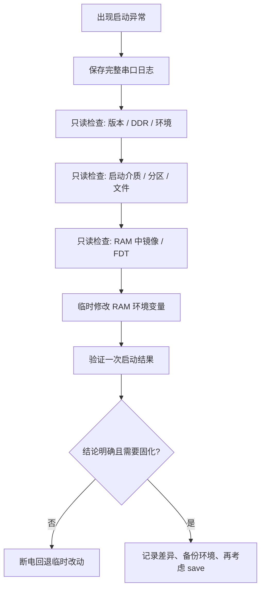
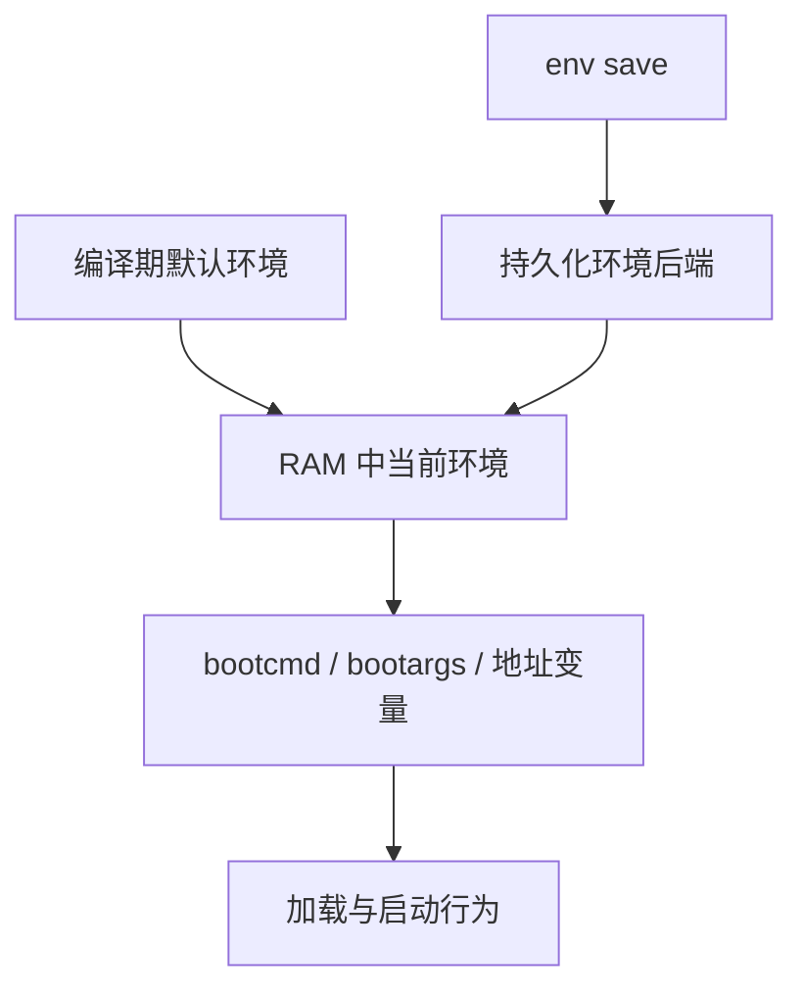
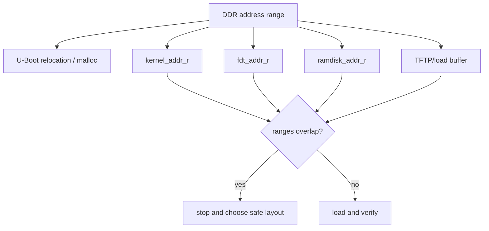
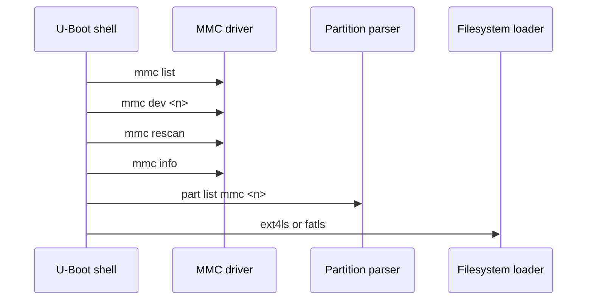
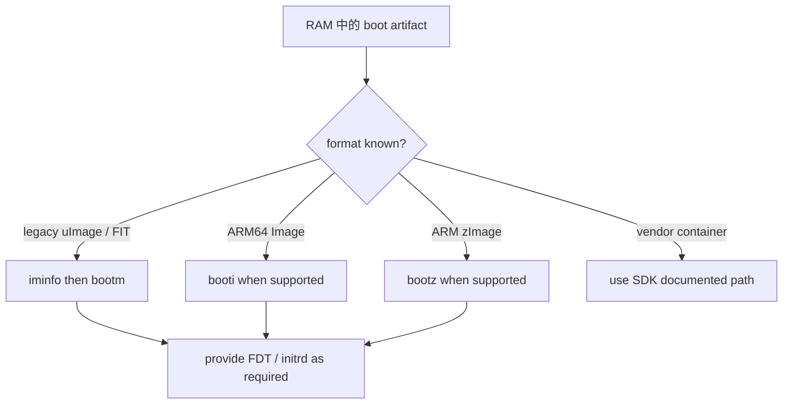
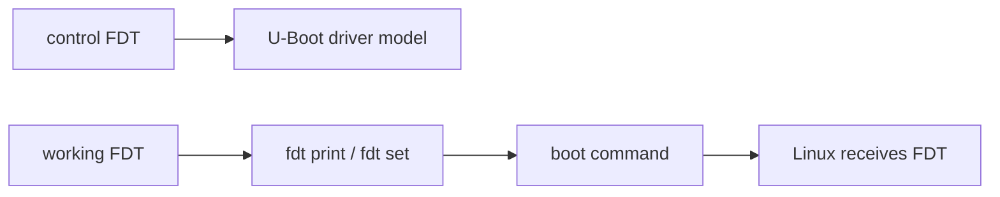
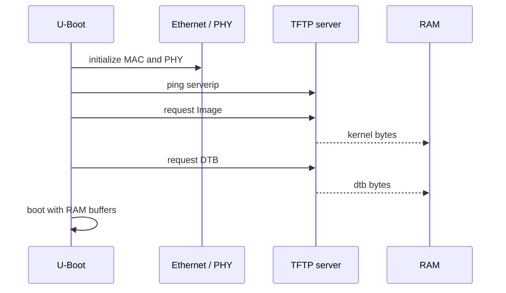
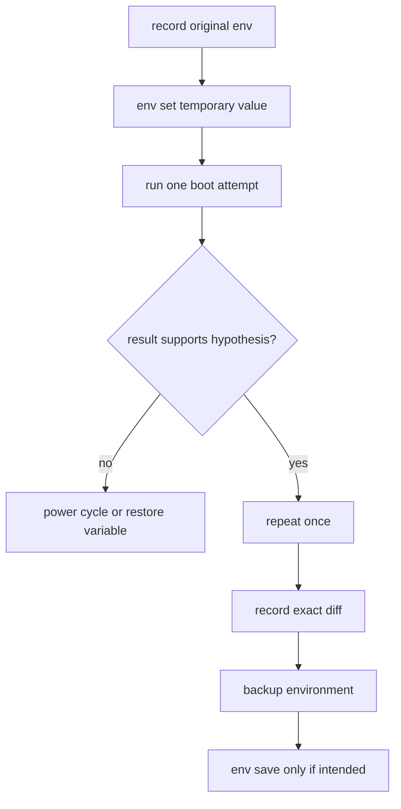
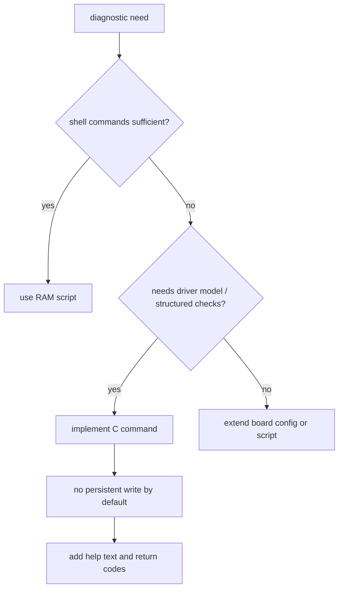

进入 U-Boot 提示符以后，很多人会立刻修改 `bootcmd`，或者直接对 eMMC 执行 `mmc write`。这通常会把原本能够定位的问题，变成“环境变量、镜像和分区一起被改过”的问题。

对 BSP 工程师而言，U-Boot 的提示符不是一个临时终端，而是**启动链路中唯一能同时观察 DDR、存储、设备树、网络和内核交接状态的位置**。正确的工作方式是每次只验证一层：先判断硬件和驱动模型是否已经准备好，再判断数据是否被读入 RAM，最后才判断能否把正确的 kernel、initrd 和 DTB 交给 Linux。

本文围绕 RV1126 + IMX415 这类嵌入式 Linux 板卡建立一套可复用的 U-Boot 调试方法。命令本身大多来自通用 U-Boot；具体分区名、加载地址、串口号、镜像格式和 SDK 路径必须从当前工程发现，不能照抄其他板卡的数值。

## 1. 先建立安全的 U-Boot 调试基线

### 1. 先建立“停止写入”的调试纪律

第一条纪律：**在证明当前读取路径正确以前，不执行任何擦除、写入、保存环境或更新 bootloader 的命令。**

原因很简单。`mmc erase`、`mmc write`、`env save` 和厂商烧录命令都会改变持久状态；而 `printenv`、`bdinfo`、`part list`、`ext4ls`、`fdt print`、`md` 和 `ping` 只读或只影响 RAM，适合建立事实。



下面表格给出常用动作的风险等级。这里的“安全”只表示不会主动修改非易失介质；它仍可能触发硬件初始化、总线访问或造成日志变化。

| 动作 | 典型命令 | 改变持久状态 | 调试阶段建议 |
|---|---|---:|---|
| 查看环境 | `env print` / `printenv` | 否 | 优先执行 |
| 查看内存信息 | `bdinfo` / `meminfo` | 否 | 优先执行 |
| 扫描 MMC | `mmc list` / `mmc rescan` | 否 | 优先执行 |
| 列出分区 | `part list mmc 0` | 否 | 优先执行 |
| 加载文件到 RAM | `ext4load` / `fatload` / `tftpboot` | 否 | 优先执行 |
| 临时设变量 | `env set` / `setenv` | 否 | 可用于单次实验 |
| 修改工作 FDT | `fdt set` | 否 | 仅用于小范围验证 |
| 保存环境 | `env save` / `saveenv` | 是 | 证据充分后才做 |
| 写块设备 | `mmc write` | 是 | 需要分区和地址双重核对 |
| 擦除块设备 | `mmc erase` | 是 | 不作为普通调试手段 |

每次开始调试，先复制一份原始串口输出。不要只保留最后的 panic 截图，必须保留 U-Boot banner、环境变量、加载返回字节数和 Linux 早期日志。

```bash
# 主机侧示例，根据实际串口设备和波特率调整
picocom -b 1500000 /dev/ttyUSB0 | tee uboot-session-$(date +%F-%H%M%S).log
```

### 2. U-Boot 调试的总路线

“板子起不来”不是一个可执行的结论。先把它拆为六个层次，每个层次都有独立的可观测结果。


| 层次 | 首先要回答的问题 | 最小证据 |
|---|---|---|
| 串口交互 | U-Boot 是否能稳定收发命令 | `version`、`help` 有完整输出 |
| CPU / DDR | RAM 范围和可用加载区是什么 | `bdinfo`、启动 banner |
| 启动介质 | eMMC/SD/SPI-NAND 控制器是否已发现 | `mmc list`、`mmc info`、对应存储命令 |
| 文件或镜像 | 目标文件是否从正确分区读入 | load 返回的字节数、文件列表、内存首部 |
| 工作 FDT | 即将传给 Linux 的 DTB 是哪一份 | `fdt addr`、`fdt print /chosen` |
| Linux 交接 | 内核入口、参数和 FDT 是否匹配 | `booti`/`bootm` 日志、kernel early log |

这条路线的一个重要好处是：即使 Linux 不能启动，你也能在 U-Boot 阶段判断问题落在存储、镜像格式、FDT 还是 kernel 本身。

### 3. 开场快照：版本、命令和环境后端

先不要修改任何变量，执行一次下面的快照命令：

```text
version
bdinfo
env info -p -d
env print bootcmd bootargs boot_targets bootdelay
env print kernel_addr_r fdt_addr_r ramdisk_addr_r loadaddr
help mmc
help fdt
help boot
```

旧版本 U-Boot 可能提供 `printenv`、`setenv`、`saveenv` 别名；新版本把它们归入 `env print`、`env set`、`env save`。先执行 `help env` 或 `help printenv`，不要假设某个子命令在当前配置中必然可用。



环境变量通常来自编译期默认值和一个可选持久化后端。后端可能是 MMC、SPI Flash、NAND、FAT、EXT4、EEPROM 或根本不存在。`env info -p -d` 用于判断当前环境是否有持久化位置以及是否仍使用默认环境；若命令不可用，查看 U-Boot 启动日志和 SDK 配置。

示例输出的解读方式：

```text
=> env print bootcmd bootargs
bootcmd=run distro_bootcmd
bootargs=console=ttyS2,1500000 root=/dev/mmcblk0p2 rootwait rw
```

这里不能根据变量名断言实际启动路径。`bootcmd` 可能继续调用其他 `run` 脚本，`distro_bootcmd` 又可能遍历多个设备和分区。接下来要把它展开，而不是把 `bootcmd` 当成最终答案。

```text
=> env print -a
=> echo ${bootcmd}
=> run bootcmd
```

执行 `run bootcmd` 会尝试真正启动系统，因此应先完成只读检查。若你只想理解脚本内容，优先查看变量文本和相关 `boot_targets`、`boot_prefixes`、`boot_scripts`、`distro_bootpart` 等变量。

## 2. 验证内存、介质、文件系统与 FDT

### 4. DDR 与加载地址：先证明 RAM 区域安全

U-Boot 下的地址变量不是“随便找一个大数”。加载 kernel、DTB、initrd 或临时环境备份前，必须知道 DDR 的起始地址、总大小、U-Boot 重定位区和已有 buffer 的位置。



```text
=> bdinfo
=> printenv kernel_addr_r fdt_addr_r ramdisk_addr_r loadaddr
=> meminfo
=> lmb dump
```

不是每个构建都启用了 `meminfo` 或 `lmb`。当这些命令不存在时，至少从 `bdinfo`、启动 banner、BoardConfig、U-Boot defconfig 和已有环境变量中记录信息。

建议建立一张本板地址表，并把它和镜像大小一起纳入版本管理：

| 项目 | 值来源 | 需要验证 |
|---|---|---|
| DRAM 起始/大小 | `bdinfo`、boot log | 覆盖整个可用 RAM 范围 |
| U-Boot relocation | `bdinfo` | 不与加载区重叠 |
| kernel 加载地址 | `kernel_addr_r` 或脚本 | 镜像大小后仍留间隔 |
| FDT 加载地址 | `fdt_addr_r` | DTB 和 `fdt resize` 余量 |
| initrd 加载地址 | `ramdisk_addr_r` | 不与 kernel 解压区域冲突 |
| 保留内存 | Linux DTS、启动参数 | 不作为通用加载区 |

用十六进制地址手工判断重叠很容易出错。每次 load 后都记录返回的字节数；例如 `filesize` 是由许多加载命令设置的环境变量，可用于计算区间上界。

```text
=> ext4load mmc 0:2 ${kernel_addr_r} /boot/Image
... bytes read in ... ms
=> printenv filesize
=> md.b ${kernel_addr_r} 40
```

`md.b` 只用于查看 RAM 内容。它不能验证镜像格式是否正确，但可以快速发现“加载地址未变、首部全零、实际加载的是文本文件”等基础错误。

### 5. 启动介质：先看到设备，再碰文件系统

针对 eMMC/SD，先让 MMC 子系统完成设备发现，再看分区。不要直接执行 `ext4load mmc 0:2 ...`，因为设备号、硬件分区和分区号都可能与预期不同。



一个安全的只读会话示例：

```text
=> mmc list
=> mmc dev 0
=> mmc rescan
=> mmc info
=> part list mmc 0
=> mmc part
```

`mmc list` 显示控制器实例，`mmc dev` 选择当前设备，`mmc rescan` 重新扫描，`mmc info` 显示已选设备的厂商、容量和速度模式。具体是否存在这些命令取决于 `CONFIG_CMD_MMC` 等配置；`help mmc` 是当前板的最终依据。

对 eMMC 尤其要理解硬件分区与普通用户分区的区别：

| 区域 | 常见用途 | 调试要点 |
|---|---|---|
| user area | GPT/MBR 分区、rootfs、boot 文件 | 通常是文件系统访问目标 |
| boot partition 1/2 | bootloader 镜像 | 不是普通 `mmc 0:2` 文件系统分区 |
| RPMB | 受保护数据 | 不作为普通读写调试区 |

不要把 `mmc dev 0 1` 中的第二个参数和 `mmc 0:1` 中的 `:1` 混为一谈：前者可能涉及硬件分区选择，后者通常是分区表中的文件系统分区。当前 U-Boot 的 `help mmc` 与 `part list` 输出必须一起看。

### 6. 文件系统与加载路径：证明读到的是目标文件

确认分区后，再列目录。FAT 和 EXT4 的命令不同，先识别文件系统，不要因为看到一个“boot”目录就假定可以使用 `ext4load`。

```text
=> fatinfo mmc 0:1
=> fatls mmc 0:1 /
=> ext4ls mmc 0:2 /
=> ext4ls mmc 0:2 /boot
```

加载时把“设备、分区、RAM 地址、路径、字节数”全部保留在日志中：

```text
=> ext4load mmc 0:2 ${kernel_addr_r} /boot/Image
=> printenv filesize
=> md.b ${kernel_addr_r} 40

=> ext4load mmc 0:2 ${fdt_addr_r} /boot/rv1126-myboard.dtb
=> printenv filesize
=> fdt addr ${fdt_addr_r}
=> fdt header
```

`fdt header` 成功只能证明 RAM 中对象可被 FDT 工具识别，不能证明它就是 Linux 正在使用的 DTB。后文会用 `/chosen` 和 Linux `/proc/device-tree` 做端到端确认。

加载失败时按顺序检查：

1. `mmc dev` 是否选择了正确控制器；
2. `part list` 中是否存在预期分区；
3. 文件系统类型与命令是否匹配；
4. 路径和大小写是否与 `ext4ls`/`fatls` 一致；
5. 加载地址是否位于可用 RAM；
6. 文件是否真的已被打包或烧录到该分区。

不要跳过前四步直接修改 `bootcmd`。很多“U-Boot 找不到 Image”的问题，其实是 SDK 打包产物和 U-Boot 加载路径不一致。

### 7. 镜像格式决定启动命令

Linux 内核可能以裸 `Image`、压缩 `zImage`、legacy uImage、FIT image 或厂商封装镜像存在。启动命令必须与格式、架构和是否携带 initrd/FDT 对应。



常用的只读识别命令：

```text
=> iminfo ${kernel_addr_r}
=> md.b ${kernel_addr_r} 40
=> strings ${kernel_addr_r} 2>/dev/null
=> help bootm
=> help booti
=> help bootz
```

`iminfo` 适用于带 U-Boot image header 的镜像或 FIT，裸 `Image` 报错并不代表文件坏了。反过来，`booti` 是否可用取决于 U-Boot 配置和架构。以当前 SDK 的既有启动脚本和打包说明为准。

临时启动裸 kernel 与独立 DTB 的命令形态可能类似：

```text
=> booti ${kernel_addr_r} - ${fdt_addr_r}
```

其中的 `-` 表示没有 initrd。该语法只在当前 U-Boot 支持相应 boot 命令时有效，且 kernel 架构必须匹配。实验前先 `help booti`，并保留可回退的原启动介质。

### 8. 工作 FDT 与 control FDT：必须分清两份树

U-Boot 可能维护至少两类 FDT：供 U-Boot 自身 Driver Model 使用的 control FDT，以及准备传递给 Linux 的 working FDT。调试 Linux 启动时通常关注 working FDT；随意修改 control FDT 可能破坏 U-Boot 自己的设备模型。



先查看当前工作 FDT：

```text
=> fdt addr
=> fdt print /chosen
=> fdt print /memory
=> fdt print /aliases
```

如果输出不是你刚刚加载的 DTB 地址，说明 `bootcmd`、FIT 配置或厂商脚本可能替换了 working FDT。不要只看环境变量中的 `fdt_addr_r`；以 `fdt addr` 的当前地址和实际启动脚本为准。

工作 FDT 需要增加一个临时属性时，先确保有足够空间：

```text
=> fdt addr ${fdt_addr_r}
=> fdt resize 0x1000
=> fdt set /chosen bsp-test "uboot-fdt-check"
=> fdt print /chosen
```

`fdt resize` 的大小必须落在可用 RAM 中，且不能覆盖紧邻 buffer。临时属性适合验证 DTB 传递链，不适合长期维护 GPIO、clock 或 reserved-memory 配置。

Linux 启动成功后读取验证标记：

```bash
tr -d '\0' < /proc/device-tree/chosen/bsp-test 2>/dev/null; echo
```

若读不到，优先检查最后实际执行的 boot 命令、FIT 是否内嵌 DTB、`bootm`/`booti` 的 FDT 参数以及 U-Boot 是否在交接前替换了 FDT。

### 9. 网络启动：隔离存储问题的最快方法

当你不确定是镜像内容问题还是 eMMC/SD 读取问题时，TFTP 是很有效的隔离工具。它不替代量产启动方案，但能让 kernel 和 DTB 在不改动板载存储的情况下进入 RAM。



一组临时变量示例：

```text
=> env set ipaddr 192.168.10.20
=> env set serverip 192.168.10.10
=> ping ${serverip}
=> tftpboot ${kernel_addr_r} Image
=> tftpboot ${fdt_addr_r} rv1126-myboard.dtb
=> booti ${kernel_addr_r} - ${fdt_addr_r}
```

IP 地址、文件名和 boot 命令仅是结构示例。`ping` 必须先成功；若失败，按 MAC 地址、PHY reset/clock、RGMII/RMII 时序、网线、交换机 VLAN、IP/掩码和服务器防火墙逐层排查。不要把 TFTP 超时直接归因于服务器。

网络启动成功而本地存储启动失败时，结论应谨慎表述：它证明 RAM 中这份 kernel/DTB 可以交接给 Linux，但并不证明 eMMC 的分区、文件系统、加载地址或 bootcmd 正确。

## 3. 组织一次可回滚的启动实验

### 10. `bootcmd`、`bootargs` 与一次性实验

环境变量是高效实验工具，也是最常见的状态污染源。默认策略是：**先 `env print` 记录，再 `env set` 临时修改，单次验证完成后断电回退；只有结论明确时才 `env save`。**



示例：只在当前 RAM 会话中增加诊断参数。

```text
=> env print bootargs
=> env set bootargs "${bootargs} loglevel=7 initcall_debug"
=> booti ${kernel_addr_r} - ${fdt_addr_r}
```

这里有三个注意点：

1. 变量展开后的空格和引号必须检查；
2. 当前 `bootargs` 可能在其他脚本中被重新拼接或覆盖；
3. 不执行 `env save` 时，断电一般可以回到持久环境，但具体行为取决于环境后端和板级补丁。

恢复单个变量的方式取决于当前版本：

```text
=> env default bootargs
=> env print bootargs
```

`env default -a` 会恢复全部变量默认值，影响范围很大。只有已经备份环境并确认默认配置可启动时才使用。

### 11. 原始块读写：只把读取当成诊断手段

文件系统加载失败时，有人会立刻使用 `mmc read`。原始读取可以用于核对分区起始块或检查镜像头，但必须先从 `part list` 得到 LBA；不能凭“某型号板常用偏移”猜测。

```text
=> part start mmc 0 2 boot_part_start
=> env print boot_part_start
=> mmc read ${loadaddr} ${boot_part_start} 0x40
=> md.b ${loadaddr} 40
```

`part start`、`part size` 是否支持以及参数格式取决于 U-Boot 版本。`help part` 给出当前构建的准确语法。读取的块数是扇区数，通常一个块为 512 字节，但仍要以设备信息和命令文档为准。

下列命令在本文的常规诊断流程中禁止使用：

```text
mmc erase ...
mmc write ...
env erase
env save
```

它们不是“试试看”的工具。需要更新镜像时，使用 SDK 规定的打包、校验、烧录和回读流程，并事先验证目标分区、镜像大小、哈希和回滚介质。

### 12. 自定义环境脚本：先固化只读快照

重复输入十几条查看命令很容易漏项。可以先在 RAM 环境中定义一个只读快照脚本；它不应该在没有确认的情况下保存到持久环境。

```text
=> env set bsp_snapshot '
echo === VERSION ===; version; \
echo === BOARD ===; bdinfo; \
echo === ENV ===; env print bootcmd bootargs kernel_addr_r fdt_addr_r; \
echo === MMC ===; mmc list; mmc info; \
echo === PARTITIONS ===; part list mmc 0; \
echo === FDT ===; fdt addr; fdt print /chosen'
=> run bsp_snapshot
```

不同 U-Boot shell 对换行、转义和分号的处理存在差异。若长脚本难以录入，先使用单行版本验证，再放入板级默认环境文件或 SDK 的环境配置中。脚本应只执行 `version`、`bdinfo`、`env print`、`mmc list`、`part list`、`fdt print` 一类观察命令。


把脚本写进源码，而不是永久停留在某块开发板的 `saveenv` 中。源码可审查、可复现，也能和同一版本的 U-Boot 配置一起回滚。

### 13. C 级自定义命令：什么情况下值得写

当诊断需要读取 driver model 状态、解析板级数据或执行带参数的安全检查时，C 级自定义命令比环境脚本更合适。它不应成为绕过标准子系统、直接写寄存器的后门。



一个只读命令的最小结构如下：

```c
#include <command.h>
#include <env.h>

static int do_boardcheck(struct cmd_tbl *cmdtp, int flag, int argc,
                         char *const argv[])
{
    printf("U-Boot diagnostic snapshot\n");
    run_command("version", 0);
    run_command("bdinfo", 0);
    run_command("env print bootcmd bootargs", 0);
    run_command("mmc list", 0);
    return CMD_RET_SUCCESS;
}

U_BOOT_CMD(
    boardcheck, 1, 0, do_boardcheck,
    "print a read-only board bring-up snapshot", ""
);
```

不同 U-Boot 版本的头文件、`U_BOOT_CMD` 参数和 build system 可能不同。实施时先在同一个源码树中找到已存在的 `cmd_*.c` 文件作为模板，再把新文件加入对应目录的 `Makefile` 与 `Kconfig`。

### 13.1 命令实现的安全边界

| 行为 | 是否应放入默认诊断命令 | 原因 |
|---|---:|---|
| 打印版本、环境、分区 | 是 | 只读、可重复 |
| 读取 FDT `/chosen` | 是 | 有助于确认交接状态 |
| 重新扫描 MMC | 谨慎 | 可能改变初始化状态但通常可控 |
| 下载 TFTP 镜像 | 否 | 依赖网络并占用 RAM |
| 修改 bootargs | 否 | 应由显式实验命令完成 |
| 写 eMMC / 保存环境 | 否 | 不能隐藏在诊断路径中 |
| 直接写 clock/GPIO 寄存器 | 否 | 容易绕过驱动模型与电气约束 |

命令的帮助文字必须写明副作用和参数范围。不要用一个名字含糊的 `test` 命令同时做写寄存器、下载镜像和启动内核。

## 4. 从 U-Boot 到 Linux 完成闭环定位

### 14. U-Boot 到 Linux 的一次端到端实验

下面的实验目标不是更新系统，而是证明一份 kernel 和 DTB 能从指定来源进入 RAM，并且 Linux 实际收到目标 DTB。


### 14.1 实验准备

准备两份明确的文件：

| 文件 | 要求 |
|---|---|
| kernel | 已知格式、来自当前构建、记录哈希 |
| DTB | 已加入无害构建标记，例如 `/bsp-build-id` |

DTB 中的临时标记示例：

```dts
/ {
    bsp-build-id = "rv1126-imx415-uboot-check";
};
```

构建完成后，先在主机验证最终 DTB 包含该字符串：

```bash
dtc -I dtb -O dts -o /tmp/board.dts path/to/board.dtb
grep -n 'bsp-build-id' /tmp/board.dts
sha256sum path/to/Image path/to/board.dtb
```


### 14.2 U-Boot 侧执行

以网络加载为例，按当前板的地址和命令调整：

```text
=> env print kernel_addr_r fdt_addr_r
=> ping ${serverip}
=> tftpboot ${kernel_addr_r} Image
=> tftpboot ${fdt_addr_r} board.dtb
=> fdt addr ${fdt_addr_r}
=> fdt print / bsp-build-id
=> booti ${kernel_addr_r} - ${fdt_addr_r}
```

若 `fdt print / bsp-build-id` 的语法在当前版本不接受，可先 `fdt print /`，再在输出中搜索属性。重点不是固定命令写法，而是确认 working FDT 的地址、内容和传入 boot 命令的地址相同。


### 14.3 Linux 侧验证

```bash
tr -d '\0' < /proc/device-tree/bsp-build-id; echo
cat /proc/cmdline
uname -a
dmesg | head -120
```

若 build-id 一致，说明至少这次启动交接的 DTB 没有被另一个步骤替换。若 kernel 能启动但标记不一致，优先审查 FIT、U-Boot 的 FDT 选择、厂商 resource image 和 boot script。

### 15. 高频故障模式与第一证据

| 现象 | 不要先做什么 | 第一证据 | 优先方向 |
|---|---|---|---|
| `mmc dev` 失败 | 不要改 rootfs | `mmc list`、`mmc info` | pinctrl、clock、供电、控制器驱动 |
| 分区不存在 | 不要直接 `mmc write` | `part list`、`mmc part` | 设备号、硬件分区、分区表 |
| `ext4load` 找不到文件 | 不要先改 bootcmd | `ext4ls` 和实际路径 | 文件系统类型、打包/烧录位置 |
| `iminfo` 失败 | 不要判定 kernel 损坏 | 镜像格式、`md.b` | 裸 Image/FIT/uImage 区分 |
| `fdt print` 失败 | 不要改 Linux DTS | `fdt addr`、load 返回长度 | 地址、DTB 格式、加载覆盖 |
| TFTP 超时 | 不要先换 kernel | `ping`、PHY 日志 | MAC/PHY、链路、IP、服务端 |
| Linux 收到旧 DTB | 不要只重编 DTS | build-id 端到端验证 | 打包、FIT/resource、FDT 参数 |
| `saveenv` 后无法启动 | 不要继续覆盖变量 | 原始环境备份、默认环境 | 环境后端、bootcmd、回退介质 |

## 5. 记录、练习与验收

### 16. 一份可复用的 U-Boot 现场记录模板

每次板级问题都用同一份结构记录，可以显著减少“昨天能复现、今天不知道改了什么”的情况。

```text
board:
soc:
sdk_commit:
u_boot_commit:
build_command:
serial_port_and_baud:

symptom:
last_known_good_commit:

version_output:
bdinfo_output:
env_backend:
bootcmd:
bootargs:
kernel_addr_r:
fdt_addr_r:

storage_device:
partition_table:
kernel_source_and_sha256:
dtb_source_and_sha256:
working_fdt_address:

experiment:
expected_result:
actual_result:
conclusion:
rollback_action:
```

这份记录的价值不在于形式，而在于逼迫每次实验只表达一个假设。比如“从 TFTP 启动同一份 Image 成功”可以支持“本地存储加载路径有问题”，但不能支持“eMMC 硬件一定正常”。

### 17. 板级检查清单

| 检查项 | 通过标准 |
|---|---|
| 串口交互 | `version`、`help` 输出稳定且无乱码 |
| 环境来源 | 已知默认环境和持久环境后端 |
| 加载地址 | kernel、FDT、initrd 与 U-Boot 区域不重叠 |
| MMC 设备 | `mmc list`、`mmc info` 与板卡启动介质一致 |
| 分区表 | `part list` 的设备号、分区号和用途已记录 |
| 文件加载 | 文件路径、字节数和 RAM 首部可复核 |
| 镜像格式 | 启动命令与裸 Image/FIT/uImage 类型对应 |
| 工作 FDT | `fdt addr` 指向预期对象，`/chosen` 可读 |
| Linux 交接 | kernel、cmdline、DTB build-id 三者证据一致 |
| 回退能力 | 有健康镜像、环境备份或网络启动路径 |

### 18. 练习：完成一次不写入的启动审计

在当前 RV1126 开发板完成以下审计，不执行 `env save`、`mmc write` 或擦除操作：

1. 保存一次从上电到 U-Boot 提示符的原始串口日志；
2. 记录 `version`、`bdinfo` 和全部关键环境变量；
3. 确认 MMC 设备号、用户区和文件系统分区；
4. 列出启动分区目录，记录 kernel 与 DTB 文件名；
5. 将两份文件加载到 RAM，记录地址与字节数；
6. 设置 working FDT，读取 `/chosen`、`/memory`；
7. 从网络加载同一份 kernel/DTB，和存储加载路径对比；
8. 启动 Linux 后读取 `bsp-build-id` 和 `/proc/cmdline`；
9. 把所有证据填入现场记录模板；
10. 断电重启，确认临时环境修改没有改变默认启动行为。

### 19. 本文里程碑

完成本文后，应能够做到：

- 不修改持久状态地完成一次 U-Boot 启动审计；
- 区分 MMC 控制器、硬件分区、分区表和文件系统分区；
- 从 load 返回字节数、RAM 首部和镜像格式选择正确启动命令；
- 区分 U-Boot control FDT 与传递给 Linux 的 working FDT；
- 用 TFTP 启动隔离存储路径问题；
- 使用临时 build-id 证明 DTB 的端到端传递；
- 用只读环境脚本或最小 C 命令固化诊断快照；
- 在需要保存环境或写入镜像时，明确列出风险、证据和回退动作。

> 🏷️ Linux BSP、RV1126、U-Boot、环境变量、MMC、FDT、DTB、TFTP、bootcmd、bootargs、板级调试
