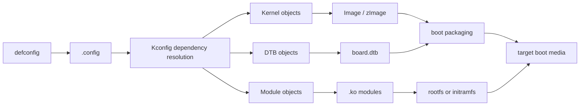
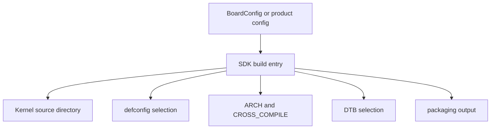
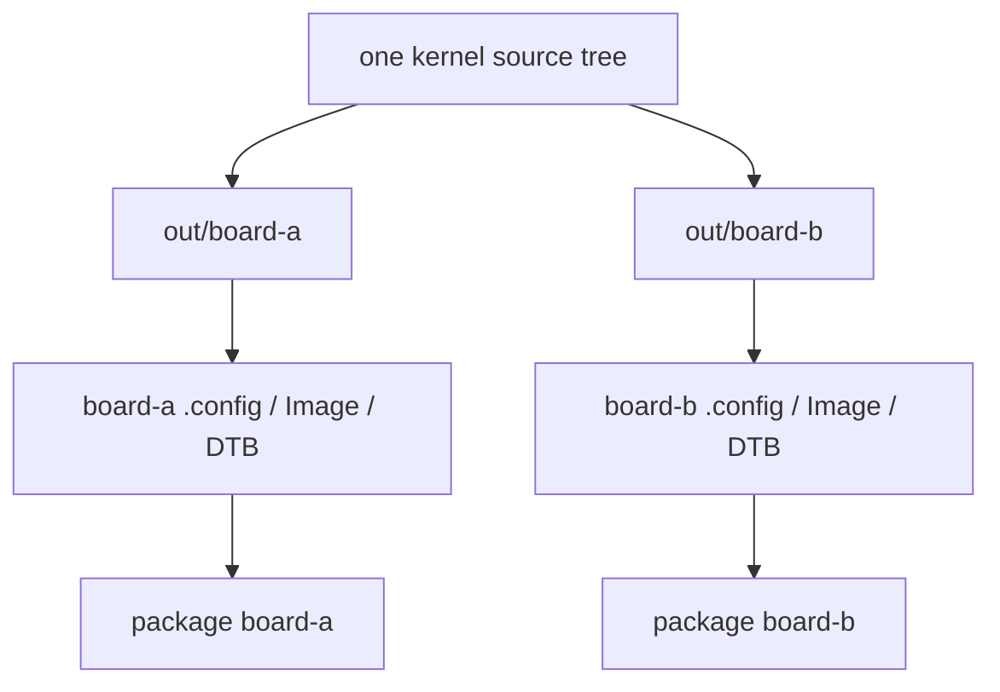
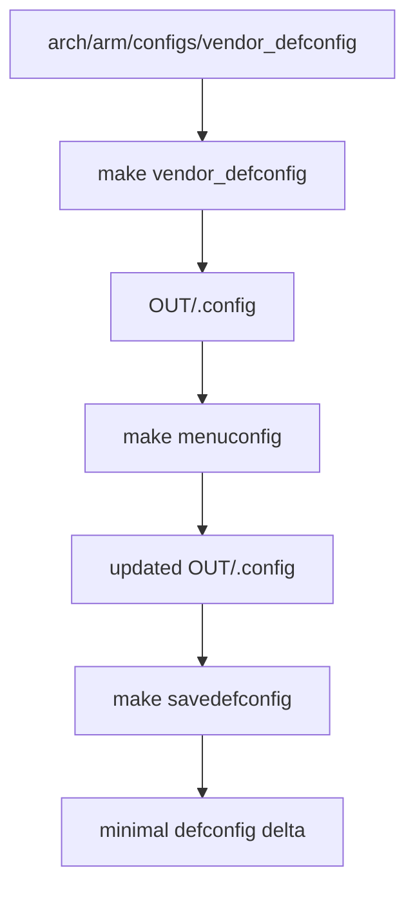
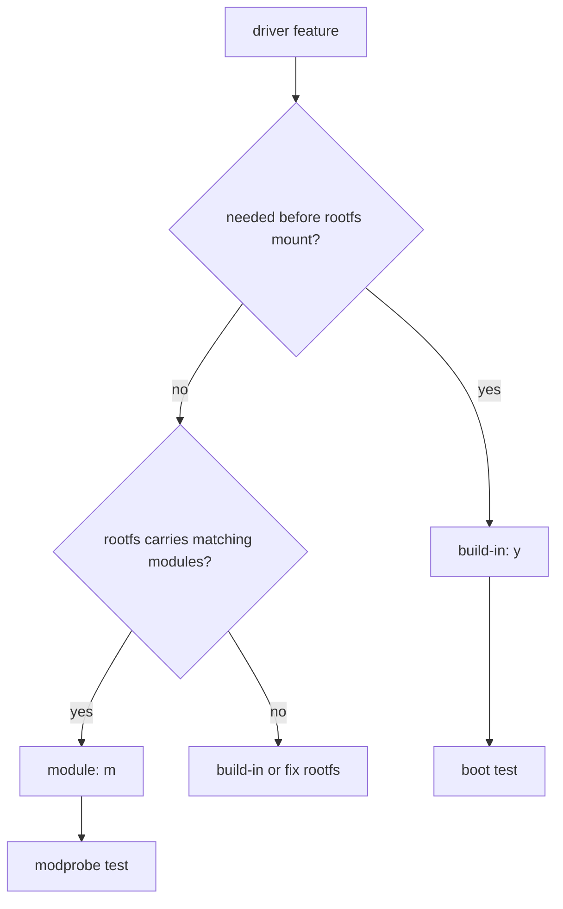
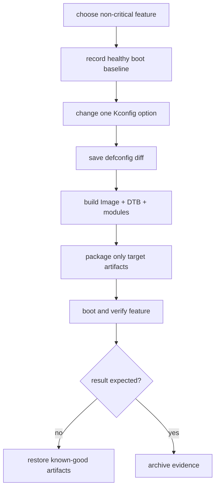

内核编译最常见的误区，是把“终端里出现了 `Image`”当成完成。BSP 场景里至少存在四个相互独立的问题：你改的是不是 SDK 实际使用的内核源码；构建用的是不是目标架构的工具链；生成的 Image、DTB 和 modules 是否被打包进去；板子启动的是否就是这一批产物。

如果这四项没有形成证据链，`make` 成功只证明某个目录可以被编译，不证明任何修改会在 RV1126 板上生效。

## 1. 明确目标并找到真实构建环境

### 1. 内核构建的真实对象

一套可维护的 BSP 内核交付物不是单个 Image，而是一组相互依赖的产物。



其中每一项都有不同的消费者：

| 产物 | 典型消费者 | 常见误判 |
|---|---|---|
| `.config` | Kbuild | 以为 `defconfig` 等于当前实际配置 |
| `Image` / `zImage` | U-Boot / boot image | 编译了但 bootloader 仍加载旧镜像 |
| `.dtb` | U-Boot / FIT / resource image | 改了 DTS 却没有进入最终 DTB |
| `.ko` | rootfs 的 modprobe | 模块留在 build 目录，没有安装到板端 |
| `System.map` | 调试与符号解析 | 没有与运行内核版本配对 |
| `Module.symvers` | 外部模块构建 | 与目标内核版本不一致 |

针对 Rockchip SDK，kernel、U-Boot、rootfs、打包脚本和 BoardConfig 往往位于同一仓库，但目录名称、分支和构建入口随 SDK 版本不同。先从 SDK 顶层构建脚本找到事实，不要假设 `kernel/` 一定是最终被使用的目录。

### 2. 第一步：从 SDK 找到实际构建链

进入 SDK 根目录后，先只做搜索和查看：

```bash
pwd
find . -maxdepth 3 -type f \( -name 'build.sh' -o -name 'BoardConfig*.mk' -o -name 'Makefile' \) | sort
grep -RInE 'RK_KERNEL_DTS|KERNEL_DEFCONFIG|KERNEL_CONFIG|kernel.*make' \
    device build build.sh 2>/dev/null | head -240
grep -RInE 'CROSS_COMPILE|toolchain|gcc' build device build.sh 2>/dev/null | head -240
```

目标是写出一张本工程的构建地图：



记录模板：

```text
sdk_root:
board_config:
kernel_source:
kernel_branch_or_commit:
kernel_defconfig:
kernel_dts:
arch:
cross_compile:
out_directory:
packaging_script:
boot_artifact:
dtb_artifact:
rootfs_module_path:
```

`BoardConfig` 中的变量、顶层 `build.sh` 的默认值和命令行覆盖项可能相互覆盖。遇到冲突时，优先以构建日志中最终执行的命令和生成路径为准，而不是只看一个配置文件。

### 3. 交叉工具链：先验证目标，而不是先开始编译

RV1126 使用 32 位 ARM Cortex-A7。SDK 中可能使用 GNU 工具链、buildroot 生成工具链或厂商预置工具链。不要把主机 `/usr/bin/gcc` 误当成交叉编译器，也不要混用不同 glibc、musl 或 ABI 版本的工具链。

```mermaid
flowchart LR
    A[select toolchain prefix] --> B[${CROSS_COMPILE}gcc -v]
    B --> C[target triple and version]
    C --> D[compile kernel]
    D --> E[readelf / file artifact]
    E --> F[target boots matching ABI]
```

在 shell 中明确导出构建变量：

```bash
export KDIR="$PWD/kernel"
export OUT="$PWD/out/kernel-rv1126"
export ARCH=arm
export CROSS_COMPILE=arm-linux-gnueabihf-

${CROSS_COMPILE}gcc -v
${CROSS_COMPILE}gcc -dumpmachine
make -C "$KDIR" ARCH="$ARCH" O="$OUT" kernelversion
```

上例的前缀是形式示例，不是 RV1126 SDK 的固定值。`-dumpmachine` 输出用于确认工具链目标；`file` 和 `readelf -h` 可用于确认生成 ELF 或模块的架构。内核 Image 本身未必是 ELF，不能只依赖 `file Image` 判断。

```bash
file "$OUT/vmlinux"
${CROSS_COMPILE}readelf -h "$OUT/vmlinux" | grep -E 'Class|Machine|Data'
```

如果模块由外部工程构建，必须使用同一份已构建内核目录、同一 `.config`、同一 `Module.symvers` 和相同工具链。否则会出现 `invalid module format`、vermagic 不匹配或符号版本缺失。

### 4. 使用独立输出目录，保留源码树干净

Kbuild 支持用 `O=` 把生成物放到独立目录。这样可以并行维护不同板卡或不同配置，也能在失败后直接保留 `out` 目录作为证据。

```bash
export KDIR=/absolute/path/to/kernel
export OUT=/absolute/path/to/out/kernel-rv1126
export ARCH=arm
export CROSS_COMPILE=<actual-prefix>

make -C "$KDIR" O="$OUT" ARCH="$ARCH" CROSS_COMPILE="$CROSS_COMPILE" \
    <actual-defconfig>
make -C "$KDIR" O="$OUT" ARCH="$ARCH" CROSS_COMPILE="$CROSS_COMPILE" \
    -j"$(nproc)" Image modules dtbs
```

`O=` 目录首次使用时会生成 `include/config`、`.config`、`vmlinux`、`arch/.../boot` 等文件。后续命令必须持续携带相同的 `O=`，否则很容易在源码树和输出树之间混入两套配置。



清理时不要先执行 `make mrproper`。它会清除配置和生成文件，可能让当前唯一可复现配置消失。优先备份 `.config`、`defconfig` diff、构建日志和产物哈希，再清理特定 `OUT` 目录。

## 2. 管理配置、编译对象与产物

### 5. defconfig、`.config` 与 Kconfig 的分工

`defconfig` 是一个可复用的默认配置入口；`.config` 是一次实际构建真正使用的配置。Kconfig 会根据依赖、默认值和架构条件填充大量未显式写入 defconfig 的选项。



确认当前选择：

```bash
grep -E 'CONFIG_(ARCH|ARM|OF|MMC|EXT4_FS|DEVTMPFS)=' "$OUT/.config"
make -C "$KDIR" O="$OUT" ARCH="$ARCH" CROSS_COMPILE="$CROSS_COMPILE" menuconfig
make -C "$KDIR" O="$OUT" ARCH="$ARCH" CROSS_COMPILE="$CROSS_COMPILE" savedefconfig
```

`savedefconfig` 生成最小配置集，适合与版本库中的基线比较。但不要直接用它覆盖 SDK 正在使用的 defconfig；先 `diff -u`，理解每项变化是否属于本板需求。

```bash
diff -u "$KDIR/arch/arm/configs/<actual-defconfig>" "$OUT/defconfig" | less
grep -nE 'CONFIG_(MMC|EXT4_FS|I2C|VIDEO|SOUND|WATCHDOG)' "$OUT/.config"
```


### 5.1 三类常见配置误区

| 误区 | 实际问题 | 正确检查 |
|---|---|---|
| 只编辑 defconfig，不重新生成 `.config` | 输出树仍使用旧配置 | 检查 `OUT/.config` 时间和内容 |
| 在 menuconfig 中改完不保存差异 | 修改无法复现 | `savedefconfig`、提交 diff |
| 只看选项是否为 `y` | 忽略 depends on / selects | 查 Kconfig 和 `menuconfig` 帮助 |
| 复制其他 SoC 的配置 | 依赖和 driver model 不同 | 以当前驱动/binding 为依据 |
| 为了“保险”全选 | 镜像膨胀、启动慢、攻击面增加 | 按硬件和产品需求裁剪 |

### 6. 内建还是模块：从启动时刻倒推

一个功能选为 `y` 还是 `m` 不是习惯问题，而是它在什么时候被需要的问题。内核挂载 rootfs 之前无法从 rootfs 加载模块，因此启动介质控制器、根文件系统驱动和必要的 block layer 通常必须内建，除非它们已经由 initramfs 预加载。



典型的启动依赖链：

```text
bootloader loads kernel
  -> kernel initializes storage controller
  -> kernel discovers block device and partition
  -> kernel recognizes root filesystem
  -> VFS mounts root=
  -> /sbin/init starts
  -> userspace can load optional modules
```

因此当日志停在 `VFS: Unable to mount root fs` 时，先检查 root 参数、存储 controller、block driver、分区支持和 filesystem 是否内建，而不是先把摄像头或网卡驱动全部改成 `y`。

```bash
grep -E 'CONFIG_(MMC|MMC_BLOCK|EXT4_FS|SQUASHFS|UBIFS|MTD|DEVTMPFS)=' "$OUT/.config"
```

### 7. DTS、DTB 与 Kbuild 目标

内核 `dtbs` 目标会编译 Kbuild 列出的设备树源。一个 `.dts` 文件存在，不代表它一定会生成 DTB；一个 DTB 生成，也不代表 SDK 打包脚本一定会使用它。


先找 Kbuild 目标和 SDK 选择变量：

```bash
grep -RIn '<board-name>\.dtb\|dtb-' "$KDIR/arch/arm/boot/dts" 2>/dev/null
grep -RInE 'RK_KERNEL_DTS|KERNEL_DTS|\.dtb' device build build.sh 2>/dev/null | head -200
find "$OUT/arch" -name '*.dtb' -type f | sort | head -120
```

构建后反编译最终候选 DTB，检查一个明确的板级字段：

```bash
dtc -I dtb -O dts -o /tmp/board-expanded.dts \
    "$OUT/arch/arm/boot/dts/<actual-board>.dtb"
grep -nE 'model|compatible|bsp-build-id' /tmp/board-expanded.dts | head -40
```

DTB 路径因内核版本而异。先 `find "$OUT" -name '*.dtb'`，再从实际输出中取路径，不能把示例路径复制进自动化脚本。

### 8. modules 的构建、安装与版本匹配

`make modules` 只生成 `.ko`，不会把它们自动放进目标 rootfs。必须使用 `modules_install` 或 SDK 已有 rootfs 打包流程，并验证 `uname -r` 对应目录存在。

```bash
export ROOTFS_STAGING=/absolute/path/to/rootfs-staging

make -C "$KDIR" O="$OUT" ARCH="$ARCH" CROSS_COMPILE="$CROSS_COMPILE" modules
make -C "$KDIR" O="$OUT" ARCH="$ARCH" CROSS_COMPILE="$CROSS_COMPILE" \
    INSTALL_MOD_PATH="$ROOTFS_STAGING" modules_install

find "$ROOTFS_STAGING/lib/modules" -maxdepth 2 -type d | sort
```

模块版本目录由 `KERNELRELEASE` 决定。它通常包含内核版本、`LOCALVERSION`、Git 描述或 SDK 补丁标识。不要手工把 `.ko` 拷贝到另一个版本目录中“试试看”。

目标机检查：

```bash
uname -r
find /lib/modules/"$(uname -r)" -type f -name '*.ko*' | head -80
modinfo <module-name> 2>/dev/null
modprobe <module-name>
dmesg | tail -120
```

出现 `invalid module format` 时，先对比 `uname -r`、`modinfo vermagic`、构建目录的 `include/config/kernel.release` 和目标机模块路径。

### 9. 镜像身份：不要靠时间戳猜测

内核源代码、构建目录、打包目录和板端存储都可能同时保存多份 Image/DTB。最可靠的方式是为每次候选产物建立可读身份和哈希，再从板端日志/设备树确认。

```bash
make -C "$KDIR" O="$OUT" ARCH="$ARCH" CROSS_COMPILE="$CROSS_COMPILE" kernelrelease
sha256sum \
    "$OUT/arch/arm/boot/Image" \
    "$OUT/arch/arm/boot/dts/<actual-board>.dtb" \
    | tee "$OUT/artifact.sha256"
strings "$OUT/vmlinux" | grep -m1 'Linux version'
```

运行后采集：

```bash
uname -a
cat /proc/version
cat /proc/cmdline
tr -d '\0' < /proc/device-tree/model 2>/dev/null; echo
zcat /proc/config.gz 2>/dev/null | head -20
```

`/proc/config.gz` 只在启用相关 IKCONFIG 选项时存在。没有它时，使用 build-id、内核 release、DTB 标记和部署日志交叉确认，不要把“文件修改时间接近”当作部署证据。

## 3. 做一次最小且可回退的配置实验

### 10. 一次最小且可回退的配置实验

建议第一个内核实验选择一个非启动关键、可独立验证的功能，例如已连接但默认未启用的 GPIO LED、一个可加载的测试模块或某个 debugfs 选项。不要把第一次 Kconfig 实验放在 MMC、rootfs、DDR 或 console 上。



推荐记录：

```text
baseline_commit:
changed_config_symbol:
why_y_or_m:
defconfig_diff:
build_command:
kernelrelease:
image_sha256:
dtb_sha256:
modules_path:
target_uname:
target_dmesg_evidence:
rollback_artifact:
```

把回退镜像放在独立、已验证的介质或网络服务器。不要等系统无法启动时才去找“上一次可能能用的 Image”。

## 4. 按证据分层处理构建失败

### 11. 构建失败的分层排查

| 症状 | 首先检查 | 典型方向 |
|---|---|---|
| host 编译器报 ARM 汇编错误 | `${CROSS_COMPILE}gcc -dumpmachine` | 工具链前缀未生效 |
| `No rule to make target defconfig` | `arch/arm/configs` 和 SDK 变量 | defconfig 名称/ARCH 错误 |
| `dtbs` 没有目标板 DTB | DTS Makefile、DTS 名称 | Kbuild 未列出或选错 arch |
| 生成 Image 但板端仍旧行为 | 打包脚本、U-Boot 加载路径 | 旧产物仍被使用 |
| rootfs 后 `modprobe` 失败 | `uname -r`、vermagic、模块路径 | modules 没安装或版本不匹配 |
| 根文件系统挂载失败 | `root=`、storage/fs 是否 `y` | 关键驱动被编成模块 |
| 修改 DTS 无效果 | 最终 DTB 反编译、build-id | DTB 没被打包/传递 |

### 12. 构建日志要保留什么

构建过程本身是事实来源。每次有意义的版本都应保留下列输出：

```bash
set -o pipefail
make -C "$KDIR" O="$OUT" ARCH="$ARCH" CROSS_COMPILE="$CROSS_COMPILE" \
    -j"$(nproc)" Image modules dtbs 2>&1 | tee "$OUT/build-$(date +%F-%H%M%S).log"

git -C "$KDIR" rev-parse HEAD | tee "$OUT/kernel-git-revision.txt"
git -C "$KDIR" status --short | tee "$OUT/kernel-git-status.txt"
cp "$OUT/.config" "$OUT/config-archive-$(date +%F-%H%M%S)"
```

如果 SDK 的顶层脚本负责构建，也要保存它实际调用的子命令、环境变量和产物路径。只保留“build success”一行，不足以复现失败或解释版本差异。

## 5. 完成板级练习与验收

### 13. RV1126 平台的内核构建检查清单

| 检查项 | 通过标准 |
|---|---|
| SDK 构建入口 | 已知顶层脚本与 BoardConfig |
| 内核源码 | 已记录绝对路径、分支和提交 |
| 目标架构 | `ARCH=arm` 与工具链目标一致 |
| 工具链 | `-dumpmachine`、版本和 SDK 预期一致 |
| 输出树 | 所有命令使用同一 `O=` 目录 |
| defconfig | 可追踪到 SDK 变量和 `.config` |
| 根文件系统依赖 | 存储和 fs 驱动的内建/模块决策有依据 |
| DTB | 已确认 Kbuild 生成路径和最终打包输入 |
| modules | 已安装到匹配 `uname -r` 的 rootfs 目录 |
| 产物身份 | Image、DTB 哈希和 build-id 已归档 |
| 回退 | 有已验证的健康启动路径 |

### 14. 练习：完成一次可证明的内核配置迭代

在当前 SDK 上选择一个不会影响启动的驱动或调试选项，完成以下动作：

1. 从 BoardConfig 和 build 日志确定实际 kernel source、defconfig、DTS、工具链；
2. 创建独立 `O=` 输出目录，生成基线 `.config`；
3. 保存健康镜像、DTB、模块目录与启动日志；
4. 修改一个 Kconfig 选项，说明为何选 `y`、`m` 或不启用；
5. 生成 `savedefconfig`，审查 diff；
6. 构建 Image、DTB 与 modules，并保存构建日志；
7. 为 DTB 增加一个临时 build-id，验证最终 DTB 含有该标记；
8. 通过 SDK 正常打包、部署和启动；
9. 在板端采集 `uname -a`、`/proc/cmdline`、目标功能日志；
10. 还原健康产物并确认可以回退。

### 15. 本文里程碑

完成本文后，应能够做到：

- 从 SDK 配置和构建日志找到真正参与构建的 kernel、defconfig、DTS 和工具链；
- 用独立输出目录避免不同板卡/配置互相污染；
- 区分 defconfig、`.config`、Image、DTB、modules 和 rootfs 各自的职责；
- 根据启动依赖决定驱动应内建还是模块化；
- 从 Kbuild 到最终打包 DTB 追踪设备树产物；
- 用 `uname -r`、vermagic、哈希和 build-id 验证板端运行版本；
- 为每次内核改动留下可复现命令、差异、日志和回退路径。

> 🏷️ Linux BSP、RV1126、Linux Kernel、Kbuild、Kconfig、defconfig、DTB、modules、交叉编译、内核部署
