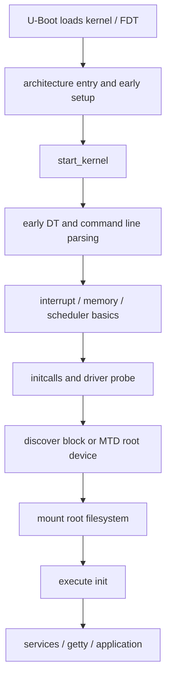
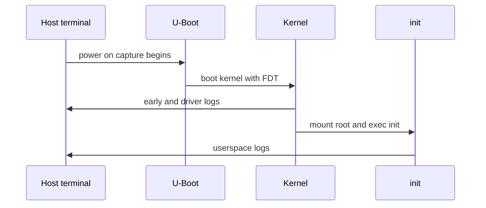
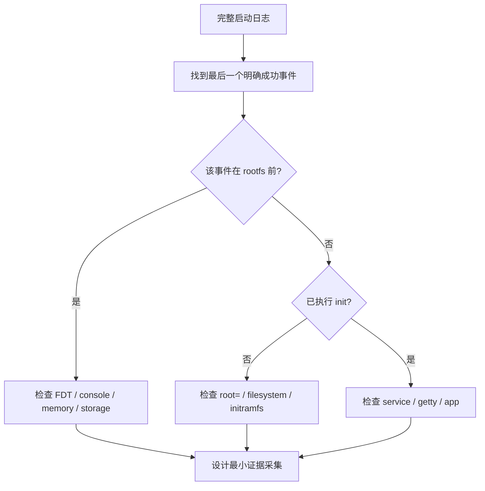
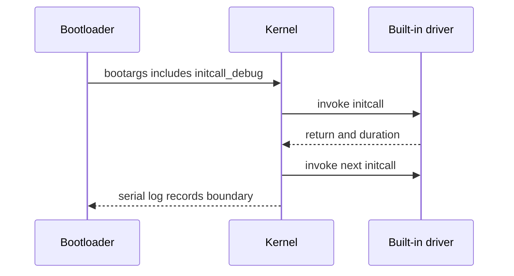
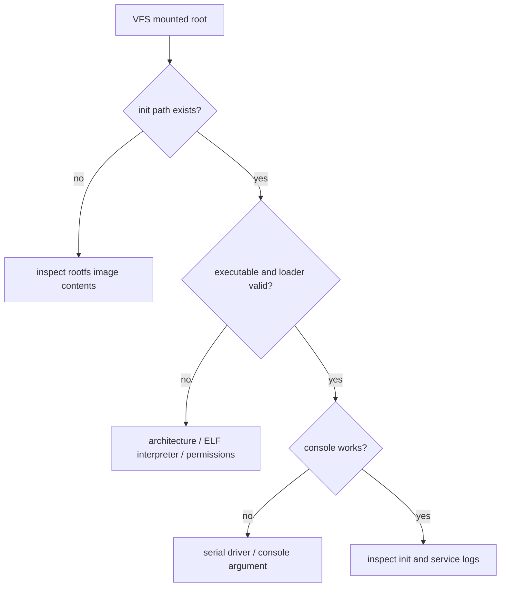
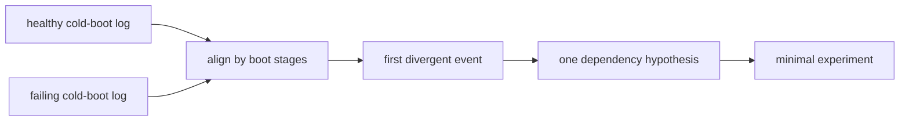

启动日志不是一段需要搜索最后一个 `error` 的文本，而是一条因果时间线。真正有价值的问题不是“最后一行报了什么”，而是“最后一个已经被证明完成的阶段是什么，下一阶段还缺少哪一个条件”。

对于 RV1126 + IMX415 这类平台，启动异常往往同时涉及 U-Boot、DTB、console、存储、rootfs、clock、regulator 和用户空间。没有阶段划分时，人会在 kernel、DTS 和根文件系统之间来回修改；有了阶段划分，能把排查收敛为一次只验证一类依赖。

## 1. 画出启动时间线并建立目标

### 1. 从 U-Boot 到用户空间的启动时间线



这个图不是精确函数调用图。不同内核版本、ARM 启动代码和厂商补丁会改变函数细节，但责任边界稳定：引导程序负责把 kernel、FDT 和参数交给内核；内核早期阶段建立内存、中断和 console；initcall 阶段注册驱动；VFS 挂载根文件系统；最后执行 init。

| 阶段 | 典型日志线索 | 优先依赖 |
|---|---|---|
| U-Boot 交接 | `Starting kernel ...` 或 boot 命令输出 | Image/FDT 地址、镜像格式 |
| early kernel | 解压、earlycon、CPU/内存信息 | console、DTB、入口参数 |
| core init | `Kernel command line`、`initcall` | bootargs、内存、中断 |
| driver probe | MMC、I2C、clock、regulator 日志 | DTS、Kconfig、硬件资源 |
| VFS | root device、挂载信息 | `root=`、存储/文件系统驱动 |
| init | `Run /sbin/init`、systemd/busybox | rootfs 内容、动态库、console |

### 2. 先获得可比较的原始日志

串口日志必须是原始、完整、可标记时间的文本。手机拍屏和只复制最后二十行，都无法支持后续的阶段对比。



主机侧采集示例：

```bash
# 根据实际串口、电平和波特率调整
picocom -b 1500000 /dev/ttyUSB0 | tee boot-$(date +%F-%H%M%S).log
```

如果冷启动日志含乱码、断字、重叠或末尾缺失，先解决物理串口问题。确认项目包括 TX/RX 是否交叉、GND、3.3 V/1.8 V 电平、终端流控、波特率和 USB 转串口稳定性。带噪声的日志不能作为内核功能结论。

健康系统启动后，额外保存：

```bash
uname -a
cat /proc/version
cat /proc/cmdline
dmesg > /tmp/dmesg-monotonic.txt
dmesg -T > /tmp/dmesg-wall-time.txt
cat /proc/partitions
mount
```

`dmesg -T` 使用当前系统时间换算，并不等于上电真实时间；定位启动顺序时优先看单调递增时间戳，比较不同启动时重点看相对顺序和耗时。

### 3. 先找到最后一个可信阶段



示例不是固定文字匹配，而是判断类型：

```text
Starting kernel ...
Kernel command line: ...
mmc0: new high speed MMC card ...
EXT4-fs ... mounted filesystem ...
Run /sbin/init as init process
```

若最后一个可信事件是 MMC 卡识别，而后面没有分区或 VFS 日志，优先检查 block/partition/file system 配置和 `root=`。若已经出现 `Run /sbin/init`，继续修改 MMC controller 通常没有意义，应转向 rootfs 的 init、动态链接器、服务和 console。

## 2. 从控制台走到 rootfs 与 init

### 4. early console、normal console 与 getty

同一根串口线在不同阶段可能由不同机制驱动：U-Boot console、kernel earlycon、正常 serial driver console、用户态 getty。能看到前两行不等于后续一定可用。


检查运行时证据：

```bash
cat /proc/cmdline
dmesg | grep -Ei 'console|earlycon|ttyS|serial'
cat /proc/consoles
cat /proc/tty/driver/serial 2>/dev/null
ls -l /dev/ttyS* /dev/ttyAMA* 2>/dev/null
```

`console=` 的设备名和波特率必须从当前 board DTS、U-Boot 环境和健康日志确认。本文不假设 RV1126 固定使用某个 ttyS 编号。earlycon 的参数更依赖 SoC UART 地址与内核版本，未经当前 SDK 验证时不要复制其他平台的 `earlycon=` 字符串。

### 5. `bootargs` 的三方来源

kernel command line 可能来自 U-Boot 环境、DTB `/chosen/bootargs`、FIT/boot image 配置或内核内置命令行。看到 `/proc/cmdline` 后仍要追踪它最终来自哪里。

```mermaid
flowchart TD
    A[U-Boot environment] --> D[effective command line]
    B[DTB /chosen/bootargs] --> D
    C[FIT / boot image / CONFIG_CMDLINE] --> D
    D --> E[/proc/cmdline]
    E --> F[early kernel and init]
```

U-Boot 侧：

```text
=> env print bootargs bootcmd
=> fdt addr
=> fdt print /chosen
```

Linux 侧：

```bash
cat /proc/cmdline
tr -d '\0' < /proc/device-tree/chosen/bootargs 2>/dev/null; echo
```

两处不一致时不要马上覆盖某一项。先阅读当前 boot script、FIT 配置和 U-Boot boot 命令，确认哪一步拼接或覆盖了参数。对于 built-in driver，模块参数和早期参数也需要在 command line 中提供；运行后再 `modprobe` 不会影响已经内建并执行的初始化路径。

### 6. 使用 `initcall_debug` 观察初始化边界

`initcall_debug` 是内核参数，用于输出 initcall 的执行记录和耗时。它适合定位内核在启动过程中卡在哪个初始化函数附近，不是常态生产参数。



在 U-Boot 中做一次性实验：

```text
=> env print bootargs
=> env set bootargs "${bootargs} initcall_debug loglevel=7"
=> <run the existing boot path without env save>
```

`initcall_debug` 会增加大量日志并改变时序。只在可重复的问题上使用，并限制实验次数。日志中耗时较长的 initcall 不是自动等于根因：它可能在等待一个未就绪的 provider、总线超时、存储重试或真实硬件延迟。

当日志显示类似 `deferred probe pending`，它说明 consumer 等待某个 provider；优先检查 clock、regulator、pinctrl、IOMMU、GPIO controller 或相关 Kconfig，而不是给 consumer 驱动添加固定 sleep。

### 7. 根文件系统：从 `root=` 到 VFS

根文件系统启动链路中任何一步缺失，都会让用户空间无法出现。不要只盯着 `root=/dev/mmcblk0p2` 这一段参数。

```mermaid
flowchart TD
    A[root= argument] --> B[storage controller driver]
    B --> C[block device discovery]
    C --> D[partition parser]
    D --> E[filesystem driver]
    E --> F[VFS mount root]
    F --> G[/sbin/init or init=]
```

必须逐项证实：

```text
Kernel command line contains expected root=
storage controller driver probes
block device appears
target partition is discovered
filesystem type is available
VFS mounts root
kernel executes init
```

内核配置检查示例：

```bash
grep -E 'CONFIG_(MMC|MMC_BLOCK|MTD|EXT4_FS|SQUASHFS|UBIFS|DEVTMPFS)=' \
    /path/to/out/.config
```

对直接位于 rootfs 的存储 controller 和 filesystem，通常必须内建为 `y`；模块在 VFS 挂载 rootfs 后才有常规加载路径。例外是使用 initramfs 预先携带模块的体系，但这需要明确验证，不应假设。

### 8. init 失败与“能挂载 rootfs”是两回事

出现 “No working init found” 或类似信息时，内核可能已经挂载了某个 rootfs。问题可能是 `/sbin/init` 不存在、不可执行、动态链接器缺失、console 不可用，或 `init=` 指向错误路径。



在已能进入 shell 的健康系统中建立基线：

```bash
ls -l /sbin/init /init 2>/dev/null
readlink -f /sbin/init 2>/dev/null
file /sbin/init 2>/dev/null
cat /proc/1/cmdline | tr '\0' ' '; echo
```

在主机侧挂载或解包 rootfs 后，也应检查 `/sbin/init`、动态链接器和关键库是否存在。不要在无法启动的板子上通过“把 `init=/bin/sh` 留在量产 bootargs”来回避真正的 rootfs 集成问题；它只适合作为短暂诊断手段。

### 9. 启动日志中的存储、驱动和媒体线索

对于带 IMX415 的板卡，摄像头相关日志通常发生在 rootfs 挂载之后或并行 initcall 阶段。摄像头 probe 失败不应被误判为“系统起不来”；反过来，系统无法进入 init 时也不应先查 V4L2。

```bash
dmesg | grep -Ei 'mmc|mtd|ubi|vfs|ext4|squashfs|ubifs'
dmesg | grep -Ei 'imx415|csi|mipi|isp|v4l2|media'
dmesg | grep -Ei 'defer|timeout|failed|error'
```

把日志分组后再判断：

| 日志组 | 说明 | 优先动作 |
|---|---|---|
| `mmc`、`blk`、`VFS` | 根文件系统路径 | 追踪 storage -> partition -> fs |
| `clk`、`regulator`、`pinctrl` | 外设资源 | 检查 provider 与 DTS phandle |
| `imx415`、`i2c`、`media` | 摄像头链路 | 系统已启动后再处理媒体图 |
| `systemd`、`getty`、应用 | 用户空间 | 检查 rootfs 服务与 console |

## 3. 用健康基线完成一次可回退实验

### 10. 用健康基线做差异，而不是背日志

任何稳定的开发板都应保存至少一份“已知健康”的冷启动日志。失败日志和健康日志按阶段对齐后，首个偏离点通常比最后 panic 更接近根因。



主机侧可以先做粗略归一化，去掉绝对时间后比较：

```bash
sed -E 's/^\[[[:space:]]*[0-9.]+\][[:space:]]*//' healthy.log > healthy.normalized
sed -E 's/^\[[[:space:]]*[0-9.]+\][[:space:]]*//' failed.log > failed.normalized
diff -u healthy.normalized failed.normalized | less
```

这不替代对启动阶段的理解。驱动并发和时间戳会造成行序变化，因此要把差异当作线索，而不是机械判定。

### 11. 一次可回退的启动诊断实验

实验目标：确认某次 kernel 停在 initcall、VFS 还是 init 阶段，不改变持久环境。

### 11.1 准备

```text
记录健康 bootargs
记录健康 Image / DTB 哈希
准备网络启动或健康存储镜像回退路径
开始原始串口日志采集
```

### 11.2 U-Boot 侧增加一次性参数

```text
=> env print bootargs
=> env set bootargs "${bootargs} initcall_debug loglevel=7"
=> <use the normal boot command>
```

不要执行 `env save`。如果启动失败或日志过多，断电即可回到此前持久环境；若板级补丁有特殊环境行为，以实际环境后端说明为准。

### 11.3 记录结论

```text
last_known_good_stage:
first_missing_stage:
last_successful_log_line:
first_suspicious_log_line:
bootargs_used:
dtb_build_id:
storage_evidence:
next_dependency_to_check:
rollback_result:
```

## 4. 用故障矩阵定位启动断点

### 12. 常见启动问题矩阵

| 现象 | 最早有效证据 | 高概率方向 | 不应先做的事 |
|---|---|---|---|
| `Starting kernel` 后完全静默 | U-Boot 地址、DTB、console | 镜像格式/入口/早期 console | 先改 rootfs |
| 有 early log 后停止 | 最后 early init | DTB、内存、IRQ、clock | 盲目重编所有模块 |
| 不断等 root device | `root=`、MMC/MTD 日志 | storage、partition、fs 配置 | 先查应用 |
| VFS 已挂载但无登录 | `Run init`、PID 1 线索 | init 路径、rootfs、console | 先改 DTS |
| 长时间 deferred probe | pending provider | regulator/clock/pinctrl/GPIO | 增加固定延时 |
| 系统起来但无摄像头 | `media`/`i2c` 日志 | media graph、sensor 资源 | 把问题归为 rootfs |

### 13. RV1126 启动审计清单

| 检查项 | 通过标准 |
|---|---|
| U-Boot 交接 | kernel、FDT、bootargs 来源明确 |
| 早期 console | 串口名、波特率和输出连续 |
| command line | `/proc/cmdline` 与预期一致 |
| DTB 身份 | `/proc/device-tree` 可证明最终板级 DTB |
| 存储 | 控制器、块设备、分区出现顺序合理 |
| rootfs | `root=`、文件系统和挂载证据一致 |
| init | `/sbin/init`、PID 1、console 证据存在 |
| 时间线 | 已保存健康冷启动日志 |
| 回退 | 可启动健康镜像或网络启动路径已验证 |

## 5. 练习、证据包与验收

### 14. 练习：完成一次启动日志分层诊断

选择一段健康启动日志和一段失败启动日志，完成以下工作：

1. 为两段日志标注 U-Boot、early kernel、driver probe、VFS、init、用户空间的边界；
2. 找到失败日志最后一个可信完成事件；
3. 写出下一阶段需要的最小依赖，而不是列出所有可能原因；
4. 使用一次性 `initcall_debug` 或更高 `loglevel` 收集补充证据；
5. 对照 `.config`、最终 DTB 和 `bootargs` 验证一个假设；
6. 使用健康镜像或断电回退，确认实验没有改变持久状态；
7. 把首个偏离点、证据和下一步方向写入调试记录。

### 15. 启动证据包：一次采集覆盖五个阶段

每次出现不可复现的启动异常时，不要只保存 dmesg 末尾。下面的证据包可把 U-Boot、kernel、存储、rootfs 和用户空间状态放到同一目录中：

```bash
mkdir -p /tmp/boot-evidence
cat /proc/cmdline > /tmp/boot-evidence/cmdline.txt
uname -a > /tmp/boot-evidence/uname.txt
dmesg > /tmp/boot-evidence/dmesg.txt
cat /proc/partitions > /tmp/boot-evidence/partitions.txt
mount > /tmp/boot-evidence/mount.txt
tr -d '\0' < /proc/device-tree/model > /tmp/boot-evidence/model.txt 2>/dev/null || true
```

配合同一次串口冷启动日志、U-Boot `env print bootargs bootcmd`、最终 Image/DTB 哈希和所用 SDK 提交，另一位工程师才能复核“问题发生在哪一阶段”。若根文件系统尚未挂载，则在主机侧保存 U-Boot 日志和构建/打包记录，不要因为板端命令无法执行而遗漏前半段证据。

### 16. 本文里程碑

完成本文后，应能够做到：

- 按阶段而不是按最后一条报错解读启动日志；
- 区分 U-Boot console、earlycon、普通 serial console 与 getty；
- 追踪实际 kernel command line 的来源；
- 使用 `initcall_debug` 获取初始化边界而不把它当成生产配置；
- 从 `root=` 到 `/sbin/init` 分解根文件系统启动依赖；
- 用健康冷启动基线定位首个偏离点；
- 在不保存环境变量的前提下完成一次可回退的启动诊断实验。

> 🏷️ Linux BSP、RV1126、Linux 启动、启动日志、initcall_debug、rootfs、VFS、console、设备树、内核调试
