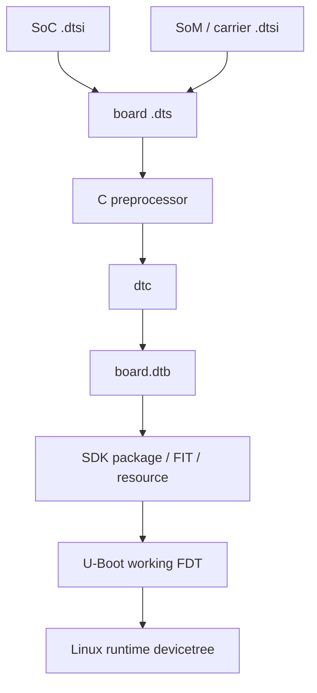
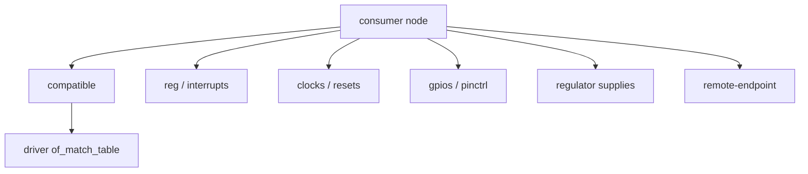
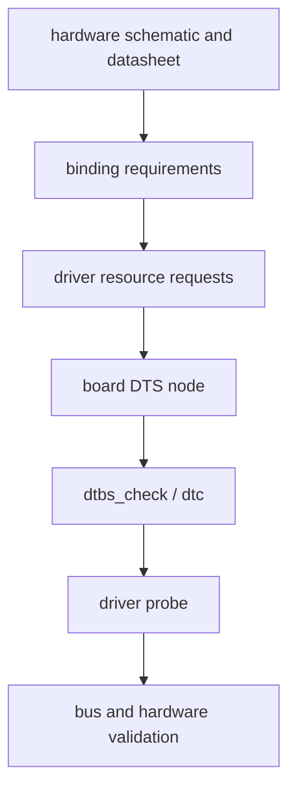
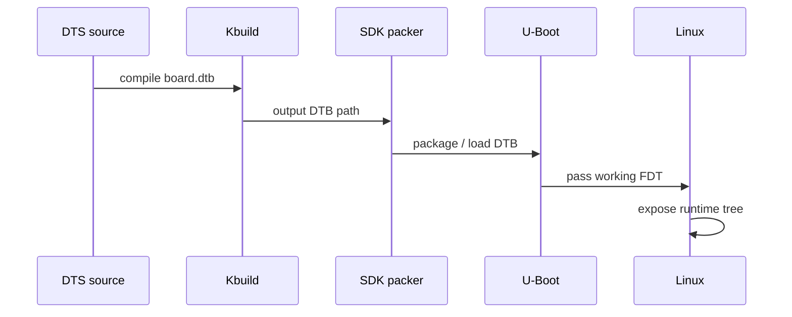
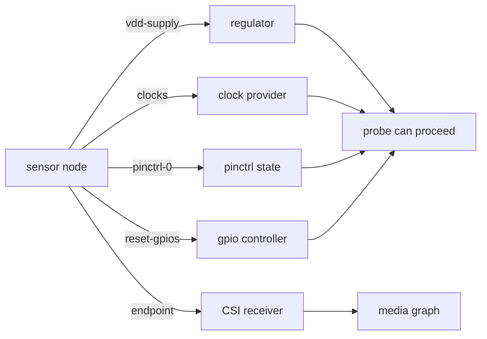
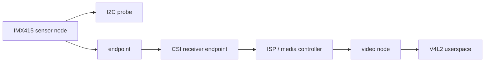

设备树不是寄存器初始化脚本，也不是“让驱动生效的开关集合”。它的职责是描述硬件拓扑、地址、连接关系和资源，让 Linux 能在运行时创建对应设备并匹配已有驱动。驱动如何初始化寄存器、如何处理错误、如何向 V4L2 或 IIO 等子系统注册接口，仍然属于内核代码。

一份能编译的 DTS 不能证明板级配置正确。BSP 中真正要证明的是：修改进入了正确的 DTS include 链；Kbuild 生成了目标 DTB；SDK 打包使用了这个 DTB；U-Boot 把它作为 working FDT 传给 Linux；Linux 运行时看到的节点和属性与源码预期一致。

## 1. 先理解 DTS、DTB 与运行时设备树

### 1. DTS、DTSI 与 DTB 的层级



| 文件层级 | 典型职责 | 不应放入的内容 |
|---|---|---|
| SoC `.dtsi` | CPU、CRU、GPIO、I2C/SPI/UART 控制器基址与中断 | 具体板卡的传感器地址、LED、供电拓扑 |
| SoM `.dtsi` | 模组内 DDR、PMIC、固定连接 | 载板独有接口与跳线 |
| board `.dts` | 真实外设、pinctrl、regulator、endpoint、状态覆盖 | 复制整份 SoC 控制器定义 |
| binding | 属性语义、类型、约束、兼容字符串 | 具体产品的临时调试数据 |
| DTB | bootloader 交接的二进制对象 | 人工维护的源文件 |

优先使用 `&label { ... };` 覆盖已有节点，而不是重新写一份控制器节点。复制会让地址、中断、clock cell 等 SoC 共性配置在 SDK 升级时脱离上游，且很难看出哪一项是板级差异。

```dts
&i2c3 {
    status = "okay";
};

&uart2 {
    status = "okay";
};
```

上例只表达覆盖模式；控制器 label、实际 pinctrl 和状态必须来自当前 RV1126 内核树。

### 2. 设备树在 Linux 启动中的角色

Linux 使用 DT 进行平台识别、运行时配置和设备创建。早期阶段会读取 `/chosen`、`/memory` 等信息，后续再把节点转换为内核运行时表示并创建 platform、I2C、SPI、MDIO 等总线上的设备。

```mermaid
flowchart LR
    A[bootloader passes FDT] --> B[early DT scan]
    B --> C[/chosen /memory parsing]
    C --> D[unflatten device tree]
    D --> E[populate bus devices]
    E --> F[compatible matching]
    F --> G[driver probe]
```

这解释了为什么不同类型节点的父节点很重要：

| 节点位置 | Linux 常见对象 | 示例 |
|---|---|---|
| 根或 `simple-bus` 下 | platform device | memory-mapped 控制器、系统设备 |
| I2C controller 子节点 | `i2c_client` | PMIC、sensor、EEPROM |
| SPI controller 子节点 | `spi_device` | Flash、ADC、触摸控制器 |
| MDIO 子节点 | PHY 设备 | 以太网 PHY |
| media graph endpoint | 图连接关系 | sensor、CSI、ISP 端点 |

把 I2C sensor 写到根节点下，即使 DTS 语法正确，也不会形成期望的 `i2c_client`；把 `compatible` 写在一个信息节点上，也不等于内核应该创建可绑定设备。

## 2. 写节点、属性与 binding 契约

### 3. 节点、属性、phandle 与 `compatible`

一个节点的可读性来自四类信息：它属于哪个总线、它是什么、它在哪里、它依赖什么。



结构示例：

```dts
&i2c3 {
    status = "okay";

    sensor@1a {
        compatible = "vendor,imx415";
        reg = <0x1a>;
        status = "okay";
        clocks = <&cru SOME_CAMERA_CLOCK>;
        clock-names = "xvclk";
        reset-gpios = <&gpio2 7 GPIO_ACTIVE_LOW>;
        vdd-supply = <&vcc_camera>;
    };
};
```

这里的 `compatible`、I2C 地址、CRU 时钟 ID、GPIO 线号和 regulator 名称都是结构占位符。真实 IMX415 节点必须同时符合 sensor driver 的 match table、binding、原理图、上电时序和当前 SDK 的媒体架构。


### 3.1 `compatible` 是匹配契约

```bash
grep -RInE 'imx415|of_device_id|of_match_table' \
    drivers/media drivers/i2c Documentation/devicetree/bindings 2>/dev/null | head -200
```

`compatible` 通常是字符串列表，按从具体到通用的顺序表达兼容性。它不是展示名称，必须与 driver 的 `of_match_table` 或 binding 所规定的值匹配。节点名如 `sensor@1a` 可读性较好，但并不参与正常 OF 匹配。


### 3.2 `reg` 的含义随父总线变化

| 父节点 | `reg` 常见含义 | 需要核对 |
|---|---|---|
| I2C bus | 7-bit 从设备地址 | 地址、读写位、地址冲突 |
| SPI bus | chip-select 编号 | CS 线、极性、控制器能力 |
| platform bus | MMIO 地址与长度 | address/size cells、硬件手册 |
| GPIO expander | I2C/SPI 地址或子资源 | binding 的 cell 格式 |

不要把 I2C 的 `reg = <0x1a>` 理解为寄存器基址，也不要把 SPI `reg = <0>` 理解为设备地址。

### 4. binding 是设备树的接口合同

binding 定义属性名、数据类型、必选项、phandle 引用和限制。写 DTS 前先读 binding 与当前 driver，再查看相似的已工作板卡节点。反过来从网上复制一段 DTS，再让它“能过 dtc”并不是正确流程。



查找资料的命令：

```bash
find Documentation/devicetree/bindings -type f | grep -Ei 'i2c|media|camera|clock|regulator'
grep -RIn 'compatible:.*imx415\|imx415' Documentation/devicetree/bindings drivers 2>/dev/null | head -160
grep -RIn 'devm_clk_get\|devm_regulator_get\|devm_gpiod_get' \
    drivers/media drivers/i2c 2>/dev/null | head -160
```

厂商内核可能没有完整 YAML binding，或者有较旧的文本 binding。此时应同时检查当前驱动读取的属性名、同一内核树的参考 DTS、官方/上游 binding 和硬件资料，并把差异写入变更记录。

## 3. 构建并检查最终运行设备树

### 5. 从源码 DTS 到最终 DTB

修改 source DTS 后，必须证明 Kbuild 编译的是目标文件。先找到目标 DTB 的声明与 SDK 选择。

```bash
find arch/arm/boot/dts -type f \( -name '*.dts' -o -name '*.dtsi' \) | grep -i 'rv1126\|rv1109' | sort
grep -RIn '<board-name>\.dtb\|dtb-' arch/arm/boot/dts 2>/dev/null | head -160
grep -RInE 'RK_KERNEL_DTS|KERNEL_DTS|\.dtb|resource' device build build.sh 2>/dev/null | head -220
```



反编译并检查候选 DTB：

```bash
dtc -I dtb -O dts -o /tmp/board-expanded.dts path/to/board.dtb
grep -nE 'model|compatible|bsp-build-id' /tmp/board-expanded.dts | head -80
grep -n -A30 -B5 'sensor@' /tmp/board-expanded.dts
```

DTB 文件名、输出目录和打包形态随 SDK 改变。`find` 和构建日志应先发现真实路径，再填入脚本或文档。

### 6. 运行时设备树是最终裁判

源码与 build 目录 DTB 都正确，仍可能被旧 FIT、resource image、boot image 或 U-Boot 环境替换。最终必须在 Linux 运行时读取设备树。

```mermaid
flowchart LR
    A[source DTS] --> B[compiled DTB]
    B --> C[packaged artifact]
    C --> D[U-Boot working FDT]
    D --> E[/sys/firmware/devicetree/base]
    E --> F[driver probe / sysfs]
```

目标机检查：

```bash
tr -d '\0' < /sys/firmware/devicetree/base/model 2>/dev/null; echo
tr -d '\0' < /proc/device-tree/model 2>/dev/null; echo
find /sys/firmware/devicetree/base -name status -print | head -80
find /sys/firmware/devicetree/base -name compatible -print | head -80
```

设备树属性是二进制格式，字符串属性通常以 NUL 结尾，cell 数组是 big-endian 二进制。不要直接 `cat` 一个 cell 属性并把乱码当成 DTS 损坏；对复杂值应使用 `hexdump -C`、`fdtdump` 或反编译 DTB。

```bash
hexdump -C /sys/firmware/devicetree/base/chosen/bootargs 2>/dev/null | head
```

### 7. `status` 与覆盖顺序

SoC DTSI 经常把可选控制器写为 `status = "disabled"`，板级 DTS 再覆盖为 `okay`。但 include 顺序、后续覆盖和多个 DTSI 中同名节点会让最终状态与预期不同。

```dts
&i2c3 {
    status = "okay";
};
```

不要只搜索某一个源文件里的 `status`。应查看预处理/反编译后的最终 DTS，并在板端读对应节点的 `status`。缺失 `status` 时，语义取决于 binding 与 driver，不能简单认为等价于 `okay`。

### 8. phandle 与资源引用的故障链

phandle 将 consumer 的 clock、reset、regulator、GPIO、pinctrl 或 media endpoint 指向 provider。引用错位往往不在 DTS 编译时暴露，而在 probe 时表现为 `-EPROBE_DEFER`、`-ENOENT`、时钟未打开或总线无 ACK。



典型排查顺序：

```bash
dmesg | grep -Ei 'defer|regulator|clock|reset|pinctrl|gpio|imx415'
grep -RIn 'clock-names\|reset-names\|pinctrl-names\|-supply' \
    Documentation/devicetree/bindings drivers 2>/dev/null | head -180
```

不要把 `-EPROBE_DEFER` 理解为“驱动代码要多等一会”。它通常表示依赖 provider 尚未注册、被禁用、没有编进内核，或 DTS 引用不正确。

## 4. 用真实外设完成一次修改验证

### 9. IMX415 与 media graph 的设备树边界

IMX415 节点能在 I2C 上 probe，不等于 `/dev/video*` 必然出现。媒体链还需要 sensor、MIPI CSI receiver、ISP、video node 之间的端点连接，以及对应子系统和驱动配置。



检查线索：

```bash
media-ctl -p 2>/dev/null
v4l2-ctl --list-devices 2>/dev/null
dmesg | grep -Ei 'imx415|media|v4l2|subdev|csi|mipi|isp'
```

endpoint 的 `remote-endpoint` 必须两端互相指向，lane、link frequency、clock 和格式属性要与硬件连接和 driver 能力一致。不要为了让节点“看起来完整”而填入未经确认的 lane 数或频率。

### 10. 可复现实验：证明一个 DTS 修改真的生效

实验目标是验证完整传递链，而不是直接改电源或寄存器。选择无害、可读、不会改变驱动行为的根节点字符串属性。

源码 DTS：

```dts
/ {
    bsp-build-id = "rv1126-imx415-dts-audit";
};
```

主机侧：

```bash
make ARCH=arm CROSS_COMPILE="$CROSS_COMPILE" dtbs
dtc -I dtb -O dts -o /tmp/final.dts path/to/final-board.dtb
grep -n 'bsp-build-id' /tmp/final.dts
sha256sum path/to/final-board.dtb
```

U-Boot 侧：

```text
=> fdt addr
=> fdt print / bsp-build-id
```

Linux 侧：

```bash
tr -d '\0' < /proc/device-tree/bsp-build-id; echo
```

三处一致时，才可以说这次 DTS 修改跨越了构建、打包、U-Boot 和 Linux 交接。验证完成后删除临时属性，或把它替换为正式、已有 binding 支持的板级版本标识。

## 5. 排错、审计与学习验收

### 11. 常见错误模式

| 现象 | 最先收集的证据 | 高概率方向 |
|---|---|---|
| 节点在源码有、板端没有 | 最终 DTB 与 `/proc/device-tree` | DTS 未编译/未打包/旧 DTB |
| 节点存在但无 probe | `status`、compatible、Kconfig | 节点 disabled、未匹配驱动 |
| probe 返回资源错误 | driver 属性名、binding、dmesg | clock/regulator/pinctrl/phandle |
| I2C 无 ACK | 电源、MCLK、reset、波形 | 硬件资源或地址/时序 |
| sensor probe 成功但无 video | media graph、CSI/ISP 日志 | endpoint、子系统配置 |
| 修改了 U-Boot DTS 没改变 Linux | working FDT 来源 | U-Boot control tree 与 Linux DTB 混淆 |

### 12. 设备树变更记录模板

```text
board:
kernel_commit:
dts_source_file:
include_chain:
binding_reference:
hardware_reference:
driver_match_table:
changed_nodes:
final_dtb_path:
final_dtb_sha256:
uboot_working_fdt_address:
linux_runtime_property:
functional_probe_evidence:
rollback_commit:
```

对 GPIO、clock、regulator、reserved-memory 和 media endpoint 的每项改动，必须写明 binding 依据与原理图依据。仅有“改完能跑”的记录无法支持后续换板、换 sensor 或版本升级。

### 13. RV1126 + IMX415 检查清单

| 检查项 | 通过标准 |
|---|---|
| BoardConfig | 指向正确 kernel DTS |
| include 链 | SoC、SoM、board 差异可说明 |
| 最终 DTB | 反编译后含目标 `model` 与 build-id |
| `/chosen` | bootargs/stdout-path 与实际启动一致 |
| I2C controller | 节点启用、pinctrl 和 clock 可用 |
| IMX415 节点 | compatible、reg、电源、MCLK、reset 有来源 |
| endpoint | sensor 与 CSI 双向连接且参数有依据 |
| runtime DT | 板端可读到目标属性 |
| Linux driver | dmesg、media-ctl、v4l2-ctl 证据一致 |

### 14. 练习：完成一次设备树端到端审计

1. 从 SDK BoardConfig 找到 kernel DTS 名称；
2. 画出该 DTS 的 include 层级；
3. 找到一个 I2C 或 UART 节点的 binding；
4. 从驱动源码确认它读取的 `compatible` 与资源属性；
5. 编译 DTB，反编译后定位该节点；
6. 将 DTB 打包并在 U-Boot 中确认 working FDT；
7. 在 Linux `/proc/device-tree` 中读取同一个节点/属性；
8. 对 media 设备额外保存 `media-ctl -p` 与 `v4l2-ctl --list-devices`；
9. 用变更记录模板固化全部证据；
10. 恢复健康 DTB，确认回退链路。

### 15. 本文里程碑

完成本文后，应能够做到：

- 区分 SoC DTSI、板级 DTS、binding 和最终 DTB 的职责；
- 根据父总线理解节点创建的内核对象；
- 通过 binding 和 driver match table 选择合法属性；
- 用最终 DTB、U-Boot working FDT 和运行时设备树验证修改；
- 区分 `status`、compatible、phandle、Kconfig 和硬件资源造成的 probe 失败；
- 对 IMX415 链路分别验证 I2C probe 与 media graph；
- 为每一次设备树改动留下可复现的构建、部署和板端证据。

> 🏷️ Linux BSP、RV1126、设备树、DTS、DTSI、DTB、Devicetree Binding、IMX415、MIPI CSI、V4L2
