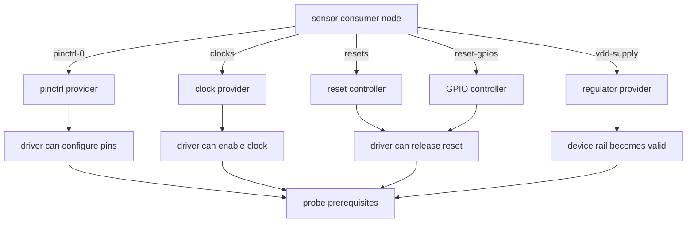
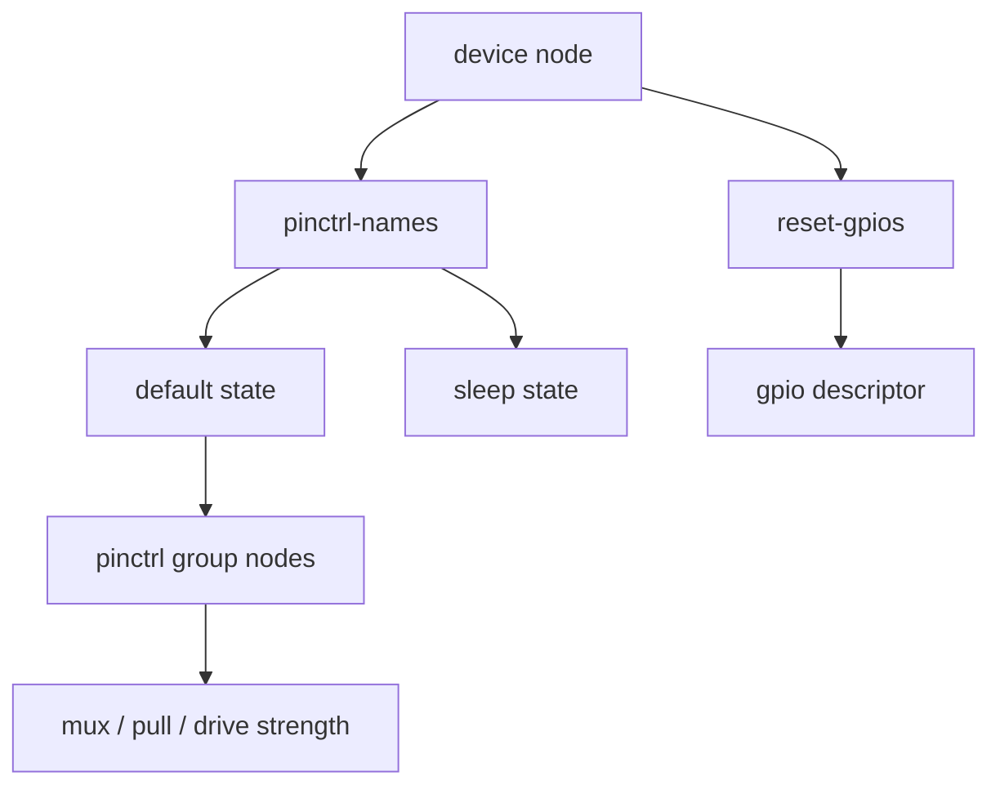
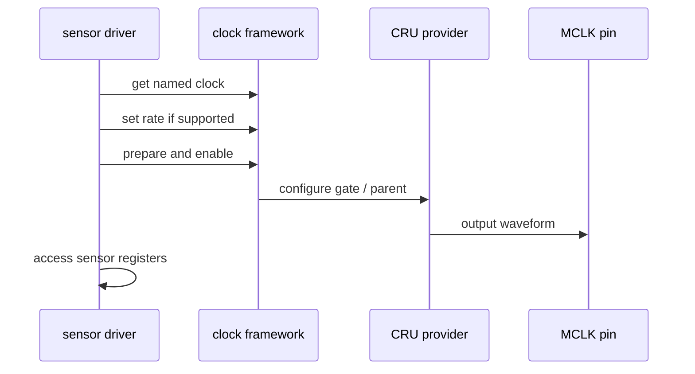
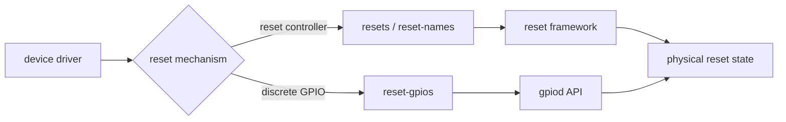
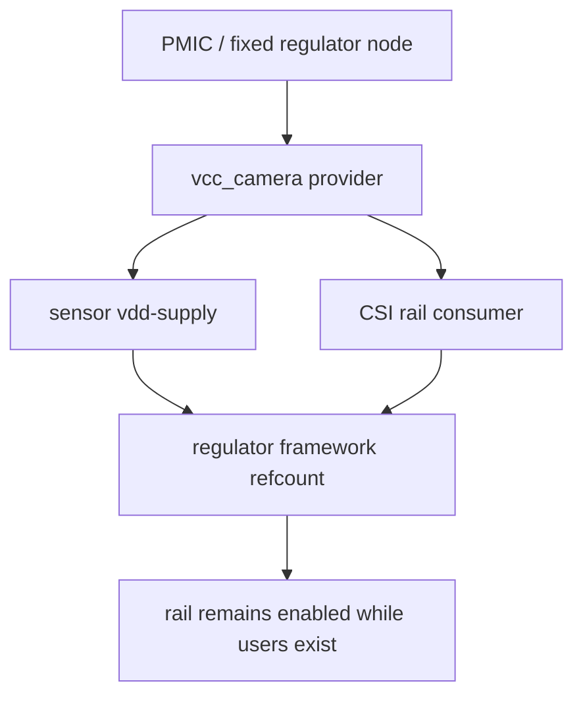
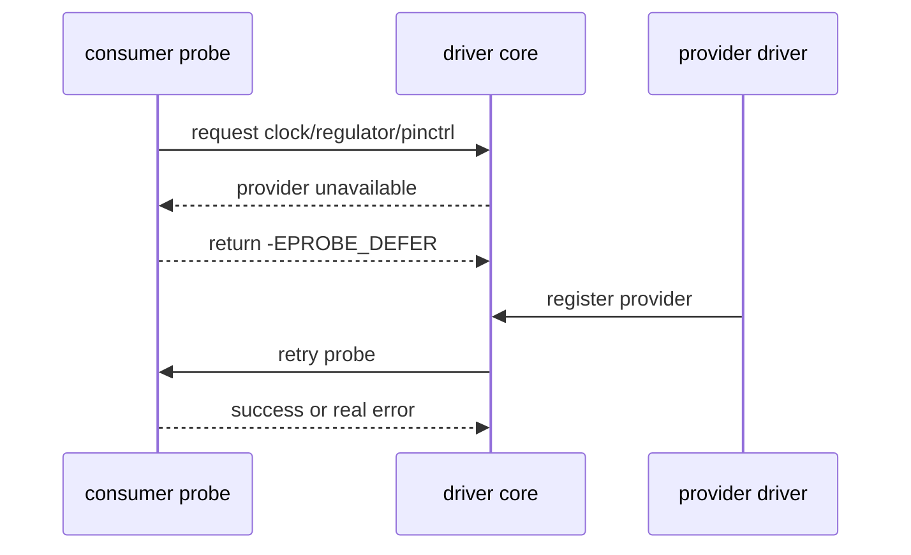
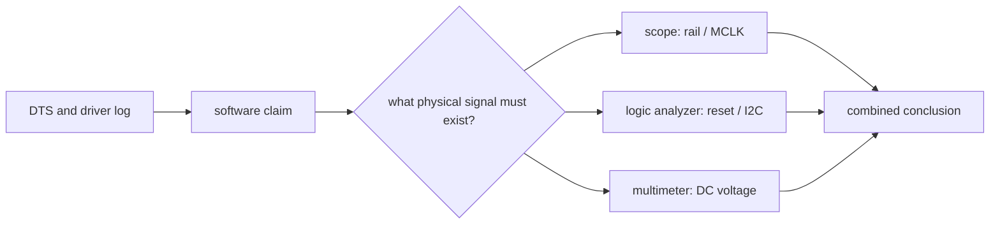

一个 sensor、PHY 或 codec 无法 probe 时，最常见的错误结论是“驱动没有初始化寄存器”。在真正访问 I2C/SPI 寄存器之前，设备可能还没有供电、时钟、引脚复用和复位状态。Linux 的 clock、reset、regulator、pinctrl 框架把这些条件表示为 provider-consumer 依赖；DTS 中一条错 phandle 或错误极性，可能让驱动报 `-EPROBE_DEFER`、总线 NACK，甚至无任何直接错误。

本章不把四类资源分开背属性，而是建立从 DTS 到物理波形的统一排查方法。软件日志证明“内核请求了资源”，示波器和逻辑分析仪证明“板上真的出现了正确电气状态”；两者缺一不可。

## 1. 明确外设启动目标与依赖关系

### 1. 外设真正开始通信前发生了什么


顺序由具体驱动和器件手册决定。某些芯片要求先拉复位再供电，某些需要在 MCLK 输出后等待固定时间，某些 GPIO 既不是 reset 也不是 power-enable。DTS 描述资源关系，驱动实现实际顺序；不能只凭一个“常见上电序”改动所有外设。

| 资源 | DTS 常见属性 | 内核常见获取方式 | 硬件验证 |
|---|---|---|---|
| 引脚复用 | `pinctrl-names`、`pinctrl-0` | pinctrl state select | 复用功能、电平、上下拉 |
| 时钟 | `clocks`、`clock-names` | `devm_clk_get` | MCLK 频率、占空比、启动时间 |
| 复位 | `resets` 或 `reset-gpios` | reset controller/GPIO descriptor | 有效极性、脉宽、释放时刻 |
| 电源 | `*-supply` | `devm_regulator_get` | rail 电压、上升时序、负载能力 |

### 2. provider 和 consumer 的依赖图



consumer 是需要资源的设备节点，例如 IMX415 sensor；provider 是提供 clock、regulator、GPIO 或 pinctrl state 的节点和驱动。一个 provider 节点写在 DTS 中，并不保证 provider driver 已成功注册。必须同时检查：节点可见、driver 被编译、driver probe 成功、consumer 引用格式正确。

```bash
dmesg | grep -Ei 'pinctrl|clock|reset|regulator|defer|imx415|sensor'
find /sys/kernel/debug -maxdepth 2 -type d 2>/dev/null | head -80
```

debugfs 的 clock/regulator 视图受内核配置影响。看不到文件并不等价于硬件没有该资源；先确认是否启用 debugfs 和相应 debug 选项。

## 2. 依次配置 pinctrl、clock 与 reset

### 3. pinctrl：不是 GPIO 编号的别名

pinctrl state 描述 SoC 引脚的复用功能和电气配置，例如 UART TX、I2C SDA、MCLK、GPIO、上下拉、驱动能力和 sleep 状态。`reset-gpios` 描述的是一个逻辑控制信号；它可能使用同一套引脚硬件，但语义不同。



结构示例：

```dts
&camera0 {
    pinctrl-names = "default", "sleep";
    pinctrl-0 = <&cam0_mclk_pins &cam0_rst_pins>;
    pinctrl-1 = <&cam0_sleep_pins>;
    status = "okay";
};
```

具体 pin group label 只能从当前 SoC pinctrl DTSI 和 binding 中得到。不要照抄其他 Rockchip 芯片的引脚组；同名 UART、I2C 或 camera 接口在不同 SoC 上的 bank、function 和电气约束都可能不同。

检查路径：

```bash
grep -RIn 'cam0_mclk\|camera.*pinctrl\|uart2_xfer' arch/arm/boot/dts 2>/dev/null | head -160
grep -RIn 'pinctrl-names\|pinctrl-0' Documentation/devicetree/bindings drivers 2>/dev/null | head -160
```


### 3.1 default 与 sleep 状态

系统 suspend、runtime PM 或 driver remove 时可能选择 sleep state。没有 sleep state 的外设可能在低功耗时保持高功耗、输出错误电平，或与其他复用功能冲突。反过来，把工作状态错误地放进 sleep group，可能造成启动后总线无法通信。

```mermaid
stateDiagram-v2
    [*] --> Default: probe
    Default --> Active: resource enabled
    Active --> Sleep: suspend/runtime PM
    Sleep --> Active: resume
    Active --> [*]: remove
```

### 4. clock：名称、频率和真实波形必须一致

`clocks` 是 phandle 与 cell 组成的引用，`clock-names` 是 driver 使用的逻辑名字。driver 使用 `devm_clk_get(dev, "xvclk")` 时，DTS 必须有对应的 `clock-names = "xvclk"`；只填 `clocks` 而缺少名称，可能返回 `-ENOENT`。

```dts
sensor@1a {
    clocks = <&cru SOME_CAMERA_CLOCK>;
    clock-names = "xvclk";
};
```

占位时钟 ID 不能作为可用配置。必须从 SoC clock binding、当前驱动和板级原理图共同确认：

```bash
grep -RIn 'devm_clk_get.*xvclk\|clk_get.*xvclk' drivers/media drivers 2>/dev/null | head -120
grep -RIn 'clock-names' Documentation/devicetree/bindings/media drivers/media 2>/dev/null | head -120
grep -RIn 'CAMERA\|MCLK' include/dt-bindings/clock arch/arm/boot/dts 2>/dev/null | head -160
```



软件看到 clock enable count 增加，只表示框架状态；示波器才可以确认 MCLK 是否出现在正确引脚、频率是否满足 sensor 要求、开启时刻是否在 reset/供电约束内。

### 5. reset controller 与 `reset-gpios` 不可混用

`resets` 引用 SoC 或外部 reset controller；`reset-gpios` 使用通用 GPIO 描述一个离散控制脚。两者的 binding、consumer API 和时序语义不同。



```dts
sensor@1a {
    reset-gpios = <&gpio2 7 GPIO_ACTIVE_LOW>;
};
```

低有效并不意味着 “GPIO 输出 0” 在任何上下文都正确。GPIO descriptor API 会根据 `GPIO_ACTIVE_LOW` 做逻辑到物理电平转换；若 DTS 和代码同时手工反转，最终极性会错两次。

检查 driver 是否请求 reset controller 还是 GPIO：

```bash
grep -RIn 'devm_reset_control\|reset_control_' drivers/media drivers 2>/dev/null | head -120
grep -RIn 'devm_gpiod_get.*reset\|reset-gpios' drivers/media drivers 2>/dev/null | head -120
```

## 3. 配置 regulator 并处理 deferred probe

### 6. regulator：rail 名称、时序与共享消费者

regulator binding 用 `*-supply` 属性把 consumer 指向 provider。常见错误不是“少了一个 regulator 节点”，而是 supply 属性名与 driver 查找名不一致，或者多个消费者共用 rail 时被一个驱动提前关闭。



```dts
vcc_camera: regulator-camera {
    compatible = "regulator-fixed";
    regulator-name = "vcc_camera";
    regulator-min-microvolt = <2800000>;
    regulator-max-microvolt = <2800000>;
};

sensor@1a {
    vdd-supply = <&vcc_camera>;
};
```

上例只展示结构。电压、always-on、boot-on、enable GPIO 和供电域需要根据原理图、PMIC 配置和芯片手册确定。不要为了消除 `-EPROBE_DEFER` 就把所有 regulator 改成 `always-on`；这会掩盖时序问题并增加功耗。

目标机上的 regulator 摘要通常在 debugfs：

```bash
mount -t debugfs none /sys/kernel/debug 2>/dev/null || true
cat /sys/kernel/debug/regulator/regulator_summary 2>/dev/null | head -160
```

记录 rail 的软件 enable 状态、名称和 consumer 后，仍要在测试点测量电压和上升时间。软件摘要无法发现 PMIC 输出被短路、使能脚未连、负载过大或电压纹波问题。

### 7. `-EPROBE_DEFER` 的正确工作流

deferred probe 表示 consumer 暂时无法获取一个可能在稍后注册的 provider。它是依赖排序机制的一部分，不等于错误，也不等于“多睡眠几秒就好”。



排查顺序：

1. 记录 consumer 报告的具体资源名；
2. 从 DTS 找到对应 provider phandle；
3. 确认 provider 节点没有 disabled；
4. 确认 provider driver 编入内核或能在当前阶段加载；
5. 查看 provider 的 probe 日志和真实硬件资源；
6. 重启后确认 pending 项是否最终消失。

```bash
dmesg | grep -Ei 'deferred probe|EPROBE_DEFER|regulator|clock|pinctrl|reset'
cat /sys/kernel/debug/devices_deferred 2>/dev/null
```

`devices_deferred` 是否存在取决于内核版本和 debugfs。没有该文件时，从 dmesg 的首次 resource-get 失败向 provider 反向追踪。

### 8. 软件与硬件证据如何配对



| 软件证据 | 物理证据 | 可以得出的结论 |
|---|---|---|
| `regulator_enable` 成功 | rail 达到目标电压 | 供电软件/硬件链路一致 |
| clock enable 成功 | MCLK 在目标 pin 出现 | 时钟路径可用 |
| GPIO 逻辑值切换 | reset 引脚电平变化 | 极性与连线可核验 |
| I2C transfer 返回成功 | 地址和 ACK 波形正确 | 总线通信成立 |
| probe 成功 | 子系统节点/功能可访问 | 资源到驱动闭环成立 |

单独一列证据都不充分。例如 I2C 有波形却没有 ACK 可能是电源或地址问题；dmesg 没有错误也可能是 driver 根本没有 probe。

## 4. 用传感器上电链路完成实验

### 9. IMX415 上电链路审计

对摄像头 sensor，建议把上电链路写成一张针对当前板的清单：

```text
sensor rail names and measured voltages:
MCLK source, rate, pin and measured waveform:
reset/pwdn GPIO, active level and measured sequence:
I2C controller and bus number:
I2C address and first ACK transaction:
sensor driver compatible and probe log:
CSI endpoint and media graph evidence:
```

不要在没有测量资料时填固定数值。不同 IMX415 模组、载板和 SDK 可能使用不同 PMIC rail、MCLK 路由、reset/pwdn 接法和 I2C controller。

### 10. 可复现实验：定位一个资源依赖问题

目标：用一个小实验区分“provider 未就绪”“DTS 引用错误”和“物理资源不存在”。

1. 选择一个当前能稳定复现的 consumer probe 失败；
2. 保存完整 dmesg、最终 DTB 和当前 DTS diff；
3. 从 driver 找到失败的资源获取 API 与资源名；
4. 从 DTS 找到对应 phandle/provider；
5. 确认 provider 节点和 driver 已启用；
6. 启动时记录 `devices_deferred` 或 provider probe 日志；
7. 用仪器测量该资源对应的 rail、clock 或 GPIO；
8. 只修改一个变量后重测；
9. 用健康 DTB/镜像回退，确认结论可重复。

## 5. 故障矩阵、变更记录与验收

### 11. 常见错误矩阵

| 症状 | 首个检查点 | 常见根因 |
|---|---|---|
| `failed to get clock` | `clock-names` 与 driver | 名称不一致、provider 未启用 |
| MCLK 软件 enable 但无波形 | pinctrl/clock parent/测试点 | pin mux 错、时钟没路由到 pin |
| reset 后 I2C 无 ACK | GPIO 极性和顺序 | 双重反转、供电/MCLK 未就绪 |
| `-EPROBE_DEFER` 永不消失 | provider dmesg | provider disabled/未编译/引用错 |
| rail summary enabled 但设备不工作 | 电压/时序测量 | 电压值、上升时间、共享 rail |
| suspend 后外设失效 | sleep pinctrl/PM callbacks | sleep state 错或资源未恢复 |

### 12. 板级资源变更记录

```text
consumer_node:
resource_type:
consumer_property:
provider_node:
binding_reference:
driver_api_and_resource_name:
hardware_net_or_test_point:
expected_electrical_state:
measured_state:
probe_log:
final_dtb_sha256:
rollback:
```

这份记录能避免最危险的一类维护问题：某次为了让单个设备工作而调整了共享 clock、rail 或 pinctrl，几周后另一个设备出现偶发故障，却没有人知道资源被谁改过。

### 13. RV1126 板级资源检查清单

| 检查项 | 通过标准 |
|---|---|
| pinctrl | default/sleep 状态与真实引脚功能一致 |
| clock | driver 名称、DTS 引用、波形与频率一致 |
| reset | 类型、极性、脉宽和释放时机有依据 |
| regulator | supply 名称、provider、目标电压和测量一致 |
| deferred probe | 每个 pending consumer 有明确 provider 结论 |
| I2C/SPI | 资源启用后总线有正确 ACK/时序 |
| suspend/resume | sleep 与恢复后关键外设重新可用 |
| 版本记录 | DTS、DTB、日志、测量和回退齐全 |

### 14. 练习与里程碑

选择一个板级外设，完成资源审计：

1. 画出它的 pinctrl、clock、reset、regulator provider-consumer 图；
2. 从 driver 源码列出实际资源名；
3. 在最终 DTB 中验证每个属性；
4. 在 Linux 日志和 debugfs 中验证框架状态；
5. 至少测量一个 rail、MCLK 或 reset 波形；
6. 对一个失败路径给出最小证据与回退方案。

完成后，应能够把“设备没有工作”分解为 pinctrl、clock、reset、regulator、总线和 driver 六类证据，而不是仅通过增加 delay 或修改 `status` 反复试错。

> 🏷️ Linux BSP、RV1126、pinctrl、clock、reset、regulator、EPROBE_DEFER、MCLK、IMX415、板级上电
