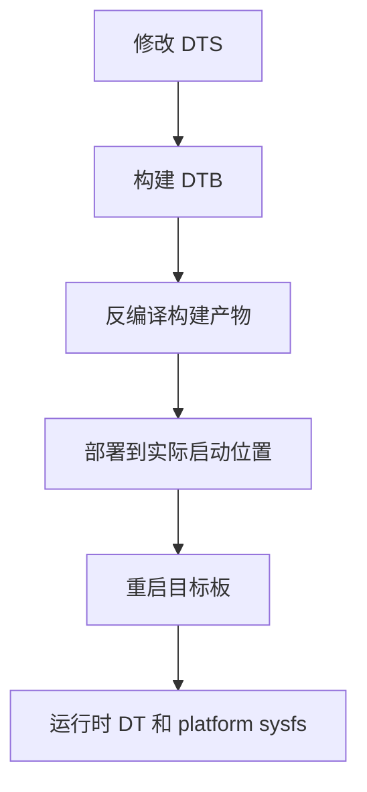
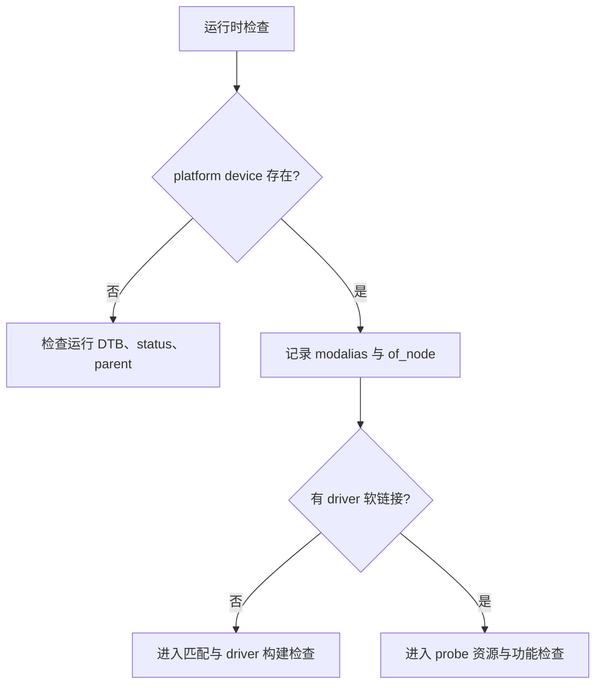
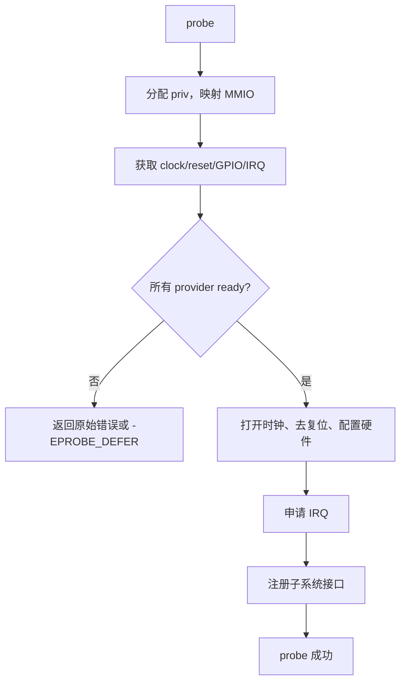
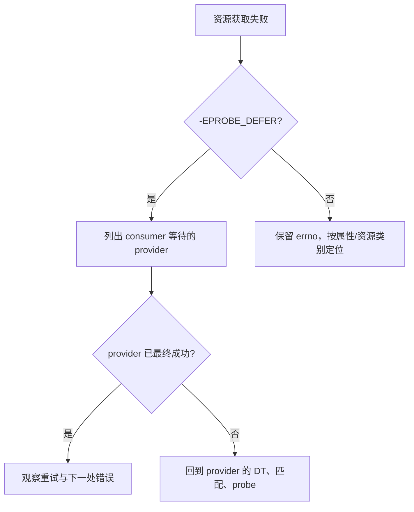
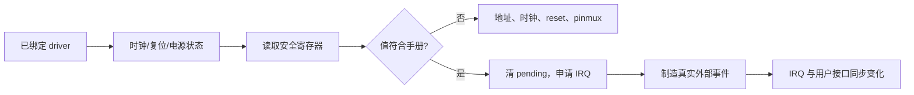
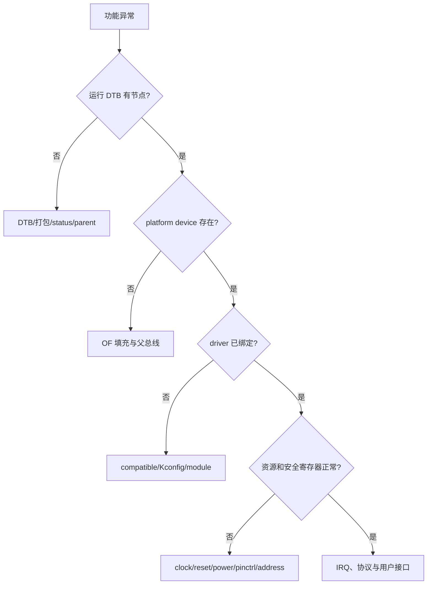
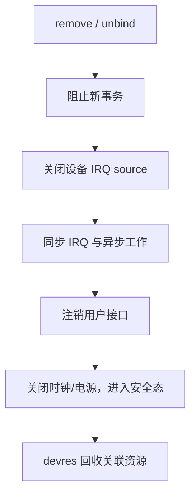

这一篇不把 platform driver 拆成许多彼此独立的概念，而是完成一个明确任务：让一个板级外设从 DTS 节点变成已绑定、可工作的 Linux 设备，并且在失败时能够判断问题停在哪一步。

示例使用一个带 MMIO、时钟、复位、GPIO 和 IRQ 的假想外设 `board-alert`。地址、时钟 ID、IRQ、GPIO 和寄存器位必须从当前 SoC 的 binding、原理图和 SDK 获取；文中的尖括号是需要替换的硬件事实，不是可直接量产的数值。

## 1. 本次学习要完成什么

完成后，你应能在同一块开发板上证明下面这条链路每一段都成立：


准备以下材料后再改代码：

| 材料 | 用来确认什么 |
|---|---|
| 当前板卡原理图 | 外设地址、时钟、复位、电源、GPIO 与 IRQ 连接 |
| 当前内核源码及构建目录 | binding、相似驱动、Kconfig 和目标 DTB |
| 本次启动日志 | 内核、板型、DTB 与已有 provider 的实际状态 |
| 串口或网络终端 | 查看 sysfs、`dmesg`、IRQ 和接口行为 |
| 示波器或逻辑分析仪 | 验证 enable、clock、reset 和真实中断信号 |

开始前先建立基线。这样后面每次改动都能证明新行为来自本次修改，而不是旧镜像、旧 DTB 或环境变量残留：

```bash
uname -a
cat /proc/cmdline
dmesg -T | head -120
find /sys/bus/platform/devices -maxdepth 1 -type l -printf '%f\n' | sort > /tmp/platform-before.txt
```

platform bus 的匹配不是 driver 自己调用 `probe()`。设备实例和驱动无论谁先注册，总线都会按自身规则尝试绑定；在 Device Tree 系统中，`compatible` 是匹配契约，节点名只用于阅读和定位。这一点决定了后面的排错顺序：先证明 device 已创建，再讨论 probe 内部。

## 2. 第一步：把硬件事实写入 DTS，并证明设备已经创建

先从当前 SDK 寻找最相近的 binding 与驱动，确认每一个属性名字的来源。不要照搬别的 SoC 或网页示例里的 `clock-names`、GPIO 名称和 interrupts cell 数量。

```bash
# 在当前内核树中寻找 binding、compatible 和同类资源获取方式
rg -n 'board-alert|<peripheral-compatible>' Documentation/devicetree/bindings drivers arch
rg -n 'devm_platform_ioremap_resource|devm_clk_get|devm_gpiod_get' drivers
rg -n 'clock-names|resets|interrupt-parent|pinctrl-names' Documentation/devicetree/bindings
```

为这个外设建立节点。这里的结构比具体数值重要：DTS 只描述硬件连接，驱动通过标准资源 API 把描述转换成内核对象。

```dts
board_alert: alert@<base-address> {
    compatible = "example,board-alert";
    reg = <<base-address> <register-size>>;
    interrupts = <<irq-specifier>>;
    clocks = <&<clock-controller> <clock-id>>;
    clock-names = "bus";
    resets = <&<reset-controller> <reset-id>>;
    enable-gpios = <&<gpio-controller> <gpio-line> GPIO_ACTIVE_HIGH>;
    pinctrl-names = "default", "sleep";
    pinctrl-0 = <&alert_default_pins>;
    pinctrl-1 = <&alert_sleep_pins>;
    status = "okay";
};
```

`reg` 给出寄存器资源，`interrupts` 给出事件线路，`clocks`、`resets` 和 `enable-gpios` 描述外围可访问前的依赖。`GPIO_ACTIVE_HIGH`/`LOW` 表达逻辑有效态，不是随意选择的物理电平。若原理图有反相器或外设有效低引脚，必须如实写入。

编译 DTB 后，第一轮验证不是开机看日志，而是检查最终产物是否真的包含节点：

```bash
fd . <kernel-output-or-sdk> | rg '\.(dtb|dtbo)$'
dtc -I dtb -O dts <built-board.dtb> | rg -n -C 4 'board-alert|example,board-alert'
```

重新启动目标板后，再验证运行的 DTB。源码树里有节点不代表 bootloader 加载的就是它。



```bash
# 文件名从 sysfs 实际结果复制；不要假设 platform 设备名等于 DTS 节点名
find /sys/firmware/devicetree/base -type f -name compatible -print 2>/dev/null | head -80
find /sys/bus/platform/devices -maxdepth 1 -type l -printf '%f\n' | sort

DEV=<device-name-from-sysfs>
BASE=/sys/bus/platform/devices/$DEV
readlink -f "$BASE/of_node"
cat "$BASE/modalias"
cat "$BASE/uevent"
```

此时有两种结果。若 `/sys/bus/platform/devices` 中没有目标实例，停在本步骤检查 DTB、`status`、父节点和 OF 填充路径。若设备存在，继续下一步；不要因为还没有 driver 链接就回头反复修改 DTS。



## 3. 第二步：完成匹配与 probe 的资源初始化

设备创建成功后，驱动才能匹配。先写清楚 `of_match_table`，并把硬件版本差异放进 match data，而不是在 probe 中散落字符串比较。

```c
struct alert_soc_data {
    u32 status_offset;
    bool needs_reset_pulse;
};

static const struct alert_soc_data alert_v1 = {
    .status_offset = 0x10,
    .needs_reset_pulse = true,
};

static const struct of_device_id alert_of_match[] = {
    { .compatible = "example,board-alert-v1", .data = &alert_v1 },
    { .compatible = "example,board-alert" },
    { }
};
MODULE_DEVICE_TABLE(of, alert_of_match);
```

DT 的 `compatible` 应从最具体版本排到通用版本。这个顺序让新硬件可以选择更精确的差异数据，同时给兼容硬件留下通用路径。`MODULE_DEVICE_TABLE(of, ...)` 让模块别名可被识别，但最终是否自动加载还取决于根文件系统和启动策略。

接着按“无副作用资源 -> 可逆硬件动作 -> 用户可见接口”的顺序写 probe：



```c
struct alert_priv {
    void __iomem *base;
    struct clk *bus_clk;
    struct gpio_desc *enable_gpio;
    int irq;
    spinlock_t lock;
};

static int alert_probe(struct platform_device *pdev)
{
    struct device *dev = &pdev->dev;
    struct alert_priv *priv;
    int ret;

    priv = devm_kzalloc(dev, sizeof(*priv), GFP_KERNEL);
    if (!priv)
        return -ENOMEM;

    priv->base = devm_platform_ioremap_resource(pdev, 0);
    if (IS_ERR(priv->base))
        return PTR_ERR(priv->base);

    priv->bus_clk = devm_clk_get(dev, "bus");
    if (IS_ERR(priv->bus_clk))
        return dev_err_probe(dev, PTR_ERR(priv->bus_clk), "get bus clock\n");

    ret = clk_prepare_enable(priv->bus_clk);
    if (ret)
        return dev_err_probe(dev, ret, "enable bus clock\n");

    ret = devm_add_action_or_reset(dev, alert_disable_clock, priv);
    if (ret)
        return ret;

    priv->enable_gpio = devm_gpiod_get_optional(dev, "enable", GPIOD_OUT_INACTIVE);
    if (IS_ERR(priv->enable_gpio))
        return dev_err_probe(dev, PTR_ERR(priv->enable_gpio), "get enable GPIO\n");

    priv->irq = platform_get_irq(pdev, 0);
    if (priv->irq < 0)
        return priv->irq;

    platform_set_drvdata(pdev, priv);
    return alert_register_interface(priv);
}
```

`devm_*` 将部分资源的释放绑定到 device 生命周期，但它不会替你决定硬件状态。时钟开启、reset 解除、设备 IRQ source 打开后，失败路径必须能回到安全状态。这里通过 `devm_add_action_or_reset()` 绑定时钟关闭动作；当前内核若没有此 API，应采用项目现有的错误回滚风格。

`probe()` 中的错误码就是下一步的导航，不要把所有失败都转换成 `-EPROBE_DEFER`：

| 结果 | 当前应检查什么 |
|---|---|
| `-EPROBE_DEFER` | 该 clock/regulator/pinctrl/GPIO provider 是否会稍后成功绑定 |
| `-ENOENT` | 属性名与 `clock-names`、`*-gpios`、binding 是否一致 |
| `-EINVAL` | 运行 DTB 的 cell 数、参数格式和 pinctrl 配置 |
| `-ENODEV` / `-ENXIO` | 地址、控制器、硬件连接或匹配条件 |
| `-EBUSY` | GPIO、IRQ 或 pinmux 是否已被其他 consumer 占用 |

deferred probe 的含义是“依赖将来可能出现”，不是“任何错误以后再试”。如果 provider 从未创建、属性拼写不对或存在循环依赖，重试只会掩盖真正问题。



## 4. 第三步：在板端证明 probe 以后硬件真的可用

一次 “probe success” 只证明代码走到了末尾，不证明外设可以通信。现在按对象关系、资源状态、真实硬件事件三层验证。

先从 sysfs 确认已绑定的对象关系：

```bash
DEV=<exact-device-name>
BASE=/sys/bus/platform/devices/$DEV
readlink -f "$BASE/driver"
readlink -f "$BASE/of_node"
cat "$BASE/modalias"

DRV=<driver-name-from-link>
find /sys/bus/platform/drivers/$DRV -maxdepth 1 -printf '%f\n'
dmesg -T | rg -i -C 3 'board-alert|probe|defer|pinctrl|regulator|clock'
```

设备有 `of_node` 而没有 `driver`，说明先看匹配表、模块和 Kconfig。存在 `driver` 链接却没有业务接口，则把日志点放在资源初始化之后和子系统注册之前，而不是重新检查 `compatible`。

然后验证外设在电气上可访问。根据数据手册选择一个无副作用 ID 或 status 寄存器，在驱动受控日志中读取它；同时检查 enable、reset、时钟和 pinmux。避免把任意 `/dev/mem` 写入当调试常规手段。



申请 IRQ 前先完成寄存器初始化并清设备侧 pending。IRQ 申请成功只代表内核接受了该线路；若 `/proc/interrupts` 计数不变，还要检查 pad mux、极性、触发类型、GIC 路由和设备是否真的产生了信号。

```bash
# 事件前后各保存一次；IRQ 行从实际输出中确定
cat /proc/interrupts
# 触发一次真实按键、ready 信号或板级测试源
cat /proc/interrupts

# 同时读取驱动提供的统计或标准子系统接口
find /sys -path '*<actual-device-name>*' -type f 2>/dev/null | head -100
```

建议将一次验证记录做成下表，而不是只贴一条成功日志：

| 证据 | 证明的事实 |
|---|---|
| 构建 DTB 的反编译片段 | 配置进入发布物 |
| 启动日志、`of_node` | 板子运行的是预期硬件描述 |
| sysfs driver 软链接 | device 与 driver 真的绑定 |
| 资源日志和安全寄存器读值 | 外设可被访问 |
| IRQ 前后计数或波形 | 事件线路真实工作 |
| 子系统或用户态结果 | 功能可被上层消费 |

## 5. 第四步：把失败、解绑和回归变成固定流程

当 bring-up 失败时，按以下顺序定位，不要在 DTS、driver 和用户态之间来回猜：



如果需要用 bind/unbind 复现 probe，只在开发板、功能停止且已记录现场时执行。对摄像头、音频、DMA 或共享电源域外设，手工解绑可能影响其他 consumer，不能作为产品恢复机制。

```bash
DRV=<driver-name-from-sysfs>
DEV=<device-name-from-sysfs>
DIR=/sys/bus/platform/drivers/$DRV

echo "$DEV" > "$DIR/unbind"
dmesg -T | tail -120
echo "$DEV" > "$DIR/bind"
dmesg -T | tail -120
```

驱动的 remove 路径要与 probe 的动作相反：停止新用户操作，关闭设备侧 IRQ source，等待 IRQ/thread/work 完成，注销子系统接口，关闭硬件，再让 devres 回收映射、GPIO 等资源。



最后把本篇变成可重复的 bring-up 作业：

1. 从当前 SDK 找到一个实际 platform 外设的 binding 和 driver，标记它所需的 clock、reset、GPIO、IRQ。
2. 在不改变硬件功能前，先用 sysfs 和 `/proc/interrupts` 为这个既有设备建立证据基线。
3. 为自己的 `board-alert` 节点完成 DTB 构建、反编译确认和部署。
4. 让 driver 匹配并逐个打印资源获取结果，保留每个失败 errno。
5. 通过安全寄存器、真实中断和用户接口完成三层验证。
6. 做一次受控 unbind/bind，确认不会留下活跃 IRQ、重复注册节点或 use-after-free。

完成这条路径后，你获得的不是一段“能 probe”的代码，而是一套可迁移到 GPIO、I2C、SPI、PWM、媒体和复杂 SoC 外设的定位方法：每一次都先证明设备描述，再证明匹配，再证明资源，最后证明物理行为。

> 🏷️ 标签：Linux BSP、platform device、platform driver、Device Tree、probe、deferred probe、sysfs、devres
