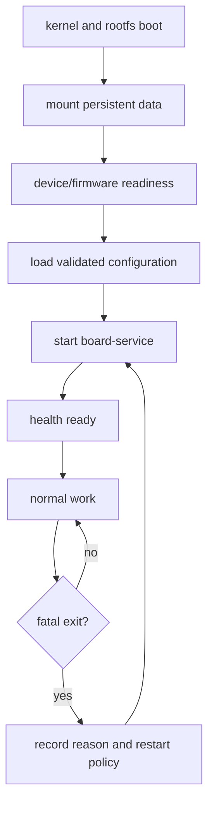
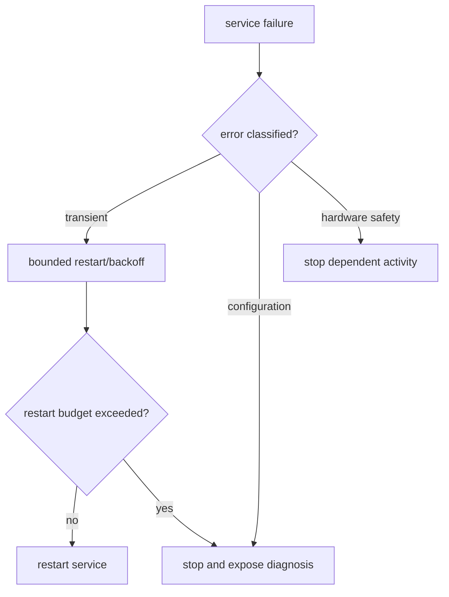
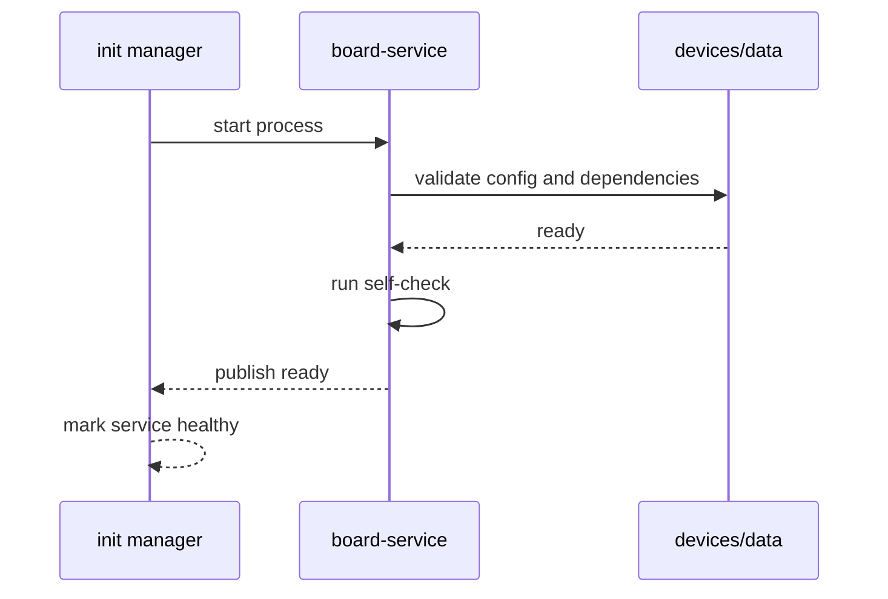
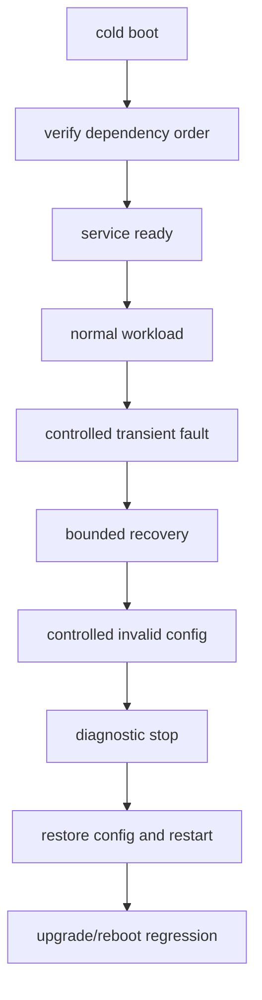

把应用放进 /usr/bin 并不等于产品服务已经集成。

它需要在正确的文件系统、网络、设备节点和配置就绪后启动，需要以受限用户运行，需要把日志写到可控位置，并在异常退出时按明确策略重试或停止。

Buildroot 系统可能选择 BusyBox init/SysVinit，也可能选择 systemd。两者表达服务依赖和重启方式不同，但都需要把“服务何时可用、为何失败、如何恢复”写成可验证的系统契约。

本章以一个依赖摄像头、网络和数据分区的 board-service 为主线组织启动与日志。

## 1. 先定义服务的生命周期和依赖

服务的真正依赖不只是“网络已启动”。

它可能需要 data 分区已挂载、NVMEM 身份已读出、camera media graph 已出现、firmware 已加载、时间已同步或配置已验证。



| 依赖 | 可验证条件 | 不应使用的替代 |
| --- | --- | --- |
| data mount | findmnt/marker file/可写性检查 | 固定 sleep 5 秒 |
| 网络 | IP/route/DNS 或业务对端可达 | 接口名称存在 |
| 摄像头 | media entity 和最小 stream check | /dev/videoX 文件存在 |
| 身份配置 | serial/MAC/CRC/权限校验 | 空配置文件也继续运行 |
| 时间 | 产品要求的可信时间状态 | RTC 值非零 |
| firmware | driver/service 握手成功 | 文件位于 /lib/firmware |

将每项依赖变成快速、无副作用的 health probe，比在启动脚本中堆叠 sleep 更可靠。

## 2. 第一步：选择 init 模型并让服务定义进入 rootfs

SysVinit/BusyBox 常以 /etc/init.d/SNNname 脚本定义启动顺序。

systemd 使用 unit 的 After、Wants、Requires、Restart 和 user/group 等声明依赖与行为。

不能把 systemd unit 放进一个 SysVinit 镜像后期待它会被执行，也不要在两套 init 管理器中同时启动同一 daemon。

```mermaid
flowchart LR
    A[Buildroot init choice] --> B{SysVinit/BusyBox}
    B --> C[/etc/init.d/SNNservice]
    A --> D{systemd}
    D --> E[board-service.service]
    C --> F[service process]
    E --> F
```

一个精简的 systemd unit 可以表达核心意图：

```ini
[Unit]
Description=Longway board service
After=network-online.target data.mount
Wants=network-online.target

[Service]
Type=simple
User=board
Group=board
ExecStart=/usr/bin/board-service --config /etc/board/service.conf
Restart=on-failure
RestartSec=3
RuntimeDirectory=board-service

[Install]
WantedBy=multi-user.target
```

data.mount 只是示例名称。实际 mount unit、网络 ready 语义和 service 依赖要按系统现状确认。

对于 SysVinit，脚本应支持 start、stop、restart/status（若系统约定），使用 pidfile/进程检查，并将启动错误写入统一日志位置。

### 创建最小权限运行身份

服务不应默认以 root 运行，除非它必须执行受限硬件操作且没有更窄的权限模型。

Buildroot users table 可将用户、组、目录所有权和文件权限随镜像生成。

```text
board -1 board -1 = /home/board /bin/false Board service user
/var/lib/board-service d 0750 board board - - - - -
/var/log/board-service d 0750 board board - - - - -
```

设备节点权限可以通过 udev/mdev 规则、group 或 capability 设计处理。

不要为让服务“先跑起来”就把 /dev/videoX、串口、所有 GPIO 或整个 /var 设为 world-writable。

## 3. 第二步：让配置、日志和崩溃信息有明确落点

只读 rootfs 与可写 data 分区应承担不同责任。

默认配置可位于 /etc；运行时状态、缓存、数据库和日志应位于可写且容量受控的目录；密钥和校准数据不应混入普通日志或临时目录。

```mermaid
flowchart TD
    A[read-only rootfs] --> B[/etc default config]
    C[persistent data] --> D[/var/lib service state]
    C --> E[/var/log rotated logs]
    F[tmpfs] --> G[/run pid/socket]
    B --> H[service]
    D --> H
    E --> I[diagnostics/export]
    G --> H
```

日志应至少包含 UTC/monotonic 时间、服务版本、板级身份的安全掩码、请求/帧 sequence、错误码和状态切换。

不要记录密钥、原始 token、完整用户数据或无限速的高频调试输出。

```sh
mkdir -p /var/log/board-service
board-service --config /etc/board/service.conf +  >>/var/log/board-service/service.log 2>&1
```

直接重定向适合最小 SysVinit 系统示例。若使用 systemd/journald，应利用标准输出和 journal，而不是同时写多份无轮转日志。

### 日志轮转和磁盘预算是服务功能

如果服务每秒写入几十行日志，几天后可能填满 data 分区，进一步导致数据库、配置提交或系统服务失败。

需要为每类日志定义最大大小、保留数量、轮转条件和远程导出策略。


日志满时的行为也要测试：服务应保留关键错误、停止无价值 debug 输出、向 health monitor 报告存储压力，而不是在每次 write 失败后无限打印错误。

## 4. 第三步：让重启策略区分瞬时故障和配置错误

Restart=always 或无限循环 restart 不是可靠性方案。

网络暂时不可达、USB 设备短暂重连或远端服务重启可以重试；配置 CRC 错、硬件不兼容、权限缺失或升级版本不匹配则应进入明确故障状态并等待维护。



服务自身应将可恢复失败和不可恢复失败区分为不同 exit code 或 health state。

init manager 只负责进程级重启，不能理解业务事务是否已安全提交、相机 buffer 是否已释放或远端硬件是否处于安全状态。

### 服务 ready 必须晚于进程启动

启动进程成功 fork/exec 不等于服务可工作。

应用在完成配置校验、设备连接、最小自检后再创建 ready marker、发送 systemd notify（若启用对应模式）或向 health monitor 上报 ready。



这能避免开机脚本在应用尚未准备好时就开始发送业务请求，造成第一批数据丢失或错误告警。

## 5. 第四步：以启动、异常退出、日志轮转和升级恢复验收服务

服务验收至少包含冷启动、热重启、配置错误、依赖延迟、日志接近上限、异常退出和 rootfs 升级后的首次启动。



| 场景 | 合格结果 |
| --- | --- |
| data 分区延迟挂载 | 服务等待/重试，不写入 rootfs 临时路径 |
| 配置 CRC 错 | 服务拒绝运行并给出明确日志 |
| 网络短断 | 有上限的重连，不丢失已确认状态 |
| 设备节点暂失 | 停止相关任务并在恢复后重新初始化 |
| 日志接近配额 | 轮转/告警，业务不因 ENOSPC 崩溃 |
| 服务崩溃 | 保存原因，按预算重启或进入故障态 |
| rootfs 更新 | unit/script、用户、权限、配置兼容均正确 |

### 本章练习

为一个真实 board-service 列出所有硬件、文件系统、网络和配置依赖，并将它们实现为可快速验证的 self-check。

选择系统实际使用的 init 模型，创建受限用户、运行目录、日志目录和服务定义，确保它们由 Buildroot 生成。

测试 data 分区延迟、网络断开、配置错误、日志写满和服务异常退出，记录每种情况下的进程状态、日志和重启次数。

完成一次 rootfs 升级或重刷后的冷启动，验证服务只在真正 ready 后开始处理业务。

### 本章验收

完成本章后，应能独立回答：

- 为什么应用文件存在不等于服务已集成；
- SysVinit 与 systemd 服务定义的主要差异；
- 为什么服务依赖应使用可验证条件而不是固定 sleep；
- 如何为服务创建最小用户、目录和设备权限；
- 为什么配置、运行状态、日志和临时文件应分属不同存储；
- 为什么日志轮转和磁盘预算属于可靠性设计；
- 为什么无限重启会掩盖配置和安全错误；
- 如何定义进程启动与业务 ready 的不同边界。

当服务的依赖、权限、日志、状态和恢复动作都被系统化表达后，应用才真正成为可运维的板端产品组件。

### 服务交付检查单

- 服务定义由 Buildroot package 或 overlay 生成；
- service user、group、state、log 和 runtime 目录可回读；
- 所需设备节点只授予最小 group/capability；
- 默认配置可校验且无开发密钥或默认密码；
- 依赖检查有超时和明确错误码；
- ready 与进程启动分别记录；
- restart 有退避、上限和最终故障状态；
- 日志轮转设置大小、数量和磁盘余量告警；
- crash、重启和配置失败有可导出的摘要；
- rootfs 升级后服务定义和持久配置兼容；
- data 分区不可用时服务不会写入临时路径；
- 网络不可达时业务队列和重试次数有上限；
- 停止服务会同步退出 worker、关闭设备和提交必要数据；
- 故障恢复后会重新验证依赖，而不复用旧句柄；
- 运维人员可通过受控命令获取版本和 health。

服务状态切换应写入日志，但高频数据 path 不应逐帧记录。日志用于解释异常和支持复现，不是持续写入运行时内存镜像。

多个服务应绘制依赖图并区分 required 与 optional。可选云上报失败不应阻止本地采集；关键 data mount 失败则不应让采集服务假装 ready。

服务配置修改需要定义生效方式：仅下次重启生效、收到 reload 信号生效，还是通过受控 API 热更新。不同服务不能让用户在修改文件后猜测是否已经加载。

对于需要网络凭证或设备证书的服务，启动前验证权限、文件存在性和时间条件；失败日志仅记录证书标识和错误码，不打印私钥或完整 token。

日志导出前应过滤敏感字段并保留版本、时间和校验信息。现场支持需要足够证据，但不应以收集所有用户数据为代价。

服务的 stop 超时也要有处理策略。若优雅退出失败，init manager 的强制终止前应停止对硬件提交新任务，避免下次启动面对遗留文件锁或半完成事务。

长期运行的 worker 应有内存、fd、queue 和线程数的健康上限。进程未退出而资源持续增长同样属于服务失败，需要进入可诊断状态。

当系统时间在启动后被网络校正时，日志和业务协议必须能处理时间跳变。持久化记录不要只依赖 wall clock 排序，必要时加入 monotonic sequence。

- 服务定义与镜像版本；
- 用户、目录和设备权限；
- 配置校验和依赖检查；
- ready/degraded/failed 状态；
- 日志轮转和磁盘余量；
- crash/restart/stop 的证据；
- 升级后的首次启动结果。

这些状态的采集接口应尽量稳定，避免每次应用内部重构都使运维脚本失效。

服务启动前后记录一次配置版本和 schema，避免升级后因旧配置被静默解释为新语义。

对依赖网络的服务，区分链路已起、地址已配置、DNS 可用和业务对端可达。它们是四个不同的运行条件。

服务发生连续失败时，运维接口应提供下一次自动重试时间和最近失败分类，防止人工误以为系统已经永久失效。

所有停止、重启和配置更新操作都应写审计日志，便于关联后续数据缺口或设备状态变化。

必要时为服务提供只读诊断命令，而不是让现场人员直接进入 root shell 修改系统文件。

> 🏷️ Linux BSP · systemd · SysVinit · service · logging · restart · rootfs integration
> 🏷️ Linux BSP · systemd · SysVinit · service · logging · restart · rootfs integration
> 🏷️ Linux BSP · systemd · SysVinit · service · logging · restart · rootfs integration
> 🏷️ Linux BSP · systemd · SysVinit · service · logging · restart · rootfs integration
