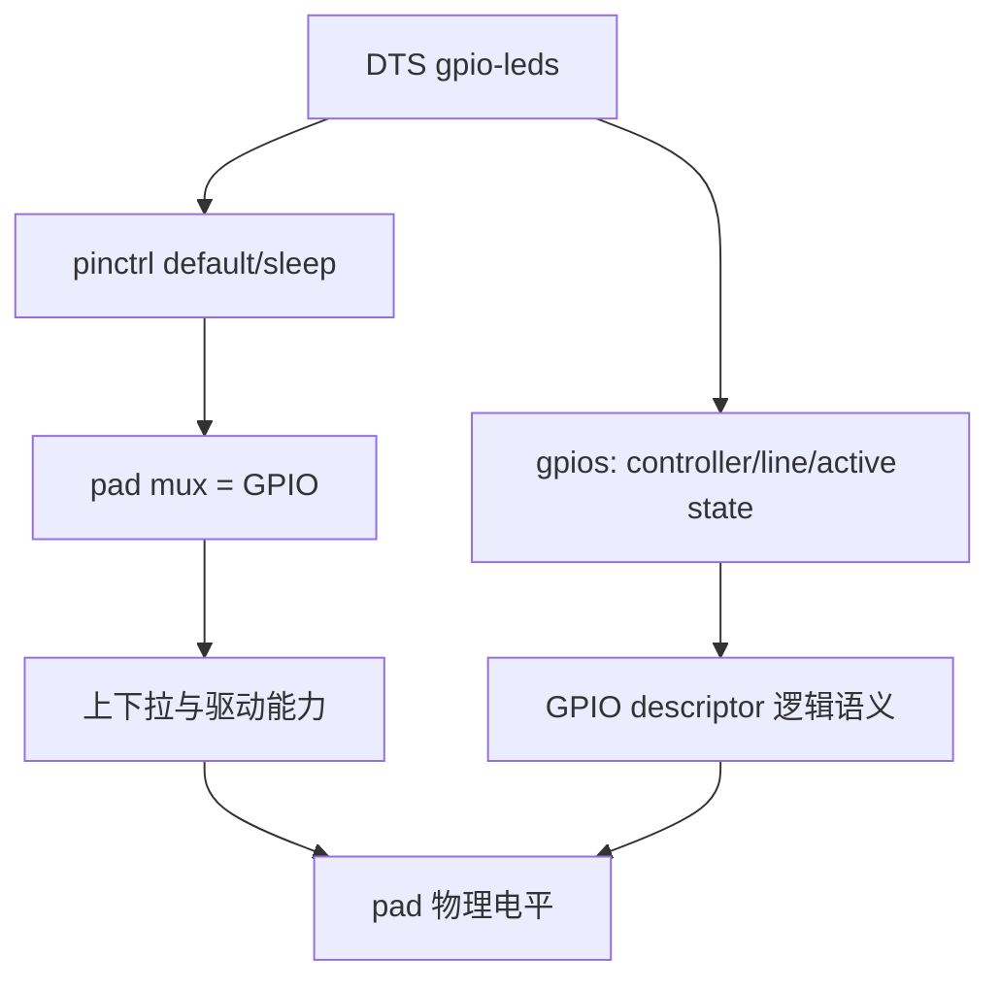
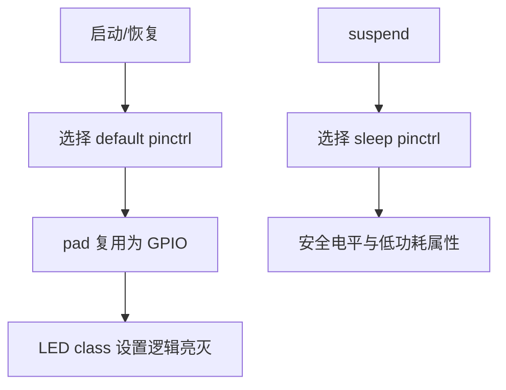
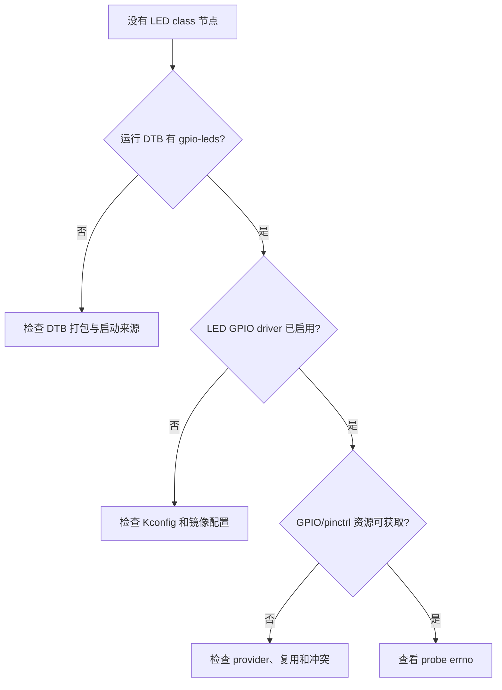
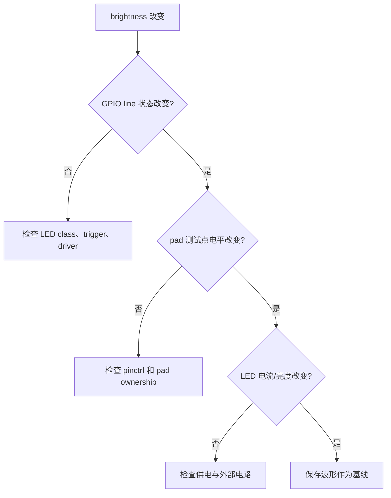
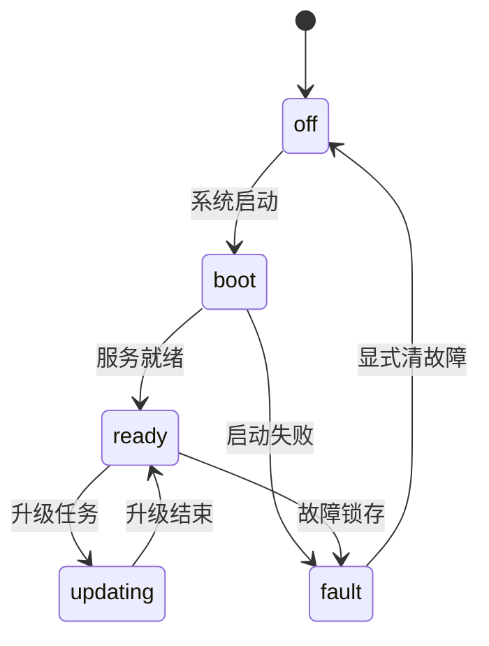
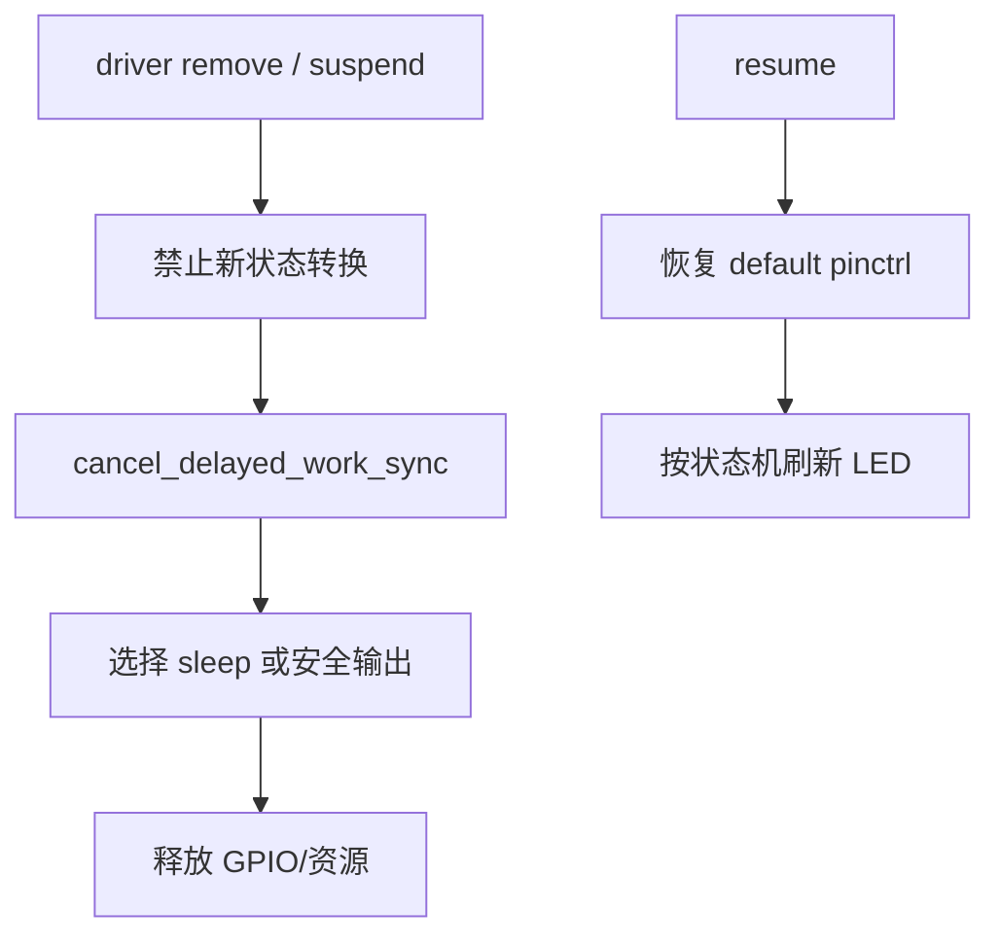
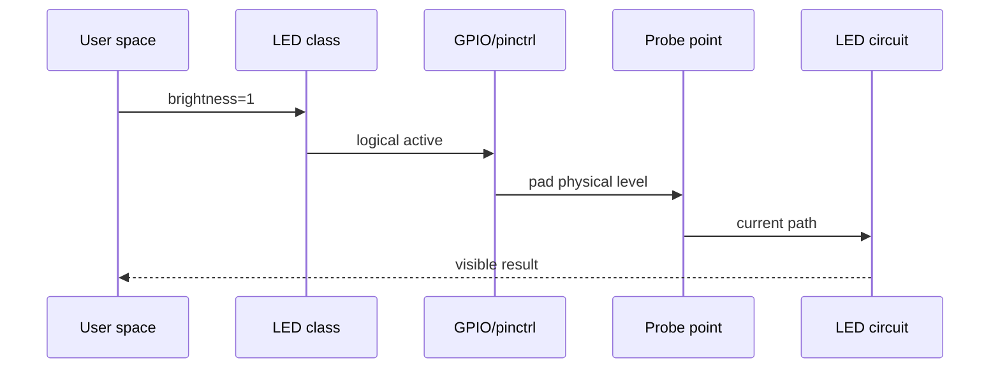

本篇只做一件事：让一颗板载状态 LED 从硬件原理图到 `/sys/class/leds` 都可被解释和验证。完成后，读者应能区分“内核逻辑亮灭”和“测试点物理高低电平”，并能定位 LED 不亮时究竟是软件、pinmux、极性、供电还是电路问题。

对于只需要开关或触发器的指示灯，优先使用 `leds-gpio` 和 LED class。这样用户态得到标准 `brightness`、`trigger` 接口，不必为一颗灯创建私有字符设备。只有 LED 行为与板级状态机、电源时序或硬件协议强耦合时，才把 GPIO 放入自定义 platform driver。

## 1. 先确认硬件连接和验收目标

从原理图建立 LED 的最小事实表。不要先写 DTS，也不要猜“输出高电平应该点亮”。有外部反相三极管、低边灌电流、PMIC 控制或 active-low 接法时，软件逻辑和 pad 电平往往正好相反。

| 项目 | 必须确认的事实 | 证据 |
|---|---|---|
| 网络名 | LED_EN、STATUS_LED 或实际网络名 | 原理图、PCB 标注 |
| 电路接法 | 直接驱动、反相器、开漏或 PMIC | 原理图 |
| 有效电平 | LED 导通时 pad 的物理电平 | 电路分析与测量 |
| pad 复用 | 是否和 UART、SPI、JTAG 等共享 | SoC pinmux 表、DTS |
| 电源域 | LED 和驱动级由哪路电源供电 | 电源树、测试点 |
| 低功耗要求 | suspend 时保持、熄灭还是允许闪烁 | 产品需求 |

本篇的验收不是“看见灯亮一次”，而是完成下列可比较结果：


先在没有改动的基线镜像上记录启动期间 LED 的状态。U-Boot、内核 pinctrl 接管和用户态 trigger 都可能改写同一根线；只有先保留基线，后面才能识别哪个阶段引入了毛刺或反相。

```bash
uname -a
dmesg -T | rg -i 'led|gpio|pinctrl' | tail -120
ls -l /sys/class/leds 2>/dev/null
mount | rg debugfs
```

## 2. 第一步：在 DTS 中描述真实电路和 pinctrl

LED class 的 `leds-gpio` 节点只描述“哪根 GPIO 驱动哪颗 LED、逻辑有效态是什么”。pinctrl 负责把 pad 切到 GPIO 功能，并配置上下拉、驱动强度等电气属性。两部分缺一不可。



示例节点的重点是结构。实际 controller、line、pinctrl label 和低电平有效性必须从前一节材料中替换：

```dts
leds {
    compatible = "gpio-leds";

    status {
        label = "board:status";
        gpios = <&<gpio-controller> <line-offset> GPIO_ACTIVE_LOW>;
        default-state = "off";
        linux,default-trigger = "none";
    };
};
```

在当前 SoC pinctrl 节点中补充 `status_led_default` 和 `status_led_sleep`，并在 LED 节点引用它们。具体 pinctrl 属性必须对照当前 binding，不能把另一个 SoC 的寄存器字段直接复制过来。

`GPIO_ACTIVE_LOW` 表示“驱动写入逻辑亮时，GPIO 控制器应输出物理低电平”。它不是取决于个人习惯的布尔值。若电路是低边灌电流或经过反相器，必须让 DTS 如实表达，后续 LED class 才能对用户态保持直观的 `brightness=1` 表示亮。

编译后先验证最终 DTB，再部署到启动介质。仅确认 `.dts` 修改保存，是 BSP bring-up 中最常见的假成功。

```bash
dtc -I dtb -O dts <built-board.dtb> | rg -n -C 5 'gpio-leds|board:status'

# 根据实际引导链确认 DTB 已写入正确分区、FIT 或 boot 目录后重启。
dmesg -T | rg -i -C 2 'led|gpio-leds|pinctrl'
```



如果系统已有自己的 pinctrl 节点，应将 LED pad 状态放在相应 SoC pinctrl 控制器下，而非在 `leds` 节点中发明寄存器配置。default 状态负责正常运行；sleep 状态应符合产品的漏电、亮灭和唤醒要求。

## 3. 第二步：让 LED class 出现，并验证软件控制链路

启动后，先找 LED class 设备。若没有出现，不要直接改驱动代码，按 DTS、Kconfig、platform device 和 probe 日志的顺序检查。

```bash
find /sys/class/leds -maxdepth 2 -type f \( -name brightness -o -name trigger \) 2>/dev/null
ls -l /sys/class/leds

LED=/sys/class/leds/<actual-led-name>
cat "$LED/max_brightness"
cat "$LED/brightness"
cat "$LED/trigger"
```



节点出现后，先关闭 trigger，再人工写 brightness，以避免 trigger 定时改写结果：

```bash
LED=/sys/class/leds/<actual-led-name>
printf 'none\n' > "$LED/trigger"
printf '0\n' > "$LED/brightness"
sleep 1
printf '1\n' > "$LED/brightness"
sleep 1
printf '0\n' > "$LED/brightness"
```

如果 `max_brightness` 大于 1，使用它提供的范围，不要假设只有开关值。对普通 GPIO LED，brightness 通常映射为逻辑 active/inactive；它不意味着已经实现了硬件 PWM 调光。

确认 basic on/off 后，再选择一个现有 trigger 进行测试。不要把 heartbeat 当成硬件正确性的唯一证据，它只能证明软件周期性调用生效。

```bash
cat "$LED/trigger"
printf 'heartbeat\n' > "$LED/trigger"
sleep 5
printf 'none\n' > "$LED/trigger"
```

## 4. 第三步：从 GPIO 所有权到示波器验证物理电平

GPIO descriptor API 让驱动按逻辑 active/inactive 操作引脚；真正的物理电平还会经过 active-low 映射、pad 复用和外部电路。此处要用三类证据串联，而不是只看其中一个。


先从 debugfs 找 GPIO line 的 owner 与逻辑状态，再找 pinctrl 中该 pad 的 function。各 BSP 的文件名略有不同，所以先枚举，再使用存在的路径。

```bash
find /sys/kernel/debug -path '*gpio*' -type f -maxdepth 4 2>/dev/null
find /sys/kernel/debug/pinctrl -type f \( -name pins -o -name pinmux-pins \) 2>/dev/null
cat /sys/kernel/debug/gpio 2>/dev/null
```

你需要看到的不是某个固定 GPIO 编号，而是以下关系：目标 line 的 consumer 是 LED 驱动，目标 pad 的 function 是 GPIO，写 brightness 前后 line 的逻辑状态发生变化。全局 gpiochip 编号会随 DTB、内核版本和 probe 顺序变化，不能写死在学习笔记里。

接着把探针接到原理图指定的 pad 或 LED 驱动输入测试点，分别在 `brightness=0` 与 `1` 期间记录电平。注意 active-low 时，正确结果可能是 brightness 由 0 到 1 而测试点由高到低。

| 观察结果 | 下一步定位 |
|---|---|
| GPIO debug 信息不变 | class/trigger、consumer 或 driver 逻辑 |
| GPIO 变而 pad 不变 | pinmux、pad 冲突、测量点错误 |
| pad 变而 LED 不亮 | LED 电源、限流电阻、三极管、器件方向 |
| LED 行为反了 | `GPIO_ACTIVE_LOW` 或电路极性判断 |
| 上电短暂闪烁 | bootloader 默认态、pinctrl 接管顺序 |



## 5. 第四步：处理复杂状态、低功耗和回归

单纯的状态灯可以交给 trigger；当 LED 表示启动、升级、故障和低功耗等多个状态时，不要让不同驱动和用户服务直接争抢同一根 GPIO。应在一个明确的状态机中定义优先级，再由单一输出路径控制 LED。



如果必须写自定义 platform driver，使用 descriptor API 而不是老式全局 GPIO 编号。`devm_gpiod_get(dev, "led", GPIOD_OUT_INACTIVE)` 对应 DT 中 `led-gpios`；它会按 DTS 的 active-low 属性处理逻辑值。来自 I2C/SPI GPIO 扩展器的 line 可能睡眠，因此在可睡眠上下文使用 `gpiod_set_value_cansleep()`，不可在硬 IRQ 里直接调用。

```c
static void board_status_apply(struct board_status *st,
                               enum board_state state)
{
    bool active = state == BOARD_READY || state == BOARD_FAULT;

    /* 所有实际 GPIO 输出集中在这一处。 */
    gpiod_set_value_cansleep(st->led, active);
}
```

启动闪烁、周期闪烁或延后关灯应使用 workqueue/delayed work，并在 remove、suspend 时同步取消。不要让尚未执行的工作在 GPIO descriptor 已释放后继续运行。



完成本篇前做一次固定回归：

1. 冷启动，记录 LED 在 bootloader、内核和用户态接管阶段的波形。
2. 使用 `brightness=0/1` 验证逻辑亮灭、GPIO line、pad 电平和实际亮度的对应关系。
3. 切换一个 trigger，确认取消 trigger 后手动亮灭仍完全可控。
4. 执行 suspend/resume，验证 sleep/default pinctrl 的输出符合产品要求。
5. 若 LED 使用自定义状态机，制造 ready、updating、fault 等状态，确认优先级没有被后来的普通写入覆盖。
6. 保存板卡版本、DTB 标识、sysfs 输出和示波器截图，作为后续电路或 SDK 修改的对照。

量产前还应记录 LED 节点的稳定名称、默认态、权限和 trigger。不要让脚本依赖可变的 gpiochip 编号，也不要把 debugfs 是否挂载当作产品启动成功的条件。

| 回归场景 | 预期结果 | 失败时先看 |
|---|---|---|
| 冷启动 | 默认态符合产品定义，无异常毛刺 | bootloader、pinctrl 接管波形 |
| 手动 brightness | 逻辑值、物理电平、亮度对应 | active-low、供电、电路 |
| trigger 切换 | trigger 与手动控制不会同时争抢 | 当前 trigger 文件和日志 |
| suspend/resume | sleep/default 状态可解释 | pinctrl 和电源域 |
| 异常恢复 | 故障态不被普通状态覆盖 | 状态机优先级和异步工作 |

### 把“GPIO 变了”与“LED 亮了”分开记录

在实验记录中分别保存四个值：用户态写入的 brightness、GPIO debugfs 中的逻辑值、示波器测到的 pad 电平、LED 驱动级或器件两端的电压/电流。四者不应被写成一个模糊的“LED 状态”。



如果 GPIO 通过 I2C/SPI 扩展器提供，`gpiod_set_value_cansleep()` 可能等待总线完成；这类调用可以在 sysfs store、workqueue 或 threaded IRQ 中运行，但不能在硬 IRQ 里运行。若自定义驱动的故障日志显示 “sleeping function called from invalid context”，先检查调用路径和 GPIO controller 类型，而不是修改延时。

```c
static irqreturn_t board_event_irq(int irq, void *data)
{
    struct board_status *st = data;

    /* 硬 IRQ 只记录事件，不访问可能睡眠的 GPIO 扩展器。 */
    st->event_pending = true;
    return IRQ_WAKE_THREAD;
}

static irqreturn_t board_event_thread(int irq, void *data)
{
    struct board_status *st = data;

    board_status_apply(st, BOARD_FAULT);
    return IRQ_HANDLED;
}
```

这段代码只示意上下文边界。真实实现还要保护 `event_pending`，清除设备侧 pending，定义故障是否锁存，并在 remove 中等待 threaded handler 完成。

### 低功耗场景要验证三个时间点

不要只在系统已经 suspend 后拍一张照片。应分别观察进入 suspend 前的 default 状态、切换 sleep pinctrl 的瞬间、resume 后恢复 default 并刷新状态机的瞬间。

| 时间点 | 应回答的问题 | 证据 |
|---|---|---|
| suspend 前 | 当前状态是否是预期状态 | sysfs、状态机日志 |
| 进入低功耗 | pad 是否出现毛刺或悬空 | 示波器、pinctrl 状态 |
| resume 后 | LED 是否按当前业务状态恢复 | sysfs、波形、用户态服务 |

```bash
# 先记录状态，再执行 suspend；路径按实际系统替换
LED=/sys/class/leds/<actual-led-name>
cat "$LED/brightness"
cat "$LED/trigger"
cat /proc/interrupts
echo mem > /sys/power/state

# resume 后再次记录并与进入前比较
cat "$LED/brightness"
cat "$LED/trigger"
cat /proc/interrupts
```

若产品要求系统低功耗时 LED 熄灭，应由 sleep pinctrl 或明确的 PM 回调完成；若要求保持故障灯，则不能让通用 sleep 状态无条件把 pad 拉成非激活态。这个决定属于产品电气需求，不应由驱动作者自行猜测。

### 把实验结果保存成可复用基线

每次修改 pinctrl、GPIO 极性、LED trigger 或电源域时，保存以下信息：

1. 板卡硬件版本和原理图版本。
2. 内核版本、DTB 构建标识和启动介质。
3. `/sys/class/leds/<name>` 的 `brightness`、`max_brightness` 和 `trigger`。
4. GPIO/pinctrl debugfs 中的 consumer、function 和 line 状态。
5. 冷启动、手动亮灭、trigger、suspend/resume 的波形。
6. 改动前后的实际电流或亮度结果。

有了这份基线，下一次“灯不亮”可以从证据链断点开始定位，而不是重新尝试几个 GPIO 数值。

这套记录方法也适用于 reset、enable、power-good 等没有 LED 外观反馈的 GPIO：把逻辑状态、pad 波形和外部电路响应分别记录，就能把软件猜测转换成可重复的工程证据。

完成实验后再整理驱动日志，避免把一次偶然的肉眼观察当成结论。

GPIO 的学习重点不是记住“高电平亮”还是“低电平亮”，而是每一次都用原理图、DTS、运行时所有权和实际波形证明逻辑状态如何抵达电路。完成一颗 LED 后，同样的方法可直接用于 reset、enable、power-good 和板级控制线。

提交时同时保存极性判断、测试点位置和低功耗结果，下一次更换板卡或 DTB 才能快速比较差异。

这份基线也能用于 reset、enable 和 power-good 等不可见 GPIO。

记录时区分逻辑值、物理值与负载响应。

同时注明测量点和探头参考地。

保存示波器的时间基准。

保存负载电流的测量值。

> 🏷️ 标签：Linux BSP、GPIO descriptor、pinctrl、LED class、leds-gpio、active-low、板级调试
