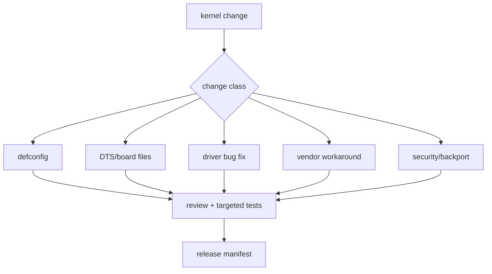
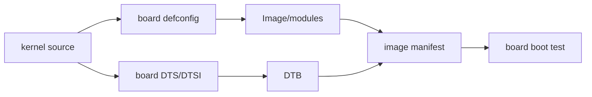
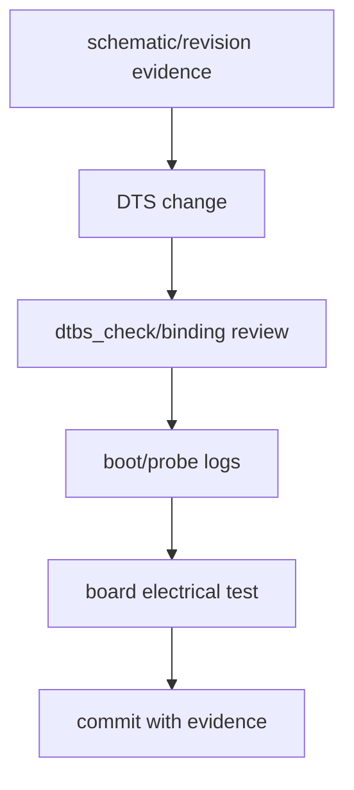
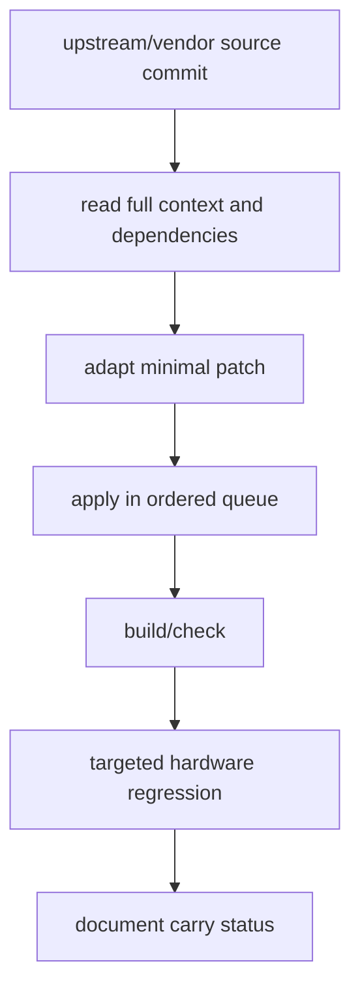
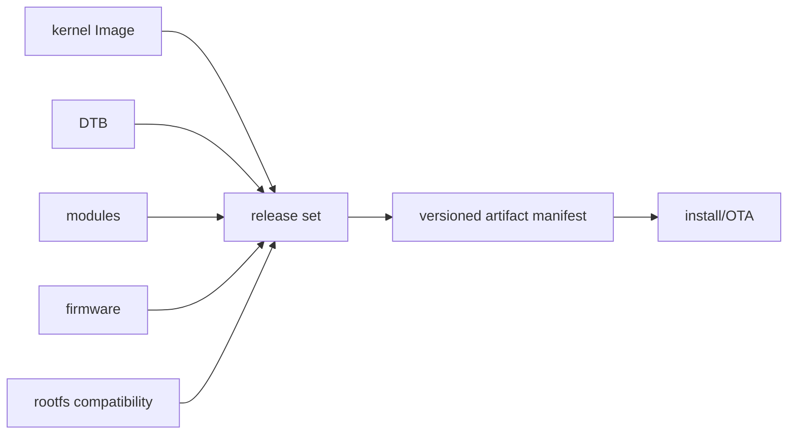
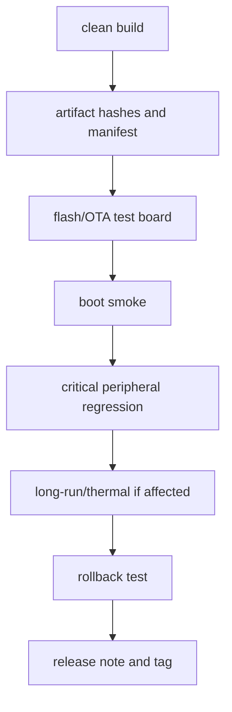

厂商 kernel 能启动并不意味着它可以长期维护。

产品后续会遇到 CVE、rootfs 更新、硬件 revision、新外设、工具链变化和客户现场问题。若修改只存在于开发机工作区、DTS 被直接覆盖、补丁没有来源，下一次 SDK 升级就会把 BSP 重新带回不可控状态。

本章以“将一个已验证的内核变更安全带入新版本并可回退”为主线，建立内核维护的版本、差异、验证和发布闭环。

## 1. 先将内核变更分类，而不是堆进一个补丁目录

内核维护中最常见的错误是把 defconfig、DTS、驱动 fix、vendor workaround、临时 debug 和第三方 backport 混在一起。

它们的升级策略、评审重点和回归范围完全不同。



| 类别 | 需要记录 | 主要风险 |
| --- | --- | --- |
| defconfig | 选项理由、依赖、大小影响 | 误关关键驱动或误开攻击面 |
| DTS | 原理图依据、板 revision、binding | 资源冲突、错误时序、不可启动 |
| 驱动修改 | 上游来源、问题复现、API 版本 | 生命周期/并发/DMA 回归 |
| workaround | 硬件条件、移除条件 | 永久保留临时规避 |
| backport | 上游 commit、前置依赖、CVE | 语义不完整、冲突 |
| debug | 启用期限、性能/安全影响 | 调试选项进入量产 |

一条提交应只描述一种明确意图。将“升级 kernel、改三份 DTS、加日志、修网口”混在同一变更中，会让回归失败后无法定位。

## 2. 第一步：让 defconfig 和 DTS 成为可审阅的板级 ABI

defconfig 是产品的内核功能选择；DTS 是板子与 driver 的硬件契约。

它们需要和源码一样进入版本控制、code review 和版本化发布。



不要手工编辑生成的 .config 后只保存整份巨大配置。

先用目标 defconfig 建立配置，再通过 menuconfig 或受控脚本修改，最后使用 savedefconfig 生成最小差异并审阅。

```sh
make ARCH=arm ACTUAL_BOARD_defconfig
make ARCH=arm menuconfig
make ARCH=arm savedefconfig
diff -u arch/arm/configs/ACTUAL_BOARD_defconfig defconfig
```

命令的 ARCH、defconfig 路径和构建方式必须按 SDK 调整。关键在于最终提交的是可从零重建的最小配置，而不是开发机残留。

### DTS 变更必须可追溯到硬件

每个 pin、regulator、clock、reset、PHY delay、memory region 和 endpoint 修改都应关联原理图、datasheet 或硬件 revision。



运行时的 /sys/firmware/devicetree/base 和编译产物 DTB 都应核对，避免“改了源码 DTS，却从旧分区加载了另一个 DTB”的问题。

## 3. 第二步：维护有来源和顺序的 patch queue

vendor kernel 与上游 kernel 的 API、driver、binding 和 backport 状态可能差异很大。

不要从网页复制一段 patch 就直接应用到产品树；先记录原始 commit、适用版本、依赖、冲突处理和测试范围。



patch queue 可以按主题和顺序管理，例如：

```text
patches/
  0001-board-defconfig-enable-required-driver.patch
  0002-arm-dts-longway-revB-camera-power.patch
  0003-net-phy-fix-reset-delay.patch
  series
README.md
```

文件名应表达目的而非作者临时缩写。README 记录每个 patch 的来源、上游状态、适用 SDK、移除条件和回归证据。

### 不要忽视隐含依赖

一个安全修复可能依赖前置 refactor；一个 driver backport 可能需要新的 helper、Kconfig 或 DT binding。

“能编译”只证明语法和链接通过，不证明在旧 kernel 语义下正确。

对每个 patch，至少比较被修改文件在来源版本和目标版本的完整相关函数，而不是只解决 patch 冲突标记。

## 4. 第三步：将模块 ABI、firmware 和 rootfs 纳入升级包

外部模块、/lib/modules、firmware 与 kernel Image 必须匹配。

只升级 Image 而保留旧 module，或升级 rootfs 时覆盖了 firmware，都可能导致启动后才出现 unknown symbol、vermagic mismatch 或设备 probe 失败。



升级前后记录：

| 项目 | 核对方式 |
| --- | --- |
| kernel release | uname -r 与 modules 目录 |
| module vermagic | modinfo 与实际 kernel |
| DTB | artifact hash、启动日志、live DT |
| firmware | 文件 hash、driver request 日志 |
| command line | bootloader/env/partition 参数 |
| userspace ABI | 应用依赖的 ioctl、media/net/audio 行为 |

内核没有稳定的通用 module ABI 承诺。若产品依赖 out-of-tree module，每次 kernel/toolchain/config 变化都必须重建并回归。

## 5. 第四步：用升级、回退和 release note 证明长期可维护

发布一个 kernel 版本前，需要从干净构建开始，完成 boot、关键外设、性能/长稳和升级/回退测试。



release note 应说明内核/SDK 基线、硬件适用范围、变更类别、已知限制、升级顺序、回退方法、产物 hash 和完成的测试。

它不应只是“优化 BSP”或“修复一些问题”的泛化描述。

| 触发变更 | 最小回归 |
| --- | --- |
| DTS pin/power/clock | 冷启动、对应外设、热重启 |
| MMC/MTD | 挂载、写入、掉电恢复、升级 |
| camera/audio | stream start/stop、长稳、格式/时钟 |
| net/USB | 枚举/link、压力、拔插/重连 |
| PM/watchdog | suspend/resume、reset reason、idle power |
| security backport | 修复复现、功能回归、性能影响 |

### 本章练习

将当前板子的 kernel defconfig、DTS 差异和外部 patch 归类，删除或单独标记临时 debug 改动。

为一个已验证 DTS 修改补齐原理图依据、live DT 对比、boot log 与板端电气验证。

为一个上游或 vendor bug fix 建立带来源、依赖和测试结果的 patch queue 条目。

在测试板上执行一次 kernel、DTB、module、firmware 成套升级和回退，确认所有关键驱动重新绑定。

### 本章验收

完成本章后，应能独立回答：

- 为什么 vendor kernel 的可启动不等于可长期维护；
- defconfig 与 DTS 为什么属于板级 ABI；
- 为什么每个 DTS 修改都需要原理图和运行时证据；
- patch queue 如何记录来源、顺序和移除条件；
- 为什么 backport 不能只解决编译冲突；
- 为什么 kernel、DTB、module、firmware 和 rootfs 必须成套发布；
- 为什么 out-of-tree module 每次内核变化都需重建；
- release note 和回退测试如何降低现场升级风险。

当每项内核差异都有来源、理由、验证和退出策略时，BSP 才能从一次性项目变成可持续维护的软件基础。

### 内核变更审阅模板

- 变更的唯一目标和影响的硬件 revision；
- 源码基线、SDK 版本与工具链版本；
- 原理图、datasheet 或上游 commit 依据；
- 被修改的 defconfig、DTS、driver、binding 和 patch 文件；
- 新增或移除的 Kconfig/DT binding 依赖；
- 冷启动、热重启和对应外设的最小回归；
- module vermagic、firmware 和 userspace ABI 影响；
- 性能、功耗、时序或镜像大小变化；
- 已知限制、回退 commit 和 patch 移除条件；
- 产物 hash、测试板 revision 和结果包位置。

每次 vendor SDK 升级前，先生成旧树与新树的配置、DTS、patch applicability 报告。先解决最小启动链，再逐一迁移网络、存储、相机、音频和 PM；不要在没有可启动基线时同时合入全部 feature patch。

使用 git bisect 或可重复的测试镜像定位回归时，应固定 board revision、外设、环境和 workload。内核问题常与 Dts、firmware 或 rootfs 成套变化，只有版本清单完整才能保证二分结论成立。

安全修复的发布说明需要写清实际受影响的配置和攻击面。一个未启用的 driver 不应被夸大为产品漏洞；反过来，vendor patch 改动共享基础设施时不能只以 CVE 描述代替功能回归。

对长期无法上游的 board workaround，要定期重新评估。硬件 revision 已修复、上游 binding 已演进或 vendor kernel 已包含等价实现时，应移除旧补丁以降低维护负担。

### 升级前逐项核对

- BootROM/bootloader 基线：
  是否仍能加载新的 Image、DTB 和分区格式。
- Kernel command line：
  root、console、memory、CMA、IOMMU 与 debug 参数是否仍符合产品。
- CPU/SoC 基础：
  冷启动、SMP、timer、clocksource 和 regulator 日志是否干净。
- 存储：
  eMMC/MTD 识别、挂载、数据提交和升级路径是否通过。
- 网络：
  MAC、PHY、link、长流量和重连统计是否与基线一致。
- USB：
  固定角色、VBUS、枚举、拔插和 gadget 路径是否通过。
- Camera：
  sensor probe、media graph、首帧、长采集和 CSI error 是否通过。
- Audio：
  codec、DAI clock、capture/playback、XRUN 和恢复是否通过。
- Power management：
  runtime PM、suspend/resume、wake reason 和 idle power 是否通过。
- DMA/IOMMU：
  buffer 流转、IOMMU fault、解绑和压力测试是否通过。
- Firmware：
  request_firmware、remoteproc/rpmsg 或 accelerator firmware 是否版本一致。
- Security：
  secure boot、权限、debug 开关和受影响 CVE 配置是否复核。
- Rootfs：
  module、firmware、service、用户和配置是否与内核 ABI 对齐。
- Toolchain：
  compiler、binutils、LTO/CFI 或 ABI 改变是否有专门回归。
- Debug：
  临时 printk、trace、test key、开放接口是否已删除或受控。
- Release：
  artifact hash、tag、release note 和回退包是否可获取。

每个条目都应链接到自动测试、命令输出或硬件记录。清单不取代深入验证，它保证升级时不会因只关注当前 bug 而遗漏已经稳定的关键链路。

维护分支也要有结束策略。已不再支持的硬件 revision、临时 debug 和过期 firmware 应在 release note 中明确状态，避免未来工程师把它们当作当前产品必需条件。

任何与上游或 vendor 冲突的 patch，在下一次基线升级时都要重新审阅，而不是机械 rebase。代码能套用不等于原始问题和修复假设仍然存在。

发布 tag 必须同时标记源码、构建配置和 artifact manifest。只给 Git 仓库打 tag 而不保存实际刷写镜像，现场回归仍无法做到精确复现。

对性能敏感 patch，基线和新版本要在同一硬件、同一 workload 和同一 thermal 环境下比较，不能从不同开发者口头描述中得出优化结论。

内核维护的最终目标是减少未知差异。每一次删除过期 patch、收敛 DTS、自动化回归和写清 release note，都是降低下一次升级风险的实际工作。

每个维护分支应声明支持期限和安全修复策略。

将 vendor patch 的原始邮件、issue 或 commit 链接保存到仓库说明中。

对可能影响用户态的 ioctl、sysfs、media 和网络行为，维护兼容性测试。

对 DTS binding 变化，先确认 bootloader 和 kernel 是否使用同一份 DTB。

对大版本升级，保留一块稳定基线板和一块迁移测试板，避免同时失去回退环境。

任何量产镜像都应能追溯到唯一源码 tag 与构建日志。

发布后发现问题时，先冻结有风险的推送，再用 manifest 确定受影响范围。

修复合入后重新运行问题复现与关键子系统回归，不只验证编译。

对未使用功能的裁剪，保留 Kconfig 理由，避免硬件扩展时重新猜测。

对板级私有代码，明确是否可上游、为何暂时不可以及接口维护者。

对每一份 release note，列出已验证和未验证的硬件组合。

长期维护要避免“最后一个知道补丁含义的人离开”这种单点知识风险。

> 🏷️ Linux BSP · kernel maintenance · defconfig · DTS · patch queue · module ABI · release
> 🏷️ Linux BSP · kernel maintenance · defconfig · DTS · patch queue · module ABI · release
> 🏷️ Linux BSP · kernel maintenance · defconfig · DTS · patch queue · module ABI · release
> 🏷️ Linux BSP · kernel maintenance · defconfig · DTS · patch queue · module ABI · release
