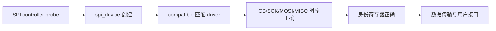
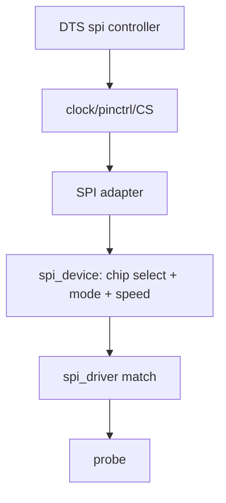
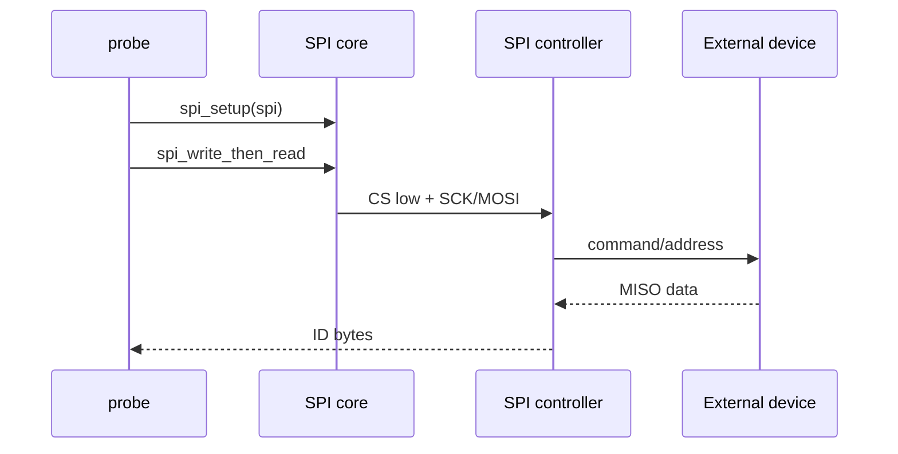
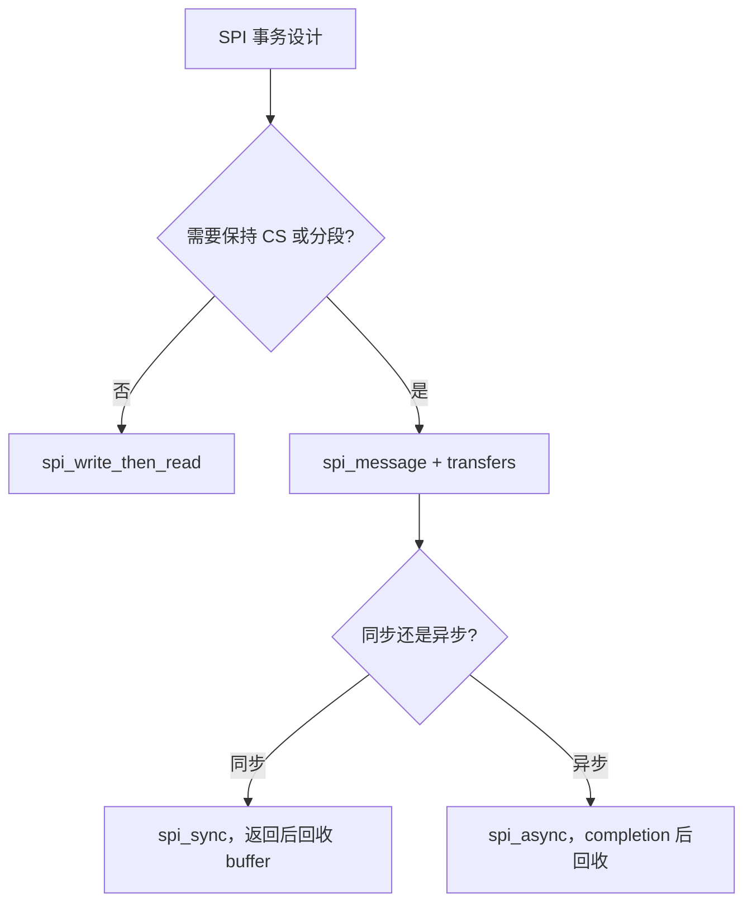
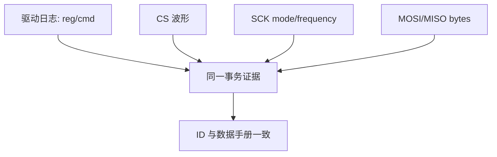
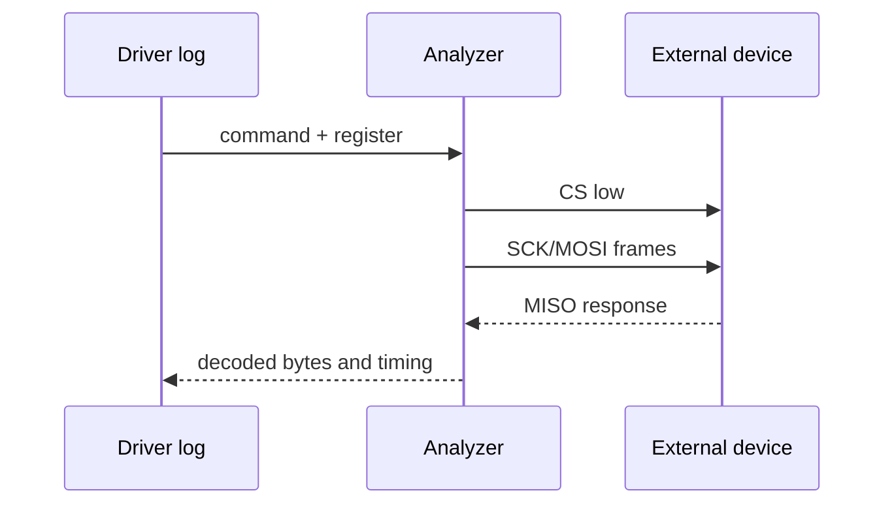
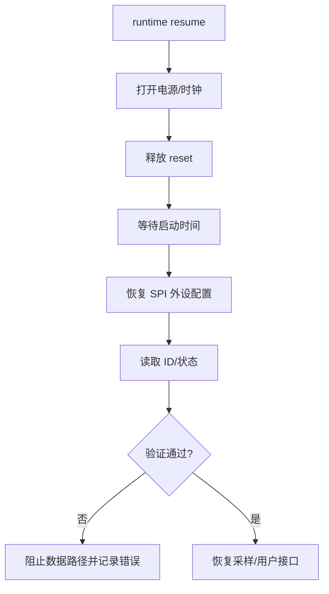

本篇完成一个明确任务：让一颗板载 SPI 外设被 Linux 正确创建和匹配，驱动能够读到身份寄存器并完成一次可靠的数据传输。

SPI 没有统一的设备发现机制，片选、时钟极性、采样边沿、字长、最高频率和命令帧都由外设数据手册决定。驱动能发送波形，不代表外设理解波形；必须把原理图、DTS、spi_device 参数和逻辑分析仪放在同一条验证路径中。

## 1. 先确定外设协议和验收结果

准备原理图、数据手册、当前 DTB、逻辑分析仪和目标 rootfs。先写出这张协议表：

| 项目 | 需要确认 | 证据 |
|---|---|---|
| 片选 | CS 由控制器硬件管理还是 GPIO 模拟 | 原理图、SPI controller binding |
| mode | CPOL、CPHA，即 mode 0-3 | 数据手册时序图 |
| bit order | MSB first 还是 LSB first | 数据手册 |
| word size | 8/16/24 bit 或特殊帧 | 数据手册 |
| 频率 | 最大 SCK、上电后限制 | 数据手册、波形 |
| 命令帧 | command/address/dummy/data 长度 | 数据手册 |

本篇的验收包含三层：



开始前记录总线和设备基线：

```bash
dmesg -T | rg -i 'spi|spidev|flash|sensor|pinctrl' | tail -120
find /sys/bus/spi/devices -maxdepth 1 -type l -printf '%f\n' | sort
find /dev -maxdepth 1 -name '*spi*' -o -name '*sensor*'
```

不要先用任意用户态工具写入未知 SPI 地址。SPI 没有地址 ACK，片选拉低后即可能改变外设状态；先用数据手册确定一条无副作用的 ID 读取事务。

## 2. 第一步：在 DTS 中描述控制器、片选和 spi_device

SPI 子节点的 `reg` 通常表示片选编号，不是外设内部寄存器地址。`spi-max-frequency` 是当前设备允许的最大 SCK，`spi-cpol`/`spi-cpha` 共同表达 mode；具体属性以 controller 和设备 binding 为准。

```dts
&<spi-controller> {
    status = "okay";
    pinctrl-names = "default", "sleep";
    pinctrl-0 = <&<spi-default-pins>>;
    pinctrl-1 = <&<spi-sleep-pins>>;

    peripheral@<chip-select> {
        compatible = "example,board-spi-device";
        reg = <<chip-select>>;
        spi-max-frequency = <10000000>;
        /* 根据数据手册选择以下 mode 属性。 */
        spi-cpol;
        spi-cpha;
        reset-gpios = <&<gpio-controller> <line> GPIO_ACTIVE_LOW>;
    };
};
```



编译最终 DTB 并重启后，分三步检查：

```bash
dtc -I dtb -O dts <built-board.dtb> | rg -n -C 5 'spi|peripheral@'
find /sys/class/spi_master -maxdepth 1 -type l -printf '%f\n' 2>/dev/null
find /sys/bus/spi/devices -maxdepth 1 -type l -printf '%f\n' | sort

DEV=<spi-bus>.<chip-select>
cat /sys/bus/spi/devices/$DEV/modalias 2>/dev/null
readlink -f /sys/bus/spi/devices/$DEV/driver 2>/dev/null
```

没有 SPI master 时，先修 controller 的 clock、reset、pinctrl 和 Kconfig；有 master 没有 child 时，检查最终 DTB 和片选；child 存在但没有 driver 时，检查 `compatible`、模块和匹配表。

## 3. 第二步：实现 probe 和第一条安全传输

SPI 驱动通常保存 `struct spi_device *`，在 probe 中设置 bits per word、mode 和最大速度，然后读取身份寄存器。不要把速度和 mode 写成全局常量覆盖其他 spi_device，每个设备实例可能有不同协议。



```c
struct spi_demo {
    struct spi_device *spi;
    struct mutex lock;
    u8 chip_id;
    bool online;
};

static int spi_demo_probe(struct spi_device *spi)
{
    struct spi_demo *demo;
    u8 cmd = SPI_DEMO_CMD_READ_ID;
    u8 id = 0;
    int ret;

    demo = devm_kzalloc(&spi->dev, sizeof(*demo), GFP_KERNEL);
    if (!demo)
        return -ENOMEM;
    demo->spi = spi;
    mutex_init(&demo->lock);

    spi->bits_per_word = 8;
    spi->mode = SPI_MODE_0;
    spi->max_speed_hz = <verified-safe-frequency>;
    ret = spi_setup(spi);
    if (ret)
        return dev_err_probe(&spi->dev, ret, "spi setup\n");

    ret = spi_write_then_read(spi, &cmd, 1, &id, 1);
    if (ret)
        return dev_err_probe(&spi->dev, ret, "read chip id\n");
    if (id != SPI_DEMO_EXPECTED_ID)
        return dev_err_probe(&spi->dev, -ENODEV, "unexpected chip id\n");

    demo->chip_id = id;
    demo->online = true;
    spi_set_drvdata(spi, demo);
    return spi_demo_register_interface(demo);
}
```

这里的命令字节、ID 长度和期望值来自数据手册。示例中的占位频率必须替换成已经通过波形验证的值；高速率应在低速率 ID 读取成功后逐步增加。

## 4. 第三步：组织复杂传输并验证 buffer 生命周期

当一个事务包含 command、address、dummy 和 data，使用 `spi_message` 与多个 `spi_transfer` 表达帧边界。是否保持 CS、是否在 transfer 之间插入间隔，取决于 controller 和设备协议。


```c
static int spi_demo_read_reg(struct spi_demo *demo, u8 reg,
                             void *rx, size_t len)
{
    u8 tx[2] = { SPI_DEMO_CMD_READ, reg };
    struct spi_transfer xfers[] = {
        { .tx_buf = tx, .len = sizeof(tx) },
        { .rx_buf = rx, .len = len },
    };
    struct spi_message msg;
    int ret;

    spi_message_init(&msg);
    spi_message_add_tail(&xfers[0], &msg);
    spi_message_add_tail(&xfers[1], &msg);
    ret = spi_sync(demo->spi, &msg);
    return ret ? ret : msg.status;
}
```

不要让栈上的 tx/rx buffer 在异步传输完成前离开作用域。同步 `spi_sync()` 返回后 buffer 可以回收；若使用异步 `spi_async()`，buffer 必须存活到 completion 回调，且私有对象需要引用保护。



如果传输成功但数据全为 `0xff` 或固定值，先看 CS、MOSI/MISO 方向、mode 和外设是否需要 dummy cycle；如果传输返回错误，查看 controller 日志和电源/pinctrl，而不是立刻换一个寄存器地址。

## 5. 第四步：用逻辑分析仪和回归矩阵完成验收

逻辑分析仪至少抓取一次 ID 读取和一次数据读取，标记 CS、SCK、MOSI、MISO。把解码器的 mode、bit order、频率和帧边界与数据手册逐项对照。



```bash
dmesg -T | rg -i -C 4 'spi|chip id|transfer|probe'
find /sys/bus/spi/devices/$DEV -maxdepth 2 -type f -print 2>/dev/null
cat /proc/interrupts
```

回归时按从简单到复杂的顺序：

| 场景 | 预期 | 证据 |
|---|---|---|
| 低速 ID 读取 | 每次 ID 正确 | 日志、MISO 字节 |
| 提高频率 | 在规格范围内仍正确 | SCK 波形、错误计数 |
| 连续寄存器读取 | 地址自增语义正确 | 每个 byte 与手册 |
| reset 后读取 | 设备回到已知状态 | reset 波形、ID |
| suspend/resume | 配置恢复、事务不访问断电设备 | PM 日志 |
| driver unbind | 无异步回调访问释放对象 | remove 日志、KASAN |

故障判断：

| 表现 | 优先检查 | 可能原因 |
|---|---|---|
| 没有 spi_device | 运行 DTB、片选编号 | 节点未加载或 reg 错 |
| driver 不绑定 | compatible/module | 匹配表或 Kconfig |
| 全是 `0xff` | CS、MISO、供电、mode | 外设未选中或线悬空 |
| 字节错位 | CPHA、word size、dummy | 采样边沿/帧定义错误 |
| 低速正常高速失败 | 上拉/信号完整性/频率 | 超出器件或板级能力 |
| 读写偶发超时 | PM、锁、controller | 设备被复位或总线状态异常 |

完成本篇的学习验收：能从原理图写出 SPI 协议表，能从运行时 sysfs 证明 spi_device 与 driver，能用逻辑分析仪解释一条事务，并能区分“没有设备”“协议错误”和“信号完整性问题”。

### 把一条错误事务拆成四个观察点

SPI 没有 I2C 的 ACK 语义，调试时更需要把传输拆成片选、时钟、发送字节和接收字节四个观察点。每次实验只修改一个参数：先固定低速，再改变 mode，再改变频率，最后才尝试更复杂的命令帧。



如果 CS 根本没有拉低，检查 controller 的片选映射；如果 CS 正常但 SCK 不动，检查 runtime PM、controller enable 和 transfer 返回值；如果 MOSI 正确而 MISO 悬空，检查器件供电、MISO 复用和芯片是否真正被选中；如果字节有规律地错位，优先检查 CPHA、bit order 和 dummy cycle。

### reset 和 suspend 后重新验证协议

SPI 外设可能在 reset 或低功耗后丢失 mode、时钟分频和内部配置。驱动应在 resume 后恢复必要寄存器，并在第一次数据读取前确认设备已离开 reset。不要只依赖“SPI controller 仍然存在”判断外设可用。



记录每次 resume 后的第一条事务，比较它与冷启动事务是否相同。若第一条失败、第二条成功，可能是启动等待时间或 reset 脉冲不足；若所有事务都失败，回到电源、CS 和 pinctrl 证据。

### 传输 API 的选择记录

| 需求 | API/结构 | 需要特别验证 |
|---|---|---|
| 单个命令加少量返回值 | `spi_write_then_read` | command 和返回长度 |
| 多段帧、保持片选 | `spi_message` | transfer 顺序和 CS 语义 |
| 传输期间不能阻塞调用者 | `spi_async` | buffer、completion、引用计数 |
| 用户态直接调试 | `spidev` 仅限受控场景 | 不替代正式设备驱动和权限设计 |

把这个选择写进驱动说明，后续增加 DMA、异步队列或标准 IIO 接口时才能判断 buffer 和上下文约束。最终保留协议表、DTB、驱动日志和波形文件，作为 SPI 设备变更的回归基线。

一次完整的实验记录应包含：

- 板卡和 SPI 外设硬件版本。
- controller、片选编号和运行时 `spi_device` 名称。
- CPOL、CPHA、bit order、word size 和实际 SCK 频率。
- ID 读取的 command、address、dummy 和返回字节。
- 冷启动、reset、suspend/resume 后的第一条事务。
- 失败时的 CS、SCK、MOSI、MISO 波形与驱动 errno。

不要只保存逻辑分析仪截图而省略驱动上下文；同一组字节在不同片选和寄存器状态下可能代表完全不同的协议阶段。

完成这份记录后，再把安全频率逐步提升，并在每个频率点重复 ID、数据、reset 和低功耗测试。

> 🏷️ 标签：Linux BSP、SPI、spi_device、spi_driver、spi_message、逻辑分析仪、设备时序

提交前确认每个占位符都已在真实板卡记录中替换，避免示例频率、片选或 mode 被误当成固定硬件参数。

同时保存低速基线和目标频率的波形，确保性能调整没有牺牲协议可靠性。

协议表、最终 DTB 和驱动日志应使用同一块板卡版本。

这样发生字节错位时可以先排除硬件版本差异。

回归通过后再把频率优化提交到产品分支。

如果 mode 改动影响所有传输，应同时更新协议表和分析仪配置。

不要用一次成功的读 ID 代替连续数据和复位后的测试。

还应记录连续读取的地址自增行为。

还应记录命令之间的片选变化。

还应记录不同频率下的错误计数。

还应记录 suspend/resume 后的第一条事务。

还应记录 reset 脉冲的宽度和等待时间。

还应记录逻辑分析仪使用的 mode 解码设置。

还应记录驱动版本与数据手册版本。

这样 SPI 协议回归才不会依赖一张孤立截图。

最后把成功和失败的波形文件与驱动日志放在同一目录。

目录名包含板卡、内核和 DTB 标识。

后续修改时先比较这份基线。

不要覆盖原始实验文件。

保留失败样本有助于判断回归。
