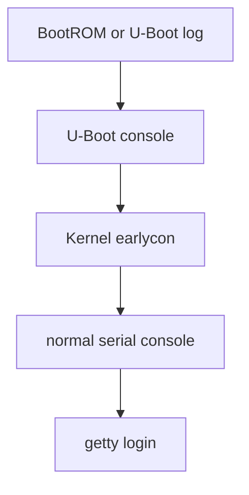

串口既是最早的启动观测通道，也是最容易被“能打印几行字”掩盖问题的接口。BSP 需要区分硬件 UART、Linux serial driver、TTY 设备和 console 参数，并确认 U-Boot 与内核是否使用同一套引脚和波特率。

## 1. UART 软件栈

```mermaid
flowchart LR
    A[UART controller] --> B[serial driver]
    B --> C[serial core]
    C --> D[TTY layer]
    D --> E[/dev/ttySx]
    C --> F[kernel console]
    F --> G[boot log]
```



earlycon 用于正常 serial driver 注册前的日志；其地址、类型和参数依赖 SoC 文档与内核配置。不要把别的芯片的 earlycon 地址复制到 RV1126。

## 2. DTS 与命令行要一致

```dts
&uart2 {
    pinctrl-names = "default";
    pinctrl-0 = <&uart2_xfer>;
    status = "okay";
};
```

```text
console=ttyS2,1500000n8
```

上例中的编号、pinctrl label 和波特率仅表示结构。真实 console 名称可通过健康系统的 `/proc/cmdline`、`dmesg | grep console`、DTS aliases 和 U-Boot 环境变量确认。

## 3. 串口收发的基本观察

```bash
cat /proc/cmdline
dmesg | grep -Ei 'console|ttyS|serial'
cat /proc/tty/driver/serial 2>/dev/null
ls -l /dev/ttyS* /dev/ttyAMA* 2>/dev/null
stty -F /dev/ttyS2 -a
```

串口乱码优先检查电平标准、TX/RX 交叉、GND、波特率、时钟源和终端设置。只有日志连续、字符正确、重启时无丢首字，才进入 tty flow control 或应用协议问题。

## 4. console 与普通 tty 的差别

console 是内核日志输出目标，可能在 panic、原子上下文或早期启动中工作；普通 tty 面向用户态读写。把高吞吐二进制协议与 console 共用一个口会造成日志污染和帧破坏，产品设计应预留独立调试通道或明确的复用协议。

## 5. 验证、练习与里程碑

**验证步骤**：保存一次完整冷启动日志，核对 U-Boot console、kernel `console=`、DTS uart 节点和目标机 tty 名称。再用 loopback 或另一设备完成收发测试。

**练习**：解释为何内核已经启动但串口没有后续日志时，`earlycon` 正常并不能证明普通 serial driver 已工作。

**里程碑**：能按“物理链路 -> pinctrl/DTS -> bootargs -> serial core -> getty”顺序定位串口问题。
