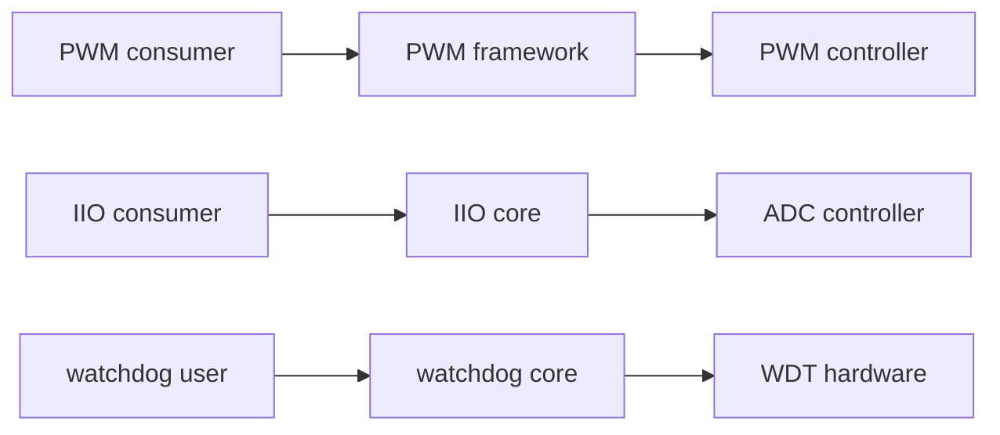
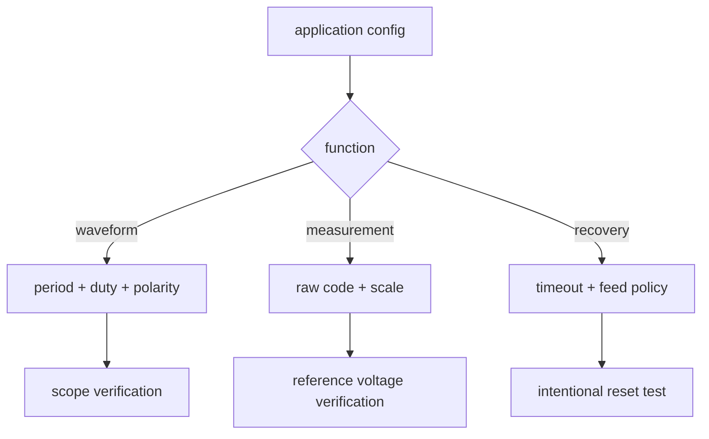

PWM、ADC 和 watchdog 分别连接执行、采集与可靠性，但它们都应优先接入已有内核框架。绕开框架直接导出寄存器不仅重复实现权限和生命周期，也会破坏与 pinctrl、PM、时钟和用户态工具的协作。

## 1. 三类框架的职责





## 2. PWM 用时间而非百分比表达

PWM framework 使用 `period` 和 `duty_cycle`，通常以纳秒表示：

```c
struct pwm_state state;

pwm_get_state(priv->pwm, &state);
state.period = 20000000;     /* 20 ms */
state.duty_cycle = 1500000;  /* 1.5 ms */
state.enabled = true;
ret = pwm_apply_state(priv->pwm, &state);
```

频率、极性、可用通道和 pinctrl 由硬件决定。示例常用于解释单位，不保证任意外设支持 20 ms 周期。示波器验证应看周期、占空比、边沿质量和 enable 后的实际引脚复用。

## 3. IIO 的原始值和物理量

```bash
ls /sys/bus/iio/devices
cat /sys/bus/iio/devices/iio:deviceX/name
cat /sys/bus/iio/devices/iio:deviceX/in_voltage0_raw
cat /sys/bus/iio/devices/iio:deviceX/in_voltage0_scale
```

ADC 原始码不能直接等价于电压。物理量通常由 raw、scale、offset 和参考电压共同计算，单位要以 해당 IIO 属性文档为准。若采样不稳定，先检查输入阻抗、参考源、采样时间和地线，而不是仅在软件中取平均。

## 4. watchdog 是恢复机制，不是定时器

```c
/* 用户态通常经由 /dev/watchdog 使用框架 ABI */
int fd = open("/dev/watchdog", O_WRONLY);
write(fd, "\0", 1);  /* feed only after real health checks */
```

喂狗动作必须建立在“系统关键路径健康”的判断上。无条件周期写入只能证明定时线程还活着，不能证明传感器、网络、存储或主业务正常。启动前要明确 timeout、nowayout、关闭行为以及复位后的日志留存策略。

## 5. 验证、练习与里程碑

**验证步骤**：测量一个 PWM 输出并与配置周期比对；读取 ADC raw/scale 并与万用表比较；在开发板上设置可控的 watchdog timeout，停止喂狗并确认复位和复位原因记录。

**练习**：写出“业务健康喂狗”必须包含的三个条件，说明为何不能只依赖一个周期 timer。

**里程碑**：能从 sysfs/IIO/PWM 框架状态和仪器测量同时证明外设真实工作。
