DMA 问题最危险的地方，是它可能在短时间、小数据量或某个编译选项下看起来完全正常。

随后在连续视频帧、缓存压力或 IOMMU 开启时出现花屏、随机错误、地址 fault 或数据复用过早。

这类问题通常不是“缓存写得不够多”，而是驱动没有把 buffer 的所有权交接说清楚。

本章以一个可验证的 DMA 事务为主线。

先用 coherent 内存建立小型描述符控制路径。

再用 streaming 映射处理普通数据 buffer。

最后说明在 V4L2、ISP、编码器和 NPU 之间共享大 buffer 时，DMA-BUF 与 fence 为什么仍然需要明确同步。

所有示例仅说明 Linux DMA API 的结构。

实际 DMA 位宽、IOMMU 配置、控制器寄存器、描述符格式与完成中断必须以当前 SoC、驱动和 SDK 为准。

## 1. 先把一次 DMA 事务的地址和所有权写清楚

开始写 API 前，先回答三个问题。

CPU 当前拿到的地址是什么。

设备被允许写入的地址是什么。

从 CPU 写数据到设备完成，再到 CPU 读取结果，每一段时间里谁拥有这个 buffer。

如果这三件事不能写成一张流程图，就还不应开始调用 DMA API。

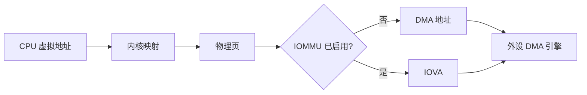

CPU 虚拟地址是内核 C 指针所处的地址空间。

物理地址描述 RAM 页面在物理内存中的位置。

DMA 地址是驱动应当写入外设寄存器或描述符的地址。

当 IOMMU 存在时，设备看到的 DMA 地址通常是 IOVA，而不是 CPU 物理地址。

因此，普通指针、物理地址与 DMA 地址不能被视为同一个数值。

尤其不要用 virt_to_phys 把普通内存指针“转换”后直接写进 DMA 寄存器。

这种做法绕过了 IOMMU、DMA mask、缓存维护和平台地址翻译。

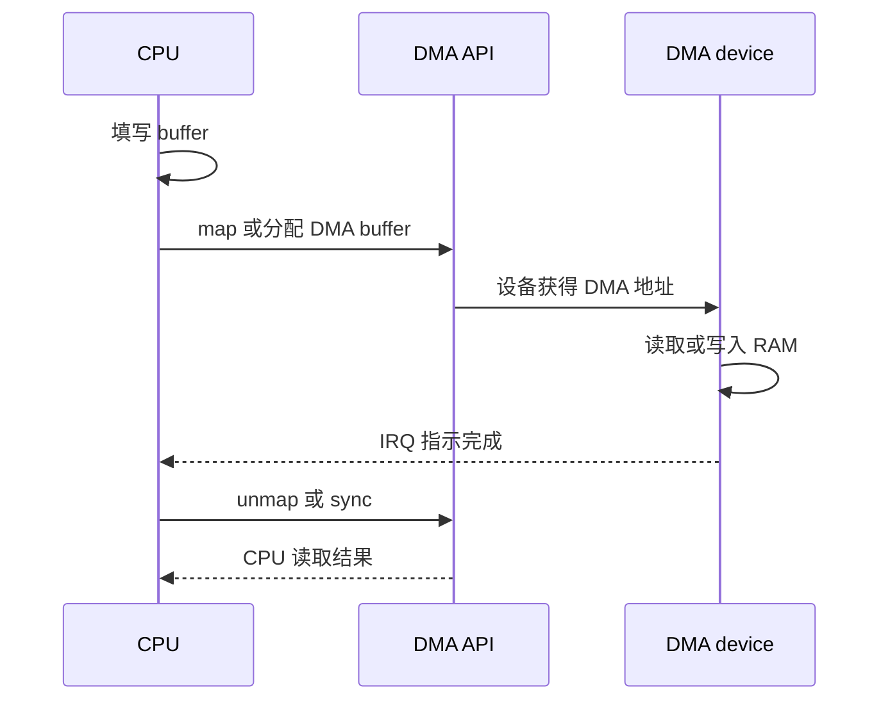

每个 DMA 事务至少记录以下字段。

| 字段 | 要记录的内容 | 用途 |
| --- | --- | --- |
| CPU 地址 | 仅用于驱动访问与调试 | 不能写入硬件寄存器 |
| DMA 地址 | API 返回的 dma_addr_t | 供设备执行 DMA |
| 长度 | 实际映射长度 | 与寄存器长度一致 |
| 方向 | TO_DEVICE、FROM_DEVICE 或 BIDIRECTIONAL | 表达缓存与权限语义 |
| 所有者 | CPU、设备或子系统 | 禁止并发错误访问 |
| 完成点 | IRQ、轮询或 fence | 决定何时交还所有权 |

方向不是性能提示。

它告诉 DMA API 当前数据从哪一方流向哪一方。

CPU 向设备发送数据时用 DMA_TO_DEVICE。

设备向内存写入供 CPU 读取的数据时用 DMA_FROM_DEVICE。

只有确实存在双向读写的事务才应使用 DMA_BIDIRECTIONAL。

过度使用双向方向会降低检查能力，也会掩盖驱动对数据流的理解不足。

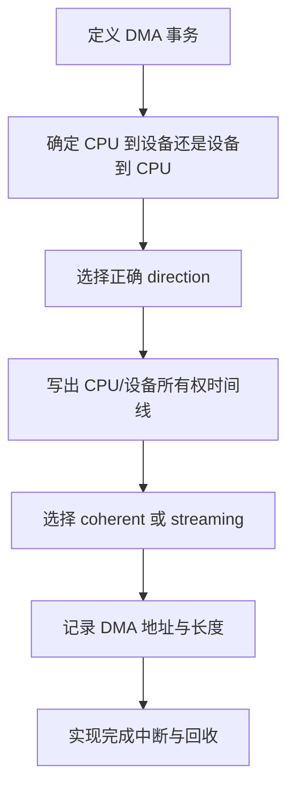

开始实验前，确认当前内核是否提供 DMA API debug 或 IOMMU fault 日志。

不同内核的配置与 debugfs 路径不同，缺少这些功能并不影响编写正确 API，但会减少故障证据。

```bash
dmesg -T | grep -Ei 'dma|iommu|smmu|fault'
find /sys/kernel/debug -maxdepth 3 -type d 2>/dev/null | grep -Ei 'dma|iommu'
grep -E 'DMA_API_DEBUG|IOMMU' /proc/config.gz 2>/dev/null || true
```

上面的 config 查询只在系统启用了对应接口时可用。

若没有 /proc/config.gz，应从当前内核的 defconfig 或编译配置确认。

不要为了打开调试选项而在生产镜像上随意改变内存布局。

先在开发镜像中完成本章实验。

### 选择 coherent 还是 streaming 的起点

coherent 内存适合小型、长期存在、CPU 和设备需要共同看到内容的控制结构。

典型例子是 DMA 描述符环、命令 mailbox 或硬件可读取的参数块。

streaming 映射适合普通数据 buffer，例如一条待发送的数据、一次采集的页面或上层传下来的临时内存。

同一份数据不应因为“方便”而全部用 coherent 内存。

大容量 coherent 分配可能增加内存压力，也可能不符合已有子系统的 buffer 管理模型。

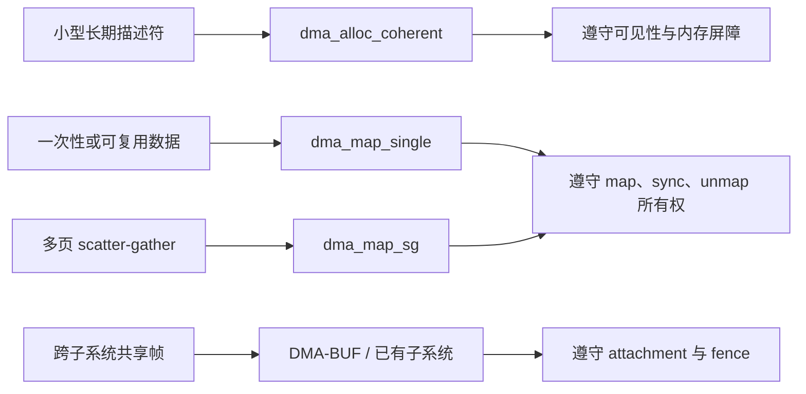

本章的顺序不是偏好，而是排错策略。

先让描述符路径使用 coherent 内存完成一次可观察的 DMA。

再引入 streaming 映射和缓存所有权。

最后再让同一个 buffer 被多个设备共享。

这样当问题出现时，能够知道是控制器、内存映射、缓存交接还是跨设备同步导致。

## 2. 第一步：用 coherent 内存完成一个可观察的描述符路径

先从一个小的、固定大小的描述符或控制块开始。

描述符的字段由 DMA 控制器手册定义。

示例中只保留地址、长度和控制字段，用于说明 CPU 与设备共同看到同一组描述信息。

```c
struct board_dma_desc {
    __le32 control;
    __le32 length;
    __le64 buffer_addr;
    __le32 status;
    __le32 reserved;
};
```

实际描述符的字节序、对齐、位域和地址宽度必须以硬件手册为准。

不要因为 C 结构体看起来有相同字段就把它写入任意 DMA 引擎。

先在 probe 中为设备设置正确的 DMA mask。

需要支持 32 位还是更大地址空间，要根据控制器能力和当前 SoC 配置确认。

```c
ret = dma_set_mask_and_coherent(dev, DMA_BIT_MASK(32));
if (ret)
    return dev_err_probe(dev, ret, "unsupported DMA mask\n");

priv->desc_cpu = dma_alloc_coherent(dev, sizeof(*priv->desc_cpu),
                                    &priv->desc_dma, GFP_KERNEL);
if (!priv->desc_cpu)
    return -ENOMEM;
```

此处的 32 位只是示例。

若设备实际支持更高地址位宽，应设置为其可支持的范围。

若设置失败，不能继续使用一个猜测的地址宽度。

应回到设备能力、IOMMU 配置和底层驱动检查。

分配成功后，CPU 通过 desc_cpu 访问描述符。

设备通过 desc_dma 访问相同的描述符。

只有 desc_dma 可以被写入设备寄存器。

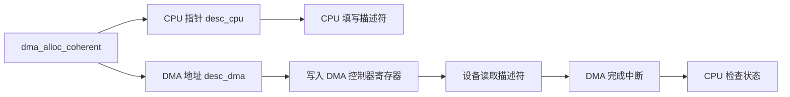

coherent 表示 CPU 和设备可以看到对同一内存的更新，而不需要每次读写都做显式 cache flush。

它不表示可以忽略顺序。

CPU 填写描述符字段后，需要在向硬件发出“描述符可用”信号前保证字段写入已经按正确顺序可见。

具体使用 write barrier、读状态寄存器或对应子系统 helper 的方式，要遵循同一控制器的现有驱动。

不要因为使用了 dma_alloc_coherent 就随意把多字段描述符拆成无顺序的并发写入。

一个常见的安全序列是：

1. CPU 写入地址、长度和控制字段；
2. CPU 执行当前驱动规定的内存顺序操作；
3. CPU 写入能让设备看到“描述符有效”的位，或按寄存器顺序通知硬件；
4. 设备读取描述符并开始事务；
5. IRQ 或状态位确认完成后，CPU 再读取完成状态。

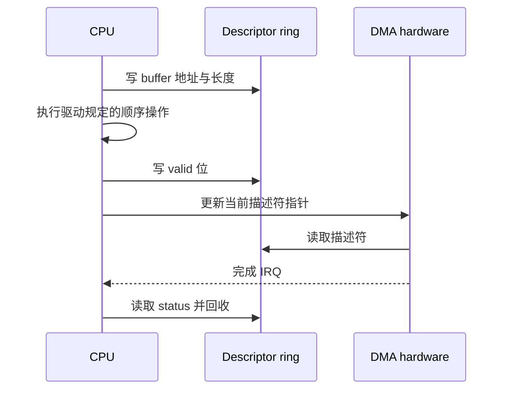

在第一次实验中，不要立即使用多个 ring、page fragment 和复杂的预取逻辑。

先让一条描述符只处理一个小的已知 buffer。

在每次提交前写入递增序号、固定长度和可识别模式。

在完成中断中打印有限的调试信息，记录描述符索引、DMA 地址、状态位和长度。

日志不要在高频路径无限打印。

过量 printk 会改变 IRQ 时序，甚至让一个偶发 DMA 问题暂时消失。

在 remove 或错误路径中，必须按所有权反向释放。

```c
if (priv->desc_cpu) {
    dma_free_coherent(dev, sizeof(*priv->desc_cpu),
                      priv->desc_cpu, priv->desc_dma);
    priv->desc_cpu = NULL;
}
```

不要用 kfree 释放 dma_alloc_coherent 的返回指针。

也不要在仍被硬件使用的描述符上执行 dma_free_coherent。

在释放前先停止 DMA 引擎、禁止或同步完成 IRQ，并确认没有旧事务仍能访问该描述符。

### coherent 路径的最小验收

本阶段通过的标准不是“驱动没有崩溃”。

应至少做到以下五点：

- dmesg 中没有 DMA mask、IOMMU 或映射错误；
- 每次提交的描述符长度与硬件完成状态一致；
- 已知 buffer 模式被设备按预期读取或写入；
- 连续重复事务不会出现描述符状态回退或随机错误；
- 停止、卸载或 reset 后不出现访问已释放内存的异常。

若设备从未发出完成中断，先确认设备寄存器得到的是 desc_dma 而非 CPU 指针。

随后检查 descriptor valid 位、地址对齐、长度、时钟、复位和 IRQ。

若完成中断存在但状态随机，先检查描述符字段的字节序、对齐和 CPU 写入顺序。

不要在这个阶段添加缓存刷新来“试试看”。

coherent 描述符路径的错误通常更容易通过控制器手册和地址记录查清。

## 3. 第二步：用 streaming 映射建立数据 buffer 的所有权协议

普通数据 buffer 通常不应永久分配为 coherent 内存。

例如发送给设备的一段命令、从设备接收的一块采样数据，往往只在一次事务或一个循环内被设备拥有。

这时使用 streaming DMA mapping。

其关键不是函数名，而是所有权规则：map 后到 unmap 前，CPU 不可随意访问正被设备拥有的数据。

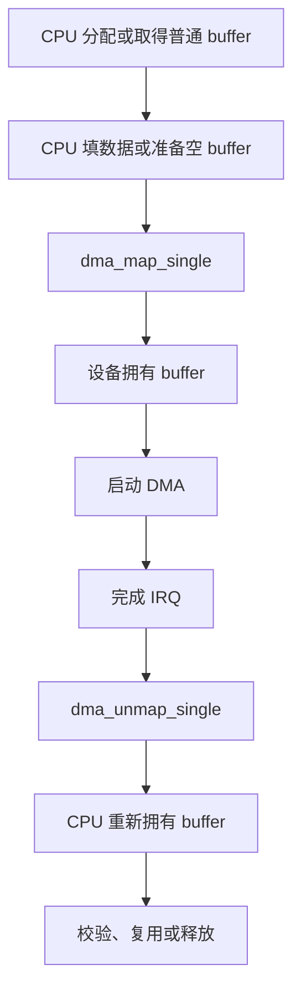

发送路径是 CPU 向设备提供数据。

这种事务使用 DMA_TO_DEVICE。

```c
void *buf;
dma_addr_t dma;
size_t len = 1024;

buf = kmalloc(len, GFP_KERNEL);
if (!buf)
    return -ENOMEM;

fill_known_pattern(buf, len);

dma = dma_map_single(dev, buf, len, DMA_TO_DEVICE);
if (dma_mapping_error(dev, dma)) {
    kfree(buf);
    return -EIO;
}

start_tx_dma(dma, len);
```

从 dma_map_single 成功返回开始，到 dma_unmap_single 之前，CPU 不能修改这块发送 buffer。

即使处理器架构恰好是硬件缓存一致的，也不应违反这个 API 语义。

这会让驱动在其他配置、其他 CPU 或 IOMMU 开启时仍保持正确。

完成 IRQ 到来后，在确认硬件不再读取该 buffer 的前提下解除映射：

```c
dma_unmap_single(dev, dma, len, DMA_TO_DEVICE);
consume_tx_completion();
kfree(buf);
```

真正驱动通常不会在 IRQ 顶半部立刻 kfree 所有对象。

它可能需要锁、队列、NAPI 或 workqueue 管理多个未完成事务。

但“硬件已停止访问，CPU 才能解除映射和复用内存”这个边界不变。

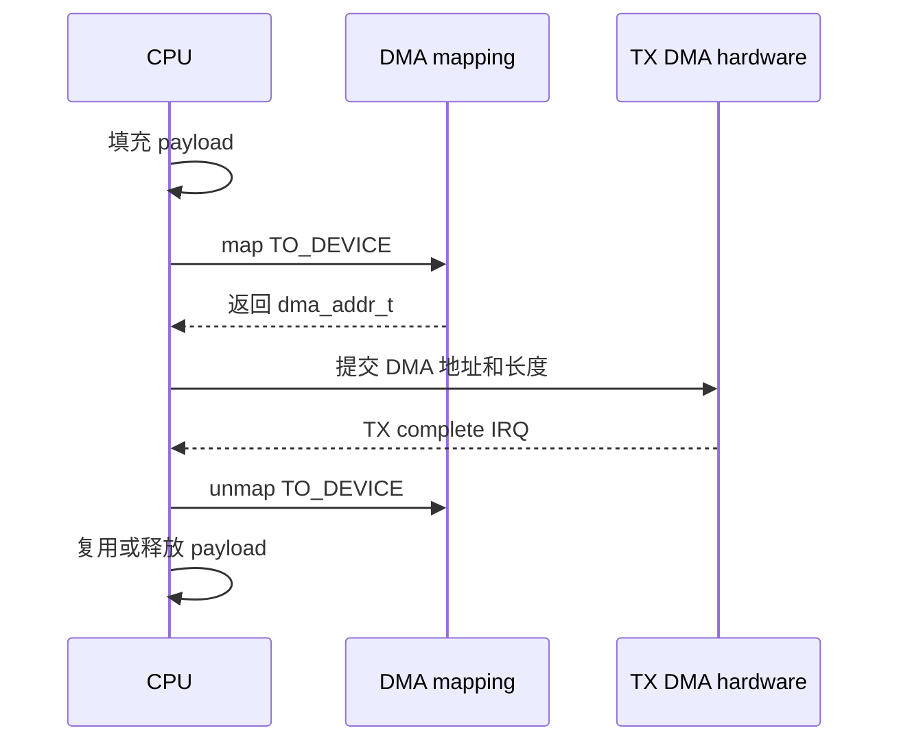

接收路径方向相反。

设备写入内存、CPU 之后读取结果时，使用 DMA_FROM_DEVICE。

```c
buf = kmalloc(len, GFP_KERNEL);
if (!buf)
    return -ENOMEM;

dma = dma_map_single(dev, buf, len, DMA_FROM_DEVICE);
if (dma_mapping_error(dev, dma)) {
    kfree(buf);
    return -EIO;
}

start_rx_dma(dma, len);
```

收到完成 IRQ 后，解除映射再让 CPU 检查接收数据。

```c
dma_unmap_single(dev, dma, len, DMA_FROM_DEVICE);
if (!validate_rx_pattern(buf, len))
    dev_warn(dev, "unexpected DMA payload\n");
kfree(buf);
```

单次 map、DMA、unmap 的事务容易理解，也适合第一轮实验。

高性能驱动常常保持映射并重复使用 buffer。

这时不能省略同步，而应在 CPU 与设备轮流使用数据前调用对应的 dma_sync_single_for_cpu 与 dma_sync_single_for_device。

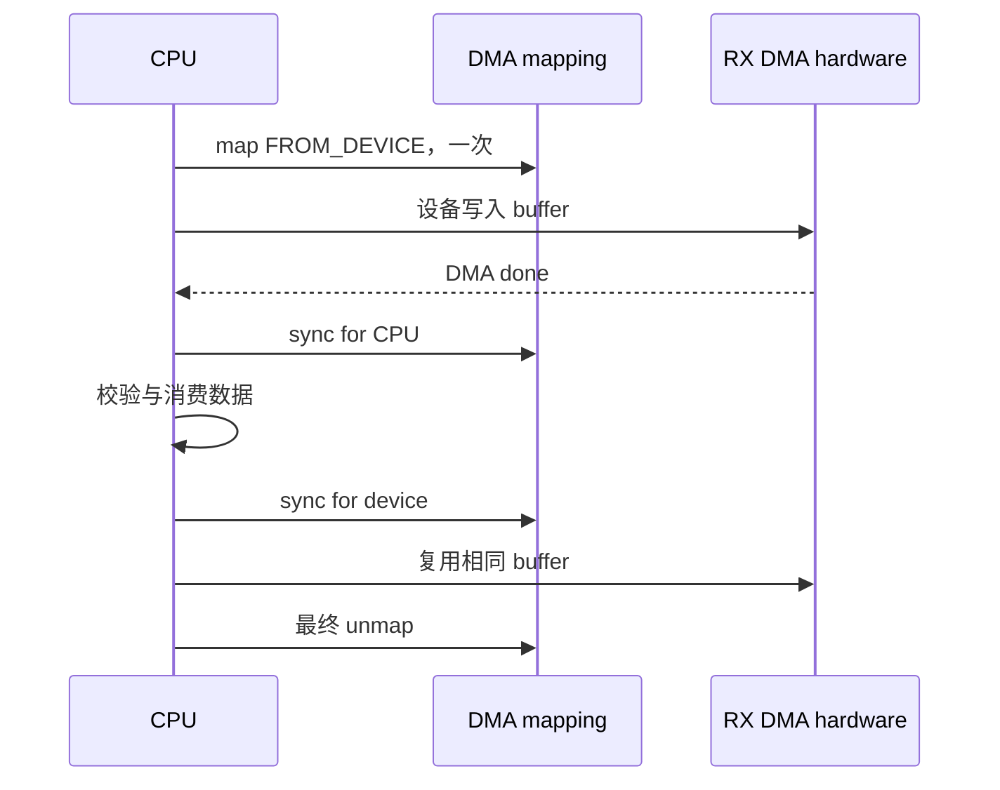

持续映射的接收 buffer 可按下面的边界写出伪代码。

```c
/* buffer 已经 dma_map_single 为 DMA_FROM_DEVICE。 */
on_rx_done() {
    dma_sync_single_for_cpu(dev, dma, len, DMA_FROM_DEVICE);
    consume_frame(buf, len);
    dma_sync_single_for_device(dev, dma, len, DMA_FROM_DEVICE);
    rearm_rx_dma(dma, len);
}
```

CPU 调用 sync for CPU 后才能读设备刚写入的内容。

再次把 buffer 交给设备前，调用 sync for device。

期间不要让另一个线程继续持有并修改这块 buffer。

若想避免对同一 buffer 做频繁 CPU 与设备切换，应重新审视数据流设计，而不是删除 sync。

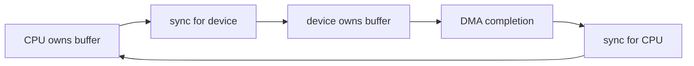

### scatter-gather 与返回段数

上层内存不一定连续。

例如页缓存、网络包片段或 V4L2 buffer 可能由多个段组成。

这时使用 scatterlist 与 dma_map_sg，而不是试图拼成一个虚假的连续物理地址。

```c
int mapped;

mapped = dma_map_sg(dev, sgl, nents, DMA_TO_DEVICE);
if (!mapped)
    return -EIO;

program_dma_sg(sgl, mapped);
```

dma_map_sg 的返回值是设备实际可用的映射段数。

它可能小于输入的 nents，因为 IOMMU 或 DMA API 可以合并段。

向硬件编程时应使用返回的 mapped 数量，而不是原始 nents。

完成后仍用原始 nents 调用 dma_unmap_sg。

这些细节非常容易造成“偶尔跨页错误”的问题。

在引入 scatter-gather 前，先让单段 streaming 路径的长度、方向和完成回收全部稳定。

### 用数据模式验证缓存交接

DMA buffer 的验收不能只看“没有 fault”。

准备容易识别的测试模式。

例如递增字节、固定头尾标记、帧序号和 CRC。

对设备写入的 buffer，在每次完成后检查头、尾、长度与 CRC。

对 CPU 写入的 buffer，让设备或回环硬件返回校验结果。

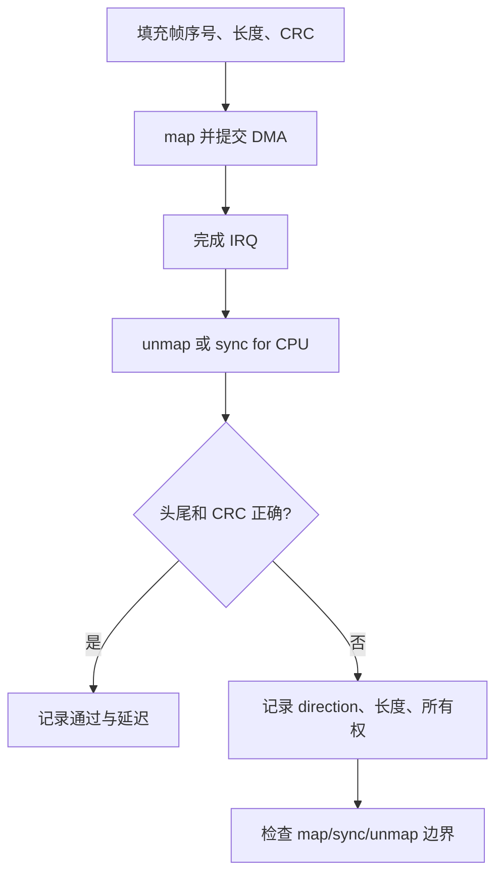

出现“第一帧正确，后续帧偶发错误”时，先检查是否在设备仍拥有 buffer 时被 CPU 复写或复用。

出现“debug 版本正确，release 版本错误”时，优先怀疑时序、内存屏障或遗漏的同步，而不是先归咎于优化器。

出现“关闭 IOMMU 正常，开启后 fault”时，检查是否使用了 DMA API 返回的地址，以及映射和解除映射的生命周期是否配对。

不要通过关掉 IOMMU 把问题留到量产环境。

## 4. 第三步：在 DMA-BUF 与 IOMMU 场景中保持跨设备同步

摄像头、ISP、RGA、编码器和 NPU 之间传递的大帧数据，不应由每个驱动各自重新分配和复制。

常见系统会通过 V4L2、vb2、DRM 或其他子系统导出的 DMA-BUF 共享 buffer。

零拷贝指避免无意义的 CPU memcpy。

它不表示没有缓存同步、没有生命周期管理，也不表示可以跳过完成同步。

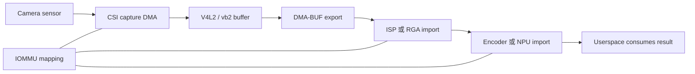

在这条路径中，普通外设驱动不应擅自把 DMA-BUF 的用户态虚拟地址或 exporter 私有地址写进自身寄存器。

应使用所属子系统提供的 attachment、map 与同步机制，或者沿用已存在的 buffer queue。

一块 buffer 在一个设备尚未完成时被下游设备复用，常表现为花屏、错帧、随机推理结果或偶发 IOMMU fault。

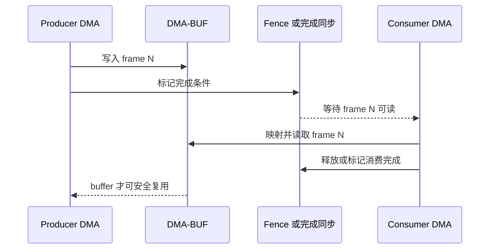

DMA-BUF 处理的是跨设备共享 buffer 的对象与 attachment。

fence 或子系统的完成机制处理“什么时候可读、什么时候可复用”的时间关系。

两者缺一不可。

即使所有设备都能访问同一个 IOVA 范围，也不能说明数据已经写完。

IOMMU fault 也不一定是 IOMMU 本身的错误。

它常是驱动在解除映射后仍向硬件提交旧 DMA 地址，或者使用了属于另一个设备 domain 的地址。

因此日志记录应至少包含提交者、buffer 身份、DMA 地址、长度、方向、开始时间和完成时间。

不要在日志中只打印一个裸地址。

没有设备、长度和所有权上下文的地址无法形成证据。

### 在现有子系统里优先复用 buffer 生命周期

对于摄像头和视频路径，优先阅读当前 V4L2、vb2、ISP 或媒体驱动已有的 queue 操作。

对于显示路径，优先阅读 DRM 和对应 buffer import 流程。

对于推理路径，优先使用厂商 NPU runtime 或已定义的 DMA-BUF import 接口。

手动插入一次 memcpy 可能暂时绕开共享问题，却会隐藏真正的同步边界，并造成带宽和延迟损耗。

手动调用通用 DMA API 也不一定能修复一个本应由框架管理的 DMA-BUF 问题。

先找到 exporter、importer 和每一段的完成通知，再判断应在哪一层修改。

## 5. 第四步：用日志、故障注入和压力测试完成 DMA 回归

DMA 路径在一次小数据事务成功后仍可能不可靠。

回归需要覆盖不同长度、重复次数、错误路径、reset 和并发负载。

但测试的第一原则仍是每次只验证一个新边界。

先建立单描述符、单 buffer 的正确性。

再增加队列深度。

然后增加持续负载。

最后才把它放回多设备共享的真实管线。

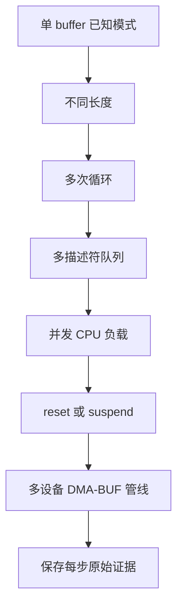

为每一次提交维护有限、可关联的日志字段。

推荐至少包含事务序号、buffer 逻辑编号、长度、DMA direction、提交时刻、完成时刻、状态码和校验结果。

在调试阶段可以额外记录 DMA 地址。

但不要在高频每帧路径无限打印日志。

可使用计数器、采样日志、tracepoint 或 debugfs 汇总状态，避免日志本身改变 DMA 时序。

```c
dev_dbg(dev, "dma id=%u len=%zu dir=%u done=%d\n",
        txn->id, txn->len, txn->dir, txn->done);
```

dynamic debug 可用于在不重新编译的情况下打开已有 dev_dbg 或 pr_debug 输出。

启用前先精确筛选模块、文件或函数范围。

全局打开调试会产生大量日志，可能导致 FIFO、IRQ 和调度行为改变。

示例命令中的模块名必须替换为真实驱动模块名：

```bash
test -e /proc/dynamic_debug/control || exit 0
grep -n "driver_file_or_module" /proc/dynamic_debug/control | head
echo 'module driver_file_or_module +p' > /proc/dynamic_debug/control
```

DMA API debug、IOMMU fault 信息和驱动状态日志应同时保存。

只收集其中一种经常无法判断“硬件没有完成”和“CPU 提前复用 buffer”的区别。

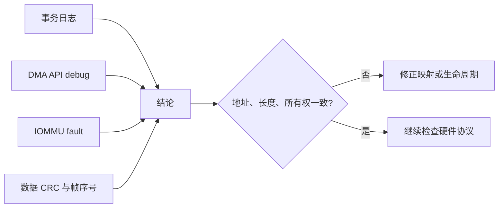

### 一组最小故障注入

故障注入不需要破坏内存或随意写寄存器。

可以从安全、可恢复的边界开始。

例如临时让驱动拒绝某个长度，验证 map 失败后的释放路径。

例如在测试 build 中让一次完成回调延后，验证停止路径是否等待硬件真正空闲。

例如让数据模式的 CRC 预期失败，验证日志能否关联到正确 buffer。

每个注入点都应有明确的期望日志和恢复动作。

不能为了制造错误而让设备继续访问已经释放的 DMA 内存。

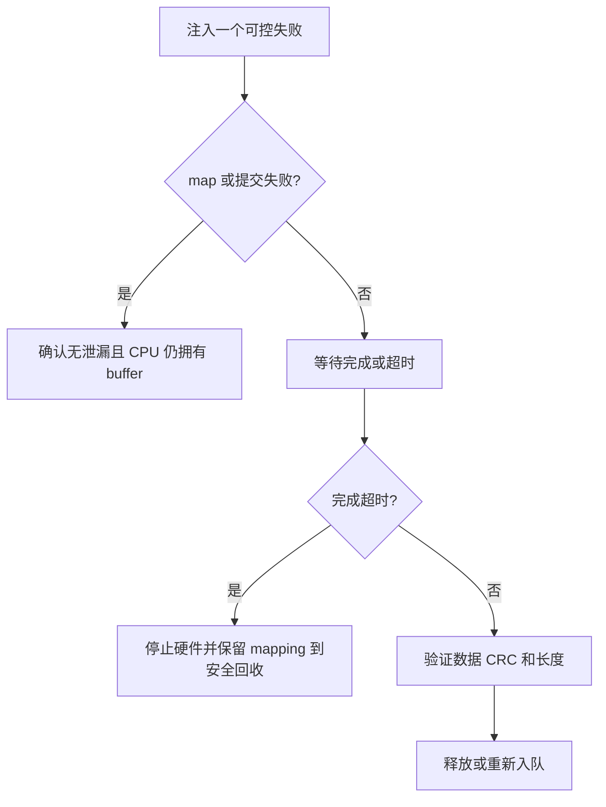

停止、remove、系统 reset 和 suspend 是 DMA 驱动最容易遗漏的路径。

在释放 buffer 前，必须先阻止新事务进入队列。

然后通知硬件停止或取消。

再同步 IRQ、工作队列或完成回调。

最后确认所有 DMA mapping 已解除、DMA-BUF 引用已释放，才释放内存和时钟资源。

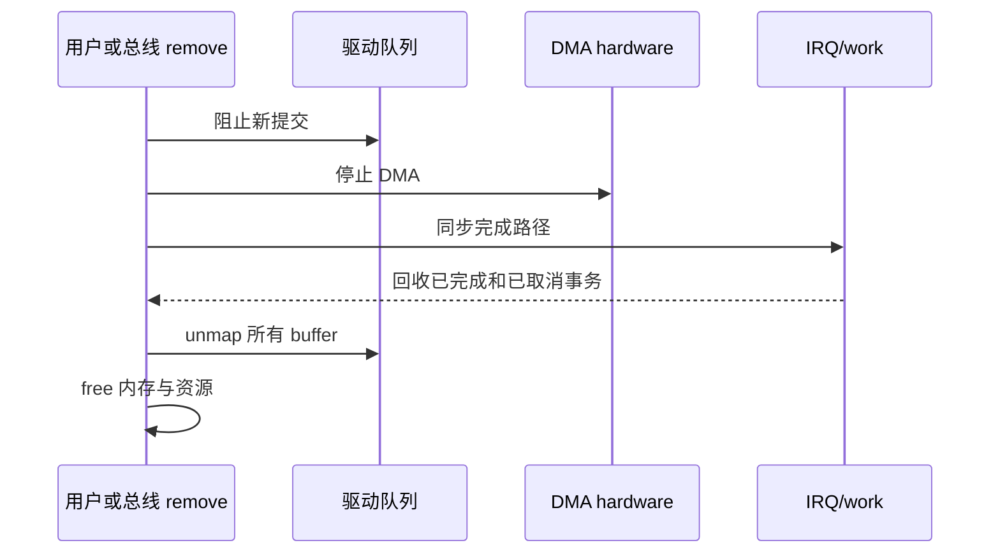

如果 remove 后出现偶发崩溃，不要只在释放前增加睡眠。

应追踪最后一个 DMA 提交、最后一个完成 IRQ 和最后一次 unmap 的因果关系。

如果 suspend 后第一帧损坏，记录 suspend 前 buffer 所有者和 resume 后硬件重新初始化顺序。

一些控制器需要在 resume 后重新提交描述符或重新映射，这要根据已有平台驱动和硬件文档确认。

### DMA 回归矩阵

| 场景 | 操作 | 通过条件 | 首先检查 |
| --- | --- | --- | --- |
| coherent 描述符 | 单描述符重复提交 | status 与长度稳定 | DMA mask、字节序、顺序 |
| streaming TX | CPU 填模式后 DMA 读取 | 设备返回校验正确 | direction、map 后是否改写 |
| streaming RX | 设备写入后 CPU 校验 | 头尾和 CRC 正确 | sync 或 unmap 边界 |
| SG buffer | 多段数据传输 | 每段数据完整 | mapped nents 与原 nents |
| IOMMU 开启 | 连续队列传输 | 无 fault 且吞吐稳定 | DMA 地址来源、生命周期 |
| DMA-BUF 共享 | 生产者消费者连续帧 | 无花屏、无错帧、无过早复用 | attachment、fence、queue |
| reset/remove | 中断传输后停机 | 无泄漏、无访问已释放内存 | 停止顺序、IRQ 同步 |

每一行通过后再进入下一行。

不要在 DMA-BUF 视频管线异常时直接跳到最复杂的系统级日志。

先退回到单 buffer、已知模式和明确所有权的最小实验。

当最小实验稳定、复杂管线仍出错时，问题才更可能位于子系统 queue、跨设备同步或应用复用时机。

### 本章练习

为一个实际或模拟 DMA 设备画出一张 buffer 所有权时间线。

列出 CPU 地址、DMA 地址、长度、direction、map、完成和 unmap 的位置。

为设备写入内存的路径设计帧序号、长度和 CRC 三项校验。

解释为什么 DMA_FROM_DEVICE 的 buffer 在完成前不能被 CPU 当作有效数据读取。

再写出该驱动的 remove 顺序，确保硬件、IRQ、mapping 和内存的释放关系清晰。

### 本章验收

完成本章后，应能独立回答：

- 为什么 CPU 虚拟地址、物理地址、DMA 地址与 IOVA 不能混用；
- coherent 内存为何仍需要遵守描述符写入与通知硬件的顺序；
- streaming 映射期间，CPU 和设备各自何时拥有 buffer；
- 为什么 dma_map_sg 的返回段数不能简单替换成输入段数；
- 零拷贝为何仍需要 DMA-BUF 生命周期与跨设备完成同步；
- 遇到花屏、随机数据或 IOMMU fault 时，如何从地址、长度、direction 与所有权开始定位。

只要每个 buffer 的交接能被日志、完成事件和数据校验共同证明，DMA 调试就不再依赖“偶尔正常”的侥幸。

> 🏷️ Linux BSP · DMA · cache coherency · IOMMU · DMA-BUF · buffer 生命周期 · 驱动调试
