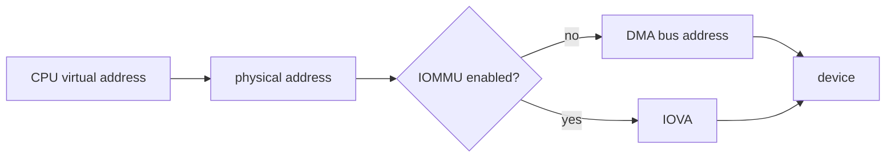
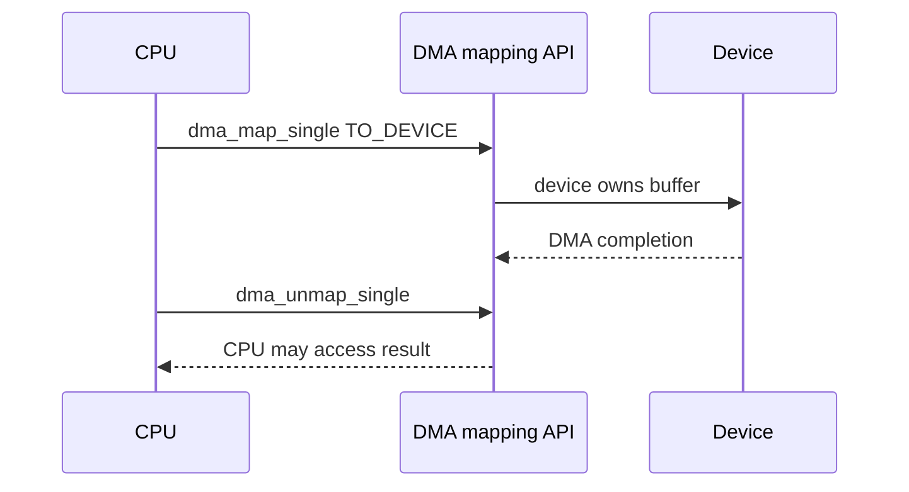
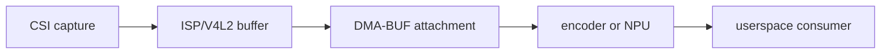

DMA 问题最危险的地方是它可能“偶尔正常”。CPU 看见的是缓存，设备看见的是 DMA 可达内存；二者是否自动一致取决于架构、IOMMU 和分配方式。驱动必须使用 DMA API 表达所有权转移，不能拿普通指针或 `virt_to_phys()` 猜地址。

## 1. 地址不是一个概念





## 2. coherent 与 streaming 的选择

| 类型 | 适合 | 关键 API | 注意事项 |
|---|---|---|---|
| coherent | 描述符、控制块 | `dma_alloc_coherent` | 一致不等于无屏障 |
| streaming | 大型一次性数据 | `dma_map_single` | 明确 CPU/设备所有权 |
| sg | 分散页/上层 buffer | `dma_map_sg` | 使用返回的 mapped nents |
| dma-buf | 子系统间共享 | DMA-BUF API | 用 fence/attachment 管理同步 |

```c
dma_addr_t dma;
void *cpu = dma_alloc_coherent(dev, size, &dma, GFP_KERNEL);
if (!cpu)
    return -ENOMEM;

/* device programs 'dma', CPU accesses 'cpu' */
dma_free_coherent(dev, size, cpu, dma);
```

不要用 `dma_alloc_coherent()` 替代所有数据路径。对视频帧等大数据，错误选择会造成内存压力；应优先沿用 V4L2、vb2、DMA-BUF 等子系统已有 buffer 管理模型。

## 3. streaming mapping 的所有权

```c
dma = dma_map_single(dev, buf, len, DMA_TO_DEVICE);
if (dma_mapping_error(dev, dma))
    return -EIO;

start_dma(dma, len);
/* after completion */
dma_unmap_single(dev, dma, len, DMA_TO_DEVICE);
```

映射后到 unmap 前，CPU 不应修改设备拥有的 buffer。双向或设备写内存时选择正确 direction，并按 API 使用 sync 调用。direction 不是性能提示，而是缓存维护的语义。

## 4. 视频管线里的零拷贝边界



零拷贝不意味着零同步。每个硬件单元都需要合法 attachment、buffer 生命周期和完成同步；任一模块仍在访问时复用 buffer，常表现为花屏、偶发推理错帧或 IOMMU fault。

## 5. 验证、练习与里程碑

**验证步骤**：为一个小型 DMA 事务记录 buffer 的 CPU 地址、DMA 地址、长度、direction 与完成中断。开启 IOMMU fault 日志或 DMA API debug（若内核支持），确认无 mapping 泄漏。

**练习**：解释为何从 `kmalloc()` 得到的指针不能直接当成外设寄存器中的 DMA 地址。

**里程碑**：能明确画出 buffer 在 CPU、设备和 IOMMU 之间的所有权与同步点。
