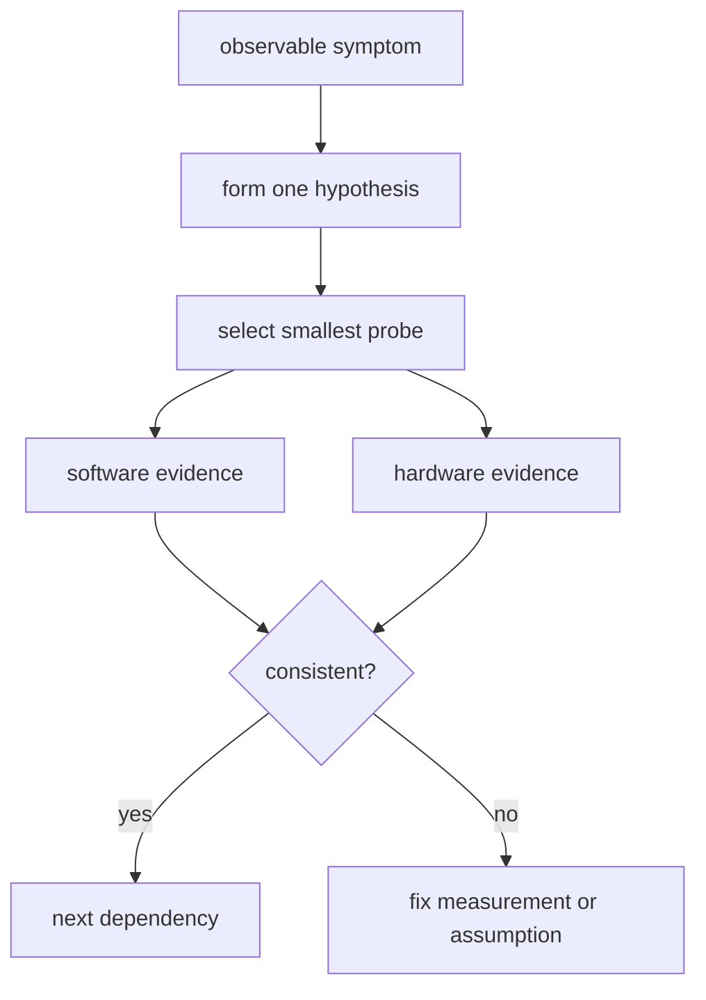
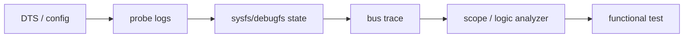

高效调试不是收集更多日志，而是为每个假设设计能证伪它的最小实验。BSP 问题通常跨越 DTS、driver、时钟电源、总线和应用；必须把证据按层组织，并优先寻找第一个偏离健康基线的位置。

## 1. 证据链而非日志堆





## 2. 选择观测工具

| 问题 | 首选工具 | 观察目标 |
|---|---|---|
| driver 未绑定 | DTS、sysfs、dmesg | compatible、status、driver link |
| probe 很慢 | initcall_debug、ftrace | 耗时函数与依赖 |
| I2C/SPI 通信失败 | dynamic debug、逻辑分析仪 | 地址、ACK、时序 |
| 中断异常 | `/proc/interrupts`、trace-cmd | 计数、触发与延迟 |
| CPU 高 | perf、ftrace | 热点和调度行为 |

## 3. 动态调试与 ftrace

```bash
mount -t debugfs none /sys/kernel/debug 2>/dev/null || true
grep -n 'driver_file_or_name' /sys/kernel/debug/dynamic_debug/control 2>/dev/null | head
echo 'file drivers/foo/bar.c +p' | sudo tee /sys/kernel/debug/dynamic_debug/control

cd /sys/kernel/tracing 2>/dev/null || exit 0
echo function > current_tracer
echo 'driver_function_name' > set_ftrace_filter
echo 1 > tracing_on
# reproduce once
echo 0 > tracing_on
cat trace | tail -200
```

接口位置可能是 `/sys/kernel/debug/tracing`，取决于挂载和内核版本。启用 tracing 前先限定函数或事件范围；全局 function tracer 会产生海量数据并显著扰动系统。

## 4. 记录实验而不是只截图

每次实验应记录：修改内容、构建提交、bootargs、时间窗口、原始日志、仪器设置、预期结果与实际结果。每次只修改一个变量，尤其不要同时改 DTS、时钟频率和驱动延时，否则无法知道哪项生效。

```bash
git rev-parse HEAD
uname -a
cat /proc/cmdline
dmesg -wH | tee reproduce.log
```

## 5. 性能问题的基本顺序

`perf top` 只能显示 CPU 侧热点，不能直接证明 DMA、锁竞争或硬件等待。先定义指标，例如首帧时间、IRQ 到线程延迟、帧率或丢帧率；再选择 tracepoint 或计数器验证。没有基线的“优化”无法判断收益。

## 6. 验证、练习与里程碑

**验证步骤**：挑选一个可重复的 probe 失败或慢启动现象，写出一个假设，开启最小范围 dynamic debug/ftrace，收集一次软件日志和一次硬件/总线证据，得出支持或否定结论。

**练习**：为“摄像头 probe 延迟五秒”列出三个互斥假设和各自最小验证手段。

**里程碑**：调试记录能让另一位工程师复现你的观察、理解你的排除过程，并继续缩小问题范围。
