驱动里的“地址”至少有四种语义。

内核 C 指针用于访问普通 RAM。

__iomem 指针用于访问设备寄存器。

DMA 地址用于告诉硬件从哪里读写内存。

用户指针则来自一个不可信、可随时失效的地址空间。

它们在部分 SoC 或简单测试中可能看起来数值接近，但绝不能互相替代。

本章以一个 platform 外设的只读 ID 寄存器和一个受控用户读写接口为例，建立从 DTS 资源、内核分配、MMIO 访问到 usercopy 的完整边界。

DMA 数据路径已在前文单独展开，本章只明确它为什么不能与普通物理地址混用。

## 1. 先画出每一类内存和地址的访问边界

开始写驱动前，先把数据属于谁、CPU 应如何访问、硬件应如何访问写清楚。

普通驱动私有状态、锁和小型队列存放在内核 RAM。

设备控制器寄存器位于 MMIO 区域。

需要设备直接读写的 buffer 通过 DMA API 获得设备可用地址。

用户态传入的数据必须先经由 usercopy 验证后才能进入内核。

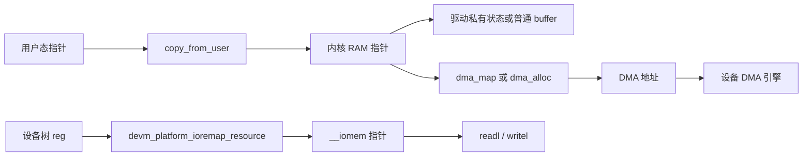

每个箭头都代表一条必须遵守的 API 边界。

不能把用户指针直接解引用成内核数据。

不能把普通内核指针直接当作寄存器地址。

不能把 __iomem 指针用普通结构体解引用方式访问。

不能把 kmalloc 得到的指针或 virt_to_phys 的结果直接写进 DMA 描述符。

先为实验驱动建立一张资源表。

| 对象 | 来源 | CPU 访问方式 | 设备访问方式 | 生命周期 |
| --- | --- | --- | --- | --- |
| private state | devm_kzalloc | 普通 C 指针 | 不直接访问 | device detach |
| 寄存器窗口 | DTS reg | readl/writel | 控制器自身 | ioremap 到 detach |
| 小型命令 | copy_from_user 后的内核 buffer | 普通 C 指针 | 仅 CPU 处理 | 单次 file operation |
| DMA 数据 | DMA API | API 规定的 CPU 访问 | dma_addr_t | map 到完成回收 |
| 用户输出 | 内核 staging buffer | 普通 C 指针 | 不直接访问 | copy_to_user 时 |

表中的“设备访问方式”比地址数值更重要。

若设备访问 buffer，必须使用 DMA API 返回的地址和所有权协议。

若 CPU 访问寄存器，必须使用 I/O accessor。

若 CPU 访问用户数据，必须先完成 usercopy。

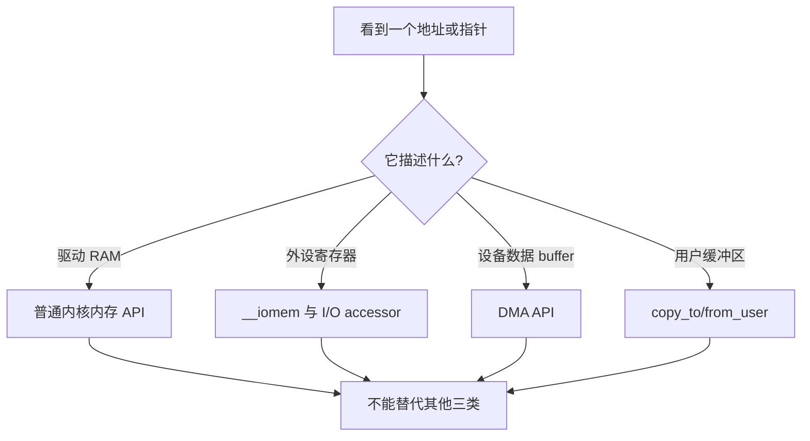

在 C 代码中，这些边界常通过类型限定符和函数签名体现。

void __iomem * 提醒编译器和代码审查者该指针不是普通 RAM。

dma_addr_t 提醒驱动该值用于设备，不应被 CPU 直接解引用。

void __user * 提醒驱动数据还不属于内核。

这些标记不能自动修复所有错误，但能让 sparse、编译器检查和人工审查更早发现边界被跨越。

### 先定义最小验收实验

本章不要求为真实 SoC 寄存器随意写值。

选择当前硬件手册明确标为只读、读取无副作用的 IP revision、ID 或 capability 寄存器。

若没有安全的寄存器可读，就只完成 DTS 到 ioremap 与 sysfs 资源观察，不执行实际 MMIO 读取。

需要写寄存器时，只选择实验外设或已知安全的控制位，并明确默认值和恢复方式。

用户态接口也只处理固定大小、受限命令或只读状态。

不要把一个可任意读写物理寄存器的调试后门放入产品驱动。


实验的通过条件应包含以下事实：

- 运行时 DTS 中的 reg 资源与所选硬件节点一致；
- 驱动只能通过受管理 ioremap 得到 MMIO token；
- readl 返回的 ID 在冷启动与重绑后稳定；
- 用户态获得的是 copy_to_user 复制出的受控数据；
- 错误输入、unbind 与重绑不出现引用、映射或资源残留。

## 2. 第一步：按执行上下文选择内核内存分配方式

内核分配器的选择首先由对象大小、物理连续性需求、执行上下文和释放生命周期决定。

不是由“哪个函数最熟悉”决定。

大多数驱动私有状态是小型、零初始化、随 device 解绑释放的对象。

此时 devm_kzalloc 是合理的默认起点。

```c
struct board_memio {
    struct device *dev;
    void __iomem *base;
    u32 hw_id;
    struct mutex lock;
    char reply[64];
};

priv = devm_kzalloc(dev, sizeof(*priv), GFP_KERNEL);
if (!priv)
    return -ENOMEM;

priv->dev = dev;
mutex_init(&priv->lock);
platform_set_drvdata(pdev, priv);
```

GFP_KERNEL 表示调用上下文允许睡眠和直接回收。

因此它适用于通常的 probe、file operation、workqueue 和进程上下文。

它不适合硬中断、持有 spinlock 或其他不能睡眠的上下文。

在这些上下文中，优先重新设计数据流，让内存预分配或把工作转移到可睡眠上下文。

GFP_ATOMIC 只能用于确有备用路径、且理解内存储备影响的少量场景。

它不是“中断里分配总能成功”的保证。

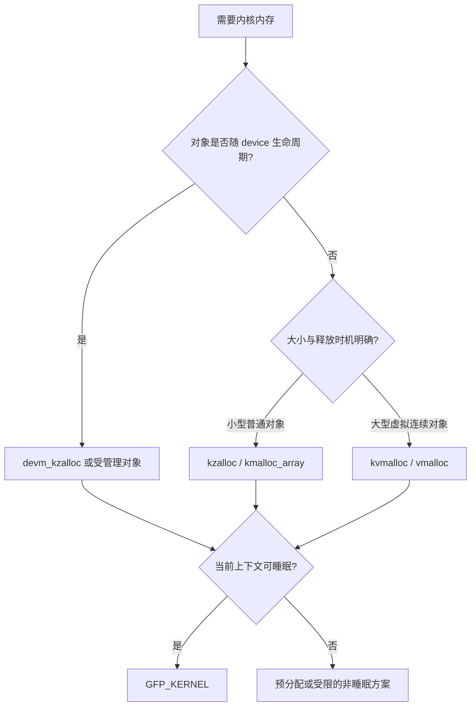

kmalloc 适合较小、物理连续的内核对象。

kzalloc 在 kmalloc 的基础上清零，适合保存状态和避免未初始化字段泄漏。

数组长度来自外部输入时，优先使用 kcalloc、kmalloc_array 或 struct_size 等辅助函数，避免 size 乘法溢出。

```c
entries = kcalloc(count, sizeof(*entries), GFP_KERNEL);
if (!entries)
    return -ENOMEM;
```

count 必须在分配前接受上限检查。

分配成功不代表用户可以请求任意数量的对象。

业务、内存和硬件队列能力仍应共同定义最大值。

kmalloc 并不承诺“所有大小都可轻易获得”。

对于大对象或大小不稳定的缓冲区，可考虑 kvmalloc。

kvmalloc 会优先尝试 kmalloc，失败时可退到 vmalloc。

但 vmalloc 只保证内核虚拟地址连续，不保证物理页面连续。

因此 kvmalloc 返回的内存不能因为“指针连续”就被直接交给 DMA 硬件。

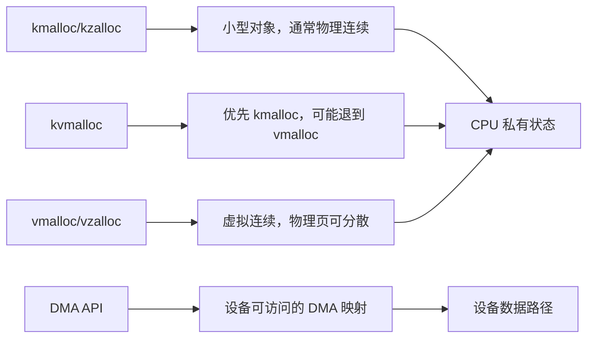

不要为了“让外设能访问”在普通分配中随意增加 GFP_DMA 或 GFP_DMA32。

设备的地址宽度、IOMMU 关系、缓存维护和 mapping 生命周期属于 DMA API 的职责。

普通分配标志无法替代 dma_set_mask_and_coherent、dma_map_single 或 dma_alloc_coherent。

### 用所有权决定 free，而不是按函数名猜测

devm 分配的对象通常不应再手工 kfree。

它们由当前 device 的 devres 在 probe 失败或解绑时回收。

普通 kzalloc、kcalloc、kvmalloc 和 vmalloc 则必须由对应路径明确释放。

| 分配方式 | 典型用途 | 释放方式 | 常见误用 |
| --- | --- | --- | --- |
| devm_kzalloc | driver private state | device detach 自动释放 | remove 中再次 kfree |
| kzalloc/kcalloc | 临时或独立对象 | kfree | 错误路径遗漏 |
| kvmalloc | 大小不稳定的 CPU buffer | kvfree | 假设它可直接 DMA |
| vmalloc | 大型虚拟连续 CPU 区域 | vfree | 当作物理连续内存 |
| dma_alloc_coherent | 设备共享控制结构 | dma_free_coherent 或受管理版本 | 使用 kfree/vfree |

把分配 API 和释放 API 写在同一份设计记录中。

尤其在 probe 有多个失败返回点、file operation 有并发关闭、或 buffer 被异步任务持有时，所有权比“代码能编译”更重要。

### 分配失败也是正常路径

所有可失败分配都要检查返回值。

不要使用 __GFP_NOFAIL 为驱动私有缓存逃避失败处理。

内存紧张时无限等待会把局部错误放大为系统卡顿。

一个可恢复的驱动应定义合理的失败行为，例如返回 -ENOMEM、丢弃可重试数据、降低队列深度或将工作延后。

将分配失败纳入测试：在 debug build 中限制队列大小或让一次可选缓存分配失败，验证用户态获得明确错误且驱动状态仍然一致。

## 3. 第二步：从 DTS 的 reg 资源安全映射到 MMIO

设备树中的 reg 描述的是硬件资源，不是可以被普通 C 指针直接访问的内核地址。

platform bus 将它转换为 struct resource。

驱动再通过受管理 helper 请求该资源并建立适当的 I/O 映射。

```dts
board_memio@address {
    compatible = "longway,board-memio";
    reg = <address size>;
    status = "okay";
};
```

address 和 size 必须替换为当前 SoC dtsi 已定义或硬件手册确认的资源。

不要为实验凭空创建一个地址范围。

错误的 reg 可能与其他控制器重叠，读取或写入会造成难以定位的系统故障。

优先在已有安全外设节点上观察 reg 资源，或使用不实际访问硬件的 board-lab 节点完成前两步。

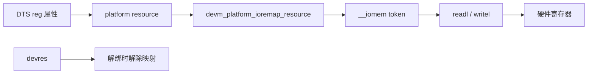

在 probe 中获取索引为零的第一个内存资源：

```c
priv->base = devm_platform_ioremap_resource(pdev, 0);
if (IS_ERR(priv->base))
    return dev_err_probe(dev, PTR_ERR(priv->base),
                         "map register resource failed\n");
```

这个 helper 依据 platform device 查找 resource、请求内存区域、建立映射，并把解除映射纳入 devres。

若设备树中有多个寄存器窗口，应使用资源名称而不是脆弱的索引来提升可读性。

```dts
board_memio@address {
    compatible = "longway,board-memio";
    reg-names = "core", "cfg";
    reg = <core_address core_size>, <cfg_address cfg_size>;
    status = "okay";
};
```

```c
priv->base = devm_platform_ioremap_resource_byname(pdev, "core");
if (IS_ERR(priv->base))
    return PTR_ERR(priv->base);
```

命名资源让代码和 DTS 的对应关系可被审查。

更改 DTS 窗口顺序时，也不会悄悄把驱动映射到另一个寄存器块。

### __iomem 不是普通 RAM 指针

映射函数返回的 void __iomem 指针只应传给 I/O 访问函数。

可移植驱动中，不要直接写成 *priv->base，也不要把它强制转换为普通结构体指针后做成员解引用。

不同架构对 MMIO 的地址表示、访问指令、字节序和顺序要求不同。

readl、writel 等 accessor 才是这一层的统一边界。

```c
#define BOARD_MEMIO_ID_OFFSET      0x0000
#define BOARD_MEMIO_CTRL_OFFSET    0x0004

priv->hw_id = readl(priv->base + BOARD_MEMIO_ID_OFFSET);
dev_info(dev, "hardware id: 0x%08x\n", priv->hw_id);
```

ID offset 必须来自当前硬件手册。

只有确认该寄存器读取无副作用时，才能把它作为板端实验。

某些状态寄存器读出会清标志，某些 FIFO 读出会推进读指针。

这类寄存器不能被调试日志或 sysfs 属性反复读取。

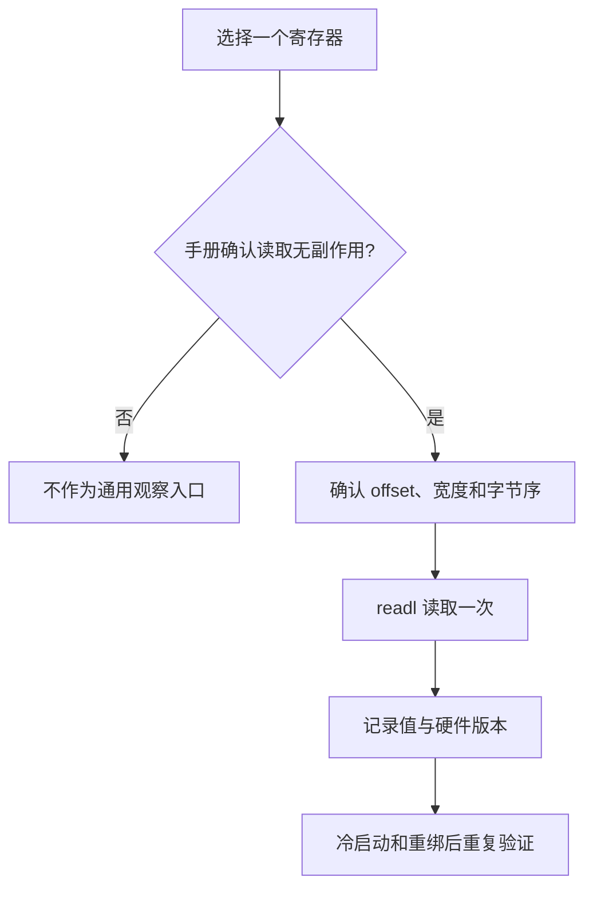

写寄存器比读寄存器风险更高。

在没有明确硬件状态机、位定义、写 1 清除语义和恢复路径前，不要让用户态直接提供 offset 和 value。

安全的写法是将一个经过代码审查的动作封装成具名函数。

```c
static void board_memio_start(struct board_memio *priv)
{
    u32 ctrl;

    ctrl = readl(priv->base + BOARD_MEMIO_CTRL_OFFSET);
    ctrl |= BOARD_MEMIO_CTRL_ENABLE;
    writel(ctrl, priv->base + BOARD_MEMIO_CTRL_OFFSET);
}
```

这里仍需要依据硬件文档决定 read-modify-write 是否安全。

有些控制寄存器包含写 1 清除位、只写位或并发由硬件更新的状态位，不能简单做 read-modify-write。

若写入需要与 DMA 描述符、门铃寄存器或另一个 CPU 同步，必须使用该控制器已有驱动规定的锁和内存顺序。

不要因为 readl/writel 看起来像普通函数，就忽略硬件协议。

### 把寄存器访问与资源、时钟和复位放在一起检查

MMIO 映射成功只证明 CPU 得到了一段可访问的窗口。

它不证明 IP 已上电、时钟已打开、复位已释放或引脚已复用。

当 ID 返回全零、全一或固定异常值时，按以下顺序排查：

1. 运行时 DTB 的 reg 是否对应正确控制器；
2. probe 是否成功取得并使能 clock、reset、regulator 与 pinctrl；
3. 手册中的 ID 寄存器偏移、位宽与字节序是否正确；
4. 总线互连、power domain 或安全域是否允许当前 CPU 访问；
5. 是否误读了具有副作用或需要先写命令的寄存器。

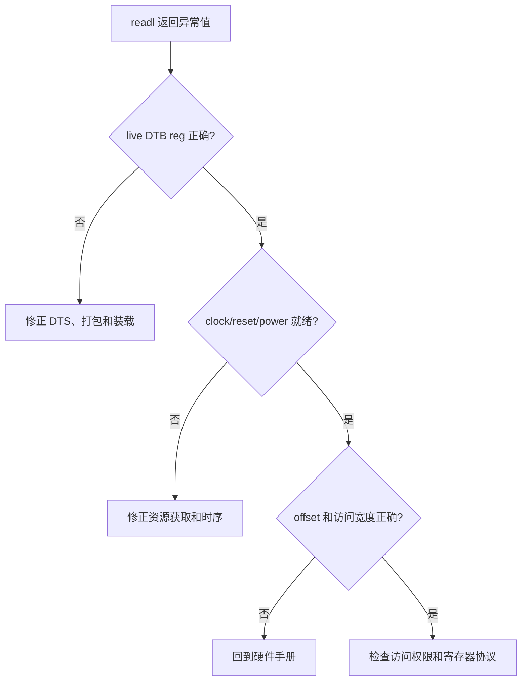

## 4. 第三步：在内核与用户态之间复制数据，而不是传递指针

用户态传入的地址只在当前进程的虚拟地址空间中有意义。

驱动不能把它保存到私有结构后，在 workqueue、IRQ 或另一个进程上下文中继续解引用。

也不能把内核地址直接返回给用户态。

用户接口应先把数据复制到内核控制的 staging buffer，再做长度、格式和状态检查。

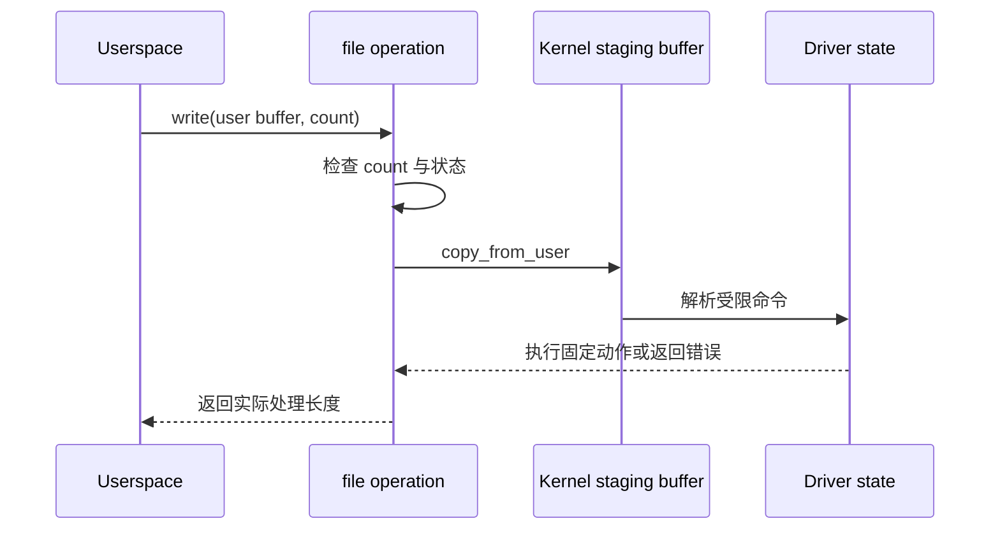

在读取简单状态时，可用内核提供的 simple_read_from_buffer 把内核缓冲区安全复制给用户态。

```c
static ssize_t board_memio_read(struct file *file, char __user *ubuf,
                                size_t count, loff_t *ppos)
{
    struct board_memio *priv = file->private_data;
    char msg[64];
    int len;

    mutex_lock(&priv->lock);
    len = scnprintf(msg, sizeof(msg), "id=0x%08x\n", priv->hw_id);
    mutex_unlock(&priv->lock);

    return simple_read_from_buffer(ubuf, count, ppos, msg, len);
}
```

这个函数不会把 msg 的内核地址暴露给用户态。

它按 count 和 ppos 处理分段读取，并执行必要的用户拷贝。

msg 是短生命周期的栈 buffer，因此数据必须在函数返回前复制完成。

若状态来自硬件寄存器，应先判断读取是否无副作用。

若不适合每次 read 都访问硬件，则在受控状态转换时缓存到 priv->hw_id，再由 read 只读取软件状态。

写入路径必须限制最大长度并处理 copy_from_user 未完整复制的情况。

```c
static ssize_t board_memio_write(struct file *file,
                                 const char __user *ubuf,
                                 size_t count, loff_t *ppos)
{
    struct board_memio *priv = file->private_data;
    char cmd[16];

    if (!count || count >= sizeof(cmd))
        return -EINVAL;

    if (copy_from_user(cmd, ubuf, count))
        return -EFAULT;

    cmd[count] = '\0';

    if (!sysfs_streq(cmd, "refresh"))
        return -EINVAL;

    mutex_lock(&priv->lock);
    priv->hw_id = readl(priv->base + BOARD_MEMIO_ID_OFFSET);
    mutex_unlock(&priv->lock);

    return count;
}
```

这段接口只接受一个固定、可解释的 refresh 命令。

它不接受寄存器地址、位掩码或任意二进制数据。

这样用户态可以请求一次已定义的安全读取，却无法把设备变成任意 MMIO 读写接口。

sysfs_streq 会处理常见的换行形式，适合这种短文本命令。

若业务需要传输结构化二进制数据，应在 copy_from_user 后验证版本、长度、字段范围、整数溢出和状态机条件。

不要把用户提供的结构体指针直接转换为内核结构体指针使用。

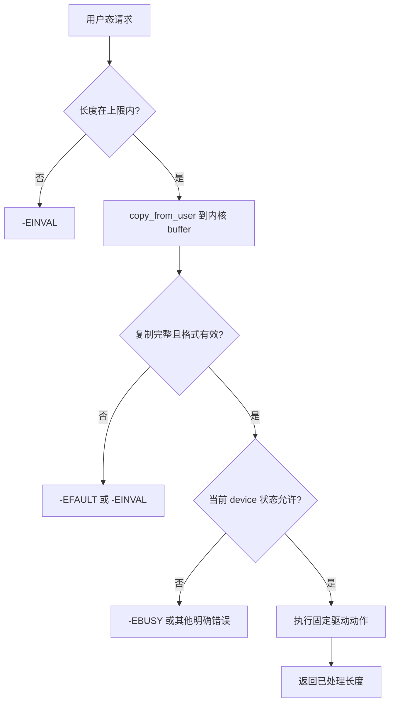

### copy_to_user 和 copy_from_user 的返回语义

这两个函数的非零返回值表示仍有多少字节未完成复制。

对绝大多数控制命令和固定结构，非零都应作为失败处理。

不要把返回值误当作负 errno。

驱动应把未完成复制转换为 -EFAULT，或在需要支持部分 I/O 的数据流中明确定义可返回的已完成字节数。

用户内存可以在调用过程中发生缺页、失效或权限变化。

因此 usercopy 不是多余的 memcpy，而是内核与用户地址空间之间的受控访问机制。

### mmap 不等于把所有 buffer 直接交给用户态

mmap 可用于高吞吐共享缓冲区，但需要页生命周期、权限、cache 属性、DMA 同步和 close/unmap 处理。

它不适合成为“避免 copy_to_user 的快捷方式”。

在没有完整设计前，优先用受限 read、write、poll 或所属子系统的 buffer API。

视频、显示和推理大 buffer 更应使用 V4L2、DRM、DMA-BUF 或厂商 runtime 的既有路径，而不是为一个普通 char driver 手写物理页映射。

## 5. 第四步：用地址记录、错误路径和解绑回归完成验收

内存与 I/O 问题不能只靠“没有崩溃”验收。

应为每个对象记录它的来源、访问 API、释放点和可观察证据。

对普通 RAM，记录分配大小、GFP 上下文和释放所有者。

对 MMIO，记录 DTS resource 名称、映射结果和安全寄存器值。

对 DMA，记录 direction、长度和 API 返回的 dma_addr_t，而不把物理地址当作通用替代。

对用户接口，记录最大长度、合法命令、错误码和并发规则。

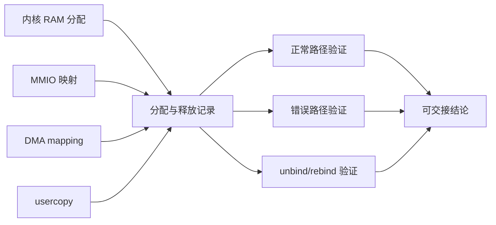

地址日志应服务于对象关系，而不是输出无上下文的十六进制数。

开发版本中可记录 resource 名、映射窗口大小、事务序号和操作结果。

避免在日志中长期暴露敏感内核地址，尤其是在产品镜像中。

更重要的是不要根据日志中的数值相同或不同，推断两个地址可以互换使用。

```c
dev_dbg(dev, "mapped resource core, id=0x%08x\n", priv->hw_id);
```

对 MMIO 的第一轮板端验证只读取已经确认安全的 ID。

```bash
DRV=/sys/bus/platform/drivers/longway-board-memio
DEV=actual-device-name

dmesg -T | grep -Ei 'board-memio|map register|hardware id'
readlink "/sys/bus/platform/devices/$DEV/driver"
cat "/sys/bus/platform/devices/$DEV/resource" 2>/dev/null
```

resource 文件可帮助核对内核为 device 识别到的资源范围。

它不意味着用户态可以或应该直接读写该范围。

用户态功能测试必须使用驱动导出的受控接口。

如果你的驱动在已有字符设备或 miscdevice 框架中注册了测试节点，可按如下形式验证：

```bash
DEVNODE=/dev/board-memio
cat "$DEVNODE"
printf 'refresh\n' > "$DEVNODE"
cat "$DEVNODE"
```

这里假定 file private_data 已在 open 回调中关联到对应 device 私有数据。

例如，char device 或 miscdevice 的 open 负责从 inode、container 或框架数据找到 board_memio 实例。

不能把上一节的 read/write 片段单独编译后期待它自动拥有正确的 private_data。

用户接口的实现应沿用前面字符设备或 misc 设备文章已建立的注册和 open 生命周期。

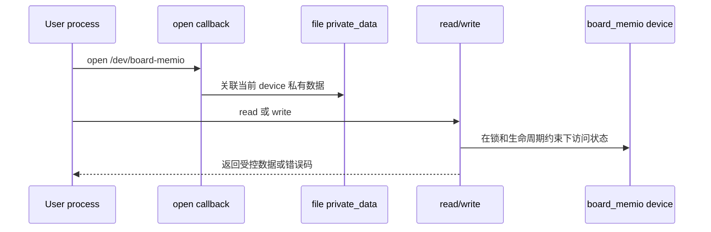

### 必须主动测试的错误路径

正常读取 ID 只覆盖了最短路径。

还应验证下列错误或边界：

| 场景 | 测试方式 | 通过条件 |
| --- | --- | --- |
| DTS 缺失 reg | 开发 DTS 中移除测试节点的资源 | probe 明确失败且无接口残留 |
| 映射失败 | 使用错误路径注入或不可用资源 | 无 base 使用、无资源泄漏 |
| 超长用户命令 | 向测试节点写入超过上限的数据 | 返回 -EINVAL，不越界 |
| 非法命令 | 写入未定义文本 | 返回 -EINVAL，不访问寄存器 |
| usercopy 失败 | 用户态传递无效 buffer 的受控测试 | 返回 -EFAULT，不使用残留数据 |
| remove 中并发读写 | 对实验驱动 unbind 时保持接口活动 | 无 use-after-free、无挂死 |
| 重绑 | unbind 后重新 bind | ID 与接口重新稳定出现 |

不要通过在生产驱动上故意写错 reg 或解绑关键设备来做这些测试。

应使用独立 board-memio 节点、开发镜像和可恢复的测试板。

错误路径测试的目的不是制造内核崩溃，而是证明错误被局部、清晰地处理。

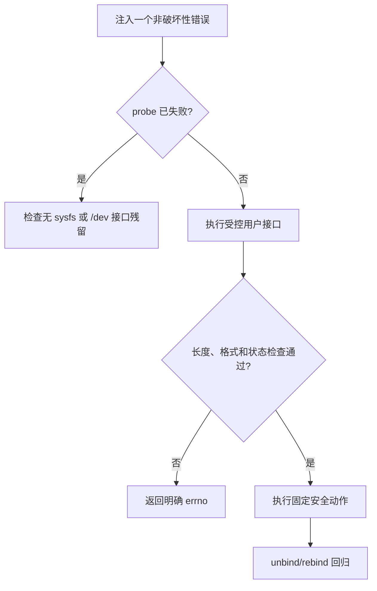

### 将地址错误按症状分类

| 现象 | 最可能的边界错误 | 先检查什么 |
| --- | --- | --- |
| probe 映射失败 | DTS reg、resource 名或映射 helper 使用错误 | live DTB 与 platform resource |
| readl 返回固定异常值 | 时钟、复位、offset 或 __iomem 访问错误 | 硬件手册与资源时序 |
| 用户写入导致随机崩溃 | 未检查长度、未完成 usercopy 或并发生命周期错误 | copy_from_user、锁、file private_data |
| 大 buffer 偶发错数据 | 把 vmalloc/kvmalloc 当作 DMA buffer 或遗漏同步 | DMA API 与所有权时间线 |
| unbind 后异常 | 异步工作仍访问 devm 内存或 MMIO | remove 的停止和同步顺序 |
| rebind 后 resource busy | 旧实例没有完全停止或释放 | clock、GPIO、DMA、注册接口 |

看到地址相关问题时，不要先增加 delay 或强转指针。

先回到资源表，判断当前对象到底是 RAM、MMIO、DMA 还是用户内存。

每种对象各有正确 API；跨边界时应有明确的映射或复制操作。

### 本章练习

选择一个非关键 platform 外设，列出它使用的普通 RAM、reg、DMA buffer 和用户接口。

从当前 DTS 找到一个只读且无副作用的 ID 寄存器，完成从 resource 映射到 readl 的板端验证。

为一个受控字符或 misc 接口定义最大命令长度和三个合法错误码。

再完成一次安全 unbind/rebind，确认 MMIO 映射、私有数据和用户接口都随 device 生命周期撤销并恢复。

### 本章验收

完成本章后，应能独立回答：

- kmalloc、kvmalloc、vmalloc 和 DMA API 分别解决什么问题；
- 为什么 GFP_KERNEL 不能在所有上下文中使用；
- 为什么 DTS reg 必须经 resource 和 ioremap helper 转换；
- 为什么 __iomem 只能由 readl/writel 等 I/O accessor 访问；
- 为什么用户指针必须通过 copy_to_user 或 copy_from_user 跨越边界；
- 为什么 CPU 虚拟地址、物理地址和 DMA 地址不能相互替换；
- 如何用错误路径和 unbind/rebind 证明内存与 I/O 资源没有泄漏。

把地址看成带访问规则和生命周期的能力，而不是一个整数，驱动中的内存问题才会变得可推理、可复现。

> 🏷️ Linux BSP · kmalloc · vmalloc · MMIO · ioremap · readl · usercopy · DMA 地址
