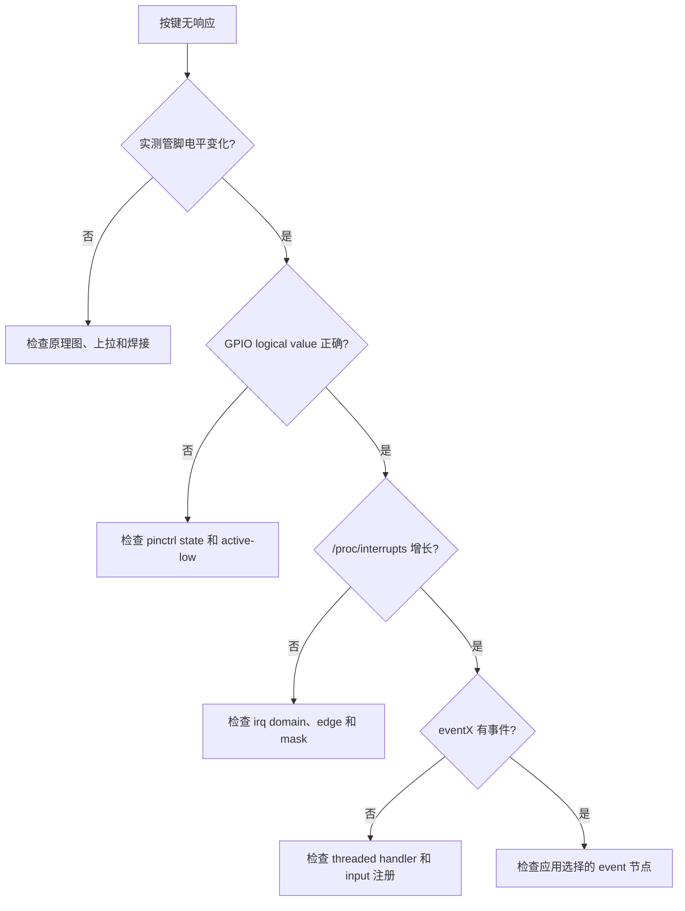
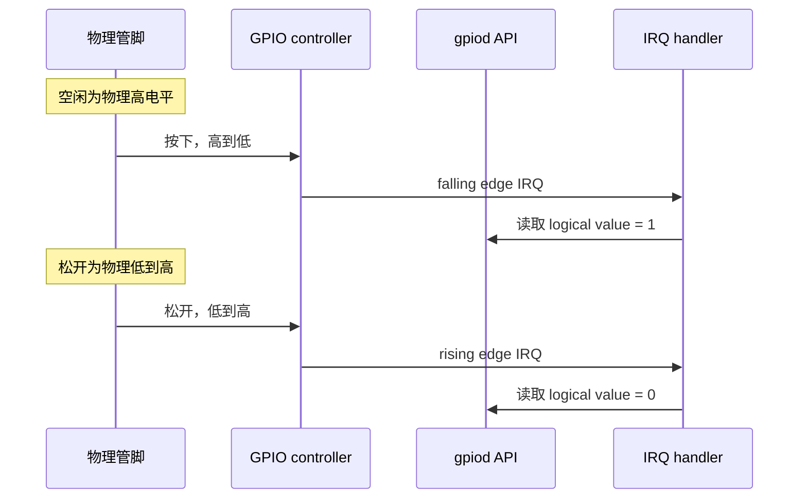
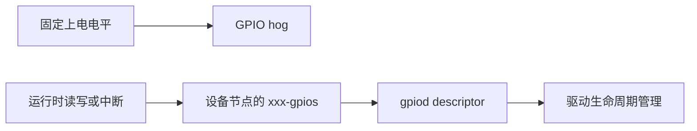
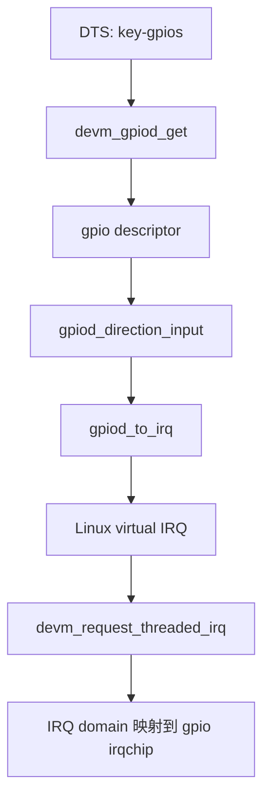
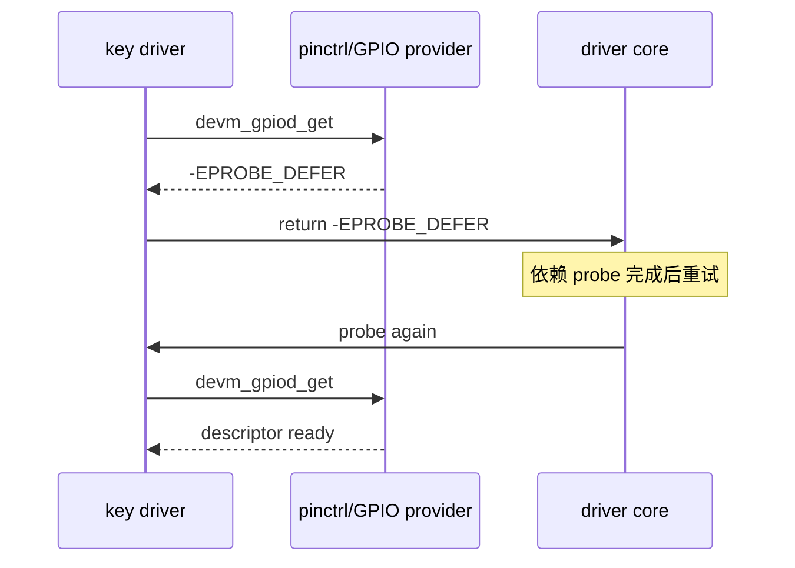
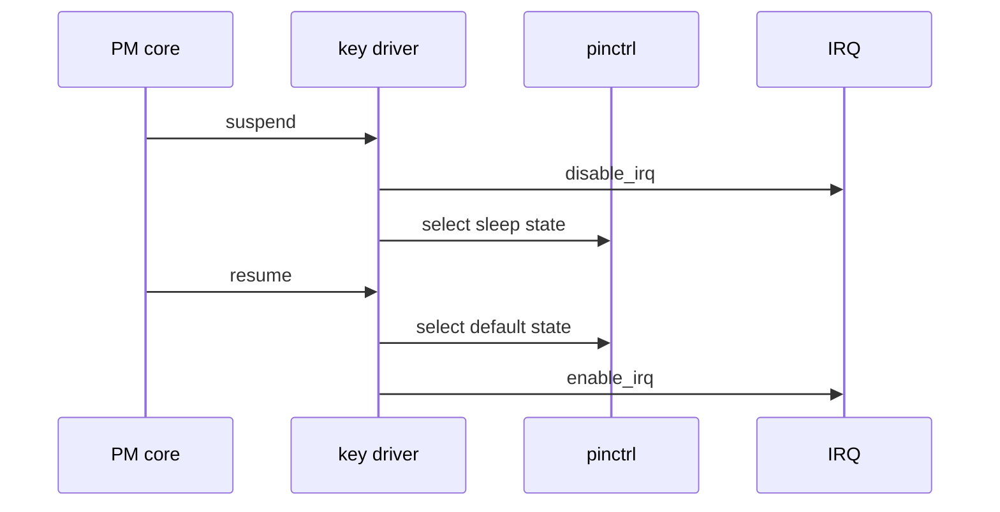
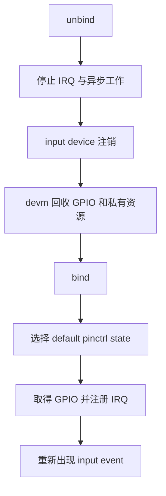

板上的一个按键不响应，通常不是“中断函数没有写对”这么简单。

同一根物理引脚在上电后可能仍是复用功能，可能浮空，可能被 GPIO hog 占用，也可能已经作为 GPIO 工作却没有接入中断控制器。

从按键到应用程序，信号要依次经过引脚复用和电气配置、GPIO 控制器、IRQ domain、驱动线程，再进入 Linux input 子系统。

本章只做一件事：为一颗普通的、低电平有效的板级按键建立一条可测量、可解绑、可休眠恢复的事件链。

按钮只是最容易观察的外设。把这条链走通后，插拔检测、传感器 data-ready、模块唤醒脚和故障告警脚都可以按相同方法排查。

## 1. 先把按键的物理链路和验收结果画出来

在改设备树和写驱动以前，先确认原理图中按键的真实连接。

本章假设按键一端接地，另一端接 SoC GPIO，并由上拉电阻把空闲状态维持为高电平。

因此按下时为低电平，松开后恢复高电平。

若实际电路是外部下拉、按下接电源，或经过了 CPLD、PMIC、扩展器，后文的极性和中断归属都必须相应调整。

不要根据丝印或旧版 DTS 猜测电平。

用万用表或逻辑分析仪测量按下、松开两种状态，并把结果写进自己的板级记录。

| 检查项 | 本章实验的预期 | 必须从实板确认的内容 |
| --- | --- | --- |
| 按键空闲电平 | 高 | 是否有外部或内部上拉 |
| 按键按下电平 | 低 | 是否被反相器或扩展器处理 |
| 信号归属 | SoC GPIO 控制器 | 引脚组、bank、pin 和复用功能 |
| 事件语义 | KEY_ENTER 按下和松开 | 应用真正需要的按键码 |
| 唤醒要求 | 本章不默认启用 | 是否需要 suspend 后唤醒系统 |
| 可观察结果 | input event 与中断计数增长 | 控制台和测试工具可用性 |

整条事件链应当能在纸上画清楚。

```mermaid
flowchart LR
    A[物理按键] --> B[上拉电阻与 PCB 走线]
    B --> C[pinctrl: GPIO 功能和 bias]
    C --> D[GPIO controller]
    D --> E[irq domain]
    E --> F[threaded IRQ handler]
    F --> G[input_report_key]
    G --> H[/dev/input/eventX]
    H --> I[evtest 或应用]
```

这张图也给出了排查顺序。

如果按下时测得管脚电平根本没有变化，问题在按键、电阻或 PCB。

如果物理电平变化而 GPIO value 不变，先查 pinctrl 和 GPIO controller。

如果 GPIO value 正确而 /proc/interrupts 不增长，查 IRQ 映射、触发类型和中断屏蔽。

如果计数增长但没有 input event，再回到驱动线程和 input 上报逻辑。

### 明确本章不做的事情

本章不把普通按键接到 polling loop 中反复读取。

轮询对验证电平有用，但会掩盖 IRQ domain、触发类型和 suspend 状态的问题。

本章也不把调试输出打到同一 UART 的流控或控制引脚上。

控制台已经是系统的关键依赖。实验信号应当选择不会影响启动、存储、电源和复位的普通 GPIO。

最后，本章默认按键不是 wakeup source。

是否允许它唤醒系统，需要在硬件供电、IRQ controller 能力、设备树和驱动 PM 回调都确认后单独加入。

### 将失败现象映射到所在层



这里的 GPIO logical value 很重要。

Linux 的 descriptor API 会结合设备树中的 GPIO_ACTIVE_LOW 标记给出逻辑值。

对于低电平有效按键，物理低电平对应逻辑有效，即驱动读到的逻辑值为 1。

这样驱动代码不必在每个判断中写反号。

## 2. 第一步：在设备树中建立 default 与 sleep 两个 pinctrl 状态

pinctrl 负责把 SoC 管脚从“某个引脚编号”变成具有明确功能和电气属性的信号。

GPIO controller 只能管理已经被复用到 GPIO 功能的引脚。

如果复用仍属于 UART、SPI、JTAG 或其他外设，即使设备树里写了 GPIO phandle，运行时也可能读到错误电平或抢占其他功能。

先为实验设备定义两个状态。

default 状态用于正常工作：选择 GPIO 功能并启用符合原理图的上拉。

sleep 状态用于系统休眠：继续保持一个确定电平，而不是让按键线悬空产生漏电或伪中断。

下列片段展示结构，Rockchip 的 bank、pin 宏和 pin config 名称必须从当前 SDK 的 dt-bindings 与板级 DTS 中取得。

```dts
&pinctrl {
    board_key {
        board_key_default: board-key-default {
            vendor,pins = <
                SOC_GPIO_BANK SOC_GPIO_PIN SOC_FUNC_GPIO
                &pcfg_pull_up
            >;
        };

        board_key_sleep: board-key-sleep {
            vendor,pins = <
                SOC_GPIO_BANK SOC_GPIO_PIN SOC_FUNC_GPIO
                &pcfg_pull_up
            >;
        };
    };
};

board_key: board-key {
    compatible = "longway,board-key";
    pinctrl-names = "default", "sleep";
    pinctrl-0 = <&board_key_default>;
    pinctrl-1 = <&board_key_sleep>;

    key-gpios = <&gpioX SOC_GPIO_PIN GPIO_ACTIVE_LOW>;
    interrupt-parent = <&gpioX>;
    interrupts = <SOC_GPIO_PIN IRQ_TYPE_EDGE_BOTH>;
    debounce-interval = <20>;
    status = "okay";
};
```

这不是可以原样粘贴到任意 RV1126 DTS 的最终文件。

SOC_GPIO_BANK、SOC_GPIO_PIN、SOC_FUNC_GPIO 和 vendor,pins 只是强调四项必须匹配：GPIO bank、管脚号、GPIO 复用功能和电气配置。

实际 Rockchip 内核通常已有对应的 pinctrl binding、pinctrl node 和 pin config macro。应在正在构建的内核树中沿用同一套写法。

### 不要混淆 GPIO 极性和 IRQ 触发类型

key-gpios 中的 GPIO_ACTIVE_LOW 描述的是逻辑语义。

它告诉 gpiod API：“物理低电平表示本设备的有效状态”。

interrupts 中的 IRQ_TYPE_EDGE_FALLING、IRQ_TYPE_EDGE_RISING 或 IRQ_TYPE_EDGE_BOTH 描述的是硬件应在哪个电平变化时产生中断。

低电平有效不自动等于只用 falling edge。

按键要上报按下和松开两个状态，通常需要双边沿；只关心按下动作的信号才可以只触发下降沿。



如果只写 GPIO_ACTIVE_LOW 而 interrupts 错写成 rising edge，驱动仍能读取正确逻辑值，但触发时机会颠倒。

如果只写 interrupts 而漏掉 GPIO_ACTIVE_LOW，事件仍可能进入驱动，但按下和松开会被解释反了。

这两类错误的表现非常相似，必须拆开检查。

### 先让内核替你选择 default state

设备节点含有 pinctrl-names 和 pinctrl-0 后，驱动 core 会在 probe 前为该设备选择 default 状态。

这解决的是“驱动第一次读 GPIO 前，管脚是否已经具备正确复用和偏置”的问题。

不能因此认为 sleep state 会自动在所有场景切换。

系统 suspend/resume 时，驱动要按设备的电源策略明确选择 sleep 或 default 状态，或者使用与所在子系统匹配的 PM helper。

对于本章的实验按键，probe 后应确认三个结果：

1. 管脚复用已从其他外设功能切到 GPIO；
2. 空闲电平稳定，按下后才变化；
3. 该管脚没有被另一个设备节点、GPIO hog 或 bootloader 配置持续占用。

可先用 debugfs 观察 pinmux 和 GPIO 状态。不同内核的文件名与字段略有差异，先列目录再读取。

```sh
mount -t debugfs none /sys/kernel/debug
find /sys/kernel/debug -maxdepth 3 -type f | grep -E 'pinctrl|gpio'
cat /sys/kernel/debug/gpio
```

输出中的 consumer 名称应当能关联到 board-key 或实际驱动名。

若同一 line 显示了意外 consumer，先停止占用方，再讨论中断注册。

### GPIO hog 只能解决早期固定配置

GPIO hog 适合上电后立即固定为高、低或输入的信号，例如某些模块使能脚、固定复位脚。

它由 GPIO controller 早期解析并持有，普通驱动通常不能再申请同一 line。

按键需要由驱动读取、转换为 IRQ 并报告 input event，不应定义成 hog。



看到 request GPIO 返回 busy 时，先检查 DTS 是否为该 line 配置了 hog，也检查 pinctrl 是否被另一个运行中外设使用。

不要通过强行释放 GPIO 或修改驱动申请顺序来掩盖资源冲突。

## 3. 第二步：用 descriptor API 取得 GPIO 并转换为 Linux IRQ

驱动不应在新代码中硬编码全局 GPIO 号码。

全局编号会随 GPIO controller 注册顺序、扩展器和内核配置改变，而设备树 phandle 加 descriptor API 保留了硬件连接关系。

本章设备树属性为 key-gpios，因此驱动通过 con_id 为 key 的 gpiod helper 获取它。

probe 的第一段代码只处理资源取得和输入设备注册。

```c
struct board_key {
    struct device *dev;
    struct gpio_desc *key;
    struct input_dev *input;
    int irq;
    bool software_debounce;
    unsigned long last_event;
};

static irqreturn_t board_key_irq_thread(int irq, void *data);

static int board_key_probe(struct platform_device *pdev)
{
    struct device *dev = &pdev->dev;
    struct board_key *priv;
    int ret;

    priv = devm_kzalloc(dev, sizeof(*priv), GFP_KERNEL);
    if (!priv)
        return -ENOMEM;

    priv->dev = dev;
    priv->key = devm_gpiod_get(dev, "key", GPIOD_IN);
    if (IS_ERR(priv->key))
        return dev_err_probe(dev, PTR_ERR(priv->key),
                             "failed to get key GPIO\n");

    ret = gpiod_direction_input(priv->key);
    if (ret)
        return dev_err_probe(dev, ret, "failed to set key as input\n");

    priv->input = devm_input_allocate_device(dev);
    if (!priv->input)
        return -ENOMEM;

    priv->input->name = "longway-board-key";
    priv->input->phys = "longway-board-key/input0";
    priv->input->id.bustype = BUS_HOST;
    input_set_capability(priv->input, EV_KEY, KEY_ENTER);

    ret = input_register_device(priv->input);
    if (ret)
        return dev_err_probe(dev, ret, "failed to register input device\n");

    platform_set_drvdata(pdev, priv);
    return 0;
}
```

devm_gpiod_get 会把 descriptor 的释放绑定到 device 生命周期。

probe 后续步骤失败时不需要手动 gpiod_put，unbind 时也不需要在 remove 中重复释放。

这不表示 remove 可以省略停止异步活动的责任。devm 只负责资源释放，不能替驱动停止 workqueue、IRQ 线程正在使用的数据或外部硬件事务。

### GPIO 转 IRQ 前，先完成输入方向设置

gpiod_to_irq 将某个 GPIO descriptor 转成内核可供 request_irq 使用的 Linux IRQ number。

这个数字由 irq domain 分配，不等于 datasheet 中的硬件中断号，也不应写死到驱动。

转换前要把 GPIO 配置为输入。

这是因为 GPIO controller 只有在 input path 正确启用后，才能可靠地把该 line 作为中断源交给 irqchip。



继续在 probe 中加入 debounce 和 IRQ 注册。

```c
static int board_key_request_irq(struct platform_device *pdev,
                                 struct board_key *priv)
{
    struct device *dev = &pdev->dev;
    int ret;

    ret = gpiod_set_debounce(priv->key, 20000);
    if (ret == -ENOTSUPP) {
        priv->software_debounce = true;
    } else if (ret) {
        return dev_err_probe(dev, ret, "failed to configure debounce\n");
    }

    priv->irq = gpiod_to_irq(priv->key);
    if (priv->irq < 0)
        return dev_err_probe(dev, priv->irq, "failed to map GPIO to IRQ\n");

    ret = devm_request_threaded_irq(dev, priv->irq, NULL,
                                    board_key_irq_thread,
                                    IRQF_ONESHOT | IRQF_TRIGGER_RISING |
                                    IRQF_TRIGGER_FALLING,
                                    dev_name(dev), priv);
    if (ret)
        return dev_err_probe(dev, ret, "failed to request key IRQ\n");

    return 0;
}
```

这个例子故意没有提供 hard IRQ handler，而只提供 thread_fn。

通用 IRQ 层会安排线程处理函数运行。IRQF_ONESHOT 使该 IRQ 在线程完成前保持屏蔽，避免同一按键的抖动边沿并发进入多个线程。

线程上下文允许使用可能 sleep 的 GPIO controller，因此后面可以安全使用 gpiod_get_value_cansleep 和短暂的 usleep_range。

request_threaded_irq 成功后，中断可能立即到来。

所以 input device、私有状态和所有线程会访问的字段必须在申请 IRQ 前准备完成。

不要把 priv 初始化、input_register_device 或锁初始化放到这一步之后。

### 在延迟 probe 时保留真正的错误原因

某些 GPIO、pinctrl、IRQ controller 或扩展器还未 probe 时，devm_gpiod_get 或 gpiod_to_irq 可能返回 -EPROBE_DEFER。

dev_err_probe 会以统一方式记录并传递这个状态，driver core 会在依赖就绪后重新尝试 probe。



遇到 deferred probe 时，不要把返回值改成忽略错误后继续运行。

先从 dmesg 中确认提供方是否实际注册、设备树 phandle 是否指向正确 controller，以及 required module 是否已装载。

## 4. 第三步：在 threaded IRQ 中完成消抖并报告 input event

机械按键在按下和松开瞬间会短暂反复接通、断开。

GPIO controller 可能支持硬件 debounce，也可能不支持或粒度不够。

驱动的目标不是“每次边沿都报一个事件”，而是稳定采样后只把真实状态交给 input 子系统。

本章的策略是优先请求硬件 debounce。

只有 controller 返回 -ENOTSUPP 时，才在线程上下文中等待一个很短的稳定时间后重新读取。

不要在 hard IRQ handler 中调用 msleep、mutex_lock、printk 大量输出或可能 sleep 的 gpiod_get_value_cansleep。

```c
static irqreturn_t board_key_irq_thread(int irq, void *data)
{
    struct board_key *priv = data;
    int value;

    if (priv->software_debounce)
        usleep_range(5000, 7000);

    value = gpiod_get_value_cansleep(priv->key);
    if (value < 0) {
        dev_warn_ratelimited(priv->dev,
                             "failed to sample key GPIO: %d\n", value);
        return IRQ_HANDLED;
    }

    if (time_before(jiffies,
                    priv->last_event + msecs_to_jiffies(5)))
        return IRQ_HANDLED;

    priv->last_event = jiffies;
    input_report_key(priv->input, KEY_ENTER, value);
    input_sync(priv->input);

    return IRQ_HANDLED;
}
```

这里 value 是逻辑值。

设备树中已经声明 GPIO_ACTIVE_LOW 后，按键按下时 gpiod_get_value_cansleep 返回 1，松开时返回 0。

因此 input_report_key 的第三个参数可以直接使用 value。

如果驱动手动对 value 取反，又会把已经由 descriptor layer 完成的极性转换做第二次。

### 用 input 子系统表达用户可见事件

按键不是一个自定义字符设备协议。

Linux input 子系统提供了标准 event 节点、按键码、状态同步和用户态工具，可以让桌面、终端程序或守护进程使用同一种接口。

事件流如下。

```mermaid
flowchart LR
    A[GPIO edge] --> B[threaded IRQ]
    B --> C[稳定采样 logical value]
    C --> D[input_report_key]
    D --> E[input_sync]
    E --> F[input core]
    F --> G[/dev/input/eventX]
    G --> H[evtest]
```

先用 input registration 的日志或 /proc/bus/input/devices 找到设备，再使用 evtest 观察事件。

```sh
grep -A8 -B2 longway-board-key /proc/bus/input/devices
evtest /dev/input/eventX
```

按下时应看到 KEY_ENTER value 1，松开时看到 value 0。

若 eventX 编号改变，不要把编号硬编码进量产脚本。应该按设备名称、udev 规则或应用自身的设备枚举方式匹配。

### 选择线程处理还是硬中断处理

不是每个 GPIO IRQ 都需要 threaded handler。

片上、不可 sleep 的 GPIO controller，且 handler 只做极短的寄存器确认、原子状态记录或唤醒工作队列时，可以使用 hard IRQ。

但是按键消抖、I2C GPIO 扩展器读值、input 上报前的稳定采样都更适合 threaded IRQ。

| 场景 | 推荐上下文 | 原因 |
| --- | --- | --- |
| 只记录时间戳并触发 tasklet/work | hard IRQ | 不访问可能 sleep 的资源 |
| GPIO 来自 I2C/SPI 扩展器 | threaded IRQ | 读取 GPIO 可能需要总线传输 |
| 机械按键软件消抖 | threaded IRQ | 可以短暂等待稳定 |
| 高速数据采集完成中断 | 视硬件和延迟要求而定 | 先确认 IRQ budget 与下半部设计 |
| 一般状态变化通知 | threaded IRQ + workqueue | 保持 IRQ 线程短小且可恢复 |

threaded IRQ 并不等于可以在里面做耗时业务。

如果事件要触发文件 I/O、网络、传感器全量读取或复杂状态机，应由 handler 只更新必要状态，再排入有明确生命周期的 workqueue。

### 让 sleep 和 resume 回到确定的引脚状态

按键线在系统休眠期间仍可能受到外部干扰。

如果该按键不负责唤醒，可以在 suspend 中停止 IRQ，再选择 pinctrl sleep 状态；resume 时先恢复 default state，再恢复 IRQ。

顺序的关键是：不要在引脚复用或电气状态尚未恢复时放开中断。



平台驱动的 PM 回调写法应与当前内核版本、driver core 和 pinctrl helper 相匹配。

在没有确认 wakeup source 需求前，不要仅仅因为“按键中断存在”就调用 enable_irq_wake。

错误地把普通噪声线设为 wake source，会造成系统反复伪唤醒，问题往往只在长时间待机后出现。

## 5. 第四步：用中断计数、事件记录和解绑回归完成验收

按键驱动完成编译并不代表链路正确。

验收必须从下到上覆盖 pinctrl、GPIO、IRQ、input 和 PM，并且至少完成一次卸载或 unbind 后再绑定。

先确认设备实例已绑定到预期 driver。

```sh
ls -l /sys/bus/platform/drivers/longway-board-key
readlink /sys/bus/platform/devices/board-key/driver
```

真实的 platform device 名称可能附带地址或来自设备树节点名。

可先从 /sys/bus/platform/devices 中列出，再决定 unbind 路径；不要按本文示例直接对不确定节点执行 unbind。

### 建立一次可复现的验收记录

建议在串口日志或测试记录中保存以下五组证据。

| 层级 | 命令或工具 | 合格证据 |
| --- | --- | --- |
| pinctrl/GPIO | debugfs gpio 与 pinctrl 信息 | consumer、方向、逻辑电平符合预期 |
| GPIO 物理层 | 万用表或逻辑分析仪 | 按下和松开有明确边沿 |
| IRQ | cat /proc/interrupts | 对应 Linux IRQ 计数随动作增长 |
| input | evtest eventX | KEY_ENTER 依次出现 1 和 0 |
| 生命周期 | unbind/rebind | 无 use-after-free、无 resource busy，重新出现事件 |

中断计数可以在按键前后对比。

```sh
grep -n -i 'board-key\|longway' /proc/interrupts
cat /proc/interrupts > /tmp/irq-before.txt

# 完成十次按下和松开后：
cat /proc/interrupts > /tmp/irq-after.txt
diff -u /tmp/irq-before.txt /tmp/irq-after.txt
```

中断行的名称取决于 request_threaded_irq 的 dev_name 参数和平台 irqchip。

如果 grep 不到，先从完整 /proc/interrupts 中根据按键动作前后的计数变化定位，再回到 DTS 与日志核对。

### 用症状表避免盲目改触发类型

| 现象 | 高概率原因 | 应采取的第一步 |
| --- | --- | --- |
| GPIO 一直是 0 或 1 | pinmux 错、bias 配置错误、物理短路或未接线 | 用仪器测管脚，再查 pinctrl debug 信息 |
| gpiod_get 返回 busy | hog 或另一设备占用 line | 查 DTS 和 debugfs consumer |
| gpiod_to_irq 失败 | controller 没有 IRQ 能力、方向未设为输入或 phandle 错 | 查 provider 与 GPIO/IRQ binding |
| IRQ 计数不增长 | interrupts 触发类型错、irq 被屏蔽或 line 没有边沿 | 比对物理边沿和 DTS flags |
| 一次按下出现多组事件 | 硬件抖动、debounce 不生效 | 先确认 controller 是否支持 debounce，再调整稳定采样 |
| 事件 1/0 颠倒 | GPIO_ACTIVE_LOW 配置错误或代码重复反相 | 固定一种极性处理位置，优先用 descriptor logical value |
| suspend 后伪触发 | sleep state 浮空或错误启用 wake | 检查 pinctrl sleep、bias 和 IRQ wake 设置 |
| unbind 后内核告警 | work、timer 或 IRQ 线程仍引用私有数据 | 先停止异步执行，再让 devm 回收资源 |

不要在每次触发失败后轮流修改 GPIO_ACTIVE_LOW、IRQ_TYPE 和驱动里的取反表达式。

一次只验证一个边界：先确认物理电平，再确认 logical value，随后确认 IRQ 计数，最后确认 input event。

### 解绑和重新绑定是资源边界测试

对 platform device 执行 unbind/rebind 前，应确保没有测试程序长期占用对应 event 节点。

操作时持续查看 dmesg。

```sh
DEVICE=board-key
DRIVER=longway-board-key

echo "$DEVICE" > "/sys/bus/platform/drivers/$DRIVER/unbind"
dmesg | tail -n 80

echo "$DEVICE" > "/sys/bus/platform/drivers/$DRIVER/bind"
dmesg | tail -n 80
```

示例中的 DEVICE 和 DRIVER 必须替换为 sysfs 中实际存在的名字。

成功的 rebind 应重新申请 GPIO 和 IRQ，重新注册 input device，并使新的 event 节点恢复产生事件。

若 remove 后仍有中断、workqueue 或 timer 访问 priv，devm 释放内存时会把生命周期错误暴露出来。

这比只在开机时测试一次更接近真实驱动的资源约束。



### 本章练习

先用原理图和实测确定一根低电平有效按键的 bank、pin、空闲电平和按下电平。

为它补齐 default 和 sleep 两个 pinctrl state，并通过 debugfs 证明驱动 probe 前后 consumer 和方向符合预期。

完成一个只使用 descriptor API 的 platform 驱动，在 threaded IRQ 中上报 KEY_ENTER。

分别验证十次按键、一次 suspend/resume、一次 unbind/rebind，并为每一步保存 GPIO、IRQ 计数和 input event 的证据。

### 本章验收

完成本章后，应能独立回答：

- pinctrl、GPIO controller 和 irqchip 分别解决哪一层问题；
- 为什么 GPIO_ACTIVE_LOW 与 IRQ_TYPE_EDGE_FALLING 不能混为一谈；
- 为什么默认 pinctrl state 必须在 probe 前就准备好；
- 为什么新驱动应使用 gpiod descriptor 而不是全局 GPIO 编号；
- 为什么 gpiod_to_irq 得到的是 Linux virtual IRQ，而不是 datasheet 数字；
- 为什么软件消抖和可能 sleep 的 GPIO 读取适合放在线程化中断中；
- 为什么启用 wake source 前必须核对 sleep state、供电和 IRQ controller 能力；
- 如何用 /proc/interrupts、evtest 和 unbind/rebind 证明整条事件链真实可用。

当一根管脚的功能、电气状态、逻辑极性、中断映射和事件语义都能被单独验证时，GPIO 中断问题就不再是靠改标志位碰运气。

> 🏷️ Linux BSP · pinctrl · GPIO descriptor · irq domain · threaded IRQ · debounce · input subsystem
