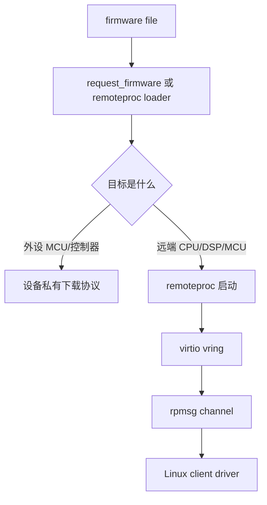
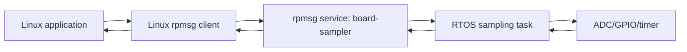
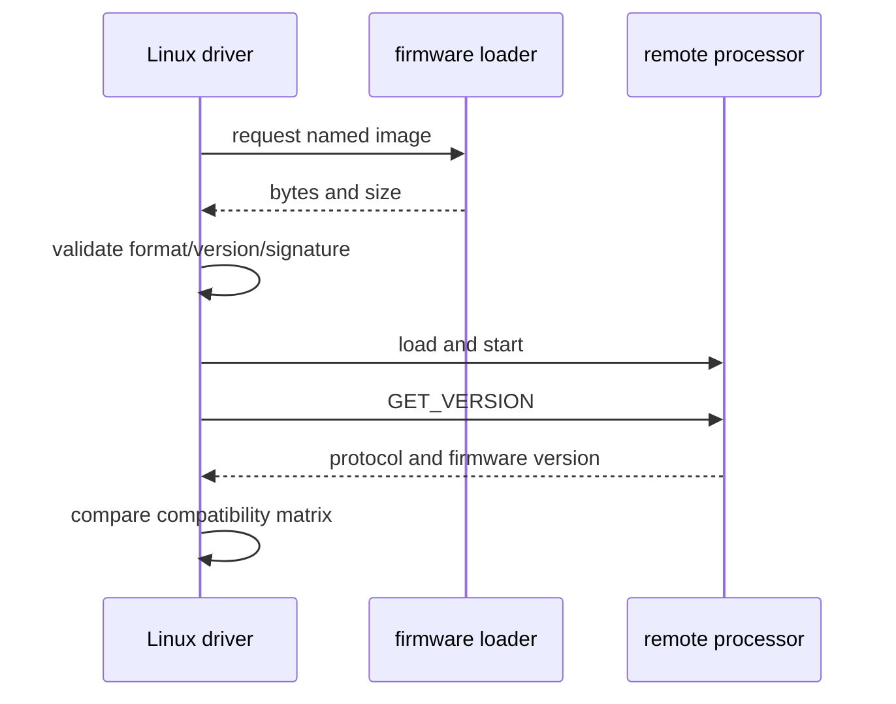
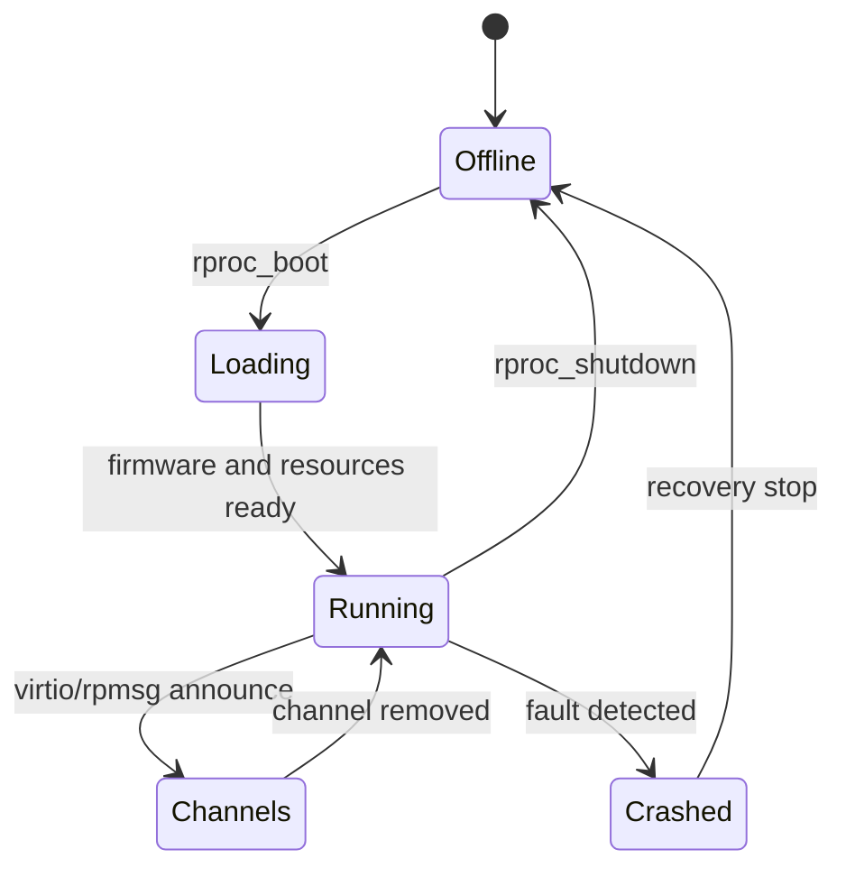
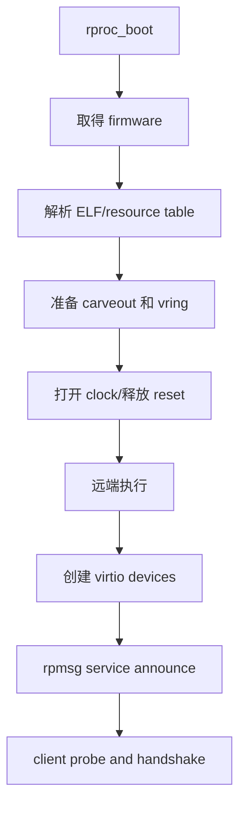
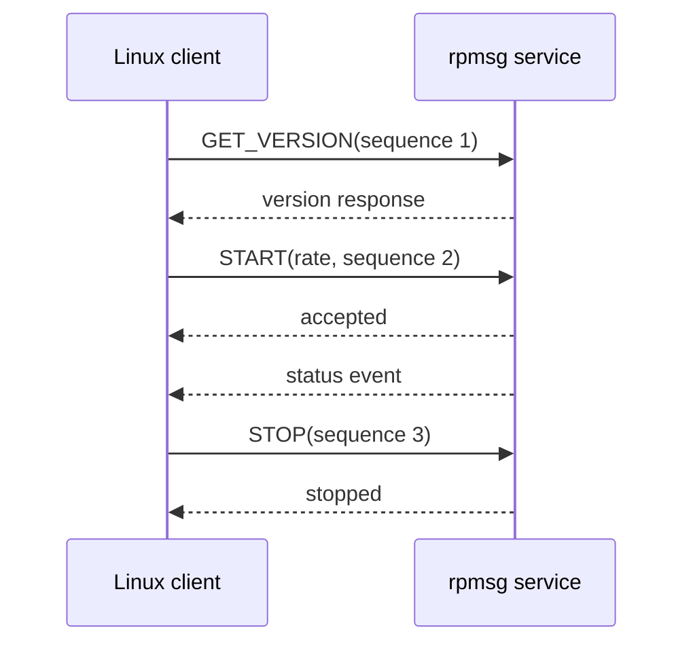
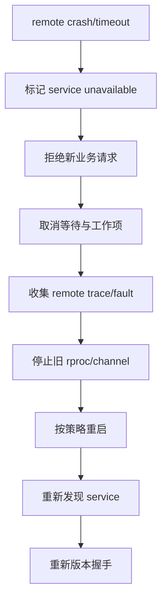

SoC 中的“另一个核”不是 Linux 线程。

它可能运行 RTOS、裸机任务或厂商固件，拥有独立的复位、时钟、内存视图和调试接口。

Linux 要让它承担传感器实时采样、低延迟控制或特定加速任务，至少要解决四件事：取得可信固件、启动和停止远端处理器、建立消息通道、在远端崩溃时保护本地系统。

本章以“Linux 请求一个实时协处理器完成板级采样服务”为主线，把 request_firmware、remoteproc 和 rpmsg 放入同一个可测试的生命周期。

实际 RV1126 SDK 是否公开了可由 mainline remoteproc 管理的协处理器，以及其 memory carveout、mailbox 和 firmware 格式，必须以厂商内核与硬件文档为准。

## 1. 先区分设备固件、远端处理器与消息服务

普通设备固件的典型流程是：驱动通过 request_firmware 读取一个二进制，校验后把它写入网卡、触摸屏或传感器内部存储。

remoteproc 则管理一个独立执行单元：加载其镜像、准备内存和 mailbox、拉起处理器，并根据 firmware resource table 创建 virtio/rpmsg 设备。

rpmsg 位于更上层，只负责 Linux 与已经运行的远端服务传递消息。



| 层 | 解决的问题 | 不负责什么 |
| --- | --- | --- |
| Firmware API | 从标准位置取得二进制对象 | 不决定目标设备如何执行它 |
| 外设驱动下载逻辑 | 写 flash、SRAM 或寄存器窗口 | 不创建 rpmsg 设备 |
| remoteproc | 远端核的 load、start、stop、crash 生命周期 | 不定义业务消息格式 |
| rpmsg | Linux 与远端服务的 channel 和 endpoint | 不替你验证业务数据 |
| 应用协议 | 命令、版本、超时、权限和结果 | 不替框架回收底层资源 |

把这些层分开后，日志中的“firmware loaded”只能说明文件已经取得，不能说明远端程序真的运行并提供服务。

### 定义一次最小板级服务

为了避免用抽象名词堆砌，假定远端负责以固定频率采样一个受时间约束的信号。

Linux 负责配置采样率、取得统计结果、记录故障并在启动时检查协议版本。



最小协议只需要三个请求：GET_VERSION、START 和 GET_STATUS。

一开始不要允许 Linux 任意写远端物理地址、任意寄存器或任意执行入口。远端本身可能拥有较宽硬件访问权限，协议边界就是安全边界。

## 2. 第一步：把固件作为可追溯、可校验的发布物

固件文件名、版本、hash、来源和对应硬件 revision 应进入发布记录。

不要把编译目录中的随机 .bin 直接复制到 rootfs，再由驱动按硬编码绝对路径读取。

Linux firmware API 让 driver 使用设备关联的名字请求镜像，常见存放位置由系统 firmware loader 和发行版/Buildroot 配置决定。

```c
static int sampler_load_aux_firmware(struct device *dev)
{
    const struct firmware *fw;
    int ret;

    ret = request_firmware(&fw, "longway/sampler-fw.bin", dev);
    if (ret)
        return dev_err_probe(dev, ret, "failed to load sampler firmware\n");

    ret = sampler_validate_image(fw->data, fw->size);
    if (!ret)
        ret = sampler_write_image(dev, fw->data, fw->size);

    release_firmware(fw);
    return ret;
}
```

request_firmware 可能睡眠，因此不能从硬中断或持有不允许睡眠的锁的上下文调用。

release_firmware 必须在所有成功或失败路径中成对出现。

sampler_validate_image 至少要检查长度、格式版本、目标硬件兼容性和完整性；产品安全要求更高时，还需要基于可信密钥的签名验证和 anti-rollback 策略。

### 把版本放在镜像和运行协议中

文件名不足以防止 rootfs 中的旧镜像被误替换。

镜像头可包含 magic、image version、target id、payload length、hash 与签名信息。

远端启动后仍需通过 GET_VERSION 回报运行中版本，因为“磁盘上的文件版本”不等于“当前正在执行的版本”。



当固件只是可选增强功能，可使用对应的 optional firmware 策略并让 driver 降级运行。

但远端是安全控制、存储保护或关键供电路径的一部分时，缺失或不兼容应明确阻止服务启动，不能静默绕过。

### 为什么不能把文件读取和启动混成一个布尔值

在调试时至少记录以下状态：

| 状态 | 代表什么 | 下一步是否安全 |
| --- | --- | --- |
| image absent | rootfs 中未找到文件 | 不可启动 |
| image acquired | firmware loader 返回数据 | 尚不可启动 |
| image validated | 文件格式和版本可信 | 可尝试加载 |
| rproc running | 远端核已被拉起 | 尚未证明 channel 就绪 |
| service announced | rpmsg service 已出现 | 可进行版本握手 |
| protocol ready | 双方版本兼容 | 可接收业务请求 |

这能避免“远端没有响应”时在文件路径、mailbox 和协议层之间盲目跳转。

## 3. 第二步：让 remoteproc 管理远端核的启动资源

remoteproc 将平台相关的电源、复位、firmware load、mailbox kick 和 crash detection 收敛在 rproc driver 中。

上层 client 不应自己操作 remote reset register 再向 rpmsg 发送消息。

对于 remoteproc client，正确语义是取得 rproc handle、调用 rproc_boot，使用结束后调用 rproc_shutdown；每一次 boot 都应有一次 shutdown。



平台 DTS 常需描述远端核、其 firmware 名称、reserved memory carveout、mailbox、reset、clock 与 IOMMU 关系。

属性名称和节点结构完全依赖 SoC 的 remoteproc binding，以下仅展示应核对的资源类型。

```dts
remote_cpu: remoteproc@SOC_ADDR {
    compatible = "vendor,remote-cpu";
    memory-region = <&rproc_fw_mem>, <&rproc_vring_mem>;
    mboxes = <&mailbox TX_CHAN>, <&mailbox RX_CHAN>;
    resets = <&reset_controller REMOTE_RESET>;
    clocks = <&cru REMOTE_CLK>;
    firmware-name = "longway/sampler-fw.elf";
    status = "okay";
};
```

reserved memory 不是普通可随意分配的 RAM。

它可能存放 firmware segment、vring、trace buffer 或远端可见共享数据。地址、大小、cache 属性和是否经 IOMMU 映射都必须与 firmware resource table 和硬件 memory map 一致。

### 远端启动前后分别检查什么



若失败发生在 A 到 E，优先检查 firmware 文件、reserved memory、power/reset 和 platform rproc driver。

若 rproc 显示 running 但没有 H，问题更可能在远端 firmware 的 resource table、vring、mailbox 或服务注册。

不要因 channel 未出现就重复 reset 远端核；先收集 remote trace、mailbox 与 resource table 信息。

### 平台 client 的引用计数

需要主动控制远端核的 driver 可通过设备树 phandle 取得 handle。

```c
static int sampler_client_start(struct device *dev)
{
    struct rproc *rproc;
    u32 rproc_phandle;
    int ret;

    ret = of_property_read_u32(dev->of_node, "remoteproc", &rproc_phandle);
    if (ret)
        return ret;

    rproc = rproc_get_by_phandle(rproc_phandle);
    if (!rproc)
        return -ENODEV;

    ret = rproc_boot(rproc);
    if (ret)
        rproc_put(rproc);

    return ret;
}

static void sampler_client_stop(struct rproc *rproc)
{
    rproc_shutdown(rproc);
    rproc_put(rproc);
}
```

示例强调 handle 与 power reference 是两层生命周期。

实际代码应把 rproc 指针保存到私有数据，确保只有已成功 boot 的实例调用 shutdown，并让 remove、错误回滚和 PM 路径各自恰好释放一次。

## 4. 第三步：把 rpmsg channel 当成有版本和长度边界的协议

remote firmware 通过 name service 宣告服务后，rpmsg bus 才会创建对应 device 并使 Linux rpmsg driver probe。

channel 的文本名是匹配条件，不是权限控制机制。

驱动必须验证每个 payload 的长度、版本、命令范围与状态，不能把数据直接强转为任意结构体后执行。

```c
struct sampler_msg {
    __le16 version;
    __le16 command;
    __le32 sequence;
    __le32 payload_bytes;
    u8 payload[];
} __packed;

struct sampler_start_msg {
    struct sampler_msg header;
    __le32 rate_hz;
} __packed;

static int sampler_send_start(struct rpmsg_endpoint *ept, u32 rate_hz)
{
    struct sampler_start_msg msg = {
        .header.version = cpu_to_le16(SAMPLER_PROTOCOL_VERSION),
        .header.command = cpu_to_le16(SAMPLER_CMD_START),
        .header.sequence = cpu_to_le32(1),
        .header.payload_bytes = cpu_to_le32(sizeof(msg.rate_hz)),
        .rate_hz = cpu_to_le32(rate_hz),
    };

    return rpmsg_send(ept, &msg, sizeof(msg));
}
```

这里的 compact header 只是示例。payload 结构必须真实包含 rate_hz，并以双方约定的字节序写入，不能只把长度标成四字节。

更重要的是协议需要定义：最大 payload、超时、允许的状态转换、未知命令返回码、重复 sequence 的处理和远端重启后版本变化。



rpmsg_send 在无可用 TX buffer 时可能阻塞，因此只应在允许睡眠的上下文调用。

中断或不可阻塞路径可通过队列交给工作线程，或选择适合自身失败语义的非阻塞发送方式。

### 收包回调只做边界验证和状态交接

```c
static int sampler_rpmsg_cb(struct rpmsg_device *rpdev, void *data,
                            int len, void *priv, u32 src)
{
    const struct sampler_msg *msg = data;

    if (len < sizeof(*msg))
        return -EINVAL;

    if (le16_to_cpu(msg->version) != SAMPLER_PROTOCOL_VERSION)
        return -EPROTO;

    if (le32_to_cpu(msg->payload_bytes) >
        len - offsetof(struct sampler_msg, payload))
        return -EMSGSIZE;

    sampler_queue_response(priv, msg);
    return 0;
}
```

回调内不应把远端发来的 size、地址或索引直接用于内存分配、DMA 或寄存器写入。

远端 firmware 可能崩溃、版本不匹配或出现缺陷；Linux 把它视为不可信通信对端，能减少一个远端错误扩大为内核漏洞。

## 5. 第四步：把远端崩溃、重启和解绑纳入验收

远端核一旦异常复位，原先的 rpmsg endpoint、vring 和业务状态可能都已失效。

Linux client 不能继续使用旧 endpoint，也不能假定当前命令一定会返回。

应在 channel remove、rproc crash 或协议超时时进入明确的故障状态，停止向外提供看似正常的数据。



自动重启是否安全，取决于远端控制的硬件。

若远端直接控制电机、电源或安全关键执行器，崩溃恢复必须先由硬件进入安全态，并通过产品级故障策略批准后才可重新启动。

### 建立可回放的故障记录

| 证据 | 用来回答的问题 |
| --- | --- |
| firmware 文件名、hash、版本 | 启动的是哪一个镜像 |
| rproc state 与启动时间 | 远端是否真正被拉起 |
| rpmsg service name 与 protocol version | 哪个服务、哪种协议已就绪 |
| 每个 command sequence 与耗时 | 超时发生在哪次请求 |
| remote trace 或 crash reason | 远端为何停止响应 |
| restart 次数与时间窗口 | 是否存在 crash loop |

测试时可先让远端 firmware 提供一个受控的“返回错误”命令，而不是直接注入非法内存访问。

再验证 Linux client 是否能在 timeout 后停止业务、向上层报告明确状态，并在服务重新公告后完成重新握手。

### 本章练习

选择一个不会控制安全关键硬件的协处理器或仿真 remoteproc 场景，梳理其 firmware 文件、memory carveout、mailbox 和 service name。

为固件镜像定义版本字段与 hash 记录，并让 Linux 在启动后通过 rpmsg 查询运行中版本。

实现一个长度受限、带 sequence 的 GET_STATUS 请求，验证错误版本、截断 payload、超时和服务重启都不会导致内核越界或永久阻塞。

最后完成 rproc boot、service announce、正常 stop、异常服务消失和重新发现的完整记录。

### 本章验收

完成本章后，应能独立回答：

- request_firmware、remoteproc 和 rpmsg 分别处于哪一层；
- 为什么取得 firmware bytes 不等于远端服务已经就绪；
- remoteproc 的 memory carveout、resource table 和 virtio/ring 有何关系；
- 为什么每一次 rproc_boot 都需要对应 rproc_shutdown；
- 为什么 rpmsg channel name 不能替代业务协议的版本和长度校验；
- 为什么 rpmsg 发送不能随意在中断上下文阻塞；
- 为什么远端对 Linux driver 而言应视为不可信通信对端；
- 如何在远端 crash 后安全停止、采证、重启和重新握手。

把远端核当作独立运行、独立失败、独立升级的系统来设计，Linux 与实时世界的边界才会清晰而可维护。

> 🏷️ Linux BSP · request_firmware · remoteproc · rpmsg · AMP · virtio · firmware lifecycle
