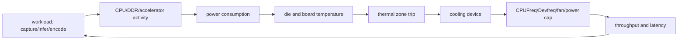
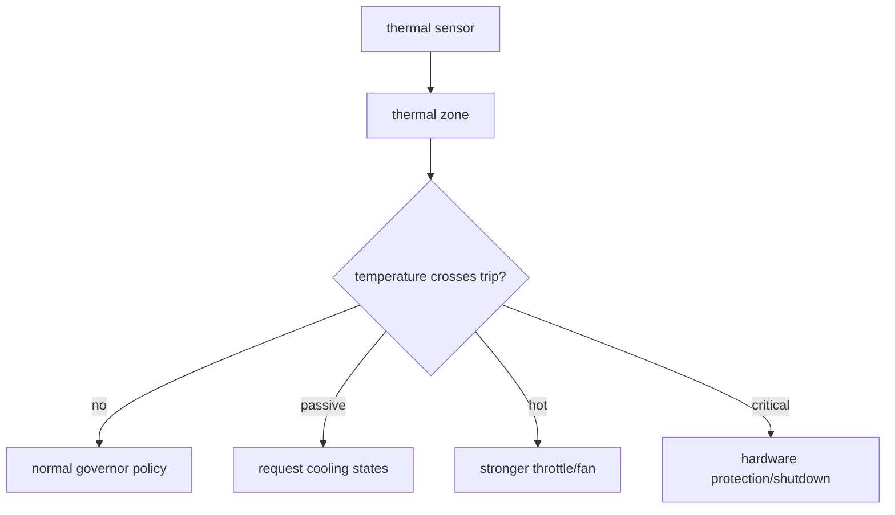
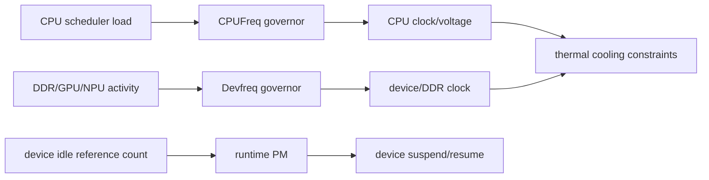
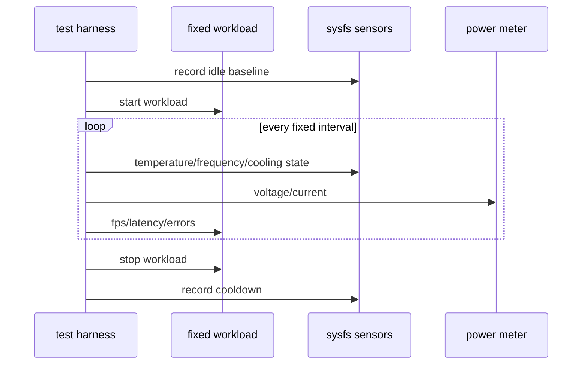
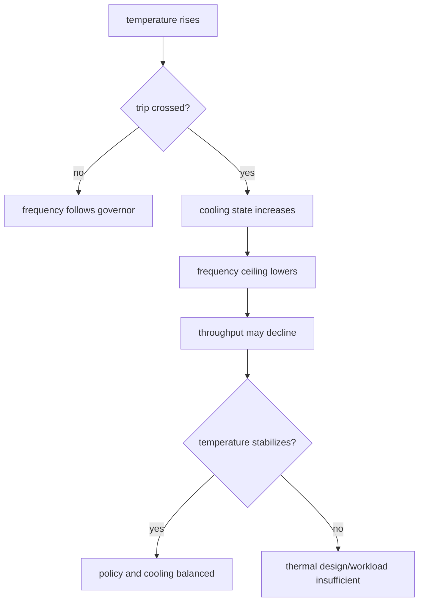
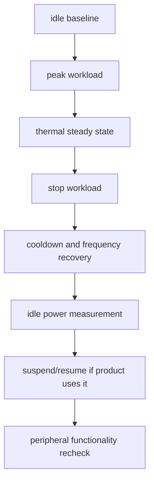

设备在室温下跑通一次推理或视频编码，并不表示它能在封闭机箱、夏季环境和连续负载下稳定运行。

SoC 的 CPU、DDR、ISP、NPU、GPU 和外设频率受 voltage、clock、thermal policy、cooling device 与 runtime PM 共同影响。

温度升高后的降频可能是保护机制正常工作，也可能是散热设计不足、thermal trip 配置错误或某个设备长期无法进入 idle。

本章以“持续图像采集和处理负载下，记录温度、频率、吞吐和功耗变化”为主线，建立可解释的系统热管理方法。

## 1. 先定义热、性能和功耗的因果链

CPU 负载高不一定是温度最高的来源，DDR、ISP、NPU、编码器、PMIC 和屏幕背光都可能贡献热量。

温度传感器读数也不是芯片表面温度的直接等价物；它表示某个 sensor 位置、校准和采样策略下的逻辑温度。



| 观察量 | 说明 | 不能单独证明 |
| --- | --- | --- |
| thermal zone 温度 | 内核用于 policy 的传感读数 | 外壳真实温度或 sensor 精度 |
| CPU frequency | 当前或策略选择频率 | CPU 实际执行效率 |
| devfreq rate | DDR/GPU/NPU 等设备频率 | 端到端吞吐 |
| workload FPS/latency | 业务输出 | 哪个硬件导致瓶颈 |
| 输入功耗/电流 | 系统能源消耗 | 单个模块功耗分解 |
| fan PWM/RPM | 散热执行状态 | 风道和散热器效率 |

先固定负载、环境温度、机箱状态和供电，再记录数据。只改变一个条件，才能比较散热片、风扇策略或频率 policy 的影响。

## 2. 第一步：确认 DTS 中 thermal zone、sensor 与 cooling device 的关系

thermal zone 引用传感器并定义 trip 点与 hysteresis；cooling map 将特定 trip 关联到 CPUFreq、Devfreq、风扇或其他冷却设备。

属性、单位和可用 cooling device 依赖 SoC thermal binding 与当前内核驱动，下面只显示结构。

```dts
thermal-zones {
    soc_thermal {
        polling-delay-passive = <ACTUAL_DELAY_MS>;
        polling-delay = <ACTUAL_DELAY_MS>;

        trips {
            passive_trip: passive {
                temperature = <ACTUAL_PASSIVE_MILLIC>;
                hysteresis = <ACTUAL_HYSTERESIS_MILLIC>;
                type = "passive";
            };

            critical_trip: critical {
                temperature = <ACTUAL_CRITICAL_MILLIC>;
                hysteresis = <0>;
                type = "critical";
            };
        };

        cooling-maps {
            map0 {
                trip = <&passive_trip>;
                cooling-device = <&cpu0 THERMAL_NO_LIMIT THERMAL_NO_LIMIT>;
            };
        };
    };
};
```

critical trip 涉及硬件安全，不应为追求 benchmark 分数而随意抬高。

passive trip 与 hysteresis 则要匹配散热能力和产品体验，过于激进会造成频率来回抖动，过于宽松会使外壳温度超标或接近 critical。



### 不要用单个温度命令判断政策是否工作

系统通常暴露多个 thermal zone，名称、type 和温度单位可能不同。

先列出全部 zone，再找对应 SoC/PMIC/板级 sensor。

```sh
for z in /sys/class/thermal/thermal_zone*; do
    printf '%s ' "$z"
    cat "$z/type" "$z/temp"
done

for c in /sys/class/thermal/cooling_device*; do
    printf '%s ' "$c"
    cat "$c/type" "$c/cur_state" "$c/max_state"
done
```

如果 zone 从未升温，先验证 sensor driver 和采样，不要因为没有触发 throttle 就认定散热良好。

## 3. 第二步：区分 CPUFreq、Devfreq 和 runtime PM 的控制对象

CPUFreq 调节 CPU cluster 的频率/电压策略；Devfreq 调节 DDR、GPU、NPU 或其他支持的设备频率；runtime PM 则让闲置 device 进入低功耗状态。

它们不是同一开关，必须分别观察。



可读取政策和频率，但注意不同内核和 vendor driver 的 sysfs 路径可能不同。

```sh
find /sys/devices/system/cpu/cpufreq -maxdepth 2 -type f | sort
cat /sys/devices/system/cpu/cpufreq/policy0/scaling_governor
cat /sys/devices/system/cpu/cpufreq/policy0/scaling_cur_freq

find /sys/class/devfreq -maxdepth 2 -type f | sort
find /sys/bus -path '*/power/runtime_status' -type f | head
```

不要为了“锁频”在生产系统中永久关闭 governor 或 thermal constraint。

锁频可以是受控基准测试的一个条件，但必须明确记录它不代表实际产品的热稳定状态。

### runtime PM 的目标是闲置设备，而不是压低正在使用的设备

一个摄像头、USB controller 或 codec 在使用时被 runtime suspend，会造成帧丢失、断链或杂音。

反过来，一个本应闲置的设备长期保持 active，可能持续消耗电流并加热系统。

driver 必须用正确的 pm_runtime_get/put 生命周期包围硬件访问，应用不能以不断读 sysfs 的方式“保持唤醒”。

## 4. 第三步：建立可重复的热负载实验与关联记录

选择能代表产品峰值的稳定 workload，例如固定分辨率的摄像头采集加推理或编码。

启动前记录 idle 温度、频率、功耗与环境；运行中以固定间隔采样 thermal、CPUFreq、Devfreq、FPS、掉帧和输入电流。



```sh
while true; do
    date -Is
    cat /sys/class/thermal/thermal_zoneACTUAL/temp
    cat /sys/devices/system/cpu/cpufreq/policy0/scaling_cur_freq
    sleep 5
done | tee /tmp/thermal-run.log
```

示例只记录两项。实际测试应包含 workload 自身的 frame count/latency、所有相关 zone、cooling state 和外部功耗仪读数。

不要把日志采样本身做得过重，以至于影响实时 workload。

### 用曲线而不是单点判断 throttle



温度稳定、频率下降、吞吐下降可能是正常的 passive cooling 结果。

温度持续升高直到 critical、频率反复剧烈跳变、风扇不转或 workload 异常退出，则需分别检查散热硬件、trip/cooling map、驱动与应用限流策略。

## 5. 第四步：以热态恢复、低功耗和边界保护完成验收

热管理的验收包括升温，也包括负载停止后的降温和频率恢复。

同时需要验证闲置时的 runtime PM、待机/唤醒策略和关键外设恢复，不应只追求峰值 FPS。



| 现象 | 优先检查 |
| --- | --- |
| 温度显示固定值 | thermal sensor、DTS、driver probe |
| 高温但 cooling state 不变 | trip、cooling-map、cooling device 注册 |
| 性能周期性抖动 | hysteresis、governor、风扇策略、功耗峰值 |
| 空闲功耗过高 | runtime PM usage、唤醒源、后台任务、regulator |
| 待机后摄像头/音频失败 | driver suspend/resume、clock/regulator/pinctrl state |
| critical reset | 散热能力、workload 上限、trip 设置、传感可靠性 |

critical shutdown 和硬件温度保护不是测试失败后要关闭的“障碍”，而是产品安全底线。

若产品在额定环境与代表负载下触发它，应通过散热、功耗预算、负载策略或硬件设计解决。

### 本章练习

列出当前系统全部 thermal zone 和 cooling device，标注其对应 SoC、PMIC 或风扇实体。

选择固定图像处理负载，记录至少 30 分钟的温度、CPU/Devfreq、cooling state、FPS、错误和输入功耗。

比较开盖/合盖、不同风扇策略或不同环境温度下的稳态曲线，但每次只变更一个条件。

停止负载后验证温度、频率和 runtime PM 状态恢复，并在需要的产品模式下执行一次 suspend/resume 外设回归。

### 本章验收

完成本章后，应能独立回答：

- thermal zone、trip、cooling device 与 thermal map 如何关联；
- 为什么 temperature 值和芯片表面温度不是简单等号；
- CPUFreq、Devfreq 与 runtime PM 分别控制什么；
- 为什么锁频只适合作为受控基准条件；
- 如何用曲线判断正常 throttling 与散热不足；
- 为什么 hysteresis 会影响性能抖动和用户体验；
- 如何找出闲置设备未进入 runtime suspend 的功耗问题；
- 如何同时验证热态稳定、冷却恢复和低功耗恢复能力。

热设计、频率策略和工作负载不是三个独立问题。把它们放到同一条时间曲线中记录，才能做出既安全又可预测的产品性能取舍。

### 建议保留的热性能档案

每次热测试必须记录环境温度、机箱状态、散热器和风扇配置、供电电压、板卡方向、workload 参数、软件版本以及全部 thermal zone 的名称和读数。没有这些条件，两个温度曲线不能直接比较。

结果应至少给出从 idle 到稳态的升温时间、最高温度、首次进入 passive cooling 的时间、对应 cooling state、频率变化、吞吐变化和停止负载后的降温时间。

若通过调高 thermal trip 获得更高 benchmark，必须同时给出外壳温度、critical margin 和器件额定温度证据。性能提升不能以隐藏保护边界为代价。

当发现 runtime PM 异常时，记录是哪一个 device 长期 active、它的 usage count、调用路径和实际业务需要；不要用全局禁用 runtime PM 来作为稳定性修复。

温度采样存在周期和热惯性。短暂 benchmark 的最高读数可能落在负载停止后，因此报告中应保留负载开始、结束与采样时间，不要只取一个“最高温度”而丢失温度变化的相位关系。

多个 thermal zone 的读数差异可能是正常的 sensor 位置差。发现某一 zone 异常高时，应同时检查该 zone 的校准、驱动读数、对应 power domain 和附近热源，而不是直接以另一条 zone 的温度覆盖它。

若产品允许用户选择性能/静音模式，应把模式的频率上限、风扇策略、温度阈值和可承诺的吞吐写成可验证配置。只改变 governor 名称而不说明 thermal constraint，用户无法理解为何负载持续后性能会变化。

频率读取通常是瞬时值，不应将单次 cat 结果当作整个 workload 的频率。测试程序需要按固定间隔采样并与帧率/功耗同时间轴保存，才能判断频率变化是否真正造成吞吐变化。

外部风扇和散热器的噪声、灰尘、安装压力与气流方向同样会影响长期热表现。硬件 revision 改变散热材料或机箱时，即使 kernel/DTS 不变，也需要重新建立 thermal 基线。

对电池或受限电源产品，thermal policy 还应与低电压和充电策略联合测试。仅在稳定实验电源下通过，不能说明实际供电条件下不会产生频率抖动或异常复位。

风扇闭环存在转速反馈和启动阈值时，应在冷态、热态和低占空比下测量实际 RPM。仅写 PWM 值不等于风扇已经克服静摩擦开始送风。

测试结束后的 idle 功耗应回到基线附近。若温度下降但功耗持续偏高，继续检查未释放的 workload、clock、regulator 或 runtime PM 引用，而不是只看风扇是否停止。

- 环境与机箱条件；
- 全部 thermal zone/cooling state；
- CPU/Devfreq 与业务吞吐；
- 外部功耗和风扇 RPM；
- idle 恢复时间。

> 🏷️ Linux BSP · thermal zone · CPUFreq · Devfreq · runtime PM · cooling device · power
