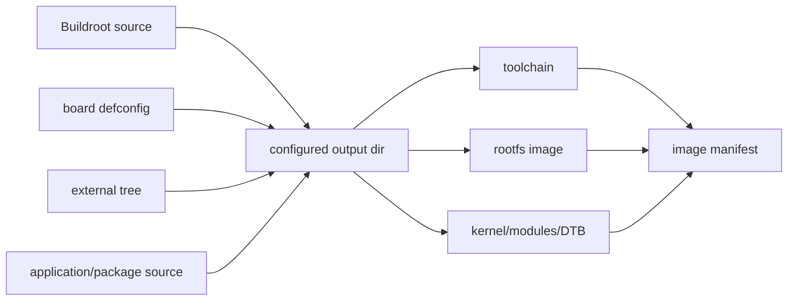
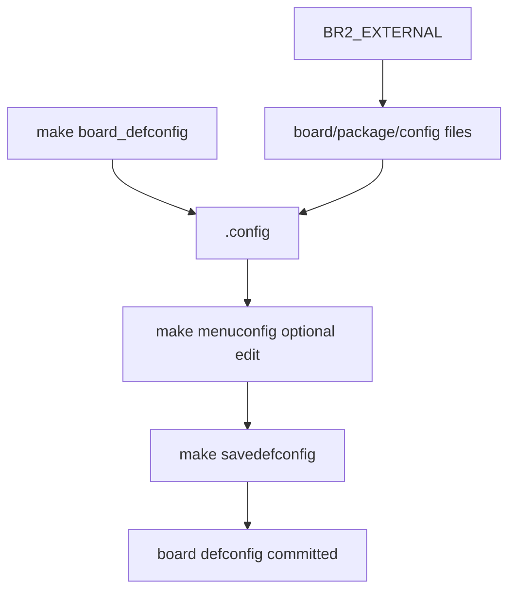
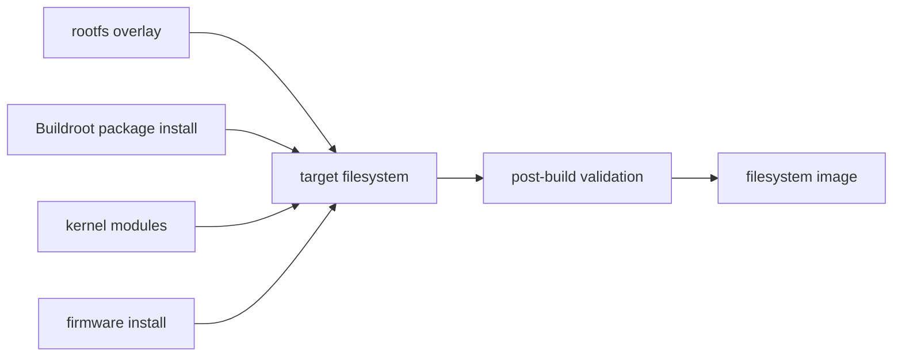
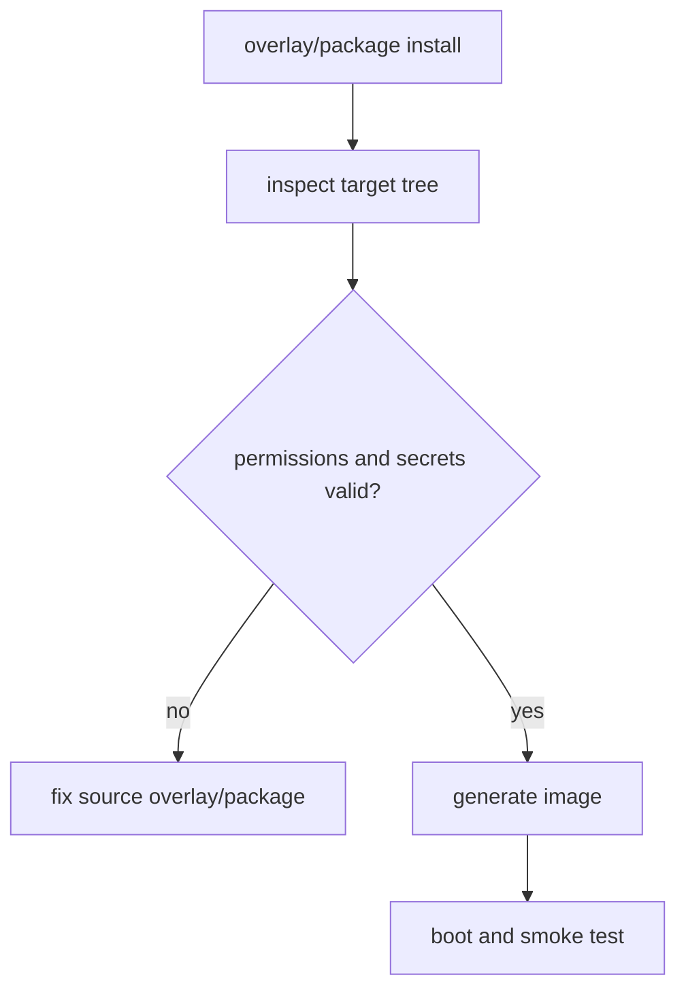
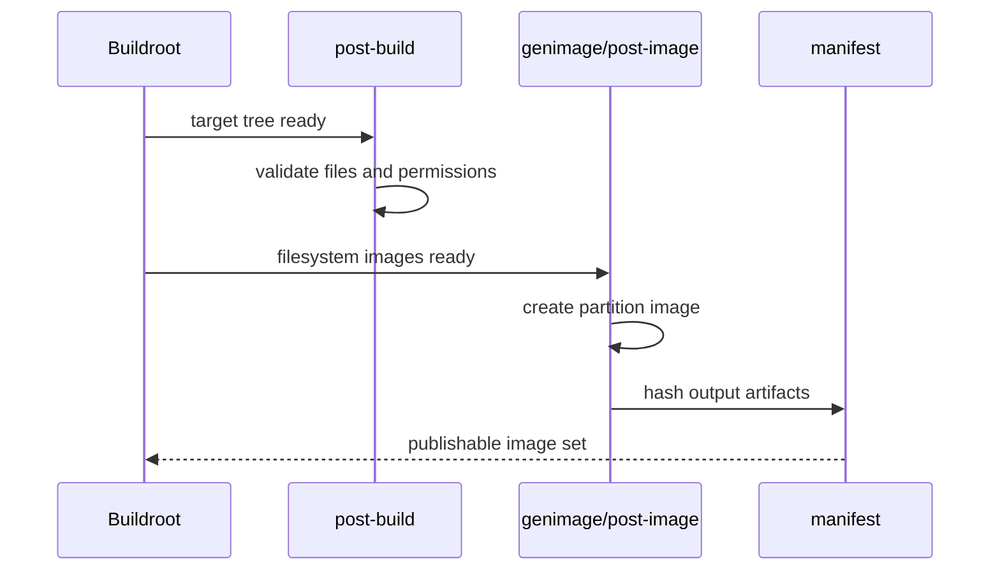
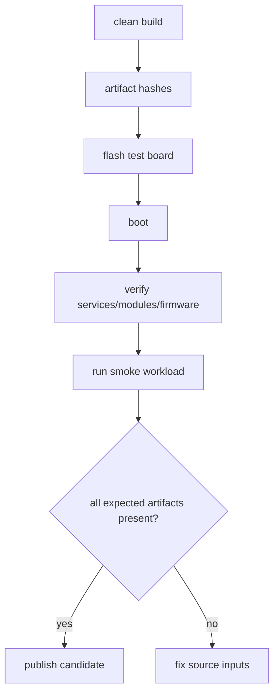

rootfs 不是把一批二进制文件拷到目录里。

它需要与 kernel ABI、设备节点、init、库依赖、固件、服务、只读/可写分区、升级策略和量产镜像共同演进。

Buildroot 的价值在于将工具链、BusyBox、库、应用、overlay、内核配置和镜像生成放进同一个可追溯构建图，而不是在开发板上手工安装软件形成不可复制状态。

本章以“从干净构建目录生成一份能启动业务服务的板级 rootfs 镜像”为主线。

## 1. 先确定构建输入、输出和不可变边界

一次可复现构建需要明确源代码版本、defconfig、external tree、下载源、工具链、内核/DTS、overlay 和镜像后处理脚本。

输出不仅是 rootfs.tar，也可能包含 ext4、squashfs、cpio、UBI image、boot 分区文件和 manifest。



| 输入 | 应被版本控制/锁定的内容 |
| --- | --- |
| Buildroot | tag、commit 或 vendor patch set |
| defconfig | target arch、toolchain、init、filesystem、packages |
| board files | post-image、genimage、overlay、users table |
| 内核 | source revision、defconfig、DTS、module config |
| 外部包 | 源码版本、hash、license 与 patch |
| firmware | 文件名、版本、hash 与安装路径 |

构建目录 output 不应作为人工编辑空间。

若在 output/target 中直接改文件，下一次 clean/rebuild 会丢失修改，也无法知道镜像究竟包含了什么。

## 2. 第一步：用 defconfig 和 external tree 固化板级选择

defconfig 是可提交的最小配置，不是唯一配置文件。

它描述选择了哪些组件；board directory 和 BR2_EXTERNAL 则承载板级 overlay、package、镜像和脚本。



推荐目录结构如下，名称仅作示例。

```text
external/
  Config.in
  external.mk
  board/longway-rv1126/
    rootfs-overlay/
    post-build.sh
    post-image.sh
    genimage.cfg
  package/longway-app/
    Config.in
    longway-app.mk
    longway-app.hash
  configs/longway_rv1126_defconfig
```

将业务 package、board overlay 与镜像脚本放进 external tree，可以减少对 Buildroot 上游目录的直接修改，升级 Buildroot 时也更容易比较差异。

### defconfig 只保留选择，不包含临时路径

构建机用户名、绝对下载目录、临时 NFS 地址或测试密钥不应进入 defconfig。

将可变路径放到环境或受控配置，生产密钥则交给独立的安全发布流程。

```sh
make BR2_EXTERNAL=$PWD/external longway_rv1126_defconfig
make menuconfig
make savedefconfig BR2_DEFCONFIG=$PWD/external/configs/longway_rv1126_defconfig
git diff -- external/configs/longway_rv1126_defconfig
```

每次 menuconfig 修改后都应执行 savedefconfig 并审阅 diff。否则构建机中的 .config 与仓库 defconfig 会悄悄分叉。

## 3. 第二步：用 overlay 和 package 安装系统内容

rootfs overlay 适合静态文件，例如默认配置、只读证书、图标、初始化目录和固定 udev 规则。

需要编译、依赖追踪、用户创建、安装顺序或 license 信息的应用，应写成 Buildroot package。



一个最小 package 应把源、构建方式、依赖、安装位置和 license 明确写出。

```make
LONGWAY_APP_VERSION = 1.0.0
LONGWAY_APP_SITE = $(BR2_EXTERNAL_LONGWAY_PATH)/src/longway-app
LONGWAY_APP_SITE_METHOD = local
LONGWAY_APP_LICENSE = Proprietary

define LONGWAY_APP_INSTALL_TARGET_CMDS
    $(INSTALL) -D -m 0755 $(@D)/longway-app +        $(TARGET_DIR)/usr/bin/longway-app
endef

$(eval $(generic-package))
```

示例中的 VERSION、license 和安装方式必须符合实际项目。

不要用 post-build.sh 把未声明依赖的预编译二进制随意复制进 target；这样交叉工具链、动态库和许可证变化都不会触发正确重建。

### overlay 也需要最小权限和所有权审查

overlay 中的 init 脚本、配置文件和密钥权限会原样进入产品镜像。

每次构建应检查 setuid、world-writable 目录、默认密码、debug SSH key、测试证书和不应发布的日志。



## 4. 第三步：让 kernel、module、firmware 与 rootfs 成套产出

kernel module 必须与当前 kernel build、config 和 ABI 一致。

rootfs 升级只替换 /lib/modules 的一部分，或将另一版本 firmware 与旧 driver 混用，都可能在 boot 后才表现为 probe fail。

```mermaid
flowchart LR
    A[kernel source/config] --> B[Image/DTB/modules]
    B --> C[Buildroot target /lib/modules]
    D[firmware repository] --> E[/lib/firmware]
    C --> F[post-image manifest]
    E --> F
    F --> G[flashable image set]
```

在 post-build 或 CI 中至少验证：

```sh
test -x "$TARGET_DIR/usr/bin/longway-app"
test -d "$TARGET_DIR/lib/modules/ACTUAL_KERNEL_RELEASE"
test -f "$TARGET_DIR/lib/firmware/ACTUAL_FIRMWARE_FILE"
find "$TARGET_DIR" -name '*.ko' -print
```

ACTUAL_KERNEL_RELEASE 和 ACTUAL_FIRMWARE_FILE 应由构建系统派生或读取，不应写成开发人员机器上的旧版本字符串。

应用启动前需要的 device node、group、udev rule、capability 和共享库，也要在镜像层验证。

### post-image 是分区与封装的唯一入口

post-image 适合调用 genimage、生成分区镜像、添加 manifest、签名或生成烧录包。

它不应在镜像生成后再修改 rootfs 内关键文件；否则 source tree 和 final image 不一致。



## 5. 第四步：从干净环境重建并在板端验证镜像

可复现不是在已有 download cache 和旧 output 中再次 make 成功。

至少定期在干净 output 目录中执行 defconfig、build、生成镜像、刷写和 smoke test。

```sh
rm -rf output-clean
make O=output-clean BR2_EXTERNAL=$PWD/external longway_rv1126_defconfig
make O=output-clean
sha256sum output-clean/images/* > output-clean/images/SHA256SUMS
```

删除 output 是有意的构建隔离操作，只能针对确认的非生产输出目录执行。

不要将此命令扩展到保存板级配置或源码的路径。



板端 smoke test 至少检查 kernel release、DTS/board revision、关键 module、firmware request、业务服务状态、网络和一个核心外设。

镜像能启动 BusyBox shell 只是最早的一步，不是系统集成验收。

### 本章练习

创建一个 external tree，迁移一个静态配置文件到 rootfs overlay，并将一个可执行程序写成最小 Buildroot package。

为当前板卡生成并提交 defconfig，确认其不包含个人绝对路径和临时测试设置。

在 post-build 中检查应用、kernel modules、firmware 与权限，在 post-image 中输出 artifact hash manifest。

用干净 output 目录重新构建、刷写测试板并完成 boot、服务、网络和外设 smoke test。

### 本章验收

完成本章后，应能独立回答：

- 为什么 rootfs 不是手工复制文件的集合；
- defconfig、external tree、overlay 与 package 各自适合什么内容；
- 为什么不能直接修改 output/target；
- 为什么 menuconfig 之后必须 savedefconfig 并审阅差异；
- 为什么应用和 firmware 应由 package/受控安装路径进入镜像；
- 为什么 kernel、module、DTB、firmware 必须作为同一套产物验证；
- post-build 与 post-image 应分别承担什么职责；
- 如何通过干净构建和板端 smoke test 证明镜像可复现。

当构建输入、镜像产物和板端验证都有版本与哈希证据时，rootfs 才是可发布系统的一部分，而不是开发机状态的偶然快照。

### 构建失败时的定位顺序

下载失败先检查镜像源、hash、代理和 download cache，不要修改 package 版本来绕开网络问题。

host 编译失败先核对 Buildroot 支持的 host tool 版本和干净 output，再检查 package 的编译选项。

target 链接失败时检查 package 依赖是否被 Buildroot 声明，而不是把库从 host 系统复制到 target。

服务未启动时确认镜像中 unit/init 脚本、用户、权限和配置都存在，再检查 init 模型与日志。

module probe 失败时核对 uname -r、/lib/modules、firmware 路径和 DTB，不要单独替换一个 ko 文件。

rootfs 超出分区预算时先列出 package、debug symbol、locale、文档和日志来源，再做有记录的裁剪。

镜像 hash 改变而源码未改时检查时间戳、host tool、文件顺序和 post-image 脚本是否引入非确定输入。

### 建议随产物发布的清单

- Buildroot、kernel、external tree 的 commit；
- defconfig 和 kernel config 的 hash；
- DTB、Image、rootfs、module、firmware 的 hash；
- 分区映像的大小、对齐和目标介质；
- package 清单、license 和已知限制；
- 默认用户、服务和开放端口；
- overlay 文件权限审查结果；
- smoke test 命令和原始输出；
- 目标硬件 revision 与校准/firmware；
- 可用于回退的上一已确认镜像。

这些内容应由构建脚本自动生成。镜像发布后再依靠开发者回忆补齐版本，会使现场问题无法可靠复现。

发布前还应从最终 image 而非 source tree 中抽样检查文件。这样可以发现 post-build、权限修正或镜像封装阶段带来的实际差异。

镜像命名应同时包含人可读版本和机器可比较 build counter，避免工站或 OTA 选择到同名但内容不同的文件。

当构建缓存被保留以提升速度时，CI 仍应定期执行 clean build。缓存是优化，不是发布正确性的唯一前提。

板端 smoke 完成后，保存最终串口日志与 image manifest 的同一份时间戳，避免将另一轮构建的结果误关联。

发布流程应拒绝缺少 manifest 或 hash 的镜像。

> 🏷️ Linux BSP · Buildroot · rootfs · defconfig · BR2_EXTERNAL · package · image manifest
