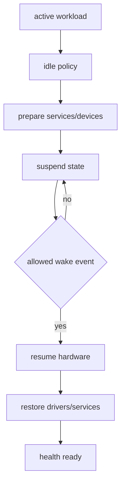
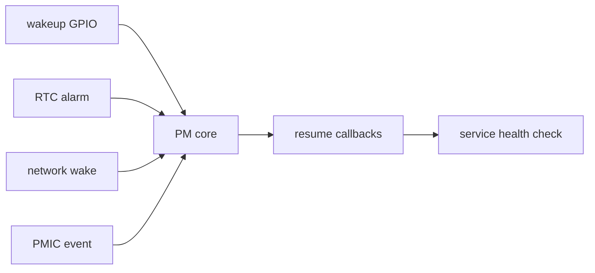
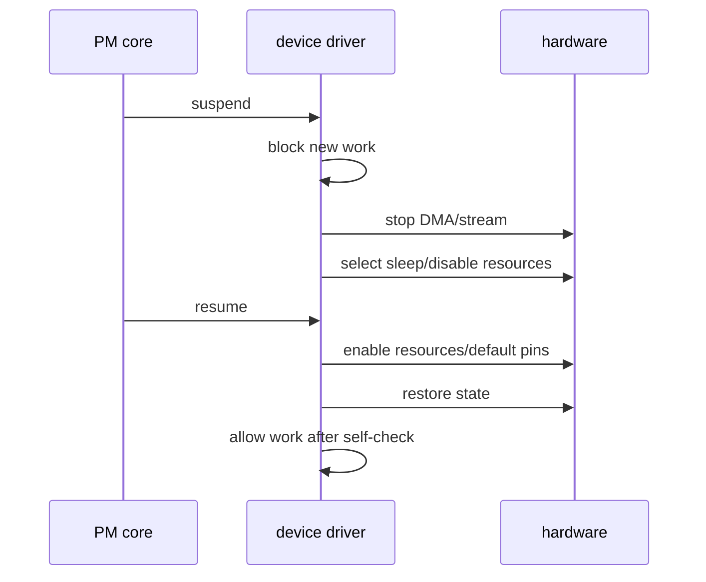
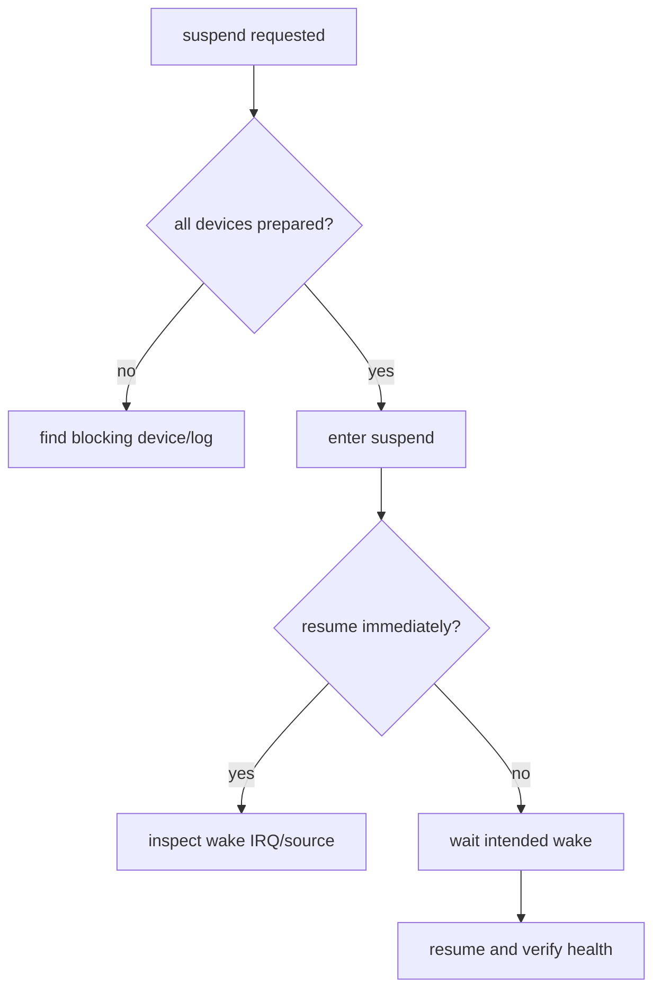
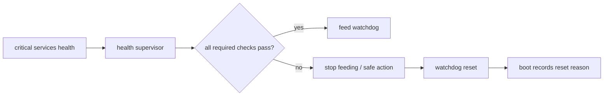
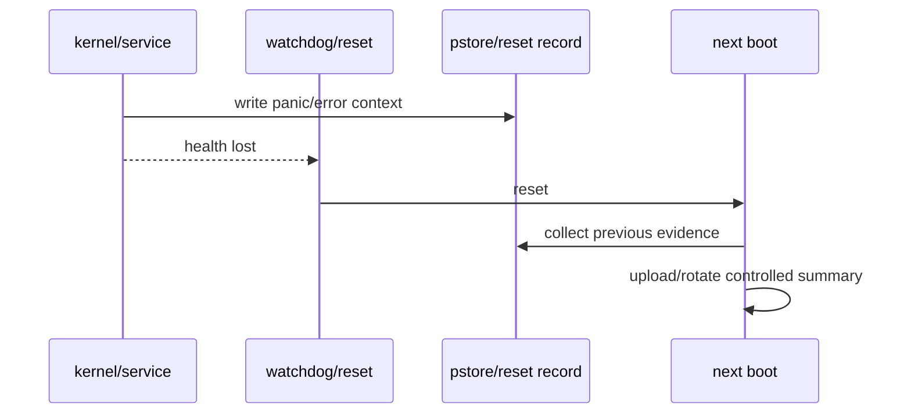
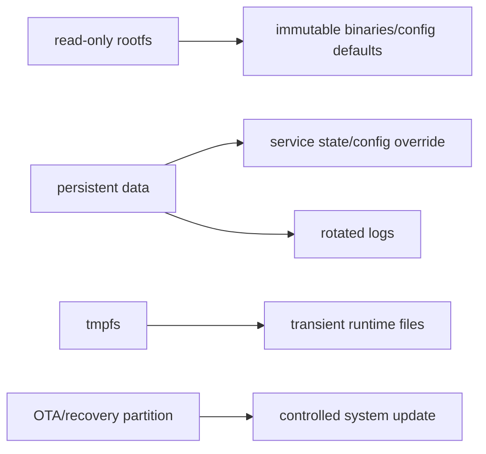

低功耗不是把 CPU 频率调低，也不是调用一次 suspend 就结束。

系统进入休眠前必须停止或保存设备状态，唤醒后必须恢复 clock、regulator、pinctrl、DMA、网络和业务服务；同时还要避免一个浮空 GPIO 或错误的 USB 事件反复把系统唤醒。

看门狗能处理部分不可恢复卡死，但若没有 reset reason、pstore 和启动次数记录，它只会让故障循环更难定位。

本章以“设备空闲后进入低功耗，指定事件可靠唤醒，异常卡死后能安全重启并保留证据”为主线。

## 1. 先定义系统电源状态和允许的唤醒源

产品必须先明确 suspend 时哪些设备继续供电、哪些状态必须保留、哪些外部信号允许唤醒。

不要在 driver 中随意调用 enable_irq_wake，把所有中断都变成 wake source。



| 项目 | 必须回答的问题 |
| --- | --- |
| 系统状态 | 使用 s2idle、standby 还是 platform suspend |
| 唤醒源 | GPIO、RTC、LAN、USB/Type-C 或 PMIC 哪些被允许 |
| 供电 | 哪些 rail 在 suspend 保持，哪些关闭 |
| 数据 | 哪些事务必须在 suspend 前提交 |
| 网络 | 是否要求 WoL、重连或完全断网 |
| 用户体验 | 唤醒延迟、指示灯、服务恢复判定 |
| 故障策略 | resume 失败时重试、重启还是进入安全态 |



每个 wake source 都应有实际物理和软件证据，包含 IRQ、pinctrl sleep state、供电域和相关 DTS/driver 配置。

## 2. 第一步：让设备 PM 回调遵守停止、保存、恢复顺序

系统 suspend 时，driver 不应继续提交 DMA、访问已关闭的 register 或在工作队列中发 I2C 请求。

通常需要先拒绝新请求，停止 in-flight activity，保存必要状态，选择 sleep pinctrl state，再关闭时钟/电源。resume 则反向恢复，并在硬件稳定后才重新开放业务。



runtime PM 与 system suspend 处理的范围不同。

runtime PM 在设备空闲时独立 power down；system suspend 要协调全系统状态。不能因为某个设备实现 runtime suspend，就假定系统 suspend/resume 一定正确。

```c
static int board_device_suspend(struct device *dev)
{
    struct board_device *priv = dev_get_drvdata(dev);

    board_device_stop_new_requests(priv);
    board_device_stop_and_sync(priv);
    board_device_save_state(priv);
    return board_device_power_off(priv);
}

static int board_device_resume(struct device *dev)
{
    struct board_device *priv = dev_get_drvdata(dev);
    int ret;

    ret = board_device_power_on(priv);
    if (ret)
        return ret;

    ret = board_device_restore_state(priv);
    if (!ret)
        board_device_allow_requests(priv);
    return ret;
}
```

示例强调顺序，不替代具体 V4L2、netdev、ALSA 或 bus subsystem 已提供的 PM helper。优先沿用所在子系统的 suspend/resume 约定。

## 3. 第二步：用 wakeup source 和日志定位伪唤醒

系统刚进入 suspend 就恢复，常见原因包括浮空 GPIO、错误 edge、USB 事件、RTC alarm、network wake 或一个驱动没有完成冻结。

先记录 suspend/resume 的时间线与 wake reason，不能只在应用层看到“屏幕亮了”后猜测。



```sh
cat /sys/power/state
cat /sys/kernel/debug/wakeup_sources 2>/dev/null
cat /proc/interrupts
echo mem > /sys/power/state
```

写入 /sys/power/state 会改变测试板状态，只在已确认有串口/恢复通道、业务可停止且产品策略允许的场景执行。

不同内核对 wake reason 的日志和 debugfs 支持不同。应在启动时保存 baseline，在一次受控 suspend/resume 后对比 wakeup_sources 与 IRQ 计数。

### sleep pinctrl 影响功耗与伪中断

GPIO 在 active 状态可能上拉、输出时钟或驱动某个 enable；在 sleep 状态应根据硬件设计保持安全电平、避免漏电和噪声。

不要为让一个 wake GPIO 工作而把所有 pin 都保留在 default state。


## 4. 第三步：让 watchdog 复位可控且可追溯

watchdog 应由唯一的健康管理责任者定期喂狗。

多个独立服务各自写 /dev/watchdog，会让“关键服务已经失效但另一个服务还在喂狗”的问题无法触发复位。



| 设计项 | 要求 |
| --- | --- |
| timeout | 覆盖最长正常调度延迟，但短于产品不可服务上限 |
| owner | 一个 supervisor 统一喂狗 |
| health | 不是进程存活，而是关键路径/数据流健康 |
| stop policy | 失败时先让执行器进入安全态，再允许复位 |
| boot record | 保存 reset reason、boot count、软件版本 |
| maintenance | 升级/调试模式有明确的受控策略 |

watchdog 不能修复死锁、内存泄漏、供电跌落或错误 wake source。它提供的是最后恢复机制，仍需要把复位前后证据持久化。

### pstore 与持久化错误摘要

若内核配置支持 pstore/ramoops，可保留 panic、oops 或 console 片段供下次启动读取。

存储区域、大小和 crash 记录策略必须与 reserved memory、rootfs 和安全需求协调。不要在量产系统中无上限保留可能包含敏感内容的完整日志。



## 5. 第四步：使用只读 rootfs 和恢复路径限制故障扩散

只读 rootfs 能减少异常掉电、日志写满或错误脚本修改系统文件带来的损坏，但它要求配置、状态、日志和更新数据有明确可写分区。



只读不是安全的全部。SSH、调试接口、默认账户、USB 导入、签名验证、最小权限和密钥管理仍需各自设计。

| 验收场景 | 合格结果 |
| --- | --- |
| 正常 suspend/resume | 指定 wake source 唤醒，关键服务 self-check 通过 |
| 非允许 GPIO 变化 | 系统保持 suspend，无伪唤醒 |
| 设备 runtime idle | 功耗下降且下次访问可恢复 |
| 健康服务故障 | 停止喂狗、记录原因、受控复位 |
| 异常重启 | boot count/reset reason/pstore 可读取 |
| rootfs 非法写入 | 失败且业务状态仍写入 data 分区 |
| 升级失败 | 回滚或恢复路径可启动 |

### 本章练习

列出产品允许的 wake source、其物理连接、IRQ、pinctrl sleep state 和验收方式。

为一个有 DMA 的 driver 梳理 suspend/resume 顺序，验证停止业务、关闭资源、恢复资源、重新自检的边界。

选择一个唯一 health supervisor 管理 watchdog，在测试板上模拟关键服务无响应，验证 reset reason 与错误摘要。

将 rootfs 设为只读的测试镜像，确认服务状态和日志均落在设计的可写位置，并完成一次受控恢复/升级回归。

### 本章验收

完成本章后，应能独立回答：

- system suspend、runtime PM 与 CPU 降频为什么不是同一件事；
- 为什么 wake source 必须受控且有硬件证据；
- driver suspend/resume 的停止、保存、恢复和重新开放顺序；
- 如何用 wakeup source、IRQ 和日志定位伪唤醒；
- 为什么 sleep pinctrl 会影响功耗和稳定性；
- 为什么 watchdog 应有唯一喂狗责任者和健康判定；
- pstore/reset reason 如何让异常复位可追溯；
- 只读 rootfs 需要哪些可写状态和恢复配套。

当低功耗、唤醒、异常复位和不可变系统文件都有明确边界时，产品才能在正常空闲与异常场景下都保持可恢复和可诊断。

### 电源与恢复测试记录

- suspend 前所有关键 service 的状态；
- 每个 wake source 的 GPIO/IRQ/物理事件；
- suspend entry 和 resume 的 monotonic 时间；
- wakeup_sources 与 IRQ 的前后差异；
- pinctrl default/sleep 状态；
- 各关键 rail、clock 和 regulator 状态；
- runtime PM active/suspended 状态；
- 网络、camera、audio 和存储的恢复结果；
- watchdog timeout、owner 和最后一次喂狗时间；
- reset reason、boot count 和 pstore 摘要；
- rootfs 的只读状态和 data 分区可写状态；
- 故障恢复前后的软件版本与 slot；
- 低功耗稳态电流和恢复后的 idle 电流；
- 温度、供电和外部唤醒条件；
- 所有测试失败的停止条件和人工恢复步骤。

系统 suspend 测试应先从最小外设开始，再逐步加入网络、摄像头、音频和加速任务。一个包含全部业务的失败不能快速说明是哪一个 driver 阻止了冻结或在 resume 后没有恢复。

对 watchdog 复位，至少连续执行多次受控演练并确认不会进入 boot loop。若首次启动需要比 timeout 更长的固件加载或文件系统检查，应在产品设计中明确其安全处理方式，不能简单延长 watchdog 到失去意义。

只读 rootfs 的验证还要包含升级、恢复出厂和日志异常。任何需要写系统文件的维护动作都应通过受控 recovery/OTA 路径完成，不能依赖临时 remount rw 的人工习惯。

唤醒测试应包含重复循环，而非单次成功。某些 GPIO、USB 或网络事件在第一次恢复后留下状态，第二次 suspend 才会暴露漏掉的 IRQ acknowledge、clock gate 或 pinctrl 切换。

若使用 RTC alarm 唤醒，核对 RTC 时间、alarm 配置、时区展示和闹钟清除行为。一个没有清除的 alarm 会让系统看起来无法保持 suspend。

低功耗测试应从外部电源仪记录总电流，并结合 per-device runtime 状态解释差异。只看 CPU idle 百分比，无法发现一个保持供电的 PHY、codec 或 USB hub。

在异常复位后，启动脚本应先收集并标记上一次 crash 证据，再启动可能覆盖日志的服务。否则最关键的 watchdog/pstore 信息会在自动恢复中丢失。

- 系统状态和唤醒源；
- suspend/resume 时间；
- runtime PM 和 rail 状态；
- idle 电流和恢复电流；
- watchdog owner 与 timeout；
- reset reason 和 pstore；
- rootfs/data 分区状态。

这些证据应和测试镜像版本一起保存，才能比较 PM 修复是否真的降低伪唤醒或异常复位。

所有 wake source 在产品模式和维护模式下都应分别验证，避免调试接口意外改变量产的耗电或安全边界。

watchdog 复位后的首次服务启动也需要 health deadline，防止系统虽然重启但关键功能长期停留在初始化状态。

低功耗回归应在不同电池电压或电源输入条件下重复，确认 PMIC 限流不会被误判为软件 suspend 问题。

> 🏷️ Linux BSP · suspend · resume · wakeup source · watchdog · pstore · read-only rootfs · hardening
> 🏷️ Linux BSP · suspend · resume · wakeup source · watchdog · pstore · read-only rootfs · hardening
> 🏷️ Linux BSP · suspend · resume · wakeup source · watchdog · pstore · read-only rootfs · hardening
> 🏷️ Linux BSP · suspend · resume · wakeup source · watchdog · pstore · read-only rootfs · hardening
