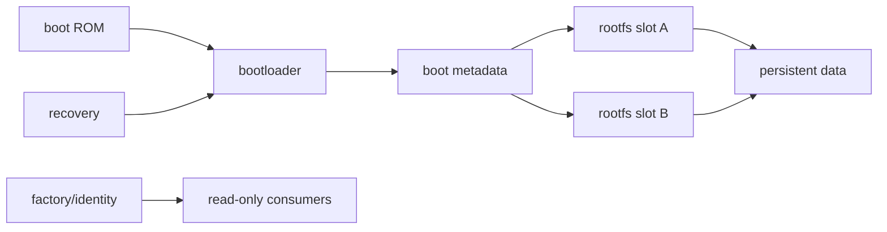
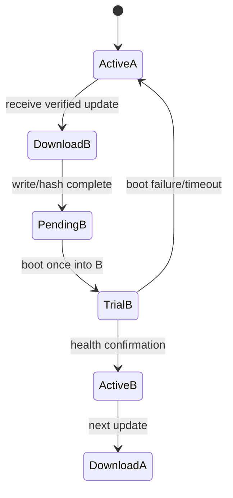
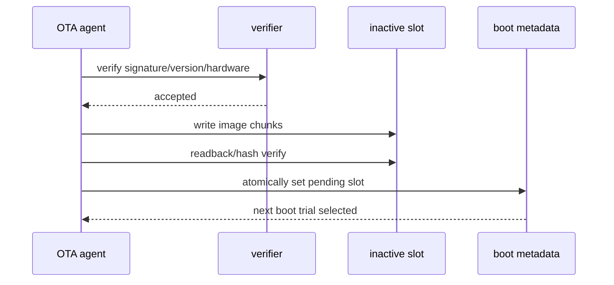
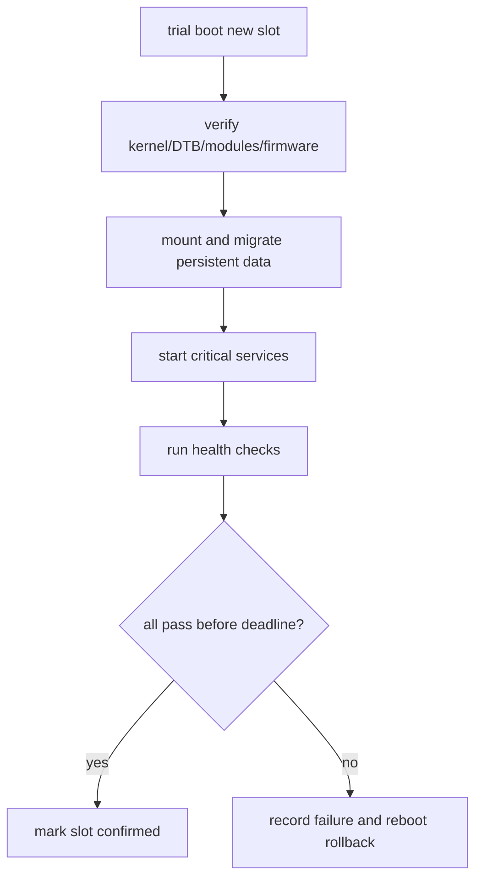
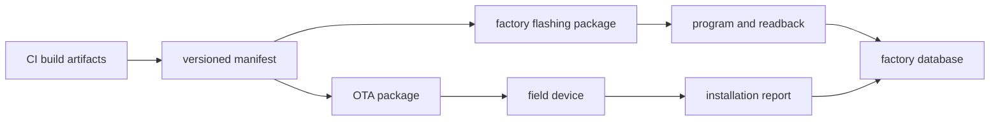
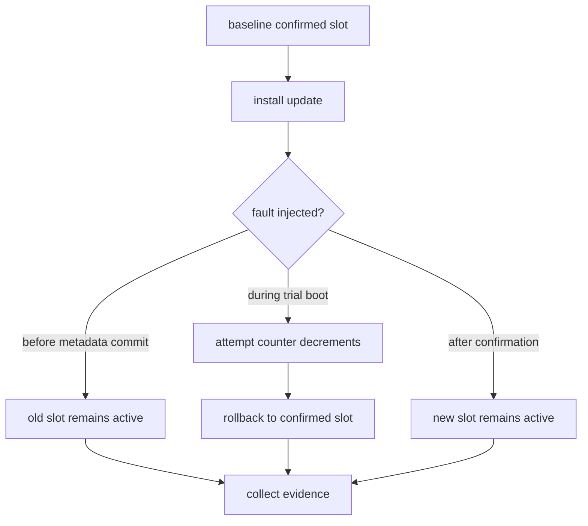

升级不是把一个新 rootfs 写进 flash。

它必须处理掉电、写入失败、版本兼容、bootloader 选择、首次启动确认、数据迁移、回退和生产记录。

分区表是产品 ABI：boot ROM、bootloader、kernel、rootfs、data、recovery 与工厂工具都依赖它的名称、位置、大小和权限。

本章以“一台正在运行的设备收到新版本，在掉电风险下仍能启动到已确认版本”为主线，建立 OTA 和量产交付模型。

## 1. 先定义每个分区的责任、所有者和破坏半径

分区不是按“看起来剩多少空间”临时划分。

它应基于 boot chain、升级模式、持久数据、安全要求、介质类型和最坏镜像大小设计。

| 分区类别 | 所有者 | 典型策略 |
| --- | --- | --- |
| bootloader/boot metadata | 安全启动和升级组件 | 严格写保护、受控更新 |
| kernel/DTB/rootfs slot | OTA agent | A/B 或 recovery 回退 |
| persistent data | 应用/数据迁移组件 | 跨 slot 保留、版本化 |
| factory/identity | 量产系统/NVMEM consumer | 只读、可审计写入 |
| recovery | 维护流程 | 独立启动和恢复能力 |
| scratch/download | OTA agent | 可清理、容量受限 |

每个分区都应有名字、UUID/label、size、文件系统/镜像格式、允许写入者和备份策略。

在 eMMC、NAND/UBI、SPI NOR 上实现形式不同，但“责任明确且可恢复”的要求相同。

## 2. 第一步：让 A/B 更新成为明确状态机

A/B 的关键是：当前已确认 slot 不被覆盖；新镜像写入另一个 slot；bootloader 只临时选择新 slot；新系统自检通过后才把它标为 confirmed。

boot metadata 至少包含 active slot、pending slot、boot attempt count、confirmed version 和 rollback reason。

它应存放在掉电一致、bootloader 可访问且更新原子性明确的位置。

不要由应用在 rootfs 中改一个文本文件后假定 bootloader 一定会看到它。

### 先校验再写入，再校验

升级包应包含版本、目标硬件、每个 artifact 的长度/hash、签名、兼容性要求和数据迁移规则。

hash 校验不能只在下载完成后执行一次。写入 inactive slot 后还要对实际介质内容验证，才能覆盖传输正确但写入损坏的情况。

签名验证使用的根密钥、anti-rollback counter 和可信 boot chain 必须按产品安全设计实现；不要把示例公钥或开发签名当成量产策略。

## 3. 第二步：把版本、数据迁移和首次启动健康检查绑定

slot 切换成功不等于系统已可服务。

新版本可能需要新 firmware、不同配置格式、数据库迁移或新的 kernel module。首次启动应在有限窗口内完成关键自检，再写入 confirmed 状态。

data migration 必须具备版本、备份和失败回滚语义。

不能在新 slot 首次启动时直接删除旧数据库后再尝试转换。应先复制/transactional migrate，完成校验后再切换指针或 commit marker。

| 兼容性问题 | 需要的策略 |
| --- | --- |
| 新 kernel 要求新 firmware | 包内成套版本和启动检查 |
| 配置 schema 变化 | schema version、默认值、迁移/回退路径 |
| 数据库升级 | staging、CRC/transaction、保留旧版本 |
| 应用协议变化 | 服务端兼容窗口或 feature negotiation |
| hardware revision 差异 | package manifest 中的 target constraints |

### 健康确认不能由单一进程伪造

OTA agent 自己存活并不说明摄像头、网络、存储和安全服务可用。

健康检查应来自独立的关键路径证据，并有总超时和失败记录。

对安全关键设备，确认前还要验证执行器处于安全态。

## 4. 第三步：让量产烧录和 OTA 使用同一份版本事实

量产与 OTA 不应各自生成不同格式、不同版本命名、不同分区定义的镜像。

它们可以有不同传输方式，但应消费同一份 artifact manifest、分区表、hash 和签名策略。

量产工站在写入后至少验证：设备 UID、目标硬件 revision、bootloader version、每个 artifact hash、serial/MAC/calibration 状态、首次启动版本和网络注册结果。

烧录工具若只显示“download success”，不能证明分区写对、板级身份正确或系统能够启动。

### 版本号必须可被机器比较

版本可以使用语义版本、build number、git commit、日期或其组合，但需要定义比较规则。

bootloader/OTA 不应以字符串字典序判断 1.10 和 1.9 的新旧。

manifest 中同时记录 human-readable version、monotonic build counter、source commit、artifact hash 与 target hardware，能支持排障和 anti-rollback。

## 5. 第四步：通过掉电、失败包、回退和恢复演练完成验收

升级测试不能只走一次理想路径。

至少要在测试板上覆盖签名错误、hash 错、下载中断、写入中断、trial boot 失败、health timeout、数据迁移失败和手动 recovery。

| 演练 | 合格结果 |
| --- | --- |
| 非法签名/错误硬件包 | 在写入前拒绝并记录原因 |
| 下载中断 | 不改变 active/pending metadata |
| inactive slot 写入失败 | 当前 confirmed slot 可启动 |
| trial boot 失败 | attempt 用尽后自动回退 |
| health check 超时 | 不确认新 slot，保留故障日志 |
| 数据迁移失败 | 旧数据与旧 slot 仍可使用 |
| 手动 recovery | 可识别设备、恢复已批准镜像 |
| 工站重复烧录 | 拒绝身份冲突并留审计记录 |

### 本章练习

为当前硬件介质画出实际分区图，标注每个分区的所有者、读写权限、升级策略和破坏半径。

设计 A/B metadata 字段和 trial boot 状态机，明确确认 deadline、最大 attempt 和 rollback reason。

为一个测试镜像生成包含硬件约束、artifact hash、版本和签名的 manifest，并验证写入后的 readback hash。

在测试板执行一次成功升级和至少三种失败路径，确认原 confirmed slot、数据和诊断信息都能保留。

### 本章验收

完成本章后，应能独立回答：

- 为什么分区表属于产品 ABI；
- A/B 更新如何保证已确认 slot 不被覆盖；
- pending、trial、confirmed 和 attempt count 分别解决什么问题；
- 为什么升级包需要签名、硬件约束和介质读回 hash；
- 为什么数据迁移必须有 staging 与回退语义；
- 为什么健康确认必须来自关键路径而不是单一 OTA 进程；
- 如何让量产烧录与 OTA 共用版本和 artifact 事实；
- 如何用掉电、失败包与 recovery 演练证明升级可恢复。

当升级状态、版本、数据迁移和工站记录都可验证时，OTA 才是受控的产品能力，而不是一次高风险的远程烧录。

### 升级与量产结果包

- 设备 UID、serial、MAC 与硬件 revision；
- 当前 active/confirmed slot 和版本；
- 目标 package 的 version、counter、commit 和签名信息；
- 每个 artifact 的输入 hash、写入后 hash 与分区目标；
- 下载开始/结束、写入开始/结束和耗时；
- pending/trial/confirmed 状态变化；
- trial boot 次数、deadline、health check 明细；
- 数据迁移版本、备份位置和 commit 结果；
- rollback reason、reset reason 和上一次错误摘要；
- 量产治具、操作员、工单和网络注册记录；
- recovery 操作、结果和最终 slot；
- 测试/生产环境的电源、介质和温度条件。

设备在下载阶段掉电、在 inactive slot 写入阶段掉电、在 boot metadata 切换阶段掉电、在 trial boot 阶段掉电，结果都必须分别测试。不同阶段应有不同但可预测的启动结果，不能笼统写为“升级可恢复”。

升级代理应限制包大小、磁盘占用、并发下载和失败重试。网络抖动或服务器异常不能让 scratch 分区耗尽、无限写 flash 或阻止关键业务继续运行。

量产工站需要先读取板的不可变 UID 和当前状态，再决定是否允许写入。对已经 confirmed 的身份记录或 lock bit，重复点击“烧录”应被安全拒绝并记录，而不是覆盖或忽略。

现场 recovery 应使用同一份签名/版本策略。若 recovery 接受任意未签名旧镜像，A/B 和 anti-rollback 的安全边界会被旁路。

### 上线前逐项核对

- 目标介质：
  eMMC、NAND/UBI 或 NOR 的分区表与实际硬件一致。
- Boot chain：
  ROM、bootloader、DTB、kernel 和 rootfs 的加载顺序可回读。
- Active slot：
  当前 slot 不在更新写入列表，confirmed 状态可信。
- Inactive slot：
  容量、擦除/format 和 readback hash 均满足要求。
- Package identity：
  版本、build counter、hardware target、hash 和签名完整。
- Signature policy：
  量产根密钥、开发密钥和拒绝未签名包的路径明确。
- Download:
  断点、大小上限、超时、TLS/认证和 scratch 空间受控。
- Write:
  块/volume 写入失败能停止，且不会修改 active metadata。
- Metadata:
  pending、attempt、confirmed、rollback reason 的掉电语义经过演练。
- Trial boot:
  首次启动有 deadline，关键服务 health 不通过不会确认。
- Data:
  配置、数据库、校准和日志迁移有版本、备份和回退。
- Recovery:
  现场恢复介质/接口只接受已批准镜像并可记录操作。
- Factory:
  UID、serial、MAC、校准和工单在写入前后都验证。
- Audit:
  烧录/OTA 结果上传到可查询记录，并关联 artifact hash。
- Power:
  写入与确认阶段掉电后能回到已知 slot，不需要人工猜测。
- Support:
  设备能安全报告版本、slot、失败码和 reset reason。

升级演练应覆盖旧版本到新版本、新版本到旧版本、跨多个版本跳转和重复安装同一版本。不同路径可能触发不同数据迁移或 anti-rollback 条件，不能只验证一次顺向更新。

升级状态页面或诊断接口应在失败时展示阶段和可安全执行的下一步，例如“下载验证失败”“inactive slot 写入失败”“trial health 超时”或“已自动回退”。模糊的“升级失败”会迫使现场人员重复高风险操作。

对断电演练，记录电源断开的精确阶段与最终 boot metadata。将电源随机拔掉而不记录时机，无法证明状态机是否覆盖了每个原子边界。

量产线更换 flash 工具、治具、server 或签名材料后，应运行同一份回读和首次启动验证。工具升级本身就是发布链变更，不能视为与产品软件无关。

设备报废、返修或重新量产时，身份与密钥的处置必须有专门流程。删除数据库记录不等于 eFuse、EEPROM 或现场设备中的数据已经安全处理。

OTA 服务端也应保留被拒绝包和失败报告的版本信息，帮助发现错误 target、过早推送或签名链配置问题，而不是只统计成功安装数。

更新策略应规定何时允许降级、何时禁止降级，以及每种情况的审计要求。

若升级包含 bootloader，必须有比 rootfs 更严格的断电与恢复演练。

每个 slot 的可用空间应在下载前检查，避免写入到一半才发现容量不足。

对压缩包，校验解压后的长度与 hash，不能只信任压缩文件本身。

设备首次上线前验证时间、证书和网络配置，避免 OTA 因基础身份未建立失败。

量产后抽样执行冷启动、升级和回退，验证线体配置没有漂移。

返修设备重新入库前核对版本、slot、身份和数据擦除策略。

升级 UI/CLI 的错误码应能映射到服务端知识库和结果包字段。

任何跳过确认阶段的维护命令都应受强认证并记录操作人。

生产数据库与设备本地 manifest 的版本关系需要定期审计。

> 🏷️ Linux BSP · partition · OTA · A/B update · rollback · manufacturing · version manifest
> 🏷️ Linux BSP · partition · OTA · A/B update · rollback · manufacturing · version manifest
> 🏷️ Linux BSP · partition · OTA · A/B update · rollback · manufacturing · version manifest
> 🏷️ Linux BSP · partition · OTA · A/B update · rollback · manufacturing · version manifest
