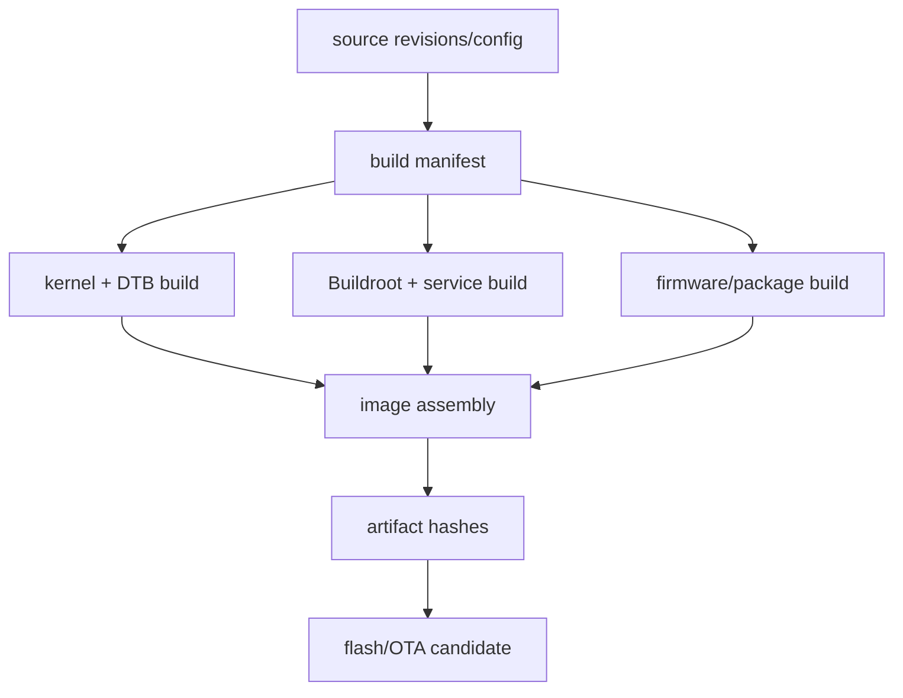
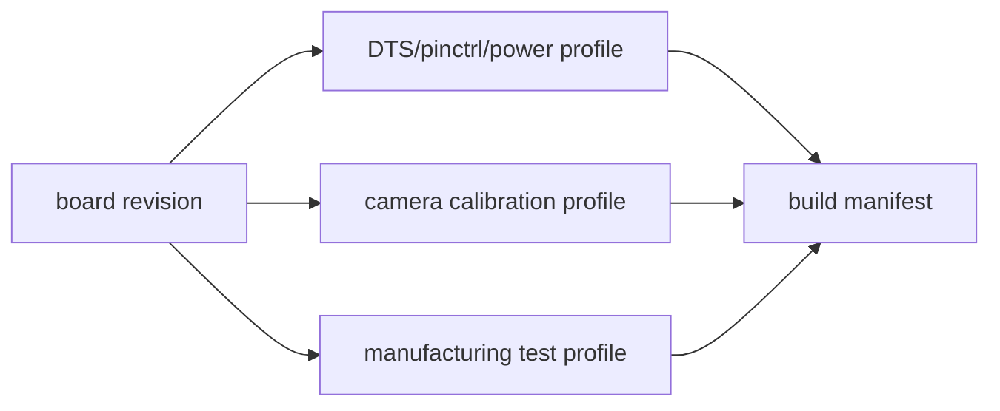
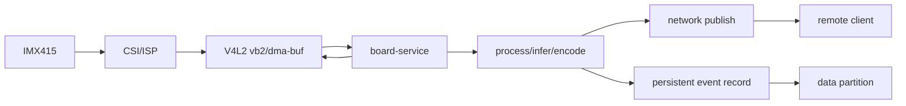
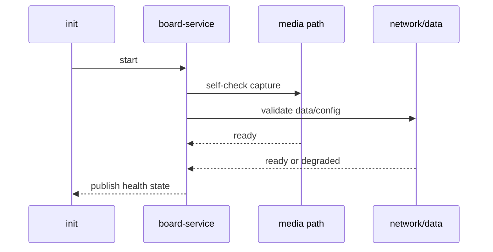
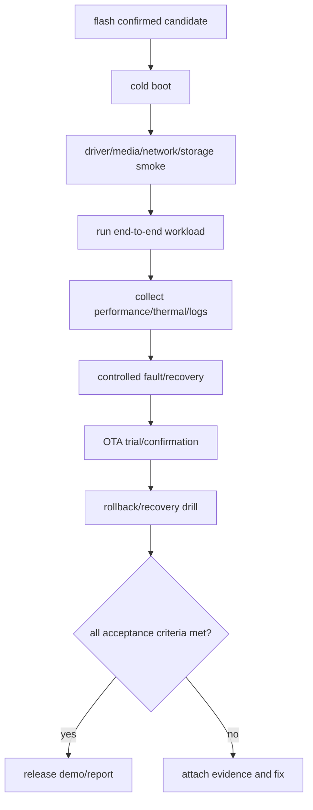

一个 BSP 作品集项目不应是“点亮 LED、跑一个 shell 命令”的拼盘。

它应证明你能将启动链、设备树、驱动资源、图像采集、数据缓冲、网络、存储、服务、日志、升级和异常恢复组织为一个可重复构建、可测量、可维护的板端产品。

本章以 RV1126 + IMX415 智能采集终端为例，定义一个最小但完整的产品 Demo：设备启动后采集图像，完成基础处理，将状态和结果通过网络提供给上层，并在本地保存受控记录；它可升级、可回退、可诊断。

具体 AI 推理、编码协议和云端接口可按产品调整。这里的重点是 BSP 交付边界，而不是堆叠某个应用框架。

## 1. 先把产品目标拆成可验证的系统契约

从用户视角，产品只需要“开机可用、持续工作、故障可恢复、升级不丢设备”。

从 BSP 角度，这对应多个可独立验证的契约。


| 产品能力 | BSP 交付物 | 可观察验收 |
| --- | --- | --- |
| 可启动 | bootloader、kernel、DTB、rootfs | 串口启动阶段和版本 |
| 可采集 | IMX415、CSI、ISP、V4L2 | sequence、帧率、图像样本 |
| 可处理 | DMA buffer、加速器/应用 | latency、错误和资源占用 |
| 可通信 | Ethernet/USB/服务协议 | link、重连、请求结果 |
| 可保存 | data 分区、事务、日志 | CRC、fsync、重启后恢复 |
| 可运维 | service、health、日志 | ready、错误摘要、重启策略 |
| 可升级 | manifest、A/B、回退 | trial/confirmed、版本记录 |
| 可恢复 | watchdog、pstore、recovery | reset reason、回退路径 |

先写出产品 SLO，例如启动时间、最小 FPS、允许掉帧、重连时间、数据保存时限、升级成功率和最大恢复时间。

没有这些数值，最终 demo 只能展示“看起来能跑”，无法证明工程质量。

## 2. 第一步：建立从源码到板端的单一构建与刷写入口

项目应有一份 manifest 指向 kernel/DTB、Buildroot/rootfs、firmware、业务服务和升级包的确切版本。

构建、刷写和测试脚本从这个 manifest 读取，不允许每位开发者手工选择不同的 Image、DTB 或 rootfs。



建议仓库至少包含：

```text
product/
  manifest.json
  board/
    kernel-defconfig
    board.dts
    rootfs-overlay/
  services/
    board-service/
  scripts/
    build.sh
    flash-test-board.sh
    smoke-test.sh
    collect-report.sh
  docs/
    hardware-revision.md
    acceptance.md
```

脚本必须显式检查目标设备与分区，尤其是 flash-test-board.sh。不要让一个默认设备名或空变量将产物写入错误磁盘。

### 将硬件 revision 作为构建输入

板 revision 可能改变 PHY delay、camera reset、PMIC、存储容量或镜头模块。

应让 manifest 明确选择相应 DTS、校准和测试 profile，而不是让运行时脚本根据失败再猜测硬件。



## 3. 第二步：把运行时数据路径和资源所有权画清楚

IMX415 产生的帧经 MIPI CSI、ISP 和 V4L2 buffer queue 进入处理服务。

服务要在正确的所有权边界获取 frame、处理、编码/推理、发送结果并保存必要元数据，随后及时归还 buffer。



每个边界都要有一个负责人：

| 边界 | 负责人 | 必须验证 |
| --- | --- | --- |
| sensor 上电与 stream | sensor/media driver | clock、I2C、CSI error |
| buffer queue | V4L2/vb2 与应用 | QBUF/DQBUF、sequence、释放 |
| DMA 共享 | exporter/importer | attachment、fence、cache sync |
| 处理任务 | 服务 worker | timeout、背压、内存上限 |
| 网络发布 | 服务协议层 | reconnect、队列上限、认证 |
| 本地记录 | 存储组件 | version、CRC、fsync、保留策略 |
| 健康状态 | supervisor | ready、degraded、failed |

不要在应用层保留无界 frame queue。网络不可达或处理变慢时，应按产品需求丢弃旧帧、降低帧率、暂停采集或进入降级状态，并把策略与统计写入日志。

## 4. 第三步：把启动、服务和健康状态组织为可恢复状态机

业务服务应在 data 分区、配置、身份、媒体节点和网络策略满足后进入 ready。

系统不是只有 running/failed 两种状态；degraded 能让设备在网络不可达或可选加速器离线时仍提供有限功能，并让远端运维看见真实状态。

```mermaid
stateDiagram-v2
    [*] --> Booting
    Booting --> Initializing: rootfs/devices ready
    Initializing --> Ready: self-check pass
    Initializing --> Failed: critical dependency fails
    Ready --> Degraded: optional dependency lost
    Degraded --> Ready: recovered
    Ready --> Recovering: critical path timeout
    Recovering --> Ready: reinitialize success
    Recovering --> Failed: recovery budget exhausted
    Failed --> [*]
```



health endpoint 或本地 status 文件应报告：软件版本、board revision、slot 状态、服务状态、camera sequence、网络状态、data 分区空间、温度、最后错误和 reset reason 的安全摘要。

它不应暴露密钥、原始用户图像或可用于攻击的调试接口。



## 5. 第四步：通过端到端 smoke、长稳、升级和故障演练完成交付

最终验收不是按子系统分别打勾，而是在同一候选镜像上执行端到端流程。



| 阶段 | 最小验收 |
| --- | --- |
| 冷启动 | 版本、board revision、根分区和关键驱动正确 |
| 相机 | 规定 mode 下首帧时间、FPS、sequence、CSI error |
| 处理 | 端到端 p50/p99、内存和 buffer 上限 |
| 网络 | link、认证/连接、断开重连、错误队列 |
| 存储 | 事件记录 CRC、空间阈值、重启后读取 |
| 热 | 代表负载稳态、throttle 行为、功耗 |
| 服务 | ready/degraded/failed 状态和日志轮转 |
| 故障 | sensor/network/storage/remote 受控异常恢复 |
| 升级 | A/B trial、confirm、failure rollback |

最终报告应包含构建 manifest、artifact hash、硬件环境、验收命令、关键图表/日志、已知限制和复现步骤。

“演示视频正常”可以作为可视化材料，但不能替代上述证据。

### 本章练习

为自己的 RV1126 + IMX415 板卡创建一份 product manifest，包含 board revision、kernel/DTB、rootfs、firmware、应用和校准版本。

将图像采集、处理、网络发布和本地记录连接成一个有 backpressure 上限的服务，并输出统一 health 状态。

实现从冷启动到第一帧、持续运行、网络断开恢复、数据重启恢复和 slot 升级确认的一键 smoke/soak 脚本。

收集一次完整的结果包，能够让另一位工程师按同一 manifest 重建镜像、刷写测试板并复现验收。

### 本章验收

完成本章后，应能独立回答：

- 为什么综合项目的价值是端到端边界而不是堆叠 demo；
- 如何将启动、采集、处理、网络、存储、服务、升级拆为可验证契约；
- 为什么 kernel、DTB、rootfs、firmware 和业务服务必须由单一 manifest 约束；
- 为什么硬件 revision 应进入构建和测试 profile；
- 图像 buffer 的所有权、背压和数据持久化如何共同影响产品稳定性；
- ready、degraded、recovering 和 failed 如何帮助服务表达真实状态；
- 为什么长稳、故障注入、升级和回退都属于同一个最终验收；
- 一份可展示 BSP 作品集报告应包含哪些可复现证据。

从空板到可运行产品的能力，体现在每一层都能交代输入、输出、失败边界和恢复路径。把这些证据汇成一个可复现 Demo，才是完整 BSP 工程能力的交付。

### 综合项目交接清单

- 硬件 revision、原理图、供电和接口表；
- bootloader、kernel、DTB、rootfs、firmware 和服务版本；
- Buildroot/kernel defconfig、DTS 和 patch queue；
- 分区图、A/B metadata 与 recovery 方法；
- camera mode、IQ/校准版本和 media graph 快照；
- 网络接口、MAC 来源、对端和吞吐基线；
- data 分区格式、日志配额、状态/配置迁移规则；
- 服务用户、配置、ready/degraded/failed 健康接口；
- watchdog、pstore、reset reason 与低功耗策略；
- smoke、soak、热、故障注入、升级/回退结果包；
- 已知限制、支持边界和下一次回归条件；
- 从干净构建到刷写验证的可执行命令。

作品集演示应先展示可观测状态，再展示图像或业务结果。启动版本、camera sequence、网络状态、data 空间、温度和 health state 让观看者知道 Demo 不是一段离线录制的视频。

当某个子系统不可用时，演示应说明产品进入哪种 degraded/failed 状态、是否继续采集、是否保留数据、如何恢复。只展示理想路径无法证明系统具备真实产品所需的故障边界。

将测试结果和代码同样视为交付物。另一位工程师应能使用 manifest 找到准确输入、用脚本构建/刷写、按验收清单复现主要结果，并能在失败时取得足够日志继续定位。

最终 Demo 的范围可以小，但每条承诺必须有证据。一个功能更少、能够升级回退并在异常后报告原因的系统，比堆叠更多无法验证模块的演示更具工程价值。

### 端到端演示脚本应回答的问题

- 这块板是什么 revision：
  启动日志和 health 中是否给出可追溯身份。
- 正在运行哪个软件集合：
  kernel、DTB、rootfs、firmware 和服务版本是否一致。
- 第一个核心外设是否正常：
  例如 camera 的首帧、sequence、mode 和 CSI error。
- 数据是否被正确处理：
  latency、buffer 上限、错误码和 backpressure 是否可见。
- 网络是否可用：
  link、地址、业务连接、断开重连和队列状态是否可见。
- 数据是否可恢复：
  记录 CRC、fsync、重启后的读取和空间阈值是否可见。
- 服务是否可运维：
  ready/degraded/failed、日志、版本和健康检查是否可见。
- 温度与功耗是否受控：
  thermal state、频率、性能和保护动作是否可见。
- 异常是否可恢复：
  受控 network/sensor/storage 故障后的行为是否可见。
- 升级是否可信：
  包 hash、trial、confirm 与 rollback 是否可见。
- 另一位工程师能否复现：
  manifest、脚本、测试设备和结果包是否齐全。

演示中应避免手工临时输入无法记录的命令。每一个关键操作最好来自 versioned script，输出写入结果包，使一次成功展示可以自然转化为持续回归。

产品 Demo 也应包含停止与清理阶段：停止服务、释放 camera/audio/network 资源、提交最后记录、导出结果包并确认设备回到可再次测试的状态。

当测试失败时，脚本应返回非零状态并指出结果包位置。自动化不应只打印红色错误后继续执行成功标记。

把最终报告交给未参与开发的工程师阅读，是检验交付质量的好方法。若对方无法根据文档判断硬件、版本、运行状态和失败边界，说明系统仍依赖隐性知识。

Demo 启动前应校验测试介质、网络对端和电源条件，避免环境问题污染结果。

结果包应同时保存成功样本与失败样本，便于比较而不是只展示最佳截图。

每次演示结束后恢复测试环境的网络、存储和升级状态，确保下一轮从已知基线开始。

> 🏷️ Linux BSP · system integration · RV1126 · IMX415 · product demo · health · OTA · portfolio
> 🏷️ Linux BSP · system integration · RV1126 · IMX415 · product demo · health · OTA · portfolio
> 🏷️ Linux BSP · system integration · RV1126 · IMX415 · product demo · health · OTA · portfolio
> 🏷️ Linux BSP · system integration · RV1126 · IMX415 · product demo · health · OTA · portfolio
