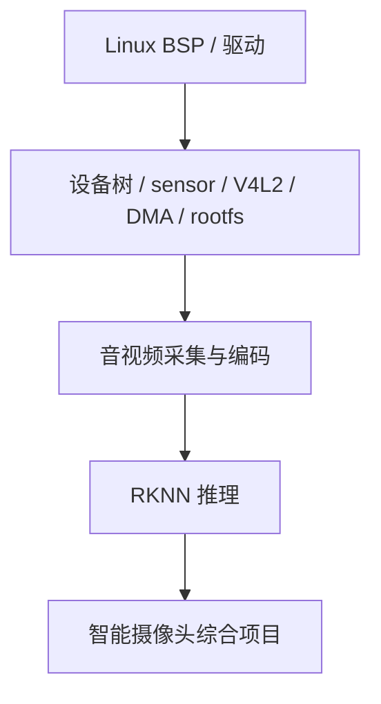

> 创建：2026-08-11
> 重构：2026-08-14（平台从 RV1106G3 / Luckfox Pico 改为 RV1126 + IMX415；扩展为完整覆盖版）
> 状态：✅ 新版大纲已定，待按新版重写 BSP-01

## 系列定位

《嵌入式知识体系 · Linux BSP 与驱动开发实战》——面向 **MCU / RTOS 经验扎实、正在进入嵌入式 Linux 平台的工程师**，以 **RV1126 + IMX415** 为唯一硬件主线，完整走一遍从板级 bring-up 到驱动开发、系统集成、量产交付的 Linux BSP 技术栈。

BSP（Board Support Package，板级支持包）工程师的核心能力，不是只会写一个字符设备 demo，而是能把一块板子从“上电无输出”推进到“系统稳定运行”：

- 看懂厂商 SDK 的构建、打包、烧录流程；
- 理解 BootROM、SPL、U-Boot、kernel、rootfs 的分工；
- 能修改 U-Boot、Linux 内核配置、设备树和 rootfs；
- 能完成 GPIO、I2C、SPI、UART、PWM、ADC、watchdog、input、block、MTD/UBI、netdev、USB、V4L2、ASoC、MIPI CSI 等常见驱动适配；
- 能定位 probe 失败、设备树绑定错误、时钟/复位/电源未打开、GPIO 电平异常、中断不触发、DMA/cache 不一致等真实问题；
- 能结合原理图、示波器、逻辑分析仪定位软硬件协同问题；
- 能使用 perf、ftrace、火焰图等工具做系统级性能瓶颈分析；
- 能理解设备模型、驱动内存管理、I/O 映射、DMA、IOMMU、mmap、缓存一致性、块设备、网络设备、USB、低功耗电源管理等工程问题；
- 能把驱动、文件系统、应用自启动、版本管理、发布流程、日志、升级和量产烧录串成闭环。

本系列与 RKNN、音视频系列形成连续技术链：

## 硬件平台：RV1126 + IMX415

| 项目 | 参数 |
|------|------|
| SoC | Rockchip RV1126 |
| CPU | 四核 ARM Cortex-A7，最高 1.5GHz（以实际板卡资料为准） |
| NPU | 约 2 TOPS INT8 NPU（用于后续 RKNN 系列衔接） |
| ISP | Rockchip ISP，面向摄像头图像处理与 3A 调优 |
| 编解码 | 支持 H.264/H.265 等硬件编解码能力（具体能力以 SDK 和芯片手册为准） |
| 摄像头 | Sony IMX415，MIPI CSI-2 接口，I2C 控制寄存器 |
| 典型外设 | UART / GPIO / I2C / SPI / PWM / ADC / WDT / MIPI CSI / I2S / Ethernet / USB |
| 软件栈 | Rockchip Linux SDK、U-Boot、Linux Kernel、Buildroot/rootfs、RKMedia/RKMPP、RKNN Runtime |

> 说明：本系列弃用 RV1106G3 / Luckfox Pico 主线，统一围绕 RV1126 + IMX415 展开。涉及具体 SDK 版本、内核版本、U-Boot 版本、寄存器地址、设备树路径、驱动文件路径时，以实际 SDK 和官方文档为准；不确定内容必须标注“待核实”，严禁编造。

## 系列结构（8 阶段 · 48 篇）

### 阶段一：Linux BSP 全景与环境搭建（BSP-01 ~ BSP-05）

| # | 标题 | 关键内容 |
|:-:|------|----------|
| BSP-01 | 嵌入式 Linux BSP 到底在做什么 | BSP 职责、MCU 到 Linux 的思维切换、SDK 组成、工程能力地图、RV1126 + IMX415 技术主线 |
| BSP-02 | 从上电到 Shell：RV1126 启动链路全流程 | BootROM、SPL、U-Boot、kernel、dtb、rootfs、init、console、启动日志整体框架 |
| BSP-03 | 开发环境搭建与 SDK 首次编译 | Ubuntu 环境、依赖安装、交叉工具链、SDK 目录、首次 build、Git 版本管理基础、产物说明 |
| BSP-04 | 烧录、串口与第一条启动日志 | 烧录工具、启动介质、串口接线、电平、boot log 保存、原理图阅读、示波器/逻辑分析仪基础、常见启动失败现象 |
| BSP-05 | Rockchip SDK 构建体系拆解 | build 脚本、kernel/uboot/rootfs 三件套、分区镜像、parameter、打包流程、发布产物归档 |

### 阶段二：U-Boot 与启动适配（BSP-06 ~ BSP-10）

| # | 标题 | 关键内容 |
|:-:|------|----------|
| BSP-06 | U-Boot 在嵌入式 Linux 里的位置 | SPL、U-Boot proper、DDR 初始化、加载 kernel/dtb/rootfs、启动介质选择 |
| BSP-07 | U-Boot 配置与编译 | defconfig、menuconfig、环境变量、bootcmd、bootargs、编译与替换验证 |
| BSP-08 | U-Boot 启动流程源码导读 | 入口、board init、driver model、命令执行、加载内核、串口日志逐段对应 |
| BSP-09 | U-Boot 设备树与板级参数 | U-Boot dts、chosen、memory、reserved-memory、console、dtb 传递 |
| BSP-10 | U-Boot 常用调试与自定义命令 | printenv、mmc、fatload、tftp、md/mw、自定义命令、GPIO/寄存器临时验证 |

### 阶段三：Linux 内核与设备树基础（BSP-11 ~ BSP-15）

| # | 标题 | 关键内容 |
|:-:|------|----------|
| BSP-11 | Linux 内核编译与配置 | defconfig、menuconfig、Image/zImage、dtb、modules、内核配置裁剪 |
| BSP-12 | 内核启动流程与启动日志 | head.S、start_kernel、initcall、driver init、printk、启动耗时分析 |
| BSP-13 | 设备树基础：DTS / DTSI / binding | 节点、属性、compatible、reg、status、include 层级、binding 文档 |
| BSP-14 | 设备树进阶：pinctrl / clock / reset / regulator | 引脚复用、时钟、复位、电源、GPIO hog、常见绑定错误 |
| BSP-15 | platform 设备模型与 probe 机制 | device/driver 匹配、of_match_table、probe/remove、deferred probe、sysfs 观察 |

### 阶段四：基础驱动开发（BSP-16 ~ BSP-21）

| # | 标题 | 关键内容 |
|:-:|------|----------|
| BSP-16 | 第一个内核模块与字符设备 | module_init/exit、chrdev、file_operations、设备号、/dev 节点 |
| BSP-17 | misc 设备与 sysfs / procfs / debugfs | 用户态交互、属性导出、调试接口、适用边界 |
| BSP-18 | GPIO 驱动与 LED 子系统 | gpiod API、gpio-leds、LED class、设备树 gpio 属性、上电闪灯实验 |
| BSP-19 | 按键、中断与 input 子系统 | request_irq、threaded IRQ、防抖、input event、evtest 验证 |
| BSP-20 | 定时器、工作队列与延迟任务 | timer、hrtimer、workqueue、delayed_work、软中断上下文边界 |
| BSP-21 | 内核同步机制入门 | spinlock、mutex、completion、atomic、wait queue、驱动中的使用场景 |

### 阶段五：总线与真实外设驱动（BSP-22 ~ BSP-27）

| # | 标题 | 关键内容 |
|:-:|------|----------|
| BSP-22 | I2C 驱动开发：从设备树到 regmap | i2c_client、probe、regmap、寄存器读写、IMX415/外设传感器驱动骨架 |
| BSP-23 | SPI 驱动开发：同步传输与片选时序 | spi_device、spi_transfer、mode、cs、bits_per_word、逻辑分析仪验证 |
| BSP-24 | UART / TTY / console 驱动框架 | tty core、serial core、console、earlycon、串口设备树适配 |
| BSP-25 | PWM / ADC / watchdog 驱动适配 | pwm、iio、watchdog 框架、sysfs/字符设备接口、应用验证 |
| BSP-26 | DMA 与缓存一致性 | dma_alloc_coherent、dma_map_single、cache flush/invalidate、mmap、DMA-BUF、零拷贝数据传输、多传感器时间戳与同步入口 |
| BSP-27 | 驱动调试方法论 | dmesg、dynamic debug、ftrace、trace-cmd、perf、火焰图、kgdb、示波器/逻辑分析仪协同、probe 失败排查清单 |

### 阶段六：驱动核心机制与资源子系统（BSP-28 ~ BSP-34）

| # | 标题 | 关键内容 |
|:-:|------|----------|
| BSP-28 | Linux 设备模型深入：bus / device / driver / class / kobject | driver core、kobject/kset、sysfs 生成机制、bus_type、class、device lifecycle、devm 资源管理、probe/remove/shutdown/PM 回调 |
| BSP-29 | 驱动内存管理与 I/O 映射 | kmalloc/kzalloc、vmalloc、page allocator、ioremap/iounmap、readl/writel、copy_to_user/copy_from_user、物理地址/虚拟地址/DMA 地址区分 |
| BSP-30 | pinctrl / GPIO / IRQ 子系统深入 | pinctrl state、gpiod descriptor API、GPIO hog、irq domain、gpiolib irqchip、中断触发类型、pinctrl 与 sleep 状态切换 |
| BSP-31 | clock / reset / regulator 与上电时序 | common clock framework、clk_prepare_enable、reset controller、regulator enable/voltage、probe defer、sensor 上电时序、时钟/电源/复位协同排查 |
| BSP-32 | IOMMU 与 DMA 地址转换 | IOVA、IOMMU domain、dma_alloc_coherent、dma_map_single、scatter-gather、DMA-BUF 共享、V4L2/RGA/VENC/NPU buffer 流转风险 |
| BSP-33 | 固件加载、remoteproc 与 rpmsg | request_firmware、/lib/firmware、remoteproc 生命周期、rpmsg 通道、Linux 与 RV1126 内部 MCU/协处理器通信模型 |
| BSP-34 | RTC / NVMEM / EEPROM / efuse 板级信息管理 | RTC、nvmem binding、OTP/efuse、EEPROM、MAC 地址、板级序列号、校准参数、量产写入与读取验证 |

### 阶段七：核心子系统与高级驱动（BSP-35 ~ BSP-42）

| # | 标题 | 关键内容 |
|:-:|------|----------|
| BSP-35 | 块设备驱动与存储子系统 | block layer、gendisk、request queue、blk-mq、bio、eMMC/SD、分区识别、文件系统挂载链路 |
| BSP-36 | MTD / UBI / SPI NOR / NAND 存储体系 | MTD 设备模型、SPI NOR、NAND、bad block、UBI/UBIFS、分区布局、rootfs 挂载、A/B 与恢复分区设计 |
| BSP-37 | 网络设备驱动与以太网 bring-up | net_device、NAPI、DMA ring、PHY/MDIO、MAC 控制器、设备树适配、ethtool、吞吐与丢包排查 |
| BSP-38 | USB 子系统与驱动开发 | USB host/device/OTG、枚举流程、descriptor、usb_driver、gadget、HID/UVC/MSC 基础、供电与热插拔调试 |
| BSP-39 | V4L2 与 IMX415 摄像头驱动 bring-up | video_device、v4l2_subdev、media controller、vb2、I2C、MCLK、reset、power sequence、MIPI CSI endpoint |
| BSP-40 | ALSA SoC 音频驱动入口 | ASoC 架构、codec/cpu dai/platform/machine driver、I2S/PDM、音频 codec bring-up、/proc/asound 与 arecord/aplay 调试 |
| BSP-41 | thermal / cpufreq / devfreq 性能与温控 | thermal zone、cooling device、cpufreq governor、devfreq、温度降频、功耗墙、稳定性压测 |
| BSP-42 | 高级驱动稳定性与系统级性能分析 | lockdep、kmemleak、KASAN 入口、ftrace/perf 深入、tracepoint、长稳测试、内存泄漏、死锁、延迟尖峰定位 |

### 阶段八：rootfs、系统集成、维护与量产（BSP-43 ~ BSP-48）

| # | 标题 | 关键内容 |
|:-:|------|----------|
| BSP-43 | Buildroot 根文件系统构建 | busybox、libc、init、overlay、package、rootfs 定制、内核模块安装、启动脚本集成 |
| BSP-44 | 应用自启动、日志与系统服务 | init 脚本、systemd/sysvinit、日志路径、配置文件、守护进程、崩溃拉起、日志轮转 |
| BSP-45 | Linux 电源管理、看门狗与系统加固 | Linux PM 核心模型、suspend/resume、Runtime PM、wakeup source、regulator/clock 电源协同、设备驱动 suspend/resume、watchdog、只读 rootfs、恢复出厂、掉电保护、异常重启分析 |
| BSP-46 | 内核裁剪、补丁管理与长期维护 | defconfig 管理、DTS 差异维护、patch 队列、vendor kernel 与 mainline 差异、驱动 backport、module ABI 风险、release note |
| BSP-47 | 分区、升级、版本管理与量产烧录 | parameter、分区规划、打包、OTA、A/B、Git tag、发布流程、备份恢复、量产工具 |
| BSP-48 | 综合项目：从空板到可运行产品 Demo | 启动、设备树、GPIO/I2C/SPI/UART、块设备、MTD/UBI、网络、USB、V4L2、ASoC、rootfs、自启动、升级、异常恢复闭环，形成作品集项目 |

## 写作规范（沿用全站标准）

1. **读者画像**：0 Linux BSP 基础、MCU/RTOS 功底扎实的嵌入式工程师；每个 Linux 概念首次出现必须定义，并与 MCU/RTOS 经验建立类比。
2. **硬性要求**：关键流程完整展开到可照抄复现；每篇有可运行命令/代码、验证步骤、练习和里程碑；篇幅可按内容展开，优先讲透。
3. **正确性**：寄存器、版本号、命令、SDK 路径、设备树路径、内核 API 必须核实；不确定内容标注“待核实”，绝不编造。
4. **核心性**：围绕 RV1126 + IMX415 上最常见、最核心的 BSP/驱动问题，不堆砌冷门子系统。
5. **插图规范**：流程图、框图、时序图一律使用 Mermaid 代码块；每篇至少 2 张图，正文保留图位说明。
6. **红线**（2026-08-04 全站规则）：
   - 禁止思考过程/草稿/自我怀疑文字；
   - 禁止“Part A/B”分段称呼；
   - 禁止“下一篇讲什么”式逐篇预告；
   - 禁止正文点名具体文章编号；
   - 禁止完整文章列表/总目录/“共 N 篇”；
   - 写完后 grep 复查：等等/让我/不对/记错/嗯/哦/Hmm/草稿/思考/Part/下一篇/下一章/预告/RV-NN/ZEP-NN/BSP-NN。
7. **排版**：默认极简白绿（minimal-white-green）主题，使用 longway-embedded-gzh 手工精制组件；代码块必须单 `
` + ` ` + `&nbsp;`；表格必须真 `<table>`；校验 0 ERROR 后生成预览页。

## 与其他系列的关系

- RKNN 系列聚焦模型转换与 NPU 推理；本系列提供板端 Linux、驱动、rootfs 和调试基础。
- 音视频系列聚焦采集、ISP、编码、推流；本系列提供 sensor 驱动、V4L2、DMA/cache、系统集成基础。
- Zephyr 系列是 RTOS/IoT 路线；本系列是嵌入式 Linux 路线，二者互相补充但不混写。

## 待确认事项

1. RV1126 开发板具体型号、SDK 版本、内核版本、U-Boot 版本；写作前必须以实际环境核实。
2. 是否每篇都附独立可编译 demo 工程；默认附最小可复现代码和验证命令。
3. BSP-01 旧 RV1106G3 版本是否直接废弃并重写为 RV1126 + IMX415 版本；默认重写。
