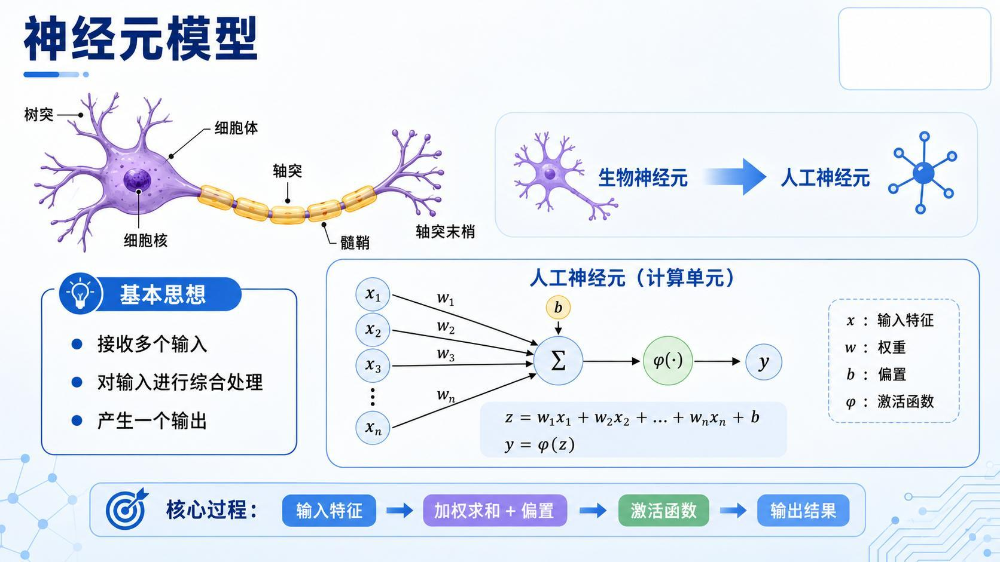
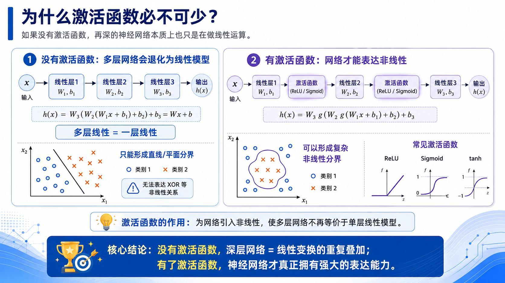
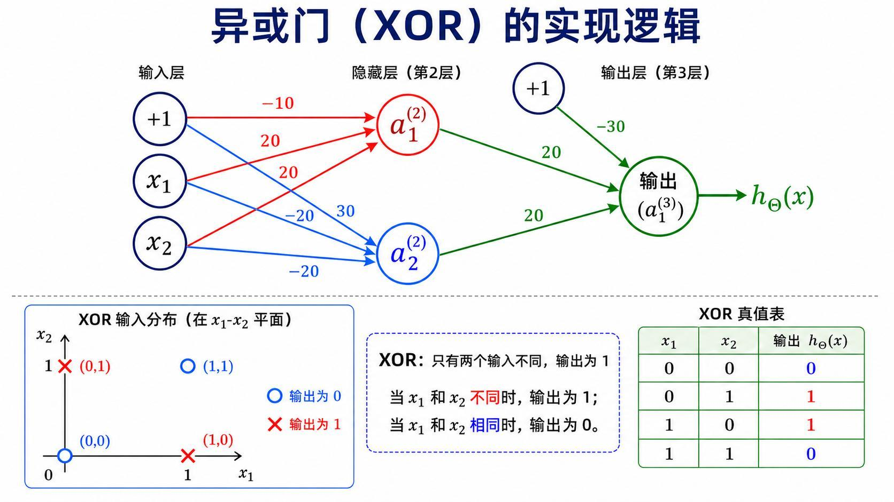
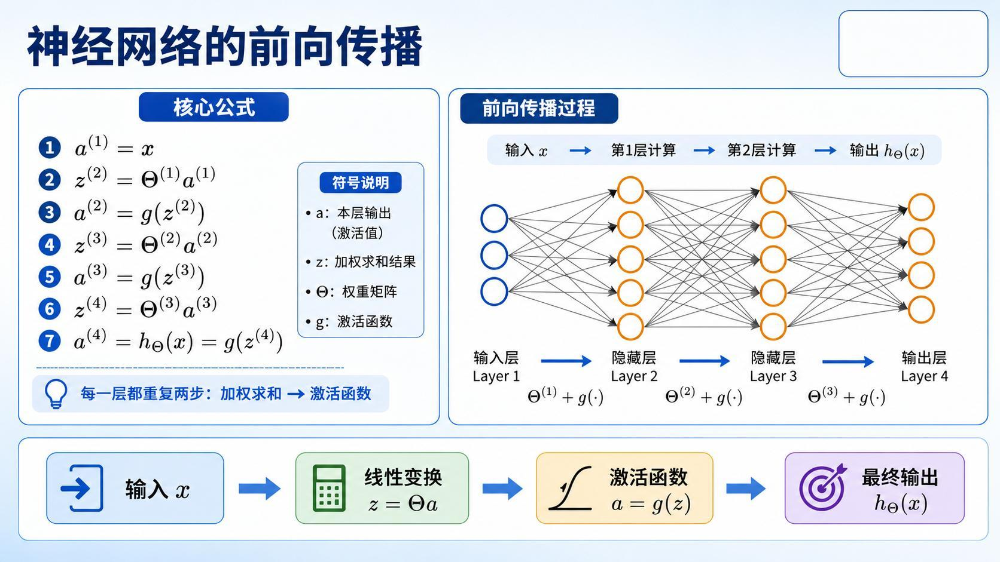
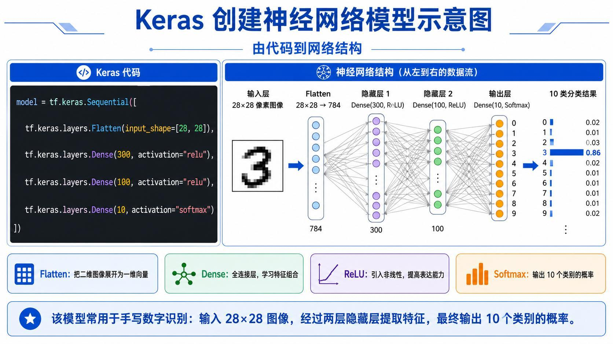
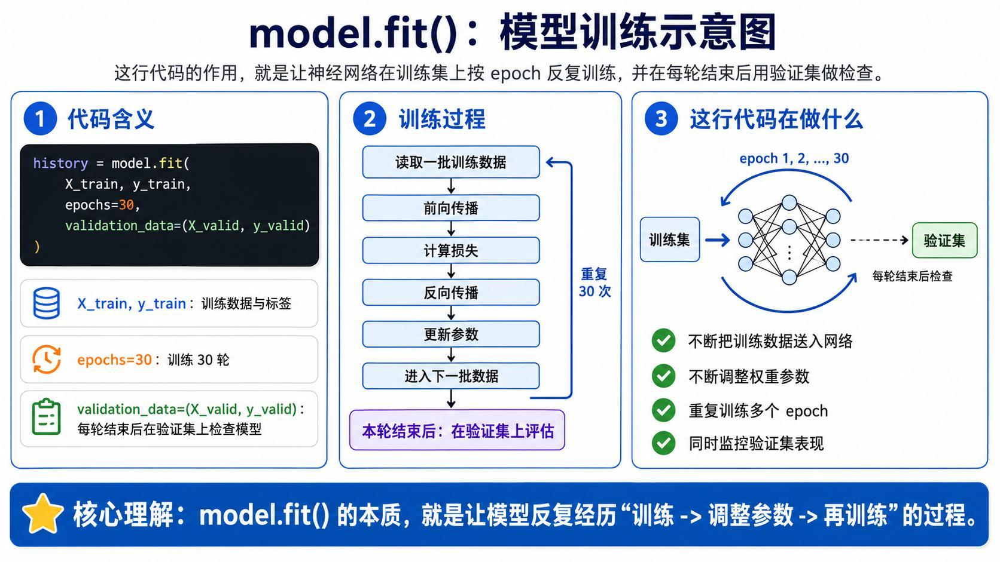
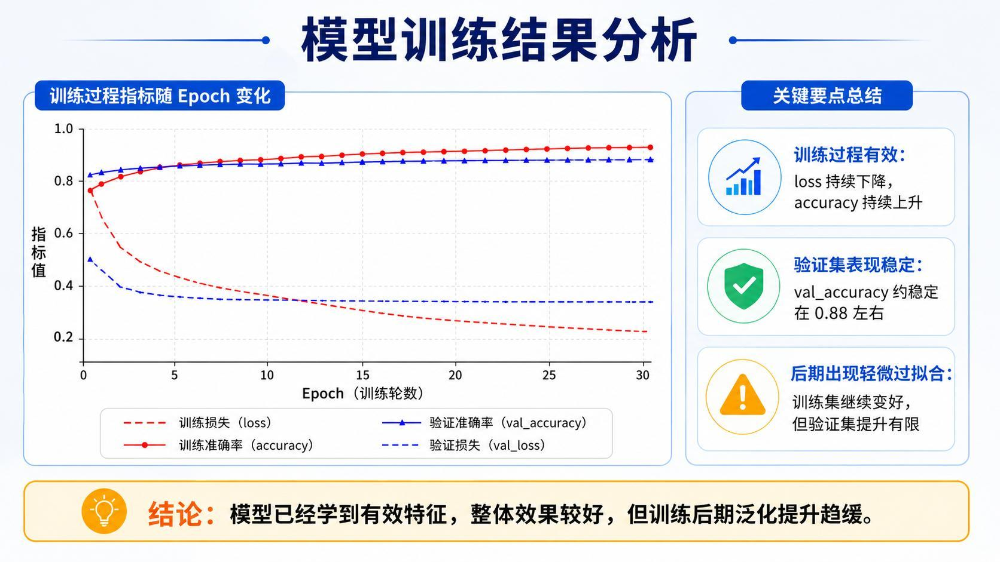

> 系列：神经网络与深度学习 · Lesson 1
> 主线：像素输入 → 人工神经元 → 多层网络 → 前向传播 → 损失函数 → 反向传播 → Keras 训练
> 实操环境：Python 3.10、TensorFlow/Keras、Jupyter Notebook

## 本课要解决的问题

人看到一张汽车图片，几乎不需要思考就能判断“这是一辆车”。计算机拿到的却只是一个像素矩阵：每个位置只有灰度值或 RGB 数值，没有“轮胎”“车身”或“汽车”这样的语义。

神经网络要解决的核心问题，就是让计算机通过数据学习一组层层组合的变换，把原始数值逐步转换成可用于分类、回归或决策的表示。

学完本课，应当能够回答下面几个问题：

1. 人工神经元如何把多个输入合成为一个输出？
2. 为什么多层网络中必须加入激活函数？
3. 单个神经元为什么能表示 AND、OR、NOT，却不能直接解决 XOR？
4. 前向传播、损失函数、反向传播和梯度下降分别负责什么？
5. 如何用 Keras 完成一个 Fashion-MNIST 十分类模型？

## 1. 从像素到语义：计算机为什么需要学习

一张灰度图像可以表示成二维矩阵：

```text
210 203 198 175 ...
208 200 190 160 ...
205 195 182 140 ...
...
```

这些数值只描述每个像素的亮暗程度。识别汽车真正需要的是更高层的信息，例如边缘、轮廓、局部形状、部件组合以及场景关系。

传统计算机视觉通常由工程师手工设计特征；神经网络则通过训练自动调整参数，让不同层逐渐学会不同层次的表示：

```text
像素值
  ↓
边缘和简单纹理
  ↓
局部形状和部件
  ↓
高层语义
  ↓
类别或连续数值
```

“学习”并不是模型凭空产生知识，而是参数在大量样本反馈下不断被修正。训练完成后，模型把这种经验固化在权重和偏置中。


## 2. 人工神经元：加权求和再做非线性变换

人工神经元接收多个输入，为每个输入分配一个权重，再加上偏置：

$$
z = w_1x_1 + w_2x_2 + \cdots + w_nx_n + b
$$

随后将 $z$ 送入激活函数 $g(\cdot)$：

$$
a = g(z)
$$

其中：

- $x_i$ 是输入特征；
- $w_i$ 是输入对应的权重，表示该特征对结果的影响强弱和方向；
- $b$ 是偏置，用来平移激活边界；
- $z$ 是线性组合结果；
- $a$ 是神经元最终输出。

用向量形式可以写得更紧凑：

$$
z = \mathbf{w}^{T}\mathbf{x} + b, \qquad a = g(z)
$$

权重不是人工逐个指定的。训练开始时通常只是随机初值，模型通过损失函数判断预测有多差，再通过反向传播和梯度下降逐步修改权重。



## 3. 激活函数为什么不可缺少

假设网络只有线性层，没有激活函数。连续三层可以写成：

$$
h(x) = W_3\bigl(W_2(W_1x+b_1)+b_2\bigr)+b_3
$$

矩阵乘法和加法仍然可以合并成一次线性变换：

$$
h(x)=Wx+b
$$

因此，无论堆叠多少层，整个网络仍只能产生直线或超平面形式的决策边界。网络看起来很深，表达能力却没有发生本质变化。

激活函数在层与层之间引入非线性：

$$
h(x)=W_3g\bigl(W_2g(W_1x+b_1)+b_2\bigr)+b_3
$$

这样，多层网络才能组合出弯曲、分段甚至高度复杂的决策边界。



### 3.1 Sigmoid

$$
\sigma(z)=\frac{1}{1+e^{-z}}
$$

Sigmoid 把任意实数压缩到 $(0,1)$。当输入很大时输出接近 1，输入很小时输出接近 0，因此可以把它理解成一个“软开关”。

它适合解释二分类概率和逻辑门，但深层网络中容易出现梯度变小的问题。

### 3.2 tanh

$$
\tanh(z)=\frac{e^z-e^{-z}}{e^z+e^{-z}}
$$

tanh 的输出范围是 $(-1,1)$，以 0 为中心。它同样会在输入绝对值较大时进入饱和区。

### 3.3 ReLU

$$
\operatorname{ReLU}(z)=\max(0,z)
$$

ReLU 在正区间保留输入，在负区间输出 0。计算简单、正区间梯度稳定，是全连接网络和卷积网络中最常见的隐藏层激活函数之一。

## 4. 一个神经元就是一个可调节的软逻辑门

把 Sigmoid 的输出接近 1 看作逻辑真、接近 0 看作逻辑假，可以用权重和偏置近似实现基本逻辑门。

### 4.1 AND

$$
h(x)=\sigma(-30+20x_1+20x_2)
$$

只有 $x_1=x_2=1$ 时，线性组合结果足够大，输出才接近 1。

### 4.2 OR

$$
h(x)=\sigma(-10+20x_1+20x_2)
$$

只要两个输入中有一个为 1，输出就接近 1。

### 4.3 NOT

$$
h(x)=\sigma(10-20x_1)
$$

输入为 0 时输出接近 1，输入为 1 时输出接近 0。

这些例子说明：

- 权重为正时，该输入倾向于促进神经元激活；
- 权重为负时，该输入倾向于抑制神经元激活；
- 偏置控制整体激活阈值。

## 5. 从单个神经元到多层网络：XOR 的启示

单个神经元本质上只能形成一条线性分界。XOR 的真值表是：

| $x_1$ | $x_2$ | XOR |
|:---:|:---:|:---:|
| 0 | 0 | 0 |
| 0 | 1 | 1 |
| 1 | 0 | 1 |
| 1 | 1 | 0 |

在二维平面中，两个正样本位于对角位置，无法用一条直线与两个负样本分开。因此，单个神经元不能直接解决 XOR。

多层网络可以先让隐藏层计算两个中间逻辑：

```text
隐藏单元 1：OR
隐藏单元 2：NAND
输出单元：AND
```

组合关系为：

$$
\operatorname{XOR}(x_1,x_2)
=\operatorname{AND}\bigl(\operatorname{OR}(x_1,x_2),
\operatorname{NAND}(x_1,x_2)\bigr)
$$

隐藏层的价值由此体现出来：每一层不必直接解决最终问题，而是先构造更有用的中间表示，再交给下一层组合。



## 6. 前向传播：数据如何穿过网络

将输入记为 $a^{[0]}=x$。第 $l$ 层的计算可以统一写成：

$$
z^{[l]}=W^{[l]}a^{[l-1]}+b^{[l]}
$$

$$
a^{[l]}=g^{[l]}\left(z^{[l]}\right)
$$

一层网络只重复两步：

1. 加权求和，即线性变换；
2. 通过激活函数得到该层输出。

从输入层开始逐层计算，直到获得最终预测，这个过程就是前向传播。它回答的是“在当前参数下，模型会预测什么”。

```text
输入 x
  ↓  W[1]x + b[1]
隐藏层 1
  ↓  激活
隐藏层 2
  ↓  W[3]a[2] + b[3]
输出概率或连续数值
```



## 7. 损失函数：把“预测得不好”变成一个数

模型只有得到明确的误差信号，才知道参数应当如何调整。

### 7.1 分类任务

对于 Softmax 多分类，常用交叉熵损失：

$$
J=-\frac{1}{m}\sum_{i=1}^{m}\sum_{k=1}^{K}
y_k^{(i)}\log \hat{y}_k^{(i)}
$$

$m$ 是样本数，$K$ 是类别数，$y$ 是真实标签，$\hat y$ 是模型预测概率。模型给真实类别的概率越高，损失越小。

还可以加入 L2 正则化，抑制过大的权重：

$$
J_{total}=J+\frac{\lambda}{2m}\sum_l\left\|W^{[l]}\right\|_F^2
$$

训练不只要拟合训练数据，还要避免参数无限增大，从而获得更好的泛化能力。

### 7.2 回归任务

回归输出连续值，常用均方误差：

$$
\operatorname{MSE}=\frac{1}{m}\sum_{i=1}^{m}
(\hat y^{(i)}-y^{(i)})^2
$$

分类与回归可以共享类似的隐藏层结构，主要区别在输出层、损失函数和评估指标。

## 8. 反向传播与梯度下降：网络如何真正学会

一次完整训练迭代包含下面的闭环：

```text
输入训练数据
  ↓
前向传播得到预测
  ↓
损失函数计算误差
  ↓
反向传播计算每个参数的梯度
  ↓
优化器更新权重和偏置
  ↓
进入下一批数据
```

反向传播的作用不是直接修改参数，而是高效计算损失对每个参数的偏导数：

$$
\frac{\partial J}{\partial W^{[l]}},\qquad
\frac{\partial J}{\partial b^{[l]}}
$$

梯度下降再利用这些梯度更新参数：

$$
W^{[l]}\leftarrow W^{[l]}-alpha
\frac{\partial J}{\partial W^{[l]}}
$$

$$
b^{[l]}\leftarrow b^{[l]}-alpha
\frac{\partial J}{\partial b^{[l]}}
$$

$\alpha$ 是学习率。学习率过大可能越过较优区域甚至发散，过小则会使训练非常缓慢。

可以把前向传播理解为“根据现有参数完成一次预测”，把反向传播理解为“追踪每个参数对错误负了多少责任”。


## 9. 实操准备：建立独立 TensorFlow 环境

讲义采用 Windows、Conda 和 Python 3.10。推荐从 Anaconda Prompt 执行安装脚本：

```bat
@echo off
chcp 65001 >nul
call conda create -n tf310 python=3.10 -y
call conda activate tf310
python -m pip install --upgrade pip -i https://pypi.tuna.tsinghua.edu.cn/simple
pip install tensorflow -i https://pypi.tuna.tsinghua.edu.cn/simple
pip install notebook ipykernel matplotlib scikit-learn pandas numpy -i https://pypi.tuna.tsinghua.edu.cn/simple
python -m ipykernel install --user --name tf310 --display-name "Python 3.10 TensorFlow"
pause
```

逐步验证环境：

```bat
conda activate tf310
python --version
python -c "import tensorflow as tf; print(tf.__version__)"
```

启动 Jupyter Notebook：

```bat
conda activate tf310
jupyter notebook
```

关键点不是记住脚本，而是理解隔离环境的意义：项目依赖被限制在 `tf310` 中，不与系统 Python 或其他项目互相污染。

## 10. Fashion-MNIST：第一个十分类数据集

Fashion-MNIST 包含 70,000 张 $28\times28$ 灰度商品图像，共 10 类，其中 60,000 张用于训练、10,000 张用于测试。


```python
class_names = [
    "T-shirt/top", "Trouser", "Pullover", "Dress", "Coat",
    "Sandal", "Shirt", "Sneaker", "Bag", "Ankle boot",
]
```

加载并划分数据：

```python
import tensorflow as tf

(X_train_full, y_train_full), (X_test, y_test) = (
    tf.keras.datasets.fashion_mnist.load_data()
)

X_valid = X_train_full[:5000] / 255.0
y_valid = y_train_full[:5000]
X_train = X_train_full[5000:] / 255.0
y_train = y_train_full[5000:]
X_test = X_test / 255.0
```

除以 255 将像素从 $[0,255]$ 缩放到 $[0,1]$。训练集负责更新参数，验证集用于观察泛化趋势，测试集应留到最终评估。

## 11. 用 Keras Sequential 搭建分类网络

讲义中的网络结构是：

```text
28×28 图像
  ↓ Flatten
784 维向量
  ↓ Dense(300, ReLU)
300 维隐藏表示
  ↓ Dense(100, ReLU)
100 维隐藏表示
  ↓ Dense(10, Softmax)
10 类概率
```



对应代码：

```python
from tensorflow import keras

tf.random.set_seed(42)

model = keras.Sequential([
    keras.layers.Input(shape=(28, 28)),
    keras.layers.Flatten(),
    keras.layers.Dense(300, activation="relu"),
    keras.layers.Dense(100, activation="relu"),
    keras.layers.Dense(10, activation="softmax"),
])

model.summary()
```

各层职责：

- `Flatten` 只改变形状，把二维图像展开成 784 维向量，不学习参数；
- `Dense(300)` 和 `Dense(100)` 学习特征组合；
- `ReLU` 为隐藏层引入非线性；
- `Dense(10, softmax)` 输出 10 个类别的概率，概率之和为 1。

## 12. compile：定义模型如何学习和如何评价

```python
model.compile(
    loss="sparse_categorical_crossentropy",
    optimizer="sgd",
    metrics=["accuracy"],
)
```

三个参数分别回答三个问题：

| 参数 | 回答的问题 | 本例选择 |
|:---|:---|:---|
| `loss` | 预测错得有多严重？ | 稀疏多分类交叉熵 |
| `optimizer` | 参数如何更新？ | 随机梯度下降 SGD |
| `metrics` | 训练效果如何展示？ | 准确率 accuracy |

真实标签是 `0` 到 `9` 的整数，因此使用 `sparse_categorical_crossentropy`。如果标签已经转换成 one-hot 向量，则应使用 `categorical_crossentropy`。

## 13. fit：让模型反复经历完整训练闭环

```python
history = model.fit(
    X_train,
    y_train,
    epochs=30,
    validation_data=(X_valid, y_valid),
)
```



每个 epoch 中，模型会反复执行：

1. 读取一批训练样本；
2. 前向传播得到预测；
3. 计算损失；
4. 反向传播计算梯度；
5. 优化器更新参数；
6. 处理下一批样本。

一轮训练结束后，Keras 在验证集上计算 `val_loss` 和 `val_accuracy`，但不会用验证集更新参数。

绘制训练曲线：

```python
import pandas as pd
import matplotlib.pyplot as plt

pd.DataFrame(history.history).plot(
    figsize=(8, 5),
    xlim=[0, 29],
    grid=True,
)
plt.xlabel("Epoch")
plt.show()
```



观察重点：

- `loss` 持续下降且 `accuracy` 上升，说明模型正在学习；
- 训练指标继续改善、验证指标停滞或恶化，通常意味着开始过拟合；
- 训练和验证都很差，可能是模型容量、特征缩放、优化器或学习率有问题。

## 14. 从概率到类别名称

模型预测首先得到每个类别的概率：

```python
import numpy as np

X_new = X_test[:3]
y_proba = model.predict(X_new)
y_pred = y_proba.argmax(axis=1)

print(y_proba.round(2))
print(np.array(class_names)[y_pred])
```

`argmax(axis=1)` 选择每个样本概率最大的类别索引，再通过 `class_names` 转换成可读标签。

不要只看最终类别。概率分布还能告诉我们模型是否犹豫：最大概率与第二大概率很接近时，预测的不确定性通常更高。

## 15. 同一套网络如何改成回归模型

回归任务的输出是连续值。一个常见 Keras 结构是：

```python
normalizer = keras.layers.Normalization()
normalizer.adapt(X_train_reg)

regressor = keras.Sequential([
    normalizer,
    keras.layers.Dense(50, activation="relu"),
    keras.layers.Dense(50, activation="relu"),
    keras.layers.Dense(50, activation="relu"),
    keras.layers.Dense(1),
])

regressor.compile(
    loss="mse",
    optimizer="adam",
    metrics=[keras.metrics.RootMeanSquaredError(name="rmse")],
)
```

与分类模型相比，主要变化是：

- 输出层只有一个神经元，并且不使用 Softmax；
- 损失函数改为 MSE；
- 评估指标可以使用 RMSE；
- 输入特征先通过 `Normalization` 标准化。

这说明“神经网络”不是只能做图像分类的固定模型，而是一套可组合的函数逼近框架。

## 16. 进一步：用 KerasTuner 搜索超参数

网络层数、每层神经元数量、学习率和 Dropout 比例都属于超参数。它们不是通过普通反向传播直接学到的，需要人为选择或借助搜索工具。

讲义给出了随机搜索思路：

```python
import keras_tuner as kt

random_search_tuner = kt.RandomSearch(
    build_model,
    objective="val_accuracy",
    max_trials=5,
    overwrite=True,
    directory="my_fashion_mnist",
    project_name="my_rnd_search",
    seed=42,
)

random_search_tuner.search(
    X_train,
    y_train,
    epochs=10,
    validation_data=(X_valid, y_valid),
)
```

随机搜索不会让模型“自动变强”，它只是用统一的验证指标比较多组候选配置。测试集仍然不能参与超参数选择，否则会产生数据泄漏。

## 17. 常见问题与排查顺序

### 17.1 Jupyter 中找不到 `tf310`

确认环境已经注册为内核：

```bat
conda activate tf310
python -m ipykernel install --user --name tf310 --display-name "Python 3.10 TensorFlow"
```

然后在 Notebook 中切换到对应内核。

### 17.2 导入 TensorFlow 失败

先确认当前解释器路径和环境：

```python
import sys
print(sys.executable)
```

再确认 TensorFlow 安装在同一个环境中，而不是安装到了 `base` 或系统 Python。

### 17.3 损失函数与标签格式不匹配

- 整数标签：`sparse_categorical_crossentropy`；
- one-hot 标签：`categorical_crossentropy`；
- 二分类单输出：常用 `binary_crossentropy`；
- 连续数值回归：常用 `mse` 或 `mae`。

### 17.4 训练准确率升高，验证准确率不再提升

这是典型的过拟合信号。可以尝试：

- 减少训练轮数；
- 使用 Early Stopping；
- 加入 L2 正则化或 Dropout；
- 增加有效训练数据；
- 降低模型容量。

### 17.5 模型几乎不学习

按下面顺序检查：

1. 输入像素是否完成缩放；
2. 标签范围是否为 `0~9`；
3. 输出层是否为 10 个单元；
4. 损失函数是否匹配标签格式；
5. 学习率是否过大或过小；
6. 训练数据和标签是否一一对应。

## 本课小结

- 图像进入计算机后只是数值矩阵，神经网络通过层级表示把像素逐步转换成语义。
- 人工神经元先做加权求和与偏置，再经过激活函数产生输出。
- 没有激活函数，多层线性网络仍等价于一层线性变换。
- 单个神经元可以近似 AND、OR、NOT；XOR 需要隐藏层组合多个中间逻辑。
- 前向传播负责计算预测，损失函数负责量化错误，反向传播负责计算梯度，优化器负责更新参数。
- Keras 将建模流程拆成 `Sequential`、`compile`、`fit` 和 `predict`，但背后的计算仍然是上述训练闭环。
- 分类和回归可以复用隐藏层思想，主要区别在输出层、损失函数与评估指标。

## 复习题

1. 为什么连续堆叠多个线性层仍然只能表示线性函数？
2. 权重和偏置在人工神经元中分别起什么作用？
3. 为什么一条直线无法分开 XOR 的四个样本？
4. 前向传播和反向传播分别计算什么？
5. 交叉熵损失和均方误差分别适合什么任务？
6. Fashion-MNIST 使用 `sparse_categorical_crossentropy` 的前提是什么？
7. 验证集为什么不能用于参数更新，测试集为什么不能用于超参数选择？
8. 如果训练准确率持续上升而验证准确率停滞，应优先怀疑什么问题？

## 视频与讲义来源

- [神经网络与深度学习精讲：从神经元到反向传播（上）](https://www.bilibili.com/video/BV1QFLU6hELC)
- [神经网络与深度学习精讲：从神经元到反向传播（下）](https://www.bilibili.com/video/BV13FLU6aEaK)
- [TensorFlow/Keras 实战入门：训练第一个神经网络模型](https://www.bilibili.com/video/BV1LXLm6TEdK)
- 本地讲义：`2026DL_lesson1_理论.pdf`、`2026DL_lesson1_实操.pdf`

课程与讲义作者：海归博士 Dr. 魏。本文为结合公开视频讲解与配套讲义整理的学习笔记。
