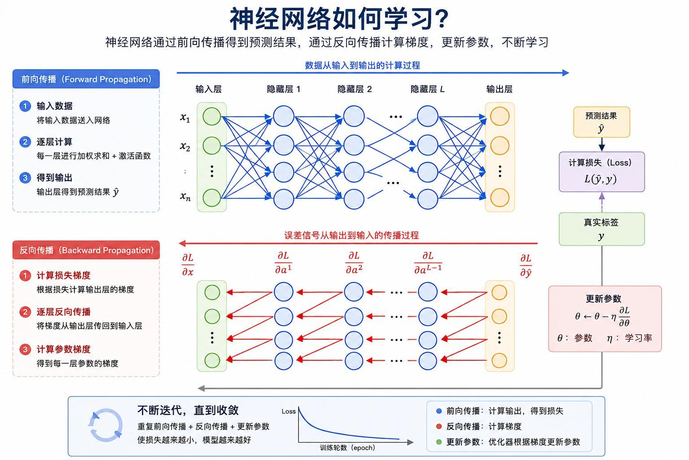
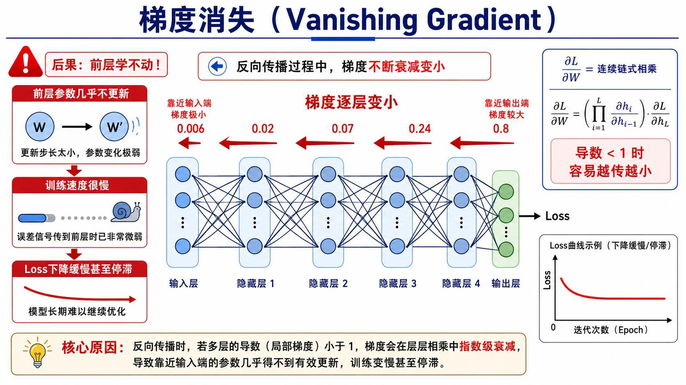
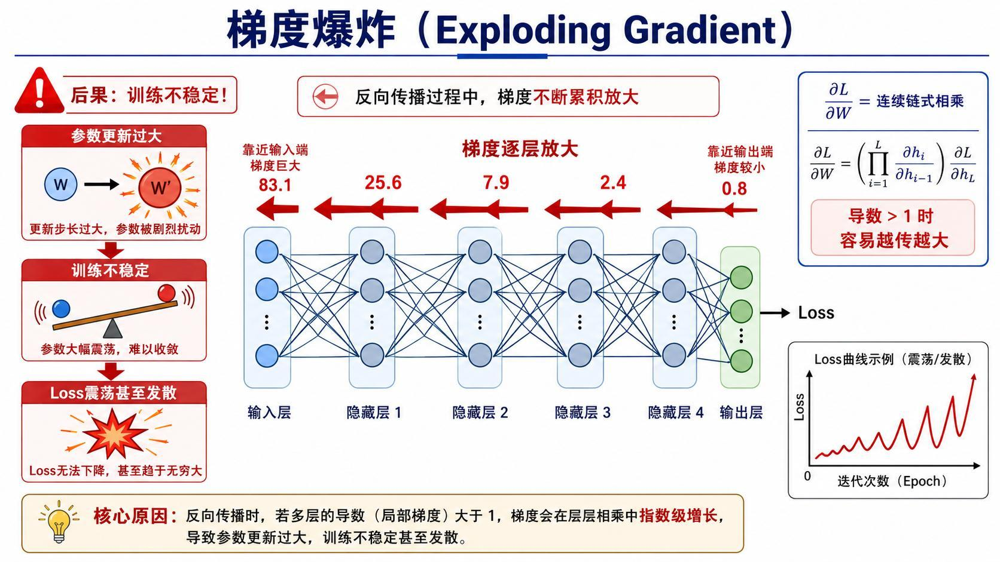
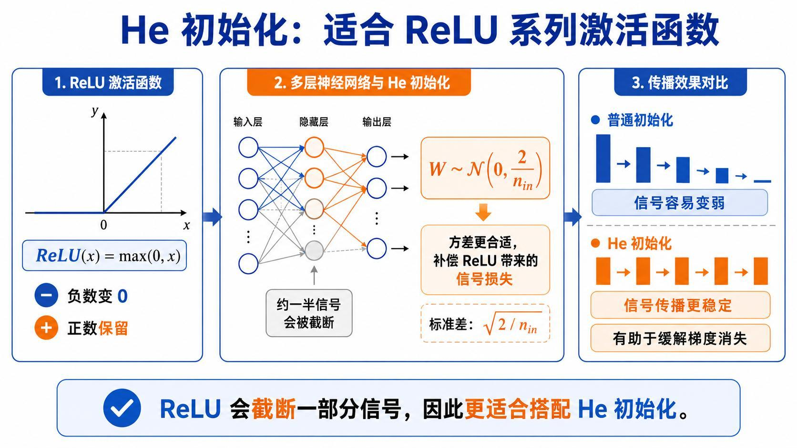
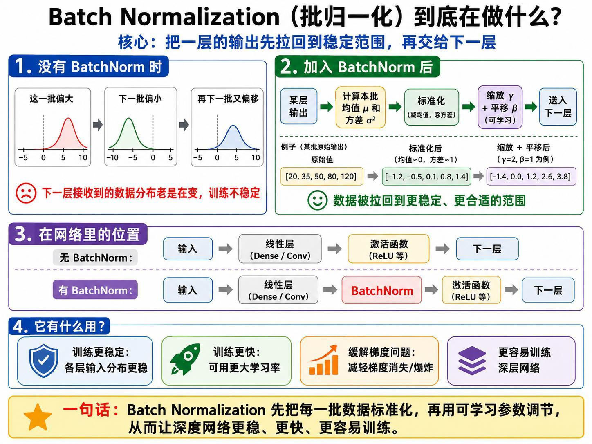
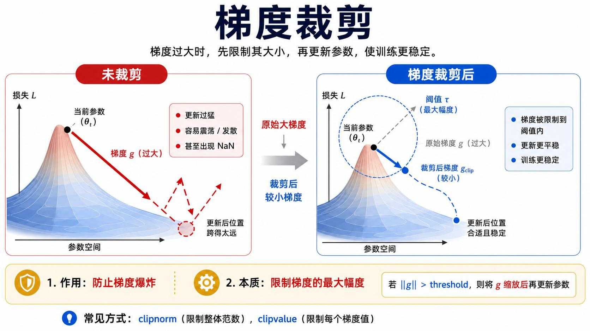
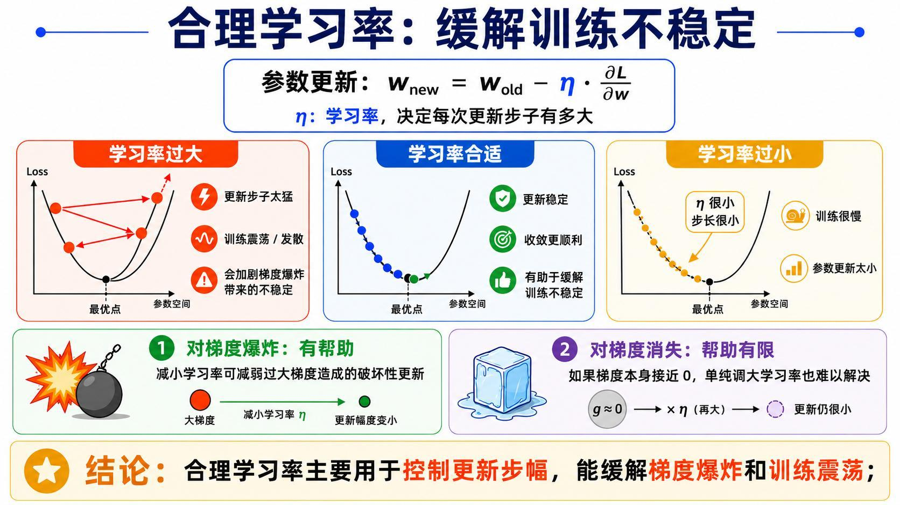
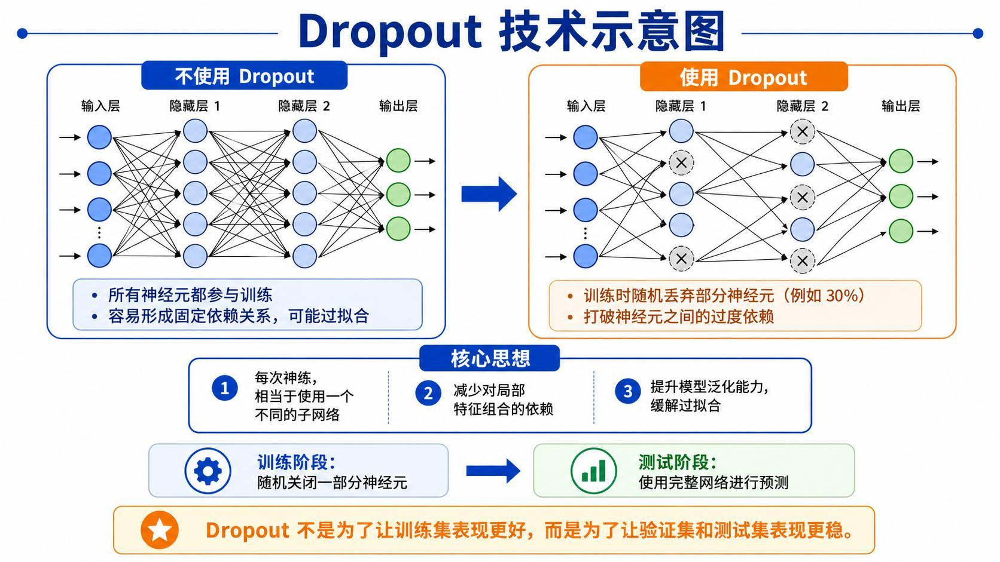
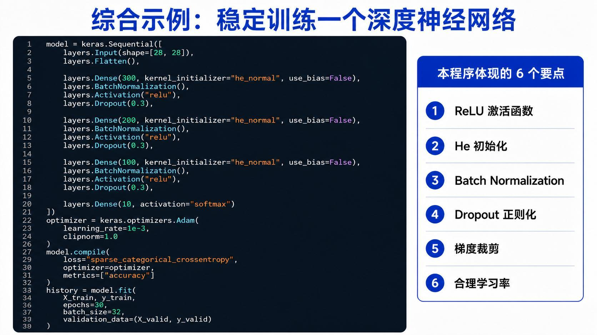

> 系列：神经网络与深度学习 · Lesson 2
> 主线：训练闭环 → 梯度问题 → 初始化与归一化 → 裁剪与学习率 → Dropout
> 实操环境：TensorFlow/Keras、Fashion-MNIST

## 本课要解决的问题

网络变深以后，困难不只是“参数更多”。反向传播需要把误差信号穿过很多层，任何一层的局部梯度都会进入链式乘法。于是模型可能出现两类典型故障：前层几乎学不动，或者参数更新猛烈震荡。

本课围绕一个核心工程问题展开：怎样让一个较深的网络稳定、有效地完成训练？

学完后应能根据训练曲线和梯度现象，在激活函数、初始化、归一化、梯度裁剪、学习率和正则化之间做出有依据的选择。

## 1. 先回到完整训练闭环

神经网络的学习过程可以压缩成四步：

```text
前向传播得到预测
  ↓
损失函数计算误差
  ↓
反向传播计算梯度
  ↓
优化器更新参数
```

对第 $l$ 层参数，最基本的梯度下降更新是：

$$
W^{[l]} \leftarrow W^{[l]} - \eta
\frac{\partial J}{\partial W^{[l]}}
$$

$\eta$ 是学习率，梯度决定方向和相对大小，学习率决定每一步走多远。训练就是重复这个闭环，直到损失不再明显下降。



## 2. 深层网络为什么更难训练

反向传播依赖链式法则。若一条路径经过多层，可以把梯度直观地写成多个局部导数的乘积：

$$
\frac{\partial J}{\partial h_1}
=
\frac{\partial J}{\partial h_L}
\prod_{l=2}^{L}
\frac{\partial h_l}{\partial h_{l-1}}
$$

问题就出在这个连乘：

- 多数因子绝对值小于 1，结果会指数级衰减；
- 多数因子绝对值大于 1，结果会快速膨胀；
- 权重尺度、激活函数导数和数据分布都会影响乘积。

因此，深度网络的稳定训练不是靠某一个“万能技巧”，而是让每一层的信号尺度、梯度尺度和更新步幅尽量保持在合理范围。

## 3. 梯度消失：前面的层几乎学不动

梯度消失时，靠近输入端的层收到的梯度极小：

$$
\left\|\frac{\partial J}{\partial W^{[1]}}\right\|
\approx 0
$$

参数虽然在更新，但步幅小到几乎没有变化。常见表现包括：

- 损失下降很慢，较早进入平台期；
- 后层还能变化，前层特征长期不变；
- 增加训练轮数也没有明显改善；
- 使用 Sigmoid 或 tanh 的深层网络尤其容易出现。



Sigmoid 在两端饱和时导数接近 0。多个很小的导数相乘，会让前层梯度迅速衰减。这也是现代深层隐藏层通常优先使用 ReLU 及其变体的原因之一。

## 4. 梯度爆炸：更新一步就跨得太远

梯度爆炸是另一个方向的问题。梯度范数过大时：

$$
\left\|\nabla_W J\right\| \gg 1
$$

一次更新就可能把参数推到很远的位置，表现为：

- 损失剧烈震荡或突然增大；
- 权重绝对值快速增长；
- 训练中出现 `NaN` 或 `Inf`；
- 换一个批次后结果极不稳定。



减小学习率能降低爆炸梯度带来的破坏，但不能从根本上保证梯度尺度合理。工程上通常还会结合合适的初始化、BatchNorm 和梯度裁剪。

## 5. 激活函数：先减少饱和带来的梯度衰减

隐藏层常见选择如下：

| 激活函数 | 特点 | 主要注意点 |
|:---|:---|:---|
| ReLU | 正区间梯度为 1，计算简单 | 负区间梯度为 0，可能出现死亡神经元 |
| Leaky ReLU | 负区间保留小斜率 | 多一个负区间斜率超参数 |
| ELU | 负区间平滑，输出更接近零均值 | 计算量略高 |
| GELU/SiLU | 平滑非线性，现代网络常用 | 比 ReLU 更复杂 |
| Sigmoid | 输出位于 $(0,1)$ | 两端饱和，深层隐藏层易梯度消失 |
| tanh | 输出零中心 | 两端仍会饱和 |

输出层要由任务决定：

- 二分类：一个 Sigmoid 输出；
- 多分类：多个 Softmax 输出；
- 回归：通常使用线性输出。

## 6. He 初始化：让 ReLU 网络的信号尺度更稳定

如果权重初始值太小，激活和梯度会逐层衰减；太大则可能逐层放大。对 ReLU 网络，He 初始化按输入单元数 `fan_in` 调整权重方差：

$$
W_{ij}\sim\mathcal{N}\left(0,\frac{2}{n_{in}}\right)
$$

标准差为：

$$
\sqrt{\frac{2}{n_{in}}}
$$



Keras 中直接指定：

```python
keras.layers.Dense(
    300,
    activation="relu",
    kernel_initializer="he_normal",
)
```

初始化主要解决训练起点和早期传播尺度问题。它不能代替归一化、正则化或合适的优化器。

## 7. Batch Normalization：稳定每一层接收到的分布

对一个 mini-batch，BatchNorm 先计算均值和方差：

$$
\mu_B=\frac{1}{m}\sum_{i=1}^{m}x_i
$$

$$
\sigma_B^2=\frac{1}{m}\sum_{i=1}^{m}(x_i-\mu_B)^2
$$

再标准化并使用可学习参数 $\gamma$、$\beta$ 恢复表达能力：

$$
\hat{x}_i=\frac{x_i-\mu_B}{\sqrt{\sigma_B^2+\epsilon}}
$$

$$
y_i=\gamma\hat{x}_i+\beta
$$



常见全连接层顺序是：

```text
Dense/Conv → BatchNorm → Activation
```

若 Dense 后立刻接 BatchNorm，Dense 的偏置通常可以关闭，因为 BatchNorm 自身已经包含可学习平移参数 $\beta$：

```python
keras.layers.Dense(300, use_bias=False, kernel_initializer="he_normal")
keras.layers.BatchNormalization()
keras.layers.Activation("relu")
```

训练和推理时 BatchNorm 行为不同。训练阶段使用当前批次统计量，推理阶段使用训练期间积累的移动均值和移动方差。

## 8. 梯度裁剪：对过大的梯度设置安全边界

梯度裁剪直接限制更新前的梯度大小。按范数裁剪时，如果 $\|g\|$ 超过阈值 $T$：

$$
g_{clip}=T\frac{g}{\|g\|}
$$

如果梯度没有超过阈值，则保持不变。



Keras 优化器可以直接设置：

```python
optimizer = keras.optimizers.Adam(
    learning_rate=1e-3,
    clipnorm=1.0,
)
```

- `clipnorm` 限制整体梯度范数；
- `clipvalue` 分别限制每个梯度元素的绝对值。

梯度裁剪主要防止偶发的大梯度破坏训练，不会解决梯度已经接近 0 的问题。

## 9. 学习率：控制参数更新的实际步幅

即使梯度方向正确，学习率不合适仍会失败：

- 太大：越过较优区域，损失震荡甚至发散；
- 太小：更新缓慢，训练成本高；
- 合适：损失相对平稳地下降。



建议先观察曲线再调整：

| 现象 | 优先检查 |
|:---|:---|
| 损失快速发散或出现 NaN | 降低学习率、检查输入、开启梯度裁剪 |
| 损失持续下降但过慢 | 适度提高学习率或换自适应优化器 |
| 前期正常、后期震荡 | 使用学习率衰减 |
| 验证损失不再改善 | 不是单纯学习率问题，还要检查过拟合 |

可以使用回调自动降低学习率：

```python
reduce_lr = keras.callbacks.ReduceLROnPlateau(
    monitor="val_loss",
    factor=0.5,
    patience=3,
    min_lr=1e-6,
)
```

## 10. Dropout：阻止神经元形成固定依赖

Dropout 在训练阶段随机关闭一部分神经元，使每个批次都像在训练一个略有不同的子网络：

```python
keras.layers.Dropout(0.3)
```

`0.3` 表示训练时随机丢弃 30% 的输出。推理时使用完整网络，Keras 会自动处理尺度。



Dropout 的目标不是让训练集指标更好，而是减少对特定神经元组合的过度依赖，让验证集和测试集表现更稳定。比例过高会造成欠拟合。

## 11. 将稳定训练技术组合到一个 Keras 模型

下面的网络同时使用 ReLU、He 初始化、BatchNorm、Dropout、合理学习率和梯度裁剪：

```python
from tensorflow import keras
from tensorflow.keras import layers

model = keras.Sequential([
    layers.Input(shape=(28, 28)),
    layers.Flatten(),

    layers.Dense(300, kernel_initializer="he_normal", use_bias=False),
    layers.BatchNormalization(),
    layers.Activation("relu"),
    layers.Dropout(0.3),

    layers.Dense(200, kernel_initializer="he_normal", use_bias=False),
    layers.BatchNormalization(),
    layers.Activation("relu"),
    layers.Dropout(0.3),

    layers.Dense(100, kernel_initializer="he_normal", use_bias=False),
    layers.BatchNormalization(),
    layers.Activation("relu"),
    layers.Dropout(0.3),

    layers.Dense(10, activation="softmax"),
])

optimizer = keras.optimizers.Adam(
    learning_rate=1e-3,
    clipnorm=1.0,
)

model.compile(
    loss="sparse_categorical_crossentropy",
    optimizer=optimizer,
    metrics=["accuracy"],
)

history = model.fit(
    X_train,
    y_train,
    epochs=30,
    batch_size=32,
    validation_data=(X_valid, y_valid),
    callbacks=[reduce_lr],
)
```



不要机械地把所有技巧叠在每个模型上。更可靠的做法是先建立基线，根据训练现象一次只引入一项关键改动，再观察它是否解决了原问题。

## 12. 训练问题的排查顺序

遇到深度网络训练失败，可以按下面顺序排查：

1. **数据**：输入是否归一化，标签是否正确，是否有 NaN；
2. **输出与损失**：输出激活、标签格式和损失函数是否匹配；
3. **初始化**：ReLU 网络是否采用合理的 He 初始化；
4. **梯度**：是否接近 0、是否异常增大、是否出现 NaN；
5. **学习率**：是否过大导致震荡，或过小导致停滞；
6. **归一化**：深层网络是否需要 BatchNorm；
7. **正则化**：训练好、验证差时再考虑 Dropout、L2 或早停；
8. **批量大小**：mini-batch 是否过小导致统计波动，或过大影响泛化。

这个顺序强调先检查正确性，再处理优化速度和泛化问题。数据或标签本身错误时，加入更多训练技巧只会掩盖根因。

## 本课小结

- 梯度消失和梯度爆炸都来自深层链式乘法中的尺度问题。
- ReLU 及其变体减少饱和区影响，He 初始化为 ReLU 网络提供更合适的初始方差。
- BatchNorm 稳定层间分布，梯度裁剪限制异常大梯度，学习率控制实际更新步幅。
- Dropout 通过随机子网络减少固定依赖，主要用于改善泛化，而不是训练集指标。
- 稳定训练技术各自解决不同问题，不能不看现象地全部堆叠。


## 复习题

1. 为什么深层网络中的梯度会随着反向传播逐层变小或变大？
2. He 初始化为什么特别适合 ReLU 系列激活函数？
3. BatchNorm 中 $\gamma$ 和 $\beta$ 的作用是什么？
4. `clipnorm` 与减小学习率解决的问题有什么不同？
5. Dropout 在训练和推理阶段的行为有什么区别？
6. Dense 后紧接 BatchNorm 时，为什么通常可以设置 `use_bias=False`？
7. 训练准确率继续上升而验证准确率下降时，应优先采用哪些手段？
8. 为什么不应在没有观察训练现象前就把所有稳定训练技巧全部叠加？

## 视频与讲义来源

- [告别炼丹失败！深度网络训练全技巧（含代码）（上）](https://www.bilibili.com/video/BV1v3Li6vE4M)
- [告别炼丹失败！深度网络训练全技巧（含代码）（下）](https://www.bilibili.com/video/BV1R3Li6vEag)
- [告别炼丹失败！深度网络训练全技巧（含代码）（实操）](https://www.bilibili.com/video/BV1ajLi6wE1R)
- 本地讲义：`2026DL_lesson2 - 最终版 - 副本.pdf`

课程与讲义作者：海归博士 Dr. 魏。本文为结合公开视频讲解与配套讲义整理的学习笔记。
