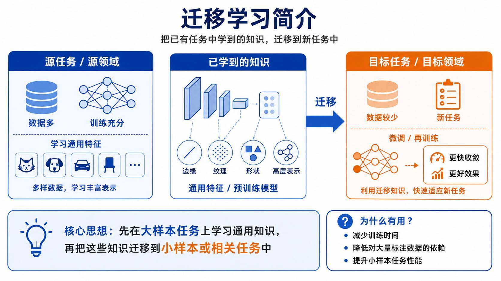
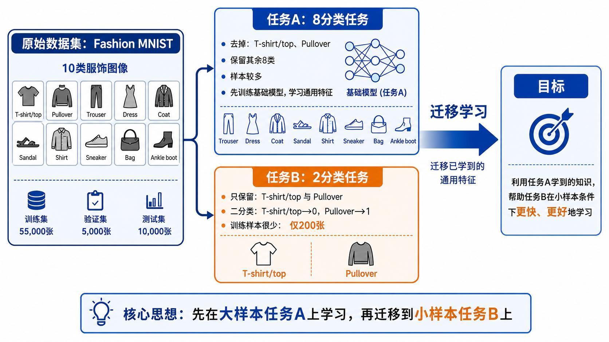
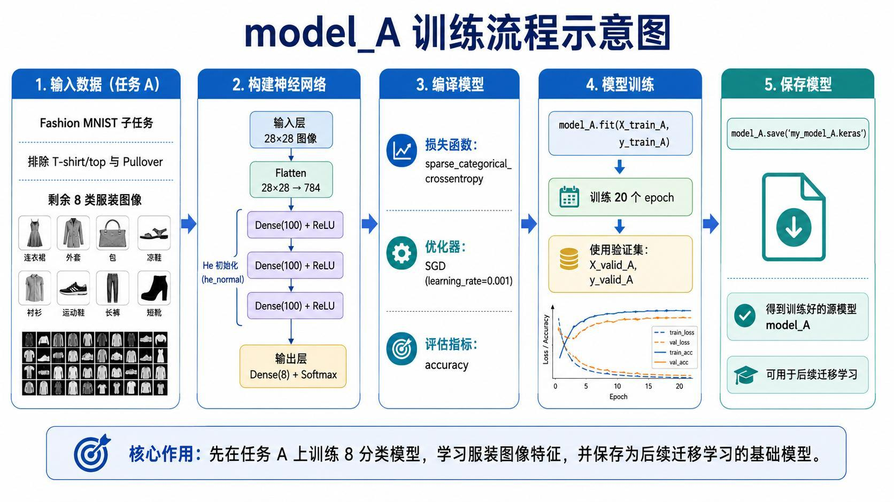
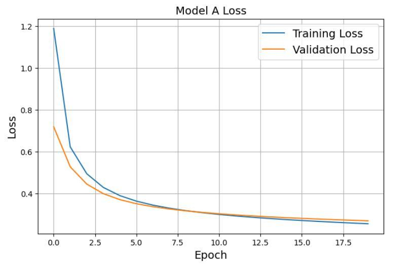
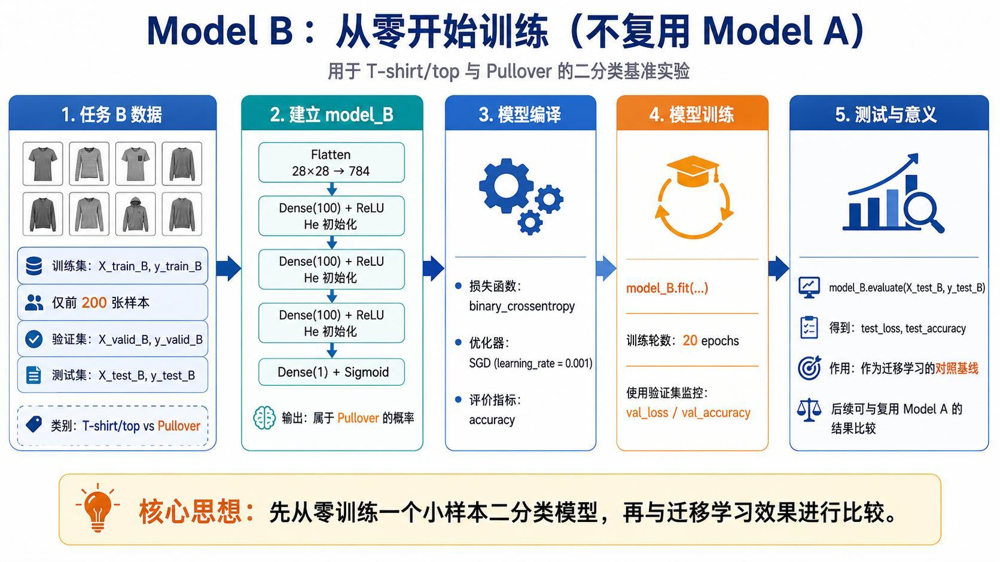
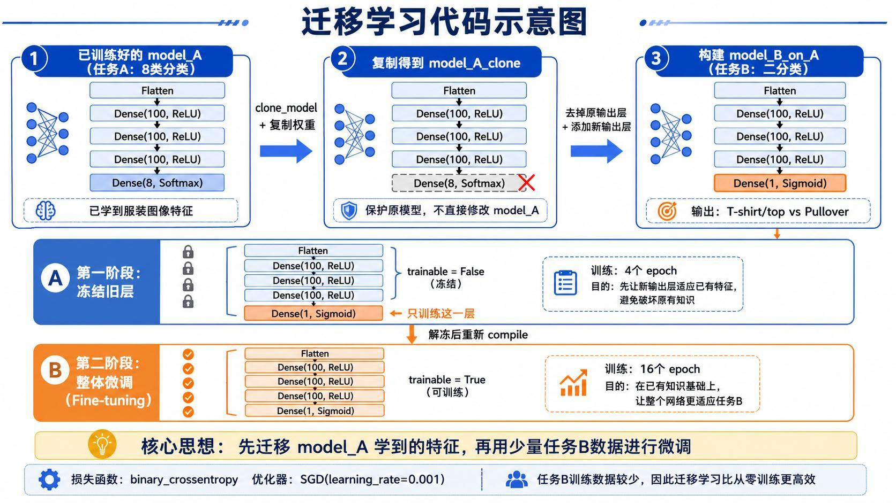
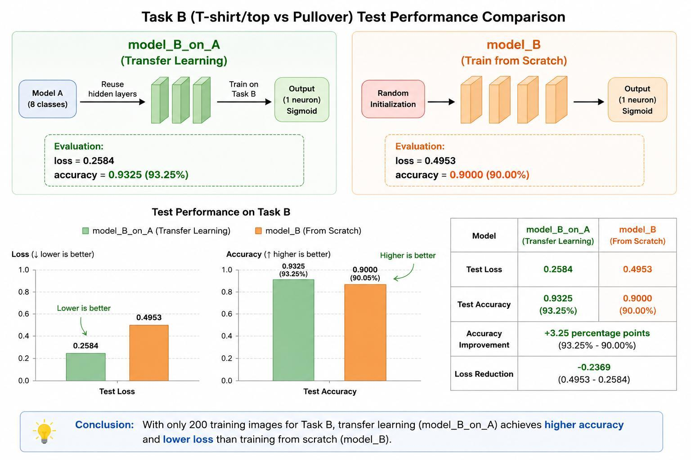

> 系列：神经网络与深度学习 · Lesson 3
> 主线：源任务训练 → 小样本基线 → 复用隐藏层 → 冻结训练 → 解冻微调 → 对照评估
> 实操环境：TensorFlow/Keras、Fashion-MNIST

## 本课要解决的问题

当目标任务只有少量标注数据时，从随机权重开始训练一个深度网络通常会遇到两个问题：模型很容易过拟合，而且有限样本不足以让网络重新学会稳定的底层特征。

迁移学习提供了另一条路径：先在数据充足的相关任务上学习通用表示，再把这些表示迁移到目标任务，只用少量数据适配新的输出。

本课用 Fashion-MNIST 构造一个可控实验：

- 任务 A：使用 8 类服饰图像训练源模型；
- 任务 B：只使用 `T-shirt/top` 和 `Pullover`，训练样本限制为 200 张；
- 基线：任务 B 从随机初始化开始训练；
- 迁移：复用任务 A 的隐藏层，先冻结，再整体微调。

## 1. 迁移的究竟是什么

神经网络不同层学到的信息层级不同。以图像模型为例：

```text
浅层：边缘、方向、简单纹理
  ↓
中层：局部形状、部件组合
  ↓
深层：与源任务类别相关的高层表示
  ↓
输出层：具体任务的决策边界
```

相关任务往往可以共享前面几层或大部分隐藏层。迁移学习主要复用这些已经学到的特征变换，而不是复用原任务的输出类别。



迁移学习通常在以下条件下更有价值：

- 源任务数据量明显更大；
- 源任务和目标任务输入形式一致；
- 两个任务共享部分视觉或语义结构；
- 目标任务标注数据较少；
- 源模型训练质量可靠。

如果源任务与目标任务差异过大，迁移可能没有帮助，甚至产生负迁移。

## 2. 为什么要保留从零训练基线

仅仅训练出一个迁移模型，不能证明迁移有效。需要建立一个控制变量尽量一致的从零训练模型：

- 使用相同的任务 B 数据；
- 使用相同的训练轮数和评估集；
- 网络隐藏层规模尽量一致；
- 主要区别是隐藏层来自预训练还是随机初始化。

最终比较测试损失、测试准确率和训练稳定性，才能判断复用源模型是否真的带来收益。

## 3. 构造源任务 A 和目标任务 B

Fashion-MNIST 原始数据集包含 10 类。讲义将其拆成两个互相关联的任务：

| 任务 | 类别 | 数据规模 | 目的 |
|:---|:---|:---|:---|
| A | 去掉 T-shirt/top、Pullover 后的其余 8 类 | 大样本 | 学习服饰图像通用特征 |
| B | T-shirt/top 与 Pullover | 训练集仅取 200 张 | 验证小样本迁移效果 |



加载数据并归一化：

```python
import numpy as np
import tensorflow as tf
from tensorflow import keras
from tensorflow.keras import layers

(X_train_full, y_train_full), (X_test_full, y_test_full) = (
    keras.datasets.fashion_mnist.load_data()
)

X_train_full = X_train_full.astype("float32") / 255.0
X_test_full = X_test_full.astype("float32") / 255.0
```

## 4. 任务 A 的标签必须重新映射

任务 A 去掉原标签 0 和 2 后，剩余标签是：

```text
1, 3, 4, 5, 6, 7, 8, 9
```

但 `Dense(8, softmax)` 配合稀疏交叉熵时，合法标签必须是连续的 `0~7`。因此不能只过滤样本，还要重新映射标签：

```python
source_classes = [1, 3, 4, 5, 6, 7, 8, 9]
source_label_map = {label: index for index, label in enumerate(source_classes)}

mask_train_A = np.isin(y_train_full, source_classes)
mask_test_A = np.isin(y_test_full, source_classes)

X_all_A = X_train_full[mask_train_A]
y_all_A = np.array([
    source_label_map[int(label)] for label in y_train_full[mask_train_A]
])

X_test_A = X_test_full[mask_test_A]
y_test_A = np.array([
    source_label_map[int(label)] for label in y_test_full[mask_test_A]
])

X_valid_A = X_all_A[:5000]
y_valid_A = y_all_A[:5000]
X_train_A = X_all_A[5000:]
y_train_A = y_all_A[5000:]
```

如果忽略这一步，模型输出只有 8 维，却可能收到标签 8 或 9，训练时会出现标签越界或语义错位。

## 5. 训练源模型 model_A

源模型使用三层全连接隐藏层，输出 8 类概率：

```python
tf.random.set_seed(42)

model_A = keras.Sequential([
    layers.Input(shape=(28, 28)),
    layers.Flatten(),
    layers.Dense(100, activation="relu", kernel_initializer="he_normal"),
    layers.Dense(100, activation="relu", kernel_initializer="he_normal"),
    layers.Dense(100, activation="relu", kernel_initializer="he_normal"),
    layers.Dense(8, activation="softmax"),
])

model_A.compile(
    loss="sparse_categorical_crossentropy",
    optimizer=keras.optimizers.SGD(learning_rate=1e-3),
    metrics=["accuracy"],
)

history_A = model_A.fit(
    X_train_A,
    y_train_A,
    epochs=20,
    validation_data=(X_valid_A, y_valid_A),
)

model_A.save("my_model_A.keras")
```



保存 `.keras` 文件时，Keras 会保存网络结构和训练后的参数。后续迁移真正复用的是这些已经优化过的隐藏层权重。

## 6. 先检查源模型是否真的学到了东西

迁移一个没有训练好的源模型没有意义。至少要观察：

- 训练损失是否持续下降；
- 验证损失是否同步改善；
- 训练与验证曲线是否出现明显分叉；
- 8 分类验证准确率是否达到可用水平。



源模型的目标不是在任务 A 上追求一个孤立的高分，而是形成可以被相关任务复用的稳定特征表示。

## 7. 准备目标任务 B

任务 B 只保留原始类别 0 和 2，并映射成二分类标签：

```python
def make_task_b(X, y):
    mask = (y == 0) | (y == 2)
    X_B = X[mask]
    y_B = (y[mask] == 2).astype("float32")
    return X_B, y_B


X_train_B_all, y_train_B_all = make_task_b(X_train_full, y_train_full)
X_test_B, y_test_B = make_task_b(X_test_full, y_test_full)

X_valid_B = X_train_B_all[200:1200]
y_valid_B = y_train_B_all[200:1200]
X_train_B = X_train_B_all[:200]
y_train_B = y_train_B_all[:200]
```

这里约定：

- `T-shirt/top` → 0；
- `Pullover` → 1。

验证集和测试集不能混入训练过程。200 张训练样本的限制是实验设计的一部分，用来放大迁移学习在小样本条件下的差异。

## 8. 建立从零训练的 model_B

从零模型与源模型使用相似的隐藏层规模，但输出改成一个 Sigmoid：

```python
model_B = keras.Sequential([
    layers.Input(shape=(28, 28)),
    layers.Flatten(),
    layers.Dense(100, activation="relu", kernel_initializer="he_normal"),
    layers.Dense(100, activation="relu", kernel_initializer="he_normal"),
    layers.Dense(100, activation="relu", kernel_initializer="he_normal"),
    layers.Dense(1, activation="sigmoid"),
])

model_B.compile(
    loss="binary_crossentropy",
    optimizer=keras.optimizers.SGD(learning_rate=1e-3),
    metrics=["accuracy"],
)

history_B = model_B.fit(
    X_train_B,
    y_train_B,
    epochs=20,
    validation_data=(X_valid_B, y_valid_B),
)

baseline_loss, baseline_accuracy = model_B.evaluate(X_test_B, y_test_B)
```



这个模型必须同时从 200 张图片中学习像素到特征的变换和最终分类边界，因此更容易过拟合。

## 9. 为什么要克隆 model_A

如果直接把 `model_A` 的层放进新模型并继续训练，原模型权重也会被修改。为了保留可重复的源模型，先克隆结构并复制权重：

```python
model_A_clone = keras.models.clone_model(model_A)
model_A_clone.set_weights(model_A.get_weights())
```

`clone_model()` 只复制结构，不会自动复制训练后的权重，因此 `set_weights()` 不能省略。

## 10. 替换输出层，构建 model_B_on_A

原模型最后一层面向 8 分类，目标任务需要一个二分类输出，因此保留前面的特征层并替换输出层：

```python
model_B_on_A = keras.Sequential([
    *model_A_clone.layers[:-1],
    layers.Dense(1, activation="sigmoid"),
])
```

此时模型结构可以理解为：

```text
任务 A 已训练隐藏层
  ↓
复用服饰图像特征
  ↓
新的 Dense(1, Sigmoid)
  ↓
T-shirt/top 与 Pullover 二分类
```

## 11. 第一阶段：冻结旧层，只训练新输出层

新输出层刚创建时是随机权重。如果立刻让梯度穿过整个网络，随机输出层产生的误差信号可能破坏源模型中已经学到的表示。

先冻结旧层：

```python
for layer in model_B_on_A.layers[:-1]:
    layer.trainable = False

model_B_on_A.compile(
    loss="binary_crossentropy",
    optimizer=keras.optimizers.SGD(learning_rate=1e-3),
    metrics=["accuracy"],
)

model_B_on_A.fit(
    X_train_B,
    y_train_B,
    epochs=4,
    validation_data=(X_valid_B, y_valid_B),
)
```

这一阶段只有最后的二分类层更新。它先学会如何利用已有特征完成新任务。

## 12. 第二阶段：解冻并用小学习率微调

输出层适应后，再解冻隐藏层，让通用特征轻微调整到任务 B：

```python
for layer in model_B_on_A.layers[:-1]:
    layer.trainable = True

model_B_on_A.compile(
    loss="binary_crossentropy",
    optimizer=keras.optimizers.SGD(learning_rate=1e-4),
    metrics=["accuracy"],
)

history_transfer = model_B_on_A.fit(
    X_train_B,
    y_train_B,
    epochs=16,
    validation_data=(X_valid_B, y_valid_B),
)
```



微调阶段使用更小学习率，是为了避免大步更新迅速覆盖源模型已有知识。

### 为什么必须重新 compile

Keras 在 `compile()` 时确定可训练参数集合并构建优化过程。修改 `layer.trainable` 后如果不重新编译，实际参与更新的参数可能仍然不是预期集合。

正确顺序是：

```text
修改 trainable
  ↓
重新 compile
  ↓
再次 fit
```

## 13. 对比迁移模型和从零基线

```python
transfer_loss, transfer_accuracy = model_B_on_A.evaluate(X_test_B, y_test_B)

print("from scratch:", baseline_loss, baseline_accuracy)
print("transfer:", transfer_loss, transfer_accuracy)
```

讲义中的一次实验结果为：

| 模型 | 测试损失 | 测试准确率 |
|:---|---:|---:|
| `model_B`：从零训练 | 0.4953 | 90.00% |
| `model_B_on_A`：迁移学习 | 0.2584 | 93.25% |



在该实验配置下，迁移模型损失更低，准确率高 3.25 个百分点。这说明源任务学到的服饰特征对目标二分类有帮助。

这些数值属于当前数据划分、随机种子和训练配置，不代表任何迁移任务都能获得相同提升。真正应保留的是对照实验方法。

## 14. 迁移学习的常见失败方式

### 14.1 源任务和目标任务差异过大

源模型学习到的特征不适用目标数据，可能导致负迁移。应重新选择更相关的预训练模型，或只复用更浅的层。

### 14.2 一开始就解冻所有层

目标数据很少时，大量可训练参数会迅速过拟合，并破坏原有表示。先冻结、再微调通常更稳。

### 14.3 微调学习率过大

大步更新会造成灾难性遗忘。微调学习率通常应低于新输出层适配阶段。

### 14.4 修改 trainable 后没有重新编译

代码表面上解冻了层，但优化器未按新参数集合重建，导致训练行为与预期不一致。

### 14.5 目标任务没有从零基线

没有基线时，无法区分提升来自迁移、模型容量、随机波动还是数据划分。

### 14.6 标签过滤后没有重新映射

多分类输出维度与原始稀疏标签不匹配，是自定义子任务中非常常见的错误。

## 15. 一套可复用的迁移学习检查表

1. 源任务和目标任务是否相关？
2. 源模型是否在独立验证集上表现正常？
3. 目标任务是否建立了从零训练基线？
4. 新输出层是否与目标标签格式匹配？
5. 第一阶段是否冻结了旧层？
6. 修改 `trainable` 后是否重新 `compile()`？
7. 微调阶段是否降低学习率？
8. 比较是否使用相同测试集和指标？
9. 是否同时查看损失、准确率和训练曲线？

## 本课小结

- 迁移学习复用的是源模型已经学到的特征表示，而不是原任务输出类别。
- 相关的大样本源任务可以为小样本目标任务提供更好的参数起点。
- 判断迁移是否有效，必须与相同数据条件下的从零训练模型比较。
- 子任务过滤类别后，要确保稀疏标签重新映射到连续范围。
- 克隆模型时既要复制结构，也要复制训练后的权重。
- 两阶段训练先冻结旧层适配新输出，再解冻并用小学习率微调。
- 更改 Keras 层的 `trainable` 后必须重新 `compile()`。
- 迁移收益取决于任务相关性、数据规模和微调策略，不能把单次实验数值当作普遍结论。

## 复习题

1. 迁移学习中通常复用哪些层，为什么不直接复用原输出层？
2. 为什么任务 A 过滤类别后必须重新映射标签？
3. `clone_model()` 后为什么还要调用 `set_weights()`？
4. 为什么新输出层适应前不宜直接解冻整个网络？
5. 微调阶段为什么通常使用更小的学习率？
6. 修改 `trainable` 后为什么必须重新编译模型？
7. 如何设计对照实验才能说明迁移学习确实有效？
8. 哪些情况可能导致负迁移？

## 视频与讲义来源

- [深度学习必学：迁移学习为什么强？8 分类 → 2 分类实战（理论）](https://www.bilibili.com/video/BV1hmGa6CEWR)
- [深度学习必学：迁移学习为什么强？8 分类 → 2 分类实战（实操）](https://www.bilibili.com/video/BV1hmGa6CEMz)
- 本地讲义：`2026DL_lesson3.pdf`

课程与讲义作者：海归博士 Dr. 魏。本文为结合公开视频讲解与配套讲义整理的学习笔记。
