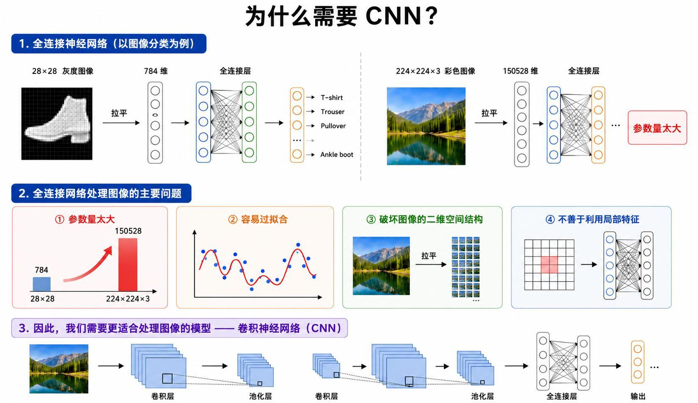
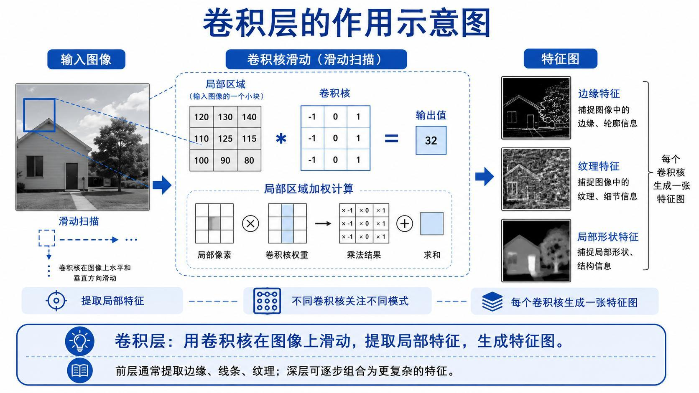
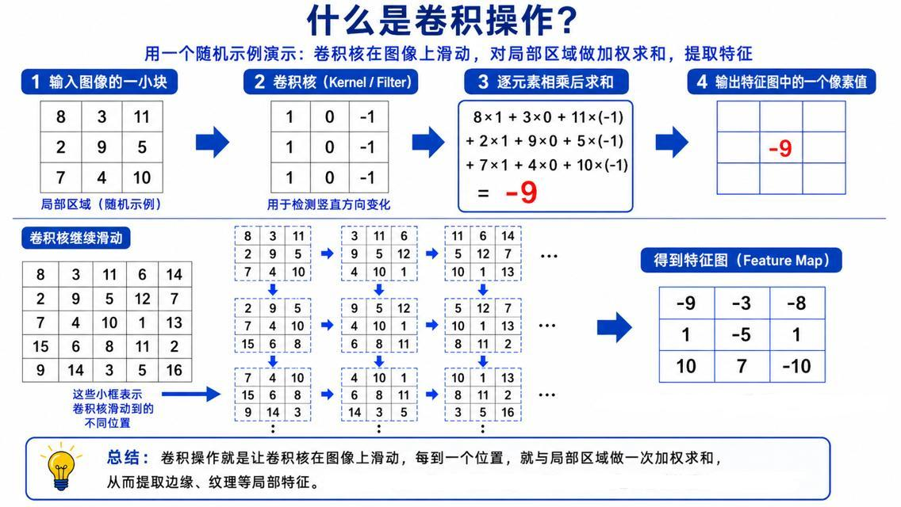
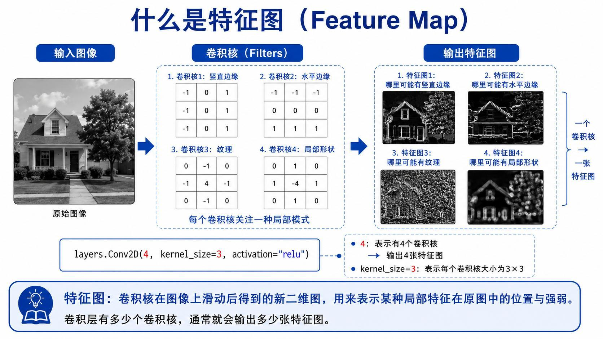
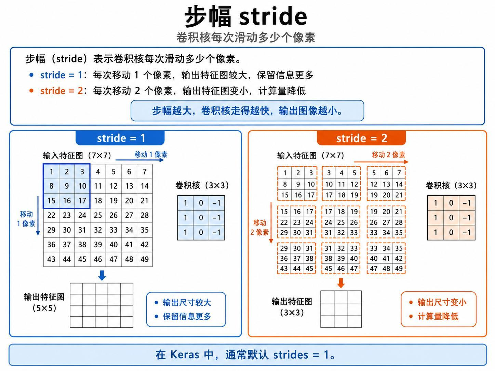
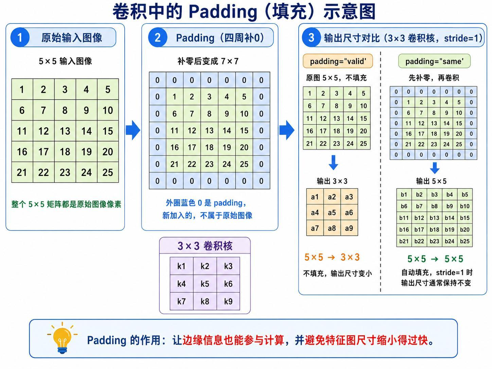
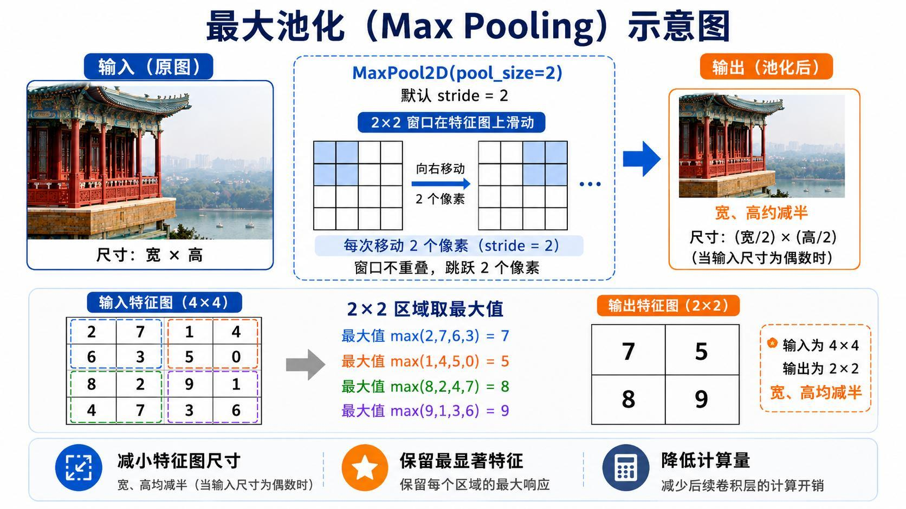
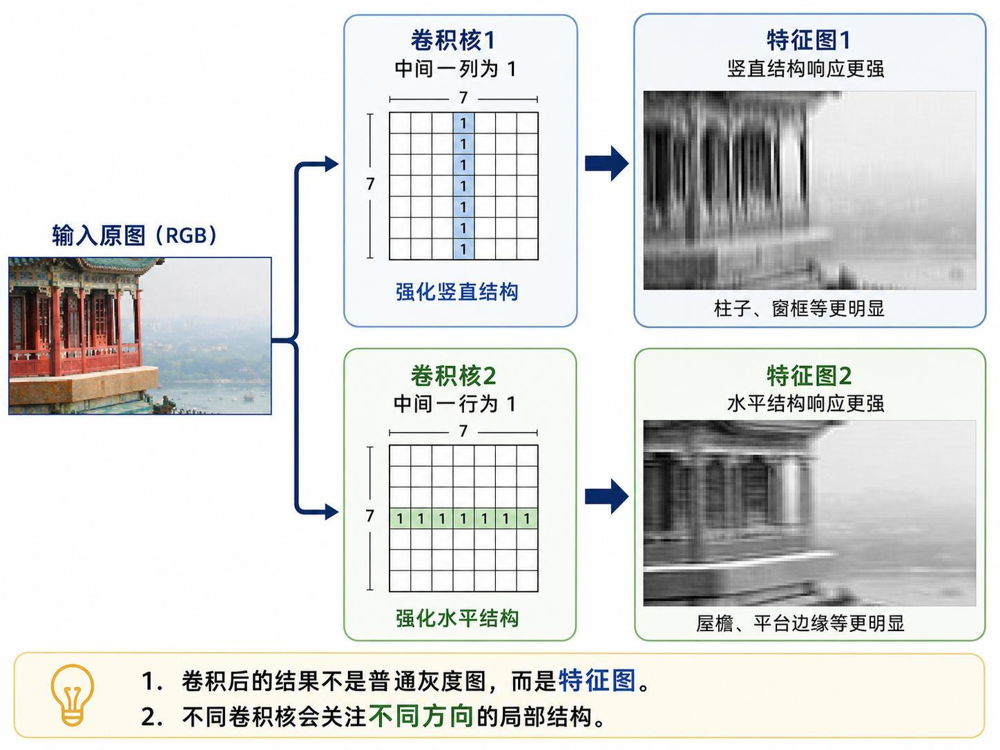

> 系列：神经网络与深度学习 · Lesson 4
> 视频主线：全连接网络处理图像的瓶颈 → 卷积核滑动与数值演算 → 特征图 → stride/padding/pooling → TensorFlow Conv2D 尺寸验证 → 手工卷积核观察方向特征

## 视频脉络

### 理论视频

| 视频时间 | 讲解内容 |
|:---|:---|
| 00:00-02:13 | 回顾全连接网络、深层训练和迁移学习 |
| 02:13-03:12 | CNN 总体结构与层次特征 |
| 03:12-06:12 | 大图拉平后的参数、过拟合和空间结构问题 |
| 06:12-08:47 | 卷积核滑动、局部连接与特征图 |
| 08:47-12:04 | 5×5 输入和 3×3 卷积核的逐元素演算 |
| 12:04-15:25 | 竖直、水平和局部形状卷积核 |
| 15:25-18:31 | stride=1/2 与输出尺寸，现场订正课件 |
| 18:31-20:07 | valid 与 same padding |
| 20:07-22:17 | 2×2 最大池化与平均池化 |
| 22:17-24:00 | 方向卷积核生成不同特征图 |

### 实操视频

| 视频时间 | 讲解内容 |
|:---|:---|
| 00:00-01:30 | TensorFlow/Jupyter 环境和图片准备 |
| 01:30-03:03 | crop、rescale、RGB shape 与绘图 |
| 03:03-06:28 | 32 个 7×7 filter 与 valid 输出尺寸 |
| 06:28-08:36 | 随机特征图、same padding 和 stride=2 |
| 08:36-10:21 | 权重 shape 与两个手工方向滤波器 |
| 10:21-11:22 | 竖直/水平特征结果和课程总结 |

## 1. 为什么图像不能一直用全连接网络
课程前三课使用全连接网络、深层训练技巧和迁移学习。本课转向图像专用结构，因为输入尺寸增大后，直接 Flatten 会带来明显问题。

Fashion-MNIST 的 28×28 灰度图只有 784 个输入。若换成 224×224×3 彩色图像：

$$
224\times224\times3=150{,}528
$$

假设下一全连接层有 1000 个神经元，仅这一层权重就约为：

$$
150{,}528\times1000\approx1.5\times10^8
$$

视频据此总结四个问题：

- 参数和计算量过大；
- 容易过拟合；
- Flatten 破坏二维空间结构；
- 不善于利用边缘、纹理等局部特征。

CNN 通过局部连接和权值共享减少参数。浅层卷积先捕捉边缘、线条和纹理，深层再把它们组合成形状、部件和物体。

## 2. 卷积层做的是局部加权求和

卷积核也称 Kernel 或 Filter。一个 3×3 卷积核覆盖输入图像的 3×3 局部区域，对应位置逐元素相乘后求和，产生输出中的一个值。随后卷积核向右或向下滑动，重复计算。

卷积层的三个关键性质：

1. 局部连接：每次只观察一小块；
2. 权值共享：同一卷积核在所有位置使用同一组参数；
3. 空间扫描：输出保留局部模式出现的位置。

## 3. 视频中的 3×3 数值演算

第一个局部区域与卷积核：

~~~text
局部区域      卷积核
 8  3 11      1  0 -1
 2  9  5      1  0 -1
 7  4 10      1  0 -1
~~~

输出值为：

$$
8\times1+3\times0+11\times(-1)
+2\times1+9\times0+5\times(-1)
+7\times1+4\times0+10\times(-1)=-9
$$

把 -9 放到特征图左上角，再把卷积核向右移动一个像素。5×5 输入在无填充、stride=1 时得到 3×3 输出。

这个过程说明所谓“卷积”在本课中就是可观察的乘加操作，不需要先掌握复杂信号处理推导。

## 4. 一个卷积核对应一张特征图

不同卷积核对不同局部模式产生大响应：

- 左右权重相反的核突出竖直边缘；
- 上下权重相反的核突出水平边缘；
- 中心或邻域组合可以响应纹理和局部形状。

卷积结果不是普通灰度照片，而是 Feature Map：它表示某种特征在原图中出现的位置和强弱。

若 Conv2D 配置 filters=4、kernel_size=3，就有 4 个 3×3 卷积核，输出 4 张特征图。实际训练中权重由反向传播学习，不需要人工指定。

## 5. Stride 决定滑动间隔

无填充时，单个空间维度的输出尺寸为：

$$
N_{out}=\left\lfloor\frac{N-K}{S}\right\rfloor+1
$$

其中 N 是输入尺寸，K 是卷积核尺寸，S 是 stride。

7×7 输入、3×3 核：

~~~text
stride=1 -> (7-3)/1+1 = 5 -> 5×5
stride=2 -> floor((7-3)/2)+1 = 3 -> 3×3
~~~

视频现场特别订正：讲义 stride=1 的示意图少画了一行或一列，正确结果应是 5×5。保留这个订正比照抄图形更重要。

Stride 增大能减小输出和计算量，但也会跳过更多中间位置。

## 6. Padding 让边缘参与并控制尺寸

5×5 输入、3×3 核、stride=1：

- valid：不填充，输出 3×3；
- same：四周补一圈 0，输出仍为 5×5。

Padding 的作用：

- 让边缘像素也能作为卷积中心参与；
- 避免多层卷积后尺寸过快缩小；
- 在 stride=1 时方便保持空间尺寸。

## 7. 最大池化保留局部最强响应

2×2 Max Pooling、stride=2 对每个不重叠区域取最大值。例如：

~~~text
2 7      max = 7
6 3
~~~

4×4 输入最终得到：

~~~text
7 5
8 9
~~~

池化减小特征图宽高、降低后续计算，并保留局部最显著响应。视频也提到 Average Pooling，即每个窗口取平均值。

## 8. 理论末尾：不同方向核产生不同结果

对同一建筑图片：

- 中间一列为 1 的核强化柱子、窗框等竖直结构；
- 中间一行为 1 的核强化屋檐、平台边缘等水平结构。

两张输出看起来像灰度图，但含义是“特征响应图”，不能按普通黑白照片理解。

## 9. 实操先得到 [2,70,120,3] 输入
Notebook 使用 TensorFlow。视频略过重复的安装步骤，只说明通过 BAT 脚本启动指定目录的 Jupyter。

程序读取两张彩色图片，执行：

~~~text
crop 到 height=70, width=120
pixel / 255
~~~

因此输入 shape 为：

~~~text
[2, 70, 120, 3]
~~~

2 是图片数量，70 和 120 是高宽，3 是 RGB 通道。视频口述一度把宽高顺序说反，随后结合绘图重新确认横向 120、纵向 70。

## 10. 32 个 7×7 核的 valid 输出
Notebook 创建 Conv2D：

~~~text
filters=32
kernel_size=7
默认 stride=1
默认 padding=valid
~~~

每张图生成 32 张特征图。空间尺寸：

$$
70-7+1=64
$$

$$
120-7+1=114
$$

所以输出 shape 是：

~~~text
[2, 64, 114, 32]
~~~

宽高各减少 6，因为 7×7 核中心无法移动到离边界不足 3 个像素的位置。

## 11. 随机卷积核的图不一定可解释
程序从 32 张特征图中画出前两张。此时卷积核还是随机初始化，因此画面会出现不同纹理和亮暗响应，但不一定对应清晰的人类概念。

这与训练后的 CNN 不同：训练会根据分类目标更新卷积核，使有效特征逐渐形成。

## 12. same 和 stride=2 的 shape 验证
把 padding 改成 same、stride=1：

~~~text
[2, 70, 120, 32]
~~~

空间尺寸与输入一致。

继续保持 same，但把 stride 改为 2：

~~~text
[2, 35, 60, 32]
~~~

宽高减半，通道数仍为 32。这个运行结果把理论中的 stride 与 padding 直接落实到 Tensor shape。

## 13. 卷积核权重 shape
32 个 7×7 RGB 卷积核的权重 shape 为：

~~~text
[7, 7, 3, 32]
~~~

前两个 7 表示空间尺寸，3 对应输入 RGB 通道，32 对应输出特征图数量。

随后实验只构造两个手工滤波器，因此该数组变为：

~~~text
[7, 7, 3, 2]
~~~

要区分“批量有两张输入图片”和“输出有两个手工滤波器”，两者位于不同维度。

## 14. 手工设置方向滤波器并查看结果
第一个滤波器令某一列为 1，用于强化竖直结构；第二个令某一行为 1，用于强化水平结构。再对原图执行卷积并绘图。

结果与理论讲义一致：

- 第一个输出突出竖直柱子和边缘；
- 第二个输出突出水平屋檐与平台。

这个实验没有训练模型，而是通过人为可解释的权重验证卷积响应方向。

## 15. 从手工核过渡到可学习核
视频最后说明，真正 CNN 中卷积核具体长什么样，不由人逐项填写，而是根据任务和损失函数训练得到。

这一课建立了最小认知闭环：

~~~text
局部乘加
-> 特征图
-> 多卷积核多通道
-> stride 控制采样
-> padding 控制边界与尺寸
-> pooling 降采样
-> 训练学习卷积核
~~~

下一课会把这些层组合成完整 CNN。

## 本课小结

- 大图 Flatten 会造成参数爆炸、过拟合并破坏空间结构。
- 卷积核在局部区域逐元素乘加，同一权重在全图共享。
- 5×5 输入和 3×3 核在 valid、stride=1 下输出 3×3。
- 一个卷积核生成一张特征图，多个核学习不同局部模式。
- 7×7 输入、3×3 核在 stride=1 时正确输出 5×5，视频订正了课件少画的问题。
- same padding 在 stride=1 时保持尺寸。
- 2×2 最大池化将 4×4 输入降为 2×2。
- 实操输入为 [2,70,120,3]。
- 32 个 7×7 valid 卷积核输出 [2,64,114,32]。
- same 输出 [2,70,120,32]，stride=2 输出 [2,35,60,32]。
- 随机核的特征图未必可解释，手工方向核能验证竖直和水平响应。
- 真正 CNN 的卷积核通过训练学习。

## 复习题

1. 224×224×3 图像接 1000 个全连接神经元大约需要多少权重？
2. 局部连接和权值共享分别解决什么问题？
3. 视频中的第一个 3×3 卷积为什么得到 -9？
4. Feature Map 表示什么？
5. 7×7 输入、3×3 核、stride=2 的输出尺寸是多少？
6. valid 与 same padding 有什么区别？
7. 最大池化为什么能降低计算量？
8. [2,64,114,32] 四个维度分别是什么？
9. [7,7,3,32] 为什么第三维是 3？
10. 随机卷积核和训练后卷积核有什么区别？

## 视频与讲义来源

- [卷积神经网络 CNN 基本概念：卷积层、池化层、填充层、特征图、stride 等（理论）](https://www.bilibili.com/video/BV1JrG46VEgm)
- [卷积神经网络 CNN 基本概念：卷积层、池化层、填充层、特征图、stride 等（实操）](https://www.bilibili.com/video/BV1o1G46zEUw)
- 本地讲义：2026DL_lesson4.pdf

课程与讲义作者：海归博士 Dr. 魏。本文以两段视频完整转录为主线，讲义用于核对卷积数值、输出尺寸和示意图；ASR 中的 CAN、卷机盒、Fielter、步符、pading、齿化、sim 等已依据上下文订正为 CNN、卷积核、Filter、stride、padding、pooling、same。
