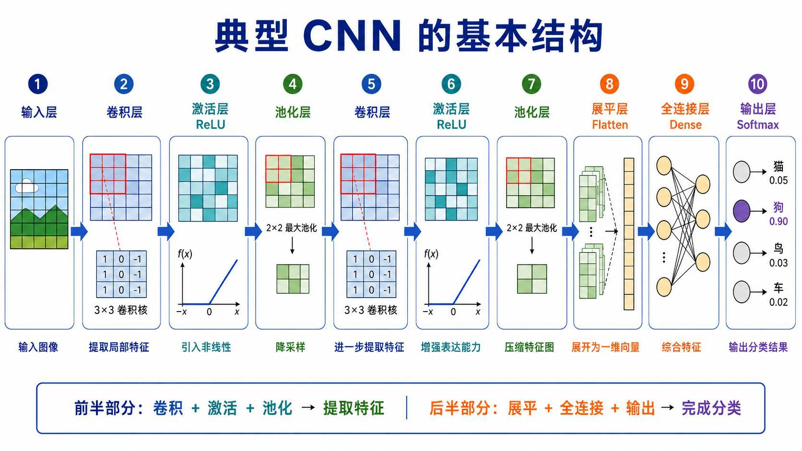
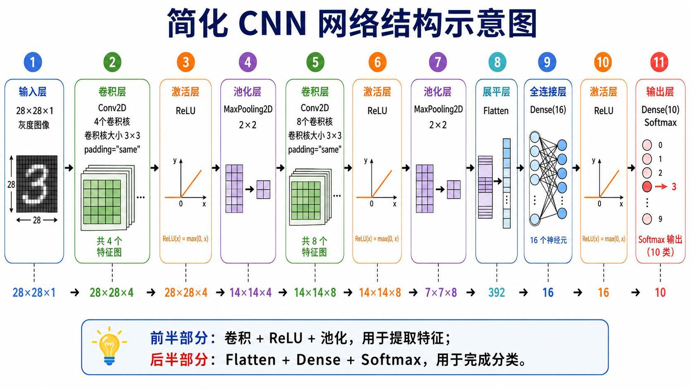
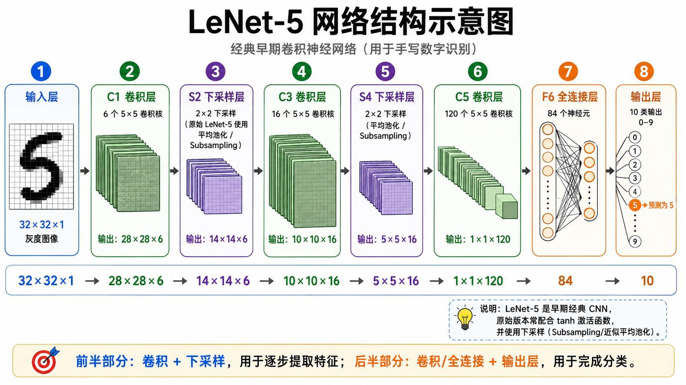
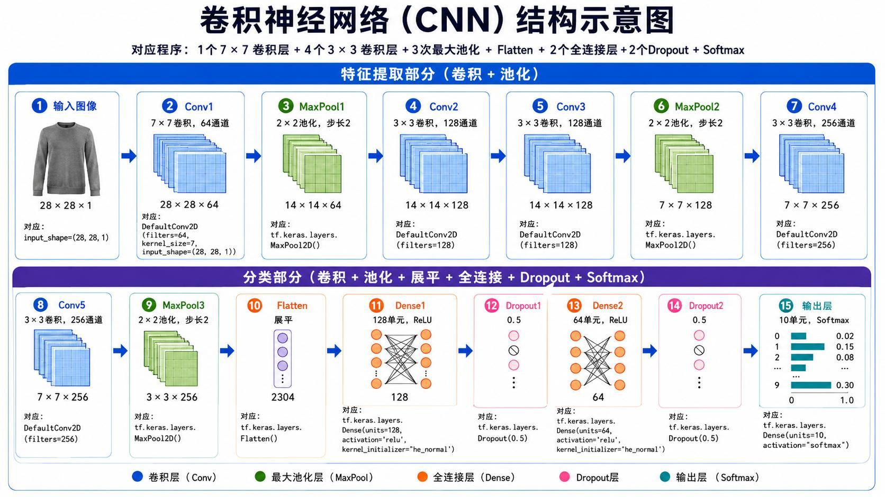

> 系列：神经网络与深度学习 · Lesson 5
> 视频主线：典型 CNN 结构 → 简化网络逐层尺寸 → 多通道卷积 → LeNet-5 → 更深 CNN → Fashion-MNIST 数据划分 → 5 epoch 简单模型 → 10 epoch 深层模型

## 视频脉络

### 理论视频

| 视频时间 | 讲解内容 |
|:---|:---|
| 00:00-03:18 | 输入、卷积、ReLU、池化、Flatten、Dense、Softmax |
| 03:18-05:25 | 第一卷积层：28×28×1 到 28×28×4 |
| 05:25-06:24 | 第一池化层：28×28×4 到 14×14×4 |
| 06:24-08:45 | 多输入通道的 3×3×4 卷积与 14×14×8 |
| 08:45-10:03 | 第二池化、Flatten 392、Dense 16 与 10 类 |
| 10:03-13:20 | LeNet-5 的 32→28→14→10→5→1 尺寸 |
| 13:20-16:42 | 64/128/256 通道深层 CNN、Dropout 和 Softmax |

### 实操视频

| 视频时间 | 讲解内容 |
|:---|:---|
| 00:00-02:29 | Fashion-MNIST 归一化、通道维与 55k/5k/10k 划分 |
| 02:29-05:08 | 用 Keras 搭建 4/8 通道简化 CNN |
| 05:08-06:52 | 配置、5 epoch 训练与约 87% 测试准确率 |
| 06:52-09:55 | DefaultConv2D 和 64/128/256 深层模型 |
| 09:55-10:46 | 10 epoch 训练与约 90% 测试准确率 |

## 1. CNN 前半提特征，后半做分类

典型 CNN：

~~~text
Input
-> Conv
-> ReLU
-> Pool
-> Conv
-> ReLU
-> Pool
-> Flatten
-> Dense
-> Output
~~~

前半部分卷积、激活和池化负责提取与压缩特征；后半部分把特征展平，通过全连接层综合并分类。

多分类使用多个输出和 Softmax；二分类可使用一个输出和 Sigmoid。

## 2. 简化 CNN 的第一层
输入 Fashion-MNIST 灰度图：

~~~text
28×28×1
~~~

第一卷积层配置：

~~~text
filters=4
kernel_size=3
padding=same
~~~

same 保持宽高，一个卷积核生成一张特征图，所以：

~~~text
28×28×1
-> 28×28×4
~~~

ReLU 只改变数值，不改变 shape。

## 3. 第一池化层让宽高减半
2×2 MaxPooling、stride=2：

~~~text
28×28×4
-> 14×14×4
~~~

通道数仍为 4，每张特征图独立池化。

## 4. 多通道输入时，卷积核也有深度
第二卷积层输入有 4 张特征图。虽然程序写 kernel_size=3，但每个输出卷积核实际跨越全部输入通道：

~~~text
kernel shape = 3×3×4
~~~

它在 4 张输入图的同一空间位置分别乘加，再合成一张输出特征图。

设置 filters=8 后：

~~~text
14×14×4
-> 14×14×8
~~~

8 个 3×3×4 卷积核产生 8 张特征图。这是本课反复解释的难点：卷积核不是只处理其中一个输入通道。

## 5. 第二池化、Flatten 与分类头
~~~text
14×14×8
-> MaxPool
-> 7×7×8
-> Flatten
-> 392
-> Dense(16)
-> ReLU
-> Dense(10)
-> Softmax
~~~

$$
7\times7\times8=392
$$

Softmax 输出 10 个服装类别概率。

## 6. LeNet-5 逐层尺寸

视频沿经典 LeNet-5 推导：

| 层 | 配置 | 输出 |
|:---|:---|:---|
| Input | 灰度图 | 32×32×1 |
| C1 | 6 个 5×5 valid 卷积 | 28×28×6 |
| S2 | 2×2 下采样 | 14×14×6 |
| C3 | 16 个 5×5 valid 卷积 | 10×10×16 |
| S4 | 2×2 下采样 | 5×5×16 |
| C5 | 120 个 5×5 卷积 | 1×1×120 |
| F6 | 全连接 | 84 |
| Output | 分类 | 10 |

原始 LeNet-5 使用 tanh 和近似平均池化的 Subsampling。本课重点是结构与尺寸，不要求照搬原始激活。

## 7. 课堂更深 CNN 的结构

课程随后给出更深模型：

~~~text
28×28×1
-> Conv 7×7, 64, same
-> 28×28×64
-> MaxPool
-> 14×14×64
-> Conv 3×3, 128, same
-> Conv 3×3, 128, same
-> MaxPool
-> 7×7×128
-> Conv 3×3, 256, same
-> Conv 3×3, 256, same
-> MaxPool
-> 3×3×256
-> Flatten 2304
-> Dense 128
-> Dropout 0.5
-> Dense 64
-> Dropout
-> Dense 10 Softmax
~~~

理论口述中有一次把第二个 256 通道输出说成 128，但前后结构和讲义都明确为 256；正文按完整网络结构记录。

## 8. Fashion-MNIST 数据准备
像素从 0-255 缩放到 0-1，并给灰度图增加通道维：

~~~text
[N,28,28]
-> [N,28,28,1]
~~~

Fashion-MNIST 原训练部分 60,000 张，课堂划分：

~~~text
train = 55,000
val   = 5,000
test  = 10,000
~~~

验证集从原训练数据最后 5,000 张取出。

## 9. Keras 中一层就是一条声明
简化模型与理论一一对应：

~~~text
Conv2D(4, 3, padding=same)
ReLU
MaxPooling2D(2)
Conv2D(8, 3, padding=same)
ReLU
MaxPooling2D(2)
Flatten
Dense(16)
ReLU
Dense(10, softmax)
~~~

老师强调，理论尺寸推导看起来复杂，但代码中每一层只需一条 Keras 声明。理论仍然重要，因为它帮助检查 model.summary 中的 shape 是否正确。

## 10. 简化模型 5 epoch 的结果
模型配置：

~~~text
loss      = cross entropy
optimizer = Adam
metric    = accuracy
epochs    = 5
~~~

视频特意说明 Keras 的 compile 更准确地理解为“配置”，不是 C 语言编译。

5 epoch 后测试准确率约 **87%**。老师认为轮数不多，仍有继续下降损失、提升准确率的空间；本段重点是跑通结构，不是追求最佳 Fashion-MNIST 结果。

## 11. 用函数封装 Conv-ReLU
更深模型定义 DefaultConv2D 小函数，封装：

~~~text
Conv2D
ReLU
He normal initialization
same padding
default kernel_size=3
~~~

首层调用时改为 kernel_size=7、filters=64，后面依次堆叠 128 和 256 通道，再加入三次池化、Flatten、Dense 和 Dropout。

Dropout=0.5 在训练时随机关闭一半激活，降低过拟合风险。

## 12. 深层模型 10 epoch 约 90%
深层模型训练 10 epoch，测试准确率约 **90%**。

这一结果比简化模型的 87% 高，但视频没有做严格控制变量实验：网络更深、训练轮数也从 5 增加到 10。因此只能说此次运行的深层配置结果更高，不能把 3 个百分点全部归因于结构深度。

## 13. 怎样使用这三个结构（理论与实操总结）

本课不是要求固定选择某一架构，而是建立三层理解：

1. 简化 CNN：看清每层和 shape；
2. LeNet-5：理解经典结构怎样逐步压缩空间；
3. 更深 CNN：学习函数封装、通道扩展、Dropout 和 Keras 组合。

真正设计网络时，需要同时检查输入大小、padding、池化次数、Flatten 维数和任务类别数。

## 本课小结

- 典型 CNN 前半提取特征，后半完成分类。
- 第一卷积层 4 个核把 28×28×1 变成 28×28×4。
- 第一池化得到 14×14×4。
- 第二层每个核实际为 3×3×4，8 个核输出 14×14×8。
- 第二池化得到 7×7×8，Flatten 为 392。
- LeNet-5 的空间尺寸为 32→28→14→10→5→1。
- 更深模型使用 64/128/256 通道与三次池化。
- Fashion-MNIST 划分为 55k 训练、5k 验证、10k 测试。
- 简化模型训练 5 epoch，测试准确率约 87%。
- 深层模型训练 10 epoch，测试准确率约 90%。
- 两组结果不能只按结构深度直接归因，因为训练轮数也不同。

## 复习题

1. CNN 的特征提取部分和分类部分分别包含哪些层？
2. 为什么 4 个卷积核输出 4 张特征图？
3. 第二卷积层的卷积核为什么是 3×3×4？
4. 7×7×8 展开后为什么是 392？
5. LeNet-5 怎样从 32×32 变到 1×1×120？
6. 原始 LeNet-5 的激活和下采样与现代写法有什么区别？
7. Fashion-MNIST 为什么需要增加通道维？
8. 5 epoch 和 10 epoch 的结果分别是多少？
9. Dropout 在深层模型中有什么作用？
10. 为什么不能把 87% 到 90% 完全归因于网络更深？

## 视频与讲义来源

- [LeNet-5 + 经典 CNN 架构：从底层原理到代码对应精讲（理论）](https://www.bilibili.com/video/BV1GSGo6JEbg)
- [LeNet-5 + 经典 CNN 架构：从底层原理到代码对应精讲（实操）](https://www.bilibili.com/video/BV1VSGo6JEjV)
- 本地讲义：2026DL_lesson5.pdf

课程与讲义作者：海归博士 Dr. 魏。本文以两段视频完整转录为主线，讲义用于核对 CNN/LeNet-5 尺寸和深层网络结构；ASR 中的卷鸡、Railu、齿化、Dance、CAN/CAA、Lanet5、Fashion Minus、APOC、黑 Normal 等已订正为卷积、ReLU、pooling、Dense、CNN、LeNet-5、Fashion-MNIST、epoch、He normal。
