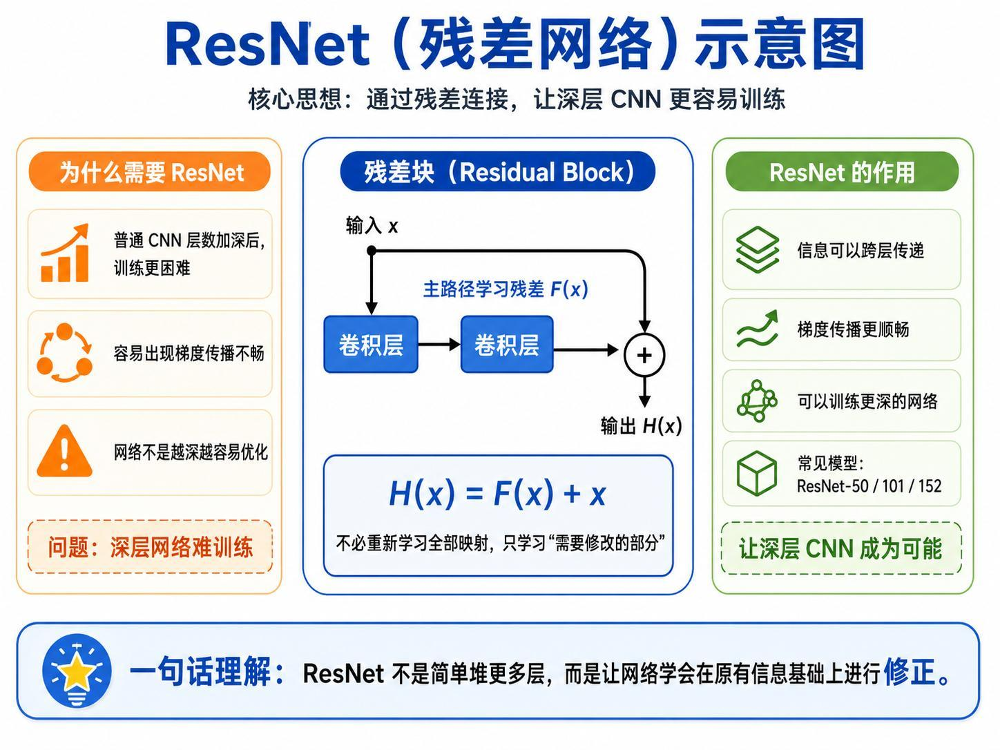
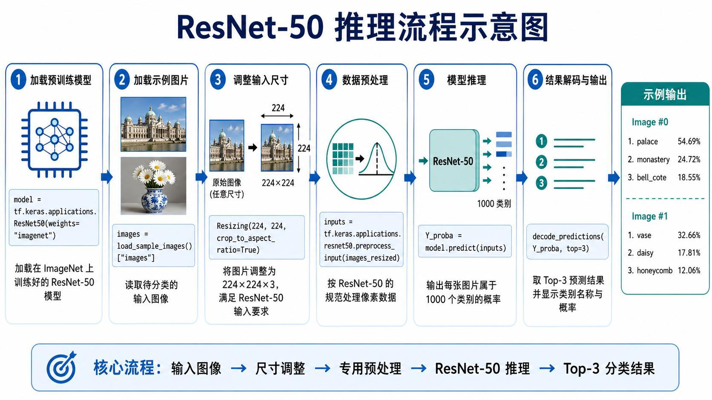
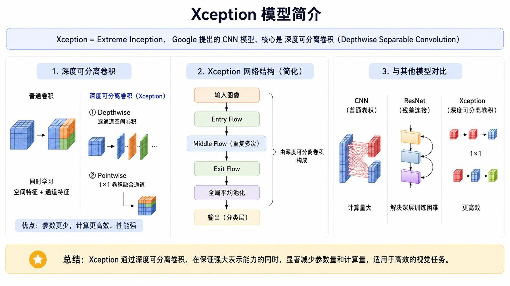
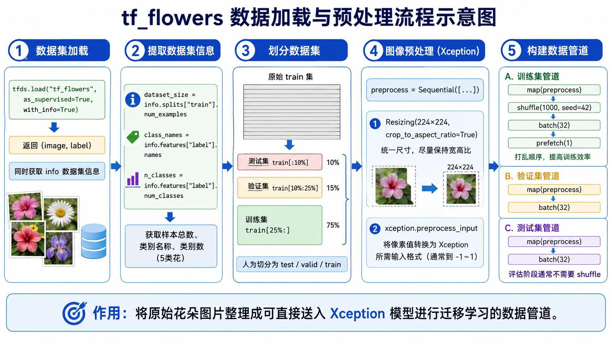
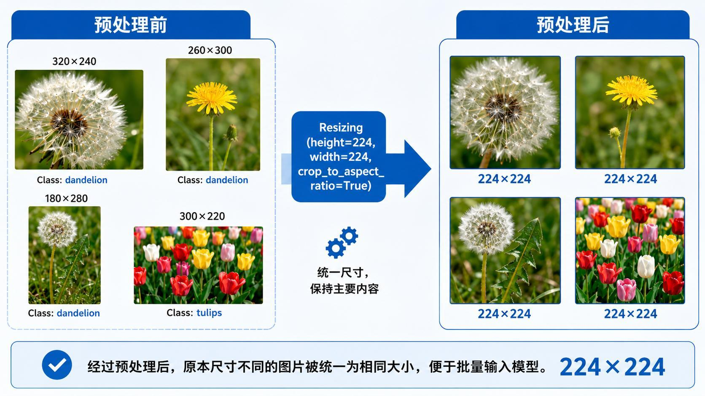
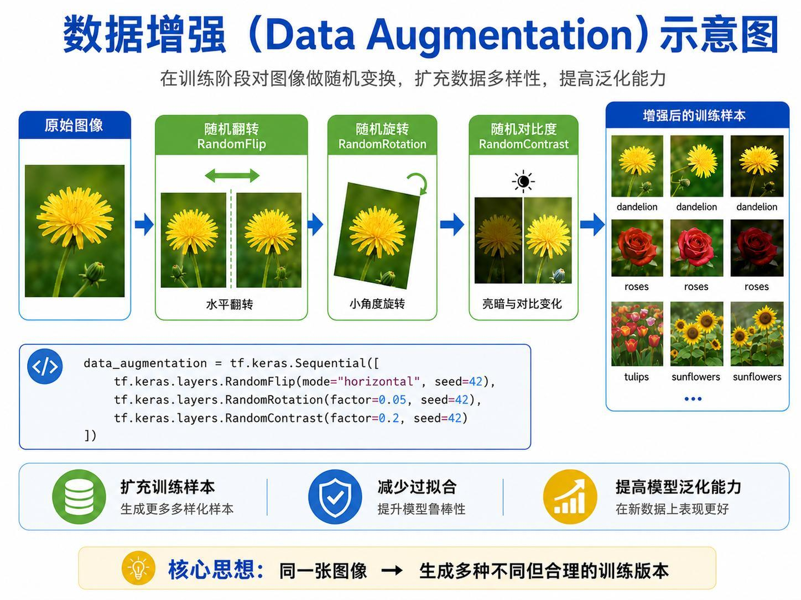
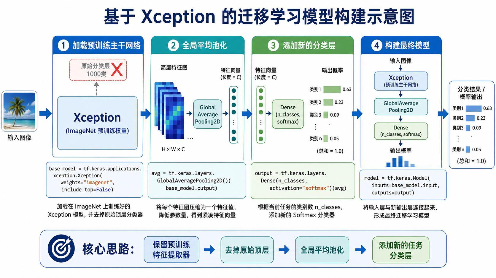
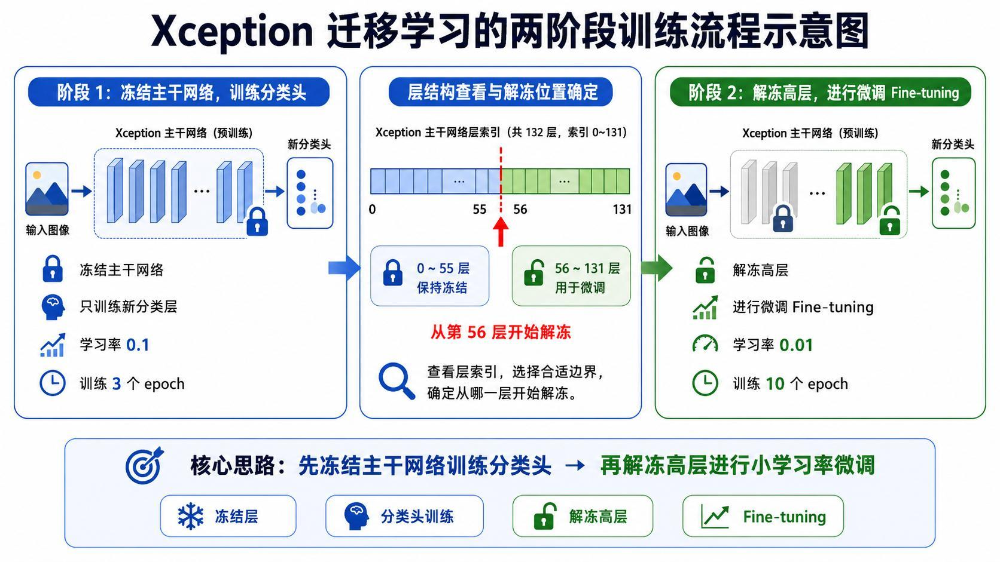
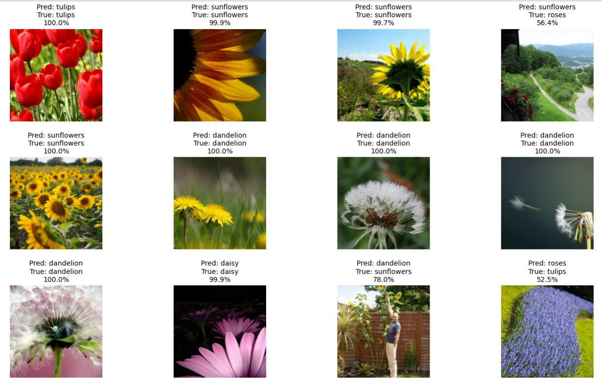
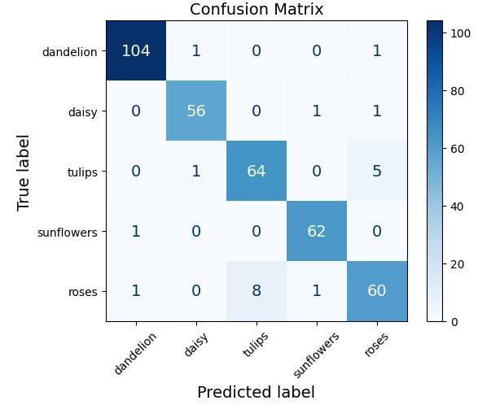

> 系列：神经网络与深度学习 · Lesson 6
> 视频主线：为什么复用预训练 CNN → ResNet 残差连接 → ImageNet 权重直接推理 → Xception 深度可分离卷积 → tf_flowers → 224 预处理与增强 → 新五分类头 → 冻结 3 epoch → 第 56 层后解冻 10 epoch → 94% 与真实错分

## 视频脉络

### 理论视频

| 视频时间 | 讲解内容 |
|:---|:---|
| 00:00-05:03 | 从零训练成本与迁移学习核心思想 |
| 05:03-07:02 | ResNet 残差块、50/101/152 层含义 |
| 07:02-09:25 | 加载 ResNet50、224 裁剪和专用预处理 |
| 09:25-12:08 | 两张示例图 Top-3 及不理想预测 |
| 12:08-14:25 | Xception 深度可分离卷积与高效模型 |
| 14:25-17:35 | tf_flowers 信息、10/15/75 划分与 pipeline |
| 17:35-19:38 | 翻转、旋转、对比度数据增强 |
| 19:38-22:40 | 去掉 1000 类头、GlobalAveragePooling 与五类 Softmax |
| 22:40-24:00 | 冻结头部训练 3 epoch、从第 56 层解冻 10 epoch |
| 24:00-28:36 | 错分样例、94% 测试准确率和混淆矩阵 |

### 实操视频

| 视频时间 | 讲解内容 |
|:---|:---|
| 00:00-02:04 | TensorFlow Windows CPU 限制与 WSL/GPU 计划 |
| 02:04-04:42 | ResNet50 权重、两张图、224 裁剪、预处理和预测 |
| 04:42-06:05 | 直接推理结果及代码来源说明 |
| 06:05-08:03 | tf_flowers 3670 张、五类和数据划分 |
| 08:03-09:34 | 224 处理、shuffle、batch、增强与新分类头 |
| 09:34-10:30 | 冻结 3 epoch、从 56 层解冻再训练 10 epoch |
| 10:30-12:24 | CPU 训练、过拟合、94% 测试、错分和混淆矩阵 |

## 1. 为什么不从零训练大型 CNN

从零训练大型视觉网络面临：

- 需要大量标注数据；
- GPU 和服务器成本高；
- 训练时间长；
- 调参困难；
- 小数据容易过拟合；
- 最终效果未必稳定。

迁移学习复用模型已经学到的边缘、纹理、形状等通用视觉能力，只用较少目标数据适配新任务。

视频用“直接雇用已经培养好的人才”类比：无需从小培养，只需针对岗位做适配。

## 2. ResNet 通过残差连接训练更深网络

普通 CNN 加深后可能出现梯度传播困难和性能退化。ResNet 不让主路径重新学习全部映射，而是学习相对输入的修正：

$$
H(x)=F(x)+x
$$

输入 x 通过短接直接传到输出，主路径只学习 F(x)。视频只要求理解这一核心思想，不展开全部 ResNet 结构。

ResNet-50、101、152 的数字主要指卷积层数量；框架打印的总层数还包括激活、归一化等其他层，因此会超过该数字。

## 3. 第一种复用：ResNet50 不训练，直接预测
流程：

~~~text
加载 ImageNet 预训练 ResNet50
-> 加载两张示例图片
-> resize/crop 到 224×224
-> ResNet50 preprocess_input
-> model.predict
-> decode_predictions Top-3
~~~

预处理必须与权重训练时一致。视频解释该函数包括通道顺序和均值等处理，调用者不必手工重复实现。

讲义记录：

| 图片 | Top-1 | Top-2 | Top-3 |
|:---|:---|:---|:---|
| Image 0 | palace 54.69% | monastery 24.71% | bell_cote 18.55% |
| Image 1 | vase 32.67% | daisy 17.82% | honeycomb 12.04% |

第一张建筑结果较合理；第二张花图被首选为 vase，老师也认为“不太对”。预训练模型可直接用，不代表对任意图片都准确。

## 4. 第二种复用：Xception 迁移到新任务

Xception 的核心是 Depthwise Separable Convolution：

1. Depthwise：每个输入通道独立做空间卷积；
2. Pointwise：再用 1×1 卷积融合通道。

相对普通卷积，它能减少参数和计算量。视频进一步联系边缘设备：嵌入式平台算力有限，高效模型更容易满足实时性。

本课不是把 Xception 直接拿来预测，而是替换分类头并训练 Flowers5。

## 5. tf_flowers 有 3670 张、5 个类别

类别：

~~~text
dandelion
daisy
tulips
sunflowers
roses
~~~

视频和实操读取到 3670 张图片。原始数据只有 train split，课堂手工切分：

~~~text
前 10%       -> test
接下来的 15% -> validation
剩余 75%     -> train
~~~

训练 pipeline 执行 preprocess、shuffle、batch(32)、prefetch；验证和测试不 shuffle。

## 6. 224×224 不是直接拉伸

原图尺寸不同。若直接强压成正方形会变形，因此使用 crop_to_aspect_ratio 一类设置：先按比例裁剪主要区域，再调整到 224×224。

Xception preprocess 将像素变换到模型需要的范围，视频描述为约 -1 到 1。

## 7. 数据增强只作用于训练

课堂增强：

- 水平翻转；
- 小角度旋转；
- 随机对比度。

增强不是凭空创造新语义，而是让同一花卉出现更多合理外观，提高泛化并减轻过拟合。验证和测试保持确定性。

## 8. 去掉 ImageNet 1000 类头，换成五分类

加载 Xception 时设置 include_top=False，删除原 1000 类输出。

高层特征为 H×W×C。GlobalAveragePooling 对每个通道的空间位置取平均：

~~~text
H×W×C
-> C 维向量
-> Dense(5, softmax)
~~~

老师用“约 2000 张特征图”做直观说明，实际维度由具体 Xception 输出通道决定。全局平均池化比直接 Flatten 更紧凑。

## 9. 两阶段训练共 13 epoch

阶段一：

~~~text
冻结 Xception 主干
只训练新分类头
3 epoch
~~~

阶段二：

~~~text
保留 0-55 层冻结
56 层及以后 trainable=True
降低学习率
再训练 10 epoch
~~~

低层通用边缘纹理不轻易改变，高层语义针对花卉任务微调。

## 10. 错分样例必须和 94% 一起看

视频逐张查看预测：

- 多张 tulips、sunflowers、dandelion、daisy 正确；
- 小面积 sunflower 被预测为 dandelion；
- roses 主体只占画面很小部分，被预测为 sunflower；
- 一张 tulip 被预测为 roses。

老师指出，有些目标在画面中很小或颜色形态相近，人也不容易判断。

测试集总体准确率约 **94%**，但总体指标不能抹掉具体错分。

## 11. 混淆矩阵说明错在哪里

讲义可见：

- dandelion 大部分正确，约 104；
- daisy 约 56 正确；
- tulips 约 64 正确，仍有若干错到 roses；
- sunflowers 约 62 正确；
- roses 约 60 正确，8 张错为 tulips，并有少量错到其他类。

Precision 按预测列观察“预测成某类的结果有多少是真的”；Recall 按真实行观察“真实某类有多少找回”。

## 12. 实操中的 ResNet50 代码路径
Windows TensorFlow 2.10 以上版本在视频环境中不能直接使用 GPU，因此本课 CPU 训练较慢。老师计划另用 WSL/Ubuntu 配置 GPU。

ResNet50 实操只需：

1. 下载/加载预训练权重；
2. 获取 sample images；
3. resize/crop 到 224；
4. preprocess_input；
5. predict；
6. decode Top-3。

权重下载较慢时，老师通过外网先下载再放入缓存目录。

## 13. 实操中的 Xception 训练和过拟合
程序再次核对 3670 张和 5 类，构建数据管道、增强、去掉 top、新增五分类头。

先冻结训练 3 epoch，再查看约 132 层的索引，从第 56 层开始解冻，继续 10 epoch。由于使用 CPU，训练明显较慢。

训练曲线显示：

- 训练误差很小；
- 验证误差较大；
- 已出现过拟合。

老师提出可加入 Early Stopping、继续降低学习率等方法，但课堂没有重新调参跑出另一组曲线。

测试准确率仍约 94%，并打印前述错分和混淆矩阵。

## 14. 两种“复用模型”不要混淆

~~~text
ResNet50:
预训练权重 -> 直接推理
没有训练

Xception:
预训练主干 -> 替换五类头
冻结训练 -> 解冻高层微调
属于迁移学习
~~~

两者都复用预训练知识，但只有第二种针对新任务更新参数。

## 本课小结

- 从零训练大型 CNN 需要数据、算力、时间和调参成本。
- ResNet 用 H(x)=F(x)+x 的残差连接改善深层训练。
- ResNet50 示例直接使用 ImageNet 权重，没有训练。
- 第二张花图 Top-1 为 vase，直接推理并非总是正确。
- Xception 用深度可分离卷积减少参数和计算。
- tf_flowers 有 3670 张、5 类，按 10%/15%/75% 划分。
- 训练图使用翻转、旋转和对比度增强。
- Xception 去掉 1000 类头，增加 GlobalAveragePooling 和五类 Softmax。
- 先冻结训练 3 epoch，从第 56 层解冻后再训练 10 epoch。
- 测试准确率约 94%，但训练/验证曲线显示过拟合。
- 小目标和相似花卉仍有错分，混淆矩阵揭示 roses/tulips 等混淆。

## 复习题

1. 为什么小数据任务更适合迁移学习？
2. ResNet 残差块计算什么？
3. ResNet50 的 50 与打印的总层数为什么不同？
4. 直接推理与迁移学习有什么区别？
5. Xception 的 Depthwise 和 Pointwise 各做什么？
6. tf_flowers 怎样划分训练、验证和测试？
7. 为什么 resize 前要保持宽高比裁剪？
8. GlobalAveragePooling 相对 Flatten 有什么特点？
9. 为什么只从第 56 层开始解冻？
10. 94% 测试准确率为什么不能证明没有过拟合？

## 视频与讲义来源

- [CNN 迁移学习实战｜ResNet50 推理 + Xception 微调，小数据也能训出 94% 准确率](https://www.bilibili.com/video/BV1pWGC6fEq7)
- [CNN 迁移学习实战｜ResNet50 推理 + Xception 微调，小数据也能训出 94% 准确率-实操](https://www.bilibili.com/video/BV1ypGC68EP2)
- 本地讲义：2026DL_lesson6.pdf

课程与讲义作者：海归博士 Dr. 魏。本文以两段视频完整转录为主线，讲义用于核对模型结构、数据划分、训练阶段、预测和混淆矩阵；ASR 中的 CNA、Resonate、recital、Exception、千疑、齿化、safo、过你河、Dizzy 等已订正为 CNN、ResNet、residual、Xception、迁移学习、pooling、shuffle、过拟合、daisy。
