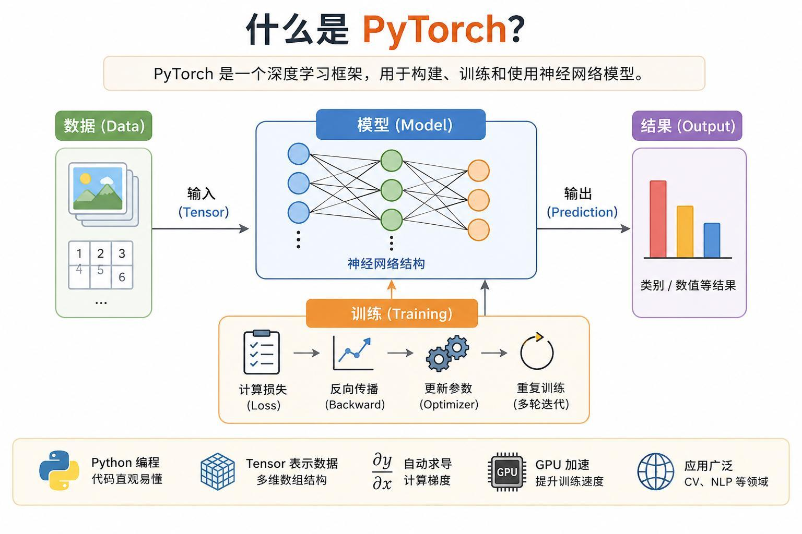
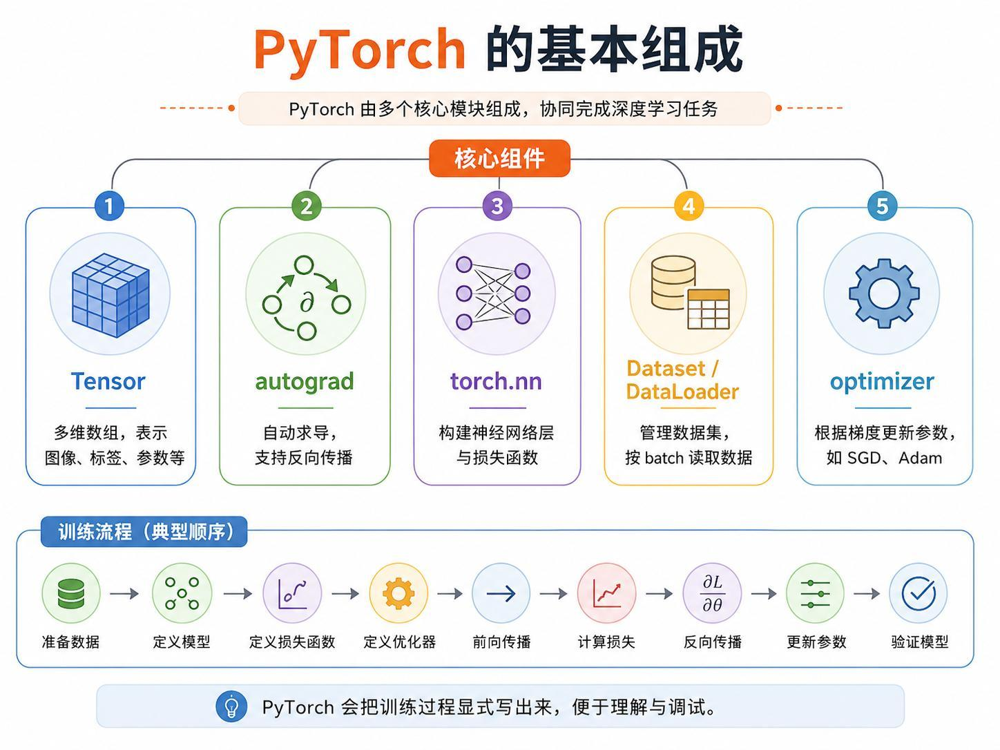
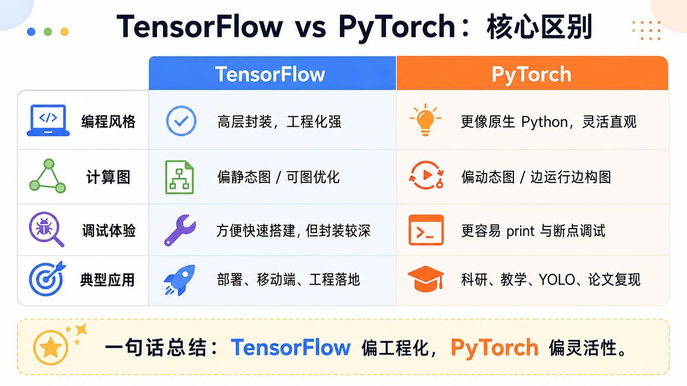
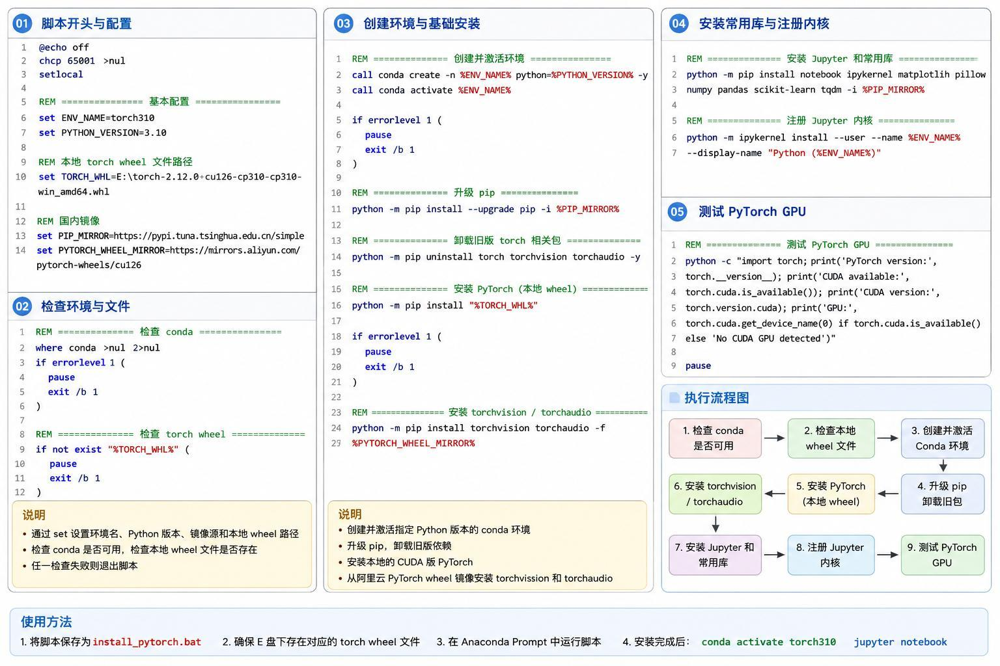
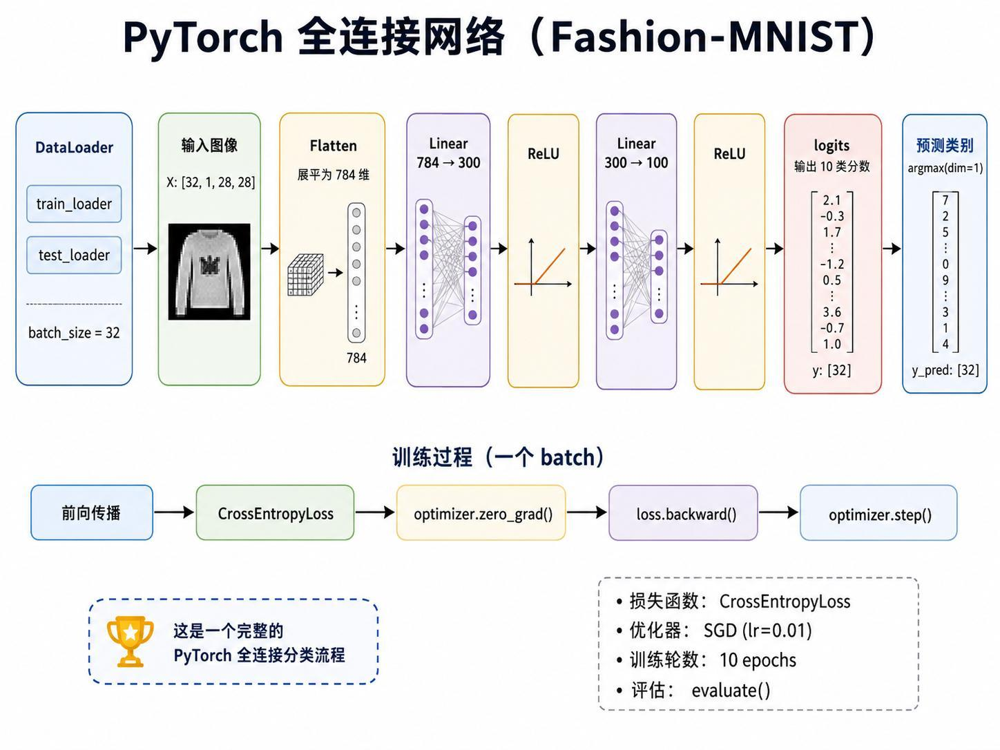
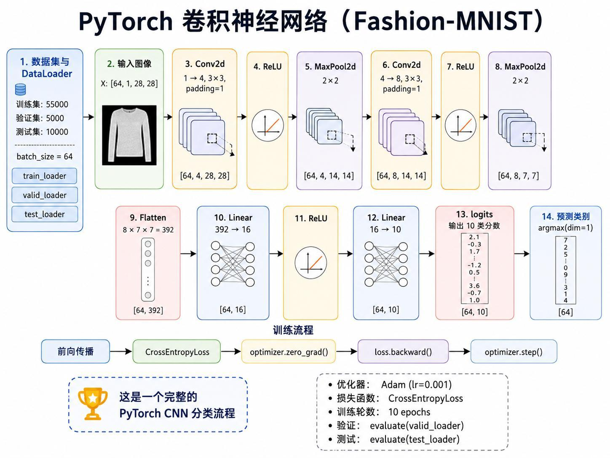
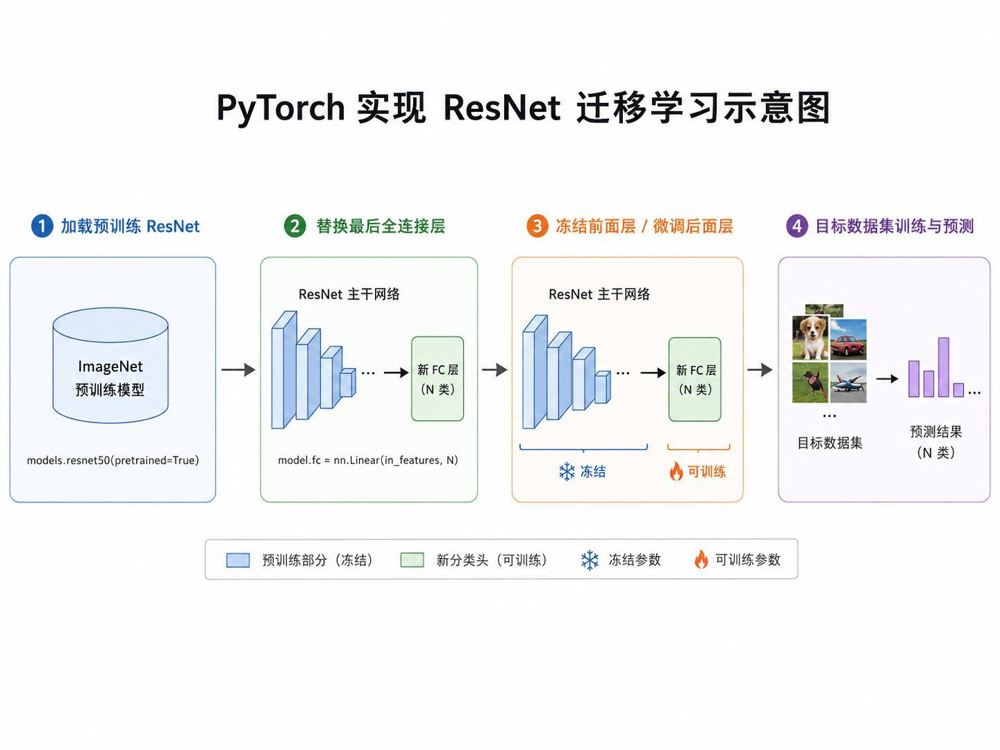
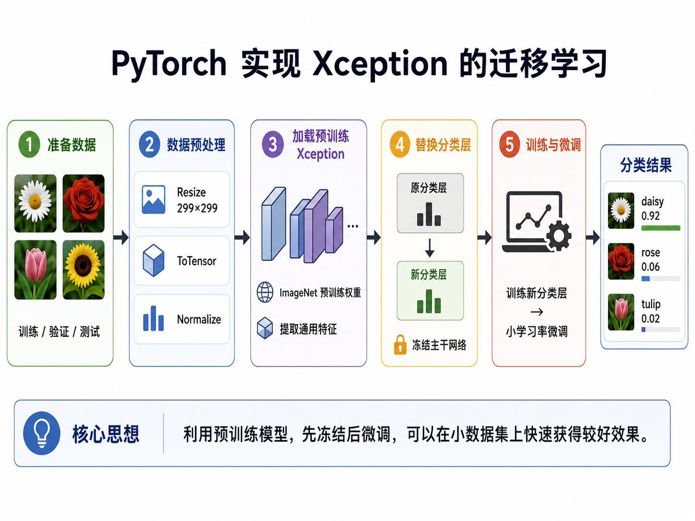

> 系列：神经网络与深度学习 · Lesson 7
> 视频主线：PyTorch 核心组件 → Windows GPU 环境 → Fashion-MNIST 全连接 → 简化 CNN → ResNet50 直接推理 → ResNet50 迁移学习 → Xception 推理与迁移学习 → AI 辅助编程边界

## 视频脉络

### 理论视频

| 视频时间 | 讲解内容 |
|:---|:---|
| 00:00-02:16 | 回顾 TensorFlow 的全连接、CNN 和迁移学习 |
| 02:16-04:58 | PyTorch、Tensor、autograd、nn、DataLoader、optimizer |
| 04:58-06:22 | 显式训练流程与 TensorFlow/PyTorch 风格差异 |
| 06:22-10:20 | 2.4 GB wheel、安装 BAT、启动脚本和 Jupyter kernel |
| 10:20-12:04 | Fashion-MNIST 784→300→100→10 全连接模型 |
| 12:04-13:40 | 1→4→8 通道简化 CNN 与 392→16→10 |
| 13:40-15:39 | ResNet50/Xception 迁移学习的冻结和微调 |

### 实操视频

| 视频时间 | 讲解内容 |
|:---|:---|
| 00:00-01:23 | PyTorch/CUDA/RTX 4060 Ti 环境 |
| 01:23-05:34 | 全连接网络、10+20 epoch、约 85%→88% |
| 05:34-08:14 | 简化 CNN、batch 64 与 10 epoch |
| 08:14-10:55 | ResNet50 直接推理、V1/V2 权重结果差异 |
| 10:55-13:29 | ResNet50 Flowers5：冻结 5、微调 10、约 93% |
| 13:29-15:02 | Xception 权重、预处理和两张图片推理 |
| 15:02-16:14 | Xception Flowers5：87%→93% 与文字错误订正 |
| 16:14-17:20 | AI 辅助生成程序和课程总结 |

## 1. PyTorch 是另一套深度学习框架

PyTorch 与 TensorFlow 都用于构建、训练和使用神经网络。本课不是从头重讲神经网络，而是把前面的全连接、CNN 和迁移学习改用 PyTorch 表达。

核心组件：

- Tensor：多维数组，表示图像、标签和参数；
- autograd：自动求导，支持反向传播；
- torch.nn：网络层和损失函数；
- Dataset/DataLoader：数据集与 batch 读取；
- optimizer：SGD、Adam 等参数更新器。

训练步骤显式写出：

~~~text
准备数据
-> 定义模型
-> 定义损失
-> 定义优化器
-> forward
-> loss
-> zero_grad
-> backward
-> step
-> evaluate
~~~

## 2. TensorFlow 与 PyTorch 的课堂比较

视频概括：

- TensorFlow 高层封装多，工程化强；
- PyTorch 更接近原生 Python，训练循环显式、调试直观；
- YOLO 和很多论文模型通常首先提供 PyTorch 实现。

这不是绝对的能力边界，而是课堂使用体验。用户拿到何种预训练生态，会影响框架选择。

## 3. 安装脚本和 2.4 GB wheel

视频环境先从镜像网站手工下载约 2.4 GB 的 PyTorch wheel，再由 BAT：

1. 创建 torch310 环境；
2. 安装本地 wheel；
3. 安装 Jupyter、NumPy、Pandas 等；
4. 注册 ipykernel；
5. 通过启动 BAT 把 Notebook 工作目录设到 E 盘。

老师建议安装脚本可让 ChatGPT 等 AI 按本机路径生成，再逐项检查。脚本只安装一次，启动脚本则每次使用。

## 4. PyTorch 全连接模型结构

输入 batch：

~~~text
[32,1,28,28]
-> Flatten
-> [32,784]
~~~

模型：

~~~text
Linear 784->300
ReLU
Linear 300->100
ReLU
Linear 100->10
~~~

输出 10 个 logits，CrossEntropyLoss 直接处理 logits 与类别标签。

## 5. PyTorch 简化 CNN

~~~text
[64,1,28,28]
-> Conv2d 1->4, 3×3, padding=1
-> ReLU
-> MaxPool 2
-> [64,4,14,14]
-> Conv2d 4->8, 3×3, padding=1
-> ReLU
-> MaxPool 2
-> [64,8,7,7]
-> Flatten 392
-> Linear 392->16
-> ReLU
-> Linear 16->10
~~~

PyTorch 的 padding=1 对 3×3 核相当于前课的 same 空间尺寸。

## 6. 迁移学习的 PyTorch 版本

通用过程：

1. 加载 ImageNet 预训练模型；
2. 用目标类别数替换最后 Linear；
3. 冻结主干，只训练新分类层；
4. 适当解冻高层；
5. 用较小学习率微调。

ResNet50 与 Xception 都可遵循这一流程，差别在模型实现、输入尺寸和预处理。

## 7. 实操环境：Windows 直接使用 CUDA
视频打印：

~~~text
PyTorch 2.12
CUDA 12.6
GPU RTX 4060 Ti
~~~

课堂环境中的 PyTorch 能在 Windows 直接调用 GPU。老师对比其 TensorFlow 2.10+ 环境需要 WSL/Ubuntu 才方便使用 GPU。

版本号按视频输出记录，不用于说明当前官方最新版本。

## 8. 全连接网络从约 85% 到 88%
Fashion-MNIST 由 DataLoader 以 batch 32、shuffle=True 读取。模型运行一次 forward 先确认 shape 和 logits 能通过，再设置 SGD 和学习率。

训练函数显式执行：

~~~text
logits=model(x)
loss=criterion(logits,y)
optimizer.zero_grad()
loss.backward()
optimizer.step()
~~~

先训练 10 epoch，准确率约 **85%**。接着又训练 20 epoch；因为沿用同一模型状态，总训练量约 30 epoch，准确率约 **88%**，同时出现轻微过拟合迹象。

后一次不是独立“20 epoch 从头训练”，而是在前 10 epoch 基础上继续。

## 9. CNN 用 batch 64 训练 10 epoch
课堂将原数据分为训练、验证和测试，batch size 改为 64。模型与理论结构一致。

先用一个 batch 做 forward 检查，再定义损失、优化器、train_one_epoch 和 evaluate，训练 10 epoch。

视频显示训练和测试损失、准确率随 epoch 输出，但本段没有明确口述一个最终数字，因此正文不补造准确率。

## 10. ResNet50 直接推理：框架结果略有差异
加载 torchvision ResNet50 权重及其配套 transforms，对上一课的建筑和花图推理，输出 Top-5。

TensorFlow 与 PyTorch 都叫 ResNet50，但权重版本、预处理和类别元数据不完全相同，因此 Top-3 顺序略有差别。建筑图仍以 palace、bell cote、monastery 等为主。

老师又切换 V1/V2 权重，候选中多出 castle 等类别。这说明必须把具体 weights 与 transforms 视为一个整体。

## 11. ResNet50 Flowers5 迁移学习
再次读取五类花卉数据，训练/验证/测试分别预处理，batch size 为 16。

训练阶段：

~~~text
冻结全部主干
替换 model.fc 为 5 类
训练 5 epoch
-> 解冻部分残差高层
再训练 10 epoch
~~~

微调后验证准确率约 **93%**。

这与上一课 TensorFlow Xception 的 94% 不是同一次实验，不能混用。

## 12. Xception 在 PyTorch 中需要额外模型实现

torchvision 本身没有课堂所用 Xception，因此需要额外安装模型库或下载实现与权重。输入按 Xception 要求 resize、normalize。

老师先用 Xception 对两张示例图直接推理，结果与 TensorFlow 版本相近但不完全一致。

## 13. Xception 迁移：87% 到 93%
Notebook 处理 Flowers5、数据增强和 DataLoader，冻结 Xception 主干，只开放最后分类层：

~~~text
冻结阶段 5 epoch -> 约 87%
解冻高层再训 10 epoch -> 约 93%
~~~

这一段现场发现一处文字或注释写成“加载 ResNet50”，老师检查实际模型和后续代码后纠正：这里使用的是 Xception。文章保留该订正，避免把两套模型混淆。

## 14. AI 写代码不等于无需理解
老师明确说明，大量示例由自己与 AI 逐步对话生成，再实际运行，将错误和结果反馈给 AI 修改。

推荐做法：

- 自己掌握任务、数据、模型和验证目标；
- 让 AI 处理重复代码；
- 每一步运行并检查；
- 不懂的代码继续追问；
- 根据自己的任务知道需要修改哪里。

“程序能跑”只是起点，模型选择、数据泄漏、指标和失败解释仍需人工把控。

## 本课小结

- PyTorch 用 Tensor、autograd、nn、DataLoader 和 optimizer 组织训练。
- PyTorch 训练循环比高层 Keras 更显式。
- 视频使用本地约 2.4 GB wheel、BAT 和 torch310 Jupyter 内核。
- 全连接模型为 784→300→100→10。
- 10 epoch 约 85%，继续 20 epoch 后总计约 30 epoch、约 88%，有轻微过拟合。
- 简化 CNN 为 1→4→8 通道、392→16→10，训练 10 epoch。
- PyTorch/TensorFlow 的 ResNet50 权重和 transforms 不同，结果可略有差异。
- ResNet50 Flowers5 冻结 5 epoch、微调 10 epoch，验证约 93%。
- Xception 需要额外实现，冻结阶段约 87%，微调后约 93%。
- Xception Notebook 中一处 ResNet50 文字错误被现场纠正。
- 课程代码大量借助 AI 生成，但仍要求逐步运行、验证和理解。

## 复习题

1. Tensor、autograd、nn、DataLoader 和 optimizer 各负责什么？
2. PyTorch 显式训练循环的五个关键调用是什么？
3. 全连接模型为什么先 Flatten 到 784？
4. 继续训练 20 epoch 为什么总量约为 30？
5. PyTorch CNN 的 padding=1 有什么作用？
6. ResNet50 不同 weights 为什么输出排序可能不同？
7. ResNet50 Flowers5 的两个训练阶段是什么？
8. Xception 为什么需要额外实现或模型库？
9. 87% 到 93% 的变化来自哪一步？
10. AI 辅助编程中哪些判断不能交给“代码能跑”代替？

## 视频与讲义来源

- [PyTorch 手把手：搭建全连接 + CNN，玩转 ResNet/Xception 迁移学习（上）](https://www.bilibili.com/video/BV1psVb6dEXE)
- [PyTorch 手把手：搭建全连接 + CNN，玩转 ResNet/Xception 迁移学习（下）](https://www.bilibili.com/video/BV1PsVb6dENi)
- 本地讲义：2026DL_lesson7.pdf

课程与讲义作者：海归博士 Dr. 魏。本文以两段视频完整转录为主线，讲义用于核对 PyTorch 组件、网络结构和迁移流程；ASR 中的 PyTouch/Partouch、TASER、AutoGridint、Gridint、Adm、Fashion Minus、CNA、Resonate、Exception、Apple 等已订正为 PyTorch、Tensor、autograd、gradient、Adam、Fashion-MNIST、CNN、ResNet、Xception、epoch。
