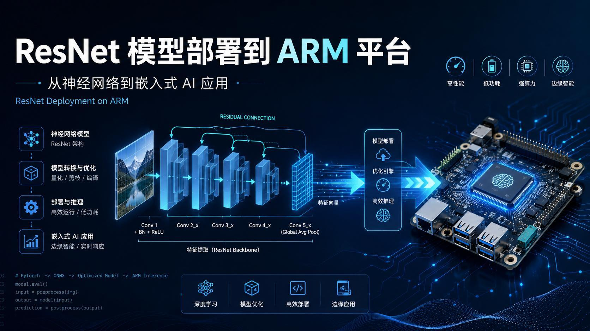
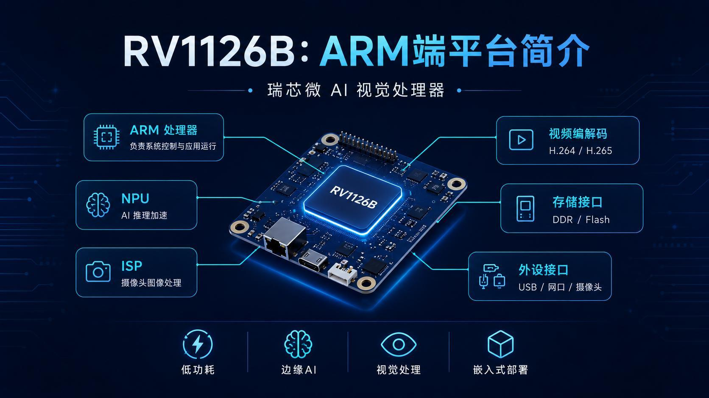
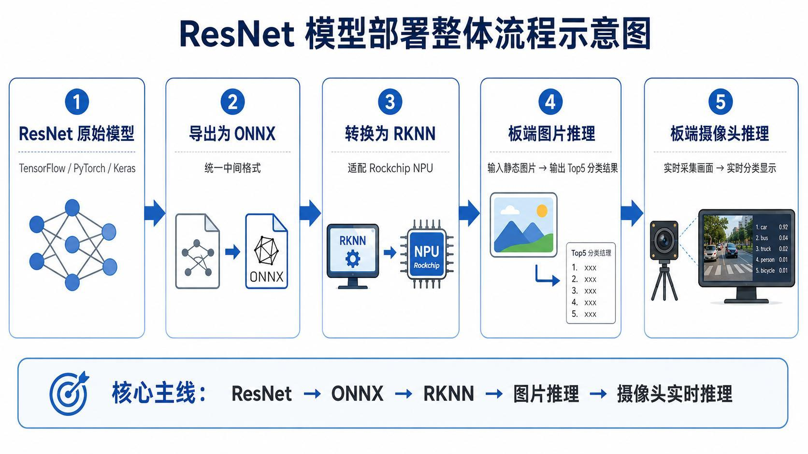
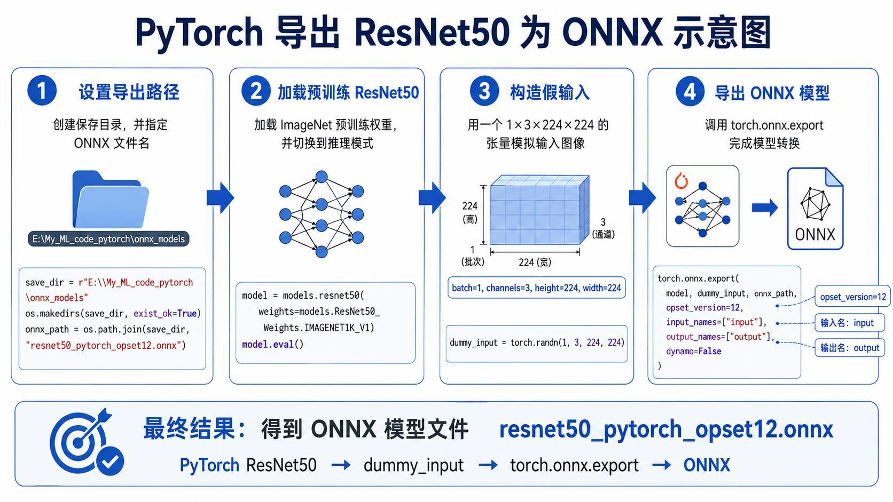
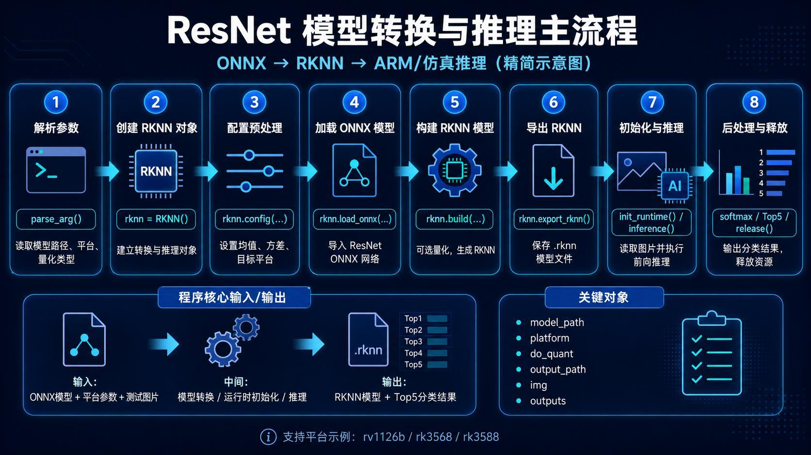
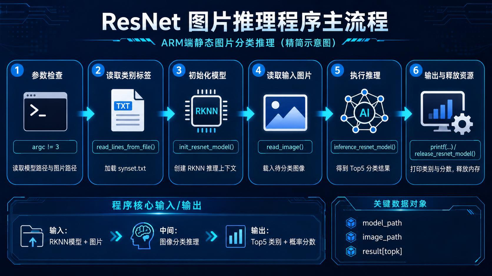
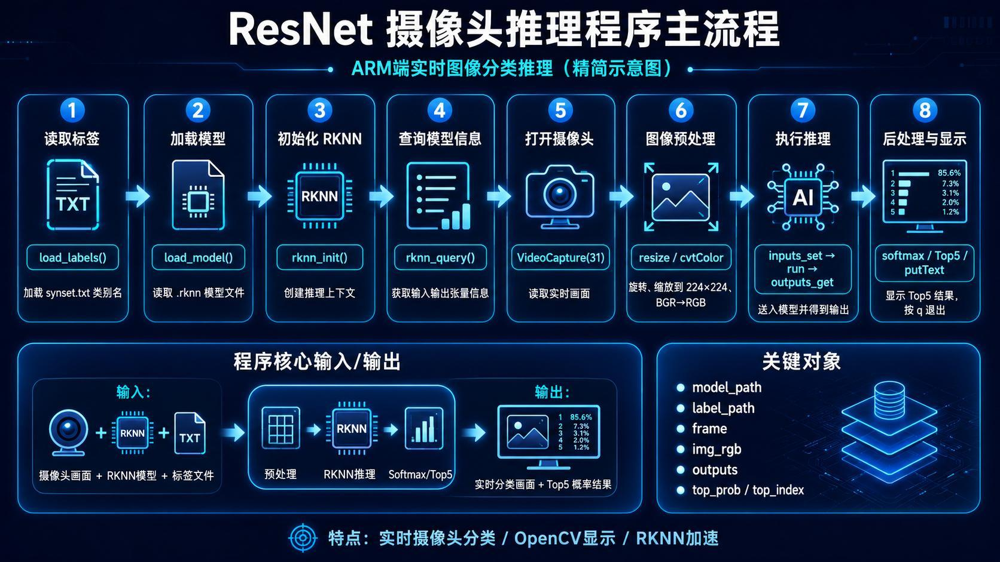
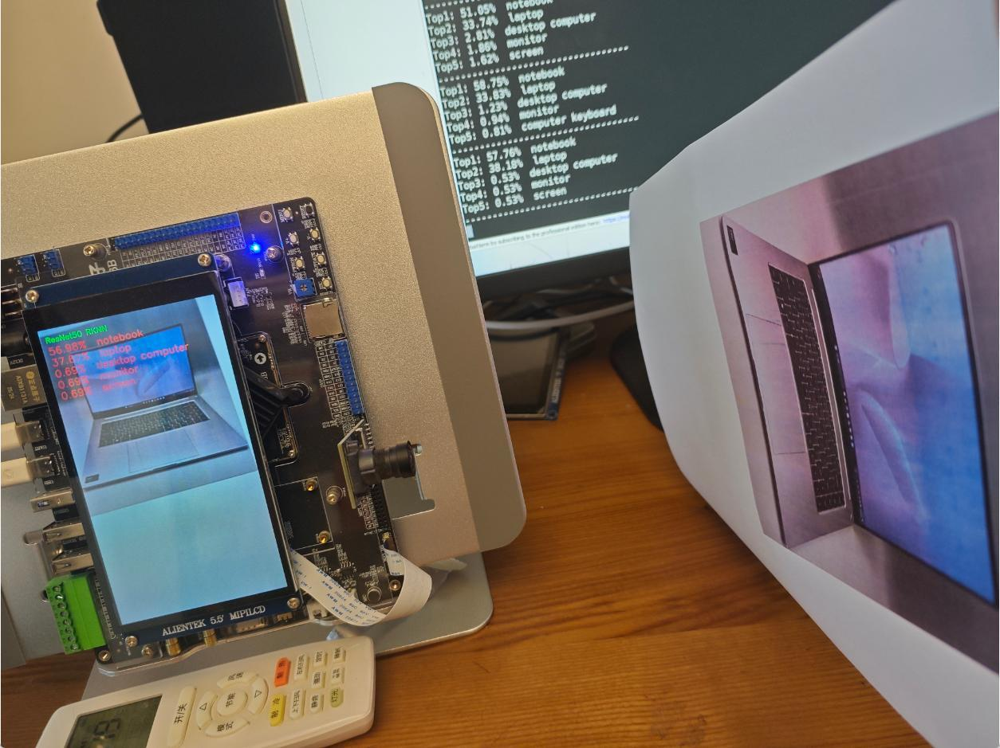
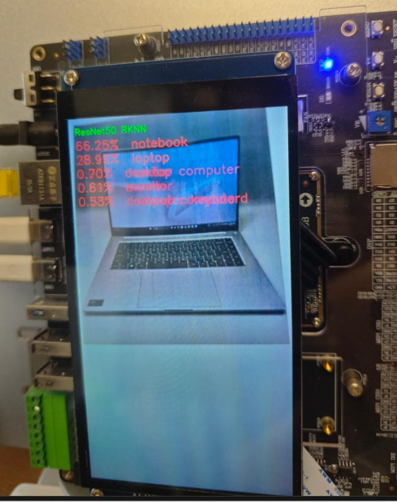

> 系列：神经网络与深度学习 · Lesson 8
> 视频主线：AI 模型从 PC 走向边缘端 → RV1126B/ARM/NPU/ISP → PyTorch ResNet50 → ONNX 对拍 → Ubuntu RKNN → C/C++ 交叉编译 → 串口/SSH/ADB → 静态图 → 摄像头及背景干扰

## 视频脉络

### 理论视频

| 视频时间 | 讲解内容 |
|:---|:---|
| 00:00-02:20 | 从 CNN/迁移学习转向 ARM 边缘部署 |
| 02:20-04:53 | ARM、边缘计算与云计算 |
| 04:53-07:55 | RV1126B 的 ARM、NPU、ISP、视频和存储接口 |
| 07:55-10:40 | PyTorch/TensorFlow→ONNX→RKNN→板端 |
| 10:40-12:30 | ResNet50、1×3×224×224 假输入与 ONNX 导出 |
| 12:30-15:10 | RKNN 配置/加载/构建/导出和 C/C++ 图片推理 |
| 15:10-16:55 | 板端 keyboard/notebook/dog 静态结果 |
| 16:55-19:50 | 摄像头逐帧推理与约 56% notebook |
| 19:50-20:59 | ARM 边缘 AI 总结 |

### 实操视频

| 视频时间 | 讲解内容 |
|:---|:---|
| 00:00-03:45 | PyTorch 安装/启动脚本和 Notebook 工程 |
| 03:45-06:12 | 导出 ONNX、随机输入、notebook 和西施犬对拍 |
| 06:12-08:08 | VMware 与 Ubuntu 虚拟机 |
| 08:08-13:45 | 工程目录清理、标签、ONNX→RKNN 和仿真测试 |
| 13:45-16:55 | C 静态推理、RV1126B/ARM64 编译 |
| 16:55-20:45 | FileZilla、串口、SSH 和板端目录 |
| 20:45-22:57 | ADB Push、dog 成功与 keyboard 文件问题 |
| 22:57-26:20 | 约 450 行摄像头程序、AI 生成、编译和发送 |
| 26:20-30:22 | keyboard 成功、laptop/花错分、近距离 notebook/dog 改善 |

## 1. 为什么模型不能只停留在 PC
课程前面已经训练和复用 CNN。本课关心模型怎样进入真实设备。

ARM 是体系架构，手机和大量嵌入式终端都使用 ARM 芯片。将推理放到现场设备：

- 延迟低；
- 不依赖持续联网；
- 原始数据不必全部上传；
- 功耗通常低于 PC/GPU；
- 可直接响应摄像头。

视频区分：

~~~text
Cloud:
边缘采集 -> 网络上传 -> 云端推理 -> 结果返回

Edge:
边缘采集 -> 本地推理 -> 直接响应
~~~

## 2. RV1126B 为什么能跑视觉模型

课堂平台为基于 Rockchip RV1126B 的 正点原子开发板。主要模块：

- ARM CPU：系统与应用控制；
- NPU：Neural Processing Unit，神经网络推理加速；
- ISP：Image Signal Processor，摄像头图像处理；
- 视频编解码：硬件处理 H.264/H.265 等；
- DDR/Flash：模型和运行数据；
- USB、网口、摄像头等外设。

视频估算开发板加屏幕和摄像头约七八百元，只作为课堂设备介绍，不是采购报价。

## 3. 格式转换主线

~~~text
PyTorch/TensorFlow 模型
-> ONNX 中间格式
-> Rockchip RKNN
-> RV1126B NPU
-> C/C++ 图片或摄像头程序
~~~

ONNX 把训练框架与部署工具解耦；RKNN 适配 Rockchip NPU。转换后的模型本身不是完整应用，还需要预处理、标签、推理调用和后处理代码。

## 4. PyTorch 导出 ResNet50 ONNX

步骤：

1. 创建输出目录；
2. 加载 ImageNet 预训练 ResNet50；
3. 设置 model.eval()；
4. 构造随机假输入；
5. 调用 torch.onnx.export。

假输入：

~~~text
[1,3,224,224]
~~~

1 是 batch，3 是 RGB 通道，224×224 是输入空间尺寸。假输入不承担分类语义，只让导出器执行一次前向路径并记录计算图。

## 5. ONNX 转 RKNN

转换脚本：

~~~text
parse args
-> RKNN()
-> config(mean/std/target)
-> load_onnx
-> build(optional quantization)
-> export_rknn
-> init_runtime / test
-> release
~~~

转换阶段在 Ubuntu 的 RKNN Toolkit 环境运行。

## 6. 静态图片 C/C++ 推理

ImageNet 有 1000 类，程序先加载标签文件。命令行参数：

~~~text
argv[1] = RKNN model path
argv[2] = image path
~~~

模型输出经 Softmax 排序，打印 Top-5。

理论展示：

- keyboard：约 82%；
- notebook computer：约 81%；
- 西施犬等具体犬种：约 94%。

ImageNet 犬种划分很细，因此输出不只是“dog”。

## 7. 摄像头推理是静态流程的循环

每秒 15/30 帧的视频本质是连续图片：

1. 打开摄像头；
2. 读取一帧；
3. 旋转、resize、颜色转换；
4. RKNN 推理；
5. Softmax 与 Top-5；
6. 屏幕显示；
7. 继续下一帧。

理论演示中，开发板与 PC 都实时显示 notebook，置信度约 56%。截图时刻不同，两端数字略有差异属正常。

## 8. 实操先在 Windows 导出并对拍
先用 BAT 安装 PyTorch 并启动指定 E 盘目录的 Jupyter。Notebook 加载 ResNet50，设置 eval，构造假输入并导出 ONNX。

导出后执行三类检查：

1. 随机输入能输出 1000 个值；
2. notebook 图片经 ONNX 推理，Top-1 约 69%；
3. 西施犬图片分别用 PyTorch 与 ONNX 推理，两者 Top-1 都约 95%。

第三项是关键对拍：同一图片、同一预处理下，PyTorch 和 ONNX 结果一致，才继续 RKNN 转换。

## 9. VMware 中的 Ubuntu 工程
VMware 让同一 PC 同时运行 Windows 和 Ubuntu。老师在终端逐层 cd/ls 进入 my_resnet 工程。

初始 model 目录只需要：

~~~text
resnet50.onnx
synset label file
test image
~~~

备课时已生成的 RKNN 和临时文件被现场删除，以便从头演示。标签记录 1000 个类别索引与名称。

## 10. RKNN 转换并先在工具环境测试
激活 Python 3.11 / RKNN Toolkit 2.3.2 环境，运行 convert，指定：

~~~text
input  = model/resnet50.onnx
target = rv1126b
~~~

脚本加载、配置、构建、导出 RKNN，并在转换环境测试西施犬图片。结果仍为西施犬，证明转换产物至少能运行。

## 11. C 程序与 AI 辅助开发
静态程序读取标签和命令行参数，调用 inference，再打印 Top-5。

老师坦言大量 C/C++ 代码由 ChatGPT 按需求分解后生成。使用方法是：

1. 将大任务拆成足够小的步骤；
2. 每次只生成一小块；
3. 立即编译或运行验证；
4. 将错误反馈给 AI；
5. 逐步组合。

这比一次要求生成数百行程序更容易定位问题。

## 12. RV1126B/ARM64 交叉编译
编译脚本指定：

~~~text
target       = RV1126B
architecture = ARM64
demo         = MyResNet
~~~

install 目录包含可执行文件、RKNN、标签和测试图片。

## 13. FileZilla、串口与 SSH
FileZilla 把 Windows 测试图片拖到 Ubuntu 工程。开发板连接包括：

- CH340/CH343 串口驱动；
- 115200 波特率；
- 无硬件流控；
- 串口终端；
- IP 192.168.0.103；
- SSH root 登录。

串口和 SSH 都能进入开发板 Linux，老师习惯使用 SSH。

## 14. ADB 上板：dog 成功，keyboard 测试出现文件问题
ADB Push 把 install 目录发送到 userdata/ai_demo。

执行 dog 图片：

~~~text
RKNN -> 西施犬
~~~

结果正确。

继续测试 keyboard 时没有得到预期输出。老师检查后认为复制的图片可能格式或文件选择有问题，并指出应该传另一份文件；课堂没有重新完成这张静态图验证，只说明整体流程。

这属于真实失败，不能用理论讲义中的成功截图替代。

## 15. 摄像头程序约 450 行
摄像头 C++ 程序：

- 加载 RKNN 和标签；
- 查询模型信息；
- OpenCV 打开摄像头；
- 设置分辨率和窗口；
- 循环读帧；
- 旋转和 resize；
- 设置输入、run、获取输出；
- Softmax、Top-5；
- 在画面和终端显示。

程序约 450 行，同样通过 ChatGPT 多轮生成与字体/显示调整。随后交叉编译并 ADB Push。

## 16. 摄像头结果受背景、距离和主体占比影响

现场逐项测试：

- keyboard：约 50%-60%，能正确识别；
- laptop 图片：有时预测 desktop computer、fire screen 等，结果不好；
- 花卉图片：出现 antelope 等明显错误；
- 把 notebook 图片贴近、减少杂乱背景后，正确识别为 notebook；
- 西施犬图片在较清晰条件下正确。

老师总结，背景越杂、主体越小或离摄像头越远，分类越容易受干扰；主体靠近、背景干净时效果更好。

本课使用的是整图 ImageNet 分类模型，它会对整个摄像头帧给一个类别，并不会自动定位屏幕中哪一块是待测图片。

## 17. 部署成功与模型准确是两件事

本课证明：

~~~text
PyTorch
-> ONNX 一致性
-> RKNN 转换
-> ARM64 编译
-> ADB 上板
-> 静态和实时推理
~~~

同时也证明，链路正确不代表摄像头每一帧分类正确。输入构图、背景和图像格式仍会显著影响结果。

## 本课小结

- ARM 边缘推理在本地处理数据，与云端往返不同。
- RV1126B 包含 ARM CPU、NPU、ISP、视频和外设模块。
- PyTorch/TensorFlow 先导出 ONNX，再转 Rockchip RKNN。
- ResNet50 导出使用 1×3×224×224 假输入。
- ONNX 随机输入有 1000 个输出。
- notebook ONNX Top-1 约 69%，西施犬 PyTorch/ONNX 都约 95%。
- RKNN 转换后在工具环境仍预测西施犬。
- 板端 dog 静态推理成功，但 keyboard 文件测试未完成。
- C/C++ 工程按 RV1126B、ARM64 交叉编译。
- 串口使用 115200，板卡 IP 示例为 192.168.0.103。
- 摄像头 keyboard、近距离 notebook/dog 较好，laptop 和花出现明显错类。
- 背景越干净、主体越大，整图分类越稳定。
- 部署链运行成功不等于模型对所有现场输入都准确。

## 复习题

1. 边缘计算与云计算的数据流有什么不同？
2. NPU 和 ISP 分别负责什么？
3. ONNX 与 RKNN 各处在部署链的哪一段？
4. 假输入为什么不需要是一张真实图片？
5. 为什么导出 ONNX 后要与 PyTorch 对拍？
6. 标签文件为什么必须随模型部署？
7. RV1126B 交叉编译需要哪些关键参数？
8. keyboard 静态测试为什么不能算成功？
9. 摄像头 laptop 和花为什么会被错误分类？
10. 为什么整图分类比目标检测更容易受背景影响？

## 视频与讲义来源

- [ResNet 部署 ARM 全流程｜PyTorch→ONNX→RKNN｜RV1126 边缘 AI（理论）](https://www.bilibili.com/video/BV1JrVd6fEH5)
- [ResNet 部署 ARM 全流程｜PyTorch→ONNX→RKNN｜RV1126 边缘 AI（实战）](https://www.bilibili.com/video/BV1J6Vd68Erg)
- 本地讲义：2026DL_lesson8.pdf

课程与讲义作者：海归博士 Dr. 魏。本文以两段视频完整转录为主线，讲义用于核对设备组成、格式转换、程序流程和结果截图；ASR 中的卷鸡/CAA、Resonate、阿姆/按摩、ONIX、RKNA、PyTouch、Wubuntu、passing、稀释犬、File Z 等已订正为 CNN、ResNet、ARM、ONNX、RKNN、PyTorch、Ubuntu、Python、西施犬、FileZilla。
