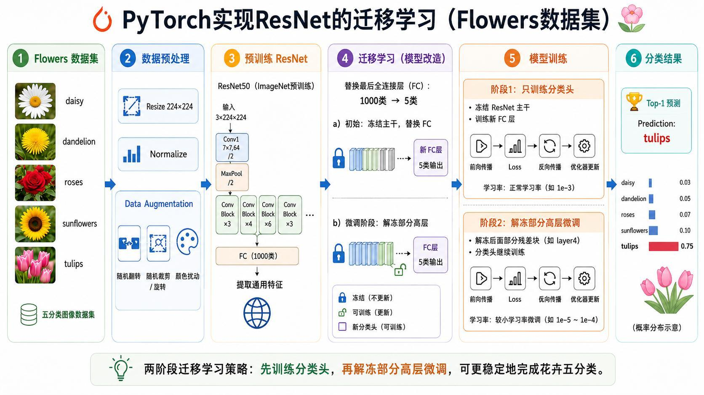
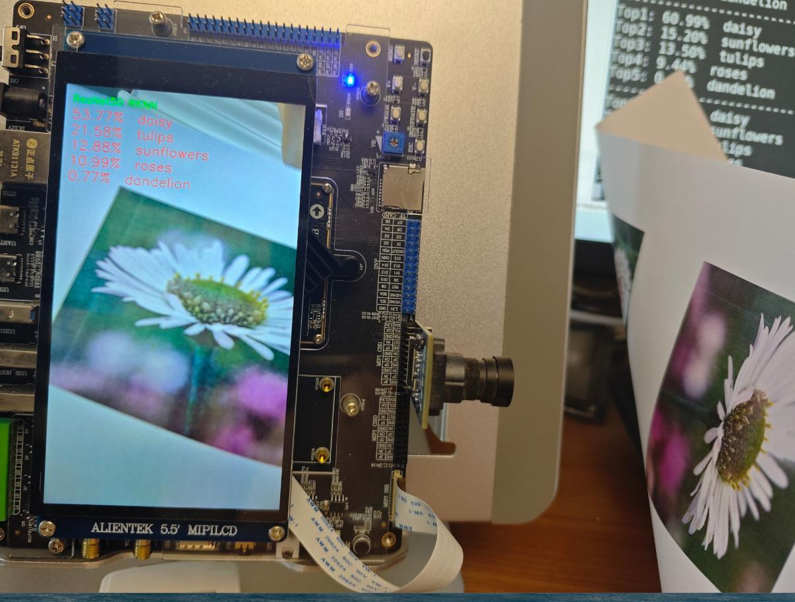
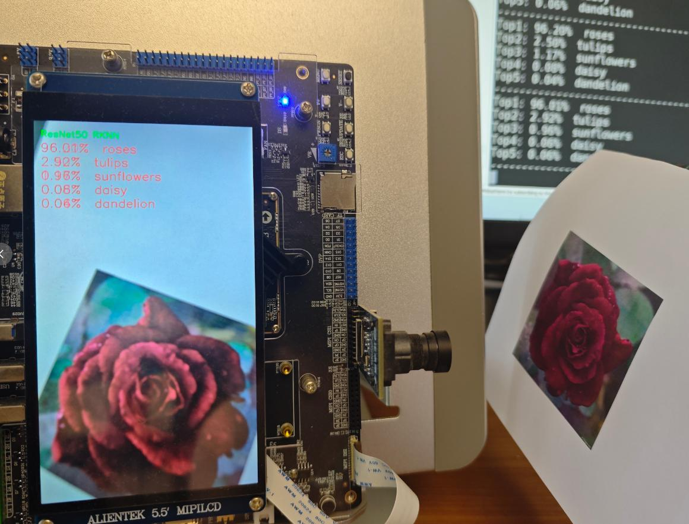
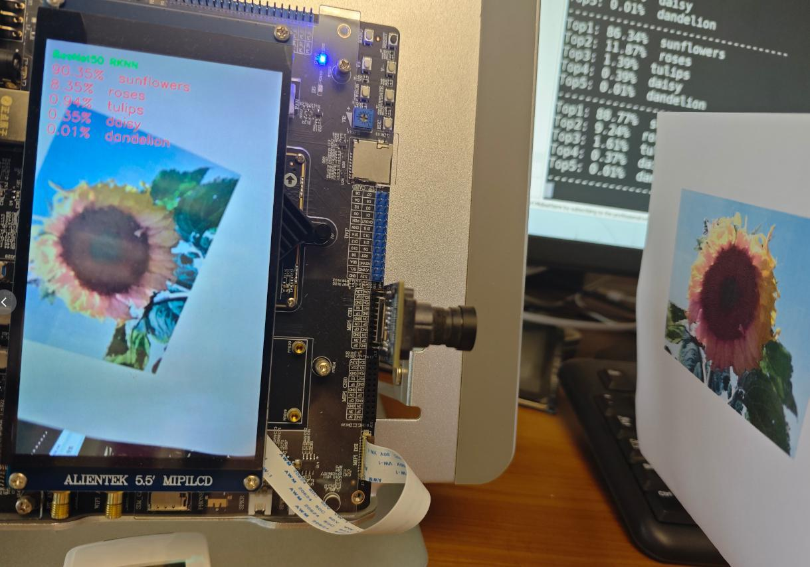
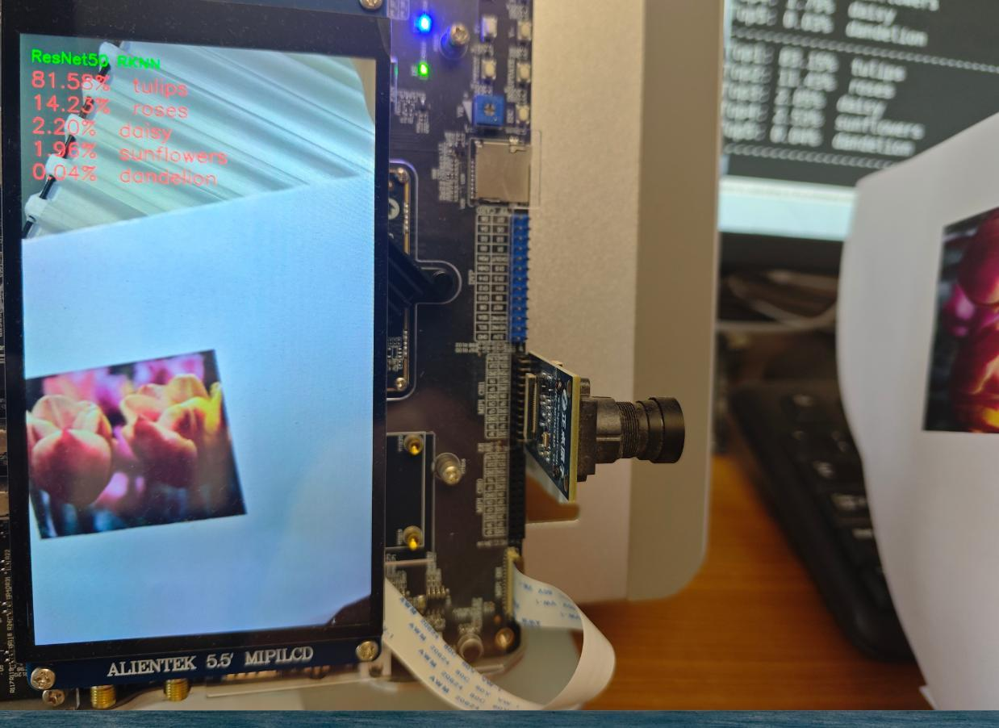

> 系列：神经网络与深度学习 · Lesson 9
> 视频主线：回顾 ResNet 部署 → Flowers5 迁移训练 → 5+5 epoch 两阶段学习 → 92% 验证准确率 → ONNX/RKNN → ADB 上板 → 静态图与摄像头实测

## 视频脉络

| 视频时间 | 讲解内容 |
|:---|:---|
| 00:00-00:42 | 回顾 Lesson 8 的 ResNet 静态图片与摄像头部署 |
| 00:42-01:25 | 本课目标、RV1126B 和边缘设备 |
| 01:25-02:14 | 五分类迁移学习：替换输出、冻结、解冻微调 |
| 02:14-03:09 | 先预览五类静态图与摄像头识别结果 |
| 03:09-03:52 | 进入工程目录，说明部署部分复用上一课 |
| 03:52-05:41 | ResNet50 两阶段训练、92% 验证准确率和 ONNX/RKNN |
| 05:41-06:51 | 模型、标签、编译产物与 ADB 发送到开发板 |
| 06:51-07:59 | 板端静态图片推理：daisy、sunflowers、tulips |
| 07:59-08:58 | 编译并启动迁移学习摄像头程序 |
| 08:58-09:44 | 摄像头逐类展示 tulips、sunflowers、daisy、roses |
| 09:44-11:05 | 迁移训练与部署关系、程序来源及课程总结 |

## 1. 本课只改变模型，不重讲整条部署链
Lesson 8 已经完成普通 ImageNet ResNet50 的两种板端推理：

- 输入一张静态图片；
- 输入摄像头连续画面。

本课沿用同一套部署办法，只把模型换成在 Flowers5 数据集上训练的迁移学习模型。老师开场就说明，后半段的 ONNX、RKNN、编译和上板流程与上一课基本相同，所以视频会把时间集中在“迁移模型怎样得到”以及“换成五分类后能否在板端正常运行”。

## 2. 目标平台与边缘部署
讲义示例使用基于 Rockchip RV1126B 的 正点原子开发板。视频把它作为 ARM 边缘设备示例，希望学习者理解如何把 PC 上训练的 AI 模型部署到低功耗开发板，而不是只停留在 Notebook 推理。

本课最终仍要验证两种输入：

~~~text
Flowers5 静态图片 -> RV1126B -> 五类概率
摄像头实时画面    -> RV1126B -> 五类概率
~~~

## 3. 五分类迁移学习的两阶段过程

预训练 ResNet50 原本输出 ImageNet 的 1000 类。本课使用五种花卉：

~~~text
daisy
dandelion
roses
sunflowers
tulips
~~~

视频对迁移学习的复习非常直接：

1. 把最后输出从 1000 类改成 5 类；
2. 冻结前面的 ResNet 主干，只训练新分类头；
3. 再解冻一部分高层，用较小幅度继续微调。

也就是先让新分类头适应 Flowers5，再让靠近输出端的高级特征稍微适应花卉图像。

## 4. 先看结果，再进入代码
老师先展示部署后的效果。静态图片和摄像头画面都包含蒲公英、郁金香、向日葵、雏菊和玫瑰，画面左上角列出 Top-5 概率。

这一段不是最终结论，而是给后续操作建立目标：训练出的五分类模型需要先转为 ONNX，再转成 RKNN，最后替换 Lesson 8 工程中的原始 ResNet 模型。

## 5. 工程目录基本复用 Lesson 8
进入工程后，老师说明示例目录与上一课几乎完全一致，主要差别就是模型文件。部署程序不需要因为“迁移学习”而重新设计：

~~~text
训练 Flowers5 模型
  -> 导出 ONNX
  -> 转换 RKNN
  -> 放入静态图/摄像头工程
  -> 编译并发送到开发板
~~~

视频没有重新逐行解释已经讲过的转换和摄像头代码，而是直接定位训练、转换和运行目录。

## 6. 训练 5 个 epoch，再微调 5 个 epoch
视频中的训练程序执行如下步骤：

~~~text
加载 Flowers5 数据
  -> 加载 ImageNet 预训练 ResNet50
  -> 把分类层从 1000 类替换为 5 类
  -> 冻结主干
  -> 训练分类头 5 个 epoch
  -> 解冻部分高层
  -> 微调 5 个 epoch
~~~

最终验证集准确率约为 **92%**。这是视频明确给出的训练结果，而不是板端某一张图片的置信度。

训练完成后保存模型，随后导出 ONNX，并先运行一次 ONNX 推理测试，确认导出模型能正常工作。

## 7. ONNX 转 RKNN
ONNX 测试通过后，进入模型转换目录，把五分类 ONNX 转为 RKNN。老师没有再次讲解全部配置，因为转换过程已在 Lesson 8 演示，本课仅核对产物：

~~~text
Flowers5 权重
Flowers5 ONNX
Flowers5 RKNN
五分类标签文件
~~~

迁移学习改变的是训练权重和输出类别；模型从 ONNX 到 RKNN 的部署路线没有改变。

## 8. 编译并通过 ADB 发送到板端
模型和标签准备好后编译板端工程。编译产物位于 install 目录，再通过 ADB 发送到开发板的用户数据目录，视频使用的目标位置是 userdata/ai_demo 一类的演示目录。

老师明确略过 ADB 细节，因为上一课已经完整讲过。这里需要抓住实际动作：

1. 编译静态图片推理程序；
2. 将可执行文件、RKNN 模型、标签和测试图片一起传到板端；
3. 进入部署目录执行程序，并指定模型和图片。

## 9. 静态图片推理逐项核对
板端先测试静态图片。老师把多张 Flowers5 图片发送到开发板，再分别执行推理：

- daisy 图片预测为 daisy；
- sunflowers 图片预测为 sunflowers；
- tulips 图片也得到正确结果。

视频的判断标准主要是 Top-1 类别是否与输入图片一致，没有在这一课重新比较 PyTorch、ONNX 和 RKNN 的逐元素误差。

## 10. 摄像头程序仍是“换模型后重新编译”
静态图片通过后，老师切换到迁移学习摄像头工程。代码流程与上一课的普通 ResNet 摄像头推理一致：

~~~text
摄像头采集
  -> 图像预处理
  -> Flowers5 RKNN 推理
  -> 显示 Top-5
~~~

程序编译后同样发送到开发板目录，再从终端启动。

## 11. 摄像头连续演示并非一张截图
摄像头前依次放置不同花卉图片：

- tulips：画面多次稳定显示为郁金香；
- sunflowers：识别为向日葵；
- daisy：识别为雏菊；
- roses：识别为玫瑰。

老师现场评价这些结果“还不错”“准确率挺高”。这只是对演示画面的观察；视频没有给出板端测试集的完整统计准确率，因此不能把单次置信度当成新的测试集指标。

## 12. 本课真正新增的是训练阶段
结尾再次强调：迁移模型与普通 ResNet 在部署部分是一模一样的，差别主要发生在训练前端：

~~~text
替换输出层
  -> 冻结主干训练分类头
  -> 解冻部分层继续训练
~~~

老师会提供完整程序，并提到这些程序是逐步借助 ChatGPT 写出的，基本能够一次运行通过；同时建议学习者仍然按步骤阅读和研究，而不是只拿结果。

本课没有重新展开所有部署代码，是因为相同内容已经在 Lesson 8 讲解。正确的学习顺序应是先掌握 Lesson 8 的通用链路，再观察本课怎样替换为自定义五分类模型。

## 本课小结

- 本课将 Flowers5 迁移学习 ResNet50 部署到 RV1126B。
- 模型输出由 ImageNet 1000 类替换为 5 类花卉。
- 先冻结主干训练分类头 5 个 epoch，再解冻部分高层微调 5 个 epoch。
- 视频给出的验证集准确率约为 92%。
- 训练模型先导出 ONNX 并测试，再转换为 RKNN。
- 部署程序、编译和 ADB 发送过程复用 Lesson 8。
- 静态图片演示中 daisy、sunflowers、tulips 均得到正确 Top-1。
- 摄像头演示继续验证 tulips、sunflowers、daisy、roses。
- 视频没有提供板端完整测试集准确率，不能把单帧置信度当成总体指标。
- 迁移学习与普通 ResNet 的部署链相同，核心差异在模型训练阶段。

## 复习题

1. 本课与 Lesson 8 的部署链有什么关系？
2. 为什么要把 ResNet50 的输出从 1000 改成 5？
3. 两阶段训练各进行了多少个 epoch？
4. 视频给出的验证集准确率是多少？
5. ONNX 导出后为什么先测试再转换 RKNN？
6. 哪些文件需要与可执行程序一起发送到开发板？
7. 静态图片和摄像头分别演示了哪些类别？
8. 为什么不能把某一帧 Top-1 置信度当成板端总体准确率？

## 视频与讲义来源

- [ResNet 迁移学习 ARM 部署实战｜Flowers5 分类 + RV1126 部署全流程](https://www.bilibili.com/video/BV1EyVd6oEHo)
- 本地讲义：2026DL_lesson9.pdf

课程与讲义作者：海归博士 Dr. 魏。本文以视频完整转录为主线，讲义用于核对 Flowers5 类别、两阶段训练、部署流程和板端截图；ASR 中的 ResNet、transfer learning、ONNX、RKNN、daisy、dandelion、roses、sunflowers、tulips、ADB 等术语已依据上下文与讲义订正。
