> 系列：神经网络与深度学习 · Lesson 10
> 视频主线：分类到检测 → YOLO 一阶段思想 → Backbone/Neck/Head → 640 预处理、三尺度输出与 NMS → Windows 图片/摄像头 → 三路 ONNX → Ubuntu RKNN → RV1126B 静态图/摄像头及错检

## 视频脉络

### 理论视频

| 视频时间 | 讲解内容 |
|:---|:---|
| 00:00-02:30 | 从 ResNet 迁移和 ARM 部署过渡到 YOLOv5 |
| 02:30-04:25 | You Only Look Once 与传统多阶段方法 |
| 04:25-06:30 | 图像分类与目标检测的差异 |
| 06:30-09:05 | Backbone、Neck、Head 和多尺度融合 |
| 09:05-12:05 | 640×640 预处理、80/40/20 三输出和 NMS |
| 12:05-14:20 | Windows 下载工程、依赖、权重和图片推理 |
| 14:20-17:30 | ONNX 中间格式及保留三路输出 |
| 17:30-19:15 | Ubuntu 中 ONNX 转 RKNN |
| 19:15-20:35 | 板端静态图片推理 |
| 20:35-21:57 | 摄像头逐帧推理和结果预览 |

### 实操视频

| 视频时间 | 讲解内容 |
|:---|:---|
| 00:00-03:01 | 工程、requirements、yolov5s 和 bus 检测 |
| 03:01-05:13 | confidence=0.25、自定义图片与半身目标 |
| 05:13-07:26 | PC 摄像头成功运行及瞬时误检 |
| 07:26-09:00 | 三路 ONNX 导出，约 28 MB |
| 09:00-13:50 | Ubuntu 虚拟机与 ONNX→RKNN |
| 13:50-18:20 | C 图片推理、RV1126B/ARM64 编译和 ADB |
| 18:20-20:45 | 板端两张静态图片检测 |
| 20:45-23:20 | 摄像头程序、OpenCV 和设备号 31 |
| 23:20-25:43 | 板端摄像头：书/键盘正确，手机错成 car |
| 25:43-26:27 | 总结 |

## 1. 从“这张图是什么”到“图里每个目标在哪里”
ResNet、Xception 等分类模型通常输出整张图片的一个类别。YOLOv5 做目标检测，一次输出多个目标：

- 边界框位置；
- 类别；
- Confidence。

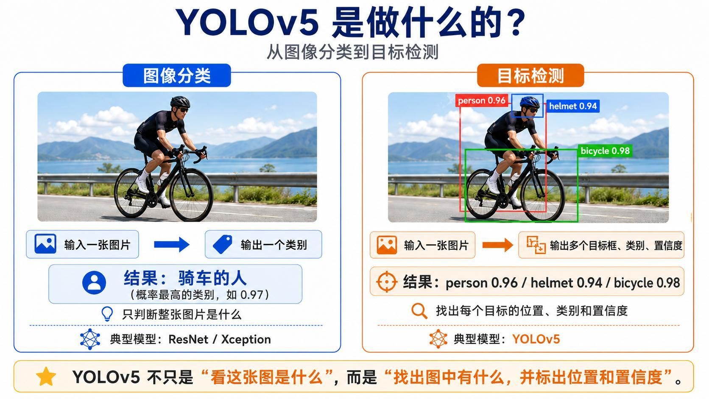

例如一张交通图片可以同时得到 person、bicycle、car、bus，而不是只给一个“街景”类别。

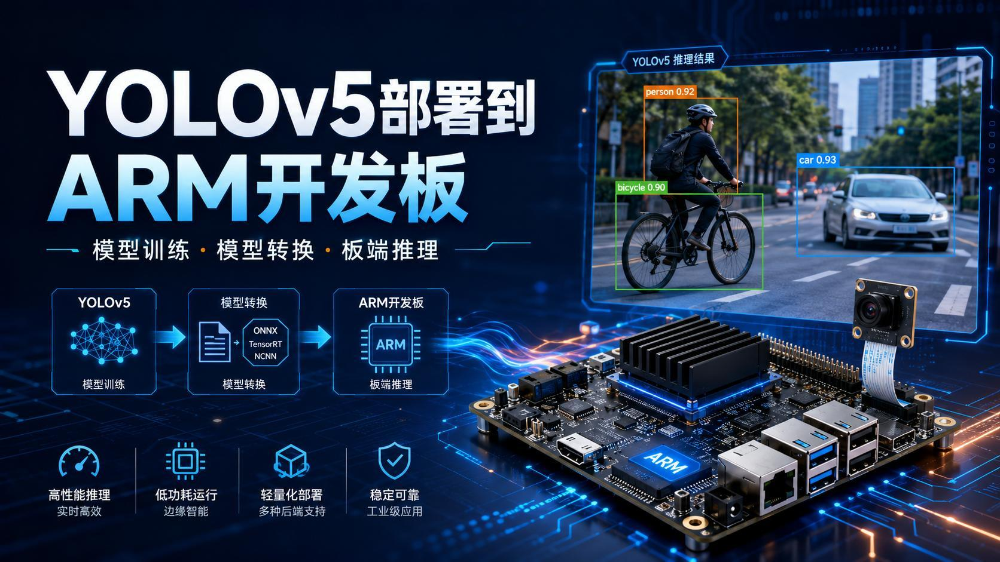

## 2. “只看一次”指一次网络前向传播
YOLO 全称 You Only Look Once。视频用技术命名历史解释：名字往往突出相对于旧方法的差别。

传统检测先生成候选区域，再逐个分类和定位；YOLO 让整张图经过一次网络前向传播，直接输出所有候选框、类别和置信度。

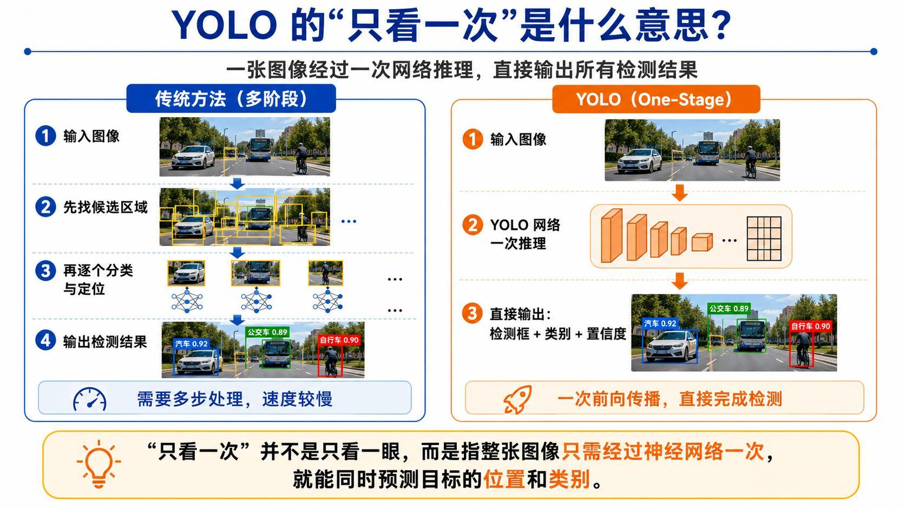

“一次”不是只处理一个目标，也不是完全没有后处理，而是核心网络不用对每个候选区域重复运行。

## 3. Backbone、Neck、Head
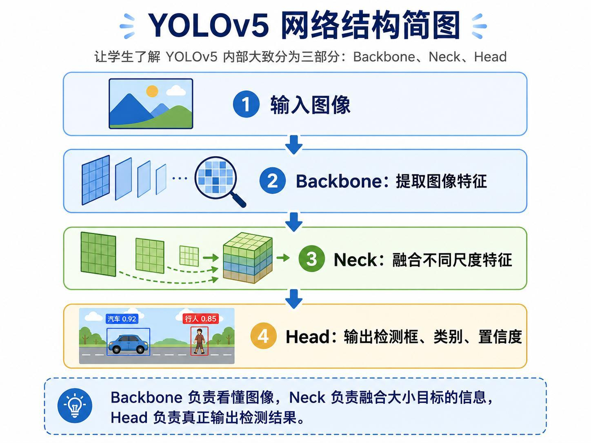

- Backbone：从边缘、纹理逐渐提取高级语义；
- Neck：融合不同分辨率特征；
- Head：预测目标框、类别和置信度。

多尺度融合同时照顾近处大目标和远处小目标。若所有特征只一路不断下采样，浅层空间细节容易丢失。

## 4. 640×640、三尺度 Head 与 NMS
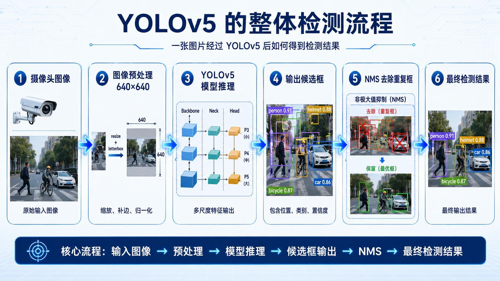

输入先 resize/letterbox 到 640×640，并执行颜色和数值预处理。YOLOv5 输出三种网格：

~~~text
80×80: stride 8，偏向小目标
40×40: stride 16，偏向中目标
20×20: stride 32，偏向大目标
~~~

网络会产生许多重叠候选框。NMS（Non-Maximum Suppression）保留高置信框，抑制与其高度重叠的较低置信框，避免同一人被画多次。

## 5. Windows 端的最小推理流程
理论视频给出的路线：

~~~text
下载/解压 YOLOv5
-> 安装 requirements
-> 检查 PyTorch GPU
-> 准备 yolov5s.pt
-> detect.py 处理 bus 图片
-> runs/detect 保存结果
~~~

老师也提供整理好的工程，降低首次上手时网络下载和依赖问题。

## 6. 为什么先导出 ONNX
PyTorch 权重不能直接交给 RV1126B NPU。视频采用：

~~~text
yolov5s.pt
-> ONNX
-> RKNN
-> RV1126B
~~~

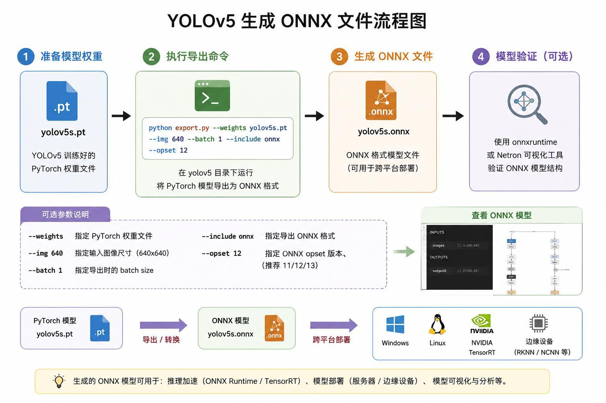

ONNX 是跨框架中间表示，RKNN 则面向 Rockchip NPU。

## 7. 板端 C 后处理需要三路原始 Head
原始 YOLOv5 Detect 层会 reshape、decode、concat，形成合并输出。课程使用的板端 C 示例希望分别接收三路特征，因此在导出包装器中截断或改写 Detect 输出：

~~~text
output 0: 80×80
output 1: 40×40
output 2: 20×20
~~~

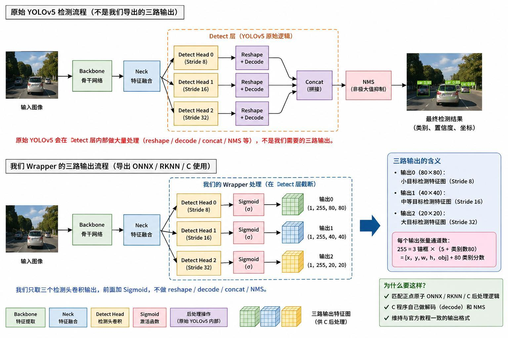

这不是改变检测任务，而是让 ONNX/RKNN 输出形式与已有 C 后处理代码匹配。

## 8. ONNX 转 RKNN
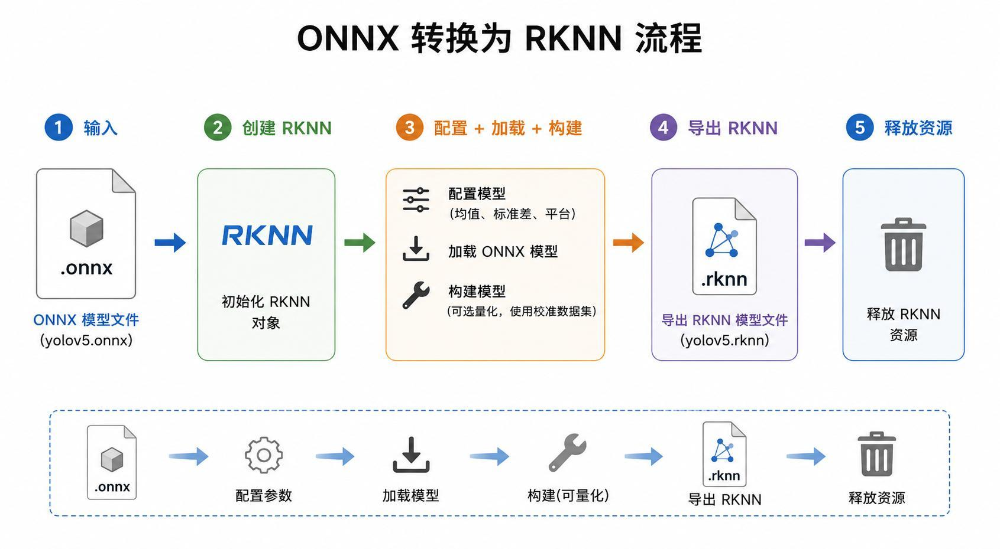

这一阶段在 Ubuntu 和 RKNN Toolkit 环境完成：

1. 创建 RKNN 对象；
2. 配置预处理和 target platform；
3. 加载 ONNX；
4. 构建，可选量化；
5. 导出 RKNN；
6. 释放资源。

详细环境安装引用课程另一套“从 ARM 到 AI 视觉”内容，本课主要建立格式转换的宏观链路。

## 9. 静态图和摄像头是同一推理核心
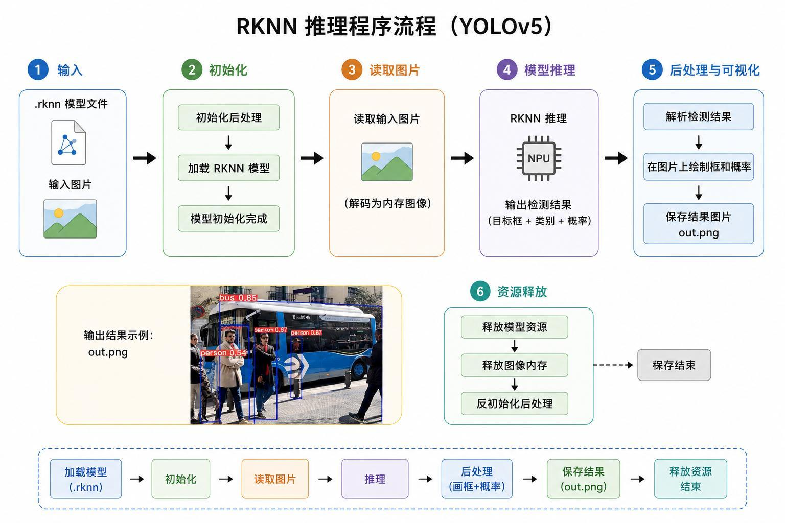

静态图流程：读取图片、预处理、NPU 推理、三路输出解码、Confidence 过滤、NMS、画框、保存。

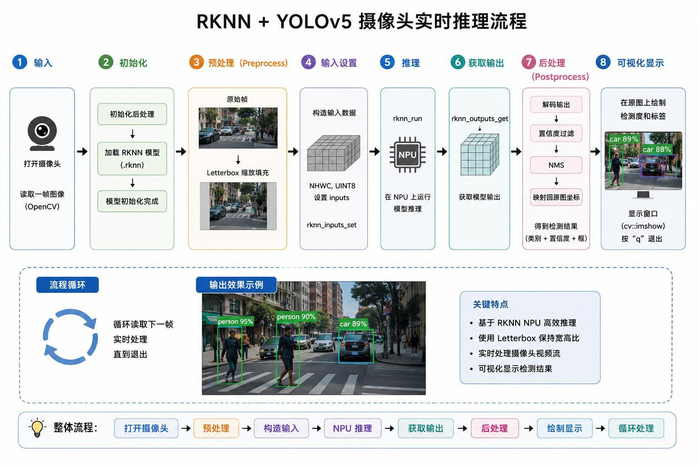

摄像头只是在外层增加循环：OpenCV 读取一帧，把它当作图片处理，显示后继续下一帧。

## 10. 实操先验证工程和依赖
老师把完整 YOLO Class 目录提供给学习者。进入后安装 requirements，检查 PyTorch，再运行 detect.py。

视频中的 yolov5s.pt 大约 14 MB，理论口述曾估为 17 MB，属于近似描述。模型对 bus 图片检测出 bus、person、car 等，结果写入 runs/detect/expN。

## 11. Confidence=0.25 的权衡
推理阈值设为 0.25：

- 调高阈值：框更可靠，但可能漏检；
- 调低阈值：召回更多，也容易出现虚警。

bus 图片中，即使画面边缘只有半个人，模型仍检测为 person。老师又换成自带测试图，motorcycle、person、bicycle 等总体识别正确。

## 12. PC 摄像头运行成功，也出现瞬时错误
老师同时使用一个录课摄像头和另一个推理摄像头，开始前不确定是否会因占用而失败，本次运行成功。

现场识别出：

- cell phone；
- person；
- book；
- chair；
- cup。

背景中短暂出现 handbag 等错误框，随后消失；部分灯具和书架没有识别。视频没有隐藏这些短暂虚警和漏检。

退出窗口时按英文输入状态下的 Q，现场第一次退出没有立即响应，随后成功结束。

## 13. 三路 ONNX 约 28 MB
Notebook 加载 YOLOv5 权重，用 Wrapper 保留三路输出而不是原始 concat 结果，再导出 ONNX。

视频显示 ONNX 文件约 28 MB，并查看模型信息。导出的 shape 和输出数量必须与板端后处理契约一致。

## 14. Ubuntu 虚拟机完成 RKNN 转换
Windows 负责 PyTorch/ONNX，Ubuntu 虚拟机运行转换工具。老师打开已有 正点原子 示例工程，进入 convert 脚本并激活虚拟环境，指定 ONNX 和 RV1126B 目标。

转换成功后 model 目录出现 RKNN 文件。

## 15. C 图片程序与交叉编译
main.c 从命令行读取：

~~~text
argv[1]: RKNN 模型
argv[2]: 输入图片
~~~

程序初始化模型、读取图像、推理、后处理并保存 out.png。

编译脚本指定：

~~~text
target       = RV1126B
architecture = ARM64
demo         = MyYOLOv5
~~~

随后把测试图片拖入 install/model，并通过 ADB Push 发送到开发板 userdata/ai_demo。

## 16. 板端静态图结果
开发板执行第一张 bus 图片后，终端打印类别、位置和置信度，再把 out.png Pull 回 PC。

第二张图片包含多人、自行车和摩托车，板端结果也能检测 person、bicycle、motorcycle。

这一阶段验证：

- RKNN 能加载；
- 输入预处理可用；
- 三路输出后处理正确；
- 坐标能映射回原图。

## 17. 摄像头工程与设备号 31
C++ 摄像头程序用 OpenCV：

1. 打开摄像头；
2. 创建窗口；
3. 在 while 循环逐帧读取；
4. 必要时旋转；
5. 预处理并调用 RKNN；
6. 解码、NMS 和画框；
7. 显示实时画面。

运行命令传入 RKNN 模型和摄像头编号 31。

## 18. 板端摄像头既有正确识别，也有错检
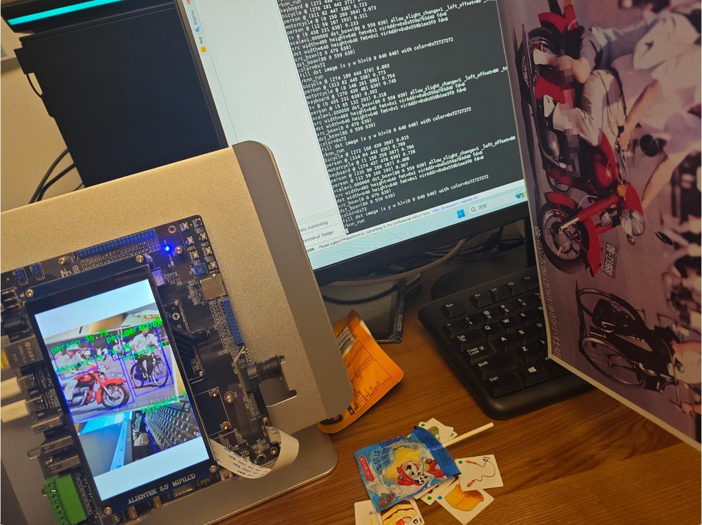

现场结果：

- keyboard 正确；
- book 正确；
- bus、person 等测试图片总体正确；
- 手机被识别成 car，属于明显错检；
- 摄像头方向和画面调整一度较乱。

老师评价整体“还不错”，但没有把手机错检删除。边缘部署成功的含义是链路能运行，并不等于每个输入都正确。

## 19. 本课闭合的工程路径
~~~text
YOLOv5 Windows 图片/摄像头
-> 三路 ONNX
-> Ubuntu RKNN
-> RV1126B ARM64 可执行程序
-> 静态图
-> 摄像头实时检测
~~~

下一课会在此基础上使用自定义 helmet/no_helmet 数据进行迁移训练。

## 本课小结

- YOLOv5 是一阶段目标检测，不是整图分类。
- Backbone 提取特征，Neck 融合尺度，Head 输出框、类别和置信度。
- 640×640 输入产生 80×80、40×40、20×20 三尺度结果。
- NMS 抑制同一目标的重复框。
- PC 推理阈值 0.25 体现 Precision/Recall 权衡。
- PC 摄像头识别出 cell phone、person、book、chair、cup，也有瞬时 handbag 虚警。
- 板端 C 后处理要求保留三路原始 Head，而不是 concat 后单输出。
- 视频中的 ONNX 约 28 MB。
- ONNX 在 Ubuntu 转成 RV1126B RKNN。
- 静态图片板端检测 person、bus、bicycle、motorcycle 总体可用。
- 摄像头程序使用 OpenCV 逐帧处理，设备号为 31。
- 板端摄像头把手机错识别成 car，说明部署成功不代表模型无误。

## 复习题

1. 图像分类与目标检测的输出有什么不同？
2. YOLO 的“只看一次”具体指什么？
3. Backbone、Neck、Head 各负责什么？
4. 80×80、40×40、20×20 分别适合什么尺度？
5. NMS 为什么需要 Confidence 和 IoU？
6. 为什么课程不直接使用原始 concat 输出？
7. ONNX 和 RKNN 在部署链中各承担什么作用？
8. PC 摄像头现场出现了哪些正确与错误结果？
9. 板端静态图片流程如何证明后处理契约正确？
10. 手机被识别成 car 说明了什么？

## 视频与讲义来源

- [YOLOv5 边缘部署，手把手实现实时目标检测（理论）](https://www.bilibili.com/video/BV1gu796mETa)
- [YOLOv5 边缘部署，手把手实现实时目标检测（实战）](https://www.bilibili.com/video/BV1ps796qECw)
- 本地讲义：2026DL_lesson10.pdf

课程与讲义作者：海归博士 Dr. 魏。本文以两段视频完整转录为主线，讲义用于核对网络结构、三尺度输出、转换流程和板端截图；ASR 中的 ULU/优努、Resonate、千亿、BASICAL、质性度、Nomeximum Suppression、ONIX、RKNA、按摩等已订正为 YOLO、ResNet、迁移学习、bicycle、置信度、Non-Maximum Suppression、ONNX、RKNN、ARM。
