> 系列：神经网络与深度学习 · Lesson 11
> 视频主线：自定义 helmet/no_helmet 任务 → LabelImg 与 YOLO 标签 → 数据统计 → 5 epoch 跑通 → 50 epoch 改善 → 300 epoch + 早停 → 指标与阈值 → ONNX/RKNN → RV1126B 静态图和摄像头实测

## 视频脉络

### 理论视频

| 视频时间 | 讲解内容 |
|:---|:---|
| 00:00-03:25 | 回顾 YOLOv5 PC/ARM 推理，引出自定义安全帽任务 |
| 03:25-06:05 | 数据集、迁移训练、ONNX/RKNN 和板端流程 |
| 06:05-10:15 | LabelImg 独立环境、安装和启动脚本 |
| 10:15-15:30 | train/val 目录、画框、YOLO TXT 与保存目录订正 |
| 15:30-18:45 | helmet.yaml 和训练命令参数 |
| 18:45-22:05 | 约 90 轮结果与混淆矩阵 |
| 22:05-24:00 | box/obj/cls loss、Precision、Recall、mAP |
| 24:00-26:31 | Confidence 曲线、PR、F1 与 0.553 阈值 |
| 26:31-28:36 | ONNX/RKNN、图片/摄像头部署和结果预览 |

### 实操视频

| 视频时间 | 讲解内容 |
|:---|:---|
| 00:00-02:40 | 工程、PyTorch/LabelImg 脚本和目录 |
| 02:40-04:10 | 230/20 张图片与 435/358 个实例统计 |
| 04:10-06:35 | 路径、RTX 4060 Ti、CUDA 12.6 和 5 epoch 冒烟训练 |
| 06:35-09:10 | 5 epoch 结果很差，50 epoch 改善但仍错检 |
| 09:10-11:50 | 300 epoch + patience=50、约 90 轮停止和 0.5 推理 |
| 11:50-13:37 | best.pt 导出 ONNX |
| 13:37-18:20 | Ubuntu 环境中 ONNX 转 RKNN，现场回查命令 |
| 18:20-21:20 | C/C++ 图片推理工程和 RV1126B/ARM64 编译 |
| 21:20-23:25 | ADB 上板、静态图推理及一个目标漏检 |
| 23:25-26:15 | 摄像头代码、BGR/RGB、设备号和二分类后处理 |
| 26:15-28:34 | 板端摄像头：反光、小目标不稳，成人与清晰图较好 |

## 1. 从通用 COCO 走向自定义安全帽任务
前一课使用 COCO 预训练 YOLOv5 在 PC 和 ARM 开发板检测 person、bus、book、TV 等固定类别。但真实工程可能需要模型从未训练过的目标，例如：

~~~text
helmet
no_helmet
~~~

因此必须收集本领域图片、画框标注，再在 YOLOv5 预训练权重上迁移训练。

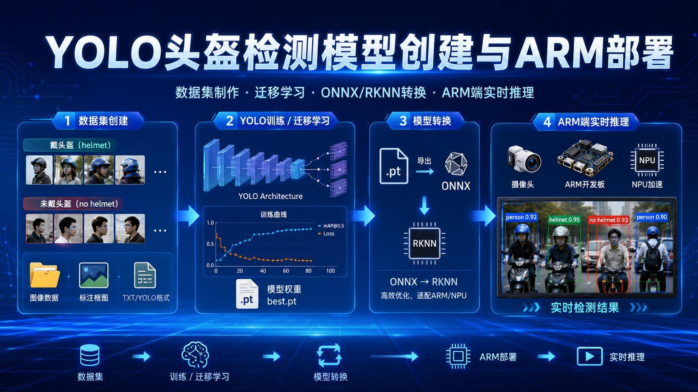

学会这一例后，任务可以替换成口罩、工服或其他自定义目标，核心流程不变。

## 2. 一条完整工程链
视频将任务分成四段：

~~~text
图片与框标注
-> YOLOv5 迁移训练
-> best.pt 导出 ONNX，再转 RKNN
-> RV1126B 静态图和摄像头推理
~~~

模型训练决定能否识别 helmet/no_helmet；转换和板端代码负责保持相同模型语义在目标设备运行。

## 3. LabelImg 使用独立虚拟环境
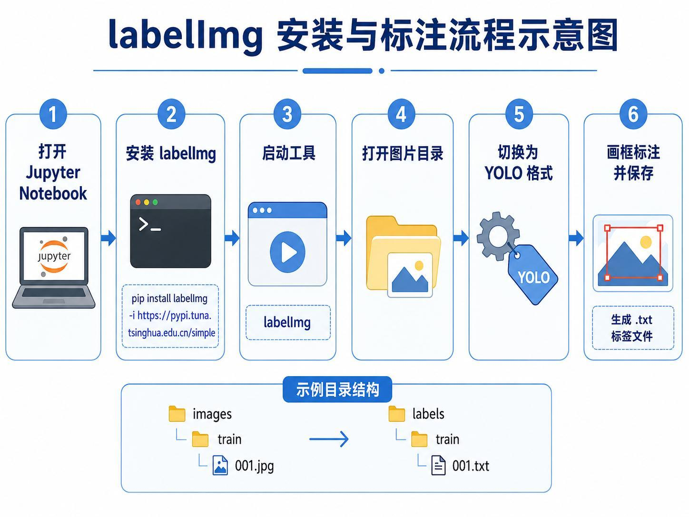

老师为 LabelImg 单独建立 Python 3.8 虚拟环境，避免与 TensorFlow、PyTorch 环境依赖冲突。流程包含：

1. 运行一次安装 BAT；
2. 每次标注时运行启动 BAT；
3. 打开图片目录；
4. 切换输出格式为 YOLO；
5. 画框、输入类别并保存。

## 4. 目录和标签文件
示例目录：

~~~text
images/
  train/
  val/
labels/
  train/
  val/
~~~

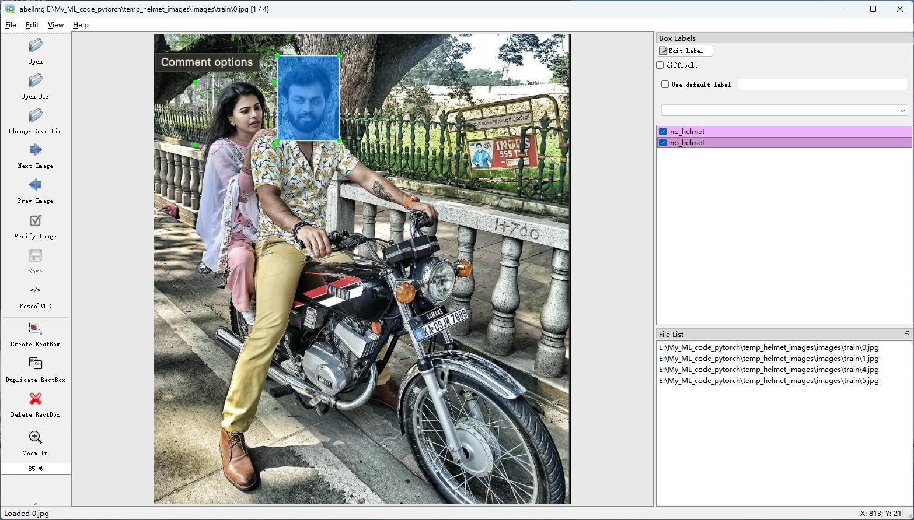

每张图片对应同名 TXT。YOLO 每行包含：

~~~text
class_id center_x center_y width height
~~~

坐标和宽高按图片尺寸归一化到 0-1。一张图片可以有多行，分别表示多个带帽或未带帽的人头。

视频现场先完成几张图后才想起 Change Save Dir，需要把标签保存目录设为 labels/train。这个遗漏会导致标签写到错误位置，因此应在开始批量标注前先设置。

类别 0/1 的先后本身不重要，但 classes 和 YAML 中的类别名称必须保持同一对应关系。

## 5. 实际数据来自已有 Helmet Dataset
老师只手工标注少量图片用于演示。完整数据有数百张，课堂直接使用 正点原子提供的数据集。视频没有声称课堂现场逐张完成全部标注。

这一区分很重要：

- 小样本演示证明会用工具；
- 完整训练使用已准备的数据；
- 自己换任务时仍要重复采集和标注。

## 6. helmet.yaml 与训练命令
YAML 指定数据根目录、train/val 路径、类别数 2 和类别名称。

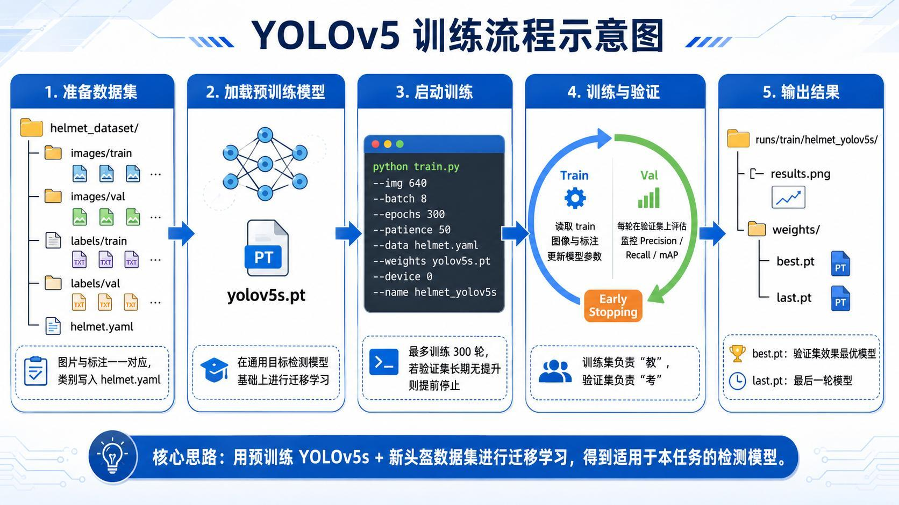

视频配置：

~~~text
img       = 640
batch     = 8
epochs    = 300
patience  = 50
data      = helmet.yaml
weights   = yolov5s.pt
device    = 0
~~~

若验证指标连续 50 个 epoch 没有提升，就提前停止。实际长训练大约运行到 90 轮左右，而不是机械完成 300 轮。

## 7. 混淆矩阵的真实结果
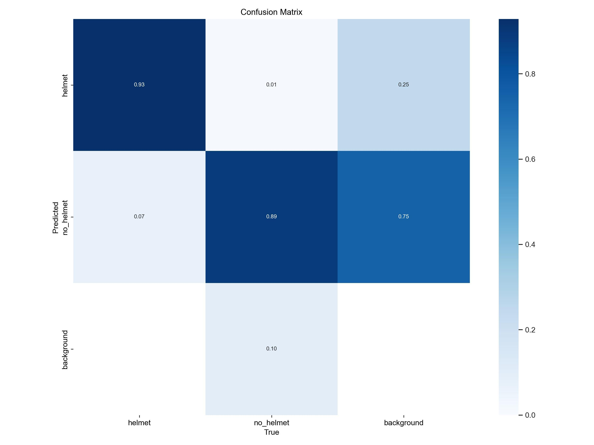

视频逐格解释：

~~~text
真实 helmet -> 预测 helmet:      0.93
真实 helmet -> 预测 no_helmet:   0.07
真实 no_helmet -> 预测 helmet:   0.01
真实 no_helmet -> 预测 no_helmet:0.89
~~~

对角线表示分类正确，非对角线表示混淆。background 行列反映漏检或把背景误判为目标。

老师在背景矩阵解释时现场有过犹豫和回看，因此正文只保留可靠含义：背景相关格不是正确 helmet/no_helmet 分类，而是检测或匹配错误。

## 8. Loss、Precision、Recall 与 mAP
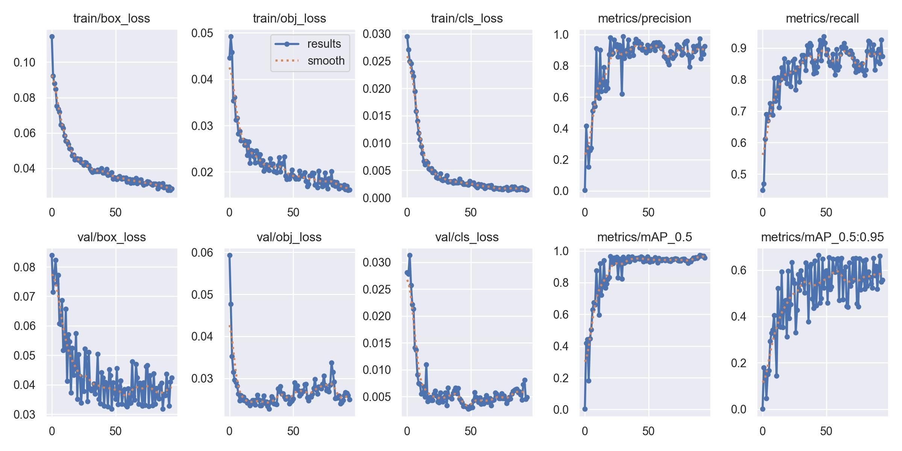

三类损失：

- box_loss：预测框位置是否准确；
- obj_loss：框内是否存在目标；
- cls_loss：目标属于 helmet 还是 no_helmet。

训练与验证损失总体下降，Precision、Recall 和 mAP 总体提高。

Precision 关注“预测为 helmet 的结果中多少是真的”；Recall 关注“所有真实 helmet 中找回了多少”。

mAP@0.5 在 IoU 阈值 0.5 下统计；mAP@0.5:0.95 汇总更严格的多个 IoU 阈值，因此数值通常更低。

## 9. Confidence 不是越高越好
提高 Confidence 阈值会减少低置信结果：

- Precision 往往提高；
- Recall 往往下降，更多真实目标被漏掉。

降低阈值则相反。

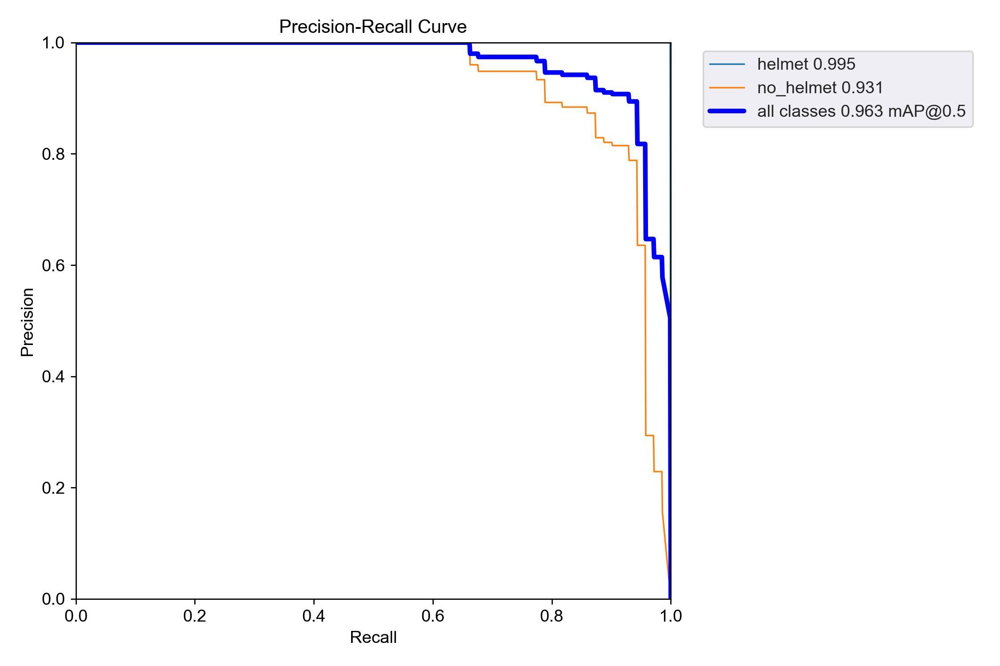

讲义给出的 PR 结果：

~~~text
helmet AP      = 0.995
no_helmet AP   = 0.931
all mAP@0.5    = 0.963
~~~

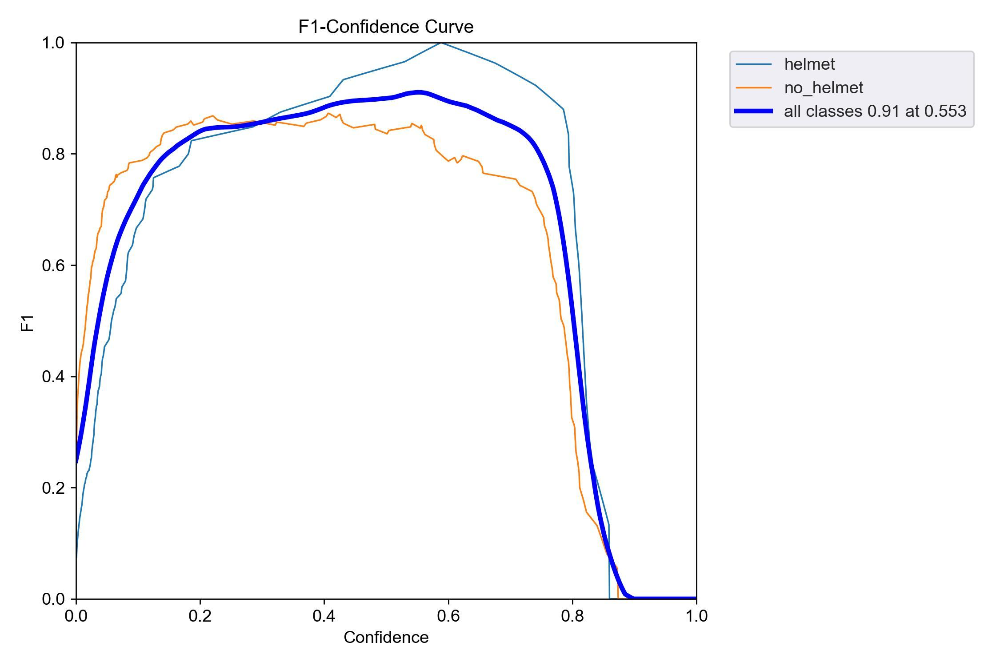

F1 综合 Precision 和 Recall，曲线在 Confidence≈0.553 时最高，约 0.91。老师因此建议推理阈值可设在 0.55 左右，实操中使用了约 0.5。

## 10. 理论结尾预览部署结果
训练权重先导出 ONNX，ONNX 再转 RKNN。板端既运行静态图片，也运行摄像头。预览中部分人正确标成 helmet/no_helmet，也有一个目标没有检测出来，视频没有把结果描述成完美。

## 11. 实操先核对数据规模
进入 PyTorch 工程后，程序统计：

~~~text
train images = 230
train labels = 230
val images   = 20
val labels   = 20
~~~

转录中老师先口述成 23，马上纠正为 230。

标签实例数：

~~~text
helmet instances    = 435
no_helmet instances = 358
~~~

实例数大于图片数，因为一张图片可以包含多个标注框。

## 12. 5 epoch 只是验证流程能跑
环境检查显示使用 RTX 4060 Ti、CUDA 12.6 和对应 PyTorch。第一次仅训练 5 个 epoch，目的不是获得可用模型，而是尽快验证：

- 路径和 YAML 正确；
- GPU 可用；
- train.py 能启动；
- runs/train 下生成权重和结果；
- detect.py 能读取权重。

5 epoch 的推理结果“乱七八糟”，明显不准。视频明确说这一步只证明流程走通。

## 13. 50 epoch 有改善，但仍有明显错检
改为 50 epoch 后结果变好，但仍把一个明显未戴头盔的人识别为 helmet。训练轮数增加带来改善，却还不足以消除错误。

这个中间结果不能从文章中删除，因为它说明模型性能是逐步形成的。

## 14. 长训练、早停和 0.5 阈值
最终配置上限 300 epoch、patience=50，训练大约在 90 轮停止。根据理论曲线，推理 Confidence 设为约 0.5。

验证图大部分识别正确，但仍出现：

- 一个人戴类似帽子的物体，被误判为 helmet；
- 一个应为 no_helmet 的目标没有框出，被当成背景；
- 其他多数 helmet/no_helmet 结果正确。

视频结论是“效果还不错”，不是零错误。

## 15. best.pt 导出三输出 ONNX
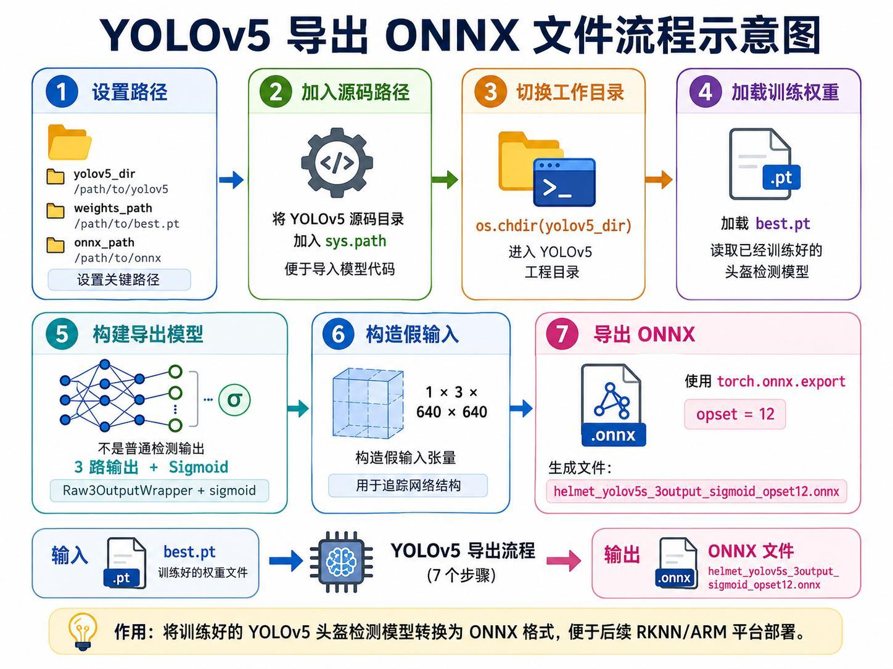

导出使用训练得到的 best.pt，构造 1×3×640×640 假输入，通过包装器导出适合后续 RKNN 后处理的三路输出，并包含 Sigmoid。

最终生成安全帽检测 ONNX。老师先做测试，再正式导出。

## 16. ONNX 转 RKNN：现场回查命令
进入 Ubuntu 虚拟机和 RKNN Toolkit 环境，将 ONNX 量化转换为 RV1126B 目标 RKNN。

老师现场一度记不清转换命令是否需要 -t 参数，随后打开以前的 YOLOv5 示例回查，确认正确调用形式后才继续。这提醒我们：

- 以工具脚本 help 和已验证示例为准；
- 不应凭记忆拼接转换参数；
- 转换目标平台必须与实际板卡一致。

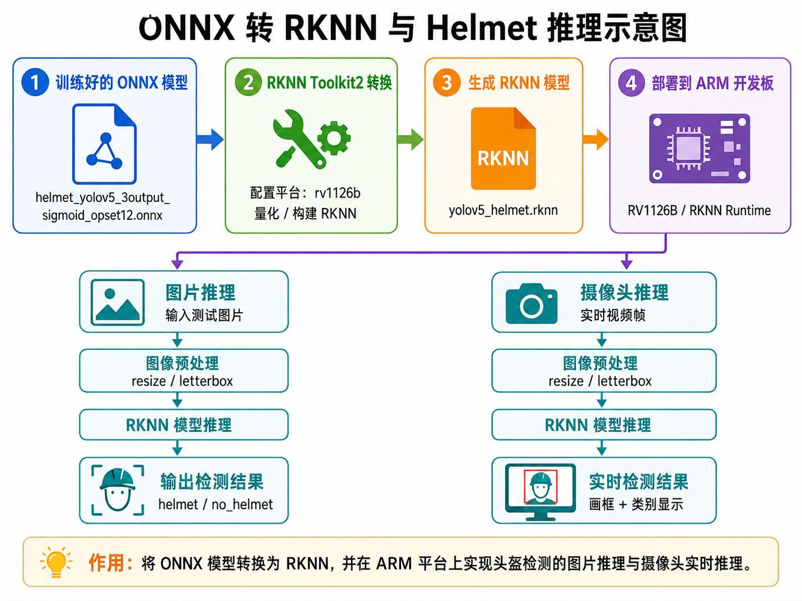

## 17. 编译板端静态图片工程
编译脚本设置：

~~~text
target = RV1126B
arch   = ARM64
demo   = My Helmet YOLOv5
~~~

编译产物包含可执行文件、RKNN 模型、两类标签和测试图片。主程序从参数读取模型和图片，完成预处理、RKNN inference、后处理和画框。

## 18. ADB 上板与静态图结果
通过 ADB 把 install 目录发送到 userdata/ai_demo，SSH/串口进入开发板后执行。

输出图片拉回 PC 查看：

- 多个 helmet/no_helmet 框正确；
- 前面的一个人没有检测出来；
- 其余目标总体可用。

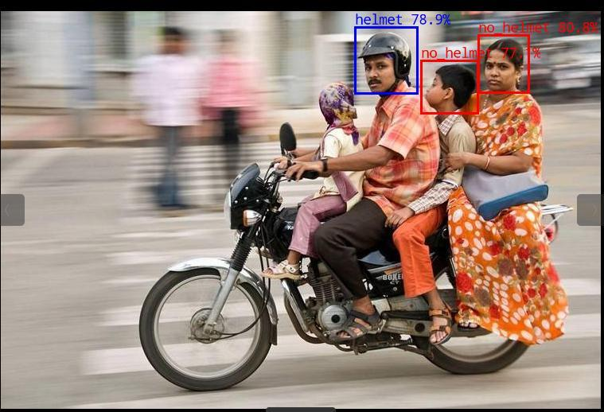

## 19. 摄像头代码的关键差异
摄像头版本使用 OpenCV 持续读取设备号 31 的视频帧。每帧需要：

1. 读取 BGR；
2. 转为模型需要的 RGB；
3. resize/letterbox；
4. RKNN 推理；
5. 二分类后处理；
6. 用不同颜色绘制 helmet 与 no_helmet；
7. 显示窗口。

原通用 YOLOv5 后处理按 80 类设计，本课需要改成 2 类标签。

## 20. 板端摄像头结果有环境限制
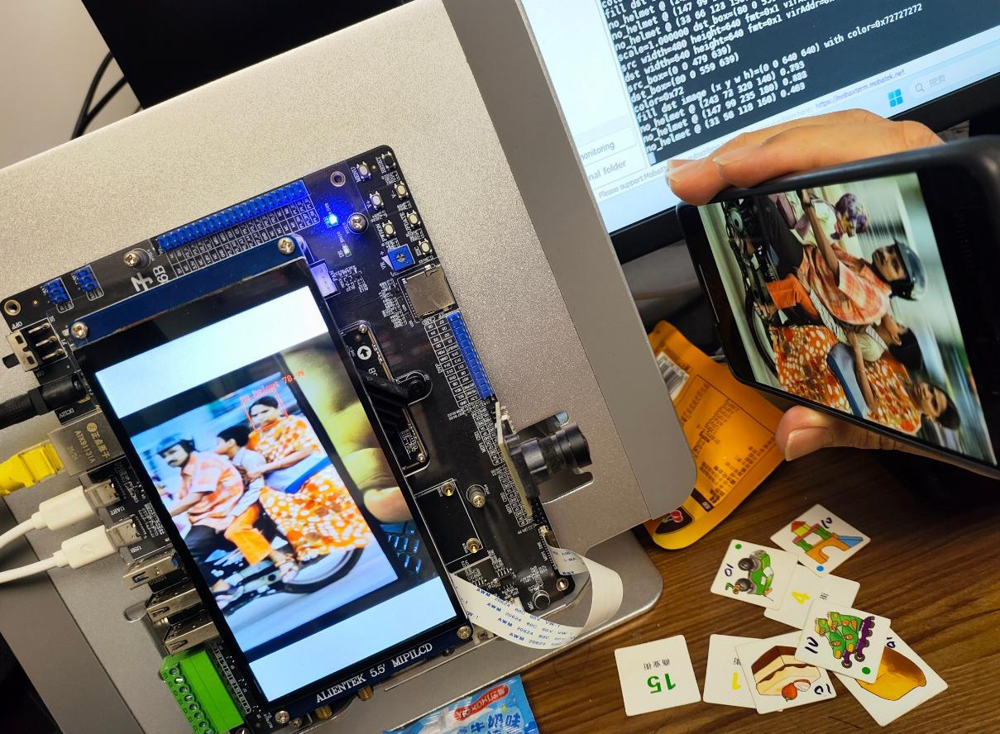

老师把手机或屏幕中的安全帽图片放到摄像头前：

- 清晰的成年人和较大目标通常能正确识别；
- 两个较小儿童目标有时识别、有时消失；
- 屏幕与碗有反光；
- 摄像头画质不如原始静态图片；
- 目标尺寸小也会降低稳定性。

后续几张较清晰样例大多识别正确。视频据此评价整体效果尚可，同时明确展示了小目标、反光和二次拍摄造成的不稳定。

## 本课小结

- 自定义安全帽检测需要 helmet/no_helmet 图片和框标注。
- LabelImg 应切换 YOLO 格式并预先设置 Change Save Dir。
- YOLO TXT 使用 class、中心坐标、宽和高，几何量归一化。
- 实操数据为 230 张训练图、20 张验证图，包含 435/358 个两类实例。
- 训练配置为 640、batch 8、上限 300 epoch、patience 50。
- 5 epoch 只跑通流程，结果很差；50 epoch 改善但仍错检。
- 长训练大约 90 轮早停，结果多数正确但仍有误检和漏检。
- 混淆矩阵对角线约为 helmet 0.93、no_helmet 0.89。
- PR 曲线给出 all mAP@0.5≈0.963，F1 在阈值 0.553 附近最高。
- best.pt 导出 ONNX，再量化为 RV1126B RKNN。
- 转换命令现场通过旧示例回查，未凭记忆继续。
- 板端静态图仍漏掉一个目标。
- 摄像头对反光、小目标和二次拍摄较敏感，结果并非始终稳定。

## 复习题

1. 为什么 COCO 预训练模型不能直接解决安全帽二分类？
2. YOLO 标签一行五个字段分别是什么？
3. Change Save Dir 忘记设置会造成什么问题？
4. 图片数与标注实例数为什么不同？
5. 为什么先训练 5 个 epoch？
6. 50 epoch 的哪类错误仍然存在？
7. Precision 和 Recall 如何随 Confidence 阈值变化？
8. 为什么选择约 0.55 的阈值？
9. best.pt 到 RV1126B 经历哪些格式转换？
10. 摄像头结果为什么比原始静态图片不稳定？

## 视频与讲义来源

- [YOLOv5 安全帽检测全流程｜从数据集标注→训练→ONNX→RKNN 部署 ARM 开发板（理论）](https://www.bilibili.com/video/BV17UEF6LEMt)
- [YOLOv5 安全帽检测全流程｜从数据集标注→训练→ONNX→RKNN 部署 ARM 开发板（实战）](https://www.bilibili.com/video/BV1F6EF6DEqG)
- 本地讲义：2026DL_lesson11.pdf

课程与讲义作者：海归博士 Dr. 魏。本文以两段视频完整转录为主线，讲义用于核对标注格式、参数、指标曲线、导出与板端截图；ASR 中的幽露/ULV5、Image Label、压抹、Apple、conference、ONIX、RKAA、AMM、签入式等已订正为 YOLOv5、LabelImg、YAML、epoch、confidence、ONNX、RKNN、ARM、嵌入式。
