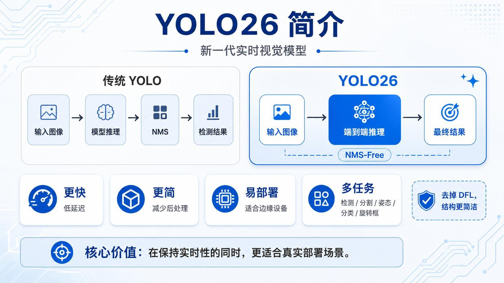
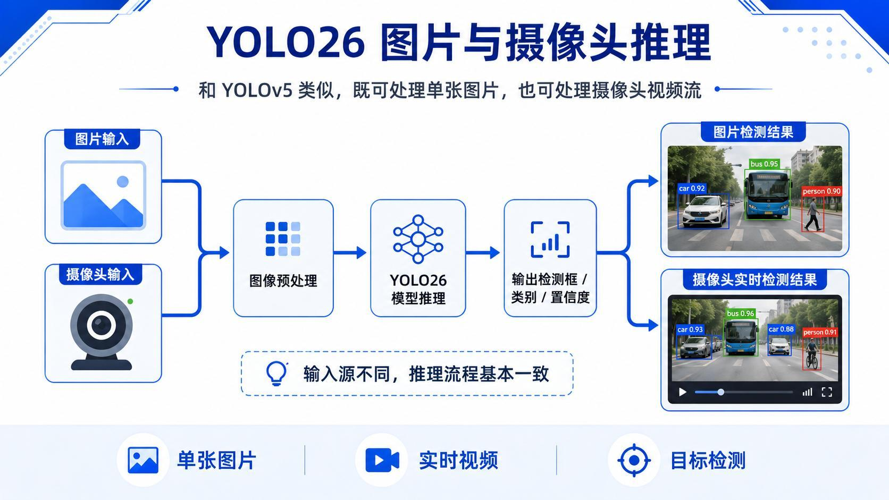
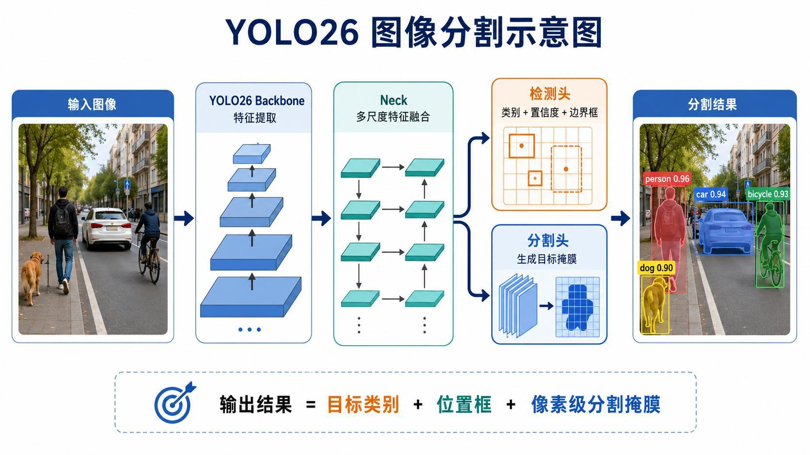
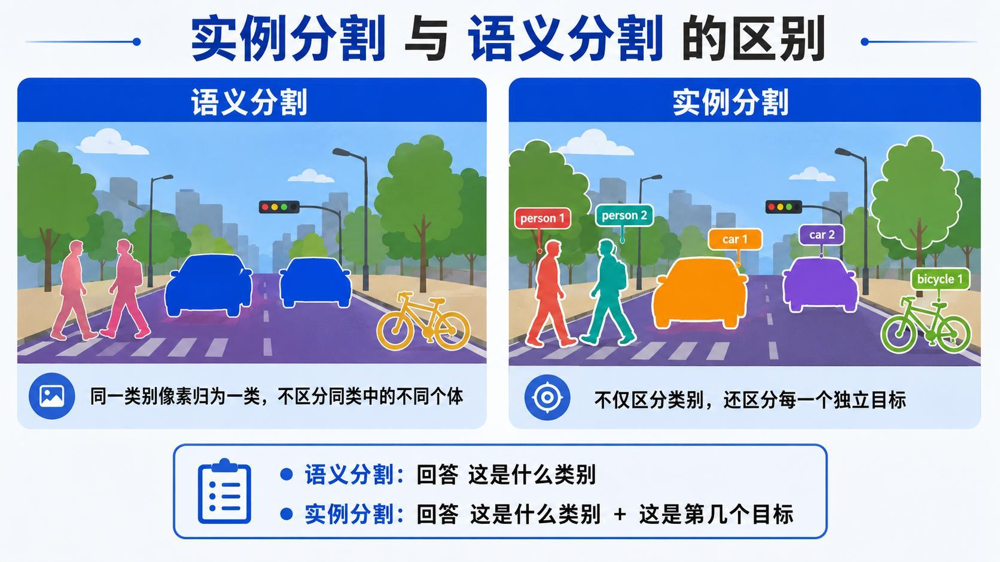
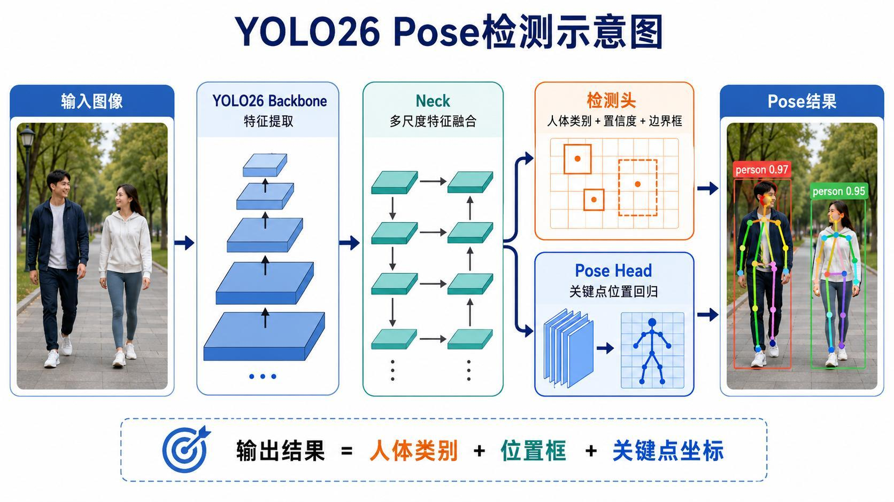
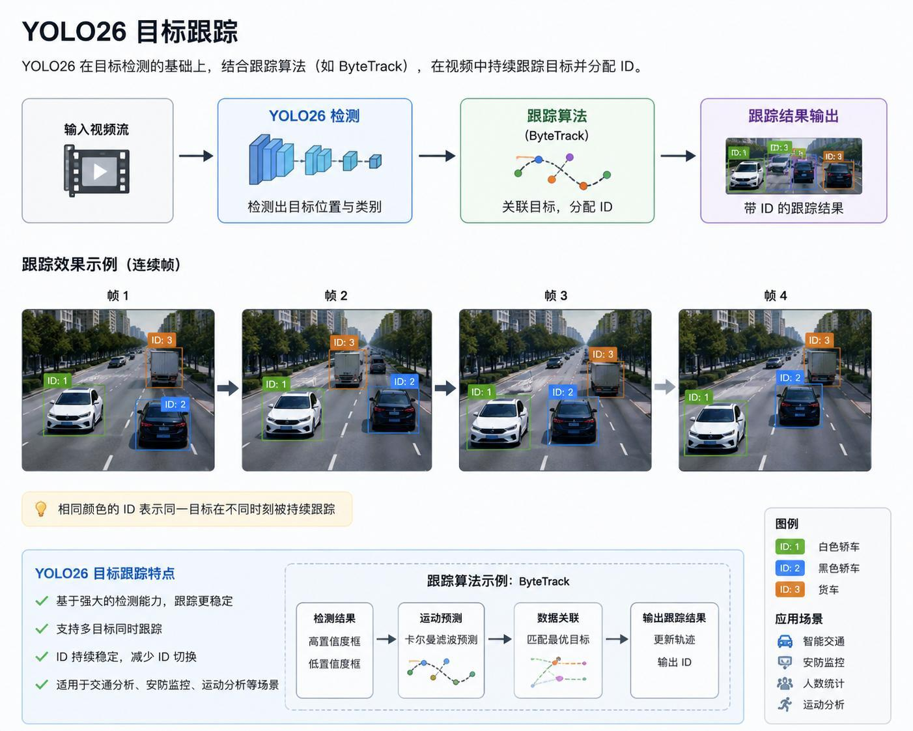
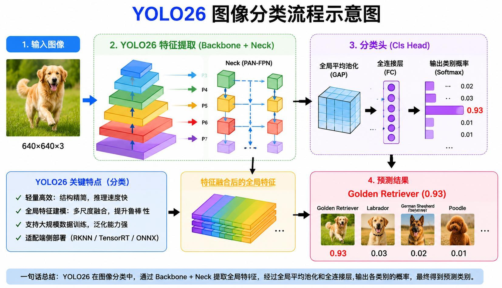
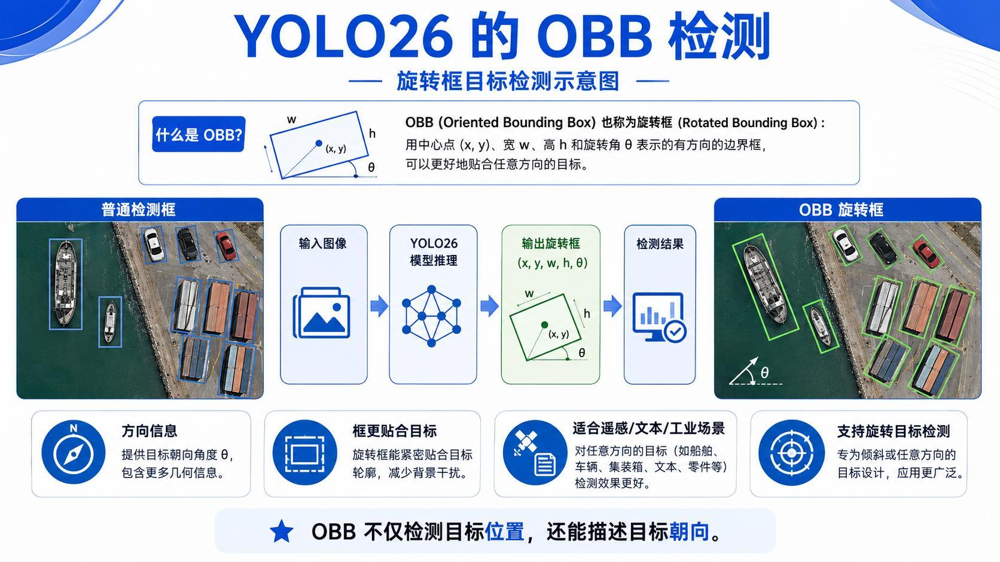
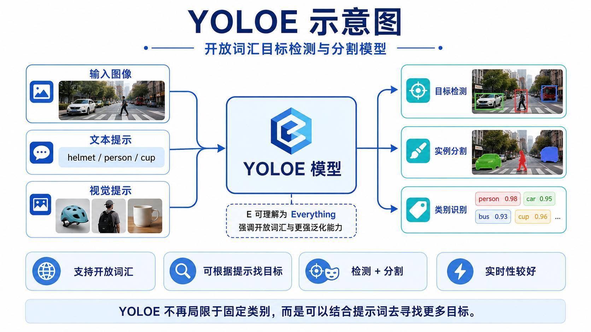
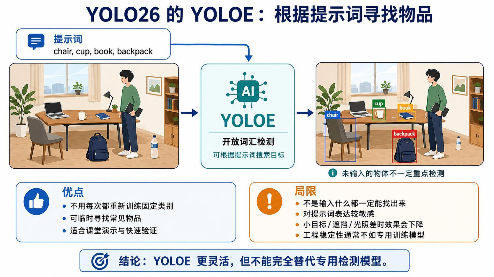

> 系列：神经网络与深度学习 · Lesson 12
> 视频主线：YOLOv5/安全帽回顾 → YOLO26 模型家族 → 检测/分割/Pose/跟踪/分类/OBB/YOLOE → Notebook 逐项运行 → Nano/Small 对比 → 遮挡丢 ID → 开放词汇安全帽失败

## 视频脉络

### 理论视频

| 视频时间 | 讲解内容 |
|:---|:---|
| 00:00-01:40 | 回顾 YOLOv5 推理、安全帽迁移训练和 ARM 部署 |
| 01:40-03:47 | YOLO26 模型家族与普通目标检测 |
| 03:47-07:20 | 像素掩膜、实例分割和语义分割 |
| 07:20-08:02 | Pose 的 17 个关键点 |
| 08:02-11:24 | 视觉目标跟踪、ID 与雷达点目标跟踪对比 |
| 11:24-12:03 | 图像分类 |
| 12:03-13:54 | OBB 旋转框、方向角和应用 |
| 13:54-16:07 | YOLOE 开放词汇能力与不能替代专用模型 |

### 实操视频

| 视频时间 | 讲解内容 |
|:---|:---|
| 00:00-01:36 | 下载 Nano 权重并对 bus 图片检测 |
| 01:36-03:55 | 摄像头检测、Nano/Small 大小和效果对比 |
| 03:55-06:55 | 图片/摄像头实例分割及不同实例着色 |
| 06:55-09:08 | 图片和摄像头 Pose 关键点 |
| 09:08-11:49 | 视频跟踪、遮挡丢 ID 和结果保存 |
| 11:49-12:31 | 图像分类 Top-5 |
| 12:31-14:10 | OBB 船舶旋转框和约 -27°/-30° |
| 14:10-14:56 | 语义分割场景输出 |
| 14:56-16:39 | YOLOE 常见物体、重复框和安全帽失败 |

## 1. 这是一组模型，不是一个模型包办全部任务
视频先回顾 YOLOv5：既做过通用目标检测，也用自定义数据训练了 helmet/no helmet，并将模型部署到 ARM 开发板。

本课介绍 YOLO26。老师强调，所谓“全家桶”不是同一份权重同时完成所有任务，而是同一系列包含不同任务模型：

- Detect：目标检测；
- Seg：实例分割；
- Pose：人体关键点；
- Track：检测结果结合跟踪算法；
- Classify：整图分类；
- OBB：旋转框检测；
- YOLOE：开放词汇检测与分割。

普通检测与 YOLOv5 使用方式相近：输入图片或摄像头帧，输出类别、置信度和边界框。

## 2. 检测框与分割掩膜解决的问题不同
目标检测只给出矩形框，框内仍包含背景；分割则进一步判断哪些像素属于目标。

视频区分两类分割：

- Semantic Segmentation：同一类别的所有像素使用同一语义标签；
- Instance Segmentation：除类别外，还区分同类中的每个独立个体。

实例掩膜可以看成与图像同尺寸的 0/1 或概率图：目标位置为高值，背景为低值。将掩膜与原图组合即可获得目标轮廓。

## 3. Pose 输出人体框和 17 个关键点

Pose 不只回答“这里有人”，还输出脚踝、膝盖、髋、肩、肘、手腕以及脸部眼睛、鼻子、耳朵等关键点。本课讲义采用 17 点人体骨架。

关键点带位置与置信度，可用于动作分析、姿态估计和人体交互。

## 4. 视频跟踪是在检测结果上维持 ID

视频中的 Track 面向可见目标：每帧先检测，再通过 ByteTrack 等算法关联目标，为同一对象保持相同 ID。

老师在这一段补充了自己博士阶段研究的雷达点目标跟踪，两者不要混为一谈：

- 视觉跟踪可以利用目标外观和连续图像；
- 远距离雷达目标可能只表现为点，无法按长相区分；
- 点目标更多依赖位置、速度和运动模型做数据关联；
- 单目标线性问题可使用 Kalman Filter，非线性问题可扩展到 EKF、UKF、Particle Filter；
- 多目标还涉及 Random Finite Set 等更复杂方法。

这段扩展的目的，是说明“目标跟踪”范围很广，本课 YOLO26 演示只是基于视觉检测框的跨帧 ID。

## 5. 分类与 OBB
整图分类只回答整张图主要是什么，不返回目标位置。

OBB 是 Oriented Bounding Box。与水平矩形框相比，它增加旋转角：

~~~text
(center_x, center_y, width, height, theta)
~~~

旋转框更贴合船舶、车辆、集装箱、倾斜文本和工业零件，并提供方向信息。

## 6. YOLOE 的 Everything 需要谨慎理解

传统 COCO 权重主要覆盖固定的 80 类。YOLOE 允许输入文本提示，尝试寻找默认类别之外的目标。

老师没有把 Everything 当作“任何物体都能正确识别”，而是明确提醒：

- 提示词表达会影响结果；
- 小目标、遮挡和光照会降低效果；
- 未训练过的专用目标可能找不到；
- 开放词汇适合演示和快速验证；
- 工程任务仍可能需要自建数据和专用训练。

## 7. Nano 权重和 bus 图片检测
Notebook 设置权重目录并下载 YOLO26 Nano，视频中权重约 5 MB。随后对 bus 图片推理，结果保存到 runs/detect 一类目录，并在 Notebook 内直接显示。

检测结果包含 bus、car、person 等目标，与前面 YOLOv5 的基本使用形式相同。

## 8. 摄像头检测与 Nano/Small 对比
摄像头 source 设置为 1。老师提到录制前几次摄像头有问题，本次运行正常，画面识别出 TV、cup、person、keyboard 等。

终止窗口时先切换到英文输入法，再按 Shift/Q 组合。

随后下载 Small 权重：

~~~text
Nano 约 5 MB
Small 接近 20 MB
~~~

Small 约为 Nano 的 4 倍。现场观察中，Small 识别出更多目标，包括屏幕中的 person 和之前遗漏的 mouse。视频只做定性对比，没有给出标准数据集速度或 mAP。

## 9. 实例分割：默认颜色不等于底层没有实例
先用 Seg 权重处理 bus 图片，人物和车辆得到像素级掩膜。再运行摄像头分割，手、keyboard、mouse、cup 等显示不同颜色。

默认可视化有时让同类目标看起来颜色相同，容易误以为是语义分割。老师读取每个 mask，并自行编写着色程序，让不同人物使用不同颜色，验证底层结果确实区分实例。

换成包含两个人的图片后，两个人以不同颜色显示。这一段把“模型输出”和“显示层配色”区分开来。

## 10. Pose 图片与摄像头演示
Pose 权重先处理 bus 图片，输出人体框和十几个关键点，并可打印各关键点坐标与置信度。

摄像头中，老师展示脸部、肩膀、手臂、腿和脚的骨架连接。站起后部分身体超出画面，关键点显示也随可见范围变化。

## 11. Track 遮挡后丢失 ID
跟踪主要针对视频流。未遮挡时，老师在画面内来回移动，ID 1 能连续保持。

随后老师故意遮挡自己，重新出现后 ID 无法可靠延续。现场结论是当前示例没有充分利用人物外观做 Re-ID，主要依赖未中断的检测与运动关联，因此遮挡后“马上就不行了”，仍有改进空间。

程序也演示保存跟踪视频。第一次打开的文件其实是备课时保存的旧视频，老师当场说明后再查看当前输出。这个小失误不影响跟踪结论，但属于实际操作过程。

## 12. 图像分类 Top-5
分类模型对 bus 图片输出 Top-5，候选包括 minibus、police van、school bus 等相近类别。它判断整张图的主要类别，不提供每辆车或每个人的位置。

## 13. OBB 输出船舶方向角
OBB 示例对航拍船舶图片推理，框会随船体倾斜。程序打印：

- 类别和置信度；
- 中心位置；
- 宽和高；
- 旋转角度。

一条船的原始结果约为 -27.2°，老师在自定义显示中标为约 -30°，并推测角度相对竖直方向按逆时针计算。视频明确说这是现场推测，未把坐标系方向当成已严格验证的结论。

## 14. 语义分割覆盖整个场景
语义分割不区分“第几个行人”，而是把人、道路、背景等场景类别分别标注。对避障任务而言，只要知道哪里是人、哪里是可行驶道路，未必需要给每个人独立 ID。

## 15. YOLOE 实测没有识别出安全帽
开放词汇模型文件较大，视频称超过 200 MB。对默认常见物体测试时：

- bookshelf、adapter、marker 有一定结果；
- 一本书出现两个 book 框，存在重复或不稳定检测；
- 安全帽始终没有正确识别。

老师又对单张图片设置 hat、helmet、safety helmet 等提示词，模型仍把目标识别成其他类别，没有找到安全帽。

这与理论部分的提醒完全一致：YOLOE 更灵活，但不能替代上一课那种专门采集 helmet/no helmet 数据后训练的检测模型。

## 本课小结

- YOLO26 是包含不同任务权重的模型家族，不是一份权重完成所有任务。
- Detect 返回类别、置信度和水平框。
- Instance Segmentation 区分同类不同实例，Semantic Segmentation 只区分类别。
- Pose 示例输出 17 个人体关键点。
- Track 在检测基础上关联跨帧目标并分配 ID。
- 视频跟踪与远距离雷达点目标跟踪不是同一问题。
- OBB 增加旋转角，更适合船舶和倾斜文本。
- Nano 约 5 MB，Small 接近 20 MB；现场 Small 检出更多目标。
- 默认分割配色可能掩盖实例差异，老师手工读取 mask 后重新着色。
- 跟踪在无遮挡时维持 ID，但遮挡后无法可靠恢复。
- OBB 示例角度约 -27.2°，自定义显示约 -30°。
- YOLOE 对常见物体有一定能力，但安全帽提示词测试失败。
- 本课没有完成 ARM/RKNN 部署，实际是本地 Notebook 多任务演示。

## 复习题

1. 为什么 YOLO26“全家桶”不等于一个模型完成全部任务？
2. 实例分割与语义分割的输出差异是什么？
3. Pose 比普通 person 检测多输出什么？
4. 视觉跟踪与雷达点目标跟踪有什么不同？
5. OBB 的五个几何参数是什么？
6. Nano 与 Small 的现场差异是什么？
7. 默认可视化颜色为什么不能证明模型只做语义分割？
8. 遮挡后 ID 丢失说明当前跟踪缺少什么能力？
9. OBB 的 -27.2° 为什么不能直接解释为绝对航向？
10. YOLOE 安全帽失败为什么支持“专用任务仍需训练”的结论？

## 视频与讲义来源

- [YOLO26 全方位讲解：更快更准，多任务落地边缘部署-理论](https://www.bilibili.com/video/BV1iR7r6tEyp)
- [YOLO26 全方位讲解：更快更准，多任务落地边缘部署-实战](https://www.bilibili.com/video/BV1Xp7r6JExR)
- 本地讲义：2026DL_lesson12.pdf

课程与讲义作者：海归博士 Dr. 魏。本文以两段视频完整转录为主线，讲义用于核对任务定义、模型家族和截图；ASR 中的幽露/ULU、实力/语异分割、野马/研码、铺子、Orinted bonding box、Karmann 绿波、扣扣等已订正为 YOLO、实例/语义分割、mask、Pose、Oriented Bounding Box、Kalman Filter、COCO。
