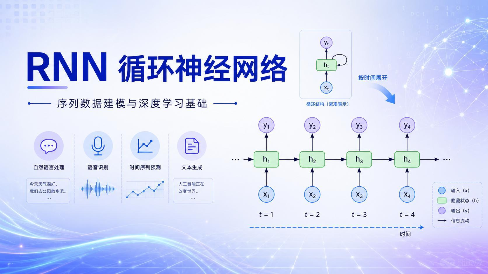
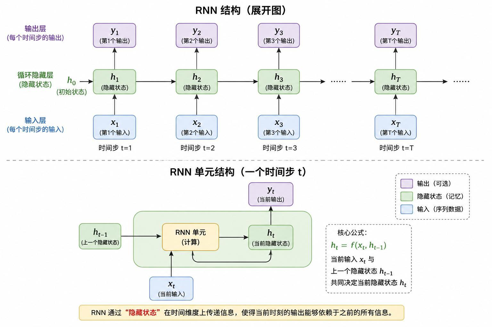
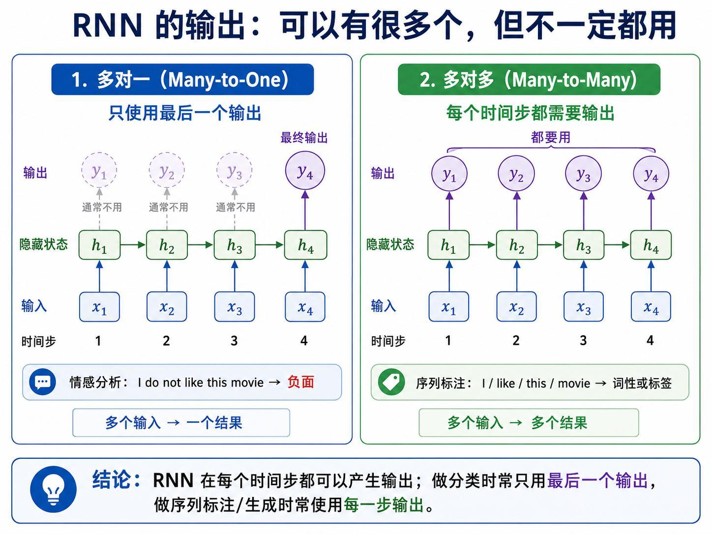
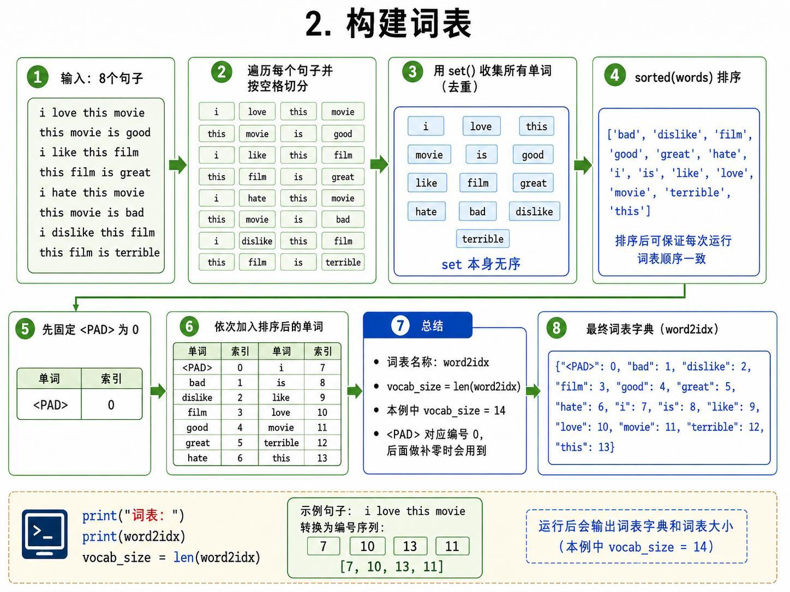
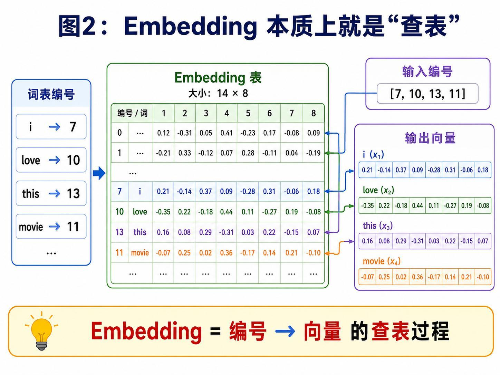
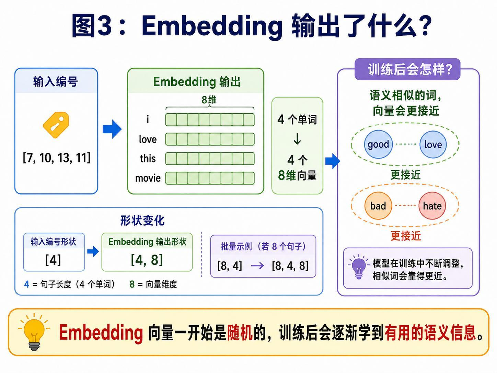
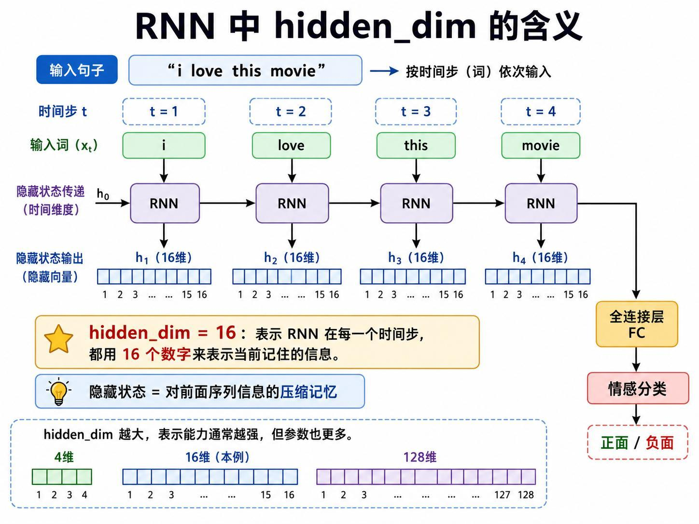
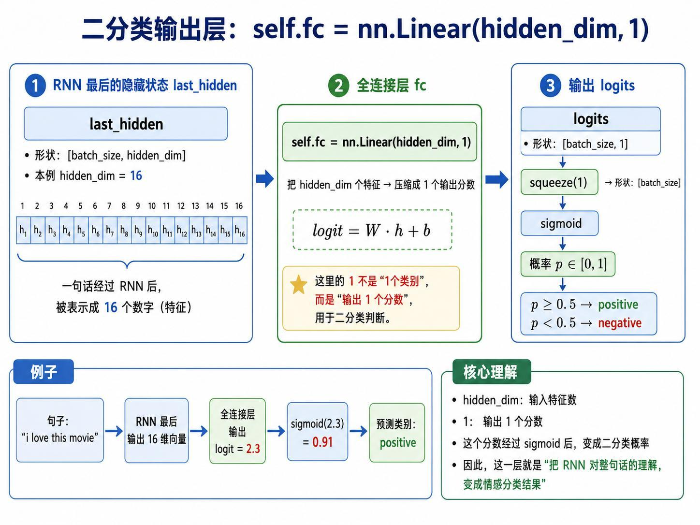
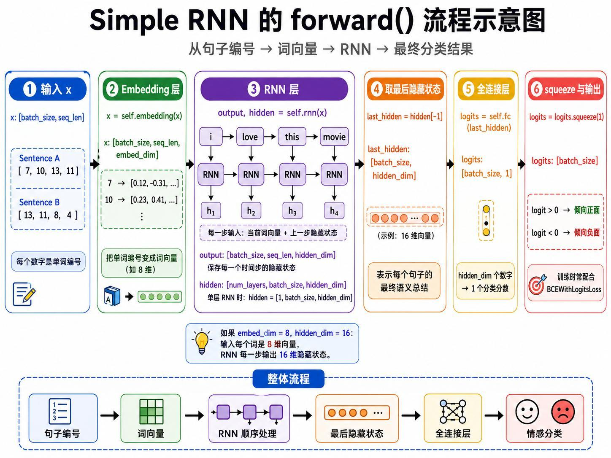
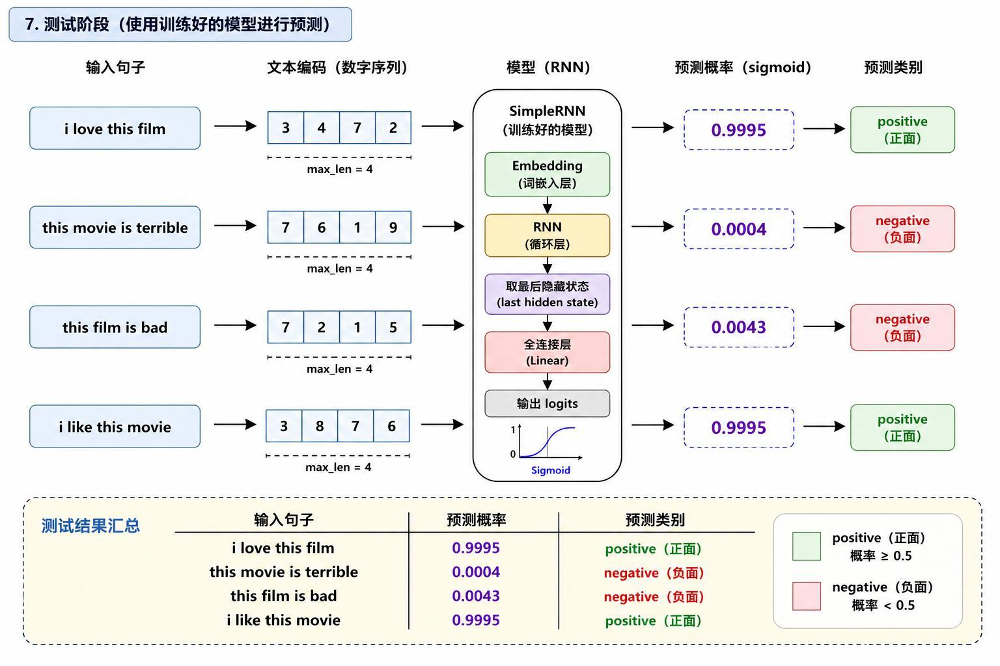

> 系列：神经网络与深度学习 · Lesson 13
> 视频主线：CNN 到 RNN → 隐藏状态与时间展开 → 多对一/多对多 → 8 句情感数据 → 词表与 Padding → Embedding → 8/16 维网络 → 200 epoch → 新句测试与泛化边界

## 视频脉络

| 视频时间 | 讲解内容 |
|:---|:---|
| 00:00-01:50 | 课程回顾并从 CNN 过渡到序列模型 |
| 01:50-03:20 | CNN 处理空间结构，RNN 处理顺序结构 |
| 03:20-05:00 | 情感分析、语音、翻译、时间序列等应用 |
| 05:00-09:00 | RNN 单元、隐藏状态和按时间展开 |
| 09:00-10:45 | Many-to-One 与 Many-to-Many 输出模式 |
| 10:45-12:10 | 8 句正负情感极小数据集 |
| 12:10-15:00 | 13 个词、PAD、词表和句子数字编码 |
| 15:00-20:05 | 为什么编号不等于语义，Embedding 如何学习 |
| 20:05-24:00 | hidden_dim=16、二分类头、损失和优化器 |
| 24:00-26:05 | 理论总结及新句预测目标 |
| 26:05-28:20 | Notebook 定义 SimpleRNN 与 forward |
| 28:20-29:15 | 训练 200 epoch 并测试两条未见句子 |
| 29:15-30:20 | 现场删词和改句测试，暴露小数据泛化限制 |
| 30:20-30:44 | 课程总结 |

## 1. CNN 与 RNN 处理的是两种结构
前面课程主要使用 CNN 处理图像。图像中的车轮、车身、车窗存在二维空间关系；卷积核在局部空间滑动，适合分类、目标检测和分割。

RNN（Recurrent Neural Network）面向顺序结构：

- 文本需要按词序阅读；
- 语音沿时间展开；
- 传感器、销量、温度、ECG 等是时间序列。

例如：

~~~text
I like this movie.
I do not like this movie.
~~~

只增加 not，整句情感就改变。若忽略顺序，模型很难正确理解这种差异。

## 2. RNN 的典型应用
视频列举的场景包括：

- 文本情感分析：积极、消极或中性；
- 语音识别：语音信号转文字；
- 机器翻译：中文序列转英文序列；
- 时间序列预测：根据历史销量预测下一时刻；
- 文本生成；
- 设备故障预测；
- ECG/EEG 等医学信号分析。

共同点不是数据格式相同，而是当前判断依赖前面发生过什么。

## 3. 隐藏状态让信息沿时间传递
以 I like this movie 为例，处理 like 时不能只看 like，还需要利用处理 I 后保留下来的信息。

RNN 单元在时间步 t 接收：

~~~text
当前输入 x_t
上一隐藏状态 h_(t-1)
~~~

并产生：

~~~text
当前隐藏状态 h_t
可选输出 y_t
~~~

隐藏状态可以理解为对已读序列的压缩记忆：

~~~text
I -> h1
like + h1 -> h2
this + h2 -> h3
movie + h3 -> h4
~~~

“循环”不是程序原地死循环，而是前一时刻产生的隐藏状态被送到下一时刻继续使用。

## 4. 每一步都能输出，但任务不一定全用

情感分类通常是 Many-to-One：读完整句子后，只使用最后状态输出一个类别。

~~~text
x1 x2 x3 x4 -> h4 -> positive/negative
~~~

机器翻译、序列标注或文本生成可能需要 Many-to-Many，在多个时间步产生输出。RNN 结构允许每一步输出，但具体任务决定哪些输出参与损失或推理。

## 5. 先用 8 句话构造最小实验
视频手工建立 4 条正样本和 4 条负样本：

| Positive，label=1 | Negative，label=0 |
|:---|:---|
| i love this movie | i hate this movie |
| this movie is good | this movie is bad |
| i like this film | i dislike this film |
| this film is great | this film is terrible |

目标是训练后输入相似但未完全出现过的新句子，判断其情感。

这个数据集极小，适合展示完整数据流，不适合证明模型具备通用自然语言理解能力。

## 6. 构建 13 个词的词表
程序按空格切分全部句子，用 set 去重，再排序得到 13 个词。另加入 PAD，占用索引 0，因此词表总大小为 14。

词表建立单词与编号的映射。例如：

~~~text
i love this movie
-> [7, 10, 13, 11]
~~~

句子长度不一致时使用 PAD 补齐。这里的 Padding 与 CNN 补边不是同一个空间操作，但目的相似：让一个 batch 中的张量形状一致。

## 7. 编号只是索引，不是语义
直接把 10、12 等编号当连续数值会产生错误暗示：模型可能把“编号接近”误解为“语义相似”。love 的编号接近 terrible，并不表示两个词含义相近。

视频用身份证号类比：

> 1001 和 1002 只表示两个人的身份编号接近，不代表两个人的特征相似。

所以编号只用于查表，真正送入 RNN 的是 Embedding 向量。

## 8. Embedding 是可学习的向量表

本例 Embedding Dimension 为 8。每个单词编号查出一个 8 维向量：

~~~text
[7, 10, 13, 11]
-> 4 个 8 维向量
-> shape [4, 8]
~~~

批量 8 个四词句子时，形状从 [8, 4] 变为 [8, 4, 8]。

Embedding 初始值随机，并随分类损失一起更新。训练过程中，love、like、good 等对正类有相似作用的词可能形成更接近的表示，bad、hate、terrible 也可能靠近。

## 9. hidden_dim=16 表示记忆容量

每读入一个词，RNN 用 16 个数表示当前记住的信息：

~~~text
h1, h2, h3, h4: shape [hidden_dim=16]
~~~

hidden_dim 越大，表示能力通常越强，同时参数和计算量也增加。本例只需处理极小数据，因此使用 16。

## 10. 最后隐藏状态进入一个二分类头

只取最后隐藏状态 h4，经过：

~~~text
Linear(hidden_dim=16, out_features=1)
-> one logit
-> sigmoid probability
~~~

概率大于等于 0.5 判为 positive，小于 0.5 判为 negative。

输出 1 个数不等于“只有一个类别”，而是用一个二分类分数表达正类概率。

## 11. 模型和训练配置
视频中的关键设置：

~~~text
vocab_size = 14
embed_dim  = 8
hidden_dim = 16
loss       = BCEWithLogitsLoss
optimizer  = Adam
~~~

BCEWithLogitsLoss 直接接收 logit，内部处理 Sigmoid 与二元交叉熵。推理时才显式计算概率。

## 12. Notebook 中的 SimpleRNN.forward
理论和实操在同一个视频中连续进行。SimpleRNN 的 forward 流程是：

~~~text
x
-> self.embedding(x)
-> self.rnn(embedded)
-> hidden[-1]
-> self.fc(last_hidden)
-> squeeze(1)
~~~

RNN 每一步都产生 output，但本课情感分类只取最终 hidden。模型随后配置 8 维 Embedding、16 维 Hidden、二分类损失和 Adam。

## 13. 训练 200 epoch 后测试未见句子
训练循环执行 200 个 epoch：

1. 前向传播；
2. 计算 BCE 损失；
3. 反向传播；
4. Adam 更新参数。

视频测试了训练集没有完全出现过的组合：

| 测试句子 | 结果 |
|:---|:---|
| i love this film | positive |
| this movie is terrible | negative |

这些句子与训练模板很接近，只替换了 movie/film 或复用了已知情感词，因此模型能够组合已有局部模式。

## 14. 现场删掉一个词，模型就暴露局限
老师继续临时修改输入：

- like this movie：去掉开头 i 后，结果出现问题；
- i like this movie：补回 i 后可以工作；
- i like movie：现场又得到可接受结果。

老师据此强调，训练集只有 8 句话，模型无法处理差异太大的表达。它学到的是极窄的数据分布，不是大模型级别的语言理解。

这一现场失败比“测试全对”更能说明实验边界：

- 词表之外的新词无法编码；
- 训练模板之外的句法变化可能导致错误；
- 200 epoch 只是在极小数据上充分拟合；
- 不能把两条新句成功推广成通用能力。

## 15. 本课建立的是完整最小链路
从文本到预测的最小 RNN 路线已经闭合：

~~~text
原始句子
-> 分词和词表索引
-> Padding
-> Embedding
-> RNN 隐藏状态
-> 最后状态
-> Linear(16,1)
-> 正面/负面
~~~

下一课将在普通 RNN 的基础上讨论长距离信息逐渐丢失的问题，并引入 LSTM。

## 本课小结

- CNN 擅长空间结构，RNN 擅长顺序结构。
- RNN 用隐藏状态把前面信息传到下一时间步。
- 情感分类是 Many-to-One，序列标注等任务可使用 Many-to-Many。
- 本课数据只有 8 句，4 正 4 负。
- 13 个实际单词加 PAD 后，词表大小为 14。
- 单词编号只是查表索引，不能直接表示语义距离。
- Embedding 将每个词变成可学习的 8 维向量。
- RNN 的隐藏状态使用 16 维。
- 最后隐藏状态通过 Linear(16,1) 输出二分类 logit。
- 模型用 BCEWithLogitsLoss、Adam 训练 200 epoch。
- 两条相近新句分类正确，但去掉 i 的现场测试出现问题。
- 实验展示了完整数据流，也明确暴露了极小训练集的泛化边界。

## 复习题

1. CNN 与 RNN 分别适合哪类结构？
2. 隐藏状态为什么需要传给下一时间步？
3. Many-to-One 和 Many-to-Many 有什么区别？
4. PAD 为什么占用索引 0？
5. 为什么不能直接把单词编号作为连续数值输入？
6. Embedding 的参数如何获得语义信息？
7. hidden_dim=16 表示什么？
8. 为什么二分类头只输出一个 logit？
9. BCEWithLogitsLoss 与 Sigmoid 如何配合？
10. like this movie 的失败说明了什么？

## 视频与讲义来源

- [RNN 循环神经网络详解：原理、结构与文本分类实战](https://www.bilibili.com/video/BV1G2Ej6DEL3)
- 本地讲义：2026DL_lesson13.pdf

课程与讲义作者：海归博士 Dr. 魏。本文以完整视频转录为主线，讲义用于核对 RNN 展开结构、词表、Embedding、张量形状和推理结果；ASR 中的 ARN/RIN/RNA、dance、签入、磁表、sigma、Apple 科等已依据上下文订正为 RNN、dense、Embedding、词表、Sigmoid、epoch。
