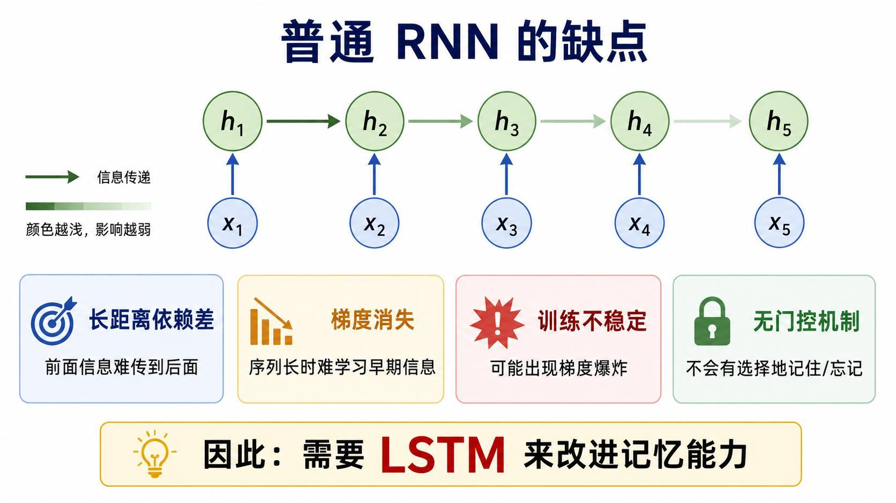
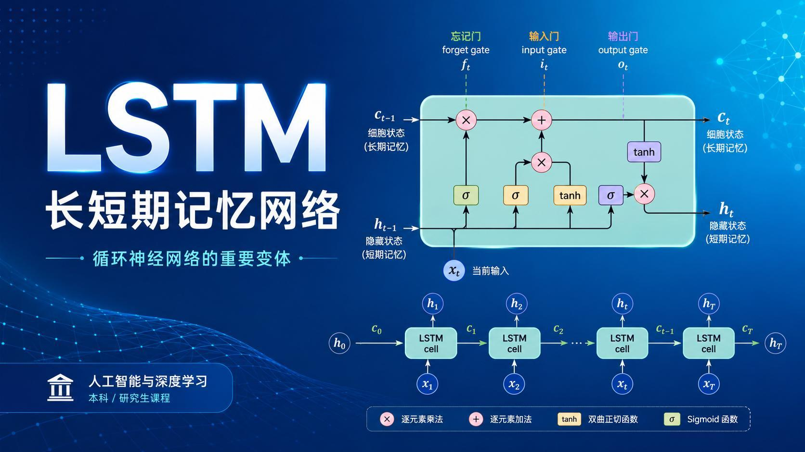
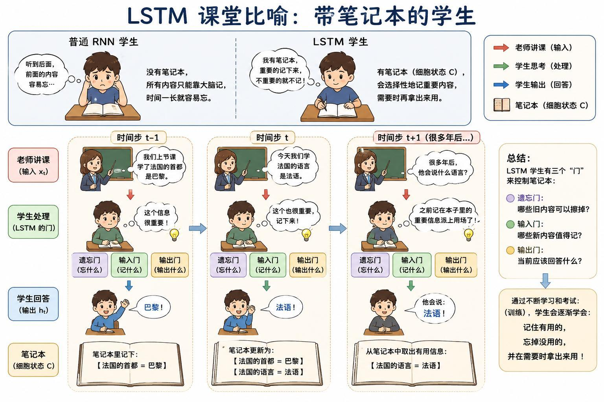
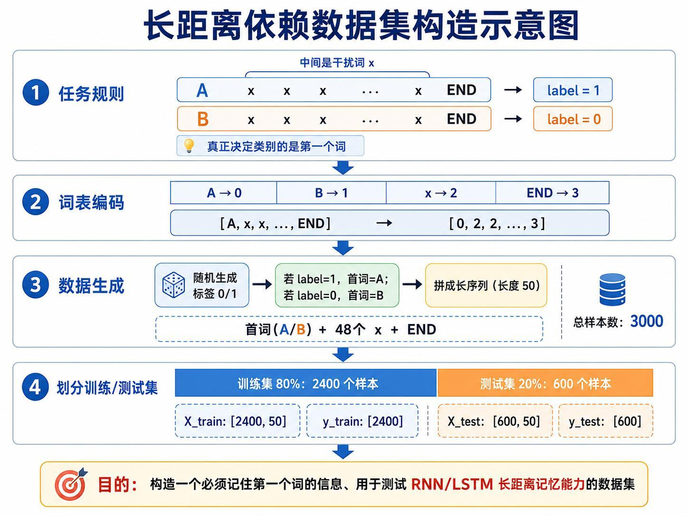
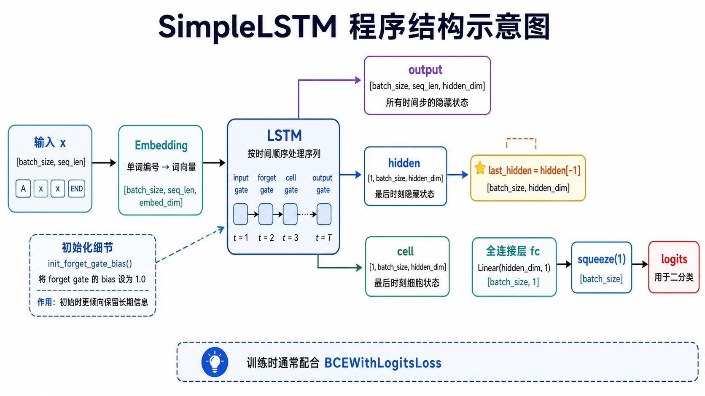
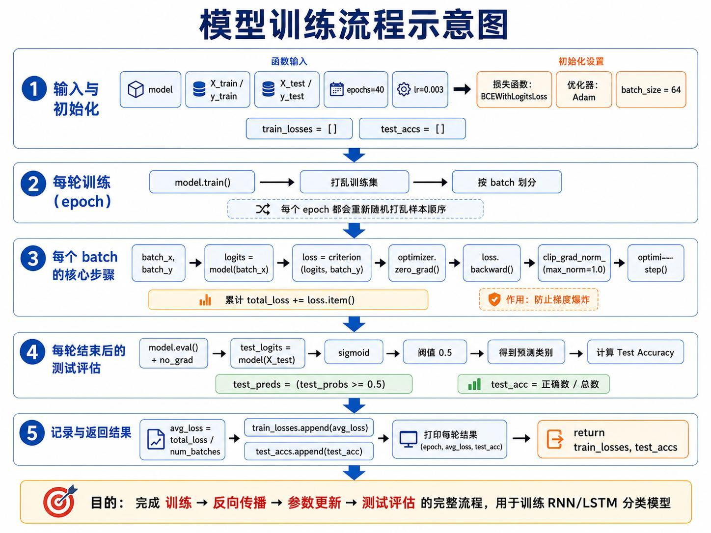
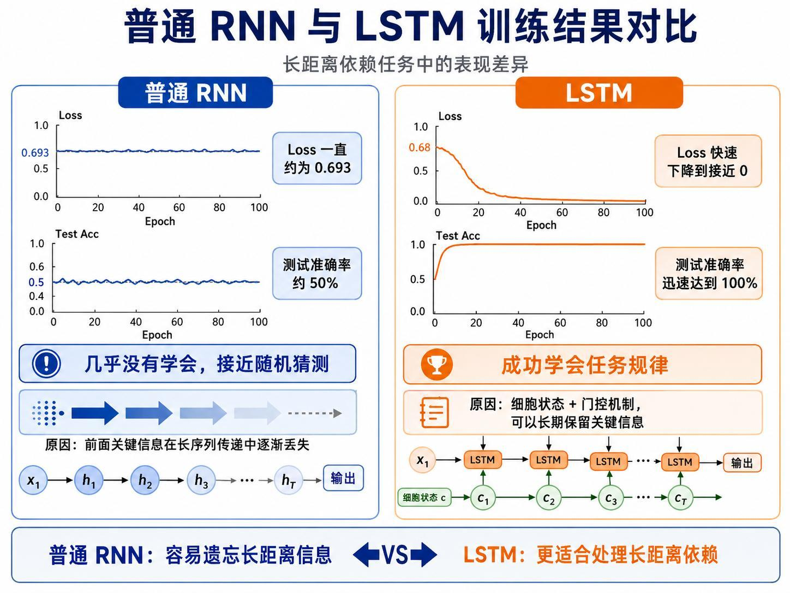
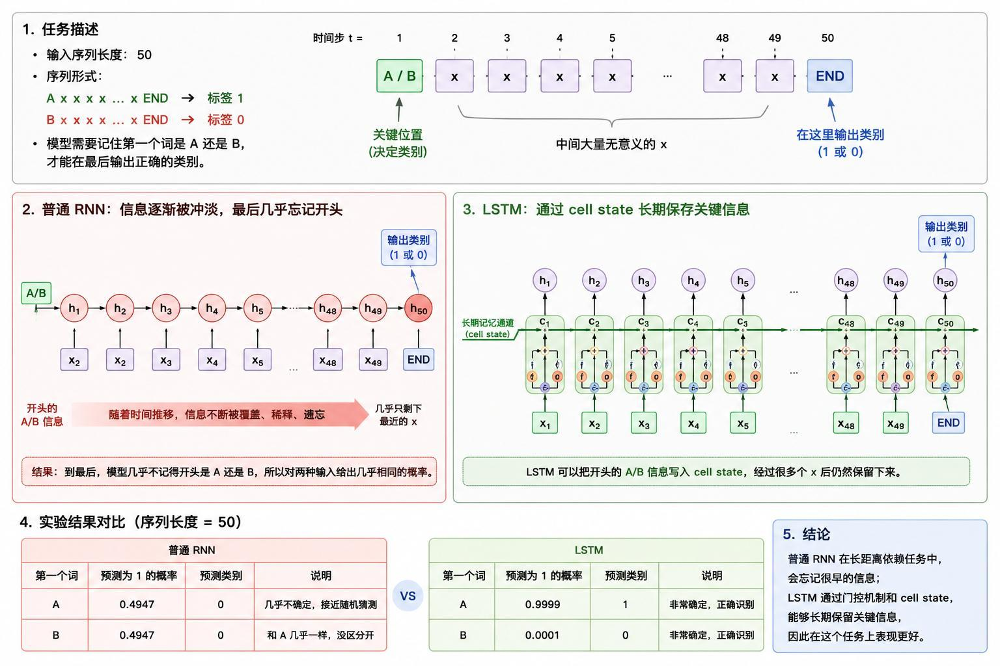

> 系列：神经网络与深度学习 · Lesson 14
> 视频主线：普通 RNN 的遗忘问题 → LSTM 细胞状态与三类门 → 长距离依赖任务 → 第一版数据集失败 → 定位情感词干扰 → A/B-X 数据重构 → RNN 约 50%、LSTM 约 100%

## 视频脉络

| 视频时间 | 讲解内容 |
|:---|:---|
| 00:00-01:40 | 回顾 RNN 文本分类与课程脉络 |
| 01:40-03:31 | 普通 RNN 长距离依赖差，引出 LSTM |
| 03:31-05:07 | “带笔记本的学生”比喻和三个门 |
| 05:07-06:54 | A/B + X...X + END 长序列任务设计 |
| 06:54-08:09 | 编码、3000 个样本、Embedding 和 SimpleLSTM |
| 08:09-10:54 | 训练函数和预期 RNN/LSTM 曲线 |
| 10:54-12:15 | Notebook 先验证 LSTM 可完成上一课情感分类 |
| 12:15-13:25 | 构建首词决定标签的长序列比较实验 |
| 13:25-15:18 | 第一版 RNN、LSTM 都约 47%-50%，现场诊断原因 |
| 15:18-16:18 | 去掉情感干扰词，重构为 A/B 与纯 X 序列 |
| 16:18-17:42 | 重训后 RNN 仍约 50%，LSTM 很快达到 100% |
| 17:42-18:02 | 样例预测和课程总结 |

## 1. 普通 RNN 能分类，但记不住很远的信息
上一课用 RNN 学习简单情感句子，例如：

~~~text
I love this movie.
I like this film.
This film is bad.
~~~

短句中，决定类别的信息离输出不远，普通 RNN 可以工作。但当序列变长，较早的信息经过许多时间步后影响逐渐变弱，还可能伴随梯度消失、梯度爆炸和训练不稳定。

本课要解决的不是“RNN 完全不能处理序列”，而是“怎样让关键内容跨越很长的干扰区间后仍然保留下来”。

## 2. LSTM 多了一条长期记忆通道
LSTM 全称 Long Short-Term Memory，即长短期记忆网络。它在循环隐藏状态之外引入 Cell State，作为长期信息通道，并通过门控决定信息的去留。

三个门的直观作用：

- Forget Gate：旧信息中哪些应当丢弃；
- Input Gate：当前输入中哪些值得写入；
- Output Gate：当前时刻应当输出哪些信息。

隐藏状态偏向当前或短期上下文，细胞状态承担长期记忆。门通常使用 Sigmoid 产生 0-1 权重，再通过逐元素乘法控制信息比例。

## 3. “带笔记本的学生”比喻

视频把普通 RNN 比作只靠大脑听课的学生：时间一长，早先内容容易忘记。LSTM 像带着笔记本：

- “法国首都是巴黎”值得记录；
- “这是上节课讲的”不影响知识本身，可以遗忘；
- 很久以后问到首都时，再从笔记本取出巴黎。

笔记本对应 Cell State。遗忘门擦除无用旧内容，输入门写入新内容，输出门决定当前回答。这一比喻不替代公式，但能说明 LSTM 为什么不是无条件记住全部输入，而是选择性记忆。

## 4. 构造一个必须记住第一个字符的任务
为了比较长期记忆能力，视频设计两类序列：

~~~text
A X X X ... X END -> label 1
B X X X ... X END -> label 0
~~~

类别完全由首字符决定，中间的 X 没有任何分类信息。模型必须在读到最后一个 END 时仍记得开头是 A 还是 B。

讲义给出的设置：

| 项目 | 数值 |
|:---|---:|
| 序列长度 | 50 |
| 中间 X 数量 | 48 |
| 总样本 | 3000 |
| 训练集 | 2400 |
| 测试集 | 600 |

编码为：

~~~text
A -> 0
B -> 1
X -> 2
END -> 3
~~~

## 5. SimpleLSTM 的输入输出路径
输入先经过 Embedding，把离散编号变成词向量，再按时间顺序送入 LSTM。模型取最后时间步的隐藏状态，经过全连接层输出一个二分类 logit。

视频还提到把 Forget Gate Bias 初始化为 1，使模型初始时更倾向于保留旧信息。这不是“永远不能忘”，而是训练开始阶段减少长期信息被过早清空。

## 6. 训练流程与比较指标

训练函数接收模型、训练集和测试集，主要配置包括：

~~~text
learning rate = 0.003
batch size    = 64
loss          = BCEWithLogitsLoss
optimizer     = Adam
gradient clip = 1.0
~~~

每个 epoch 重新打乱训练样本，按 batch 前向计算、反向传播、梯度裁剪和参数更新，随后在测试集上记录准确率。

预期现象：

- 普通 RNN 的 Loss 约停在 0.693，准确率约 50%；
- LSTM 的 Loss 快速接近 0，准确率快速接近 100%。

## 7. Notebook 先验证 LSTM 能完成普通情感分类
进入程序后，老师先复用上一课的小型情感数据：建立词表、编码句子，然后把 RNN 层替换成 LSTM。

这一小段训练 300 个 epoch，测试句子可以得到正确分类。它只用于证明 LSTM 至少能完成普通 RNN 的短文本任务，还不是长距离依赖对比。

真正的比较实验从下一段重新构造长序列开始。

## 8. 第一版长序列实验失败：两个模型都在猜
第一版任务把首词设置为 good 或 bad，中间加入很多随机词，再比较普通 RNN 和 LSTM。实际运行结果并没有出现讲义中的理想曲线：

~~~text
RNN  test accuracy ≈ 47%-50%
LSTM test accuracy ≈ 47%-50%
~~~

两个模型都接近随机猜测。老师现场明确表示疑惑：“怎么会出现这种情况？”

这是视频的重要实验结果，不能用最后成功的图覆盖掉。

## 9. 问题不在 LSTM，而在数据集设计
老师检查生成数据后发现，中间随机词包含 great、terrible 等强烈情感词。模型面对的监督信号变得矛盾：

~~~text
首词 good/bad 决定人工标签
中间 great/terrible 也强烈暗示情感
~~~

网络可能转而学习中间的情感特征，而没有学习“只看第一个词”的规则。因此 LSTM 没有展示出长期记忆优势，并不能直接说明 LSTM 失效。

这次失败说明，比较模型能力前必须确保数据只考察目标变量。若干扰项本身携带标签信息，实验就不再是纯粹的长距离依赖测试。

## 10. 重构为 A/B + 纯 X 干扰
老师随后重新生成数据：

- 第一个字符只用 A 或 B；
- 中间全部使用没有类别含义的 X；
- 末尾使用 END；
- 标签只由 A/B 决定。

视频前面的讲义设计长度为 50；现场后段口述曾提到约 80 个时间步。两处数字不完全一致，但实验变量相同：关键字符只出现在开头，中间是很长且无信息的重复干扰。本文以讲义中完整列出的长度 50 为主要配置，同时保留现场对更长序列的说明。

## 11. 重训后才出现真正差异
在干净的 A/B-X 数据上重新训练：

~~~text
普通 RNN：测试准确率仍约 50%
LSTM：测试准确率很快达到接近 100%
~~~

普通 RNN 读过大量 X 后，开头 A/B 的影响几乎消失；LSTM 则通过 Cell State 和门控保留首字符信息。

单条测试也符合该结论：

- 以 A 开头时，LSTM 很有信心输出 label 1；
- 以 B 开头时，LSTM 很有信心输出 label 0；
- 普通 RNN 对两类都接近随机。

## 12. 实验应该怎样解读
最终结论不是“LSTM 在所有数据上一定比 RNN 好”，而是：

1. 普通 RNN 在长距离依赖任务中容易遗忘早期信息；
2. LSTM 的 Cell State 与门控为长期信息提供更稳定路径；
3. 模型对比是否可信，取决于数据集有没有隔离真正的实验变量；
4. 失败运行、错误定位和数据重构是实验结论的一部分。

## 本课小结

- 普通 RNN 能处理短序列，但早期信息在长序列中容易衰减。
- LSTM 引入 Cell State 保存长期记忆。
- Forget、Input、Output Gate 分别控制遗忘、写入和当前输出。
- 长距离任务的标签只由序列首字符决定。
- 讲义配置为 3000 个长度 50 的序列，训练/测试按 2400/600 划分。
- 第一版 good/bad 数据被中间情感词污染，RNN 和 LSTM 都只有约 47%-50%。
- 老师定位数据问题后改用 A/B 与纯 X 干扰。
- 重训后普通 RNN 仍约 50%，LSTM 很快接近 100%。
- Forget Gate Bias 初始化为 1，使初期更倾向于保留信息。
- 这节课同时展示了 LSTM 优势和实验设计错误如何掩盖优势。

## 复习题

1. 普通 RNN 为什么难以学习长距离依赖？
2. Cell State 与 Hidden State 各承担什么角色？
3. LSTM 的三个门分别控制什么？
4. 为什么任务必须让标签只由首字符决定？
5. 第一版 good/bad 数据为什么让 LSTM 也只有约 47%？
6. A/B-X 数据怎样消除了情感词干扰？
7. Forget Gate Bias 设置为 1 有什么直观作用？
8. 为什么不能只展示最终成功曲线而省略第一次失败？

## 视频与讲义来源

- [LSTM 详解：门控机制、网络结构与长序列实验对比](https://www.bilibili.com/video/BV1qqEj6oEiz)
- 本地讲义：2026DL_lesson14：LSTM.pdf

课程与讲义作者：海归博士 Dr. 魏。本文以完整视频转录为主线，讲义用于核对 LSTM 结构、数据规模、训练流程和对比曲线；ASR 中的 RNA/RIN/RSTM、Lung Short Term Memory、BIOS、APOC 等已依据上下文订正为 RNN、LSTM、Long Short-Term Memory、bias、epoch。
