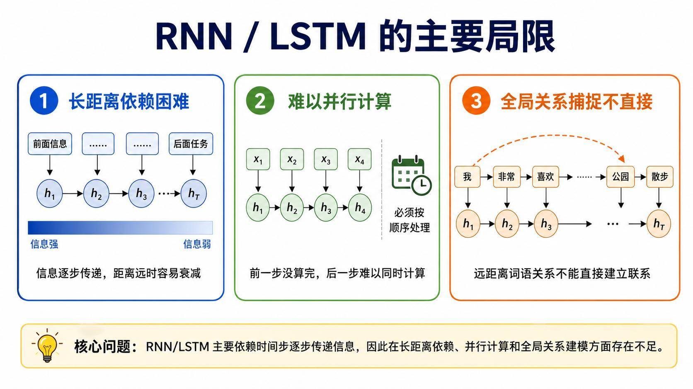
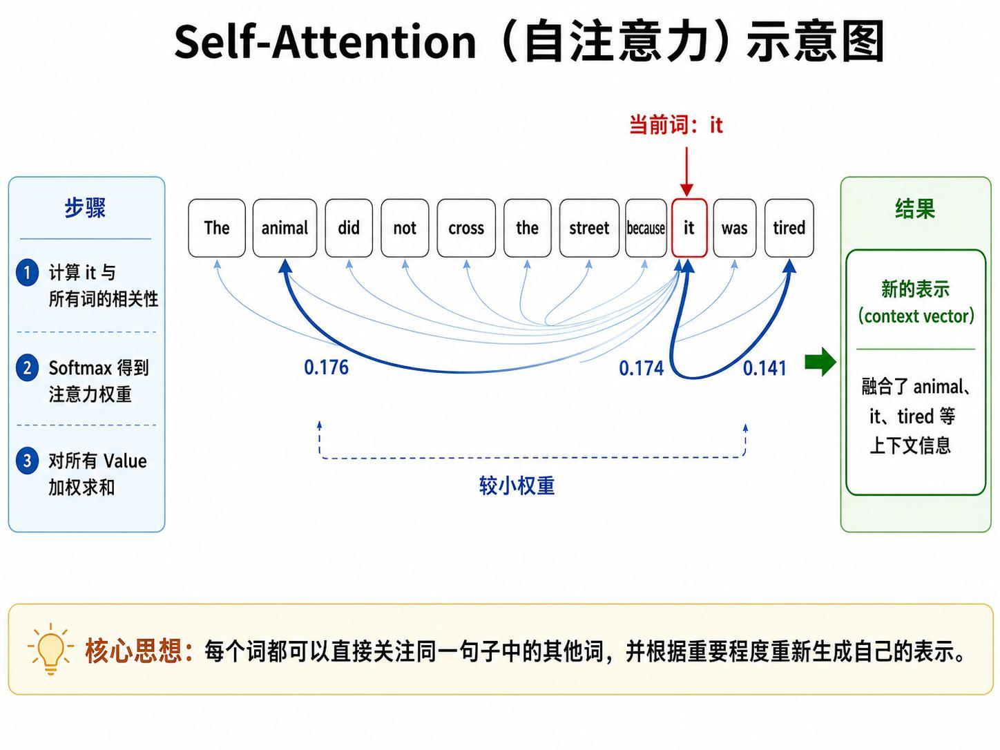
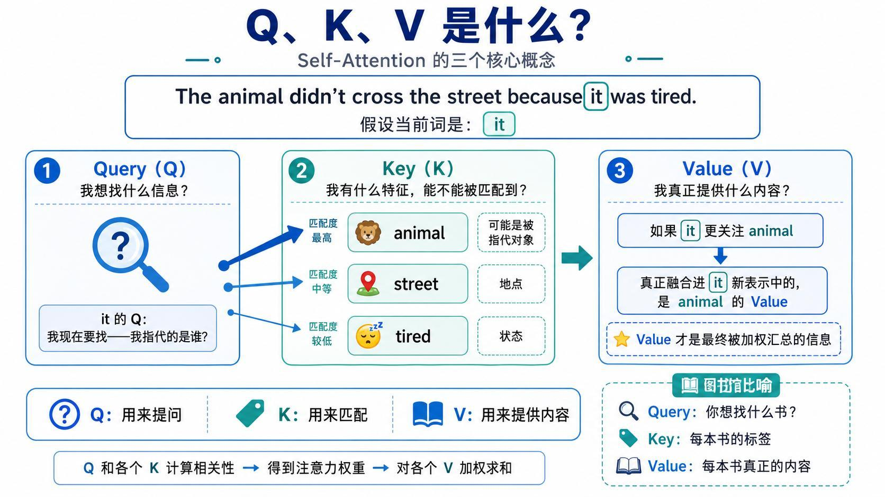
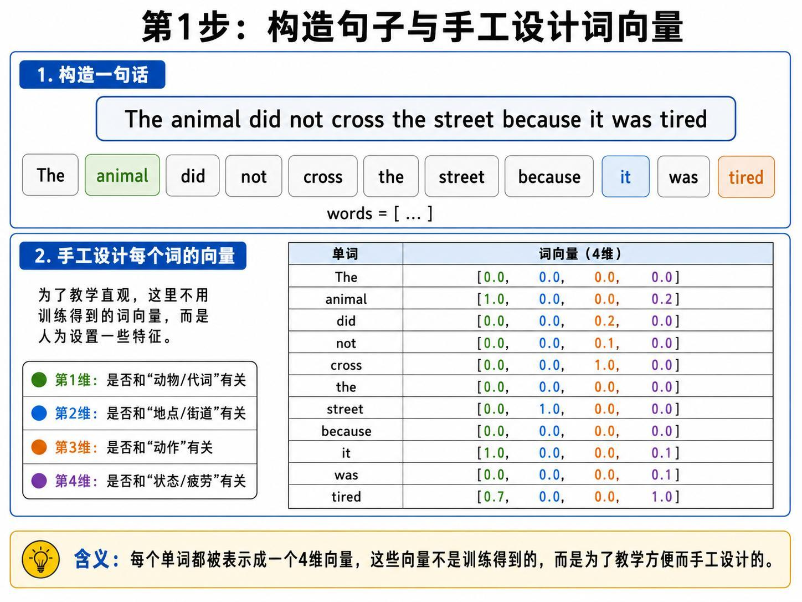
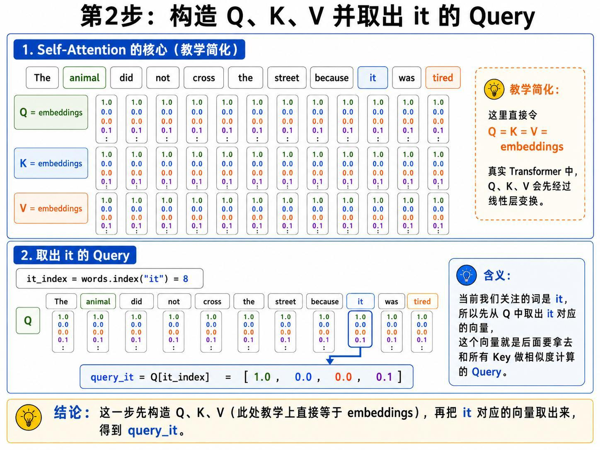
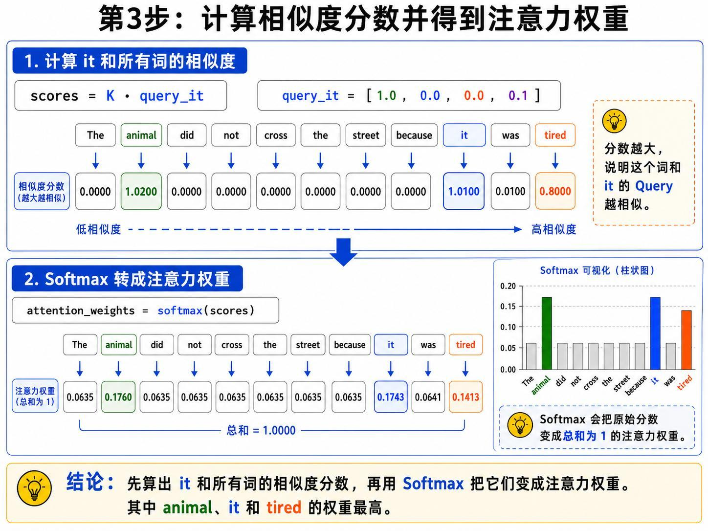
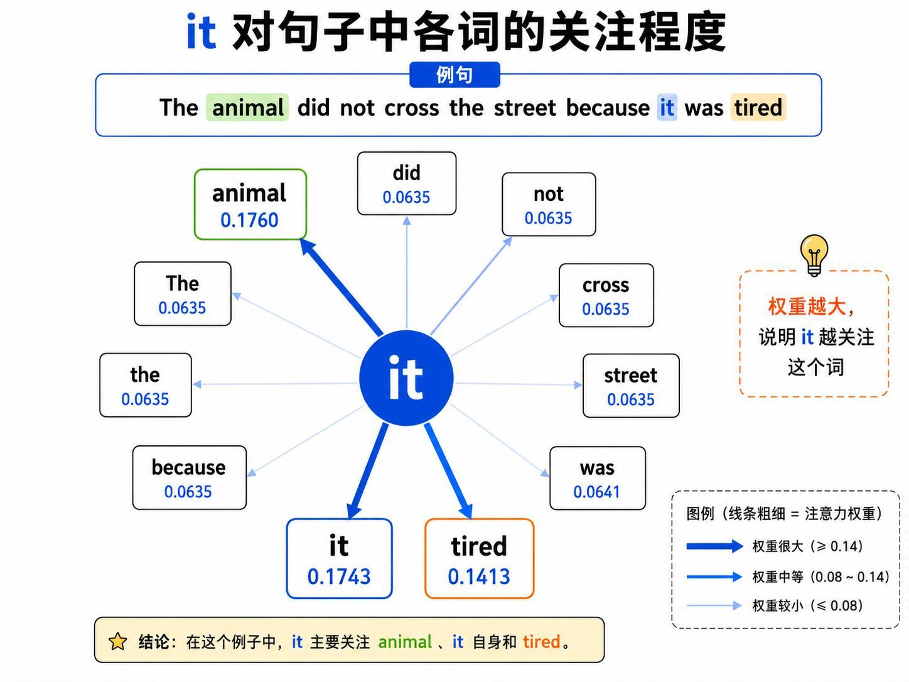
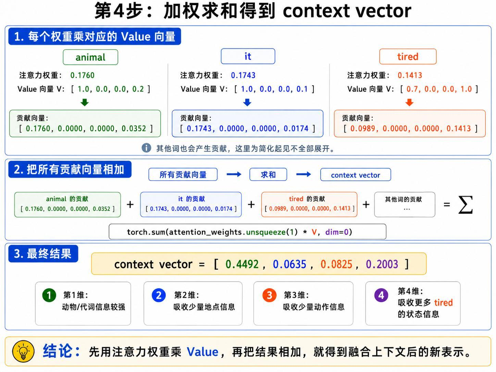
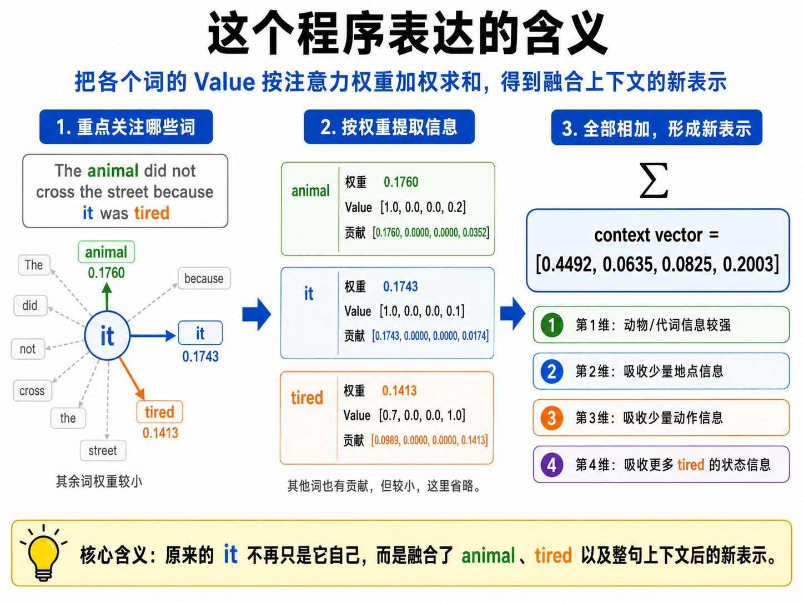
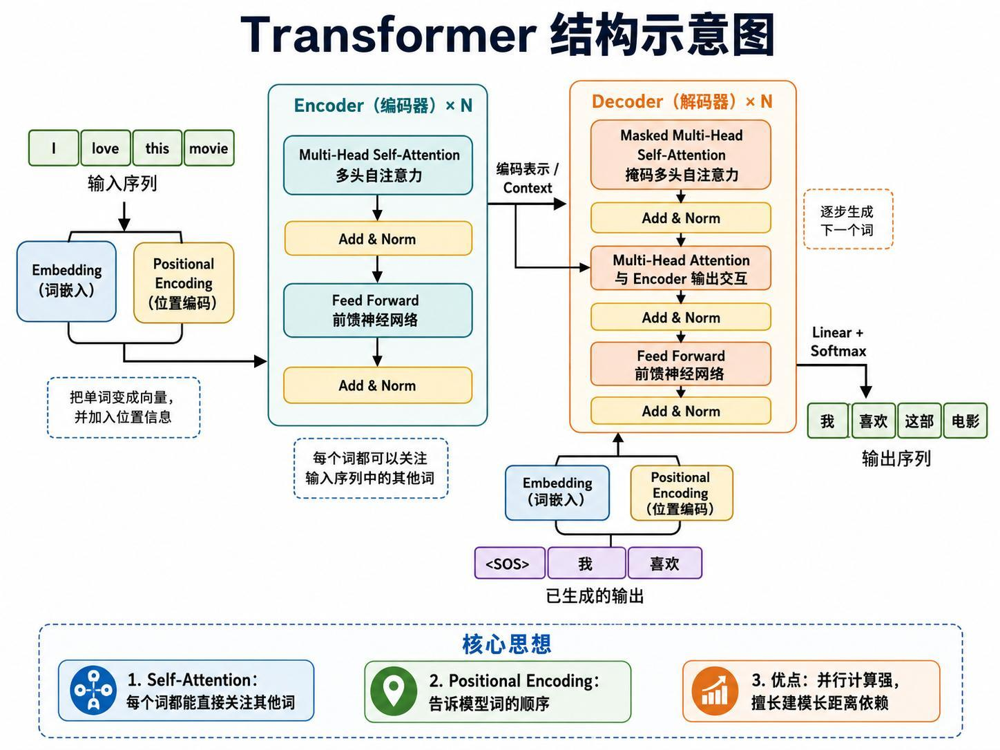

> 系列：神经网络与深度学习 · Lesson 15
> 视频主线：RNN/LSTM 局限 → `it` 指代问题 → Q/K/V → 手工词向量 → 点积与 Softmax → Value 加权求和 → Transformer 预告

## 视频脉络

| 视频时间 | 讲解内容 |
|:---|:---|
| 00:00-02:03 | 回顾 RNN 情感分析与 LSTM 长期记忆，引出 Self-Attention |
| 02:03-04:12 | RNN/LSTM 的三项局限 |
| 04:12-07:29 | 用 `it` 的指代关系解释自注意力直觉 |
| 07:29-08:05 | Self-Attention 与 Transformer、语言模型的关系 |
| 08:05-10:36 | Q、K、V 的含义及图书馆比喻 |
| 10:36-12:09 | 为例句手工设计四维词向量 |
| 12:09-14:54 | 简化令 Q=K=V，计算点积分数和 Softmax 权重 |
| 14:54-18:21 | 按权重汇总 Value，得到 `it` 的新表示 |
| 18:21-19:25 | 解释上下文向量并说明为什么可以并行 |
| 19:25-20:42 | 按程序执行顺序复盘完整计算 |
| 20:42-21:14 | Self-Attention 是 Transformer 的重要组成部分 |

## 1. 从 RNN 和 LSTM 回顾开始
视频先回到前两课的任务：使用序列模型做情感分析。模型从带标签的句子中学习，例如：

```text
I love this movie.  -> positive / 1
I hate this movie.  -> negative / 0
```

训练后，再输入 `This movie is terrible.`，模型应判断它偏负面。普通 RNN 能处理这种序列，但句子拉长后，早期信息容易在逐步传递中减弱。LSTM 用长期状态改善记忆，不过它仍然依赖时间步依次计算。

老师由此引出本课主题：有没有一种机制，让每个词直接查看整句话，并挑选与自己最相关的信息？这就是 Self-Attention，自注意力。

## 2. RNN/LSTM 的三项局限


视频逐项说明了三个问题。

### 2.1 长距离信息仍会衰减

LSTM 是为长距离记忆设计的，但信息依旧要从前一个时间步传给下一个时间步。序列越长，前面信息到达后面时越可能变弱或被覆盖。

### 2.2 难以并行计算

循环网络的计算关系是：

```text
第 1 步完成 -> 第 2 步 -> 第 3 步 -> 第 4 步 -> ...
```

后一步依赖前一步的隐藏状态，因此不能把所有时间步同时算完。老师强调，串行处理会限制速度；若每个词可以同时处理，计算效率会更高。

### 2.3 全局关系捕捉不直接

一句话前面出现主语，后面隔着许多词再次省略或指代这个主语时，循环网络需要让关系沿中间所有时间步传播。它不是不能学习，而是建立远距离词语联系不够直接。

这三个问题共同指向一个需求：让相隔很远的两个词直接计算关系，同时让全句各位置并行处理。

## 3. `it` 究竟指什么
老师用一条英文句子建立直觉：

```text
The animal did not cross the street because it was tired.
```

人看到 `it` 时，会结合上下文判断它指代 `animal`，而不是 `street`。因为“动物累了”在语义上合理，“街道累了”则不合理。`tired` 还提供了状态信息，`cross` 与动作有一定关系，而 `the` 等词与当前指代判断关系较弱。



Self-Attention 做的事情可以按三步理解：

1. 让当前词 `it` 与句子中所有词计算相关性；
2. 将相关性变成注意力权重；
3. 按权重融合所有词提供的信息。

因此，计算后的 `it` 不再只是原始词向量。它的新表示会更多吸收 `animal`、`it` 自身和 `tired` 的信息，较少吸收不相关词的信息。

视频还强调，这个过程不只对 `it` 执行。句子中的每个词都会查看其他所有词，并分别生成一个融合上下文的新表示。

## 4. Self-Attention 为什么重要
老师把 Self-Attention 视为后续 Transformer 的基础，也是许多大语言模型、文本生成和机器翻译模型的重要机制。本课只拆开一轮最基本的自注意力计算，下一课才继续讲 Transformer 整体结构。

这里先记住一句话：

> 每个词直接关注同一序列中的其他词，根据相关程度重新生成自己的表示。

## 5. Q、K、V 分别负责什么


### 5.1 Query：我想找什么

Query 表示当前词发出的查询。以 `it` 为例，它需要从上下文寻找“我指代谁”“哪些状态与我有关”之类的信息。

### 5.2 Key：我能否被匹配

每个词都有 Key，用来描述它可供匹配的特征。`it` 的 Query 与所有词的 Key 比较后，会发现 `animal` 的匹配度较高，而许多功能词的匹配度较低。

### 5.3 Value：我真正提供什么

Query 和 Key 负责算相关性，真正被汇总进新表示的是 Value。权重高的词，其 Value 对结果贡献更大。

### 5.4 视频中的图书馆比喻

老师用“去图书馆找书”解释三者：

- Query：你脑中想找“机器学习或深度学习书籍”的需求；
- Key：每本书的主题标签；
- Value：书中真正的内容。

《机器学习实战》的标签与 Query 高度匹配，《Harry Potter》的标签则不匹配。先用 Query 与 Key 找到相关书籍，再读取并汇总相应 Value。

## 6. 为例句手工设计四维词向量
真实模型中的词向量通过训练学习。本课为了能手算，直接为 11 个词指定四维向量。



四个维度被人为解释为：

1. 动物或代词信息；
2. 地点信息；
3. 动作信息；
4. 状态信息。

完整向量如下：

| 词 | 手工向量 | 直观含义 |
|:---|:---|:---|
| The | `[0.0, 0.0, 0.0, 0.0]` | 教学中不赋予明显语义 |
| animal | `[1.0, 0.0, 0.0, 0.2]` | 动物信息强，带少量状态信息 |
| did | `[0.0, 0.0, 0.2, 0.0]` | 少量动作信息 |
| not | `[0.0, 0.0, 0.1, 0.0]` | 少量动作相关信息 |
| cross | `[0.0, 0.0, 1.0, 0.0]` | 动作信息强 |
| the | `[0.0, 0.0, 0.0, 0.0]` | 教学中不赋予明显语义 |
| street | `[0.0, 1.0, 0.0, 0.0]` | 地点信息强 |
| because | `[0.0, 0.0, 0.0, 0.0]` | 教学中不赋予明显语义 |
| it | `[1.0, 0.0, 0.0, 0.1]` | 代词信息强，带少量状态信息 |
| was | `[0.0, 0.0, 0.0, 0.1]` | 少量状态信息 |
| tired | `[0.7, 0.0, 0.0, 1.0]` | 与代词/动物相关，状态信息强 |

这些数值不是实验训练结果，而是为了让“匹配度为什么不同”可以直接观察。

## 7. 教学简化：令 Q=K=V
真实 Transformer 会使用可训练线性层分别生成 Q、K、V。视频为了只演示核心流程，直接令：

$$
Q=K=V=X
$$

其中 $X$ 就是上面的词向量矩阵。



`it` 在词表中的索引是 8，因此：

$$
q_{it}=Q[8]=[1.0,\ 0.0,\ 0.0,\ 0.1]
$$

后续用这个 Query 与每个词的 Key 做点积。

## 8. 从点积分数到注意力权重
### 8.1 计算相似度

对第 $j$ 个词：

$$
s_j=K_j\cdot q_{it}
$$

点积越大，表示该词的 Key 与 `it` 的 Query 越匹配。按照讲义中的向量，得到：

| 词 | 分数 |
|:---|---:|
| The | 0.0000 |
| animal | 1.0200 |
| did | 0.0000 |
| not | 0.0000 |
| cross | 0.0000 |
| the | 0.0000 |
| street | 0.0000 |
| because | 0.0000 |
| it | 1.0100 |
| was | 0.0100 |
| tired | 0.8000 |

`animal`、`it`、`tired` 的分数最大，与视频中的语义判断一致。

### 8.2 Softmax 归一化

原始分数还不是权重，视频接着使用 Softmax：

$$
\alpha_j=\operatorname{softmax}(s)_j
$$



归一化后的完整结果为：

| 词 | 注意力权重 |
|:---|---:|
| The | 0.0635 |
| animal | 0.1760 |
| did | 0.0635 |
| not | 0.0635 |
| cross | 0.0635 |
| the | 0.0635 |
| street | 0.0635 |
| because | 0.0635 |
| it | 0.1743 |
| was | 0.0641 |
| tired | 0.1413 |

全部权重之和为 1。权重越大，表示 `it` 在生成新表示时应更多关注这个词。



## 9. 用权重汇总 Value
注意力权重决定“取多少信息”，Value 则是“实际取出的内容”。`it` 的上下文向量为：

$$
c_{it}=\sum_j \alpha_j V_j
$$

视频重点展开了三个高权重词：

### animal 的贡献

$$
0.1760\times[1.0,0.0,0.0,0.2]
=[0.1760,0.0000,0.0000,0.0352]
$$

### it 自身的贡献

$$
0.1743\times[1.0,0.0,0.0,0.1]
=[0.1743,0.0000,0.0000,0.0174]
$$

### tired 的贡献

$$
0.1413\times[0.7,0.0,0.0,1.0]
=[0.0989,0.0000,0.0000,0.1413]
$$

其余词也参与计算，只是各自贡献较小。将 11 个贡献向量全部相加：

$$
c_{it}=[0.4492,\ 0.0635,\ 0.0825,\ 0.2003]
$$



## 10. 新表示每个维度表达什么


按照本课人为指定的四维语义，新向量可以解释为：

- 第 1 维 `0.4492`：吸收了较强的动物/代词信息；
- 第 2 维 `0.0635`：吸收少量地点信息；
- 第 3 维 `0.0825`：吸收少量动作信息；
- 第 4 维 `0.2003`：吸收较多 `tired` 提供的状态信息。

原始 `it` 是 `[1.0, 0.0, 0.0, 0.1]`，计算后变成融合整句上下文的 `[0.4492, 0.0635, 0.0825, 0.2003]`。老师反复强调的核心就在这里：一个词的新表示不只包含自己，还按照相关程度吸收了其他词的信息。

## 11. 为什么 Self-Attention 可以并行
计算 `it` 的新表示时，不需要先等 `animal` 或前一个词完成循环状态更新。其他词也可以同时发出各自的 Query，并与全部 Key 计算关系。

因此整句的计算可以写成矩阵形式并并行执行。它不再像 RNN 那样依赖“上一个时间步算完，下一步才能开始”。这正面回应了本课开头的第二项局限。

## 12. 跟着视频把程序顺序走一遍
下面的代码对应视频最后的程序复盘。它保留教学简化，没有加入本课未讲的其他 Transformer 组件。

```python
import torch
import torch.nn.functional as F

words = [
    "The", "animal", "did", "not", "cross", "the",
    "street", "because", "it", "was", "tired",
]

embeddings = torch.tensor([
    [0.0, 0.0, 0.0, 0.0],  # The
    [1.0, 0.0, 0.0, 0.2],  # animal
    [0.0, 0.0, 0.2, 0.0],  # did
    [0.0, 0.0, 0.1, 0.0],  # not
    [0.0, 0.0, 1.0, 0.0],  # cross
    [0.0, 0.0, 0.0, 0.0],  # the
    [0.0, 1.0, 0.0, 0.0],  # street
    [0.0, 0.0, 0.0, 0.0],  # because
    [1.0, 0.0, 0.0, 0.1],  # it
    [0.0, 0.0, 0.0, 0.1],  # was
    [0.7, 0.0, 0.0, 1.0],  # tired
])

# 教学简化：真实模型会分别学习 Q、K、V 的线性变换。
Q = embeddings
K = embeddings
V = embeddings

it_index = words.index("it")
query_it = Q[it_index]

scores = K @ query_it
attention_weights = F.softmax(scores, dim=0)
context_vector = torch.sum(
    attention_weights.unsqueeze(1) * V,
    dim=0,
)

print(scores)
print(attention_weights)
print(context_vector)
```

程序顺序与视频一致：

```text
构造句子和向量
    -> 构造 Q/K/V
    -> 取出 it 的 Query
    -> Query 与所有 Key 点积
    -> Softmax 得到权重
    -> 权重乘对应 Value
    -> 求和得到 context vector
```

## 13. Self-Attention 与 Transformer
视频结尾用汽车作比喻：如果 Transformer 是一辆汽车，Self-Attention 就像其中的发动机，是一个重要组成部分，但不是整辆车的全部。



讲义图展示了 Self-Attention 在 Transformer 编码器和解码器中的位置，同时还能看到位置编码、前馈网络、Add & Norm、掩码注意力等模块。这些结构在本课只是预告，具体工作方式留给后续课程。

## 本课小结

- 视频从 RNN/LSTM 的长距离衰减、串行计算和全局关系不直接三个问题引出 Self-Attention。
- 自注意力让每个词直接查看整句，并根据相关程度生成上下文化表示。
- Query 表示要找什么，Key 用于匹配，Value 提供真正被汇总的内容。
- 本课为便于手算，使用四维人工词向量，并简化为 `Q=K=V=embeddings`。
- `it` 与所有 Key 点积后，`animal`、`it` 和 `tired` 得分最高。
- Softmax 将分数变成和为 1 的权重，再用这些权重对 Value 加权求和。
- `it` 的新向量融合了动物/代词、地点、动作和状态信息。
- 各词不依赖前一时间步的结果，因此同一层的注意力计算可以并行。
- Self-Attention 是 Transformer 的重要组成部分，下一课继续学习整体结构。

## 复习题

1. 视频为什么认为 LSTM 仍然存在长距离信息衰减问题？
2. RNN/LSTM 为什么难以对所有时间步并行计算？
3. 在例句中，为什么 `it` 更应该关注 `animal` 而不是 `street`？
4. Query、Key、Value 在图书馆比喻中分别对应什么？
5. 本课手工向量的四个维度分别代表什么？
6. 为什么本课可以令 `Q=K=V`，真实模型又有什么不同？
7. `it` 与所有 Key 的点积结果中，哪三个词得分最高？
8. Softmax 在注意力计算中起什么作用？
9. 为什么最终需要对 Value 而不是 Key 加权求和？
10. 上下文向量 `[0.4492, 0.0635, 0.0825, 0.2003]` 各维如何解释？
11. Self-Attention 为什么比循环网络更容易并行？
12. 视频如何描述 Self-Attention 与 Transformer 的关系？

## 视频与讲义来源

- [从零演算 Self-Attention：QKV 原理 + 实例一步步拆解](https://www.bilibili.com/video/BV1ffEQ6bEVj)
- 本地讲义：`2026DL_lesson15.pdf`

课程与讲义作者：海归博士 Dr. 魏。本文按视频时间线整理，讲义用于核对数值、公式和配图；明显的语音识别错误已依据上下文与讲义术语订正。
