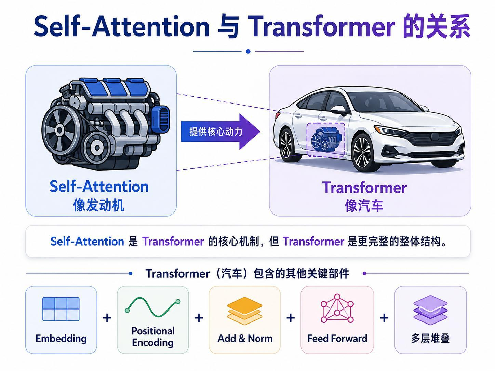
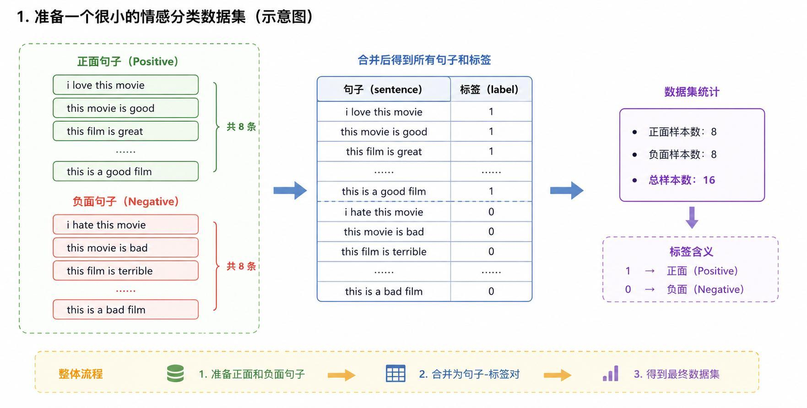
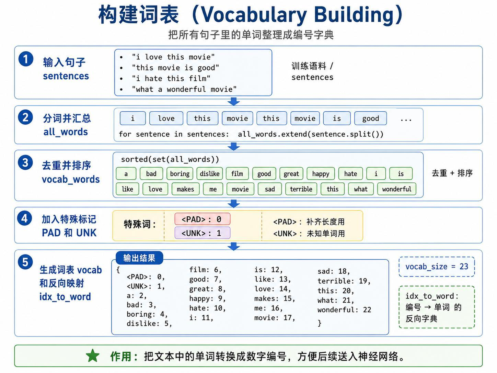
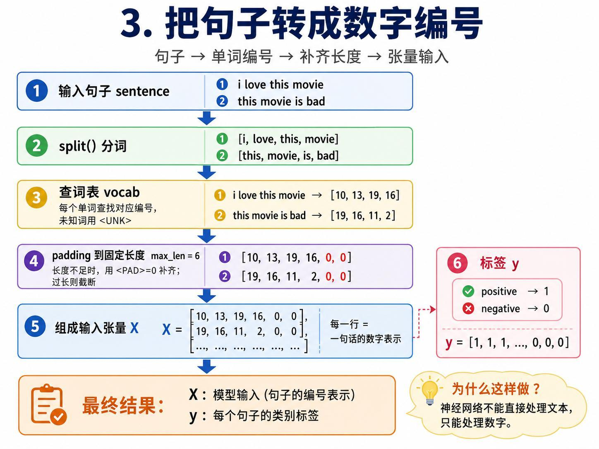
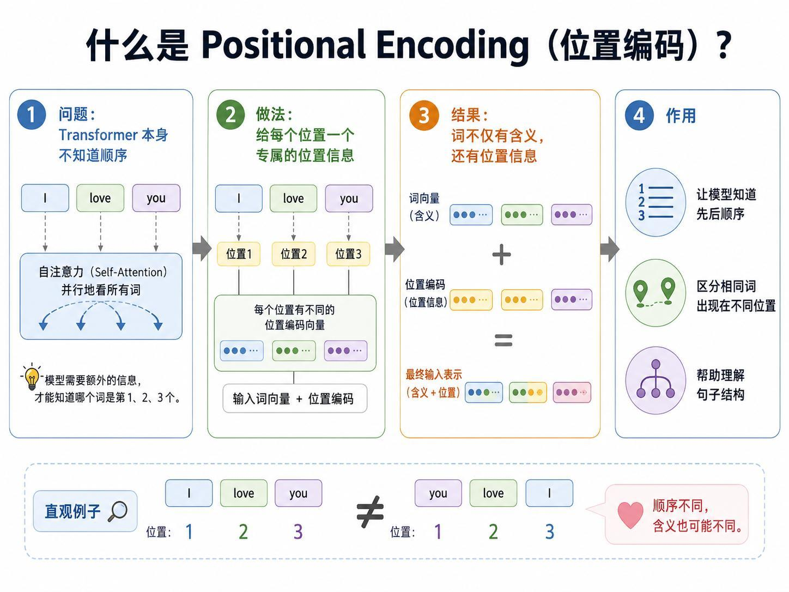
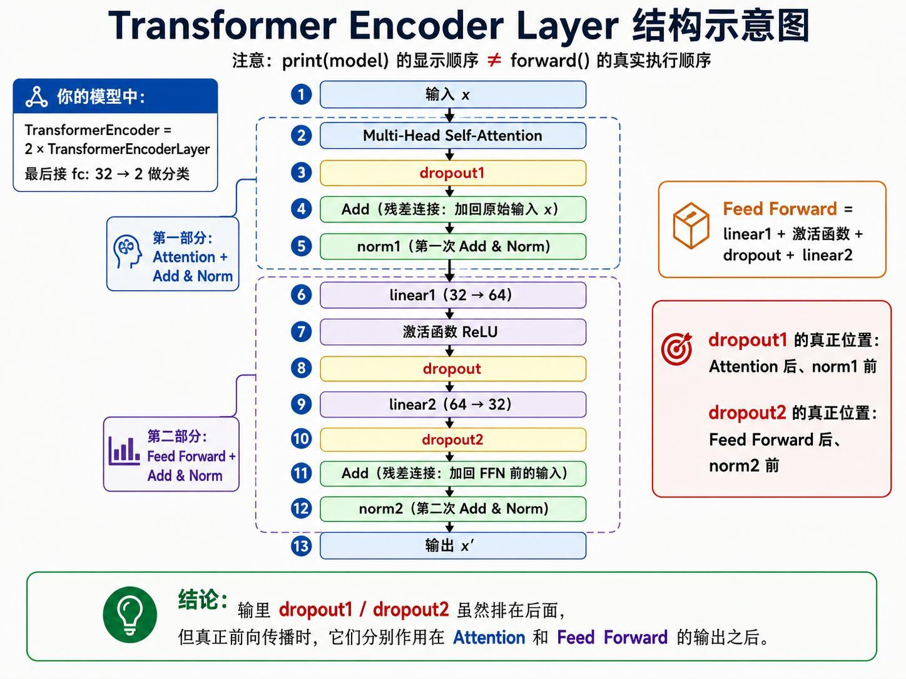
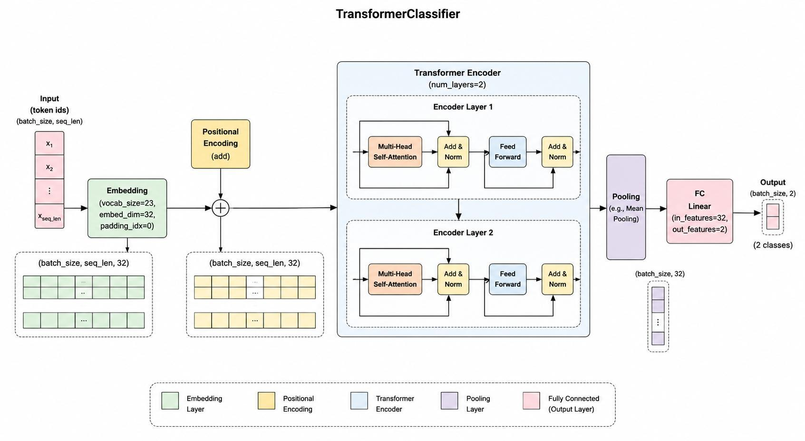
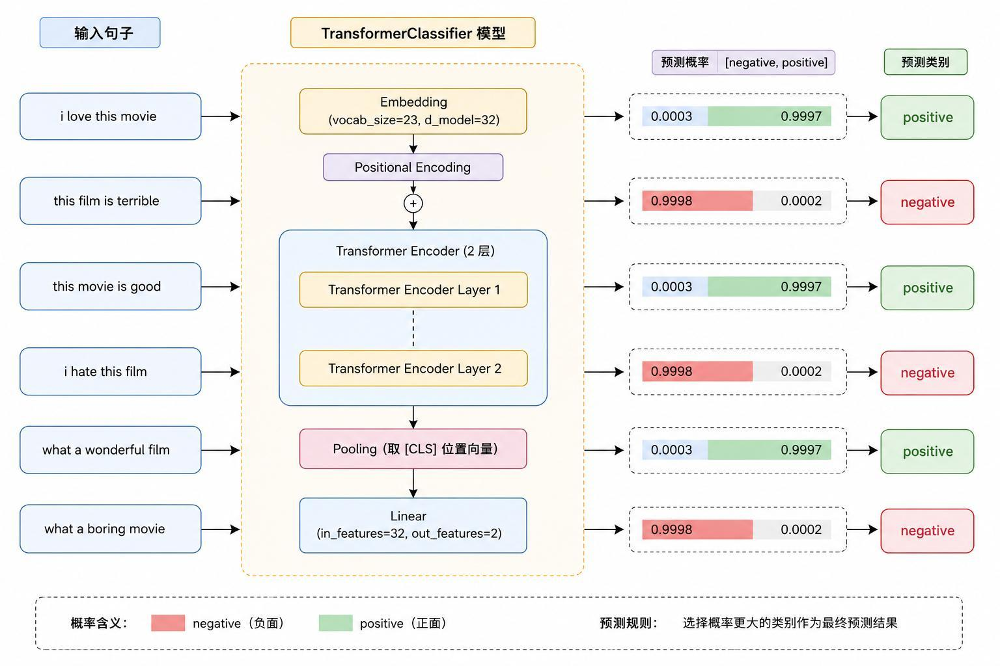
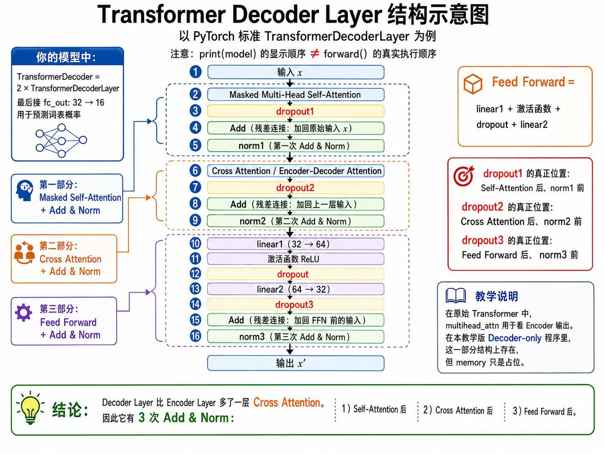
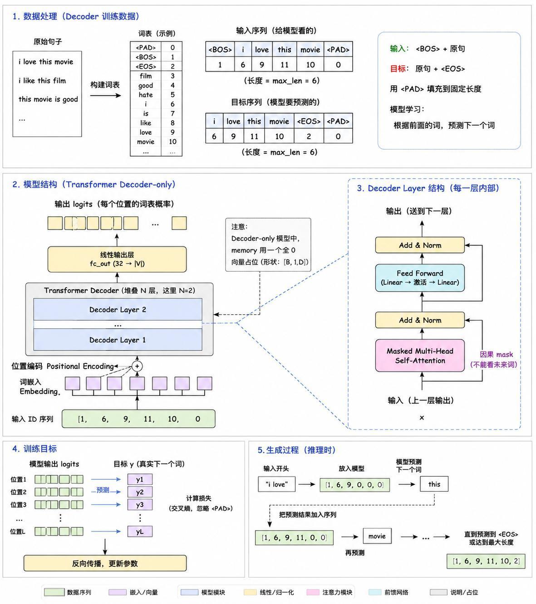

> 系列：神经网络与深度学习 · Lesson 16
> 视频主线：Self-Attention 回顾 → Encoder/Decoder → 分类数据处理 → Encoder 分类 → Decoder 生成 → 代码演示 → 边缘部署取舍

## 视频脉络

| 视频时间 | 讲解内容 |
|:---|:---|
| 00:00-02:23 | 回顾 RNN、LSTM、Self-Attention，引出 Transformer |
| 02:23-04:27 | Encoder、Decoder 及三类模型组合 |
| 04:29-05:04 | “发动机与汽车”比喻 |
| 05:05-07:10 | 初学阶段以“够用”为目标，把复杂模型先当黑箱使用 |
| 07:10-08:20 | 16 条情感数据、词表和句子编号 |
| 08:20-08:46 | Transformer 为什么需要位置编码 |
| 08:47-13:17 | Encoder Layer 和文本分类器完整流程 |
| 13:18-13:51 | 六条句子的分类结果展示 |
| 13:52-15:08 | Decoder、掩码自注意力与 Cross-Attention |
| 15:10-16:28 | 下一词训练目标和逐词生成 |
| 16:28-19:35 | TransformerClassifier 程序与参数演示 |
| 19:37-21:57 | Decoder-only 文本生成程序与输出 |
| 21:58-23:18 | 大模型使用、ARM 资源限制与后续课程安排 |

## 1. 从 Self-Attention 走向 Transformer
视频先回顾前几课的递进关系：

```text
RNN -> LSTM -> Self-Attention -> Transformer
```

RNN 和 LSTM 都通过序列步骤传递信息。上一课的 Self-Attention 则让每个词直接查看整句话，并按照相关程度融合其他词的信息。

老师再次使用上一课的句子：

```text
The animal did not cross the street because it was tired.
```

`it` 会更多关联 `animal` 和 `tired`，计算后得到一个包含上下文信息的新向量。Transformer 正是在这种自注意力机制之上搭建起来的。

## 2. Encoder 和 Decoder 分别做什么
Transformer 可以包含两个主要部分。

### 2.1 Encoder：读懂输入

老师把 Encoder 解释为“编码、读懂”。输入一句话，Encoder 将它转换为包含上下文的表示。

情感分类只需要理解输入并给出类别：

```text
输入句子 -> Encoder -> positive / negative
```

因此本课的第一条实战线只使用 Encoder。

### 2.2 Decoder：逐步生成输出

Decoder 负责向外生成内容。若任务只是从一个开头继续生成文本，可以只使用 Decoder：

```text
开头词或提示 -> Decoder -> 下一个词 -> 再预测下一个词
```

### 2.3 Encoder 与 Decoder 同时使用

有些任务既要读懂输入，又要根据输入生成输出，这时两部分都会使用。视频在本课只建立宏观印象，没有继续展开具体应用。

## 3. Self-Attention 是发动机，Transformer 是汽车


老师用汽车比喻二者关系：

- Self-Attention 像发动机，提供核心动力；
- Transformer 像整辆汽车，是更完整的系统；
- 汽车除发动机外还需要其他部件；
- Transformer 还包含 Embedding、Positional Encoding、Add & Norm、Feed Forward 和多层堆叠。

因此，“懂了 Self-Attention”不等于“懂了整个 Transformer”，但已经抓住了核心机制。

## 4. 初学 Transformer 要掌握到什么程度
视频专门用了两分钟说明学习策略。Transformer 涉及序列和数学运算，不像图像任务那样容易直观看见中间结果。老师给初学者的目标是“够用”：

1. 先知道 Self-Attention 是什么；
2. 知道它构成了 Transformer 的核心；
3. 知道 Encoder 用于理解、Decoder 用于生成；
4. 能运行或迁移已有模型；
5. 当前阶段不必把每个底层实现细节全部推完。

老师用 `printf` 举例：写 C 程序时，需要知道如何正确调用 `printf`，但不必先读完它内部的全部实现。同样，后续面对大模型时，可以先把复杂结构看成黑箱，在使用过程中逐步补齐原理。

这并不是说原理不重要，而是要根据当前学习阶段控制深度，避免因为一处公式没看懂就放弃整条路线。

## 5. 情感分类数据如何进入模型
视频的第一条实战线是一个很小的二分类任务。

### 5.1 数据集



数据共 16 条：

- 8 条正面句子，标签为 1；
- 8 条负面句子，标签为 0。

训练目标是让模型读入新句子后，判断它属于 positive 还是 negative。

### 5.2 构建词表



程序把所有句子按空格分词，汇总、去重并排序，然后加入两个特殊符号：

- `<PAD>`：把不同长度的句子补齐到固定长度；
- `<UNK>`：表示词表中不存在的未知词。

每个词得到唯一编号，讲义中的最终词表大小为 23。文本由此可以转换为神经网络能处理的整数序列。

### 5.3 编号、截断与 Padding



处理流程是：

```text
原始句子
  -> split 分词
  -> 查询 vocab 得到 token id
  -> 超长时截断
  -> 不足 max_len 时补 <PAD>
  -> 组成输入张量 X
```

本课示例将句子补齐到 `max_len=6`。标签张量 `y` 保存每句话的正负类别。

## 6. 为什么还需要位置编码
Self-Attention 可以并行查看所有词，但这种计算本身不会自动表达“谁在第 1 位、谁在第 2 位”。视频因此引入 Positional Encoding。



输入 Transformer 的表示由两部分相加：

```text
词向量：这个词是什么意思
位置编码：这个词位于什么位置
最终表示：含义 + 位置
```

老师用 `I love you` 与词序变化说明：词相同但顺序不同，句子含义可能改变。模型必须额外获得位置线索。

## 7. Encoder Layer 内部结构
本课的分类器只需要读懂句子，因此先看 Encoder。



视频按前向流程讲解一个 Encoder Layer。

### 7.1 Multi-Head Self-Attention

单头注意力用一种方式观察词语关系，多头注意力可以学习多种关系。老师用动物特征举例：

- 一个头可能更关注形状，例如 `big`；
- 另一个头可能更关注颜色，例如 `black`；
- 不同头得到不同关联信息，再共同形成表示。

本课分类模型使用 4 个注意力头。

### 7.2 Dropout

视频将 Dropout 解释为随机去掉部分连接，使网络不要过度依赖某些固定神经元，从而提高泛化能力。

### 7.3 残差连接

注意力输出经过 Dropout 后，再把进入该子层之前的原始输入加回来：

```text
子层输出 + 原输入
```

老师把这一步称为残差连接。Feed Forward 子层后还会再执行一次残差连接。

### 7.4 Norm

视频把 Norm 解释为让每层数据分布落在相近尺度，避免各层输入范围差异太大。Encoder 中注意力子层后一次，Feed Forward 子层后再一次。

### 7.5 Feed Forward

前馈网络由线性层、激活函数、Dropout 和另一个线性层组成。激活函数提供非线性变换。

一个 Encoder Layer 的主线因此是：

```text
Multi-Head Self-Attention
  -> Dropout
  -> Residual Add
  -> Norm
  -> Linear
  -> ReLU
  -> Dropout
  -> Linear
  -> Dropout
  -> Residual Add
  -> Norm
```

视频提醒：打印模型时各模块的显示顺序，不一定等于 `forward()` 中的真实执行顺序，应以前向代码为准。

## 8. TransformerClassifier 的完整数据流


本课模型的数据流是：

```text
token ids
  -> Embedding
  -> 加 Positional Encoding
  -> TransformerEncoderLayer 1
  -> TransformerEncoderLayer 2
  -> Pooling
  -> Linear(32 -> 2)
  -> positive / negative logits
```

视频中每个词使用 32 维向量表示，Encoder 堆叠 2 层。Encoder 输出仍保留每个位置的 32 维表示，因此还需 Pooling 汇总为句子向量，再用全连接层输出两个类别分数。

## 9. 分类结果展示


视频展示的测试方向包括：

| 输入 | 预测类别 |
|:---|:---|
| `i love this movie` | positive |
| `this film is terrible` | negative |
| `this movie is good` | positive |
| `i hate this film` | negative |
| `what a wonderful film` | positive |
| `what a boring movie` | negative |

这完成了只使用 Encoder 的情感分类示例：读入整句话，汇总上下文，再输出类别。

## 10. Decoder 为什么必须遮住未来词
Encoder 可以一次看到完整输入句子，但生成任务不一样。生成 `I love this movie` 时，模型必须逐词输出：

```text
I -> love -> this -> movie
```

预测 `love` 时不能偷看后面的 `this movie`，否则训练目标就失去意义。因此 Decoder 的 Self-Attention 需要因果掩码，只允许当前位置查看已经出现的词。



标准 Decoder Layer 比 Encoder Layer 多一个 Cross-Attention：

1. Masked Multi-Head Self-Attention；
2. Cross-Attention，读取 Encoder 输出；
3. Feed Forward。

每个子层后都有残差连接和 Norm，因此 Decoder Layer 共三次 Add & Norm。

老师对 Cross-Attention 的直观解释是：生成时既看 Encoder 已经读懂的输入，又看 Decoder 当前已生成的内容。如果是纯 Decoder-only 教学程序，讲义说明 Cross-Attention 结构可以保留，但 `memory` 只使用全零占位向量。

## 11. Decoder 的训练目标
训练生成模型时，同一句话被错开一位：

```text
输入：<BOS> I love this movie <PAD>
目标：I love this movie <EOS> <PAD>
```

模型在每个位置学习下一个词：

```text
看到 <BOS> -> 预测 I
看到 <BOS> I -> 预测 love
看到 <BOS> I love -> 预测 this
看到 <BOS> I love this -> 预测 movie
```

视频用小孩学说话作比喻：给出许多句子后，模型逐步学习某个词后面经常出现什么词。推理时先给一个开头，再一个词一个词向外生成。

## 12. 分类程序中的具体配置
视频最后进入代码，按实现顺序重新走一遍分类流程。

### 12.1 数据准备

- 样本数：16；
- 正面/负面：各 8 条；
- 构建词表；
- 将句子转换为编号；
- Padding 到固定长度；
- 加载标签。

### 12.2 模型参数

```text
embedding dimension = 32
attention heads     = 4
feed-forward dim    = 64
encoder layers      = 2
classes             = 2
```

前向传播中还会建立 Padding Mask，避免 `<PAD>` 位置参与注意力；之后执行 Embedding、位置编码、Encoder、Pooling 和全连接分类。

### 12.3 训练与测试

程序创建损失函数和优化器，训练 100 个 epoch，然后对新句子测试。视频展示 `I love this movie` 判为正面，`this film is terrible` 判为负面。

## 13. Decoder-only 文本生成程序


第二段程序把任务改为文本生成。

### 13.1 数据与词表

生成语料同样先构建词表，并加入 `<PAD>`、`<BOS>`、`<EOS>`。训练输入和目标错开一位，Padding 位置不参与损失。

### 13.2 模型输出

Decoder 的每个位置最终经过线性层，转换为整个词表上的 logits。模型不是直接输出一个固定词，而是为词表中每个候选词计算分数，再选择下一个词。

### 13.3 视频中的生成结果

训练后给出不同开头，模型展示了这些续写：

| 开头 | 生成结果 |
|:---|:---|
| `I` | `I dislike this film` |
| `I love` | `I love this movie` |
| `this movie` | `this movie is terrible` |
| `this film` | `this film is boring` |

这些输出受极小训练语料约束。老师借此说明宏观原理：模型根据已经看到的词，在学习到的概率分布中逐步选择后续词。更大的数据和更复杂的模型仍遵循这一基本生成方式。

## 14. 从教学小模型到实际部署
视频结尾回到工程目标。本课手工搭建的 Transformer 很小，作用是理解原理，而不是与成熟大模型比较能力。

老师给出的后续路线是：

1. 建立 Transformer 的宏观认识；
2. 后续直接使用基于 Transformer 训练好的模型；
3. 没有足够硬件和数据时，不必从零训练大模型；
4. 部署到 ARM 等资源受限设备时，应选择尺寸更小、资源需求更低的模型；
5. 后续课程将继续演示已有 Transformer 模型能完成哪些任务。

这也呼应前面的“够用”原则：理解接口、数据流和部署限制，再根据项目需要决定是否深入底层细节。

## 本课小结

- Transformer 以 Self-Attention 为核心，同时加入词嵌入、位置编码、前馈网络、残差连接、归一化和多层堆叠。
- Encoder 负责读懂输入，适合分类；Decoder 负责逐步输出，适合生成；两者也可以组合使用。
- Self-Attention 像发动机，Transformer 像整辆汽车。
- 文本进入模型前要经过分词、词表编号、截断和 Padding。
- Transformer 并行处理词语，因此需要位置编码补充顺序信息。
- Encoder Layer 由多头自注意力和前馈网络两部分组成，每部分后都有 Dropout、残差连接和 Norm。
- 本课分类器使用 32 维嵌入、4 个注意力头、64 维前馈层、2 个 Encoder Layer 和 2 个输出类别。
- Decoder 使用因果掩码防止查看未来词；标准 Encoder-Decoder 结构还包含 Cross-Attention。
- 生成训练把输入与目标错开一位，推理时从开头逐词扩展。
- 教学小模型用于理解原理，实际项目更常选择已有预训练模型，并根据 ARM 等设备资源选择规模。

## 复习题

1. 视频如何区分 Encoder 的“读”和 Decoder 的“写”？
2. 哪些任务可以只使用 Encoder，哪些任务可以只使用 Decoder？
3. 为什么说 Self-Attention 是发动机而 Transformer 是汽车？
4. 老师提出的“够用”学习策略具体指什么？
5. `<PAD>` 与 `<UNK>` 在词表中分别解决什么问题？
6. Transformer 已能并行观察全句，为什么还必须加入位置编码？
7. 多头注意力相对单头注意力增加了什么能力？
8. Encoder Layer 中两次残差连接分别位于哪里？
9. 本课 TransformerClassifier 使用了哪些主要超参数？
10. Decoder 的 Self-Attention 为什么必须使用因果掩码？
11. Cross-Attention 同时读取哪两部分信息？
12. 生成训练中输入序列和目标序列为什么错开一位？
13. 视频中的四种开头分别生成了什么句子？
14. 在资源受限 ARM 设备上，老师建议如何选择模型？

## 视频与讲义来源

- [Transformer 精讲：从基础原理到文本实战应用](https://www.bilibili.com/video/BV18kEY6tEJs)
- 本地讲义：`2026DL_lesson16 - 副本.pdf`

课程与讲义作者：海归博士 Dr. 魏。本文按视频时间线整理，讲义用于补充流程图、模型配置和配图；明显的语音识别错误已依据上下文与讲义术语订正。
