> 系列：神经网络与深度学习 · Lesson 17
> 视频主线：从原理转向模型使用 → Qwen 与 Hugging Face → Token 链路 → 本地环境和模型加载 → Chat Template → generate → 多轮对话与错误案例

## 视频脉络

| 视频时间 | 讲解内容 |
|:---|:---|
| 00:00-02:33 | 从 Transformer 原理转向本地大模型使用 |
| 02:47-05:08 | Qwen2.5-0.5B-Instruct 的命名、用途和工作链路 |
| 05:08-07:05 | Hugging Face 平台和 Token 的粗略概念 |
| 07:05-09:10 | 文本、Token、Token ID、Embedding 和模型输入 |
| 09:10-11:03 | Qwen 的 Decoder-only Transformer 结构 |
| 11:04-14:23 | 环境、安装脚本、启动脚本和本地模型目录 |
| 14:24-15:43 | 离线加载 Tokenizer 和模型 |
| 15:45-17:03 | system、user、assistant 与上下文 |
| 17:03-19:18 | Prompt、messages、Chat Template 和输入 ID |
| 19:19-22:32 | no_grad、generate 参数、截取回答和解码 |
| 22:32-23:45 | 多轮对话预览和自由落体错误回答 |
| 23:45-26:23 | Notebook 中完整运行单轮问答程序 |
| 26:24-29:50 | 模型大小、随机输出和交互式多轮对话 |
| 29:58-30:41 | 本地部署的意义与课程结论 |

## 1. 从自己搭结构转向使用预训练模型
前几课已经走过：

```text
RNN -> LSTM -> Self-Attention -> Transformer
```

老师认为到 Transformer 的基本原理为止，初学阶段已经建立了足够的结构认识。本课不再从底层训练一个大模型，而是像此前使用成熟卷积网络一样，直接调用别人已经训练好的模型。

视频特别区分了两种用法：

1. 访问在线聊天服务，把问题发到对方服务器；
2. 下载模型，在自己的电脑上编程并离线运行。

本课选择第二条路线。目标不只是“会打开网页聊天”，而是掌握本地加载和推理流程，使模型可以被自己的程序调用，并为以后部署到 ARM 等设备建立基础。

## 2. 本课使用哪个 Qwen 模型
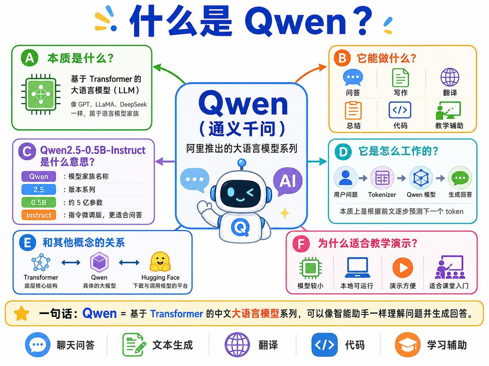

Qwen（通义千问）是阿里推出的大语言模型系列，本质上是基于 Transformer 的语言模型家族。它与 GPT、LLaMA、DeepSeek 等模型属于相近类别，都根据已有上下文逐步预测后续 Token。

本课使用：

```text
Qwen2.5-0.5B-Instruct
```

视频逐段解释名称：

- `Qwen`：模型家族；
- `2.5`：版本系列；
- `0.5B`：约 5 亿参数；
- `Instruct`：经过指令微调，适合问答式使用。

它可以用于问答、写作、总结、翻译、代码和学习辅助。本课选择 0.5B 版本，是因为模型相对较小，便于课堂演示和本地运行。

宏观工作流程是：

```text
用户问题 -> Tokenizer -> Qwen 模型 -> 逐 Token 生成回答
```

## 3. Hugging Face 在流程中的位置
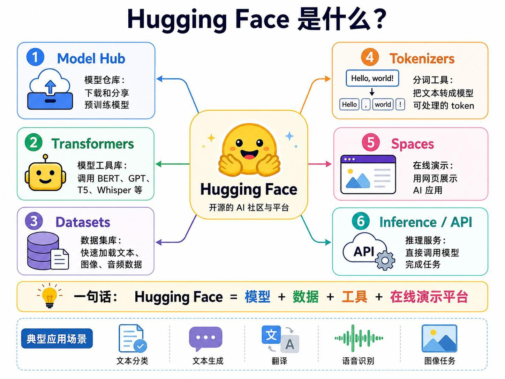

老师从 Hugging Face 下载已经训练好的 Qwen 模型，之后运行时直接从本地目录加载，不再重复联网下载。

视频提到的平台组成包括：

- Model Hub：保存和分享预训练模型；
- Transformers：加载和调用模型的工具库；
- Datasets：数据集工具；
- Tokenizers：文本分词和编号工具。

讲义还列出了 Spaces 和 Inference/API。对本课最关键的是 Model Hub、Transformers 和 Tokenizer：下载模型，加载模型，把文本转换成模型输入。

视频在这里还解释了按 Token 计量的概念。Token 与日常理解的“字数”或“单词数”不是一一对应，因此服务费用和上下文长度通常按 Token 而不是按句子计算。

## 4. Token 到底是什么
Token 是模型处理文本的基本片段，可以是一个字、一个词，也可能是词的一部分。例如英文 `unbelievable` 可能被拆成多个 Token，而一个常见汉字也可能单独成为 Token。

老师用一个粗略例子说明：日常理解的约 70 个英文单词，分词后可能得到约 100 个 Token。这只是帮助建立数量感，不是固定换算公式。

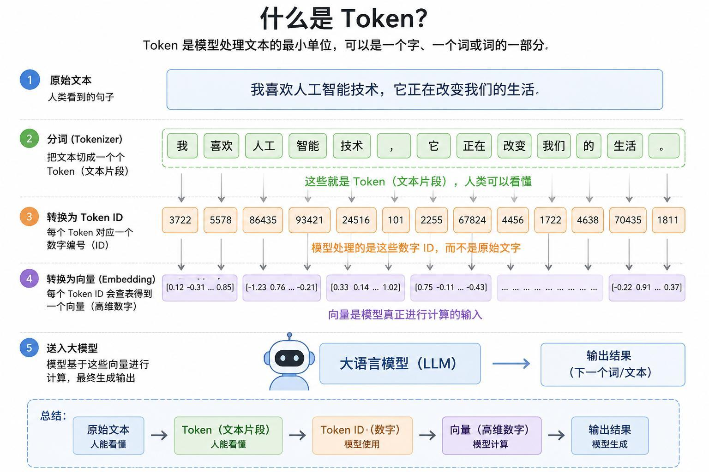

完整转换链路是：

```text
原始文本
  -> Tokenizer 切成 Token
  -> 每个 Token 映射为 Token ID
  -> Embedding 查表得到高维向量
  -> 向量进入大语言模型
  -> 模型生成新的 Token ID
  -> Tokenizer 解码为文本
```

人可以读懂 Token 文本片段，计算机实际接收的是 Token ID，Transformer 内部计算的则是 Embedding 向量。

## 5. Qwen 的模型结构
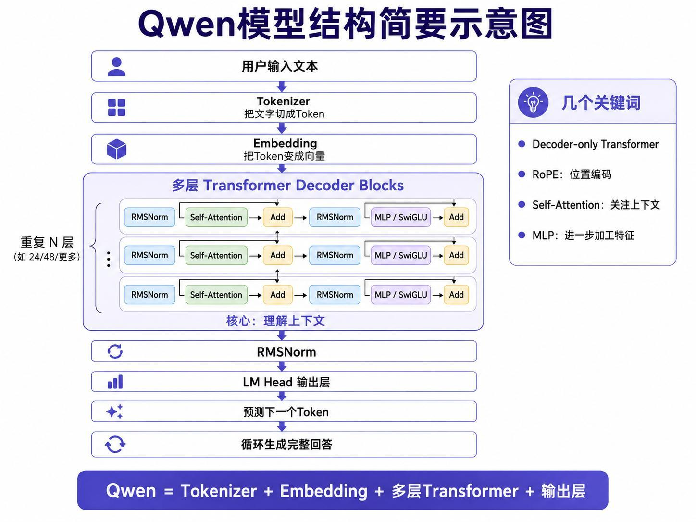

Qwen 用于持续生成文本，因此采用 Decoder-only Transformer。讲义按数据流展示：

```text
用户输入
  -> Tokenizer
  -> Embedding
  -> 多层 Transformer Decoder Block
  -> RMSNorm
  -> LM Head
  -> 下一个 Token
  -> 循环生成完整回答
```

每个 Decoder Block 包含几个关键词：

- RoPE：提供位置信息；
- RMSNorm：归一化；
- Self-Attention：关注上下文；
- MLP/SwiGLU：进一步加工特征；
- Add：残差连接。

这些 Block 会重复很多层。视频不要求在本课逐层推导，重点是知道 Qwen 仍然沿用了上一课的 Transformer 生成主线。

## 6. 本地环境、脚本和目录
视频进入实操后，先整理运行环境，而不是直接写问答代码。

### 6.1 独立环境

老师创建一个用于大语言模型的独立环境，安装 `transformers`、PyTorch 等依赖。课程提供安装脚本，并通过 Anaconda Prompt 执行。

### 6.2 安装脚本与启动脚本

- 安装脚本：创建环境并安装依赖；
- 启动脚本：激活环境、设置工作目录并打开开发入口；
- Notebook：保存课堂示例程序；
- models/hf_cache：保存下载到本地的模型。

老师备课时已经下载多个模型，总目录达到数 GB；单个小模型也接近 1 GB。这一段说明“大模型中的小模型”依然有明显存储和内存成本。

## 7. 只从本地加载 Tokenizer
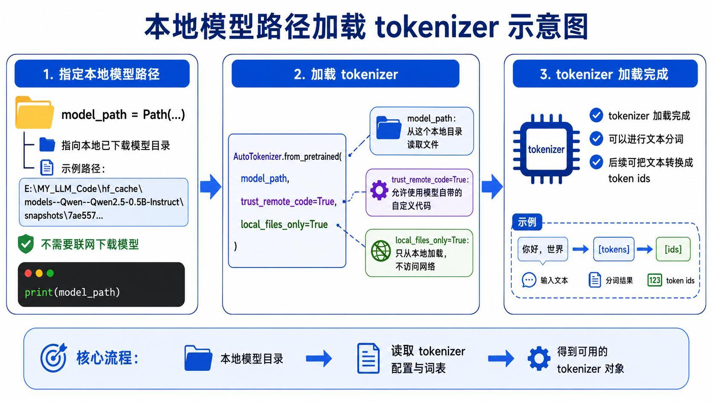

首先把模型快照目录保存为 `model_path`，然后加载 Tokenizer：

```python
from pathlib import Path
from transformers import AutoTokenizer

model_path = Path("本地 Qwen 模型快照目录")

tokenizer = AutoTokenizer.from_pretrained(
    model_path,
    trust_remote_code=True,
    local_files_only=True,
)
```

视频强调 `local_files_only=True`：只访问本地文件，不在运行时联网。加载完成后，Tokenizer 就能把输入文本转成 Qwen 使用的 Token ID。

## 8. 自动选择设备并加载模型
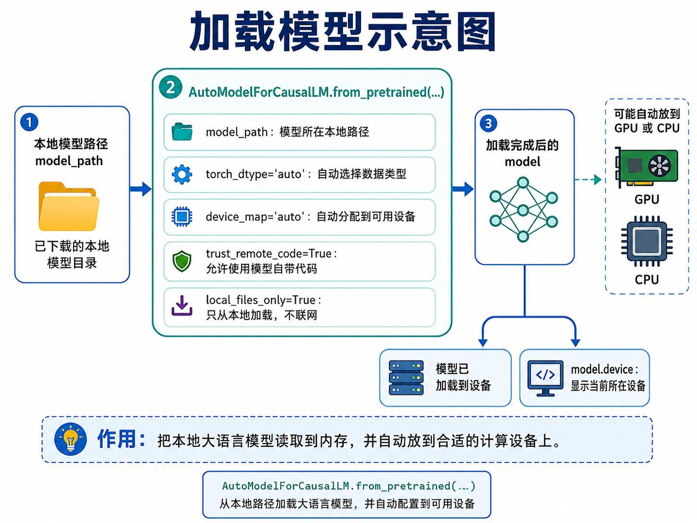

模型使用因果语言模型接口加载：

```python
from transformers import AutoModelForCausalLM

model = AutoModelForCausalLM.from_pretrained(
    model_path,
    torch_dtype="auto",
    device_map="auto",
    trust_remote_code=True,
    local_files_only=True,
)
```

- `torch_dtype="auto"`：根据模型和设备选择数据类型；
- `device_map="auto"`：自动分配可用设备；
- 教师电脑检测到 GPU，因此模型最终位于 `cuda:0`；
- 没有可用 GPU 时也可能加载到 CPU，但速度与内存占用会不同。

## 9. system、user、assistant 与上下文
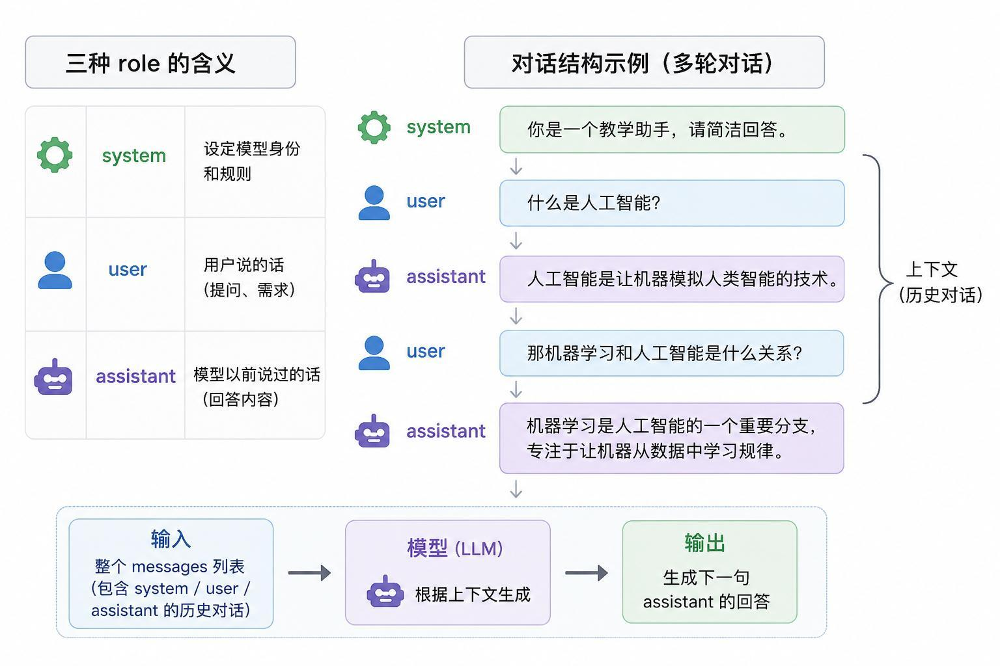

视频把聊天消息分成三种角色：

| role | 作用 |
|:---|:---|
| `system` | 设置模型身份、回答风格和规则 |
| `user` | 用户提出的问题或需求 |
| `assistant` | 模型已经给出的回答 |

示例中，`system` 指定“你是一个教学助手，请简洁回答”，`user` 询问“什么是人工智能”。如果随后继续追问机器学习与人工智能的关系，就要把前一轮 user/assistant 内容继续放入消息列表，形成上下文。

## 10. Prompt、messages 与 Chat Template
Prompt 是用户希望模型完成的任务，例如：

```text
请用一句话介绍什么是人工智能。
```

程序先构造消息：

```python
messages = [
    {
        "role": "system",
        "content": "你是一个教学助手，请用简洁清楚的语言回答问题。",
    },
    {
        "role": "user",
        "content": prompt,
    },
]
```

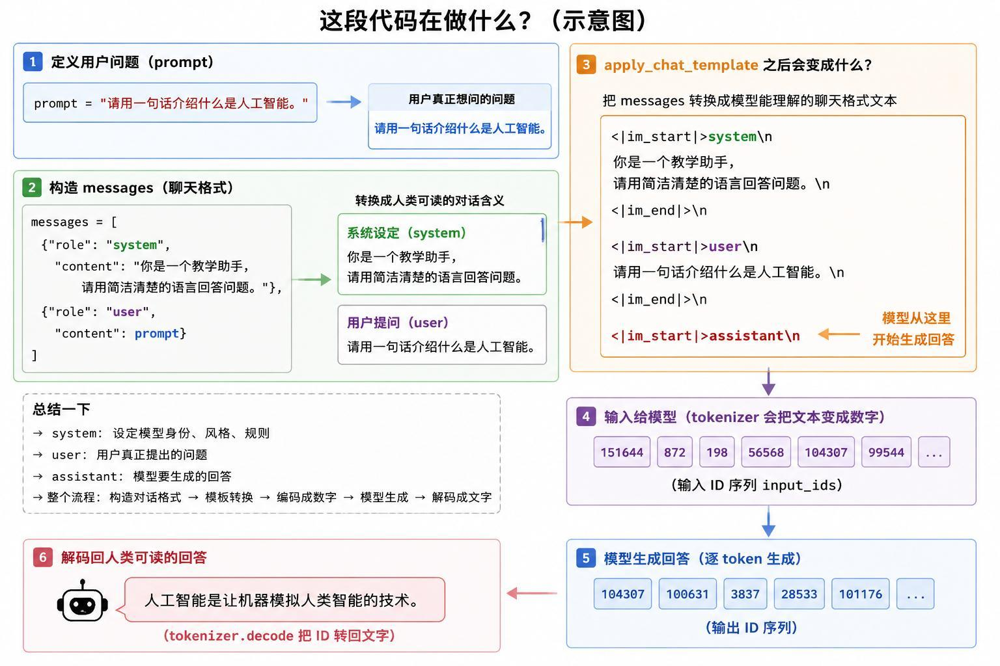

`messages` 不能直接作为模型输入，需要使用模型自带的 Chat Template 转换为带特殊标记的文本：

```python
text = tokenizer.apply_chat_template(
    messages,
    tokenize=False,
    add_generation_prompt=True,
)

inputs = tokenizer(
    [text],
    return_tensors="pt",
).to(model.device)
```

`add_generation_prompt=True` 会在模板末尾放置 assistant 开始标记，告诉模型从这里生成回答。随后 Tokenizer 再把模板文本转换为 `input_ids`、`attention_mask` 等张量。

## 11. generate 的完整推理过程
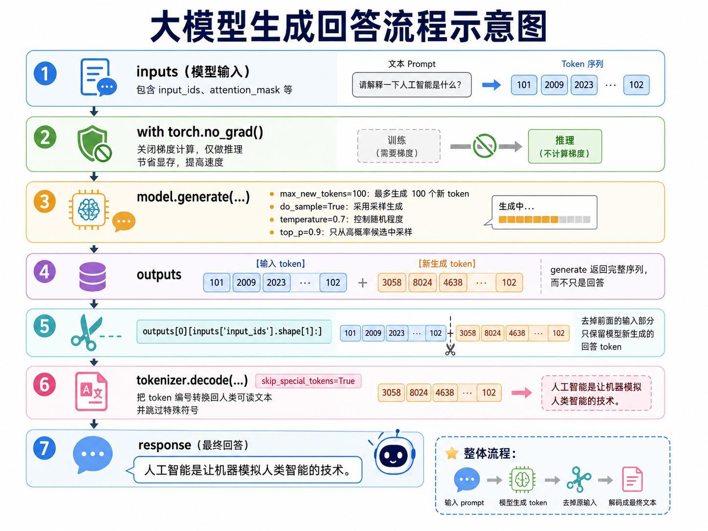

### 11.1 关闭梯度

本课只做推理，不训练模型，因此使用：

```python
with torch.no_grad():
```

这样不保存反向传播所需梯度，减少显存占用。

### 11.2 生成参数

```python
outputs = model.generate(
    **inputs,
    max_new_tokens=100,
    do_sample=True,
    temperature=0.7,
    top_p=0.9,
)
```

视频逐项解释：

- `max_new_tokens=100`：回答最多新增 100 个 Token；
- `do_sample=True`：使用采样而非固定选择；
- `temperature=0.7`：控制随机和发散程度；
- `top_p=0.9`：优先从累计概率较高的候选中采样，减少极低概率词被选中。

### 11.3 只保留新增回答

`generate()` 返回“原输入 + 新生成 Token”的完整序列，所以要裁掉输入长度：

```python
generated_ids = outputs[0][inputs["input_ids"].shape[1]:]

response = tokenizer.decode(
    generated_ids,
    skip_special_tokens=True,
)
```

最终流程是：Prompt 转输入 Token，模型生成后续 Token，裁掉原问题，再解码为人类可读回答。

## 12. 单轮问答的实际结果
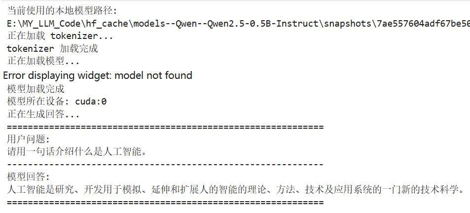

视频运行时，模型从本地路径完成 Tokenizer 和权重加载，设备显示为 `cuda:0`。问题是：

```text
请用一句话介绍什么是人工智能。
```

模型回答将人工智能概括为研究、开发用于模拟、延伸和扩展人的智能的理论、方法、技术及应用系统。老师借这个结果确认单轮推理流程已经跑通。

## 13. 多轮对话既展示能力，也暴露问题
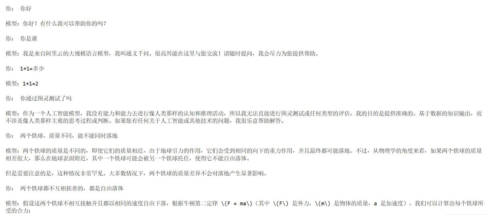

### 13.1 预先保存的对话

老师展示了这些问题：

- “你好”；
- “你是谁”；
- “1+1 等于多少”；
- “你通过图灵测试了吗”；
- “两个质量不同的铁球能不能同时落地”。

前几条回答基本正常，但自由落体问题出现明显瑕疵。模型声称一个铁球可能被另一个“托住”，与题目条件不符。老师继续补充“两球互不接触，都是自由落体”，试图让模型重新分析。

这段不能省略，因为它说明本地模型能生成流畅文字，不等于每个结论都可靠。

### 13.2 课堂中的交互运行

后面老师又现场运行一个交互循环：

1. 输入 `Hello`，模型用英文回答；
2. 要求讲中文，模型切换到中文；
3. 询问 `1+1`，模型回答 2；
4. 追问“什么情况下 1+1 等于 3”，模型开始给出自相矛盾的苹果例子；
5. 询问图灵测试时，回答相对清楚。

视频明确指出生成具有随机性。同一 Prompt 在不同运行中可能得到不同回答，而 0.5B 小模型的推理和事实可靠性也有限。

### 13.3 多轮上下文的程序结构

交互程序每次从键盘读取输入，把新一轮 `user` 消息追加到历史；模型回答后再追加 `assistant` 消息。下一轮重新应用 Chat Template，模型因此能看到此前对话。

## 14. 模型大小与本地部署意义
视频检查本地文件后发现，Qwen2.5-0.5B-Instruct 接近 900 MB，约 1 GB。虽然它在大模型家族中较小，但对个人电脑和嵌入式设备仍不是可以忽略的资源。

课程结论不是“网页上问一句话”，而是：

```text
下载模型 -> 本地加载 -> 编程构造输入 -> 本地推理 -> 把模型接入自己的应用
```

老师认为代码本身并不长，真正需要理解的是 Tokenizer、模板、模型输入、生成参数和解码之间的关系。掌握这条链路后，模型才能在自己的程序中工作，并进一步讨论离线部署或边缘设备适配。

## 本课小结

- 本课从 Transformer 原理学习转入预训练模型使用，目标是本地离线运行 Qwen。
- `Qwen2.5-0.5B-Instruct` 表示 Qwen 2.5 系列、约 5 亿参数、指令微调版本。
- Hugging Face 提供模型仓库、Transformers、数据集和 Tokenizer 等工具。
- 文本先变成 Token，再变成 Token ID 和 Embedding 向量，最后进入 Decoder-only Transformer。
- 本地加载通过 `model_path`、`local_files_only=True`、自动数据类型和自动设备映射完成。
- `system` 设置规则，`user` 表示用户输入，`assistant` 表示模型回答和历史上下文。
- `apply_chat_template()` 把结构化消息变成模型要求的聊天格式。
- `generate()` 负责生成 Token；`max_new_tokens`、`temperature` 和 `top_p` 控制长度与采样。
- 返回序列包含原输入，必须裁掉输入部分再解码回答。
- 多轮对话通过持续保存 user/assistant 历史实现。
- 课堂演示同时出现正确回答和明显错误，说明小模型输出需要核查。
- 0.5B 模型接近 1 GB，本地和嵌入式部署仍要考虑存储、内存和计算资源。

## 复习题

1. 本课为什么不再从头训练 Transformer，而改用预训练 Qwen？
2. 在线聊天服务与本地离线推理有什么区别？
3. `Qwen2.5-0.5B-Instruct` 的四部分分别表示什么？
4. Hugging Face 在本课流程中承担什么作用？
5. Token、Token ID 和 Embedding 有什么区别？
6. Qwen 的 Decoder-only 数据流包含哪些模块？
7. `local_files_only=True` 为什么适合本课目标？
8. `system`、`user`、`assistant` 各自保存什么内容？
9. `apply_chat_template()` 解决了什么问题？
10. 为什么推理要放在 `torch.no_grad()` 中？
11. `temperature=0.7` 和 `top_p=0.9` 分别影响什么？
12. 为什么要从 `outputs` 中裁掉原输入 Token？
13. 多轮对话如何让模型保留上下文？
14. 自由落体和 `1+1=3` 示例暴露了小模型的什么问题？
15. 0.5B 模型仍接近 1 GB，这对边缘部署意味着什么？

## 视频与讲义来源

- [拆解通义千问 Qwen 大模型工作原理：代码与流程全解析](https://www.bilibili.com/video/BV1UJEr6LEw1)
- 本地讲义：`2026DL_lesson17.pdf`

课程与讲义作者：海归博士 Dr. 魏。本文按视频时间线整理，讲义用于核对模型名称、代码参数、流程和配图；明显的语音识别错误已依据上下文与讲义术语订正。
